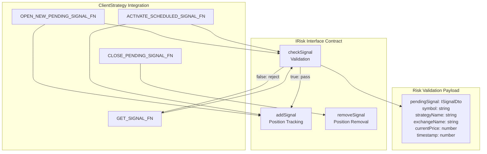
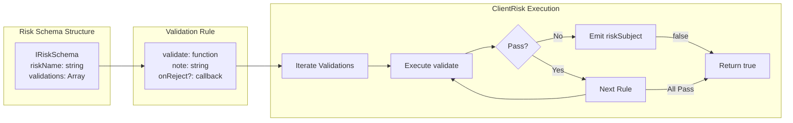
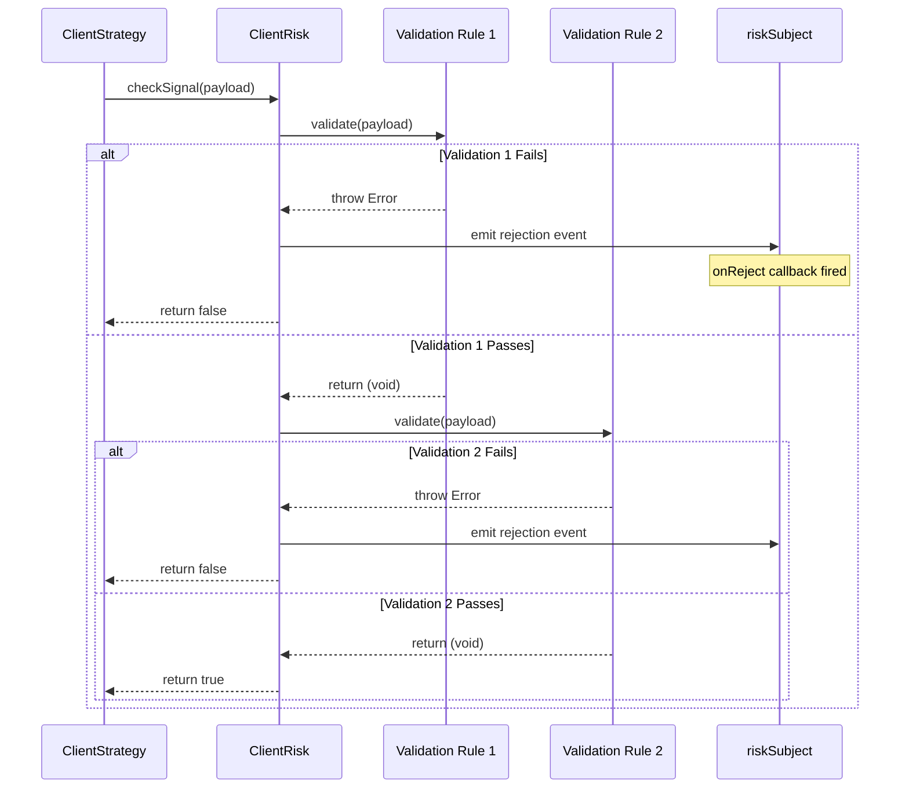
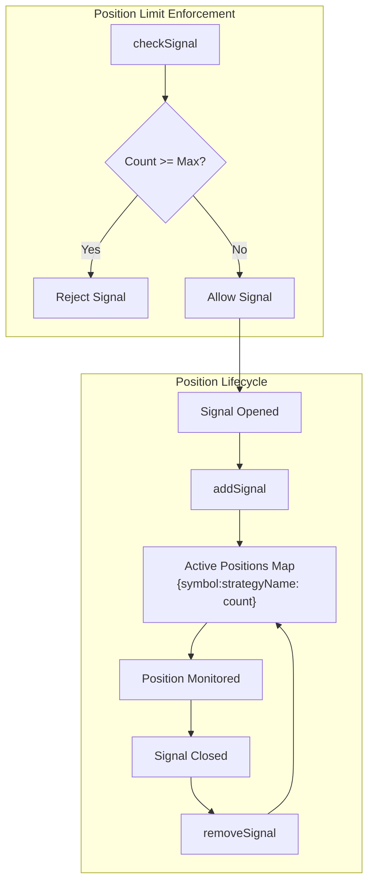
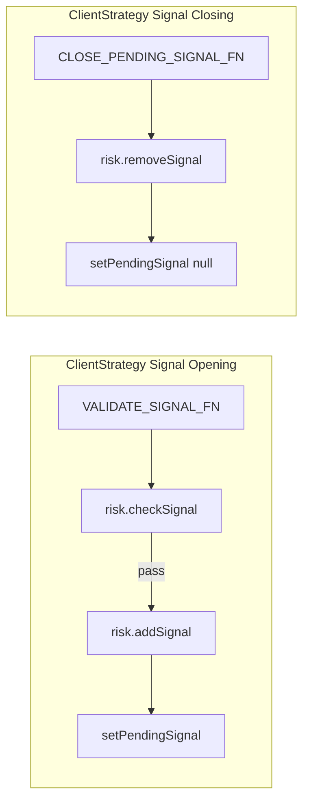
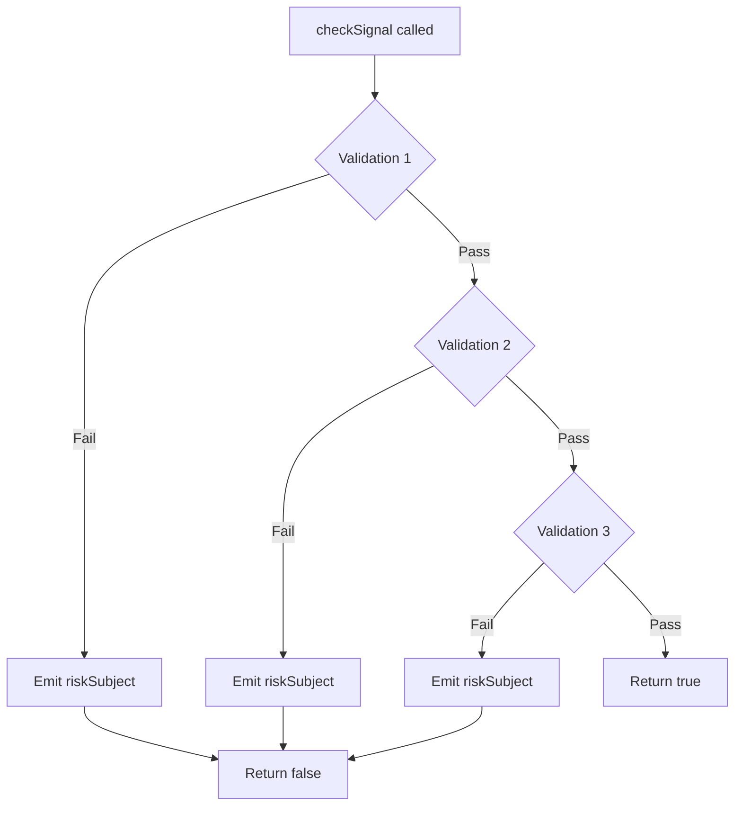
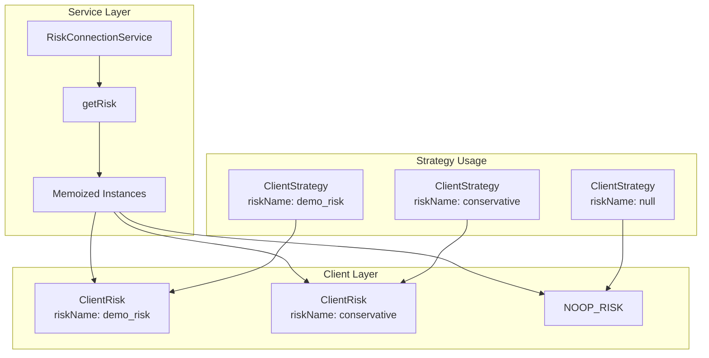
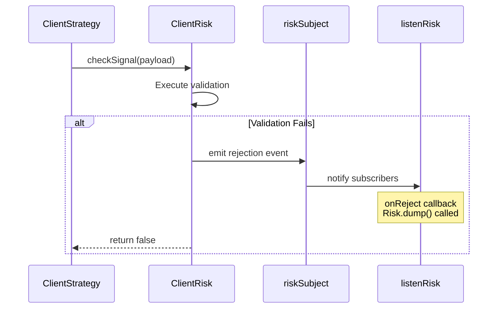

# ClientRisk

<details>
<summary>Relevant source files</summary>

The following files were used as context for generating this wiki page:

- [README.md](README.md)
- [src/client/ClientStrategy.ts](src/client/ClientStrategy.ts)
- [src/config/emitters.ts](src/config/emitters.ts)
- [src/function/event.ts](src/function/event.ts)
- [src/index.ts](src/index.ts)
- [src/interfaces/Strategy.interface.ts](src/interfaces/Strategy.interface.ts)
- [test/e2e/defend.test.mjs](test/e2e/defend.test.mjs)
- [test/index.mjs](test/index.mjs)
- [types.d.ts](types.d.ts)

</details>


## Purpose and Scope

`ClientRisk` is the core implementation of the `IRisk` interface responsible for **signal validation** and **position tracking** within the `backtest-kit` framework. This class executes user-defined validation rules, enforces risk management policies, and maintains active position counts across trading strategies.

This document covers the internal implementation of `ClientRisk` and how it integrates with the signal lifecycle. For information about:
- Defining risk schemas via `addRisk()`, see [Risk Schemas](#5.4)
- The broader risk management system, see [Risk Management](#12)
- Position tracking mechanisms, see [Position Tracking](#12.3)

---

## IRisk Interface Contract

`ClientRisk` implements the `IRisk` interface, which defines three core methods for risk management:

| Method | Purpose | When Called |
|--------|---------|-------------|
| `checkSignal` | Validates pending signal against risk rules | Before opening position (immediate or scheduled) |
| `addSignal` | Tracks new active position | After signal validation passes |
| `removeSignal` | Removes position from tracking | When signal closes (TP/SL/timeout) |



**Sources:** [src/client/ClientStrategy.ts:376-387](), [src/client/ClientStrategy.ts:712-729](), [src/client/ClientStrategy.ts:742-745](), [src/client/ClientStrategy.ts:995-998]()

---

## Risk Schema Execution Model

`ClientRisk` wraps user-defined risk schemas registered via `addRisk()`. Each schema contains an array of validation rules that are executed sequentially:



**Sources:** [demo/live/src/index.mjs:37-78](), [demo/backtest/src/index.mjs:37-82]()

---

## Signal Validation Flow (checkSignal)

The `checkSignal` method is the primary entry point for risk validation. It receives a validation payload and executes all registered validation rules:

### Validation Payload Structure

```typescript
interface ICheckSignalPayload {
  pendingSignal: ISignalDto;        // Signal to validate
  symbol: string;                   // Trading pair (e.g., "BTCUSDT")
  strategyName: StrategyName;       // Strategy identifier
  exchangeName: ExchangeName;       // Exchange identifier
  currentPrice: number;             // Current VWAP price
  timestamp: number;                // Unix timestamp (ms)
}
```

### Validation Execution Sequence



**Sources:** [src/client/ClientStrategy.ts:376-387](), [src/client/ClientStrategy.ts:712-729]()

---

## Validation Rule Examples

Risk schemas define validation functions that throw errors on failure. Common validation patterns include:

### Distance Validation

Ensures take profit and stop loss are sufficiently distant from entry price to avoid micro-profits and instant stop-outs:

```javascript
// Example: Minimum TP distance validation
{
  validate: ({ pendingSignal, currentPrice }) => {
    const { priceOpen = currentPrice, priceTakeProfit, position } = pendingSignal;
    const tpDistance = position === "long"
      ? ((priceTakeProfit - priceOpen) / priceOpen) * 100
      : ((priceOpen - priceTakeProfit) / priceOpen) * 100;
    
    if (tpDistance < 1) {
      throw new Error(`TP distance ${tpDistance.toFixed(2)}% < 1%`);
    }
  },
  note: "TP distance must be at least 1%"
}
```

### Risk-Reward Ratio Validation

Ensures favorable risk-reward ratio:

```javascript
// Example: Minimum 1:2 RR ratio validation
{
  validate: ({ pendingSignal, currentPrice }) => {
    const { priceOpen = currentPrice, priceTakeProfit, priceStopLoss, position } = pendingSignal;
    
    const reward = position === "long"
      ? priceTakeProfit - priceOpen
      : priceOpen - priceTakeProfit;
    
    const risk = position === "long"
      ? priceOpen - priceStopLoss
      : priceStopLoss - priceOpen;
    
    const rrRatio = reward / risk;
    if (rrRatio < 2) {
      throw new Error(`RR ratio ${rrRatio.toFixed(2)} < 2:1`);
    }
  },
  note: "Risk-Reward ratio must be at least 1:2"
}
```

**Sources:** [demo/live/src/index.mjs:40-78](), [demo/backtest/src/index.mjs:40-82]()

---

## Position Tracking (addSignal / removeSignal)

`ClientRisk` maintains active position counts per symbol-strategy pair to enforce concurrent position limits:



### Position Tracking Methods

| Method | Signature | Purpose |
|--------|-----------|---------|
| `addSignal` | `(symbol: string, ctx: {strategyName, riskName}) => Promise<void>` | Increments position counter for symbol-strategy pair |
| `removeSignal` | `(symbol: string, ctx: {strategyName, riskName}) => Promise<void>` | Decrements position counter when signal closes |

### Integration Points



**Sources:** [src/client/ClientStrategy.ts:742-745](), [src/client/ClientStrategy.ts:867-870](), [src/client/ClientStrategy.ts:995-998]()

---

## Fail-Fast Validation Pattern

`ClientRisk` implements a **fail-fast** validation pattern where the first validation failure immediately stops execution:



This pattern ensures:
1. **Early termination** on first rule violation
2. **Single rejection event** emitted per validation attempt
3. **Diagnostic information** via `note` field in validation rule
4. **Optional callbacks** via `onReject` for custom handling

**Sources:** [src/client/ClientStrategy.ts:374-387]()

---

## NOOP Risk Implementation

When a strategy has no `riskName` configured, `ClientRisk` is replaced with a no-op implementation that always passes validation:

```typescript
const NOOP_RISK: IRisk = {
  checkSignal: () => Promise.resolve(true),
  addSignal: () => Promise.resolve(),
  removeSignal: () => Promise.resolve(),
}
```

This allows strategies to operate without risk management while maintaining the same interface contract.

**Sources:** [src/lib/services/connection/StrategyConnectionService.ts:26-30](), [src/lib/services/connection/StrategyConnectionService.ts:91]()

---

## Integration with RiskConnectionService

`ClientRisk` instances are managed by `RiskConnectionService`, which provides routing and memoization:



The connection service ensures:
- **One instance per risk profile** via memoization
- **Efficient routing** based on `riskName` string
- **Fallback to NOOP** when no risk profile assigned

**Sources:** [src/lib/services/connection/StrategyConnectionService.ts:60](), [src/lib/services/connection/StrategyConnectionService.ts:91]()

---

## Risk Event Emission

When validation fails, `ClientRisk` emits rejection events through the `riskSubject` event emitter:



### Risk Event Structure

```typescript
interface IRiskEvent {
  symbol: string;
  strategyName: StrategyName;
  exchangeName: ExchangeName;
  pendingSignal: ISignalDto;
  currentPrice: number;
  timestamp: number;
  rejectionReason: string;  // Error message from validation
  validationNote: string;    // "note" field from validation rule
}
```

**Sources:** [demo/live/src/index.mjs:131-133](), [demo/backtest/src/index.mjs:129-131]()

---

## Summary

`ClientRisk` serves as the **gatekeeper** for signal execution, enforcing user-defined risk policies before positions are opened. Key characteristics:

| Aspect | Implementation |
|--------|----------------|
| **Interface** | Implements `IRisk` with three methods |
| **Validation Model** | Sequential execution with fail-fast pattern |
| **Position Tracking** | Maintains active position counts per symbol-strategy |
| **Integration** | Called by `ClientStrategy` during signal lifecycle |
| **Event System** | Emits rejection events through `riskSubject` |
| **Flexibility** | Supports custom validation logic via schemas |
| **Fallback** | NOOP implementation when no risk profile assigned |

The separation of `ClientRisk` from dependency injection allows risk logic to be **pure, testable, and reusable** across different execution contexts (backtest, live, walker).

**Sources:** [src/client/ClientStrategy.ts:1-330](), [src/lib/services/connection/StrategyConnectionService.ts:26-98]()