# Reporting and Analytics

This document describes the reporting and analytics capabilities of the backtest-kit framework. The system provides markdown-based reports for both backtest and live trading modes, accumulating signal events and calculating performance statistics.

For information about signal lifecycle and PnL calculations that feed into reports, see [Signal Lifecycle](23_Signal_Lifecycle.md). For details on the public API methods to retrieve reports, see [Backtest API](10_Backtest_API.md) and [Live Trading API](11_Live_Trading_API.md).

## Overview

The reporting system consists of two specialized services that passively observe signal events and accumulate them for analysis:

- **BacktestMarkdownService**: Accumulates only closed signals from backtest execution
- **LiveMarkdownService**: Accumulates all tick events (idle, opened, active, closed) from live trading

Both services operate independently from the main execution flow, subscribing to signal events via event emitters and maintaining isolated storage per strategy. Reports are generated on-demand and can be exported to markdown files.




## Service Architecture

### BacktestMarkdownService

The `BacktestMarkdownService` class is designed for post-execution analysis of backtest results. It only processes closed signals, ignoring opened and active states to focus on completed trades.

| Feature | Implementation |
|---------|---------------|
| **Event Source** | `signalBacktestEmitter` |
| **Event Types** | Only `closed` actions |
| **Storage Model** | Accumulates all closed signals chronologically |
| **Default Output Path** | `./logs/backtest/{strategyName}.md` |
| **Initialization** | Automatic via `singleshot` decorator |

The service maintains a memoized `ReportStorage` instance per strategy name, ensuring isolated data collection when multiple strategies run concurrently. The storage accumulates `IStrategyTickResultClosed` objects in an internal array.


### LiveMarkdownService

The `LiveMarkdownService` class provides operational visibility into live trading activity. Unlike the backtest service, it captures all tick events to provide a complete audit trail.

| Feature | Implementation |
|---------|---------------|
| **Event Source** | `signalLiveEmitter` |
| **Event Types** | `idle`, `opened`, `active`, `closed` |
| **Storage Model** | Updates existing events by `signalId` for active/closed |
| **Default Output Path** | `./logs/live/{strategyName}.md` |
| **Initialization** | Automatic via `singleshot` decorator |
| **Statistics** | Win rate, average PNL, W/L counts |

The service uses a more sophisticated storage mechanism that replaces existing events with the same `signalId`, ensuring the report shows the latest state of each signal. This prevents duplicate entries when a signal transitions from `active` to `closed`.


## Report Structure

### Column Configuration

Both services define their reports using a `Column` interface that specifies extraction and formatting logic:


### Backtest Report Columns

The backtest report focuses on completed trade analysis with the following columns:

| Column | Format | Source |
|--------|--------|--------|
| Signal ID | Plain text | `data.signal.id` |
| Symbol | Plain text | `data.signal.symbol` |
| Position | Uppercase | `data.signal.position` |
| Note | Plain text or "N/A" | `data.signal.note ?? "N/A"` |
| Open Price | Fixed 8 decimals + " USD" | `data.signal.priceOpen` |
| Close Price | Fixed 8 decimals + " USD" | `data.currentPrice` |
| Take Profit | Fixed 8 decimals + " USD" | `data.signal.priceTakeProfit` |
| Stop Loss | Fixed 8 decimals + " USD" | `data.signal.priceStopLoss` |
| PNL (net) | Fixed 2 decimals + "%" with sign | `data.pnl.pnlPercentage` |
| Close Reason | Plain text | `data.closeReason` |
| Duration (min) | Integer minutes | `(closeTimestamp - timestamp) / 60000` |
| Open Time | ISO 8601 | `new Date(data.signal.timestamp).toISOString()` |
| Close Time | ISO 8601 | `new Date(data.closeTimestamp).toISOString()` |


### Live Report Columns

The live trading report includes all event types with these columns:

| Column | Format | Nullable |
|--------|--------|----------|
| Timestamp | ISO 8601 | No |
| Action | Uppercase (IDLE, OPENED, ACTIVE, CLOSED) | No |
| Symbol | Plain text or "N/A" | Yes |
| Signal ID | Plain text or "N/A" | Yes |
| Position | Uppercase or "N/A" | Yes |
| Note | Plain text or "N/A" | Yes |
| Current Price | Fixed 8 decimals + " USD" | No |
| Open Price | Fixed 8 decimals + " USD" or "N/A" | Yes |
| Take Profit | Fixed 8 decimals + " USD" or "N/A" | Yes |
| Stop Loss | Fixed 8 decimals + " USD" or "N/A" | Yes |
| PNL (net) | Fixed 2 decimals + "%" with sign or "N/A" | Yes |
| Close Reason | Plain text or "N/A" | Yes |
| Duration (min) | Integer minutes or "N/A" | Yes |

The nullable columns are only populated for relevant event types (e.g., `pnl` only exists for `closed` events).


## Data Storage and Event Processing

### ReportStorage Implementation

Both services use an internal `ReportStorage` class to manage data accumulation:




### Backtest Event Processing

The backtest service implements a simple append-only model:

```typescript
// Simplified logic from BacktestMarkdownService.tick()
if (data.action !== "closed") {
  return; // Ignore non-closed events
}

const storage = this.getStorage(data.strategyName);
storage.addSignal(data); // Append to list
```

Each closed signal is appended to the `_signalList` array without modification.


### Live Event Processing

The live service implements an update-or-append model to handle signal state transitions:


This design ensures that each signal appears only once in the final report, showing its most recent state.


## Performance Metrics

### Live Trading Statistics

The `LiveMarkdownService` calculates real-time trading performance metrics when generating reports:

| Metric | Calculation | Formula |
|--------|-------------|---------|
| **Total Events** | Count of all events | `_eventList.length` |
| **Closed Signals** | Count of closed events | `_eventList.filter(e => e.action === "closed").length` |
| **Win Count** | Closed events with positive PNL | `closedEvents.filter(e => e.pnl > 0).length` |
| **Loss Count** | Closed events with negative PNL | `closedEvents.filter(e => e.pnl < 0).length` |
| **Win Rate** | Percentage of winning trades | `(winCount / totalClosed) * 100` |
| **Average PNL** | Mean PNL across all closed signals | `sum(pnl) / totalClosed` |

Example report header:

```
# Live Trading Report: my-strategy

Total events: 245
Closed signals: 18
Win rate: 61.11% (11W / 7L)
Average PNL: +2.34%
```


### Backtest Statistics

The `BacktestMarkdownService` provides a minimal summary showing only the total signal count. Users can derive additional statistics by analyzing the full signal table.

```
# Backtest Report: my-strategy

Total signals: 42
```

The framework does not calculate win rates or average PNL for backtest reports, as these metrics are better computed by specialized analysis tools that can account for strategy-specific factors.


## Public API Methods

### Retrieving Reports

Both services expose a `getReport()` method that returns a markdown-formatted string:


Usage examples:

```typescript
// Backtest
const report = await Backtest.getReport("my-strategy");
console.log(report);

// Live
const report = await Live.getReport("my-strategy");
console.log(report);
```


### Saving Reports to Disk

The `dump()` method writes reports to the file system:

| Method | Default Path | Behavior |
|--------|--------------|----------|
| `Backtest.dump(strategyName, path?)` | `./logs/backtest/` | Creates directory recursively, overwrites existing file |
| `Live.dump(strategyName, path?)` | `./logs/live/` | Creates directory recursively, overwrites existing file |

The file name is always `{strategyName}.md`. The method uses Node.js `fs/promises` for async file operations:

```typescript
// Internal implementation
await mkdir(dir, { recursive: true });
await writeFile(filepath, markdown, "utf-8");
```

Error handling logs failures to console but does not throw exceptions, ensuring that report generation failures don't crash the main application.


### Clearing Accumulated Data

The `clear()` method resets accumulated data:

```typescript
// Clear specific strategy
await Backtest.clear("my-strategy");

// Clear all strategies
await Backtest.clear();
```

This method delegates to the memoized `getStorage` function's `clear()` method, which removes cached `ReportStorage` instances. Clearing all strategies removes all cached instances, while clearing a specific strategy only removes that strategy's cache.


## Initialization and Event Subscription

### Automatic Initialization

Both services use the `singleshot` decorator from `functools-kit` to ensure initialization happens exactly once:


The `init()` method is protected and automatically invoked on first service use. It subscribes the service's `tick()` method to the appropriate signal emitter.


### Event Emitter Binding



The emitters are defined in `src/config/emitters.ts` and use the event system to decouple signal generation from report accumulation.


## Markdown Table Formatting

Both services use the `str.table()` utility from `functools-kit` to generate markdown tables. The table formatting follows GitHub Flavored Markdown syntax:

```
| Column 1 | Column 2 | Column 3 |
|----------|----------|----------|
| Value 1  | Value 2  | Value 3  |
| Value 4  | Value 5  | Value 6  |
```

The table generation process:

1. Extract column headers from `columns.map(col => col.label)`
2. Map each signal/event to a row using `columns.map(col => col.format(data))`
3. Combine into 2D array: `[header, ...rows]`
4. Pass to `str.table()` which adds markdown formatting
5. Wrap in markdown document with title, statistics, and timestamp


## Integration with Execution Flow

The markdown services operate completely independently from the main execution loop:


This architecture ensures that report generation never blocks strategy execution or impacts performance. The event-driven design allows reports to be generated incrementally as signals close, rather than requiring post-processing of execution results.
