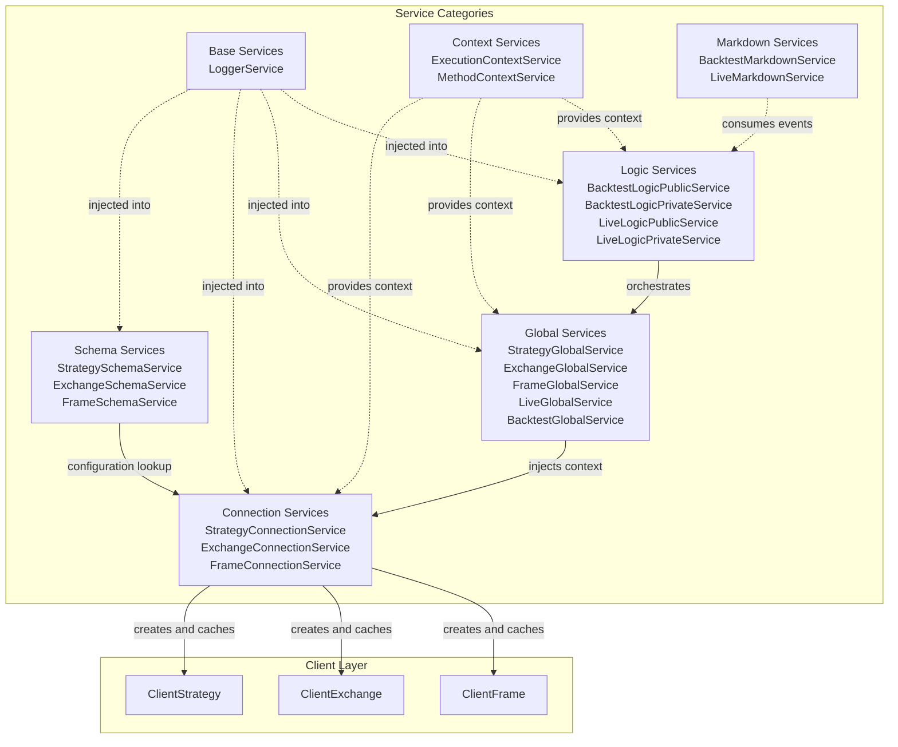
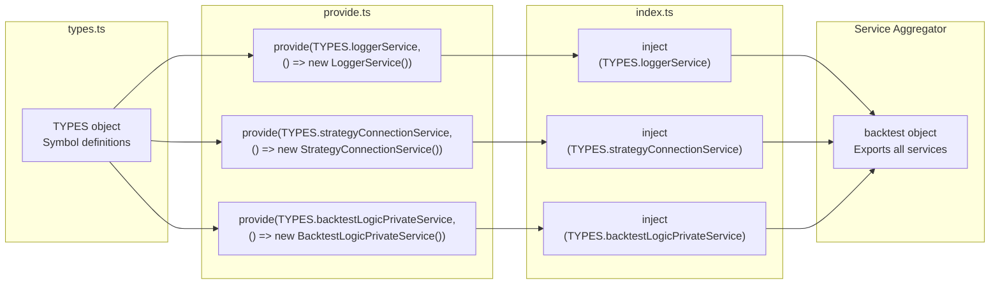
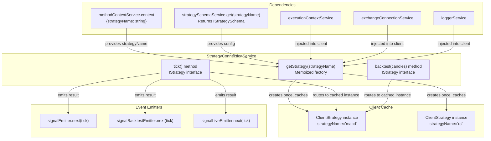
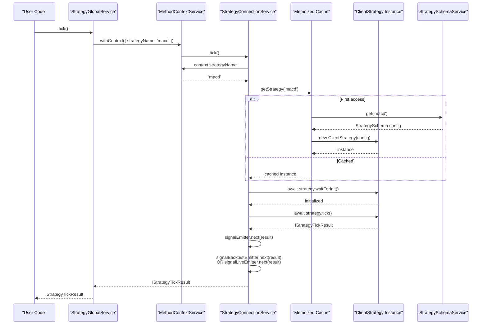
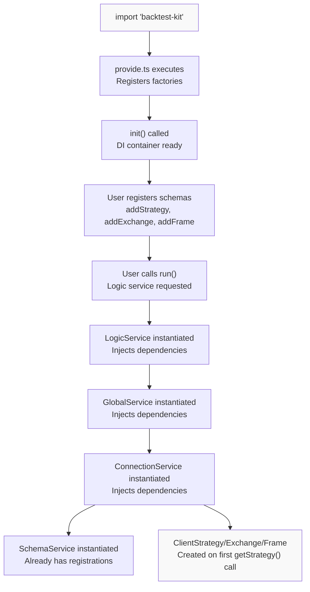

# Service Layer

<details>
<summary>Relevant source files</summary>

The following files were used as context for generating this wiki page:

- [assets/uml.svg](assets/uml.svg)
- [docs/internals.md](docs/internals.md)
- [docs/uml.puml](docs/uml.puml)
- [scripts/_convert-md-mermaid-to-svg.cjs](scripts/_convert-md-mermaid-to-svg.cjs)
- [scripts/gpt-docs.mjs](scripts/gpt-docs.mjs)
- [scripts/uml.mjs](scripts/uml.mjs)
- [src/function/add.ts](src/function/add.ts)
- [src/function/list.ts](src/function/list.ts)
- [src/lib/core/provide.ts](src/lib/core/provide.ts)
- [src/lib/core/types.ts](src/lib/core/types.ts)
- [src/lib/index.ts](src/lib/index.ts)

</details>


The Service Layer is the orchestration backbone of the backtest-kit framework, sitting between the Public API Layer and the Business Logic Layer. It manages dependency injection, configuration routing, instance caching, and execution context propagation. The layer is organized into four distinct service categories: Connection Services (instance routing and memoization), Schema Services (configuration registries), Global Services (context injection), and Logic Services (execution orchestration).

For details on the Public API that consumes these services, see [Public API Reference](#3). For the Business Logic Layer that these services coordinate, see [Core Business Logic](#4). The Dependency Injection System that powers this layer is documented in [Dependency Injection System](#2.2).

---

## Service Layer Organization

The Service Layer consists of 19 distinct services organized into four functional categories. Each category has a specific architectural responsibility in the framework's orchestration pipeline.



**Service Category Responsibilities**

| Category | Services | Responsibility |
|----------|----------|----------------|
| Base | `LoggerService` | Cross-cutting logging with automatic context enrichment |
| Context | `ExecutionContextService`, `MethodContextService` | Implicit context propagation using `di-scoped` |
| Schema | `StrategySchemaService`, `ExchangeSchemaService`, `FrameSchemaService` | Configuration registry and schema validation |
| Connection | `StrategyConnectionService`, `ExchangeConnectionService`, `FrameConnectionService` | Instance routing with memoization, client lifecycle management |
| Global | `StrategyGlobalService`, `ExchangeGlobalService`, `FrameGlobalService`, `LiveGlobalService`, `BacktestGlobalService` | Context injection wrapper around connection services |
| Logic | `BacktestLogicPublicService`, `BacktestLogicPrivateService`, `LiveLogicPublicService`, `LiveLogicPrivateService` | Execution orchestration, async generator management |
| Markdown | `BacktestMarkdownService`, `LiveMarkdownService` | Report generation and event accumulation |

**Sources:** [src/lib/index.ts:29-110](), [src/lib/core/types.ts:1-56]()

---

## Service Registration and Type System

All services are registered using the dependency injection system powered by `di-kit` and `di-scoped`. The `TYPES` constant defines Symbol identifiers for each service, and the `provide.ts` file registers factory functions that instantiate services.



**Service Type Symbols**

The `TYPES` constant in [src/lib/core/types.ts:1-56]() defines Symbol identifiers organized by category:

| Category | Symbol Examples | Purpose |
|----------|----------------|---------|
| `baseServices` | `TYPES.loggerService` | Cross-cutting concerns |
| `contextServices` | `TYPES.executionContextService`, `TYPES.methodContextService` | Context propagation |
| `connectionServices` | `TYPES.strategyConnectionService`, `TYPES.exchangeConnectionService`, `TYPES.frameConnectionService` | Client routing |
| `schemaServices` | `TYPES.strategySchemaService`, `TYPES.exchangeSchemaService`, `TYPES.frameSchemaService` | Configuration storage |
| `globalServices` | `TYPES.strategyGlobalService`, `TYPES.exchangeGlobalService`, `TYPES.frameGlobalService`, `TYPES.liveGlobalService`, `TYPES.backtestGlobalService` | Context injection |
| `logicPrivateServices` | `TYPES.backtestLogicPrivateService`, `TYPES.liveLogicPrivateService` | Private orchestration |
| `logicPublicServices` | `TYPES.backtestLogicPublicService`, `TYPES.liveLogicPublicService` | Public API facades |
| `markdownServices` | `TYPES.backtestMarkdownService`, `TYPES.liveMarkdownService` | Report generation |

**Sources:** [src/lib/core/types.ts:1-56](), [src/lib/core/provide.ts:1-68]()

---

## Connection Service Pattern

Connection Services implement a routing pattern that directs method calls to the appropriate client instance based on `MethodContextService.context`. Each connection service uses `memoize` from `functools-kit` to cache client instances, ensuring that the same configuration always returns the same instance.

**StrategyConnectionService Architecture**



**Memoization Cache Key Strategy**

The `getStrategy` method in [src/lib/services/connection/StrategyConnectionService.ts:67-83]() demonstrates the memoization pattern:

```typescript
private getStrategy = memoize(
  ([strategyName]) => `${strategyName}`,  // Cache key function
  (strategyName: StrategyName) => {        // Factory function
    const { getSignal, interval, callbacks } =
      this.strategySchemaService.get(strategyName);
    return new ClientStrategy({
      interval,
      execution: this.executionContextService,
      method: this.methodContextService,
      logger: this.loggerService,
      exchange: this.exchangeConnectionService,
      strategyName,
      getSignal,
      callbacks,
    });
  }
);
```

The cache key is the `strategyName` string. On first access, the factory function executes, creating a `ClientStrategy` instance. Subsequent calls with the same `strategyName` return the cached instance. This ensures:

1. **Single instance per configuration** - Each strategy name maps to exactly one `ClientStrategy` instance
2. **Initialization happens once** - Expensive setup operations (like persistence file loading) execute only on first access
3. **Performance optimization** - No redundant instantiation for repeated method calls

**Sources:** [src/lib/services/connection/StrategyConnectionService.ts:1-143](), [src/lib/services/connection/FrameConnectionService.ts:1-86]()

---

## Service Method Routing Flow

Connection Services implement the `IStrategy`, `IExchange`, and `IFrame` interfaces, delegating all method calls to the appropriate client instance. The routing is automatic based on `MethodContextService.context`, which is set by Global Services.



**Key Routing Components**

1. **MethodContextService** - Stores routing keys (`strategyName`, `exchangeName`, `frameName`) in `di-scoped` context
2. **Connection Service** - Reads routing keys and invokes `getStrategy()` / `getExchange()` / `getFrame()` memoized factory
3. **Memoized Factory** - Returns cached client instance or creates new one
4. **Client Instance** - Executes business logic and returns result
5. **Event Emitters** - Connection service emits results to global event emitters for `listenSignal` API

**Sources:** [src/lib/services/connection/StrategyConnectionService.ts:86-140](), [src/lib/services/connection/FrameConnectionService.ts:50-82]()

---

## Service Aggregation Object

The `backtest` object exported from [src/lib/index.ts:101-117]() aggregates all services into a single importable object. This service locator pattern simplifies imports and provides a single access point for the entire framework.

**Service Aggregation Structure**

```typescript
export const backtest = {
  ...baseServices,           // loggerService
  ...contextServices,        // executionContextService, methodContextService
  ...connectionServices,     // exchangeConnectionService, strategyConnectionService, frameConnectionService
  ...schemaServices,         // exchangeSchemaService, strategySchemaService, frameSchemaService
  ...globalServices,         // exchangeGlobalService, strategyGlobalService, frameGlobalService, liveGlobalService, backtestGlobalService
  ...logicPrivateServices,   // backtestLogicPrivateService, liveLogicPrivateService
  ...logicPublicServices,    // backtestLogicPublicService, liveLogicPublicService
  ...markdownServices,       // backtestMarkdownService, liveMarkdownService
};
```

**Service Import Pattern**

Users and internal framework code can import services in two ways:

1. **Individual service import** (rare, typically only for context services)
   ```typescript
   import { ExecutionContextService } from 'backtest-kit';
   ```

2. **Service locator import** (common, used throughout framework)
   ```typescript
   import backtest from 'backtest-kit';
   const result = await backtest.backtestLogicPublicService.run(...);
   ```

The service aggregator is initialized via `init()` at [src/lib/index.ts:112](), which triggers all service registrations from `provide.ts`.

**Sources:** [src/lib/index.ts:29-117]()

---

## Service Initialization Lifecycle

Services follow a lazy initialization pattern. The DI container is initialized at module load time, but individual service instances are created only when first injected. This allows for:

1. **Fast module loading** - No expensive operations at import time
2. **On-demand instantiation** - Services are created only if used
3. **Configuration flexibility** - Schemas can be registered after import but before execution

**Initialization Order**



**Service Instance Lifecycle**

1. **Module Load** - `provide.ts` registers factory functions with DI container
2. **Container Init** - `init()` prepares container for service resolution
3. **Schema Registration** - User calls `addStrategy()`, `addExchange()`, `addFrame()` to populate schema services
4. **First Execution** - User calls `Backtest.run()` or `Live.run()`
5. **Service Cascade** - Logic services inject global services, which inject connection services, which inject schema services
6. **Client Creation** - Connection services create client instances via memoized factories on first method call
7. **Cached Reuse** - Subsequent method calls reuse cached client instances

**Sources:** [src/lib/index.ts:1-117](), [src/lib/core/provide.ts:1-68]()

---

## Service Layer Responsibilities

The following table summarizes each service's primary responsibility and its place in the execution flow:

| Service | File Location | Primary Responsibility | Called By | Calls |
|---------|---------------|------------------------|-----------|-------|
| `LoggerService` | `src/lib/services/base/` | Cross-cutting logging with context enrichment | All services | - |
| `ExecutionContextService` | `src/lib/services/context/` | Stores execution context (date, backtest mode) | Logic services | - |
| `MethodContextService` | `src/lib/services/context/` | Stores method context (strategy/exchange/frame names) | Global services | - |
| `StrategySchemaService` | `src/lib/services/schema/` | Registry of strategy configurations | Connection services | - |
| `ExchangeSchemaService` | `src/lib/services/schema/` | Registry of exchange configurations | Connection services | - |
| `FrameSchemaService` | `src/lib/services/schema/` | Registry of frame configurations | Connection services | - |
| `StrategyConnectionService` | `src/lib/services/connection/` | Routes to cached ClientStrategy instances | Global services | ClientStrategy |
| `ExchangeConnectionService` | `src/lib/services/connection/` | Routes to cached ClientExchange instances | Global services | ClientExchange |
| `FrameConnectionService` | `src/lib/services/connection/` | Routes to cached ClientFrame instances | Global services | ClientFrame |
| `StrategyGlobalService` | `src/lib/services/global/` | Injects method context for strategies | Logic services | Connection services |
| `ExchangeGlobalService` | `src/lib/services/global/` | Injects method context for exchanges | Logic services | Connection services |
| `FrameGlobalService` | `src/lib/services/global/` | Injects method context for frames | Logic services | Connection services |
| `LiveGlobalService` | `src/lib/services/global/` | Wraps live logic with error handling | Public API | Private logic services |
| `BacktestGlobalService` | `src/lib/services/global/` | Wraps backtest logic with error handling | Public API | Private logic services |
| `BacktestLogicPrivateService` | `src/lib/services/logic/private/` | Orchestrates backtest execution loop | Public logic services | Global services |
| `LiveLogicPrivateService` | `src/lib/services/logic/private/` | Orchestrates live trading infinite loop | Public logic services | Global services |
| `BacktestLogicPublicService` | `src/lib/services/logic/public/` | Public API facade for backtest | Public API functions | Private logic services |
| `LiveLogicPublicService` | `src/lib/services/logic/public/` | Public API facade for live trading | Public API functions | Private logic services |
| `BacktestMarkdownService` | `src/lib/services/markdown/` | Accumulates backtest results for reports | Logic services | - |
| `LiveMarkdownService` | `src/lib/services/markdown/` | Accumulates live trading results for reports | Logic services | - |

---

## Sub-Pages

The following pages provide detailed documentation for each service category:

- [Connection Services](#5.1) - `StrategyConnectionService`, `ExchangeConnectionService`, `FrameConnectionService` routing patterns with memoization
- [Schema Services](#5.2) - `StrategySchemaService`, `ExchangeSchemaService`, `FrameSchemaService` configuration registries
- [Global Services](#5.3) - Context injection wrappers for Strategy, Exchange, Frame, Live, and Backtest
- [Logic Services](#5.4) - `BacktestLogicPrivateService` and `LiveLogicPrivateService` orchestration of async generator execution

**Sources:** [src/lib/index.ts:1-117](), [src/lib/core/types.ts:1-56](), [src/lib/core/provide.ts:1-68]()