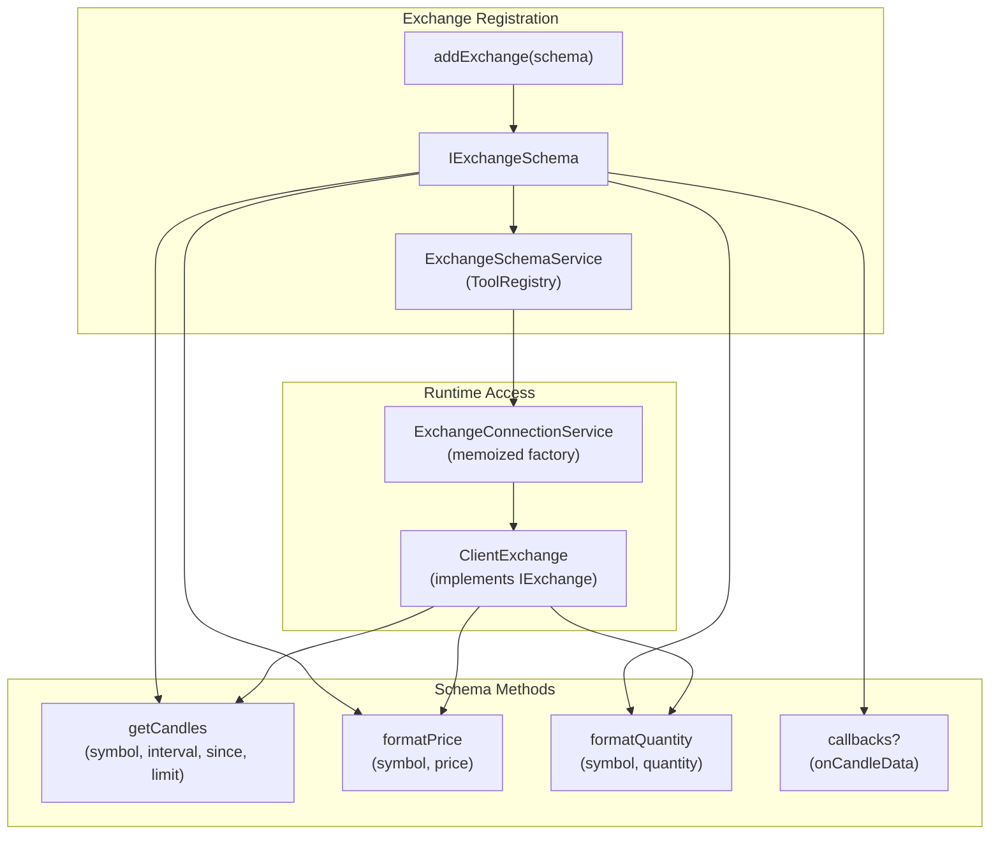
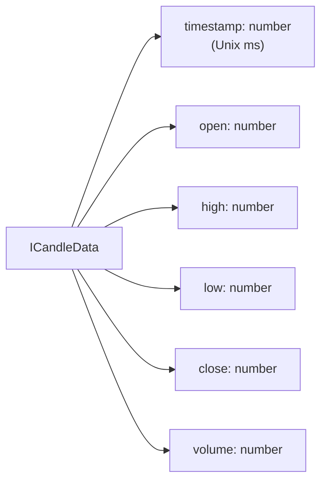
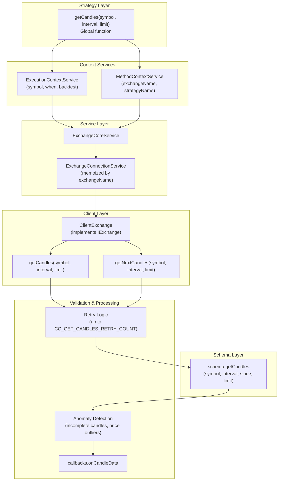
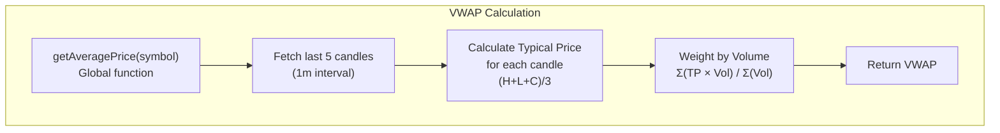
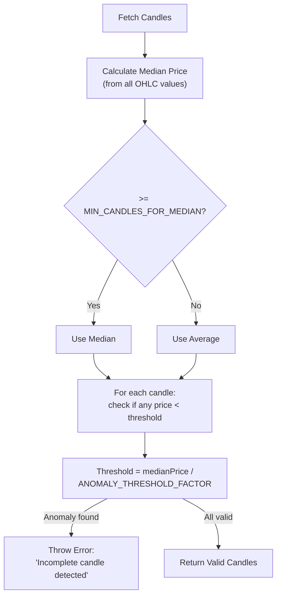
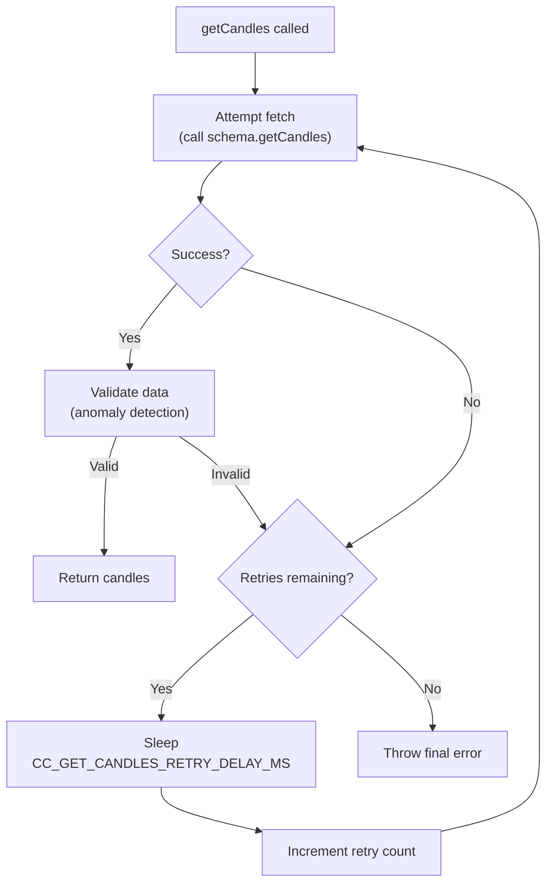
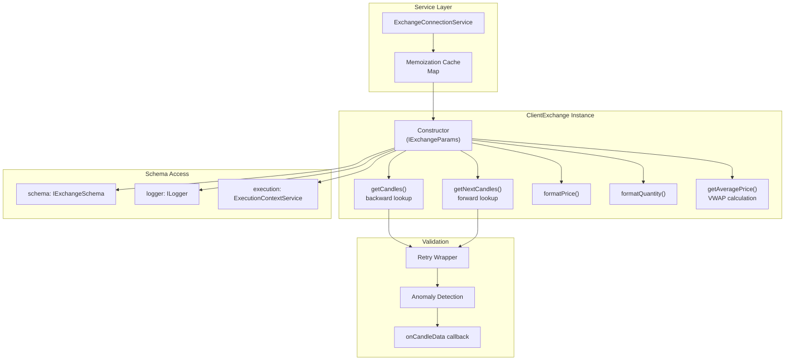

# Exchanges & Data Sources

## Purpose and Scope

This page documents how to configure exchanges and data sources in Backtest Kit. Exchanges provide historical and real-time market data (OHLCV candles) and handle price/quantity formatting according to exchange-specific precision rules. The framework supports any data source that implements the required interface, including CCXT, custom APIs, databases, or CSV files.

For information about using candle data within strategies, see [Multi-Timeframe Analysis](./25_strategy-development.md). For execution context propagation, see [Execution Contexts](./08_core-concepts.md). For VWAP pricing details, see [VWAP Pricing & Data Handling](./08_core-concepts.md).

---

## Exchange Schema Definition

### IExchangeSchema Interface

Exchanges are registered using the `IExchangeSchema` interface, which defines the contract for data fetching and formatting operations.



**Interface Structure:**

| Property | Type | Required | Description |
|----------|------|----------|-------------|
| `exchangeName` | `ExchangeName` (string) | Yes | Unique identifier for the exchange |
| `getCandles` | Function | Yes | Fetches OHLCV candle data |
| `formatPrice` | Function | Yes | Formats price to exchange precision |
| `formatQuantity` | Function | Yes | Formats quantity to exchange precision |
| `note` | string | No | Developer documentation |
| `callbacks` | `Partial<IExchangeCallbacks>` | No | Lifecycle event callbacks |

**Sources:** [types.d.ts:119-155](), [src/interfaces/Exchange.interface.ts]()

---

## Registering an Exchange

### addExchange Function

The `addExchange` global function registers an exchange schema. The framework validates uniqueness of `exchangeName` and stores the schema in the registry.

```typescript
import { addExchange } from 'backtest-kit';

addExchange({
  exchangeName: "binance",
  note: "Binance production data source",
  
  getCandles: async (symbol, interval, since, limit) => {
    // Implementation here
    return candles;
  },
  
  formatPrice: async (symbol, price) => {
    return price.toFixed(2);
  },
  
  formatQuantity: async (symbol, quantity) => {
    return quantity.toFixed(8);
  },
  
  callbacks: {
    onCandleData: (symbol, interval, since, limit, data) => {
      console.log(`Fetched ${data.length} candles`);
    }
  }
});
```

**Validation:**
- `exchangeName` must be unique (checked by `ExchangeValidationService`)
- All required methods must be provided
- Methods must return promises

**Sources:** [src/function/add.ts](), [types.d.ts:119-155](), [README.md:70-80]()

---

## Data Fetching Requirements

### getCandles Method Contract

The `getCandles` method is the core data fetching interface. It must return historical OHLCV candles according to the specified parameters.

**Signature:**
```typescript
getCandles: (
  symbol: string,        // Trading pair (e.g., "BTCUSDT")
  interval: CandleInterval,  // "1m" | "3m" | "5m" | "15m" | "30m" | "1h" | "2h" | "4h" | "6h" | "8h"
  since: Date,          // Start date for fetching
  limit: number         // Maximum number of candles to return
) => Promise<ICandleData[]>
```

**ICandleData Structure:**



| Field | Type | Description |
|-------|------|-------------|
| `timestamp` | number | Unix timestamp in milliseconds when candle opened |
| `open` | number | Opening price at candle start |
| `high` | number | Highest price during candle period |
| `low` | number | Lowest price during candle period |
| `close` | number | Closing price at candle end |
| `volume` | number | Trading volume during candle period |

**Temporal Context:** The `since` parameter represents the current execution timestamp. In backtest mode, it corresponds to the frame iteration timestamp. In live mode, it's the current time minus the requested lookback. This ensures **look-ahead bias prevention** - strategies can never access future data.

**Sources:** [types.d.ts:82-100](), [types.d.ts:128-136]()

---

## Internal Data Flow



**Key Points:**
- `getCandles()` uses `when - (limit × interval)` to calculate `since` (backward lookup)
- `getNextCandles()` uses `when` as `since` (forward lookup for backtest fast mode)
- `ExecutionContextService` provides temporal context automatically
- `ExchangeConnectionService` memoizes `ClientExchange` instances by `exchangeName`

**Sources:** [src/function/exchange.ts](), [src/client/ClientExchange.ts](), [src/lib/services/core/ExchangeCoreService.ts]()

---

## VWAP Pricing

### Volume Weighted Average Price Calculation

VWAP (Volume Weighted Average Price) is used for realistic entry/exit price simulation. The framework calculates VWAP from the last N 1-minute candles (default: 5).

**Formula:**
```
Typical Price = (High + Low + Close) / 3
VWAP = Σ(Typical Price × Volume) / Σ(Volume)
```



**Configuration:**
- `CC_AVG_PRICE_CANDLES_COUNT` - Number of candles for VWAP (default: 5)
- Always uses 1-minute interval for high precision
- Falls back to simple average if volume data is unavailable

**Usage in Signal Execution:**
```typescript
// Framework automatically uses VWAP for:
// 1. Signal activation (scheduled → opened)
// 2. Take profit detection
// 3. Stop loss detection
// 4. Partial profit/loss calculations
```

**Sources:** [types.d.ts:196-204](), [src/client/ClientExchange.ts](), [src/config/params.ts:6-11]()

---

## Data Validation & Anomaly Detection

### Incomplete Candle Detection

The framework detects incomplete candles from API responses (e.g., Binance sometimes returns candles with near-zero prices).

**Detection Logic:**



**Configuration Parameters:**

| Parameter | Default | Description |
|-----------|---------|-------------|
| `CC_GET_CANDLES_PRICE_ANOMALY_THRESHOLD_FACTOR` | 1000 | Max deviation factor for price detection |
| `CC_GET_CANDLES_MIN_CANDLES_FOR_MEDIAN` | 5 | Minimum candles for median calculation |

**Anomaly Detection Algorithm:**
1. Collect all OHLC prices from fetched candles
2. Calculate reference price:
   - If `candles.length >= CC_GET_CANDLES_MIN_CANDLES_FOR_MEDIAN`: use **median**
   - Otherwise: use **average**
3. Calculate threshold: `referencePrice / CC_GET_CANDLES_PRICE_ANOMALY_THRESHOLD_FACTOR`
4. Check each candle's OHLC values
5. If any price < threshold: **throw error**

**Example:**
```typescript
// BTC median price: $50,000
// Threshold: $50,000 / 1000 = $50
// Incomplete candle with close=$0.01 → DETECTED (0.01 < 50)
// Normal candle with close=$49,500 → VALID (49500 > 50)
```

**Sources:** [src/config/params.ts:77-104](), [src/client/ClientExchange.ts]()

---

## Retry Logic

### Failed Fetch Handling

The framework implements automatic retry logic with exponential backoff for transient network failures.



**Configuration:**

| Parameter | Default | Description |
|-----------|---------|-------------|
| `CC_GET_CANDLES_RETRY_COUNT` | 3 | Maximum retry attempts |
| `CC_GET_CANDLES_RETRY_DELAY_MS` | 5000 | Delay between retries (ms) |

**Retry Triggers:**
- Network errors (connection timeout, DNS failure)
- HTTP 429 (rate limit)
- HTTP 500/502/503 (server errors)
- Anomaly detection failures

**Sources:** [src/config/params.ts:66-74](), [src/client/ClientExchange.ts]()

---

## Price and Quantity Formatting

### Exchange-Specific Precision

Exchanges have different precision rules for prices and quantities. The `formatPrice` and `formatQuantity` methods ensure values match exchange requirements.

**formatPrice Method:**
```typescript
formatPrice: async (symbol: string, price: number) => Promise<string>
```

**formatQuantity Method:**
```typescript
formatQuantity: async (symbol: string, quantity: number) => Promise<string>
```

**Common Patterns:**

| Exchange | Price Precision | Quantity Precision | Example |
|----------|----------------|-------------------|---------|
| Binance | 2-8 decimals | 8 decimals | `price.toFixed(2)` |
| Kraken | 1-5 decimals | 8 decimals | `price.toFixed(1)` |
| Custom | Variable | Variable | Lookup table |

**Usage in Framework:**
- Report generation (markdown tables)
- Order placement (live trading)
- Position size calculations

**Sources:** [types.d.ts:138-152](), [types.d.ts:180-194]()

---

## CCXT Integration

### Common Integration Pattern

CCXT is a popular cryptocurrency exchange library. Below is the standard pattern for integrating CCXT as a data source.

**Basic CCXT Exchange:**
```typescript
import ccxt from 'ccxt';
import { addExchange } from 'backtest-kit';

const exchange = new ccxt.binance({
  // Optional: API credentials for live trading
  apiKey: process.env.BINANCE_API_KEY,
  secret: process.env.BINANCE_API_SECRET,
});

addExchange({
  exchangeName: 'binance',
  
  getCandles: async (symbol, interval, since, limit) => {
    // CCXT uses different interval format
    const ohlcv = await exchange.fetchOHLCV(
      symbol,
      interval,
      since.getTime(),
      limit
    );
    
    // Convert CCXT format [timestamp, o, h, l, c, v] to ICandleData
    return ohlcv.map(([timestamp, open, high, low, close, volume]) => ({
      timestamp,
      open,
      high,
      low,
      close,
      volume,
    }));
  },
  
  formatPrice: async (symbol, price) => {
    const market = exchange.market(symbol);
    return exchange.priceToPrecision(symbol, price);
  },
  
  formatQuantity: async (symbol, quantity) => {
    const market = exchange.market(symbol);
    return exchange.amountToPrecision(symbol, quantity);
  },
});
```

**CCXT-Specific Considerations:**

| Aspect | Solution |
|--------|----------|
| Rate limiting | CCXT handles automatically |
| Symbol format | Use CCXT unified symbols (e.g., "BTC/USDT") |
| Precision | Use `priceToPrecision` and `amountToPrecision` |
| Error handling | Wrap in try-catch, let retry logic handle |

**Advanced: Multiple Exchanges:**
```typescript
const exchanges = {
  binance: new ccxt.binance(),
  kraken: new ccxt.kraken(),
  coinbase: new ccxt.coinbase(),
};

Object.entries(exchanges).forEach(([name, instance]) => {
  addExchange({
    exchangeName: name,
    getCandles: async (symbol, interval, since, limit) => {
      const ohlcv = await instance.fetchOHLCV(symbol, interval, since.getTime(), limit);
      return ohlcv.map(([timestamp, open, high, low, close, volume]) => ({
        timestamp, open, high, low, close, volume
      }));
    },
    formatPrice: (symbol, price) => instance.priceToPrecision(symbol, price),
    formatQuantity: (symbol, qty) => instance.amountToPrecision(symbol, qty),
  });
});
```

**Sources:** [README.md:70-80](), [demo/backtest/src/setup/exchange.mjs](), [types.d.ts:119-155]()

---

## ClientExchange Architecture

### Internal Implementation

`ClientExchange` is the internal client that wraps exchange schemas and provides additional functionality like VWAP calculation and retry logic.



**Key Architectural Decisions:**

1. **Memoization:** `ExchangeConnectionService` caches `ClientExchange` instances by `exchangeName` to prevent redundant instantiation.

2. **Prototype Methods:** All methods are defined on the prototype for memory efficiency (shared across instances).

3. **Context Injection:** `ExecutionContextService` provides temporal context (symbol, when, backtest flag) automatically.

4. **Separation of Concerns:**
   - **Schema (IExchangeSchema):** User-defined data fetching logic
   - **Client (ClientExchange):** Framework-provided validation, retry, VWAP
   - **Service (ExchangeConnectionService):** Lifecycle management, routing

**Sources:** [src/client/ClientExchange.ts](), [src/lib/services/connection/ExchangeConnectionService.ts](), [types.d.ts:102-110]()

---

## Configuration Reference

### Data Fetching Parameters

| Parameter | Default | Type | Description |
|-----------|---------|------|-------------|
| `CC_AVG_PRICE_CANDLES_COUNT` | 5 | number | Number of 1m candles for VWAP calculation |
| `CC_GET_CANDLES_RETRY_COUNT` | 3 | number | Maximum retry attempts for failed fetches |
| `CC_GET_CANDLES_RETRY_DELAY_MS` | 5000 | number | Delay between retry attempts (milliseconds) |
| `CC_GET_CANDLES_PRICE_ANOMALY_THRESHOLD_FACTOR` | 1000 | number | Max price deviation factor for anomaly detection |
| `CC_GET_CANDLES_MIN_CANDLES_FOR_MEDIAN` | 5 | number | Minimum candles required for median price calculation |

**Configuration Example:**
```typescript
import { setConfig } from 'backtest-kit';

setConfig({
  CC_AVG_PRICE_CANDLES_COUNT: 10,  // Use 10 candles for VWAP
  CC_GET_CANDLES_RETRY_COUNT: 5,   // Retry 5 times on failure
  CC_GET_CANDLES_RETRY_DELAY_MS: 3000,  // 3 second delay
  CC_GET_CANDLES_PRICE_ANOMALY_THRESHOLD_FACTOR: 500,  // Stricter anomaly detection
});
```

**Sources:** [src/config/params.ts:6-104](), [src/function/setup.ts]()

---

## Exchange Callbacks

### Lifecycle Event Monitoring

The optional `callbacks` property in `IExchangeSchema` allows monitoring data fetching events.

**IExchangeCallbacks Interface:**
```typescript
interface IExchangeCallbacks {
  onCandleData: (
    symbol: string,
    interval: CandleInterval,
    since: Date,
    limit: number,
    data: ICandleData[]
  ) => void;
}
```

**Usage Example:**
```typescript
addExchange({
  exchangeName: "binance",
  
  getCandles: async (symbol, interval, since, limit) => {
    // Fetch logic
    return candles;
  },
  
  formatPrice: async (symbol, price) => price.toFixed(2),
  formatQuantity: async (symbol, quantity) => quantity.toFixed(8),
  
  callbacks: {
    onCandleData: (symbol, interval, since, limit, data) => {
      console.log(`[${symbol}] Fetched ${data.length} ${interval} candles from ${since.toISOString()}`);
      
      // Example: Log to monitoring service
      monitoring.track('candle_fetch', {
        symbol,
        interval,
        count: data.length,
        requested: limit,
        fulfilled: data.length === limit,
      });
    },
  },
});
```

**Use Cases:**
- Logging data fetch operations
- Monitoring API usage and quotas
- Debugging data quality issues
- Performance profiling

**Sources:** [types.d.ts:112-117](), [types.d.ts:153-154]()

---

## Complete Example: Custom Database Exchange

### CSV File Data Source

```typescript
import { addExchange, ICandleData } from 'backtest-kit';
import fs from 'fs/promises';
import path from 'path';

// Custom exchange reading from CSV files
addExchange({
  exchangeName: 'csv-historical',
  note: 'Historical data from CSV files',
  
  getCandles: async (symbol, interval, since, limit) => {
    // CSV file path: ./data/BTCUSDT_1m.csv
    const filename = `./data/${symbol}_${interval}.csv`;
    const content = await fs.readFile(filename, 'utf-8');
    const lines = content.split('\n').slice(1); // Skip header
    
    const allCandles: ICandleData[] = lines
      .filter(line => line.trim())
      .map(line => {
        const [timestamp, open, high, low, close, volume] = line.split(',');
        return {
          timestamp: parseInt(timestamp),
          open: parseFloat(open),
          high: parseFloat(high),
          low: parseFloat(low),
          close: parseFloat(close),
          volume: parseFloat(volume),
        };
      });
    
    // Filter by date range
    const sinceMs = since.getTime();
    const filtered = allCandles.filter(c => c.timestamp >= sinceMs);
    
    // Return requested limit
    return filtered.slice(0, limit);
  },
  
  formatPrice: async (symbol, price) => {
    // Fixed precision for all symbols
    return price.toFixed(2);
  },
  
  formatQuantity: async (symbol, quantity) => {
    return quantity.toFixed(8);
  },
  
  callbacks: {
    onCandleData: (symbol, interval, since, limit, data) => {
      console.log(`CSV: Loaded ${data.length}/${limit} ${interval} candles for ${symbol}`);
    },
  },
});
```

**Sources:** [types.d.ts:119-155](), [README.md:70-80]()