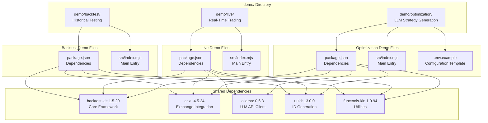
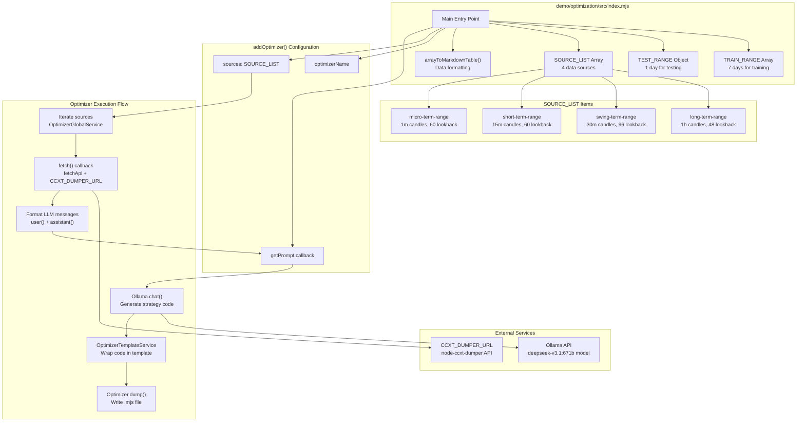
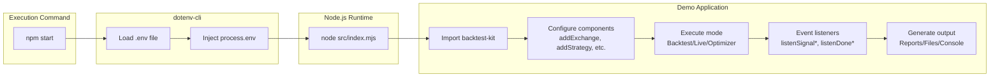

# Demo Applications

This page documents the included demo applications that showcase the framework's capabilities. The demos provide practical examples of backtesting, live trading, and LLM-based strategy optimization using real market data and executable code.

For framework configuration details, see [Global Configuration Parameters](./26-global-configuration-parameters.md). For execution mode details, see [Execution Modes Overview](./04-execution-modes-overview.md) and the detailed execution mode pages ([Backtest Mode](./17-backtest-mode.md), [Live Trading Mode](./18-live-trading-mode.md), [Optimizer Mode](./20-optimizer-mode.md)).

---

## Demo Projects Structure

The codebase includes three demonstration applications located in the `demo/` directory, each illustrating a different execution mode of the framework.



**Demo Application Comparison**

| Demo | Purpose | Execution Mode | Key Features | Output |
|------|---------|---------------|--------------|--------|
| Backtest | Historical simulation | Finite iteration over timeframes | Fast candle processing, TP/SL/time monitoring | Closed signals, markdown reports |
| Live | Real-time trading | Infinite loop with persistence | Crash-safe recovery, atomic writes | Opened/closed signals, state files |
| Optimization | LLM strategy generation | Multi-source data aggregation | Ollama API integration, code export | Executable .mjs strategy files |

---

## Shared Dependencies and Configuration

All demo applications share a common dependency structure, with variations based on their specific requirements.

**Core Dependencies**

| Package | Version | Purpose | Used By |
|---------|---------|---------|---------|
| `backtest-kit` | 1.5.20 | Core framework library | All demos |
| `ccxt` | 4.5.24 | Exchange API integration for market data | All demos |
| `functools-kit` | 1.0.94 | Functional utilities (Subject, fetchApi, etc.) | All demos |
| `uuid` | 13.0.0 | Signal ID generation | All demos |
| `ollama` | 0.6.3 | LLM API client for strategy generation | Live, Optimization |
| `dotenv-cli` | 11.0.0 | Environment variable management (dev) | All demos |

**Package Scripts**

Each demo includes a standardized `start` script that loads environment variables and executes the main entry point:

```json
"scripts": {
  "start": "dotenv -e .env -- node ./src/index.mjs"
}
```

This pattern is consistent across all demos at [demo/backtest/package.json:5-7](), [demo/live/package.json:5-7](), and [demo/optimization/package.json:5-7]().

---

## Backtest Demo

The backtest demo demonstrates historical simulation of trading strategies using the framework's `Backtest` execution mode. This is the simplest demo, focusing on core backtesting functionality without external API dependencies.

**Key Characteristics**

- **Execution Mode:** `Backtest.run()` or `Backtest.background()`
- **Data Source:** CCXT exchange API or mock data
- **Output:** Closed signals with PnL calculations
- **Reporting:** Markdown reports via `Backtest.dump()`

**Typical Usage Pattern**

```typescript
// Configuration
addExchange({ exchangeName, getCandles, formatPrice, formatQuantity });
addStrategy({ strategyName, interval, getSignal, riskName });
addFrame({ frameName, interval, startDate, endDate });

// Execution
Backtest.background(symbol, { strategyName, exchangeName, frameName });

// Event Monitoring
listenSignalBacktest((event) => console.log(event));
listenDoneBacktest(async (event) => {
  await Backtest.dump(event.symbol, event.strategyName);
});
```

The backtest demo iterates through a pre-generated timeframe array, processing each timestamp sequentially. For each tick, the framework checks for signal generation (throttled by `interval`), then uses fast candle processing to monitor TP/SL/time conditions and skip to the close timestamp for efficiency.

---

## Live Trading Demo

The live trading demo demonstrates real-time execution with crash-safe persistence. This demo showcases the framework's production-ready capabilities for continuous operation.

**Key Characteristics**

- **Execution Mode:** `Live.run()` or `Live.background()`
- **Persistence:** Atomic JSON file writes via `PersistSignalAdapter`
- **Recovery:** `waitForInit()` loads previous state on restart
- **Loop:** Infinite `while` loop with 61-second sleep intervals (`TICK_TTL`)
- **Output:** Opened/closed signals only (filters idle/active states)

**Typical Usage Pattern**

```typescript
// Configuration (same as backtest)
addExchange({ exchangeName, getCandles, formatPrice, formatQuantity });
addStrategy({ strategyName, interval, getSignal, riskName });

// Live Execution
Live.background(symbol, { strategyName, exchangeName });

// Event Monitoring
listenSignalLive((event) => console.log(event));
```

The live demo runs continuously, using `new Date()` for each tick's timestamp. State is persisted after each tick to JSON files in the `./dump/` directory, enabling crash recovery. The framework waits for all positions to close before allowing graceful shutdown via `doneLiveSubject`.

---

## Optimization Demo: LLM-Based Strategy Generation

The optimization demo is the most complex, showcasing the framework's ability to generate trading strategies using large language models (LLMs). This demo fetches multi-timeframe historical data, formats it for LLM consumption, and generates executable strategy code.



**Data Source Configuration**

The demo defines four data sources with different timeframes and indicator sets. Each source has a `fetch` callback that queries the CCXT Dumper API and a `user` callback that formats the data into markdown tables for LLM consumption.

| Source Name | Timeframe | Lookback | Key Indicators | API Endpoint |
|-------------|-----------|----------|----------------|--------------|
| `long-term-range` | 1h | 48 candles | RSI(14), MACD(12,26,9), ADX(14), Bollinger(20,2.0), EMA(20,34), Fibonacci | `/view/long-term-range` |
| `swing-term-range` | 30m | 96 candles | RSI(14), MACD(12,26,9), Stochastic(14,3,3), CCI(20), DEMA(21) | `/view/swing-term-range` |
| `short-term-range` | 15m | 60 candles | RSI(9), MACD(8,21,5), ADX(14), Bollinger(10,2.0), ROC(5,10) | `/view/short-term-range` |
| `micro-term-range` | 1m | 60 candles | RSI(9), MACD(8,21,5), Stochastic(3,3,3), ADX(9), ATR(5,9) | `/view/micro-term-range` |

Each source configuration is defined at [demo/optimization/src/index.mjs:66-303]().

**Training and Testing Date Ranges**

The demo uses a 7-day training period and a 1-day testing period:

- **Training:** [demo/optimization/src/index.mjs:19-55]() defines `TRAIN_RANGE` with 7 consecutive days (November 24-30, 2025)
- **Testing:** [demo/optimization/src/index.mjs:57-61]() defines `TEST_RANGE` for December 1, 2025

**LLM Message Formatting**

Each data source provides a `user()` callback that formats fetched data into markdown tables with detailed explanations of indicators and their parameters. For example, the 1-hour source includes:

```markdown
# 1-Hour Candles Trading Analysis for BTCUSDT (Historical Data)

| timestamp | rsi_14 | stoch_rsi_14 | macd | signal | ... |
| --- | --- | --- | --- | --- | ... |
| ... data rows ... |

## Data Sources
- **Timeframe**: 1-hour candles
- **Lookback Period**: 48 candles (48 hours)
- **RSI(14)**: over previous 14 candles before row timestamp (Min: 0, Max: 100)
...
```

This pattern is repeated for all four sources at [demo/optimization/src/index.mjs:83-122](), [demo/optimization/src/index.mjs:141-179](), [demo/optimization/src/index.mjs:198-234](), and [demo/optimization/src/index.mjs:253-301]().

**Code Generation and Export**

The optimizer orchestrates the following workflow:

1. **Iterate Data Sources:** `OptimizerGlobalService` loops through each source in `SOURCE_LIST`
2. **Fetch Historical Data:** For each training date range, the `fetch()` callback queries the CCXT Dumper API
3. **Format for LLM:** The `user()` callback converts data into markdown tables
4. **Generate Strategy:** The `getPrompt()` callback sends formatted data to Ollama API (model: `deepseek-v3.1:671b`)
5. **Wrap in Template:** `OptimizerTemplateService` wraps generated code in executable template
6. **Export File:** `Optimizer.dump()` writes the complete strategy to `./generated/{optimizerName}_{symbol}.mjs`

The generated file includes:
- `addExchange()` configuration
- `addStrategy()` with LLM-generated signal logic
- `addFrame()` for testing period
- `Walker.background()` to compare multiple strategies

---

## Environment Configuration

All demos support environment variable configuration via `.env` files. The optimization demo requires specific environment variables for external service integration.

**Optimization Demo Environment Variables**

The optimization demo requires two environment variables defined in [demo/optimization/.env.example:1-3]():

| Variable | Purpose | Example |
|----------|---------|---------|
| `OLLAMA_API_KEY` | Authentication for Ollama API (optional) | `your-api-key-here` |
| `CCXT_DUMPER_URL` | Base URL for CCXT Dumper API service | `http://localhost:3000` |

The `CCXT_DUMPER_URL` is used to construct API endpoints for fetching historical candle data with calculated indicators. This service is referenced in the code as a comment: [demo/optimization/src/index.mjs:64]() points to `https://github.com/tripolskypetr/node-ccxt-dumper`.

**General Configuration**

All demos can use the framework's global configuration via `setConfig()` and `setLogger()` as shown in [README.md:42-58]():

```typescript
import { setLogger, setConfig } from 'backtest-kit';

// Enable logging
setLogger({
  log: console.log,
  debug: console.debug,
  info: console.info,
  warn: console.warn,
});

// Global config (optional)
setConfig({
  CC_PERCENT_SLIPPAGE: 0.1,  // % slippage
  CC_PERCENT_FEE: 0.1,       // % fee
  CC_SCHEDULE_AWAIT_MINUTES: 120,  // Pending signal timeout
});
```

---

## Running Demo Applications

All demo applications follow a consistent installation and execution pattern.

**Installation Steps**

1. **Navigate to Demo Directory:**
   ```bash
   cd demo/backtest  # or demo/live or demo/optimization
   ```

2. **Install Dependencies:**
   ```bash
   npm install
   ```

3. **Configure Environment (if needed):**
   ```bash
   cp .env.example .env
   # Edit .env with your configuration
   ```

**Execution Commands**

Each demo provides a `start` script that handles environment loading and execution:

```bash
npm start
```

This executes the command defined in `package.json`:
```json
"scripts": {
  "start": "dotenv -e .env -- node ./src/index.mjs"
}
```

The `dotenv-cli` package (dev dependency) loads variables from `.env` before executing the Node.js script.

**Execution Flow Diagram**



**Expected Outputs**

| Demo | Console Output | File Output | Duration |
|------|---------------|-------------|----------|
| Backtest | Signal events, progress, final statistics | `./dump/backtest_{symbol}_{strategy}.md` | Minutes (depends on timeframe) |
| Live | Signal events, tick updates | `./dump/live_{symbol}_{strategy}.json` (state) | Continuous (until stopped) |
| Optimization | Progress updates, LLM responses | `./generated/{optimizer}_{symbol}.mjs` (strategy code) | Minutes to hours (depends on LLM) |

---

## Demo Code Examples from README

The README includes complete working examples that can serve as templates for custom demos. These examples are located at [README.md:60-154]() and demonstrate:

**Basic Configuration Example**

```typescript
import ccxt from 'ccxt';
import { addExchange, addStrategy, addFrame, addRisk } from 'backtest-kit';

// Exchange registration
addExchange({
  exchangeName: 'binance',
  getCandles: async (symbol, interval, since, limit) => {
    const exchange = new ccxt.binance();
    const ohlcv = await exchange.fetchOHLCV(symbol, interval, since.getTime(), limit);
    return ohlcv.map(([timestamp, open, high, low, close, volume]) => 
      ({ timestamp, open, high, low, close, volume })
    );
  },
  formatPrice: (symbol, price) => price.toFixed(2),
  formatQuantity: (symbol, quantity) => quantity.toFixed(8),
});

// Risk profile with validation
addRisk({
  riskName: 'demo',
  validations: [
    ({ pendingSignal, currentPrice }) => {
      const { priceOpen = currentPrice, priceTakeProfit, position } = pendingSignal;
      const tpDistance = position === 'long' 
        ? ((priceTakeProfit - priceOpen) / priceOpen) * 100 
        : ((priceOpen - priceTakeProfit) / priceOpen) * 100;
      if (tpDistance < 1) throw new Error(`TP too close: ${tpDistance.toFixed(2)}%`);
    },
  ],
});

// Timeframe definition
addFrame({
  frameName: '1d-test',
  interval: '1m',
  startDate: new Date('2025-12-01'),
  endDate: new Date('2025-12-02'),
});
```

**LLM-Enhanced Strategy Example**

```typescript
import { v4 as uuid } from 'uuid';
import { addStrategy, dumpSignal, getCandles } from 'backtest-kit';

addStrategy({
  strategyName: 'llm-strategy',
  interval: '5m',
  riskName: 'demo',
  getSignal: async (symbol) => {
    // Fetch multi-timeframe data
    const candles1h = await getCandles(symbol, "1h", 24);
    const candles15m = await getCandles(symbol, "15m", 48);
    const candles5m = await getCandles(symbol, "5m", 60);
    const candles1m = await getCandles(symbol, "1m", 60);

    // Prepare messages with indicators
    const messages = await getMessages(symbol, {
      candles1h, candles15m, candles5m, candles1m,
    });
  
    // Generate signal via LLM
    const resultId = uuid();
    const signal = await json(messages);
    await dumpSignal(resultId, messages, signal);

    return { ...signal, id: resultId };
  },
});
```

These examples demonstrate the framework's flexibility and can be adapted for custom demo applications.

