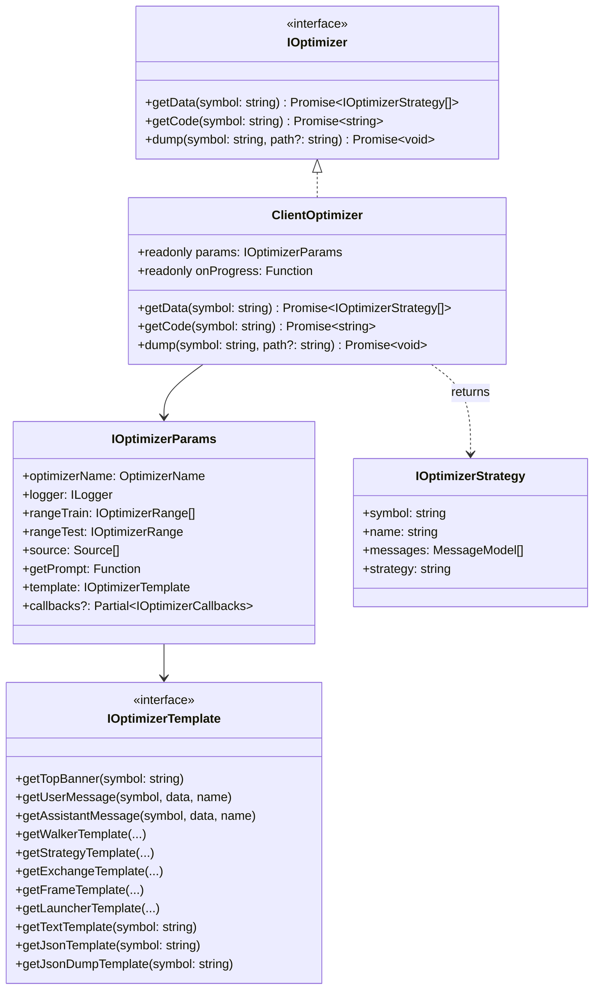
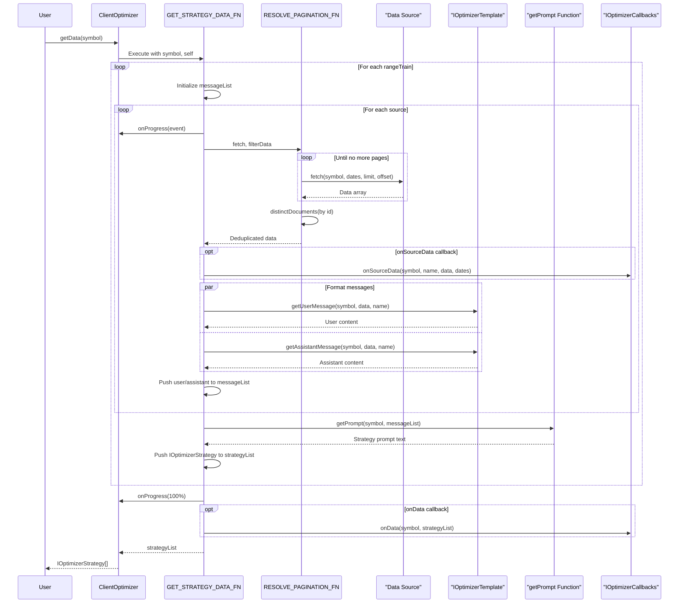
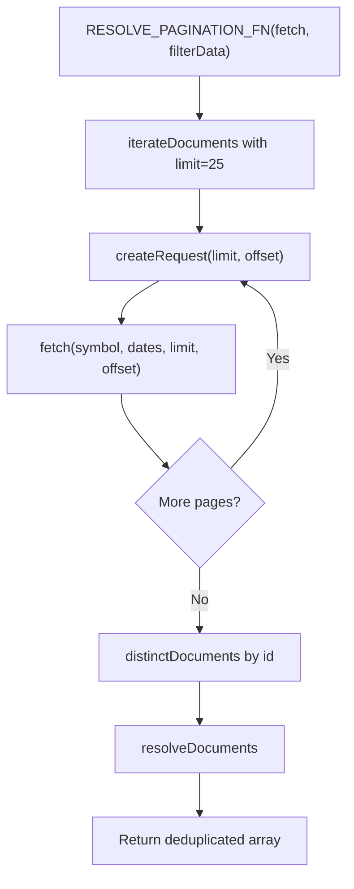
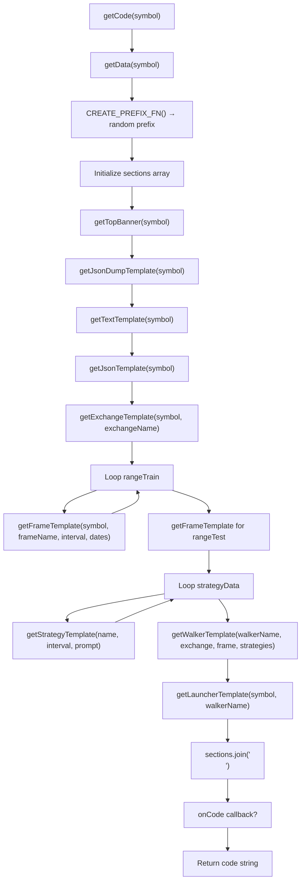
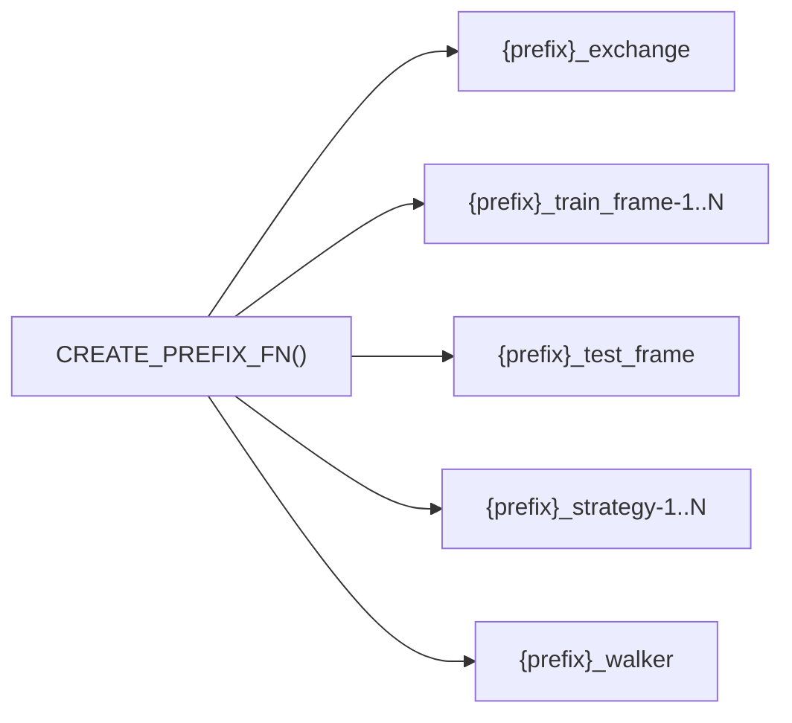
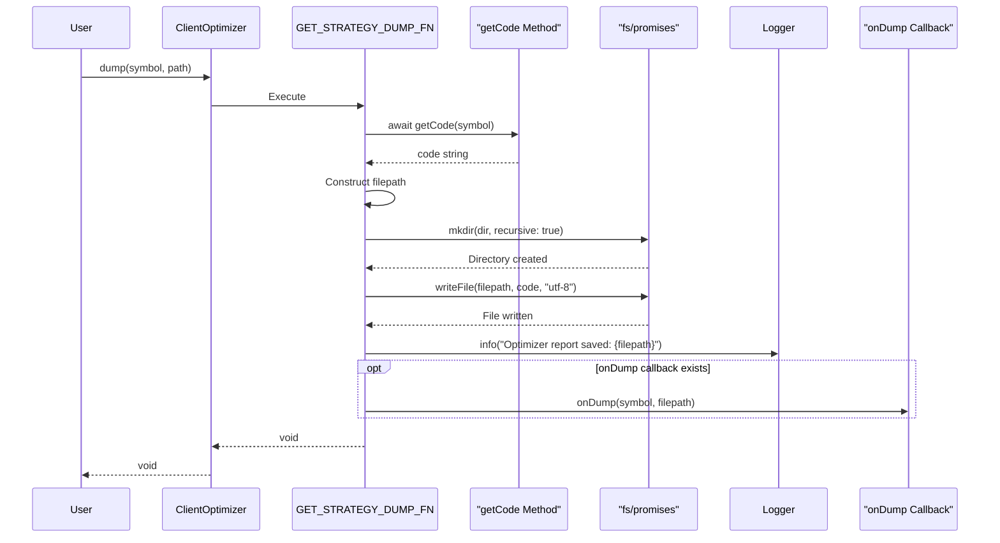
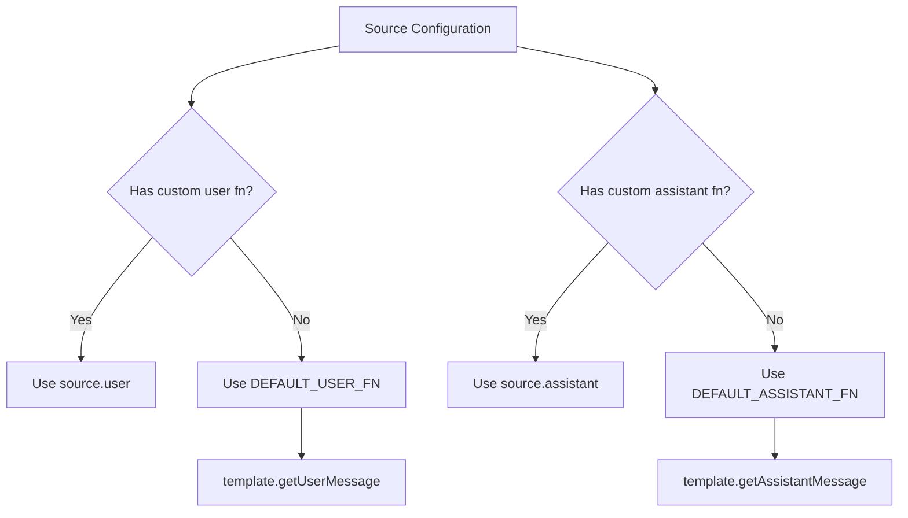
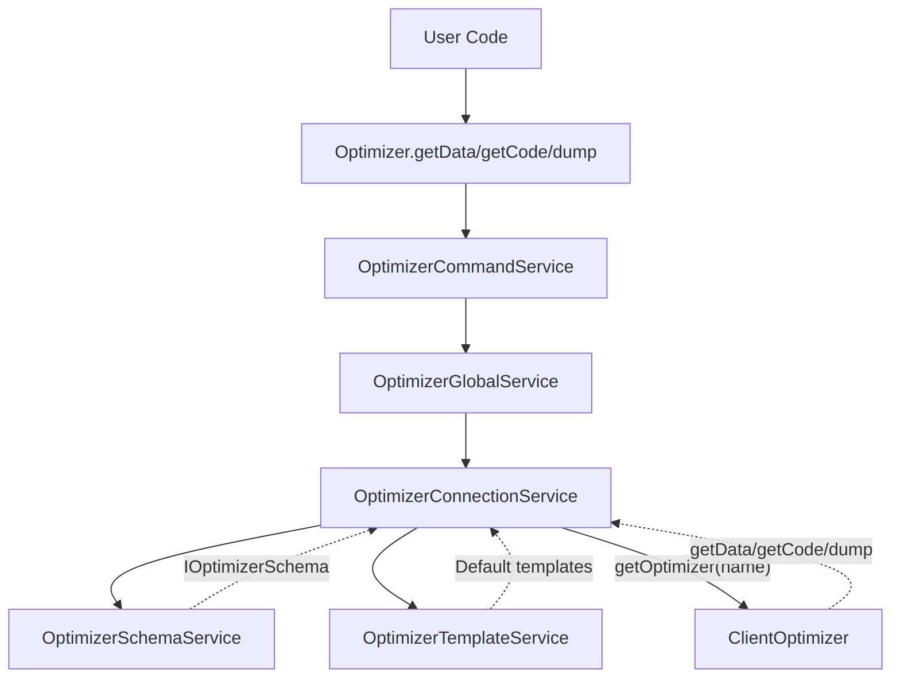
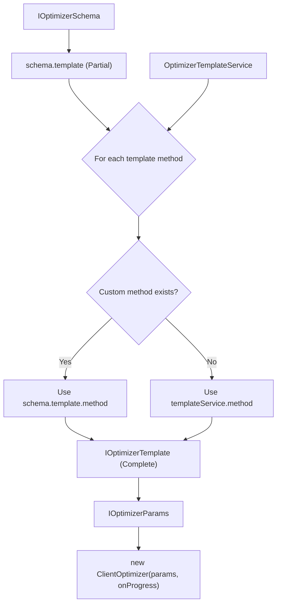
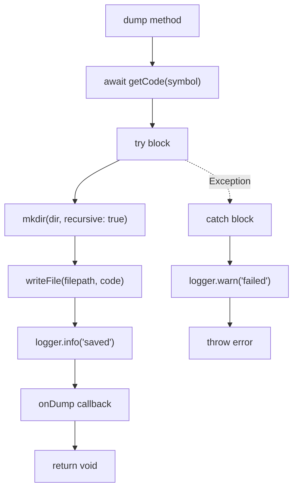

# ClientOptimizer

Relevant source files

The following files were used as context for generating this wiki page:

- [package-lock.json](package-lock.json)
- [package.json](package.json)
- [src/client/ClientOptimizer.ts](src/client/ClientOptimizer.ts)
- [src/interfaces/Optimizer.interface.ts](src/interfaces/Optimizer.interface.ts)
- [src/lib/services/connection/OptimizerConnectionService.ts](src/lib/services/connection/OptimizerConnectionService.ts)
- [src/lib/services/template/OptimizerTemplateService.ts](src/lib/services/template/OptimizerTemplateService.ts)

## Purpose and Scope

`ClientOptimizer` is the core business logic class that implements AI-powered trading strategy generation through LLM integration. This class orchestrates data collection from multiple sources, builds conversation histories for language models, generates executable strategy code, and exports the results to files.

This document covers the internal implementation of the `ClientOptimizer` class, including its methods, helper functions, and data flow. For configuration of optimizer schemas, see [Optimizer Schemas](#5.7). For higher-level concepts about AI optimization architecture and workflow, see [AI-Powered Strategy Optimization](#16.5).

## Class Structure

`ClientOptimizer` implements the `IOptimizer` interface and provides three primary operations: data collection (`getData`), code generation (`getCode`), and file export (`dump`). The class is instantiated by `OptimizerConnectionService` with merged templates and injected dependencies.

### Class Definition

**Sources:** [src/client/ClientOptimizer.ts:1-448](), [src/interfaces/Optimizer.interface.ts:454-484]()

## Constructor and Parameters

The `ClientOptimizer` constructor accepts two arguments: `params` of type `IOptimizerParams` and an `onProgress` callback function for emitting progress events.

### IOptimizerParams Structure

| Field | Type | Description |
|-------|------|-------------|
| `optimizerName` | `OptimizerName` | Unique identifier for the optimizer |
| `logger` | `ILogger` | Logger instance injected by `OptimizerConnectionService` |
| `rangeTrain` | `IOptimizerRange[]` | Array of training time ranges |
| `rangeTest` | `IOptimizerRange` | Testing time range for validation |
| `source` | `Source[]` | Array of data sources (functions or configurations) |
| `getPrompt` | `Function` | Function to generate strategy prompt from messages |
| `template` | `IOptimizerTemplate` | Complete template with all code generation methods |
| `callbacks` | `Partial<IOptimizerCallbacks>` | Optional lifecycle callbacks |

The `params` object is constructed by `OptimizerConnectionService`, which merges custom templates from the optimizer schema with defaults from `OptimizerTemplateService`.

**Sources:** [src/client/ClientOptimizer.ts:397-401](), [src/interfaces/Optimizer.interface.ts:436-451]()

## Data Collection Flow

The `getData` method orchestrates the entire data collection and strategy generation pipeline. It processes each training range, fetches data from all sources, builds LLM conversation histories, and generates strategy prompts.

### getData Sequence Diagram

**Sources:** [src/client/ClientOptimizer.ts:99-215](), [src/client/ClientOptimizer.ts:410-415]()

### Pagination Handling

The `RESOLVE_PAGINATION_FN` helper uses `functools-kit` utilities to handle paginated data sources automatically:

The pagination loop uses `ITERATION_LIMIT = 25` records per request. Data is deduplicated using the `id` field from `IOptimizerData`.

**Sources:** [src/client/ClientOptimizer.ts:70-88](), [src/client/ClientOptimizer.ts:19-20]()

### Progress Event Emission

Progress events are emitted twice for each source: at the start of processing and after all sources complete (100%). The event structure follows `ProgressOptimizerContract`:

| Field | Type | Description |
|-------|------|-------------|
| `optimizerName` | `string` | Optimizer identifier |
| `symbol` | `string` | Trading pair symbol |
| `totalSources` | `number` | Total source count |
| `processedSources` | `number` | Completed sources |
| `progress` | `number` | Decimal 0-1 completion ratio |

**Sources:** [src/client/ClientOptimizer.ts:101-114](), [src/client/ClientOptimizer.ts:201-208]()

## Code Generation Flow

The `getCode` method assembles a complete executable Node.js script by calling template methods in a specific order. The generated code includes all necessary imports, helper functions, component configurations, and launcher code.

### Code Assembly Pipeline

**Sources:** [src/client/ClientOptimizer.ts:225-350](), [src/client/ClientOptimizer.ts:424-429]()

### Template Method Call Order

The code assembly follows this precise 11-step sequence:

1. **getTopBanner** - Shebang, imports, constants
2. **getJsonDumpTemplate** - Debug output function
3. **getTextTemplate** - LLM text generation helper
4. **getJsonTemplate** - LLM JSON generation helper
5. **getExchangeTemplate** - CCXT exchange configuration
6. **getFrameTemplate** (loop) - Training frame configurations
7. **getFrameTemplate** - Test frame configuration
8. **getStrategyTemplate** (loop) - Strategy configurations with LLM
9. **getWalkerTemplate** - Walker comparison setup
10. **getLauncherTemplate** - Execution and event listeners
11. **Join and return** - Concatenate all sections

Each section is separated by an empty line for readability.

**Sources:** [src/client/ClientOptimizer.ts:232-341]()

### Naming Convention

All generated component names use a random prefix to avoid collisions:

The prefix is generated using: `(Math.random() + 1).toString(36).substring(7)`, producing strings like `"x8k2p9f"`.

**Sources:** [src/client/ClientOptimizer.ts:22](), [src/client/ClientOptimizer.ts:228-230]()

## File Export

The `dump` method writes the generated code to a `.mjs` file in the specified directory, creating the directory if it doesn't exist.

### File Path Construction

| Component | Value | Example |
|-----------|-------|---------|
| Directory | `join(process.cwd(), path)` | `/home/user/project/strategies` |
| Filename | `{optimizerName}_{symbol}.mjs` | `optimizer1_BTCUSDT.mjs` |
| Full path | `join(dir, filename)` | `/home/user/project/strategies/optimizer1_BTCUSDT.mjs` |

### Dump Flow

**Sources:** [src/client/ClientOptimizer.ts:360-384](), [src/client/ClientOptimizer.ts:438-444]()

## Helper Functions

`ClientOptimizer` uses four internal helper functions that are not class methods but operate on a `ClientOptimizer` instance passed as the `self` parameter.

### Helper Function Reference

| Function | Purpose | Key Operations |
|----------|---------|----------------|
| `DEFAULT_USER_FN` | Format user messages | Delegates to `template.getUserMessage` |
| `DEFAULT_ASSISTANT_FN` | Format assistant messages | Delegates to `template.getAssistantMessage` |
| `RESOLVE_PAGINATION_FN` | Handle paginated data | Uses `iterateDocuments`, `distinctDocuments`, `resolveDocuments` |
| `GET_STRATEGY_DATA_FN` | Collect data and generate strategies | Orchestrates entire data pipeline |
| `GET_STRATEGY_CODE_FN` | Assemble executable code | Calls all 11 template methods in sequence |
| `GET_STRATEGY_DUMP_FN` | Write code to file | Uses `fs/promises` for file operations |

### Message Formatter Pattern

The user and assistant formatters allow customization per source while providing sensible defaults:

**Sources:** [src/client/ClientOptimizer.ts:34-60](), [src/client/ClientOptimizer.ts:148-176]()

## Integration with Services

`ClientOptimizer` is never instantiated directly by users. Instead, `OptimizerConnectionService` creates and caches instances, handling dependency injection and template merging.

### Service Integration Architecture

**Sources:** [src/lib/services/connection/OptimizerConnectionService.ts:1-175]()

### Template Merging Logic

`OptimizerConnectionService.getOptimizer` merges custom templates from the schema with defaults:

All 11 template methods are resolved using this pattern, ensuring `ClientOptimizer` always receives a complete `IOptimizerTemplate` implementation.

**Sources:** [src/lib/services/connection/OptimizerConnectionService.ts:59-113]()

### Memoization

The `getOptimizer` method is memoized by `optimizerName`, creating only one `ClientOptimizer` instance per registered optimizer. This ensures template merging and dependency injection occur only once per optimizer configuration.

**Sources:** [src/lib/services/connection/OptimizerConnectionService.ts:59-113]()

## Data Structures

### IOptimizerStrategy

The `getData` method returns an array of `IOptimizerStrategy` objects, one per training range:

| Field | Type | Description |
|-------|------|-------------|
| `symbol` | `string` | Trading pair symbol |
| `name` | `string` | Source name from configuration |
| `messages` | `MessageModel[]` | Complete conversation history |
| `strategy` | `string` | Generated strategy prompt from `getPrompt()` |

**Sources:** [src/interfaces/Optimizer.interface.ts:100-123]()

### Source Type Union

The `source` array accepts two types:

1. **IOptimizerSourceFn** - Simple fetch function: `(args: IOptimizerFetchArgs) => Data[]`
2. **IOptimizerSource** - Full configuration with custom formatters:
   - `name: string` - Source identifier
   - `fetch: IOptimizerSourceFn` - Data fetch function
   - `user?: Function` - Custom user message formatter
   - `assistant?: Function` - Custom assistant message formatter

When using a plain function, the source name defaults to `"unknown"`.

**Sources:** [src/interfaces/Optimizer.interface.ts:129-186](), [src/client/ClientOptimizer.ts:20]()

### MessageModel

Conversation history uses `MessageModel` from the shared model layer:

| Field | Type | Values |
|-------|------|--------|
| `role` | `string` | `"user"`, `"assistant"`, `"system"` |
| `content` | `string` | Message text content |

**Sources:** [src/client/ClientOptimizer.ts:14]()

## Error Handling

The `dump` method includes try-catch error handling:

Errors during file operations are logged and re-thrown to the caller.

**Sources:** [src/client/ClientOptimizer.ts:367-383]()