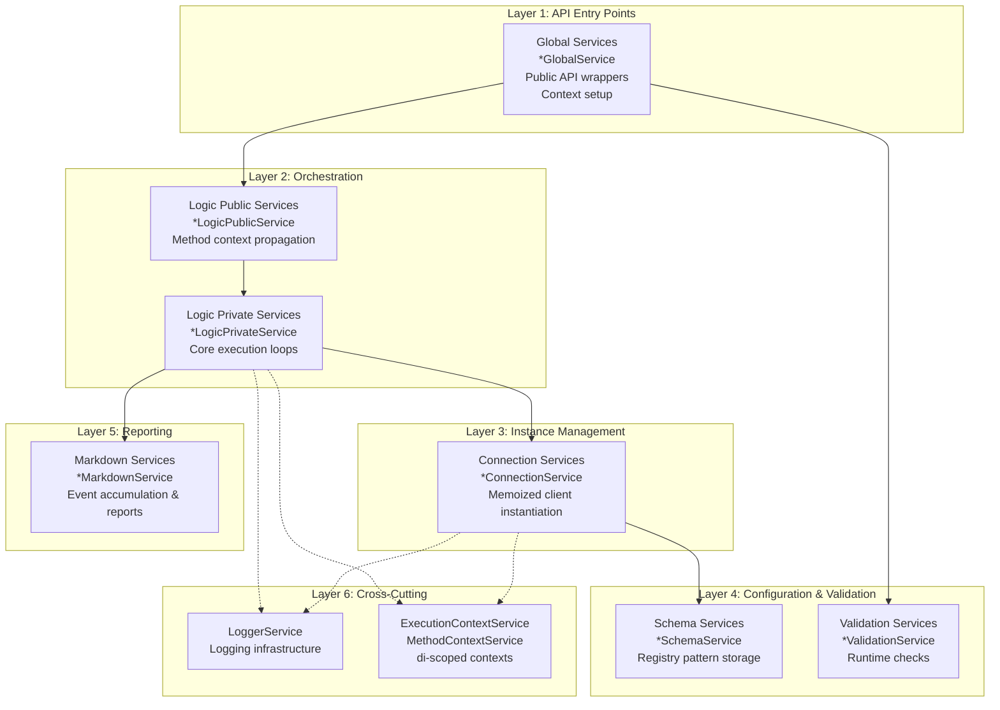
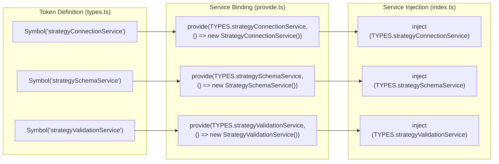
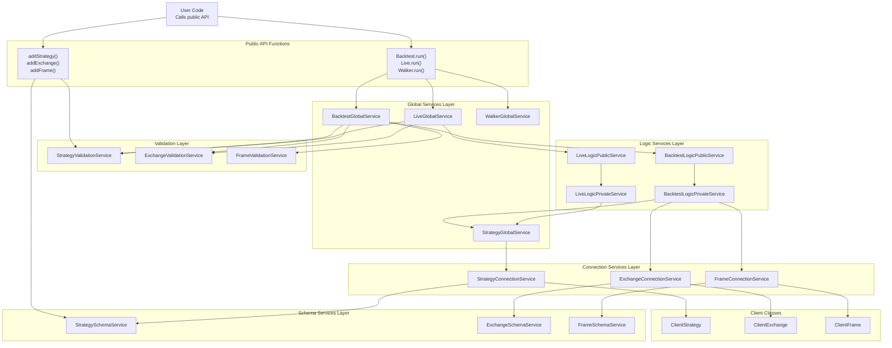
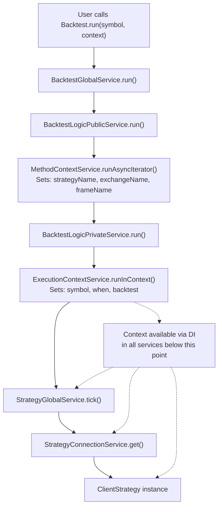

# Service Architecture Overview

Relevant source files

The following files were used as context for generating this wiki page:

- [assets/uml.svg](assets/uml.svg)
- [docs/internals.md](docs/internals.md)
- [docs/uml.puml](docs/uml.puml)
- [scripts/_convert-md-mermaid-to-svg.cjs](scripts/_convert-md-mermaid-to-svg.cjs)
- [scripts/gpt-docs.mjs](scripts/gpt-docs.mjs)
- [scripts/uml.mjs](scripts/uml.mjs)
- [src/function/add.ts](src/function/add.ts)
- [src/function/list.ts](src/function/list.ts)
- [src/lib/core/provide.ts](src/lib/core/provide.ts)
- [src/lib/core/types.ts](src/lib/core/types.ts)
- [src/lib/index.ts](src/lib/index.ts)

## Purpose and Scope

This document explains the service layer architecture in backtest-kit, which sits between the Public API and Client classes. The service layer provides dependency injection, context management, validation, and orchestration logic. This page covers the six service type categories and their relationships. For implementation details of specific service types, see [Connection Services](#7.2), [Schema Services](#7.3), [Validation Services](#7.4), [Global Services](#7.5), [Logic Services](#7.6), and [Markdown Services](#7.7).

## Service Layer Pattern

The service layer implements a 6-layer architecture where each layer has a specific responsibility in the framework's execution pipeline. Services use dependency injection via `di-kit` with Symbol-based tokens for type-safe resolution. All services are registered in [src/lib/core/provide.ts]() and injected in [src/lib/index.ts]().

The service layer isolates business logic (Client classes) from framework concerns (validation, context propagation, persistence, reporting). Client classes have no DI dependencies and receive all parameters explicitly, while services handle cross-cutting concerns through dependency injection.

**Sources:** [src/lib/index.ts:1-170](), [src/lib/core/provide.ts:1-111](), [docs/internals.md:28-40]()

## Service Type Hierarchy

The framework organizes services into six categories, each with a distinct purpose in the execution flow:

**Sources:** [src/lib/index.ts:49-162](), [src/lib/core/types.ts:1-81](), [docs/internals.md:28-40]()

## Service Organization in Code

Services are organized into nine groups in the codebase, with each group containing related service instances:

| Group | Symbol Prefix | File Location | Count |
|-------|---------------|---------------|-------|
| Base Services | `loggerService` | [src/lib/services/base/]() | 1 |
| Context Services | `*ContextService` | [src/lib/services/context/]() | 2 |
| Connection Services | `*ConnectionService` | [src/lib/services/connection/]() | 5 |
| Schema Services | `*SchemaService` | [src/lib/services/schema/]() | 6 |
| Global Services | `*GlobalService` | [src/lib/services/global/]() | 8 |
| Logic Private Services | `*LogicPrivateService` | [src/lib/services/logic/private/]() | 3 |
| Logic Public Services | `*LogicPublicService` | [src/lib/services/logic/public/]() | 3 |
| Markdown Services | `*MarkdownService` | [src/lib/services/markdown/]() | 6 |
| Validation Services | `*ValidationService` | [src/lib/services/validation/]() | 6 |

The dependency injection container is initialized through three files:

1. **[src/lib/core/types.ts]()**: Defines Symbol-based tokens for all services
2. **[src/lib/core/provide.ts]()**: Binds service implementations to tokens using `provide()`
3. **[src/lib/index.ts]()**: Injects services using `inject<T>()` and exports the unified `backtest` object

**Sources:** [src/lib/index.ts:1-170](), [src/lib/core/types.ts:1-81](), [src/lib/core/provide.ts:1-111]()

## Dependency Injection System

Services use Symbol-based dependency injection for type-safe resolution. Each service type has a unique Symbol defined in [src/lib/core/types.ts]():

Services receive dependencies through constructor injection. The DI container resolves the dependency graph at initialization time via `init()` called in [src/lib/index.ts:164]().

**Sources:** [src/lib/core/types.ts:1-81](), [src/lib/core/provide.ts:1-111](), [src/lib/index.ts:1-170]()

## Service Type Responsibilities

Each service type has a specific role in the framework's execution flow:

### Schema Services

Store component configurations using the ToolRegistry pattern from `functools-kit`. Schema services provide a typed registry for strategies, exchanges, frames, walkers, sizing, and risk profiles. They perform shallow validation during registration and allow runtime retrieval by name.

**Key Methods:** `register()`, `get()`, `override()`, `validateShallow()`

**Implementations:** `StrategySchemaService`, `ExchangeSchemaService`, `FrameSchemaService`, `WalkerSchemaService`, `SizingSchemaService`, `RiskSchemaService`

### Validation Services

Perform runtime existence checks and cross-component validation. Validation services use memoization to cache validation results and prevent redundant checks. They verify that referenced components exist before execution begins.

**Key Methods:** `addStrategy()`, `addExchange()`, `addFrame()`, `validate()`, `list()`

**Implementations:** `StrategyValidationService`, `ExchangeValidationService`, `FrameValidationService`, `WalkerValidationService`, `SizingValidationService`, `RiskValidationService`

### Connection Services

Create and memoize Client class instances. Connection services act as factories for `ClientStrategy`, `ClientExchange`, `ClientFrame`, `ClientRisk`, and `ClientSizing`. They use `functools-kit`'s `memoize()` to ensure one instance per component name.

**Key Methods:** `get()` (memoized)

**Implementations:** `StrategyConnectionService`, `ExchangeConnectionService`, `FrameConnectionService`, `SizingConnectionService`, `RiskConnectionService`

### Global Services

Provide public API entry points with validation and context setup. Global services wrap lower-level logic services and ensure all prerequisites are met before execution. They orchestrate validation, context propagation, and delegation to logic services.

**Key Methods:** `tick()`, `backtest()`, `getTimeframe()`, `checkSignal()`

**Implementations:** `StrategyGlobalService`, `ExchangeGlobalService`, `FrameGlobalService`, `BacktestGlobalService`, `LiveGlobalService`, `WalkerGlobalService`, `SizingGlobalService`, `RiskGlobalService`

### Logic Services

Orchestrate execution loops and async generator flows. Logic services are split into Public (context management) and Private (core logic) layers. Public services wrap generators with `MethodContextService.runAsyncIterator()`, while Private services contain the actual backtest/live/walker execution logic.

**Key Methods:** `run()` (async generator)

**Implementations:** `BacktestLogicPublicService`, `BacktestLogicPrivateService`, `LiveLogicPublicService`, `LiveLogicPrivateService`, `WalkerLogicPublicService`, `WalkerLogicPrivateService`

### Markdown Services

Subscribe to event emitters and generate performance reports. Markdown services accumulate signal events, calculate statistics, and format results as markdown tables. They use memoization per strategy/exchange/frame to maintain separate report storage.

**Key Methods:** `getData()`, `getReport()`, `dump()`

**Implementations:** `BacktestMarkdownService`, `LiveMarkdownService`, `ScheduleMarkdownService`, `PerformanceMarkdownService`, `WalkerMarkdownService`, `HeatMarkdownService`

**Sources:** [src/lib/services/schema/](), [src/lib/services/validation/](), [src/lib/services/connection/](), [src/lib/services/global/](), [src/lib/services/logic/](), [src/lib/services/markdown/]()

## Service Dependency Flow

Services form a dependency chain from public API to Client classes:

**Sources:** [src/lib/index.ts:1-170](), [src/lib/services/global/](), [src/lib/services/logic/](), [src/lib/services/connection/]()

## Component-Specific Service Groups

Services are organized around six component types (Strategy, Exchange, Frame, Walker, Sizing, Risk). Each component has a complete service stack:

```mermaid
graph TB
    subgraph "Strategy Services"
        StrGlobal["StrategyGlobalService<br/>Public API"]
        StrConn["StrategyConnectionService<br/>Memoized ClientStrategy"]
        StrSchema["StrategySchemaService<br/>IStrategySchema registry"]
        StrVal["StrategyValidationService<br/>Existence checks"]
        
        StrGlobal --> StrConn
        StrGlobal --> StrVal
        StrConn --> StrSchema
        StrVal --> StrSchema
    end
    
    subgraph "Exchange Services"
        ExGlobal["ExchangeGlobalService<br/>Public API"]
        ExConn["ExchangeConnectionService<br/>Memoized ClientExchange"]
        ExSchema["ExchangeSchemaService<br/>IExchangeSchema registry"]
        ExVal["ExchangeValidationService<br/>Existence checks"]
        
        ExGlobal --> ExConn
        ExGlobal --> ExVal
        ExConn --> ExSchema
        ExVal --> ExSchema
    end
    
    subgraph "Frame Services"
        FrGlobal["FrameGlobalService<br/>Public API"]
        FrConn["FrameConnectionService<br/>Memoized ClientFrame"]
        FrSchema["FrameSchemaService<br/>IFrameSchema registry"]
        FrVal["FrameValidationService<br/>Existence checks"]
        
        FrGlobal --> FrConn
        FrGlobal --> FrVal
        FrConn --> FrSchema
        FrVal --> FrSchema
    end
    
    subgraph "Risk Services"
        RiskGlobal["RiskGlobalService<br/>Public API"]
        RiskConn["RiskConnectionService<br/>Memoized ClientRisk"]
        RiskSchema["RiskSchemaService<br/>IRiskSchema registry"]
        RiskVal["RiskValidationService<br/>Existence checks"]
        
        RiskGlobal --> RiskConn
        RiskGlobal --> RiskVal
        RiskConn --> RiskSchema
        RiskVal --> RiskSchema
    end
    
    subgraph "Sizing Services"
        SizingGlobal["SizingGlobalService<br/>Public API"]
        SizingConn["SizingConnectionService<br/>Memoized ClientSizing"]
        SizingSchema["SizingSchemaService<br/>ISizingSchema registry"]
        SizingVal["SizingValidationService<br/>Existence checks"]
        
        SizingGlobal --> SizingConn
        SizingGlobal --> SizingVal
        SizingConn --> SizingSchema
        SizingVal --> SizingSchema
    end
    
    subgraph "Walker Services"
        WkGlobal["WalkerGlobalService<br/>Public API"]
        WkLogicPub["WalkerLogicPublicService<br/>Context wrapper"]
        WkLogicPriv["WalkerLogicPrivateService<br/>Multi-strategy loop"]
        WkSchema["WalkerSchemaService<br/>IWalkerSchema registry"]
        WkVal["WalkerValidationService<br/>Existence checks"]
        WkMd["WalkerMarkdownService<br/>Comparison reports"]
        
        WkGlobal --> WkLogicPub
        WkGlobal --> WkVal
        WkLogicPub --> WkLogicPriv
        WkLogicPriv --> WkSchema
        WkLogicPriv --> WkMd
        WkVal --> WkSchema
    end
```

The pattern is consistent across all components: Global → Validation/Logic → Connection → Schema → Client. This uniformity makes the codebase predictable and maintainable.

**Sources:** [src/lib/core/types.ts:1-81](), [src/lib/index.ts:49-162](), [src/lib/core/provide.ts:1-111]()

## Context Propagation Through Services

Services use `MethodContextService` and `ExecutionContextService` from `di-scoped` to propagate context without explicit parameters. The context flows through the service stack:

Services at any depth can resolve `MethodContextService` or `ExecutionContextService` via DI to access context without it being passed as parameters. This enables clean APIs where strategy authors call `getCandles(symbol, interval, limit)` instead of `getCandles(symbol, interval, limit, context)`.

**Sources:** [src/lib/services/context/ExecutionContextService.ts](), [src/lib/services/context/MethodContextService.ts](), [src/lib/services/logic/public/]()