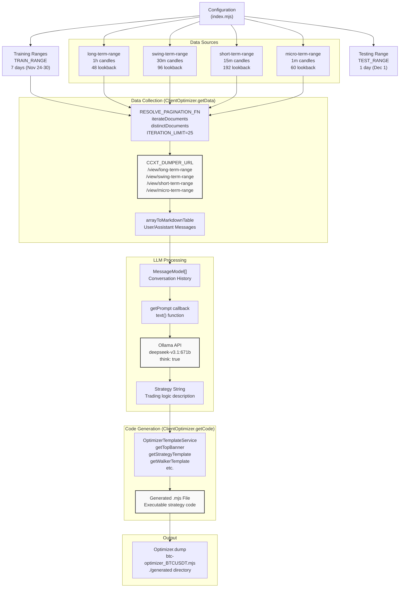
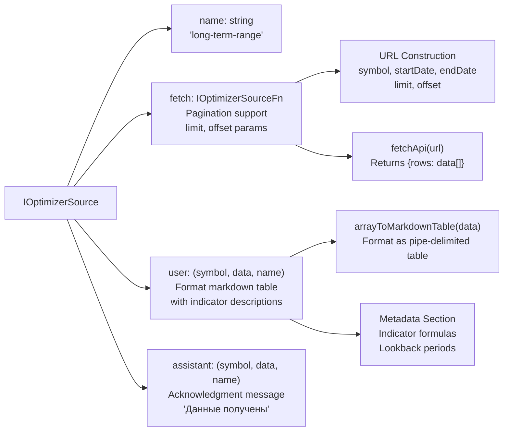
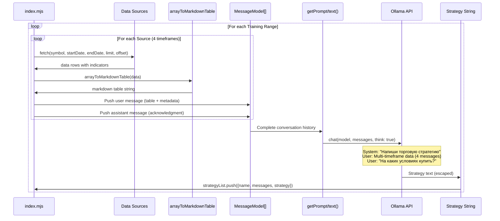
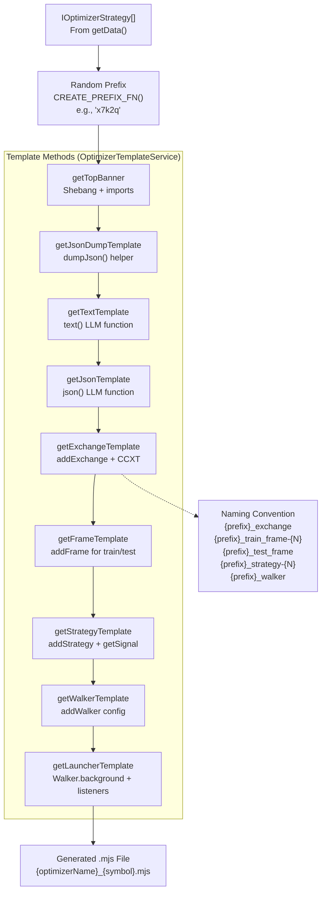

# Optimization Demo

# Optimization Demo

<details>
<summary>Relevant source files</summary>

The following files were used as context for generating this wiki page:

- [demo/optimization/.env.example](demo/optimization/.env.example)
- [demo/optimization/.gitignore](demo/optimization/.gitignore)
- [demo/optimization/src/index.mjs](demo/optimization/src/index.mjs)
- [src/classes/Optimizer.ts](src/classes/Optimizer.ts)
- [src/client/ClientOptimizer.ts](src/client/ClientOptimizer.ts)
- [src/contract/ProgressOptimizer.contract.ts](src/contract/ProgressOptimizer.contract.ts)
- [src/interfaces/Optimizer.interface.ts](src/interfaces/Optimizer.interface.ts)
- [src/lib/services/connection/OptimizerConnectionService.ts](src/lib/services/connection/OptimizerConnectionService.ts)
- [src/lib/services/global/OptimizerGlobalService.ts](src/lib/services/global/OptimizerGlobalService.ts)
- [src/lib/services/schema/OptimizerSchemaService.ts](src/lib/services/schema/OptimizerSchemaService.ts)
- [src/lib/services/template/OptimizerTemplateService.ts](src/lib/services/template/OptimizerTemplateService.ts)
- [src/lib/services/validation/OptimizerValidationService.ts](src/lib/services/validation/OptimizerValidationService.ts)
- [src/model/Message.model.ts](src/model/Message.model.ts)

</details>


## Purpose and Scope

The optimization demo demonstrates the **LLM-based strategy generation** capabilities of backtest-kit. This demo uses historical market data from multiple timeframes to generate trading strategies via Large Language Model (LLM) inference, then produces executable strategy code that can be backtested using the Walker mode.

The demo showcases:
- Multi-timeframe technical analysis data collection (1m, 15m, 30m, 1h candles)
- LLM conversation history building with market data
- Automated strategy code generation with complete executable output
- Integration with external data sources (CCXT Dumper API) and LLM providers (Ollama)

For general Optimizer system architecture, see [Optimizer Mode](./20-optimizer-mode.md). For information on running demos in general, see [Running Demos](./39-running-demos.md).

**Sources:** [demo/optimization/src/index.mjs:1-399]()

---

## Demo Architecture and Data Flow

The optimization demo follows a structured pipeline from data collection through LLM inference to code generation:



**Workflow:**

1. **Configuration**: Demo defines 7 training ranges (one per day) and 1 testing range
2. **Data Collection**: For each training range, fetch data from 4 timeframe sources via pagination
3. **Message Formatting**: Convert technical indicator data to markdown tables for LLM consumption
4. **LLM Inference**: Build conversation history and call Ollama API to generate strategy logic
5. **Code Generation**: Use `OptimizerTemplateService` to create complete executable code
6. **File Export**: Save generated strategy to `./generated/btc-optimizer_BTCUSDT.mjs`

**Sources:** [demo/optimization/src/index.mjs:1-399](), [src/client/ClientOptimizer.ts:99-215](), [src/lib/services/template/OptimizerTemplateService.ts:1-716]()

---

## Data Source Configuration

The demo configures four data sources, each representing a different timeframe for technical analysis. These sources fetch pre-calculated technical indicators from the CCXT Dumper API.

### Source Specifications

| Source Name | Timeframe | Lookback Period | Key Indicators |
|------------|-----------|-----------------|----------------|
| `long-term-range` | 1-hour candles | 48 candles (48h) | RSI(14), MACD(12,26,9), ADX(14), ATR(14), Bollinger(20,2.0), Fibonacci levels |
| `swing-term-range` | 30-minute candles | 96 candles (48h) | RSI(14), MACD(12,26,9), ADX(14), CCI(20), Stochastic(14,3,3), Momentum(8) |
| `short-term-range` | 15-minute candles | 192 candles (48h) | RSI(9), MACD(8,21,5), ADX(14), CCI(14), ROC(5,10), Support/Resistance |
| `micro-term-range` | 1-minute candles | 60 candles (1h) | RSI(9), MACD(8,21,5), Bollinger(8,2.0), Stochastic(3,3,3), ATR(5,9), Squeeze Momentum |

### Source Structure

Each source in `SOURCE_LIST` implements `IOptimizerSource` interface:



**Fetch Function Example:**

The fetch function constructs URLs with query parameters and retrieves data from CCXT Dumper API:

```
URL: ${CCXT_DUMPER_URL}/view/long-term-range
Params: symbol, startDate (timestamp), endDate (timestamp), limit (1000), offset (0)
Response: { rows: Array<IOptimizerData> }
```

**User Message Format:**

Each user message contains:
1. Title: "# {Timeframe} Candles Trading Analysis for {symbol} (Historical Data)"
2. Markdown table with all indicator values
3. Data Sources section explaining each indicator with min/max ranges

**Sources:** [demo/optimization/src/index.mjs:66-310](), [src/interfaces/Optimizer.interface.ts:129-177]()

---

## LLM Integration and Prompt Construction

The demo uses Ollama API with the `deepseek-v3.1:671b` model to generate trading strategies. The LLM receives multi-timeframe market data and produces strategy recommendations.

### Message Flow Sequence



### Text Generation Function

The `text()` function implements the LLM call with specific system instructions:

**Function:** [demo/optimization/src/index.mjs:312-359]()

**Key Configuration:**
- **Model**: `deepseek-v3.1:671b`
- **Think Mode**: `true` (enables reasoning)
- **System Messages**:
  - Primary instruction: "Напиши торговую стратегию где нет ничего лишнего" (Write clean strategy)
  - Reasoning level: "high"
  - Output constraint: "Не здоровайся, не говори что делаешь - только отчёт" (No greetings, just report)

**Final User Prompt:**
```
На каких условиях мне купить {symbol}?
Дай анализ рынка на основе поддержки/сопротивления, точек входа в LONG/SHORT позиции.
Какой RR ставить для позиций?
Предпочтительны LONG или SHORT позиции?

Сделай не сухой технический, а фундаментальный анализ, содержащий стратигическую рекомендацию
```

### Response Processing

The LLM response is escaped to prevent code injection when inserted into generated templates:

**Escaping Chain:** [demo/optimization/src/index.mjs:353-358]()
```
content.replace(/\\/g, "\\\\")    // Escape backslashes
       .replace(/`/g, "\\`")       // Escape backticks
       .replace(/\$/g, "\\$")      // Escape dollar signs
       .replace(/"/g, '\\"')       // Escape double quotes
       .replace(/'/g, "\\'")       // Escape single quotes
```

**Sources:** [demo/optimization/src/index.mjs:312-359](), [src/interfaces/Optimizer.interface.ts:100-123]()

---

## Generated Code Structure

The optimizer generates a complete executable Node.js script containing all necessary components for strategy backtesting. The generated file follows a structured template system.

### Code Generation Pipeline



### Generated File Sections

The generated code contains 9 distinct sections, concatenated with newlines:

| Section | Template Method | Content | Lines Example |
|---------|----------------|---------|---------------|
| 1. Top Banner | `getTopBanner()` | Shebang, imports, constants | [src/lib/services/template/OptimizerTemplateService.ts:36-66]() |
| 2. JSON Dump Helper | `getJsonDumpTemplate()` | `dumpJson()` function for debug output | [src/lib/services/template/OptimizerTemplateService.ts:452-546]() |
| 3. Text Helper | `getTextTemplate()` | `text()` function for LLM text generation | [src/lib/services/template/OptimizerTemplateService.ts:555-612]() |
| 4. JSON Helper | `getJsonTemplate()` | `json()` function for structured signal output | [src/lib/services/template/OptimizerTemplateService.ts:629-712]() |
| 5. Exchange Config | `getExchangeTemplate()` | `addExchange()` with CCXT Binance | [src/lib/services/template/OptimizerTemplateService.ts:314-342]() |
| 6. Frame Configs | `getFrameTemplate()` | Multiple `addFrame()` calls (train + test) | [src/lib/services/template/OptimizerTemplateService.ts:354-385]() |
| 7. Strategy Configs | `getStrategyTemplate()` | Multiple `addStrategy()` with LLM integration | [src/lib/services/template/OptimizerTemplateService.ts:168-304]() |
| 8. Walker Config | `getWalkerTemplate()` | `addWalker()` for strategy comparison | [src/lib/services/template/OptimizerTemplateService.ts:122-157]() |
| 9. Launcher | `getLauncherTemplate()` | `Walker.background()` + event listeners | [src/lib/services/template/OptimizerTemplateService.ts:395-443]() |

### Strategy Template Details

The strategy template is the most complex section, containing multi-timeframe candle fetching and LLM inference:

**Structure:** [src/lib/services/template/OptimizerTemplateService.ts:168-304]()

```javascript
addStrategy({
    strategyName: "{prefix}_strategy-{N}",
    interval: "5m",
    getSignal: async (symbol) => {
        const messages = [];
        
        // Load candles for all timeframes
        const microTermCandles = await getCandles(symbol, "1m", 30);
        const mainTermCandles = await getCandles(symbol, "5m", 24);
        const shortTermCandles = await getCandles(symbol, "15m", 24);
        const mediumTermCandles = await getCandles(symbol, "1h", 24);
        
        // Build conversation with 4 user/assistant pairs (one per timeframe)
        // ...push messages analyzing 1h, 15m, 5m, 1m data
        
        // Final prompt with strategy logic (from LLM-generated text)
        messages.push({
            role: "user",
            content: [
                "Проанализируй все таймфреймы и сгенерируй торговый сигнал...",
                `{ESCAPED_STRATEGY_PROMPT}`,
                "Если сигналы противоречивы или тренд слабый то position: wait"
            ].join("\\n"),
        });
        
        // Call json() helper for structured output
        const result = await json(messages);
        
        // Dump debug data and return signal
        await dumpJson(resultId, messages, result);
        return result;
    },
});
```

### Signal Schema

The `json()` helper uses a JSON schema to ensure structured signal output:

**Schema Fields:** [src/lib/services/template/OptimizerTemplateService.ts:675-704]()

| Field | Type | Enum/Range | Description |
|-------|------|------------|-------------|
| `position` | string | `"wait"` \| `"long"` \| `"short"` | Trade decision |
| `note` | string | - | Strategy explanation |
| `priceOpen` | number | > 0 | Entry price (market or limit) |
| `priceTakeProfit` | number | > 0 | Target exit price |
| `priceStopLoss` | number | > 0 | Stop loss price |
| `minuteEstimatedTime` | number | 0-360 | Expected duration to TP |

**Sources:** [src/lib/services/template/OptimizerTemplateService.ts:1-716](), [src/client/ClientOptimizer.ts:217-350]()

---

## Environment Configuration

The demo requires two environment variables for external service integration:

### Required Variables

```bash
OLLAMA_API_KEY=your_ollama_api_key_here
CCXT_DUMPER_URL=http://your-ccxt-dumper-url:port
```

**`OLLAMA_API_KEY`**:
- Used for authentication with Ollama hosted API
- Injected in Authorization header: `Bearer ${process.env.OLLAMA_API_KEY}`
- Required for `text()` function calls to `https://ollama.com`
- **Usage:** [demo/optimization/src/index.mjs:316]()

**`CCXT_DUMPER_URL`**:
- Base URL for CCXT Dumper API endpoints
- Used to construct view URLs: `${CCXT_DUMPER_URL}/view/{source-name}`
- Provides pre-calculated technical indicators for multiple timeframes
- **Usage:** [demo/optimization/src/index.mjs:71](), [demo/optimization/src/index.mjs:129](), [demo/optimization/src/index.mjs:186](), [demo/optimization/src/index.mjs:241]()

### CCXT Dumper Integration

The demo expects CCXT Dumper to expose four endpoints:

```
GET /view/long-term-range?symbol=BTCUSDT&startDate=1732406400000&endDate=1732492799999&limit=1000&offset=0
GET /view/swing-term-range?symbol=BTCUSDT&startDate=1732406400000&endDate=1732492799999&limit=1000&offset=0
GET /view/short-term-range?symbol=BTCUSDT&startDate=1732406400000&endDate=1732492799999&limit=1000&offset=0
GET /view/micro-term-range?symbol=BTCUSDT&startDate=1732406400000&endDate=1732492799999&limit=1000&offset=0
```

**Response Format:**
```json
{
  "rows": [
    {
      "id": "unique_row_id",
      "timestamp": 1732406400000,
      "rsi": 45.67,
      "macd": 12.34,
      "signal": 10.23,
      // ... other indicators
    }
  ]
}
```

**Reference:** CCXT Dumper API documented at [https://github.com/tripolskypetr/node-ccxt-dumper](https://github.com/tripolskypetr/node-ccxt-dumper)

**Sources:** [demo/optimization/.env.example:1-3](), [demo/optimization/src/index.mjs:66-310]()

---

## Running the Demo

### Prerequisites

1. Install dependencies in demo directory:
   ```bash
   cd demo/optimization
   npm install
   ```

2. Create `.env` file with required variables:
   ```bash
   cp .env.example .env
   # Edit .env with your API keys
   ```

3. Ensure CCXT Dumper service is running and accessible

### Execution

**Command:**
```bash
npm start
```

**Execution Flow:** [demo/optimization/src/index.mjs:361-399]()

1. **Registration**: `addOptimizer()` registers optimizer configuration with 7 training ranges, 4 data sources, and LLM prompt generation
2. **Progress Monitoring**: `listenOptimizerProgress()` logs completion percentage
3. **Code Generation**: `Optimizer.dump()` executes the full pipeline:
   - Fetch data from all sources for each training range
   - Build LLM conversation history
   - Generate strategy prompts via Ollama
   - Produce executable code using templates
   - Write to `./generated/btc-optimizer_BTCUSDT.mjs`

### Progress Output

```
Progress: 0%
Progress: 3.57%
Progress: 7.14%
...
Progress: 100%
```

**Progress Calculation:** [src/client/ClientOptimizer.ts:102-114]()
```
progress = processedSources / totalSources
totalSources = rangeTrain.length × source.length
            = 7 training ranges × 4 sources
            = 28 total data fetches
```

### Generated Output Location

**File Path:** `./generated/btc-optimizer_BTCUSDT.mjs`

**File Structure:**
- Executable Node.js script with shebang `#!/usr/bin/env node`
- Complete standalone file with all dependencies imported
- Can be executed directly after generation

**Alternative Operations:**

Commented code in [demo/optimization/src/index.mjs:385-398]() shows how to retrieve strategy data without code generation:

```javascript
await Optimizer.getData("BTCUSDT", {
  optimizerName: "btc-optimizer",
}).then((list) =>
  fs.writeFile(
    "./strategy_list.json",
    JSON.stringify(
      list.map(({ strategy }) => strategy),
      null,
      2
    )
  )
);
```

This extracts only the LLM-generated strategy text for inspection without generating full executable code.

**Sources:** [demo/optimization/src/index.mjs:361-399](), [src/classes/Optimizer.ts:100-120]()

---

## Debug Output and Logging

The generated strategy code includes debug output capabilities via the `dumpJson()` helper function. This creates detailed logs of LLM interactions for analysis and troubleshooting.

### Debug Directory Structure

```
./dump/strategy/
└── {resultId}/
    ├── 00_system_prompt.md
    ├── 01_user_message.md
    ├── 02_user_message.md
    ├── 03_user_message.md
    ├── 04_user_message.md
    └── 05_llm_output.md
```

### Debug File Contents

| File | Content | Purpose |
|------|---------|---------|
| `00_system_prompt.md` | System messages + output data JSON | Shows system instructions and final signal result |
| `0X_user_message.md` | User input markdown with timestamp | Documents each timeframe analysis request |
| `05_llm_output.md` | Final LLM response JSON | Shows the structured signal output |

**Template Implementation:** [src/lib/services/template/OptimizerTemplateService.ts:452-546]()

### Size Warning System

The `dumpJson()` function includes size monitoring to warn about large messages that may impact LLM performance:

**Warning Logic:** [src/lib/services/template/OptimizerTemplateService.ts:507-515]()
```javascript
const messageSizeBytes = Buffer.byteLength(message.content, "utf8");
const messageSizeKb = Math.floor(messageSizeBytes / 1024);
if (messageSizeKb > WARN_KB) {  // WARN_KB = 100
    console.warn(
        `User message ${idx + 1} is ${messageSizeBytes} bytes (${messageSizeKb}kb), 
         which exceeds warning limit`
    );
}
```

### Progress Events

The optimizer emits progress events during data collection, allowing real-time monitoring:

**Event Contract:** [src/contract/ProgressOptimizer.contract.ts:17-28]()

```typescript
interface ProgressOptimizerContract {
    optimizerName: string;     // "btc-optimizer"
    symbol: string;            // "BTCUSDT"
    totalSources: number;      // 28 (7 ranges × 4 sources)
    processedSources: number;  // Current count
    progress: number;          // 0.0 to 1.0
}
```

**Emission Points:** [src/client/ClientOptimizer.ts:108-114](), [src/client/ClientOptimizer.ts:201-208]()

Progress events are emitted:
1. At the start of processing each source
2. After completing all sources (100%)

**Sources:** [src/lib/services/template/OptimizerTemplateService.ts:452-546](), [src/contract/ProgressOptimizer.contract.ts:1-31](), [src/client/ClientOptimizer.ts:99-215]()