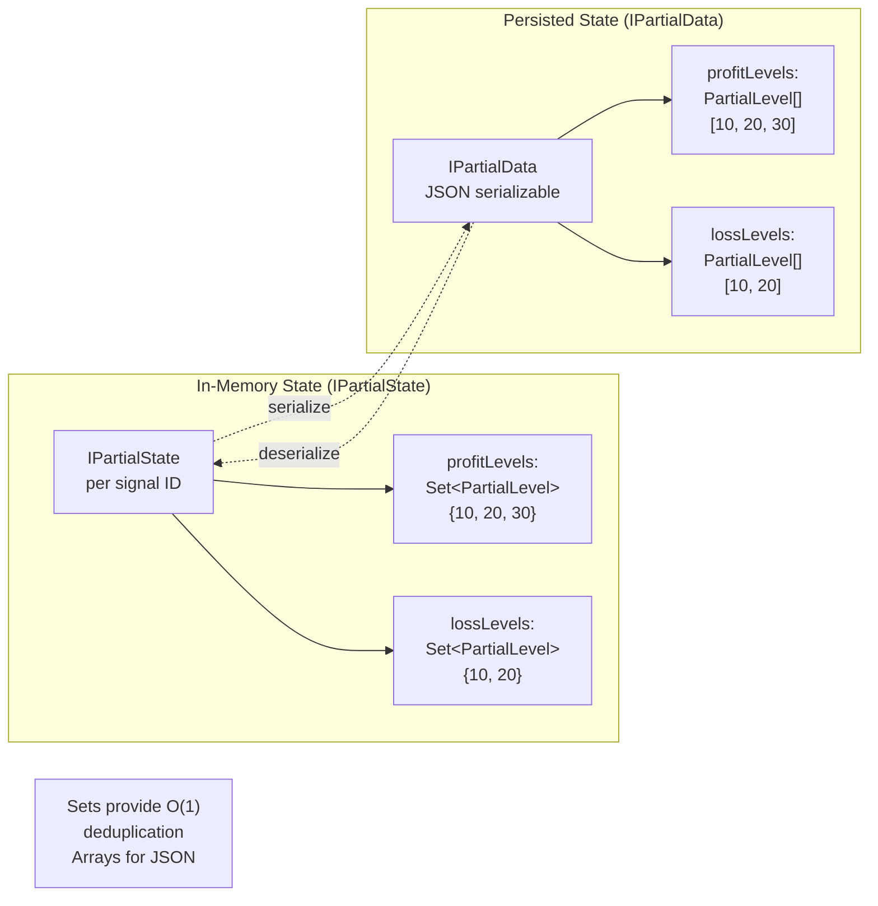
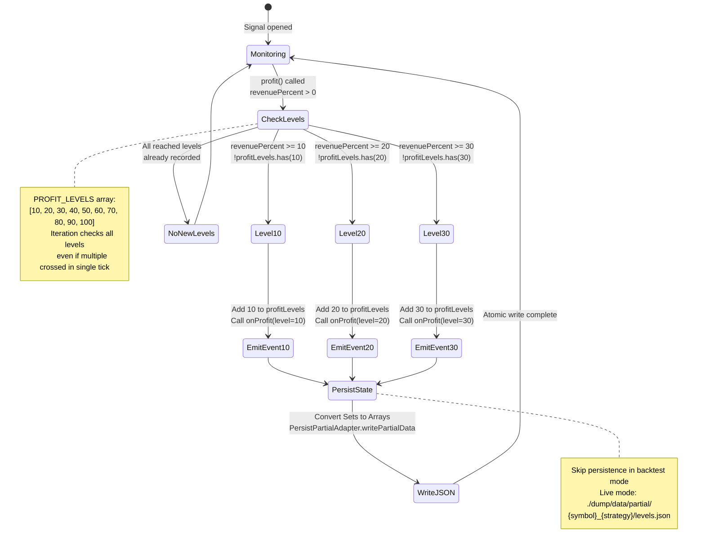
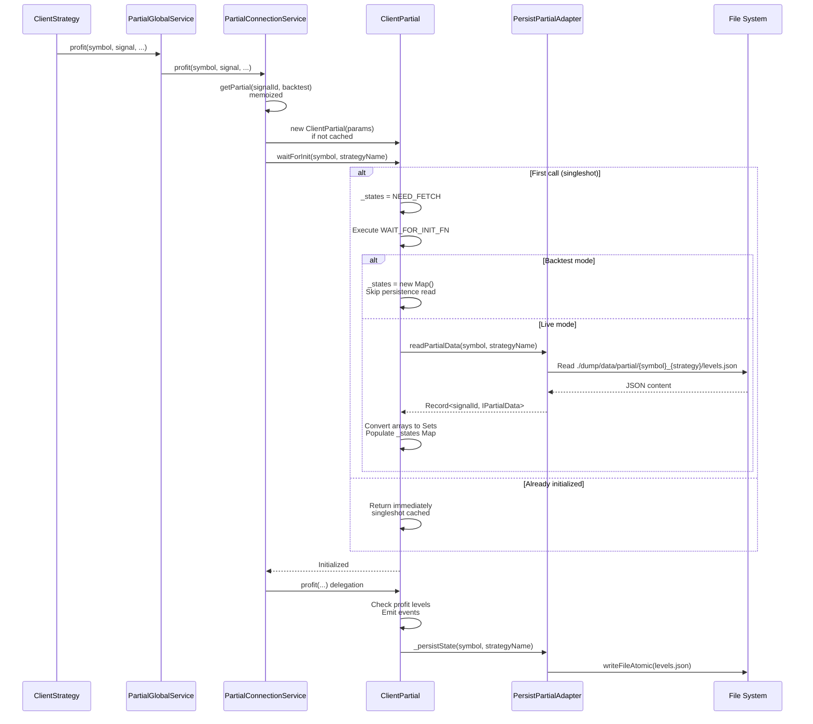
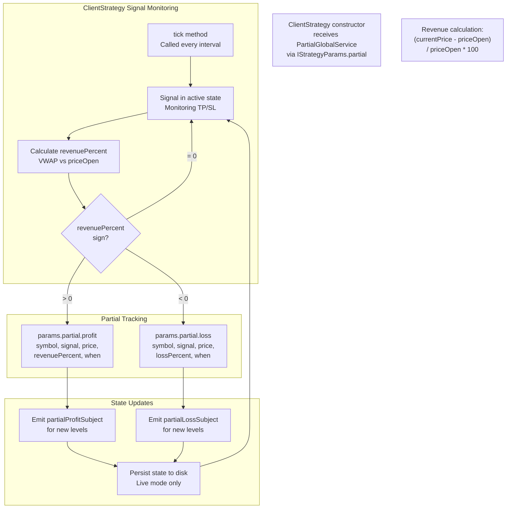
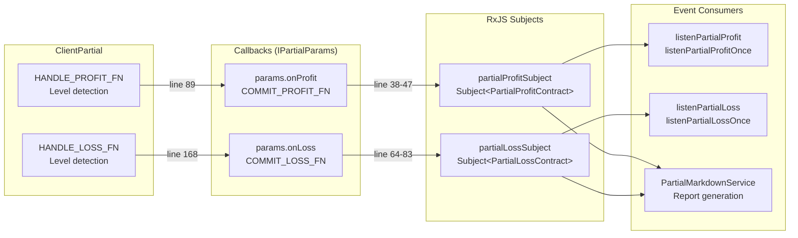

# ClientPartial

<details>
<summary>Relevant source files</summary>

The following files were used as context for generating this wiki page:

- [src/classes/Persist.ts](src/classes/Persist.ts)
- [src/client/ClientPartial.ts](src/client/ClientPartial.ts)
- [src/config/emitters.ts](src/config/emitters.ts)
- [src/contract/PartialLoss.contract.ts](src/contract/PartialLoss.contract.ts)
- [src/contract/PartialProfit.contract.ts](src/contract/PartialProfit.contract.ts)
- [src/function/event.ts](src/function/event.ts)
- [src/index.ts](src/index.ts)
- [src/interfaces/Partial.interface.ts](src/interfaces/Partial.interface.ts)
- [src/lib/services/connection/PartialConnectionService.ts](src/lib/services/connection/PartialConnectionService.ts)
- [src/lib/services/global/PartialGlobalService.ts](src/lib/services/global/PartialGlobalService.ts)
- [types.d.ts](types.d.ts)

</details>


## Purpose and Scope

ClientPartial implements milestone-based profit/loss tracking for active trading signals. It monitors when signals reach specific profit or loss thresholds (10%, 20%, 30%, etc.) and emits events for each milestone exactly once per signal. The system provides crash-safe state persistence for live trading and integrates with the broader signal lifecycle through PartialGlobalService and PartialConnectionService.

For signal lifecycle state management, see [ClientStrategy](#6.1). For persistence architecture details, see [Persistence Layer](#15.3). For event consumption patterns, see [Event Listeners](#4.8).

---

## Architecture Overview

ClientPartial operates within a multi-layered service architecture that separates concerns between core logic, instance management, and global coordination.

```mermaid
graph TB
    subgraph "Strategy Layer"
        STRAT[ClientStrategy<br/>Signal monitoring<br/>tick/backtest methods]
    end
    
    subgraph "Global Service Layer"
        PGLOBAL[PartialGlobalService<br/>Entry point<br/>Validation & logging]
    end
    
    subgraph "Connection Service Layer"
        PCONN[PartialConnectionService<br/>Factory & lifecycle<br/>Memoized instances]
    end
    
    subgraph "Client Implementation Layer"
        CP[ClientPartial<br/>Milestone tracking<br/>State management]
        STATE["_states: Map&lt;signalId, IPartialState&gt;<br/>profitLevels: Set&lt;PartialLevel&gt;<br/>lossLevels: Set&lt;PartialLevel&gt;"]
    end
    
    subgraph "Persistence Layer"
        PPA[PersistPartialAdapter<br/>./dump/data/partial/<br/>{symbol}_{strategy}/levels.json]
        ATOMIC[writeFileAtomic<br/>Atomic file writes<br/>tmp → rename pattern]
    end
    
    subgraph "Event System"
        PROFIT_SUB[partialProfitSubject<br/>PartialProfitContract]
        LOSS_SUB[partialLossSubject<br/>PartialLossContract]
    end
    
    STRAT -->|profit/loss/clear| PGLOBAL
    PGLOBAL -->|delegates| PCONN
    PCONN -->|getPartial memoized| CP
    CP -->|manages| STATE
    CP -->|waitForInit reads| PPA
    CP -->|_persistState writes| PPA
    PPA -->|uses| ATOMIC
    CP -->|onProfit callback| PROFIT_SUB
    CP -->|onLoss callback| LOSS_SUB
    
    NOTE1["Memoization key:<br/>signalId:backtest<br/>One instance per signal"]
    NOTE2["Live mode only:<br/>No persistence<br/>in backtest"]
    
    PCONN -.-> NOTE1
    PPA -.-> NOTE2
```

**Sources**: [src/client/ClientPartial.ts:1-538](), [src/lib/services/connection/PartialConnectionService.ts:1-267](), [src/lib/services/global/PartialGlobalService.ts:1-205](), [src/classes/Persist.ts:662-740]()

---

## Core Components

### ClientPartial Class

ClientPartial is the core implementation that tracks profit/loss milestones for individual signals. Each instance is tied to a specific `signalId` and `backtest` mode.

| Property | Type | Purpose |
|----------|------|---------|
| `_states` | `Map<string, IPartialState>` \| `typeof NEED_FETCH` | Map of signal IDs to their profit/loss state, or sentinel before initialization |
| `params.signalId` | `string` | Unique signal ID associated with this instance |
| `params.logger` | `ILogger` | Logger service for debug and info messages |
| `params.backtest` | `boolean` | Execution mode flag (true = backtest, false = live) |
| `params.onProfit` | `function` | Callback for profit level events |
| `params.onLoss` | `function` | Callback for loss level events |

**Key Methods**:

- `waitForInit(symbol, strategyName)`: Loads persisted state from disk (live mode only), wrapped with `singleshot` to ensure one-time execution
- `profit(symbol, data, currentPrice, revenuePercent, backtest, when)`: Checks for newly reached profit levels, emits events, persists state
- `loss(symbol, data, currentPrice, lossPercent, backtest, when)`: Checks for newly reached loss levels, emits events, persists state
- `clear(symbol, data, priceClose, backtest)`: Removes signal state and persists changes
- `_persistState(symbol, strategyName)`: Converts in-memory Maps/Sets to JSON and writes atomically

**Sources**: [src/client/ClientPartial.ts:292-538](), [src/interfaces/Partial.interface.ts:60-128]()

### State Structures



**Type Definitions**:

```typescript
// In-memory state (Sets for O(1) lookup)
interface IPartialState {
  profitLevels: Set<PartialLevel>;
  lossLevels: Set<PartialLevel>;
}

// Persisted state (Arrays for JSON serialization)
interface IPartialData {
  profitLevels: PartialLevel[];
  lossLevels: PartialLevel[];
}

// Milestone levels (10%, 20%, ..., 100%)
type PartialLevel = 10 | 20 | 30 | 40 | 50 | 60 | 70 | 80 | 90 | 100;
```

**Sources**: [src/interfaces/Partial.interface.ts:16-58]()

---

## Milestone Detection System

### Profit Level Tracking

The profit detection algorithm iterates through predefined profit levels and checks which have been reached but not yet recorded. When a new level is detected, it adds the level to the Set, invokes the callback, and persists state.



**Implementation**: The `HANDLE_PROFIT_FN` function at [src/client/ClientPartial.ts:44-105]() implements this logic. It uses a `for` loop over `PROFIT_LEVELS` constant defined at [src/client/ClientPartial.ts:22]().

**Sources**: [src/client/ClientPartial.ts:22-105](), [src/client/ClientPartial.ts:399-424]()

### Loss Level Tracking

Loss tracking mirrors profit tracking but converts negative `lossPercent` to absolute value for comparison. This allows using the same level thresholds (10, 20, 30...) for both directions.

**Key Difference**: Loss percent is passed as negative value (e.g., `-15.5`), but converted to absolute value (`15.5`) before level comparison. The `LOSS_LEVELS` array is identical to `PROFIT_LEVELS`.

```typescript
// Line 152: Convert negative loss to absolute value
const absLoss = Math.abs(lossPercent);

// Line 155-156: Check if absolute loss exceeds level
for (const level of LOSS_LEVELS) {
  if (absLoss >= level && !state.lossLevels.has(level)) {
    // Emit event for this level
  }
}
```

**Sources**: [src/client/ClientPartial.ts:122-184](), [src/client/ClientPartial.ts:457-482]()

---

## Instance Lifecycle and Memoization

### PartialConnectionService

PartialConnectionService acts as a factory for ClientPartial instances with memoization to ensure one instance per signal. The memoization key combines `signalId` and `backtest` mode.

```mermaid
graph TB
    subgraph "Memoization Cache"
        MEMO["getPartial memoized function<br/>Key: signalId:backtest<br/>Key: signalId:live"]
    end
    
    subgraph "Instance Creation"
        KEY1["signal-abc123:backtest"]
        KEY2["signal-abc123:live"]
        INST1[ClientPartial instance 1<br/>backtest=true<br/>signalId=abc123]
        INST2[ClientPartial instance 2<br/>backtest=false<br/>signalId=abc123]
    end
    
    subgraph "Operations"
        PROFIT["profit()"]
        LOSS["loss()"]
        CLEAR["clear()"]
    end
    
    PROFIT -->|retrieve instance| MEMO
    LOSS -->|retrieve instance| MEMO
    CLEAR -->|retrieve instance| MEMO
    
    MEMO -->|first call| KEY1
    MEMO -->|first call| KEY2
    KEY1 --> INST1
    KEY2 --> INST2
    
    CLEAR -->|getPartial.clear(key)| MEMO
    
    NOTE1["Same signalId but different<br/>backtest mode = separate instances<br/>Prevents state contamination"]
    NOTE2["clear() removes memoized entry<br/>Prevents memory leaks<br/>after signal closes"]
```

**Memoization Implementation**:

```typescript
// Lines 132-143: Memoized factory
private getPartial = memoize<(signalId: string, backtest: boolean) => ClientPartial>(
  ([signalId, backtest]) => `${signalId}:${backtest ? "backtest" : "live"}`,
  (signalId: string, backtest: boolean) => {
    return new ClientPartial({
      signalId,
      logger: this.loggerService,
      backtest,
      onProfit: COMMIT_PROFIT_FN,
      onLoss: COMMIT_LOSS_FN,
    });
  }
);
```

**Cleanup on Signal Close**: When `clear()` is called, the memoized entry is removed at [src/lib/services/connection/PartialConnectionService.ts:262](). This prevents memory leaks for long-running live trading sessions.

**Sources**: [src/lib/services/connection/PartialConnectionService.ts:117-264]()

---

## Persistence Layer Integration

### PersistPartialAdapter

PersistPartialAdapter extends the base persistence system with partial-specific logic. It stores state per `{symbol}_{strategyName}` entity.

| Method | Purpose | File Path |
|--------|---------|-----------|
| `readPartialData(symbol, strategyName)` | Reads persisted partial data from disk | [src/classes/Persist.ts:712-734]() |
| `writePartialData(partialData, symbol, strategyName)` | Writes partial data atomically to disk | [src/classes/Persist.ts:736-755]() |
| `usePersistPartialAdapter(Ctor)` | Registers custom persistence adapter | [src/classes/Persist.ts:694-710]() |

**Directory Structure**:
```
./dump/data/partial/
  ├── BTCUSDT_my-strategy/
  │   └── levels.json
  ├── ETHUSDT_my-strategy/
  │   └── levels.json
  └── BTCUSDT_other-strategy/
      └── levels.json
```

**File Content Example** (`levels.json`):
```json
{
  "signal-abc123": {
    "profitLevels": [10, 20, 30],
    "lossLevels": [10]
  },
  "signal-def456": {
    "profitLevels": [10],
    "lossLevels": []
  }
}
```

Each file is a `Record<signalId, IPartialData>` where multiple signals for the same symbol/strategy are stored together.

**Sources**: [src/classes/Persist.ts:662-755]()

### Initialization Flow



**Key Points**:
1. `waitForInit()` is wrapped with `singleshot` to ensure one-time execution per `(symbol, strategyName)` tuple
2. Backtest mode skips all persistence operations (lines 215-218 of ClientPartial.ts)
3. Live mode reads existing state from disk and converts `IPartialData` arrays to `IPartialState` Sets
4. State restoration happens at lines 222-228 of ClientPartial.ts

**Sources**: [src/client/ClientPartial.ts:199-235](), [src/client/ClientPartial.ts:330-332]()

---

## Integration with ClientStrategy

ClientStrategy invokes ClientPartial methods during signal monitoring when calculating profit/loss percentages. The integration occurs in the signal state machine's "active" state.



**ClientStrategy Constructor Injection**:

The `partial` parameter is injected into ClientStrategy through `IStrategyParams` interface. This occurs in StrategyConnectionService which constructs ClientStrategy instances with PartialGlobalService.

**Example Flow**:
1. Signal opens at $50,000
2. Price rises to $55,000 (10% profit)
3. ClientStrategy calculates `revenuePercent = 10.0`
4. Calls `this.params.partial.profit("BTCUSDT", signal, 55000, 10.0, false, new Date())`
5. PartialGlobalService validates and delegates to PartialConnectionService
6. PartialConnectionService retrieves/creates ClientPartial for signal ID
7. ClientPartial checks levels, emits event for 10%, persists state

**Sources**: [src/client/ClientPartial.ts:399-424](), [src/client/ClientPartial.ts:457-482]()

---

## Event System and Contracts

### Event Emission Architecture

ClientPartial emits events through callback functions passed via `IPartialParams`. These callbacks are configured by PartialConnectionService to emit to RxJS Subjects.



**Sources**: [src/lib/services/connection/PartialConnectionService.ts:28-83](), [src/config/emitters.ts:115-124]()

### Event Contracts

**PartialProfitContract** ([src/contract/PartialProfit.contract.ts:35-99]()):

| Field | Type | Description |
|-------|------|-------------|
| `symbol` | `string` | Trading pair (e.g., "BTCUSDT") |
| `strategyName` | `string` | Strategy identifier |
| `exchangeName` | `string` | Exchange identifier |
| `data` | `ISignalRow` | Complete signal data |
| `currentPrice` | `number` | Market price at milestone |
| `level` | `PartialLevel` | Profit level reached (10-100) |
| `backtest` | `boolean` | Execution mode flag |
| `timestamp` | `number` | Event time in milliseconds |

**PartialLossContract** ([src/contract/PartialLoss.contract.ts:40-113]()):

Same structure as PartialProfitContract. The `level` field stores absolute value (e.g., `20` for -20% loss).

**Sources**: [src/contract/PartialProfit.contract.ts:1-101](), [src/contract/PartialLoss.contract.ts:1-116]()

---

## Usage Examples

### Basic Profit/Loss Tracking

```typescript
import { listenPartialProfit, listenPartialLoss } from "backtest-kit";

// Monitor all profit milestones
listenPartialProfit((event) => {
  console.log(`[${event.symbol}] ${event.level}% profit at $${event.currentPrice}`);
  console.log(`Signal: ${event.data.id}, Strategy: ${event.strategyName}`);
  
  // Take action on significant profits
  if (event.level >= 50 && !event.backtest) {
    console.log("Consider partial exit for 50%+ profit");
  }
});

// Monitor loss milestones
listenPartialLoss((event) => {
  console.log(`[${event.symbol}] -${event.level}% loss at $${event.currentPrice}`);
  
  // Alert on high drawdown
  if (event.level >= 30) {
    console.warn("HIGH DRAWDOWN ALERT:", event.data.id);
  }
});
```

### Waiting for Specific Milestones

```typescript
import { listenPartialProfitOnce, listenPartialLossOnce } from "backtest-kit";

// Wait for first 20% profit on BTCUSDT
listenPartialProfitOnce(
  (event) => event.symbol === "BTCUSDT" && event.level === 20,
  (event) => {
    console.log("BTCUSDT reached 20% profit target");
    console.log(`Entry: ${event.data.priceOpen}, Current: ${event.currentPrice}`);
  }
);

// Stop loss alert
listenPartialLossOnce(
  (event) => event.level === 10,
  (event) => {
    console.error("First 10% loss occurred:", event.data.note);
  }
);
```

### Custom Persistence Adapter

```typescript
import { PersistPartialAdapter, PersistBase } from "backtest-kit";

// Custom Redis-based persistence
class RedisPersistPartial extends PersistBase {
  async readValue(entityId) {
    const json = await redis.get(`partial:${this.entityName}:${entityId}`);
    return JSON.parse(json);
  }
  
  async writeValue(entityId, entity) {
    await redis.set(
      `partial:${this.entityName}:${entityId}`,
      JSON.stringify(entity)
    );
  }
  
  async hasValue(entityId) {
    return (await redis.exists(`partial:${this.entityName}:${entityId}`)) === 1;
  }
}

// Register custom adapter
PersistPartialAdapter.usePersistPartialAdapter(RedisPersistPartial);
```

**Sources**: [src/function/event.ts:38-41](), [src/function/event.ts:673-726](), [src/classes/Persist.ts:694-710]()

---

## Performance Considerations

### Memory Management

1. **Memoization Cleanup**: The `clear()` method removes memoized instances from PartialConnectionService to prevent memory leaks ([src/lib/services/connection/PartialConnectionService.ts:261-262]())

2. **Set-based Deduplication**: Using `Set<PartialLevel>` provides O(1) membership checks vs. O(n) for array-based approaches

3. **Signal-scoped State**: Each ClientPartial instance tracks state for only one signal ID, keeping memory footprint proportional to active signals

### Disk I/O Optimization

1. **Backtest Skip**: All persistence operations are skipped in backtest mode ([src/client/ClientPartial.ts:215-218](), [src/client/ClientPartial.ts:350-352]()), avoiding unnecessary disk writes during historical simulation

2. **Atomic Writes**: Uses `writeFileAtomic` with tmp → rename pattern to prevent corruption ([src/classes/Persist.ts:306]())

3. **Batched Persistence**: State is persisted only when new levels are reached (`shouldPersist` flag at [src/client/ClientPartial.ts:74](), [src/client/ClientPartial.ts:153]()), not on every monitoring tick

### Event Emission Efficiency

1. **Single Callback per Level**: Each level emits exactly one event due to Set-based tracking

2. **Queued Processing**: Event listeners use `queued()` wrapper to process events sequentially, preventing backpressure ([src/function/event.ts:14]())

**Sources**: [src/lib/services/connection/PartialConnectionService.ts:246-263](), [src/client/ClientPartial.ts:74-104](), [src/client/ClientPartial.ts:153-183]()

---

## Error Handling and Edge Cases

### Initialization Safety

**NEED_FETCH Sentinel**: Before `waitForInit()` is called, `_states` is set to the symbol `NEED_FETCH` ([src/client/ClientPartial.ts:16]()). Any attempt to use profit/loss/clear methods before initialization throws an error:

```typescript
if (self._states === NEED_FETCH) {
  throw new Error(
    "ClientPartial not initialized. Call waitForInit() before using."
  );
}
```

This prevents accessing uninitialized state and ensures crash recovery data is loaded in live mode.

**Sources**: [src/client/ClientPartial.ts:53-57](), [src/client/ClientPartial.ts:131-135]()

### Signal ID Validation

ClientPartial validates that the signal ID matches the instance's configured `signalId`:

```typescript
if (data.id !== self.params.signalId) {
  throw new Error(
    `Signal ID mismatch: expected ${self.params.signalId}, got ${data.id}`
  );
}
```

This catches programming errors where the wrong signal is passed to an instance.

**Sources**: [src/client/ClientPartial.ts:59-63](), [src/client/ClientPartial.ts:527-531]()

### Persistence Failure Handling

If persistence fails during `_persistState()`, the error propagates to the caller. The atomic write pattern in `writeFileAtomic` ensures that:

1. Either the full state is written successfully
2. Or the previous state remains intact (no partial corruption)

**Sources**: [src/client/ClientPartial.ts:349-367](), [src/classes/Persist.ts:296-314]()

---

## Testing Considerations

### Mocking Callbacks

For testing ClientPartial in isolation, mock the `onProfit` and `onLoss` callbacks:

```typescript
const profitEvents: PartialProfitContract[] = [];
const lossEvents: PartialLossContract[] = [];

const partial = new ClientPartial({
  signalId: "test-signal",
  logger: mockLogger,
  backtest: true,
  onProfit: async (...args) => {
    profitEvents.push({ /* construct contract */ });
  },
  onLoss: async (...args) => {
    lossEvents.push({ /* construct contract */ });
  },
});

await partial.waitForInit("BTCUSDT", "test-strategy");

// Test profit detection
await partial.profit("BTCUSDT", signal, 55000, 15.5, true, new Date());

// Assert: profitEvents should contain 10% level event
expect(profitEvents).toHaveLength(1);
expect(profitEvents[0].level).toBe(10);
```

### Backtest vs Live Behavior

Toggle `backtest` parameter to test both modes:

- **Backtest**: Persistence is skipped, events still emit
- **Live**: Full persistence, crash recovery tested

### State Serialization

Test `IPartialState` ↔ `IPartialData` conversion:

```typescript
const state: IPartialState = {
  profitLevels: new Set([10, 20, 30]),
  lossLevels: new Set([10]),
};

const data: IPartialData = {
  profitLevels: Array.from(state.profitLevels),
  lossLevels: Array.from(state.lossLevels),
};

// Verify round-trip
const restored: IPartialState = {
  profitLevels: new Set(data.profitLevels),
  lossLevels: new Set(data.lossLevels),
};
```

**Sources**: [src/client/ClientPartial.ts:359-367](), [src/client/ClientPartial.ts:222-228]()