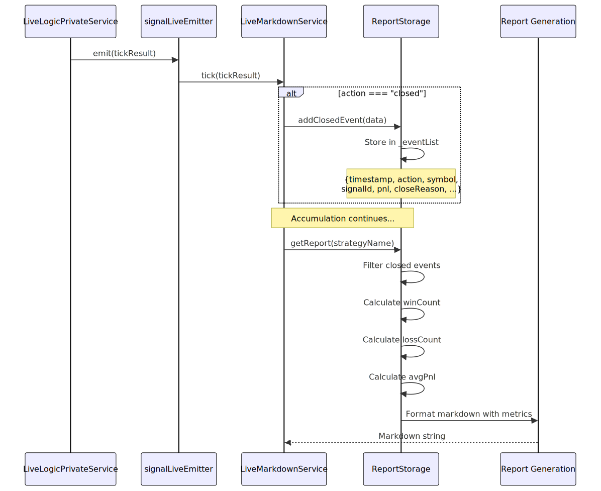

# Performance Metrics

This page documents the performance metrics calculated and reported by the framework, including win rate, average PNL, and signal outcome distributions. These metrics are automatically computed from closed signal data and included in markdown reports generated by `BacktestMarkdownService` and `LiveMarkdownService`.

For details on the markdown report generation process itself, see [Markdown Report Generation](37_Markdown_Report_Generation.md). For information on how PNL values are calculated with fees and slippage, see [PnL Calculation](27_PnL_Calculation.md).

---

## Overview

The framework provides two levels of performance metric calculation depending on execution mode:

| Execution Mode | Service | Metrics Calculated | File Location |
|---|---|---|---|
| **Live Trading** | `LiveMarkdownService` | Total events, closed signals, win rate, average PNL | [src/lib/services/markdown/LiveMarkdownService.ts:1-511]() |
| **Backtesting** | `BacktestMarkdownService` | Total signals only | [src/lib/services/markdown/BacktestMarkdownService.ts:1-349]() |

Live trading reports include comprehensive statistics calculated from all closed signals. Backtest reports provide raw signal data in tabular form, allowing users to perform their own analysis. Both services accumulate signal data per strategy using memoized storage instances.


---

## Live Trading Metrics

The `LiveMarkdownService` calculates four primary performance metrics from closed signals:

### Metrics Summary Table

| Metric | Description | Calculation | Example Output |
|---|---|---|---|
| **Total Events** | Count of all tick events (idle, opened, active, closed) | `_eventList.length` | `Total events: 15` |
| **Closed Signals** | Count of signals that reached a close condition | `filter(e => e.action === "closed").length` | `Closed signals: 5` |
| **Win Rate** | Percentage of profitable trades with win/loss breakdown | `(winCount / totalClosed) * 100` | `Win rate: 60.00% (3W / 2L)` |
| **Average PNL** | Mean PNL percentage across all closed signals | `sum(pnl) / totalClosed` | `Average PNL: +1.23%` |


### Win Rate Calculation




### Average PNL Calculation

The average PNL is computed as the arithmetic mean of all closed signal PNL percentages:

```typescript
// From LiveMarkdownService.ts:280-283
const avgPnl = totalClosed > 0
  ? closedEvents.reduce((sum, e) => sum + (e.pnl || 0), 0) / totalClosed
  : 0;
```

The calculation:
1. Filters all events to get only `closed` actions
2. Sums the `pnl` field (percentage value) from each closed event
3. Divides by the count of closed events
4. Formats with sign prefix: `+1.23%` or `-2.45%`


---

## Metric Calculation Pipeline




---

## TickEvent Data Structure

The `LiveMarkdownService` uses a unified `TickEvent` interface to store all event data:


The transformation from `IStrategyTickResultClosed` to `TickEvent` extracts relevant fields:

```typescript
// From LiveMarkdownService.ts:228-242
const newEvent: TickEvent = {
  timestamp: data.closeTimestamp,
  action: "closed",
  symbol: data.signal.symbol,
  signalId: data.signal.id,
  position: data.signal.position,
  note: data.signal.note,
  currentPrice: data.currentPrice,
  openPrice: data.signal.priceOpen,
  takeProfit: data.signal.priceTakeProfit,
  stopLoss: data.signal.priceStopLoss,
  pnl: data.pnl.pnlPercentage,  // ← Used for metrics
  closeReason: data.closeReason,
  duration: durationMin,
};
```


---

## Backtest Metrics

The `BacktestMarkdownService` provides a simpler reporting model focused on raw signal data:

### Backtest Report Contents

| Component | Description | Implementation |
|---|---|---|
| **Total Signals** | Count of closed signals | `_signalList.length` |
| **Signal Table** | All signal details in tabular format | Markdown table with 13 columns |
| **No Statistics** | Win rate and average PNL not calculated | Users must analyze raw data |

The backtest report includes all data needed for metric calculation (PNL percentages, close reasons, timestamps) but does not compute aggregated statistics. This design allows users to perform custom analysis on historical data.

**Report Generation:**

```typescript
// From BacktestMarkdownService.ts:125-152
public getReport(strategyName: StrategyName): string {
  if (this._signalList.length === 0) {
    return str.newline(
      `# Backtest Report: ${strategyName}`,
      "",
      "No signals closed yet."
    );
  }

  const header = columns.map((col) => col.label);
  const rows = this._signalList.map((closedSignal) =>
    columns.map((col) => col.format(closedSignal))
  );

  const tableData = [header, ...rows];
  const table = str.table(tableData);

  return str.newline(
    `# Backtest Report: ${strategyName}`,
    "",
    `Total signals: ${this._signalList.length}`,  // ← Only metric
    "",
    table,
    "",
    "",
    `*Generated: ${new Date().toISOString()}*`
  );
}
```


---

## Column Configuration

Both services use a `Column` interface to define how to extract and format data from signals:


**Example PNL Column:**

```typescript
// From BacktestMarkdownService.ts:68-75
{
  key: "pnl",
  label: "PNL (net)",
  format: (data) => {
    const pnlPercentage = data.pnl.pnlPercentage;
    return `${pnlPercentage > 0 ? "+" : ""}${pnlPercentage.toFixed(2)}%`;
  },
}
```

The column definitions for backtest [BacktestMarkdownService.ts:27-100]() and live [LiveMarkdownService.ts:62-137]() are similar but differ in data sources (`IStrategyTickResultClosed` vs `TickEvent`).


---

## Storage Architecture

Both markdown services use memoized storage instances per strategy:



The memoization pattern ensures:
- One storage instance per strategy name
- Isolation between strategies
- Efficient memory usage
- Cache clearing with `clear(strategyName)`


---

## Usage Examples

### Accessing Live Trading Metrics

```typescript
import { Live } from "backtest-kit";

// Run live trading
for await (const result of Live.run("BTCUSDT", {
  strategyName: "my-strategy",
  exchangeName: "binance"
})) {
  if (result.action === "closed") {
    // Get report with metrics
    const report = await Live.getReport("my-strategy");
    console.log(report);
    // Output includes:
    // - Win rate: 60.00% (3W / 2L)
    // - Average PNL: +1.23%
  }
}
```


### Saving Reports to Disk

```typescript
import { Backtest, Live } from "backtest-kit";

// Backtest report (no statistics)
await Backtest.dump("my-strategy");
// Saves to: ./logs/backtest/my-strategy.md
// Contains: Total signals + table of all signals

// Live report (with statistics)
await Live.dump("my-strategy");
// Saves to: ./logs/live/my-strategy.md
// Contains: Win rate, avg PNL, total events + table
```


### Clearing Accumulated Data

```typescript
import { Backtest, Live } from "backtest-kit";

// Clear specific strategy
await Backtest.clear("my-strategy");
await Live.clear("my-strategy");

// Clear all strategies
await Backtest.clear();
await Live.clear();
```


---

## Metric Calculation Details

### Win Classification

A signal is classified as a **win** if `pnl > 0` and a **loss** if `pnl < 0`:

```typescript
// From LiveMarkdownService.ts:278-279
const winCount = closedEvents.filter((e) => e.pnl && e.pnl > 0).length;
const lossCount = closedEvents.filter((e) => e.pnl && e.pnl < 0).length;
```

Signals with exactly `pnl === 0` (breakeven after fees/slippage) are not counted as wins or losses in the win rate calculation, but are included in the total closed count.


### PNL Values Source

The PNL percentage values used in metrics come from the `toProfitLossDto` helper, which applies:
- **Slippage:** 0.1% (0.001)
- **Fees:** 0.1% (0.001) on both entry and exit

For details on the exact calculation formula, see [PnL Calculation](27_PnL_Calculation.md).

