# Service Layer

The Service Layer provides the orchestration infrastructure that coordinates business logic execution across the framework. It implements a layered architecture where ~60 services are organized into functional categories, each handling a specific aspect of system operation: connection management, schema registration, validation, context injection, execution logic, and reporting. Services communicate through dependency injection, with the `backtest` aggregation object providing a unified namespace for all service access.

For information about the core business logic classes (`ClientStrategy`, `ClientExchange`, etc.) that services orchestrate, see [Core Business Logic](./46_Signal_Lifecycle.md). For dependency injection implementation details, see [Dependency Injection System](./11_Dependency_Injection_System.md).

## Service Organization

Services follow a matrix organization pattern where most component types (Strategy, Exchange, Frame, Risk, Sizing) have corresponding service variants across multiple functional categories. This creates a predictable structure where finding a service for a specific component and function is straightforward.

The service matrix spans two dimensions:

| Component Type | Connection | Schema | Global | Validation | Markdown |
|---------------|-----------|--------|--------|------------|----------|
| Strategy | StrategyConnectionService | StrategySchemaService | StrategyGlobalService | StrategyValidationService | - |
| Exchange | ExchangeConnectionService | ExchangeSchemaService | ExchangeGlobalService | ExchangeValidationService | - |
| Frame | FrameConnectionService | FrameSchemaService | FrameGlobalService | FrameValidationService | - |
| Risk | RiskConnectionService | RiskSchemaService | RiskGlobalService | RiskValidationService | - |
| Sizing | SizingConnectionService | SizingSchemaService | SizingGlobalService | SizingValidationService | - |
| Walker | - | WalkerSchemaService | - | WalkerValidationService | WalkerMarkdownService |
| Optimizer | OptimizerConnectionService | OptimizerSchemaService | OptimizerGlobalService | OptimizerValidationService | - |
| Partial | PartialConnectionService | - | PartialGlobalService | - | PartialMarkdownService |

Additional service categories exist for execution modes:

- **Command Services**: BacktestCommandService, LiveCommandService, WalkerCommandService
- **Logic Services**: BacktestLogicPrivateService, BacktestLogicPublicService, LiveLogicPrivateService, LiveLogicPublicService, WalkerLogicPrivateService, WalkerLogicPublicService
- **Markdown Services**: BacktestMarkdownService, LiveMarkdownService, ScheduleMarkdownService, PerformanceMarkdownService, HeatMarkdownService
- **Context Services**: ExecutionContextService, MethodContextService
- **Template Services**: OptimizerTemplateService


## Service Categories


### Connection Services

Connection Services manage memoized instances of Client* business logic classes. Each service caches instances by a key derived from execution parameters (e.g., `symbol:strategyName` for strategies). The `getStrategy`, `getExchange`, `getRisk` methods use `memoize` from `functools-kit` to ensure only one instance exists per unique parameter combination.

**Key Methods:**
- **StrategyConnectionService**: `tick()`, `backtest()`, `stop()`, `clear()`, `getPendingSignal()`
- **ExchangeConnectionService**: `getCandles()`, `getNextCandles()`, `getAveragePrice()`, `formatPrice()`, `formatQuantity()`
- **RiskConnectionService**: `getRisk()` returns memoized `ClientRisk` interface
- **SizingConnectionService**: `getSizing()` returns memoized `ClientSizing` interface

These services ensure consistent instance routing - multiple calls with the same parameters return the same cached instance, preserving internal state like signal history and initialization promises.


### Schema Services

Schema Services maintain registries mapping component names to their configuration schemas. Each service exposes `register(name, schema)` to add entries and `get(name)` to retrieve them. The registries are Map-based stores that persist for the application lifetime.

**Example:**
```typescript
// Internal storage
private schemaMap = new Map<StrategyName, IStrategySchema>()

// Registration
strategySchemaService.register("my-strategy", {
  strategyName: "my-strategy",
  interval: "5m",
  getSignal: async (symbol) => { /* ... */ }
})

// Retrieval
const schema = strategySchemaService.get("my-strategy")
```

These services are queried by Connection Services during instance creation to retrieve configuration data.


### Global Services

Global Services wrap Connection Services with context injection via `ExecutionContextService`. They call `ExecutionContextService.runInContext()` to set the `symbol`, `when`, and `backtest` parameters before delegating to Connection Services. This pattern enables implicit parameter passing without requiring these values to be passed through every function call.

**Flow:**
```
StrategyGlobalService.tick(symbol, when, backtest)
  → ExecutionContextService.runInContext({ symbol, when, backtest })
    → StrategyConnectionService.tick(symbol, strategyName)
      → ClientStrategy.tick() [reads context implicitly]
```

Global Services also call Validation Services to verify component registration before operations.


### Validation Services

Validation Services implement two validation layers:

1. **Registration Validation** (`addStrategy`, `addExchange`, etc.): Called by `add.ts` functions to verify schema correctness before registration
2. **Usage Validation** (`validate`): Called by Global Services or Command Services before operations to verify component exists

**StrategyValidationService** implements 30+ signal validation rules checked during strategy execution:
- Price logic (TP must be above entry for long, SL must be below)
- NaN/Infinity checks on all numeric fields
- Price anomaly detection (unrealistic values)
- Timestamp validity
- Position type validation


### Command Services

Command Services provide the top-level entry points for execution modes. They perform validation, inject context, and delegate to Logic Services.

**Responsibilities:**
- Validate all components exist (strategy, exchange, frame)
- Set MethodContextService with component names
- Delegate to LogicPublicService
- Return AsyncGenerator for result streaming


### Logic Services

Logic Services implement execution mode algorithms through a two-tier architecture:

- **Public Services** (`BacktestLogicPublicService`, etc.): External contract that validates parameters and delegates to Private
- **Private Services** (`BacktestLogicPrivateService`, etc.): Internal implementation with core execution logic

This separation enables Private Services to call other Private Services without re-validation while maintaining a clean public API.

**Execution Patterns:**
- **BacktestLogicPrivateService**: Iterates timeframes, calls `tick()`, skips ahead on signal open
- **LiveLogicPrivateService**: Infinite `while(true)` loop with `sleep(TICK_TTL)`, persistence recovery
- **WalkerLogicPrivateService**: Serial strategy iteration with metric comparison

For detailed execution flows, see [Logic Services](./44_Logic_Services.md).


### Markdown Services

Markdown Services accumulate events from execution and generate reports with statistics. They subscribe to event emitters (e.g., `signalBacktestEmitter`) and maintain internal arrays of events (limited to `MAX_EVENTS = 5000`).

**Methods:**
- `getData(symbol, strategyName)`: Returns statistics object (sharpe ratio, win rate, etc.)
- `getReport(symbol, strategyName)`: Returns markdown formatted report string
- `dump(strategyName, path)`: Writes report to disk

**Statistics Calculation:**
- Safe math layer with `isUnsafe()` checks for NaN/Infinity
- Variance/standard deviation computation
- Annualized metrics (Sharpe, returns)
- Win rate, certainty ratio, expected yearly returns

For detailed metrics, see [Performance Metrics](./71_Performance_Metrics.md).


### Template Services

Template Services provide code generation templates for AI optimization. `OptimizerTemplateService` contains 11 template methods that generate different sections of the output script:

- `getTopBanner()`: Imports and constants
- `getJsonDumpTemplate()`: Helper functions
- `getStrategyTemplate()`: Strategy configuration with LLM integration
- `getWalkerTemplate()`: Walker comparison setup
- `getLauncherTemplate()`: Execution code with event listeners

For details on AI optimization, see [AI-Powered Strategy Optimization](./87_AI-Powered_Strategy_Optimization.md).


## Service Registration and Injection



The registration process follows three phases:

**Phase 1: Type Definition** - [src/lib/core/types.ts:1-96]() defines Symbol constants for each service. Symbols prevent naming collisions and enable type-safe lookups.

**Phase 2: Service Registration** - [src/lib/core/provide.ts:1-132]() calls `provide(type, factory)` for each service. Factory functions instantiate services with their dependencies injected via `inject<T>(type)`.

**Phase 3: Aggregation** - [src/lib/index.ts:212-224]() imports all services via `inject()` and aggregates them into the `backtest` object, creating a single-namespace API.


## The Backtest Aggregation Object

The `backtest` object exported from [src/lib/index.ts:212-224]() flattens the service hierarchy into a single namespace. This provides convenient access to any service without needing to understand the dependency graph:

```typescript
// Internal organization
const baseServices = {
  loggerService: inject<LoggerService>(TYPES.loggerService),
}

const connectionServices = {
  strategyConnectionService: inject<StrategyConnectionService>(TYPES.strategyConnectionService),
  exchangeConnectionService: inject<ExchangeConnectionService>(TYPES.exchangeConnectionService),
  // ... 5 more
}

const schemaServices = {
  strategySchemaService: inject<StrategySchemaService>(TYPES.strategySchemaService),
  exchangeSchemaService: inject<ExchangeSchemaService>(TYPES.exchangeSchemaService),
  // ... 5 more
}

// ... 7 more categories

export const backtest = {
  ...baseServices,
  ...contextServices,
  ...connectionServices,
  ...schemaServices,
  ...globalServices,
  ...commandServices,
  ...logicPrivateServices,
  ...logicPublicServices,
  ...markdownServices,
  ...validationServices,
  ...templateServices,
}
```

This enables direct service access:
```typescript
import backtest from "./lib"

// Access any service directly
backtest.loggerService.info("message", data)
backtest.strategySchemaService.get("my-strategy")
backtest.backtestCommandService.run(symbol, context)
```

The Backtest, Live, and Walker utility classes ([src/classes/Backtest.ts](), [src/classes/Live.ts](), [src/classes/Walker.ts]()) use this object internally to access services.


## Service Interaction Patterns

Services follow a strict layering pattern to prevent circular dependencies:


**Layering Rules:**

1. **Base Services** (Layer 1) have no dependencies on other services
2. **Schema Services** (Layer 2) depend only on Base Services
3. **Validation Services** (Layer 3) depend on Base + Schema
4. **Connection Services** (Layer 4) depend on Base + Schema + other Connections (for composition)
5. **Global Services** (Layer 5) depend on Connection + Validation + Context
6. **Command Services** (Layer 6) depend on Global + Validation
7. **Logic Services** (Layer 7) depend on Command + Global
8. **Markdown Services** (Layer 8) depend on event emitters only (passive listeners)

This layering ensures:
- No circular dependencies
- Clear separation of concerns
- Predictable initialization order
- Easy testing (mock lower layers)

**Example Dependency Chain:**
```
User calls Backtest.run()
  → BacktestCommandService.run()
    → BacktestLogicPublicService.run()
      → BacktestLogicPrivateService.run()
        → StrategyGlobalService.tick()
          → StrategyConnectionService.tick()
            → ClientStrategy.tick()
              → ExchangeConnectionService.getCandles()
                → ClientExchange.getCandles()
```

Each layer adds value:
- **Command**: Validation and context setup
- **Logic Public**: External contract
- **Logic Private**: Core algorithm
- **Global**: Context injection
- **Connection**: Instance routing
- **Client**: Business logic


## Service Category Deep Dives

For detailed information about each service category:

- [Service Architecture Overview](./39_Service_Architecture_Overview.md) - Service matrix patterns and organization principles
- [Connection Services](./54_Timeframe_Generation.md) - Memoization, instance routing, dependency injection details
- [Schema Services](./55_Fast-Forward_Simulation.md) - Registration patterns, retrieval, name-based lookup
- [Validation Services](./42_Validation_Services.md) - 30+ validation rules, error handling, registration validation
- [Global Services](./43_Global_Services.md) - Context injection wrappers, ExecutionContext integration
- [Logic Services](./44_Logic_Services.md) - Private vs Public separation, AsyncGenerator streaming, execution orchestration
- [Markdown Services](./45_Markdown_Services.md) - Event accumulation, statistics calculation, report generation