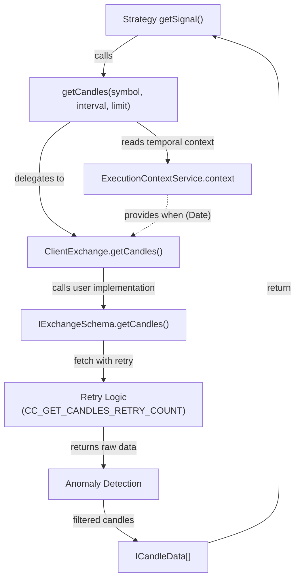
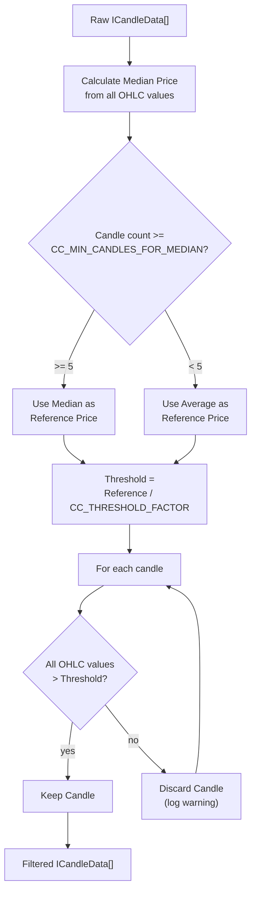
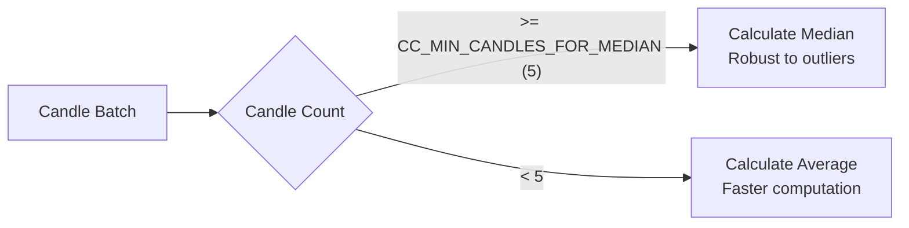
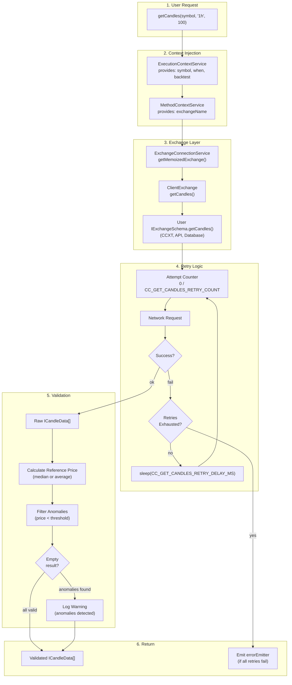

# Candle Data & Validation

## Purpose and Scope

This page documents the candle data structure, retrieval mechanisms, and validation system used throughout Backtest Kit. It covers the `ICandleData` interface, retry logic for network failures, anomaly detection for incomplete candles, and median-based price validation. 

For information about implementing exchange data sources that provide candle data, see [Exchange Configuration](./36_exchanges-data-sources.md). For VWAP pricing calculation that uses validated candles, see [VWAP Pricing & Data Handling](./08_core-concepts.md).

---

## ICandleData Structure

The `ICandleData` interface defines the OHLCV (Open-High-Low-Close-Volume) candle format used throughout the framework. All exchange implementations must return data in this format.

```typescript
interface ICandleData {
    timestamp: number;  // Unix timestamp in milliseconds
    open: number;       // Opening price at candle start
    high: number;       // Highest price during candle period
    low: number;        // Lowest price during candle period
    close: number;      // Closing price at candle end
    volume: number;     // Trading volume during candle period
}
```

### Field Semantics

| Field | Type | Purpose | Usage |
|-------|------|---------|-------|
| `timestamp` | `number` | Unix epoch (ms) when candle opened | Temporal context for ExecutionContextService |
| `open` | `number` | First trade price in period | VWAP calculation, signal validation |
| `high` | `number` | Maximum price in period | TP/SL activation checks, volatility analysis |
| `low` | `number` | Minimum price in period | TP/SL activation checks, support/resistance |
| `close` | `number` | Last trade price in period | VWAP calculation, trend analysis |
| `volume` | `number` | Total volume traded | VWAP weighting, liquidity assessment |

**Sources:** [types.d.ts:87-100]()

---

## Candle Retrieval Flow

### User-Facing API

The `getCandles` function provides the primary interface for retrieving historical candle data. It automatically injects temporal context and applies validation.

**Candle Retrieval with Temporal Context**



**Sources:** [types.d.ts:11-18](), [types.d.ts:159-205]()

---

### Retry Logic

Network failures and API rate limits are handled through automatic retry with exponential backoff.

**Retry Configuration Parameters**

```typescript
// From GLOBAL_CONFIG (params.ts)
CC_GET_CANDLES_RETRY_COUNT: 3         // Max retry attempts
CC_GET_CANDLES_RETRY_DELAY_MS: 5000   // Delay between retries (5s)
```

**Retry Behavior**

1. **Initial Attempt**: Call `IExchangeSchema.getCandles()` 
2. **On Failure**: Wait `CC_GET_CANDLES_RETRY_DELAY_MS` milliseconds
3. **Retry**: Attempt again up to `CC_GET_CANDLES_RETRY_COUNT` times
4. **Success**: Return validated candles
5. **Exhausted**: Throw error, emit to `errorEmitter`

**Example Retry Scenario**

```
Attempt 1: Failed (network timeout)
Wait: 5000ms
Attempt 2: Failed (503 Service Unavailable)
Wait: 5000ms
Attempt 3: Success → return candles
```

**Sources:** [src/config/params.ts:66-74]()

---

## Price Anomaly Detection

### The Problem

Exchange APIs occasionally return incomplete or corrupted candles with anomalous prices (e.g., $0.01 for BTC when median is $50,000). These corrupt price calculations for VWAP, TP/SL validation, and PNL.

**Common Anomaly Patterns**

| Anomaly Type | Example | Cause |
|--------------|---------|-------|
| Near-zero prices | BTC: $0.01 | Incomplete candle from API |
| Extreme outliers | BTC: $1,000,000 | Data corruption |
| Missing data | `null`/`undefined` | API error |

### Detection Algorithm

The framework uses a **factor-based threshold** approach comparing each candle against the median price of the batch.

**Anomaly Detection Algorithm**



**Sources:** [src/config/params.ts:76-104]()

### Threshold Calculation

**Configuration**

```typescript
CC_GET_CANDLES_PRICE_ANOMALY_THRESHOLD_FACTOR: 1000  // Default
CC_GET_CANDLES_MIN_CANDLES_FOR_MEDIAN: 5             // Median vs average switch
```

**Formula**

```
threshold = referencePrice / CC_GET_CANDLES_PRICE_ANOMALY_THRESHOLD_FACTOR

where:
  referencePrice = median(all OHLC values)  if candles.length >= 5
                   average(all OHLC values) otherwise
```

**Example: BTC at $50,000**

```
Candles: 10 candles with prices $49,500 - $50,500
Median: $50,000
Threshold: $50,000 / 1000 = $50

Anomalous candle: { open: 0.01, high: 0.02, low: 0.01, close: 0.01 }
→ All values < $50 → DISCARDED

Normal candle: { open: 49800, high: 50100, low: 49700, close: 50000 }
→ All values > $50 → KEPT
```

### Why Factor 1000?

| Factor | Threshold at $50k | Catches | Misses |
|--------|-------------------|---------|--------|
| 100 | $500 | Incomplete candles | Some bad data |
| **1000** | **$50** | **All anomalies** | **None** |
| 10000 | $5 | Everything | Normal volatility |

The factor of 1000 provides optimal balance:
- **Catches incomplete candles**: $0.01-1 prices are well below $50
- **Preserves flash crashes**: Even -90% crash ($5,000) passes threshold
- **Works across assets**: Scales with price (BTC $50k vs ETH $3k)

**Sources:** [src/config/params.ts:76-89]()

---

## Median vs Average Reference Price

The choice between median and average affects anomaly detection robustness.

### Decision Logic



### Statistical Rationale

**Small Datasets (< 5 candles)**
- Each candle provides 4 price points (OHLC)
- < 5 candles = < 20 data points
- Single outlier heavily skews median
- Average is more stable

**Large Datasets (≥ 5 candles)**
- ≥ 5 candles = ≥ 20 data points
- Median is robust to outliers
- Protects against corrupt data affecting reference price

**Example: 3 Candles with Anomaly**

```
Candles:
  #1: { open: 50000, high: 50100, low: 49900, close: 50000 }
  #2: { open: 50000, high: 50050, low: 49950, close: 50000 }
  #3: { open: 0.01, high: 0.02, low: 0.01, close: 0.01 }  ← anomaly

All prices: [50000, 50100, 49900, 50000, 50000, 50050, 49950, 50000, 0.01, 0.02, 0.01, 0.01]

Average: ~33,333  (dragged down by anomaly!)
Median:  50000    (resistant to anomaly)

With < 5 candles → Use Average (faster, no statistical advantage)
With ≥ 5 candles → Use Median (outlier protection)
```

**Sources:** [src/config/params.ts:91-104]()

---

## Complete Validation Pipeline

### End-to-End Flow

**Candle Data Validation Pipeline**



**Sources:** [types.d.ts:159-205](), [src/config/params.ts:66-104]()

---

## Configuration Reference

### Validation Parameters

All validation behavior is controlled through `GLOBAL_CONFIG` parameters. Use `setConfig()` to customize.

| Parameter | Default | Purpose | Impact |
|-----------|---------|---------|--------|
| `CC_GET_CANDLES_RETRY_COUNT` | `3` | Maximum retry attempts | Higher = more resilient to transient failures |
| `CC_GET_CANDLES_RETRY_DELAY_MS` | `5000` | Delay between retries (ms) | Higher = more respectful of rate limits |
| `CC_GET_CANDLES_PRICE_ANOMALY_THRESHOLD_FACTOR` | `1000` | Anomaly detection sensitivity | Higher = more strict, Lower = more permissive |
| `CC_GET_CANDLES_MIN_CANDLES_FOR_MEDIAN` | `5` | Switch from average to median | Affects reference price calculation method |

**Example: Relaxed Validation for Testing**

```typescript
import { setConfig } from 'backtest-kit';

setConfig({
  CC_GET_CANDLES_RETRY_COUNT: 1,              // Fast failure
  CC_GET_CANDLES_RETRY_DELAY_MS: 100,         // Short delay
  CC_GET_CANDLES_PRICE_ANOMALY_THRESHOLD_FACTOR: 100,  // Permissive
});
```

**Example: Strict Production Settings**

```typescript
setConfig({
  CC_GET_CANDLES_RETRY_COUNT: 5,              // Extra resilient
  CC_GET_CANDLES_RETRY_DELAY_MS: 10000,       // Respectful rate limits
  CC_GET_CANDLES_PRICE_ANOMALY_THRESHOLD_FACTOR: 10000,  // Very strict
});
```

**Sources:** [src/config/params.ts:1-114]()

---

## Integration with Exchange Implementation

### Exchange Schema Contract

Exchange implementations must provide the `getCandles` method that returns `ICandleData[]`. The framework handles validation automatically.

**Minimal Exchange Implementation**

```typescript
import { addExchange, ICandleData } from 'backtest-kit';

addExchange({
  exchangeName: 'my-exchange',
  
  // User implements data fetching - framework handles validation
  getCandles: async (
    symbol: string,
    interval: CandleInterval,
    since: Date,
    limit: number
  ): Promise<ICandleData[]> => {
    // Fetch from API, database, or CCXT
    const rawData = await fetchFromSource(symbol, interval, since, limit);
    
    // Transform to ICandleData format
    return rawData.map(candle => ({
      timestamp: candle.time,
      open: candle.o,
      high: candle.h,
      low: candle.l,
      close: candle.c,
      volume: candle.v,
    }));
    
    // Framework automatically:
    // - Retries on failure (CC_GET_CANDLES_RETRY_COUNT)
    // - Detects anomalies (CC_GET_CANDLES_PRICE_ANOMALY_THRESHOLD_FACTOR)
    // - Filters corrupt data
    // - Logs warnings
  },
  
  formatPrice: async (symbol, price) => price.toFixed(8),
  formatQuantity: async (symbol, qty) => qty.toFixed(8),
});
```

**Sources:** [types.d.ts:119-155]()

---

## Error Handling

### Validation Failures

**Empty Candle Set After Filtering**

When all candles are filtered out due to anomalies:
1. Warning logged via `LoggerService`
2. Empty array returned to caller
3. Strategy receives no data for that interval
4. No signal generated (protection mechanism)

**Retry Exhaustion**

When all retry attempts fail:
1. Error logged via `LoggerService`
2. Error emitted to `errorEmitter`
3. Exception propagated to caller
4. Execution continues (recoverable error)

### Monitoring

Listen to error events to track data quality issues:

```typescript
import { listenError } from 'backtest-kit';

listenError((error) => {
  console.error('[Candle Fetch Error]', error.message);
  // Send to monitoring service (Sentry, Datadog, etc.)
});
```

**Sources:** [src/config/emitters.ts:34-44](), [src/function/event.ts:223-250]()

---

## Summary

The candle data validation system provides automatic protection against corrupt market data through:

1. **Structured Format**: `ICandleData` interface ensures consistent OHLCV data
2. **Retry Logic**: Automatic recovery from network failures (configurable attempts and delays)
3. **Anomaly Detection**: Factor-based threshold filtering (catches incomplete candles)
4. **Robust Statistics**: Median-based reference prices (resistant to outliers)
5. **Configuration**: Tunable parameters via `GLOBAL_CONFIG`

This validation runs transparently for all exchange implementations, ensuring strategies receive clean, reliable market data regardless of the underlying data source.