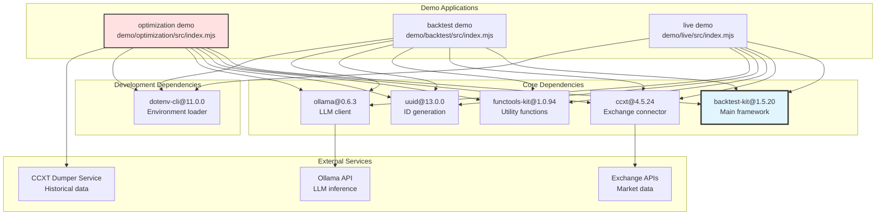
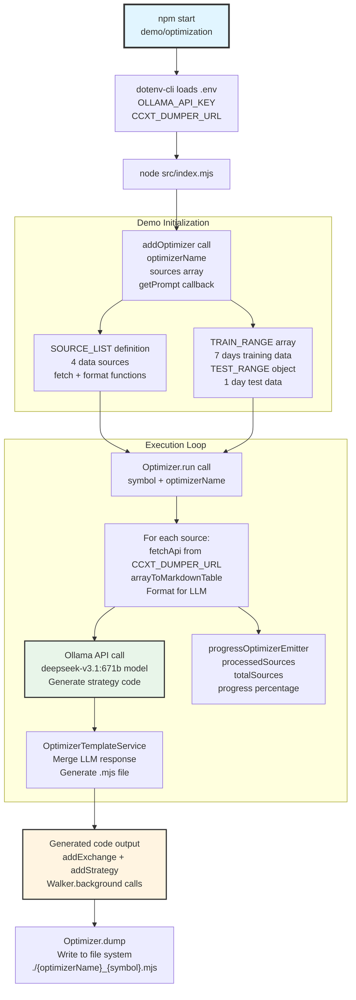
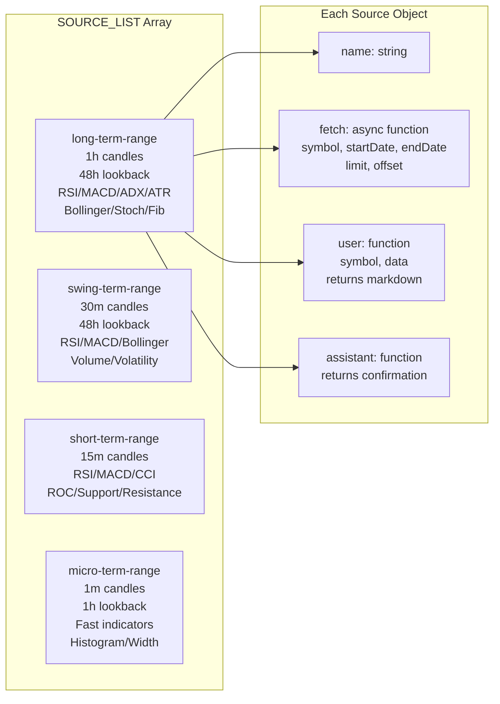

# Running Demos

This page explains how to set up, configure, and execute the demo applications included in the backtest-kit repository. The demos showcase different execution modes and integration patterns. For detailed information about execution mode internals, see [Execution Modes (Detailed)](./16-execution-modes-detailed.md). For LLM-based strategy generation theory, see [Optimizer Mode](./20-optimizer-mode.md).

---

## Demo Projects Overview

The repository includes three demonstration projects, each illustrating a different use case of the framework:

| Demo | Purpose | Mode | Key Features |
|------|---------|------|--------------|
| **optimization** | LLM strategy generation | Optimizer | Ollama integration, multi-timeframe analysis, code export |
| **backtest** | Historical simulation | Backtest | Fast candle processing, statistics generation |
| **live** | Real-time trading | Live | Crash-safe persistence, continuous execution |

### Directory Structure

```
demo/
├── optimization/
│   ├── package.json
│   ├── .env.example
│   ├── .gitignore
│   └── src/
│       └── index.mjs
├── backtest/
│   ├── package.json
│   └── src/
│       └── index.mjs
└── live/
    ├── package.json
    └── src/
        └── index.mjs
```

---

## Demo Dependency Architecture



---

## Installation and Setup

### Step 1: Navigate to Demo Directory

```bash
cd demo/optimization  # or demo/backtest or demo/live
```

### Step 2: Install Dependencies

```bash
npm install
```

This installs the following packages as specified in [demo/optimization/package.json:8-14]():

| Package | Version | Purpose |
|---------|---------|---------|
| `backtest-kit` | 1.5.20 | Core framework |
| `ccxt` | 4.5.24 | Exchange data fetching |
| `functools-kit` | 1.0.94 | Async utilities, Subject pattern |
| `ollama` | 0.6.3 | LLM API client |
| `uuid` | 13.0.0 | Signal ID generation |
| `dotenv-cli` | 11.0.0 | Environment variable loading (dev) |

### Step 3: Configure Environment

Create `.env` file from template:

```bash
cp .env.example .env
```

Edit `.env` with required values:

```bash
OLLAMA_API_KEY=your_api_key_here
CCXT_DUMPER_URL=http://localhost:3000
```

---

## Environment Configuration

### Required Variables

| Variable | Required For | Purpose | Example |
|----------|-------------|---------|---------|
| `OLLAMA_API_KEY` | optimization | Authentication for Ollama LLM API | `sk-...` |
| `CCXT_DUMPER_URL` | optimization | Base URL for historical data service | `http://localhost:3000` |

### CCXT Dumper Service

The optimization demo requires a running CCXT dumper service (referenced at [demo/optimization/src/index.mjs:64-82]()). This service provides historical candle data with pre-calculated technical indicators.

**Expected API endpoints**:
- `/view/long-term-range` - 1-hour candles with 48-hour lookback
- `/view/swing-term-range` - 30-minute candles with 48-hour lookback  
- `/view/short-term-range` - 15-minute candles
- `/view/micro-term-range` - 1-minute candles with 1-hour lookback

**Query parameters**:
- `symbol`: Trading pair (e.g., "BTCUSDT")
- `startDate`: Unix timestamp in milliseconds
- `endDate`: Unix timestamp in milliseconds
- `limit`: Maximum rows (default: 1000)
- `offset`: Pagination offset (default: 0)

**Response format**:
```json
{
  "rows": [
    {
      "timestamp": 1234567890,
      "open": 42000.5,
      "high": 42100.2,
      "low": 41900.0,
      "close": 42050.8,
      "rsi_14": 65.3,
      "macd": 123.4,
      "...": "..."
    }
  ]
}
```

---

## Running Demos

### Optimization Demo Execution Flow



---

## Running Commands

### Optimization Demo

```bash
cd demo/optimization
npm start
```

**Execution**: [demo/optimization/package.json:6]()
- Loads environment from `.env` via `dotenv-cli`
- Executes `node ./src/index.mjs`
- Connects to Ollama API for LLM inference
- Fetches multi-timeframe historical data from CCXT Dumper
- Generates strategy code via LLM
- Exports executable `.mjs` file

**Expected output**:
- Progress updates: `Progress: 25.00%` (one per data source)
- Generated strategy code printed to console
- File written: `./{optimizerName}_{symbol}.mjs`

### Backtest Demo

```bash
cd demo/backtest
npm start
```

**Execution**: [demo/backtest/package.json:6]()
- Loads environment from `.env`
- Executes `node ./src/index.mjs`
- Runs backtest with historical candle iteration
- Generates performance statistics
- Outputs markdown reports

**Expected output**:
- Signal events: `opened`, `closed` with PNL
- Backtest completion event with statistics
- Markdown report in `./dump/` directory

### Live Demo

```bash
cd demo/live
npm start
```

**Execution**: [demo/live/package.json:6]()
- Loads environment from `.env`
- Executes `node ./src/index.mjs`
- Runs infinite loop with 61-second tick interval
- Persists state to JSON files after each tick
- Monitors positions until closed

**Expected output**:
- Live tick events every 61 seconds
- Signal lifecycle events: `opened`, `active`, `closed`
- Persistence confirmations
- Graceful shutdown on Ctrl+C

---

## Optimization Demo Source Structure

### Data Source Configuration

The optimization demo defines four data sources at [demo/optimization/src/index.mjs:66-298](), each with specific parameters:



### Training and Test Ranges

Configuration at [demo/optimization/src/index.mjs:19-61]():

**TRAIN_RANGE**: Array of 7 date ranges
- November 24-30, 2025
- Each range: `{ note, startDate, endDate }`
- Used for historical data fetching

**TEST_RANGE**: Single date range
- December 1, 2025
- Format: `{ note, startDate, endDate }`
- Used for validation

### Helper Functions

**arrayToMarkdownTable** at [demo/optimization/src/index.mjs:6-17]():
- Converts array of objects to markdown table
- Auto-generates header from object keys
- Formats separator and data rows
- Used for LLM data presentation

---

## Package.json Script Configuration

### Script Definition Pattern

All three demos use identical script configuration at [demo/optimization/package.json:5-7]():

```json
{
  "scripts": {
    "start": "dotenv -e .env -- node ./src/index.mjs"
  }
}
```

**Component breakdown**:
- `dotenv`: CLI tool for loading environment variables
- `-e .env`: Specifies environment file path
- `--`: Separator between dotenv options and command
- `node ./src/index.mjs`: Execute demo entry point

### Module Type

All demos specify ES module mode at [demo/optimization/package.json:4]():

```json
{
  "type": "module"
}
```

This enables:
- `import`/`export` syntax instead of `require()`
- Top-level `await` support
- `.mjs` file execution
- Async generator functions

---

## Progress Monitoring

### Optimizer Progress Events

The optimization demo emits progress events via `progressOptimizerEmitter` (see [Optimizer Mode](./20-optimizer-mode.md) for implementation details).

**Listening to progress** at [demo/optimization/src/index.mjs:1]():

```javascript
import { listenOptimizerProgress } from "backtest-kit";

listenOptimizerProgress((event) => {
  console.log(`Processing: ${event.processedSources}/${event.totalSources}`);
  console.log(`Progress: ${(event.progress * 100).toFixed(2)}%`);
});
```

**Event payload structure**:
- `optimizerName`: Name of optimizer being executed
- `symbol`: Trading pair being analyzed
- `totalSources`: Total number of data sources (4 in demo)
- `processedSources`: Number of completed sources (0-4)
- `progress`: Completion ratio from 0.0 to 1.0

### Progress Calculation

For 4 sources:
- Source 1 complete: `processedSources=1, progress=0.25`
- Source 2 complete: `processedSources=2, progress=0.50`
- Source 3 complete: `processedSources=3, progress=0.75`
- Source 4 complete: `processedSources=4, progress=1.00`

---

## Common Issues and Solutions

### Issue: "Cannot find module 'backtest-kit'"

**Cause**: Dependencies not installed

**Solution**:
```bash
cd demo/optimization  # or demo/backtest or demo/live
npm install
```

### Issue: "OLLAMA_API_KEY is not defined"

**Cause**: Environment file not configured

**Solution**:
```bash
cp .env.example .env
# Edit .env with your API key
```

### Issue: "Failed to fetch from CCXT_DUMPER_URL"

**Cause**: CCXT dumper service not running or wrong URL

**Solution**:
1. Start CCXT dumper service: `npm start` in dumper repo
2. Verify URL in `.env` matches service port
3. Test endpoint: `curl http://localhost:3000/view/long-term-range?symbol=BTCUSDT&startDate=...`

### Issue: "Ollama connection refused"

**Cause**: Ollama service not running

**Solution**:
```bash
# Start Ollama service
ollama serve

# Verify model is available
ollama list | grep deepseek
```

---

## Demo Project Comparison

| Feature | Optimization | Backtest | Live |
|---------|-------------|----------|------|
| **Execution** | One-time code generation | Historical simulation | Infinite loop |
| **Primary API** | `addOptimizer`, `Optimizer.run` | `Backtest.run`, `listenSignalBacktest` | `Live.run`, `listenSignalLive` |
| **Duration** | Minutes (LLM inference time) | Seconds to minutes (data size) | Continuous until stopped |
| **Output** | `.mjs` code file | Markdown reports, statistics | JSON persistence files, live events |
| **External Deps** | Ollama API, CCXT Dumper | Exchange data (CCXT) | Exchange data (CCXT) |
| **Data Source** | Pre-aggregated historical | Raw historical candles | Real-time candles |
| **State** | Stateless | Stateless | Stateful (crash-safe) |
| **Use Case** | Strategy discovery | Strategy validation | Production trading |

