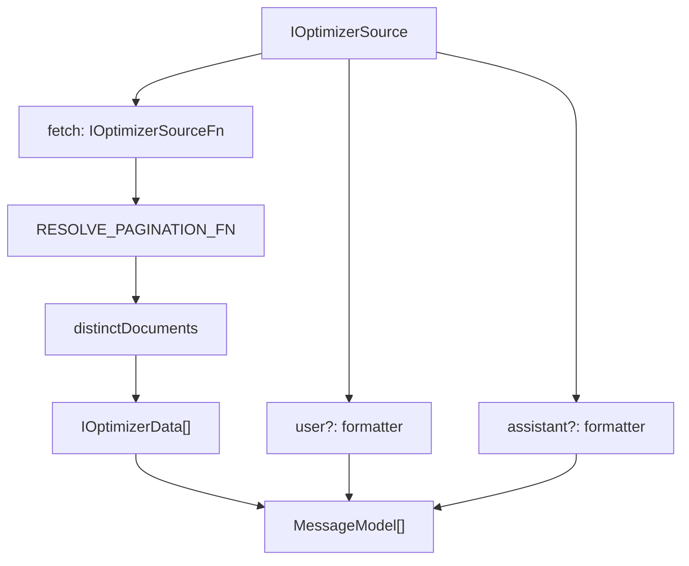
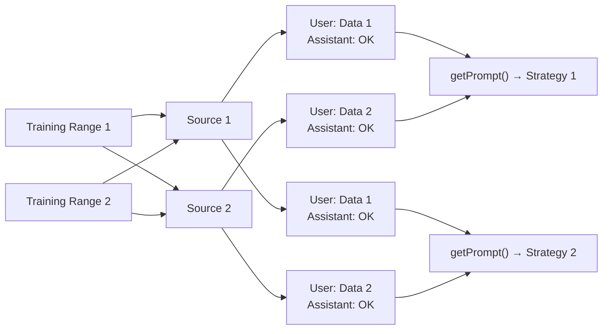
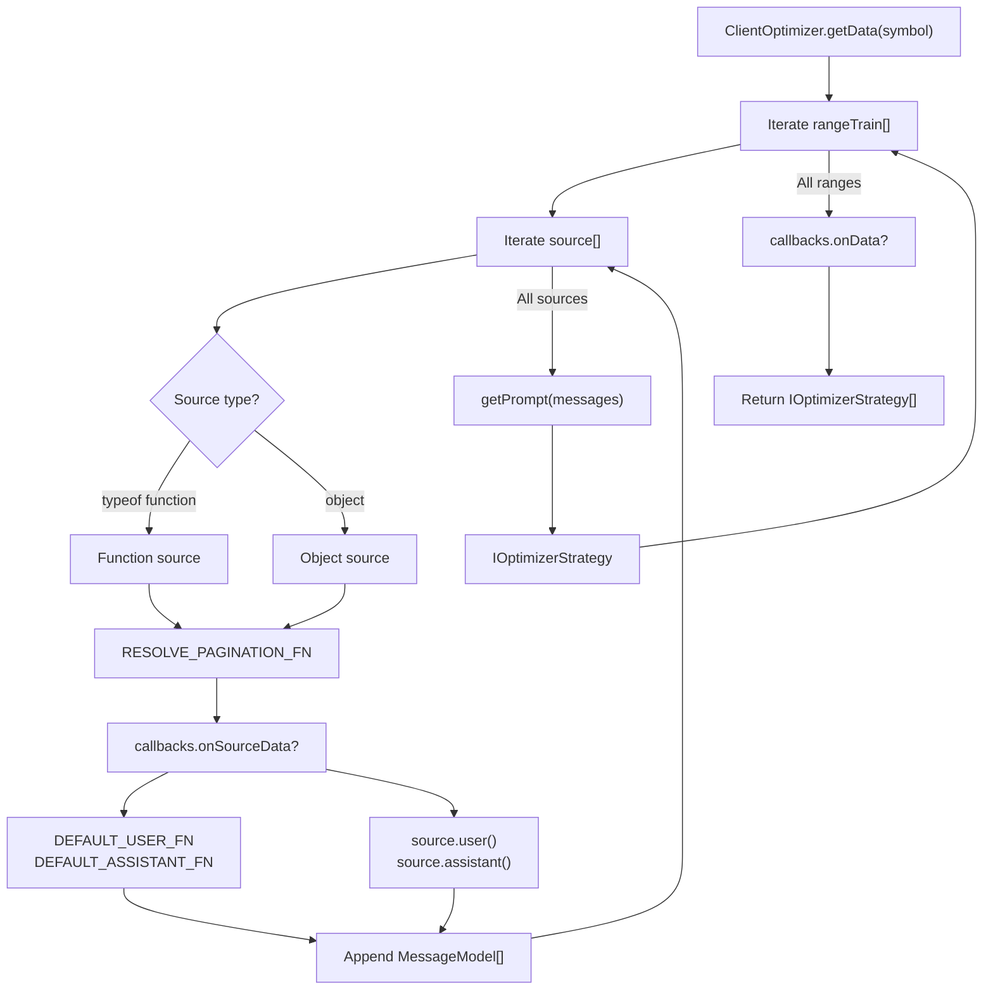
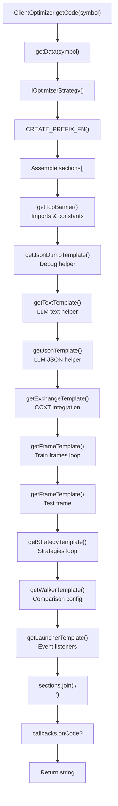
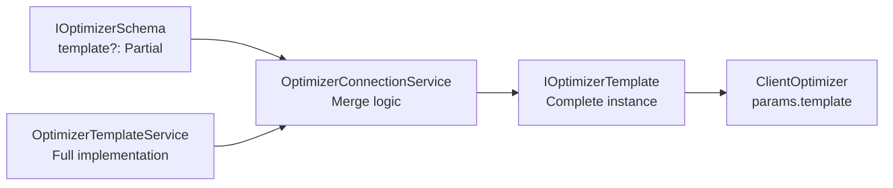
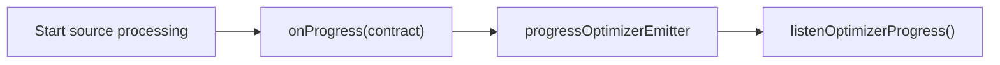
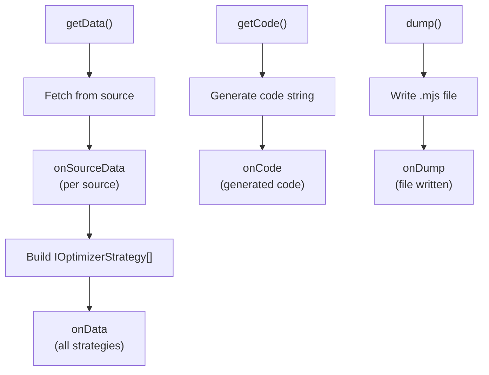
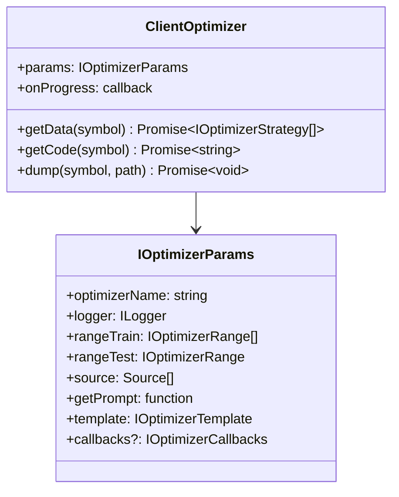

# ClientOptimizer

<details>
<summary>Relevant source files</summary>

The following files were used as context for generating this wiki page:

- [src/classes/Optimizer.ts](src/classes/Optimizer.ts)
- [src/client/ClientOptimizer.ts](src/client/ClientOptimizer.ts)
- [src/interfaces/Optimizer.interface.ts](src/interfaces/Optimizer.interface.ts)
- [src/lib/services/connection/OptimizerConnectionService.ts](src/lib/services/connection/OptimizerConnectionService.ts)
- [src/lib/services/global/OptimizerGlobalService.ts](src/lib/services/global/OptimizerGlobalService.ts)
- [src/lib/services/schema/OptimizerSchemaService.ts](src/lib/services/schema/OptimizerSchemaService.ts)
- [src/lib/services/template/OptimizerTemplateService.ts](src/lib/services/template/OptimizerTemplateService.ts)
- [src/lib/services/validation/OptimizerValidationService.ts](src/lib/services/validation/OptimizerValidationService.ts)
- [src/model/Message.model.ts](src/model/Message.model.ts)

</details>


## Purpose and Scope

`ClientOptimizer` is the core implementation class for AI-driven strategy generation within the backtest-kit framework. It orchestrates data collection from multiple sources, builds conversation history for Large Language Models (LLMs), and generates executable trading strategy code. This class implements the `IOptimizer` interface and operates without dependency injection, making it a pure business logic component.

For information about the optimizer schema configuration and registration, see [5.7 - Optimizer Schemas](#5.7). For the public API used to invoke optimizer operations, see [16.5 - AI-Powered Strategy Optimization](#16.5). For the template system used to generate code, see [16.5.4 - Strategy Code Generation](#16.5.4).

**Sources:** [src/client/ClientOptimizer.ts:1-447](), [src/interfaces/Optimizer.interface.ts:454-484]()

---

## Core Concepts

### Data Sources and Pagination

Data sources provide the training data that feeds into the LLM conversation. Each source must implement the `IOptimizerSourceFn` interface, which supports pagination through `limit` and `offset` parameters. Sources can be either simple functions or full configuration objects with custom message formatters.



**Data Flow:**
1. `fetch()` retrieves paginated data with `limit=25` (ITERATION_LIMIT)
2. `iterateDocuments()` handles automatic pagination
3. `distinctDocuments()` deduplicates by `data.id`
4. Custom or default formatters convert data to messages

**Sources:** [src/client/ClientOptimizer.ts:70-88](), [src/interfaces/Optimizer.interface.ts:86-177]()

### Training Ranges

Training ranges (`IOptimizerRange[]`) define time periods for data collection. Each range generates a separate strategy variant, allowing the LLM to learn from different market conditions. The optimizer iterates through all ranges sequentially, building a complete conversation history for each.

| Field | Type | Description |
|-------|------|-------------|
| `startDate` | `Date` | Start of training period (inclusive) |
| `endDate` | `Date` | End of training period (inclusive) |
| `note` | `string?` | Optional description (e.g., "Bull market Q1") |

Each training range produces one strategy variant. All variants are compared using the Walker mode on the test range.

**Sources:** [src/interfaces/Optimizer.interface.ts:16-32](), [src/client/ClientOptimizer.ts:104-198]()

### Message History

Message history follows the standard LLM conversation format with three roles: `system`, `user`, and `assistant`. For each data source within each training range, the optimizer appends a user-assistant message pair. This builds context progressively across all sources.



**Sources:** [src/client/ClientOptimizer.ts:99-215](), [src/model/Message.model.ts:1-26]()

---

## Data Collection Pipeline

The `getData()` method orchestrates the entire data collection pipeline, building strategy metadata with full conversation context.



**Sources:** [src/client/ClientOptimizer.ts:99-215](), [src/client/ClientOptimizer.ts:410-415]()

### Source Processing

Sources are processed sequentially to maintain conversation order. The type of source determines which formatters are used:

**Function Source:**
- Uses `DEFAULT_USER_FN` → delegates to `template.getUserMessage()`
- Uses `DEFAULT_ASSISTANT_FN` → delegates to `template.getAssistantMessage()`
- Source name defaults to `"unknown"`

**Object Source:**
- Uses `source.user()` if provided, otherwise defaults
- Uses `source.assistant()` if provided, otherwise defaults
- Uses `source.name` for identification

**Sources:** [src/client/ClientOptimizer.ts:115-187](), [src/client/ClientOptimizer.ts:34-60]()

### Pagination and Deduplication

The `RESOLVE_PAGINATION_FN` helper handles pagination automatically using `functools-kit` utilities:

| Step | Function | Purpose |
|------|----------|---------|
| 1 | `iterateDocuments()` | Creates async iterator with automatic pagination |
| 2 | `distinctDocuments()` | Deduplicates by `data.id` field |
| 3 | `resolveDocuments()` | Resolves iterator to array |

**Pagination Parameters:**
- `limit`: 25 (ITERATION_LIMIT constant)
- `offset`: Automatically incremented (page * limit)

**Sources:** [src/client/ClientOptimizer.ts:70-88](), [src/client/ClientOptimizer.ts:19]()

### Message Formatting

Message formatting converts raw data into LLM-readable text. The default formatters call template methods, but can be overridden per-source:

```typescript
// Default behavior (delegates to template)
DEFAULT_USER_FN → template.getUserMessage(symbol, data, name)
DEFAULT_ASSISTANT_FN → template.getAssistantMessage(symbol, data, name)

// Custom behavior (per-source)
source.user(symbol, data, name) → custom formatted string
source.assistant(symbol, data, name) → custom formatted string
```

**Sources:** [src/client/ClientOptimizer.ts:34-60](), [src/lib/services/template/OptimizerTemplateService.ts:77-110]()

---

## Code Generation

The `getCode()` method generates complete executable strategy files by assembling multiple template sections.



**Sources:** [src/client/ClientOptimizer.ts:225-350](), [src/client/ClientOptimizer.ts:424-429]()

### Code Assembly Process

The code generation follows a strict nine-section structure:

| Order | Template Method | Purpose | Count |
|-------|----------------|---------|-------|
| 1 | `getTopBanner()` | Shebang, imports, constants | 1 |
| 2 | `getJsonDumpTemplate()` | Debug output helper | 1 |
| 3 | `getTextTemplate()` | LLM text generation | 1 |
| 4 | `getJsonTemplate()` | LLM structured output | 1 |
| 5 | `getExchangeTemplate()` | CCXT Binance integration | 1 |
| 6 | `getFrameTemplate()` | Training frames | N (rangeTrain.length) |
| 7 | `getFrameTemplate()` | Test frame | 1 |
| 8 | `getStrategyTemplate()` | Strategy implementations | N (strategy count) |
| 9 | `getWalkerTemplate()` | Walker comparison | 1 |
| 10 | `getLauncherTemplate()` | Walker.background() + listeners | 1 |

**Naming Conventions:**
- Prefix: Random string via `CREATE_PREFIX_FN()` → e.g., `"xyz123"`
- Exchange: `{prefix}_exchange` → e.g., `"xyz123_exchange"`
- Train frames: `{prefix}_train_frame-{i}` → e.g., `"xyz123_train_frame-1"`
- Test frame: `{prefix}_test_frame` → e.g., `"xyz123_test_frame"`
- Strategies: `{prefix}_strategy-{i}` → e.g., `"xyz123_strategy-1"`
- Walker: `{prefix}_walker` → e.g., `"xyz123_walker"`

**Sources:** [src/client/ClientOptimizer.ts:225-350](), [src/client/ClientOptimizer.ts:22]()

### Template Integration

Templates are provided via `IOptimizerParams.template`, which merges custom overrides with defaults from `OptimizerTemplateService`. Each template method returns a string of executable code:



**Template Method Signatures:**
```typescript
interface IOptimizerTemplate {
  getTopBanner(symbol: string): Promise<string>;
  getExchangeTemplate(symbol: string, exchangeName: string): Promise<string>;
  getFrameTemplate(symbol: string, frameName: string, interval: CandleInterval, 
                   startDate: Date, endDate: Date): Promise<string>;
  getStrategyTemplate(strategyName: string, interval: string, 
                     prompt: string): Promise<string>;
  getWalkerTemplate(walkerName: string, exchangeName: string, 
                   frameName: string, strategies: string[]): Promise<string>;
  getLauncherTemplate(symbol: string, walkerName: string): Promise<string>;
  getTextTemplate(symbol: string): Promise<string>;
  getJsonTemplate(symbol: string): Promise<string>;
  getJsonDumpTemplate(symbol: string): Promise<string>;
  getUserMessage(symbol: string, data: any[], name: string): Promise<string>;
  getAssistantMessage(symbol: string, data: any[], name: string): Promise<string>;
}
```

**Sources:** [src/interfaces/Optimizer.interface.ts:242-374](), [src/lib/services/connection/OptimizerConnectionService.ts:59-113]()

### Generated Code Structure

The generated `.mjs` file follows this structure:

```
#!/usr/bin/env node

// 1. Imports: Ollama, ccxt, backtest-kit, fs, uuid
import { Ollama } from "ollama";
import ccxt from "ccxt";
import { addExchange, addStrategy, addFrame, addWalker, Walker, ... } from "backtest-kit";

const WARN_KB = 100;

// 2. Helper: dumpJson() - Debug output to ./dump/strategy/{id}/
async function dumpJson(resultId, history, result, outputDir) { ... }

// 3. Helper: text() - LLM text generation via Ollama
async function text(messages) { ... }

// 4. Helper: json() - LLM JSON generation with schema
async function json(messages) { ... }

// 5. Exchange: CCXT Binance integration
addExchange({ exchangeName: "xyz123_exchange", getCandles, formatPrice, formatQuantity });

// 6-7. Frames: Training and testing periods
addFrame({ frameName: "xyz123_train_frame-1", interval: "1m", startDate, endDate });
addFrame({ frameName: "xyz123_train_frame-2", interval: "1m", startDate, endDate });
addFrame({ frameName: "xyz123_test_frame", interval: "1m", startDate, endDate });

// 8. Strategies: Multi-timeframe analysis with LLM
addStrategy({
  strategyName: "xyz123_strategy-1",
  interval: "5m",
  getSignal: async (symbol) => {
    // Fetch 1h, 15m, 5m, 1m candles
    // Build messages with progressive context
    // Call json(messages) for signal
    return result;
  }
});

// 9. Walker: Strategy comparison
addWalker({
  walkerName: "xyz123_walker",
  exchangeName: "xyz123_exchange",
  frameName: "xyz123_test_frame",
  strategies: ["xyz123_strategy-1", "xyz123_strategy-2", ...]
});

// 10. Launcher: Execute and listen
Walker.background("BTCUSDT", { walkerName: "xyz123_walker" });
listenSignalBacktest(...);
listenWalkerProgress(...);
listenWalkerComplete(...);
listenError(...);
```

**Sources:** [src/lib/services/template/OptimizerTemplateService.ts:36-712]()

---

## Progress Tracking

`ClientOptimizer` emits progress events during data collection via the `onProgress` callback provided in the constructor. Progress tracks source processing, not code generation.



**Progress Contract Structure:**

| Field | Type | Description |
|-------|------|-------------|
| `optimizerName` | `string` | Unique optimizer identifier |
| `symbol` | `string` | Trading pair being processed |
| `totalSources` | `number` | Total number of sources to process |
| `processedSources` | `number` | Number of sources completed |
| `progress` | `number` | Decimal 0.0-1.0 (percentage / 100) |

**Calculation:**
```
totalSources = rangeTrain.length × source.length
progress = totalSources > 0 ? processedSources / totalSources : 0
```

**Emission Points:**
1. At the start of each source processing (before fetch)
2. After all sources complete (progress = 1.0)

**Sources:** [src/client/ClientOptimizer.ts:101-114](), [src/client/ClientOptimizer.ts:201-208](), [src/contract/ProgressOptimizer.contract.ts]()

---

## Lifecycle Callbacks

`IOptimizerCallbacks` provides hooks for monitoring and validating optimizer operations. All callbacks are optional and async-compatible.



**Callback Signatures:**

| Callback | Parameters | When Called |
|----------|-----------|-------------|
| `onSourceData` | `symbol, sourceName, data, startDate, endDate` | After each source fetch |
| `onData` | `symbol, strategyData` | After all ranges processed |
| `onCode` | `symbol, code` | After code generation |
| `onDump` | `symbol, filepath` | After file write |

**Example Usage:**
```typescript
addOptimizer({
  optimizerName: "my-optimizer",
  callbacks: {
    onSourceData: (symbol, name, data, start, end) => {
      console.log(`Fetched ${data.length} rows from ${name}`);
    },
    onData: (symbol, strategies) => {
      console.log(`Generated ${strategies.length} strategy variants`);
    },
    onCode: (symbol, code) => {
      console.log(`Generated ${code.length} bytes of code`);
    },
    onDump: (symbol, filepath) => {
      console.log(`Saved to ${filepath}`);
    }
  }
});
```

**Sources:** [src/interfaces/Optimizer.interface.ts:191-236](), [src/client/ClientOptimizer.ts:122-129](), [src/client/ClientOptimizer.ts:210-212](), [src/client/ClientOptimizer.ts:345-347](), [src/client/ClientOptimizer.ts:377-379]()

---

## Internal Implementation

### Constructor and Dependencies



**Constructor:**
```typescript
constructor(
  readonly params: IOptimizerParams,
  readonly onProgress: (progress: ProgressOptimizerContract) => void
)
```

**Dependency Injection:**
- `params.logger`: For debug and info logging
- `params.template`: For code generation (merged defaults + custom)
- `params.callbacks`: For lifecycle hooks (optional)
- `onProgress`: Injected by `OptimizerConnectionService` → emits to `progressOptimizerEmitter`

**Sources:** [src/client/ClientOptimizer.ts:397-401](), [src/interfaces/Optimizer.interface.ts:436-451]()

### Main Methods

The three public methods delegate to internal helper functions for testability and code organization:

| Method | Delegates To | Return Type |
|--------|--------------|-------------|
| `getData(symbol)` | `GET_STRATEGY_DATA_FN(symbol, this)` | `Promise<IOptimizerStrategy[]>` |
| `getCode(symbol)` | `GET_STRATEGY_CODE_FN(symbol, this)` | `Promise<string>` |
| `dump(symbol, path?)` | `GET_STRATEGY_DUMP_FN(symbol, path, this)` | `Promise<void>` |

**Internal Function Signatures:**
```typescript
const GET_STRATEGY_DATA_FN = async (
  symbol: string,
  self: ClientOptimizer
): Promise<IOptimizerStrategy[]> => { ... }

const GET_STRATEGY_CODE_FN = async (
  symbol: string,
  self: ClientOptimizer
): Promise<string> => { ... }

const GET_STRATEGY_DUMP_FN = async (
  symbol: string,
  path: string,
  self: ClientOptimizer
): Promise<void> => { ... }
```

**Sources:** [src/client/ClientOptimizer.ts:403-444]()

### Helper Functions

Four module-level helper functions support the main operations:

**1. RESOLVE_PAGINATION_FN**
- Purpose: Fetch all pages from a source with deduplication
- Uses: `iterateDocuments()`, `distinctDocuments()`, `resolveDocuments()` from `functools-kit`
- Returns: `Promise<Data[]>`

**2. DEFAULT_USER_FN**
- Purpose: Default user message formatter
- Delegates to: `template.getUserMessage()`
- Returns: `Promise<string>`

**3. DEFAULT_ASSISTANT_FN**
- Purpose: Default assistant message formatter
- Delegates to: `template.getAssistantMessage()`
- Returns: `Promise<string>`

**4. CREATE_PREFIX_FN**
- Purpose: Generate random prefix for code entity names
- Algorithm: `(Math.random() + 1).toString(36).substring(7)`
- Returns: `string` (e.g., `"xyz123"`)

**Constants:**
- `ITERATION_LIMIT = 25`: Pagination page size
- `DEFAULT_SOURCE_NAME = "unknown"`: Fallback source name

**Sources:** [src/client/ClientOptimizer.ts:19-88]()

---

## Usage Patterns

### Basic Strategy Generation

```typescript
import { addOptimizer, Optimizer } from "backtest-kit";

// 1. Register optimizer
addOptimizer({
  optimizerName: "momentum-strategy",
  rangeTrain: [
    { startDate: new Date("2024-01-01"), endDate: new Date("2024-03-31") },
    { startDate: new Date("2024-04-01"), endDate: new Date("2024-06-30") }
  ],
  rangeTest: {
    startDate: new Date("2024-07-01"),
    endDate: new Date("2024-09-30")
  },
  source: [
    async ({ symbol, startDate, endDate, limit, offset }) => {
      // Fetch historical candles
      return await getCandles(symbol, "1h", startDate, limit);
    }
  ],
  getPrompt: async (symbol, messages) => {
    return "Generate momentum-based trading signals...";
  }
});

// 2. Generate strategy code
const code = await Optimizer.getCode("BTCUSDT", {
  optimizerName: "momentum-strategy"
});

// 3. Save to file
await Optimizer.dump("BTCUSDT", {
  optimizerName: "momentum-strategy"
}, "./strategies");

// Output: ./strategies/momentum-strategy_BTCUSDT.mjs
```

**Sources:** [src/classes/Optimizer.ts:1-135]()

### Multi-Source with Custom Formatters

```typescript
addOptimizer({
  optimizerName: "multi-source",
  rangeTrain: [{ startDate, endDate }],
  rangeTest: { startDate, endDate },
  source: [
    // Source 1: Candles with custom formatting
    {
      name: "price-data",
      fetch: async (args) => fetchCandles(args),
      user: async (symbol, data, name) => {
        return `Analyze these ${data.length} candles:\n${JSON.stringify(data)}`;
      },
      assistant: async () => "Price data analyzed"
    },
    // Source 2: Indicators with default formatting
    {
      name: "indicators",
      fetch: async (args) => fetchIndicators(args)
      // Uses template.getUserMessage() and template.getAssistantMessage()
    },
    // Source 3: Function-only (uses defaults)
    async (args) => fetchSentiment(args)
  ],
  getPrompt: async (symbol, messages) => {
    // messages contains 6 entries (3 sources × 2 messages)
    return generatePromptFromMessages(messages);
  }
});
```

**Sources:** [src/interfaces/Optimizer.interface.ts:129-177]()

### Progress Monitoring

```typescript
import { listenOptimizerProgress } from "backtest-kit";

listenOptimizerProgress((event) => {
  console.log(`[${event.optimizerName}] ${event.symbol}`);
  console.log(`Progress: ${(event.progress * 100).toFixed(1)}%`);
  console.log(`Processed: ${event.processedSources}/${event.totalSources} sources`);
});

await Optimizer.getData("BTCUSDT", { optimizerName: "my-optimizer" });
// Emits progress events at:
// - Start of each source (processedSources increments)
// - End of all sources (progress = 1.0)
```

**Sources:** [src/client/ClientOptimizer.ts:108-114](), [src/client/ClientOptimizer.ts:201-208]()

### Template Customization

```typescript
addOptimizer({
  optimizerName: "custom-template",
  template: {
    // Override specific template methods
    getStrategyTemplate: async (strategyName, interval, prompt) => {
      return `
addStrategy({
  strategyName: "${strategyName}",
  interval: "${interval}",
  getSignal: async (symbol) => {
    // Custom implementation
    ${prompt}
    return customAnalysis();
  }
});
      `.trim();
    },
    // Other methods use defaults from OptimizerTemplateService
  },
  // ... other config
});
```

**Sources:** [src/lib/services/connection/OptimizerConnectionService.ts:59-113]()

### Lifecycle Callbacks

```typescript
addOptimizer({
  optimizerName: "monitored",
  callbacks: {
    onSourceData: async (symbol, sourceName, data, start, end) => {
      // Log data collection
      await logToDatabase({
        symbol,
        source: sourceName,
        rows: data.length,
        timeRange: { start, end }
      });
    },
    onData: async (symbol, strategyData) => {
      // Validate generated strategies
      if (strategyData.length === 0) {
        throw new Error("No strategies generated");
      }
    },
    onCode: async (symbol, code) => {
      // Analyze generated code
      const size = Buffer.byteLength(code, "utf-8");
      console.log(`Generated ${size} bytes for ${symbol}`);
    },
    onDump: async (symbol, filepath) => {
      // Post-process file
      await runLinter(filepath);
    }
  },
  // ... other config
});
```

**Sources:** [src/client/ClientOptimizer.ts:122-129](), [src/client/ClientOptimizer.ts:210-212](), [src/client/ClientOptimizer.ts:345-347](), [src/client/ClientOptimizer.ts:377-379]()