# Service Architecture Overview

## Purpose and Scope

This document explains the service layer architecture in backtest-kit, which sits between the Public API and Client classes. The service layer implements a matrix-based organization pattern where services are categorized by both functional role (Connection, Schema, Validation, Global, Logic, Markdown, Template, Command) and component type (Strategy, Exchange, Frame, Risk, Sizing, Walker, Optimizer, Partial). This page covers the service matrix structure and dependency injection system. For implementation details of specific service categories, see pages 7.2-7.7.

## Service Layer Pattern

The service layer implements a dependency injection architecture using Symbol-based tokens from `di-scoped` package. All services are singleton instances registered in [src/lib/core/provide.ts:52-131]() using the `provide()` function and injected in [src/lib/index.ts:57-210]() using the `inject<T>()` function. The DI container is initialized via `init()` call at [src/lib/index.ts:226]().

The service layer isolates business logic (Client classes) from framework concerns (validation, context propagation, persistence, reporting). Client classes (`ClientStrategy`, `ClientExchange`, `ClientFrame`, `ClientRisk`, `ClientSizing`, `ClientOptimizer`) have no DI dependencies and receive all parameters explicitly through constructor injection, while services handle cross-cutting concerns through the DI container.

## Service Category Matrix

The framework organizes services into 11 functional categories, with most categories having component-specific implementations following a matrix pattern:

**Service Categories by Function:**

## Service Organization in Code

Services are organized into 11 groups in the codebase, with each group containing related service instances:

| Category | Service Count | Symbol Names (types.ts) | File Location |
|----------|---------------|-------------------------|---------------|
| Base Services | 1 | `loggerService` | [src/lib/services/base/]() |
| Context Services | 2 | `executionContextService`, `methodContextService` | [src/lib/services/context/]() |
| Connection Services | 7 | `exchangeConnectionService`, `strategyConnectionService`, `frameConnectionService`, `sizingConnectionService`, `riskConnectionService`, `optimizerConnectionService`, `partialConnectionService` | [src/lib/services/connection/]() |
| Schema Services | 7 | `exchangeSchemaService`, `strategySchemaService`, `frameSchemaService`, `walkerSchemaService`, `sizingSchemaService`, `riskSchemaService`, `optimizerSchemaService` | [src/lib/services/schema/]() |
| Global Services | 7 | `exchangeGlobalService`, `strategyGlobalService`, `frameGlobalService`, `sizingGlobalService`, `riskGlobalService`, `optimizerGlobalService`, `partialGlobalService` | [src/lib/services/global/]() |
| Command Services | 3 | `liveCommandService`, `backtestCommandService`, `walkerCommandService` | [src/lib/services/command/]() |
| Logic Private Services | 3 | `backtestLogicPrivateService`, `liveLogicPrivateService`, `walkerLogicPrivateService` | [src/lib/services/logic/private/]() |
| Logic Public Services | 3 | `backtestLogicPublicService`, `liveLogicPublicService`, `walkerLogicPublicService` | [src/lib/services/logic/public/]() |
| Markdown Services | 7 | `backtestMarkdownService`, `liveMarkdownService`, `scheduleMarkdownService`, `performanceMarkdownService`, `walkerMarkdownService`, `heatMarkdownService`, `partialMarkdownService` | [src/lib/services/markdown/]() |
| Validation Services | 7 | `exchangeValidationService`, `strategyValidationService`, `frameValidationService`, `walkerValidationService`, `sizingValidationService`, `riskValidationService`, `optimizerValidationService` | [src/lib/services/validation/]() |
| Template Services | 1 | `optimizerTemplateService` | [src/lib/services/template/]() |

**Total Service Count:** 48 services

The dependency injection container is initialized through three core files:

1. **[src/lib/core/types.ts:1-97]()**: Defines Symbol-based tokens for all 48 services organized into category groups at lines 1-3 (base), 5-8 (context), 10-18 (connection), 20-28 (schema), 30-38 (global), 40-44 (command), 46-50 (logicPrivate), 52-56 (logicPublic), 58-66 (markdown), 68-76 (validation), 78-80 (template)
2. **[src/lib/core/provide.ts:52-131]()**: Binds service implementations to tokens using `provide()` function with factory callbacks
3. **[src/lib/index.ts:57-224]()**: Injects services using `inject<T>()` and aggregates them into the unified `backtest` export object at lines 212-224

## Dependency Injection System

Services use Symbol-based dependency injection for type-safe resolution. Each service type has a unique Symbol identifier defined in [src/lib/core/types.ts](), which is used as a token key for the DI container.

**DI Container Initialization Flow:**

The DI container resolves the dependency graph at initialization time via `init()` called in [src/lib/index.ts:226](). Services receive dependencies through constructor injection, with the `di-scoped` package handling singleton lifecycle and lazy initialization.

## Service Category Responsibilities

Each service category has a specific role in the framework's execution flow:

### Base Services (1 service)

`LoggerService` provides logging infrastructure with `info()`, `warn()`, and `error()` methods. All services inject `LoggerService` via DI and use method name constants for log identification.

**File Location:** [src/lib/services/base/LoggerService.ts]()

### Context Services (2 services)

`ExecutionContextService` and `MethodContextService` provide scoped context propagation using the `di-scoped` package. `ExecutionContextService` stores execution-level context (`symbol`, `when`, `backtest` flag), while `MethodContextService` stores method-level context (`strategyName`, `exchangeName`, `frameName`, `riskName`, `sizingName`, `optimizerName`).

**File Location:** [src/lib/services/context/]()

### Schema Services (7 services)

Store component configurations using the `ToolRegistry` pattern from `functools-kit`. Schema services provide a typed registry for strategies, exchanges, frames, walkers, sizing, risk profiles, and optimizers. They expose `register()`, `get()`, and `override()` methods for component management.

**Implementations:** `StrategySchemaService`, `ExchangeSchemaService`, `FrameSchemaService`, `WalkerSchemaService`, `SizingSchemaService`, `RiskSchemaService`, `OptimizerSchemaService`

**File Location:** [src/lib/services/schema/]()

### Validation Services (7 services)

Perform runtime existence checks and cross-component validation. Validation services verify that referenced components exist before execution begins and use memoization to cache validation results. They expose validation methods named after the `add*` pattern (e.g., `addStrategy()`, `addExchange()`).

**Implementations:** `StrategyValidationService`, `ExchangeValidationService`, `FrameValidationService`, `WalkerValidationService`, `SizingValidationService`, `RiskValidationService`, `OptimizerValidationService`

**File Location:** [src/lib/services/validation/]()

### Connection Services (7 services)

Create and memoize Client class instances. Connection services act as factories for `ClientStrategy`, `ClientExchange`, `ClientFrame`, `ClientRisk`, `ClientSizing`, `ClientOptimizer`, and `ClientPartial`. They use `functools-kit`'s `memoize()` to ensure one instance per component name, with memoization keys based on component identifier (e.g., `strategyName`, `exchangeName`).

**Implementations:** `StrategyConnectionService`, `ExchangeConnectionService`, `FrameConnectionService`, `SizingConnectionService`, `RiskConnectionService`, `OptimizerConnectionService`, `PartialConnectionService`

**File Location:** [src/lib/services/connection/]()

### Global Services (7 services)

Provide public API entry points with validation and context setup. Global services wrap lower-level Connection services and ensure all prerequisites are met before component instantiation. They orchestrate validation, context injection, and delegation to Connection services for Client class instantiation.

**Implementations:** `StrategyGlobalService`, `ExchangeGlobalService`, `FrameGlobalService`, `SizingGlobalService`, `RiskGlobalService`, `OptimizerGlobalService`, `PartialGlobalService`

**File Location:** [src/lib/services/global/]()

### Command Services (3 services)

Provide execution mode entry points with validation orchestration. Command services validate all required components exist (strategy, exchange, frame) before delegating to Logic Public services. They expose `run()` methods that return async generators.

**Implementations:** `BacktestCommandService`, `LiveCommandService`, `WalkerCommandService`

**File Location:** [src/lib/services/command/]()

### Logic Public Services (3 services)

Wrap execution logic with method context propagation. Logic Public services use `MethodContextService.runAsyncIterator()` to inject method-level context before delegating to Logic Private services. They expose `run()` methods that return async generators.

**Implementations:** `BacktestLogicPublicService`, `LiveLogicPublicService`, `WalkerLogicPublicService`

**File Location:** [src/lib/services/logic/public/]()

### Logic Private Services (3 services)

Implement core execution loops and async generator flows. Logic Private services contain the actual backtest/live/walker execution logic, including timeframe iteration, signal detection, and result streaming. They expose `run()` methods that return async generators.

**Implementations:** `BacktestLogicPrivateService`, `LiveLogicPrivateService`, `WalkerLogicPrivateService`

**File Location:** [src/lib/services/logic/private/]()

### Markdown Services (7 services)

Subscribe to event emitters and generate performance reports. Markdown services accumulate signal events, calculate statistics (Sharpe Ratio, Win Rate, etc.), and format results as markdown tables. They use memoization per strategy/exchange/frame to maintain separate report storage. They expose `getData()`, `getReport()`, and `dump()` methods.

**Implementations:** `BacktestMarkdownService`, `LiveMarkdownService`, `ScheduleMarkdownService`, `PerformanceMarkdownService`, `WalkerMarkdownService`, `HeatMarkdownService`, `PartialMarkdownService`

**File Location:** [src/lib/services/markdown/]()

### Template Services (1 service)

`OptimizerTemplateService` provides code generation templates for AI-powered strategy optimization. It exposes 11 template methods (`getTopBanner()`, `getJsonDumpTemplate()`, `getTextTemplate()`, `getJsonTemplate()`, `getExchangeTemplate()`, `getFrameTemplate()`, `getStrategyTemplate()`, `getWalkerTemplate()`, `getLauncherTemplate()`, etc.) that generate standalone Node.js code.

**File Location:** [src/lib/services/template/OptimizerTemplateService.ts]()

## Service Dependency Chain

Services form a dependency chain from user-facing API functions to Client classes. The chain follows a consistent pattern: API → Command → Logic Public → Logic Private → Global → Connection → Schema → Client.

**Backtest Execution Flow:**

The pattern is identical for Live and Walker modes, with `LiveCommandService`/`WalkerCommandService`, `LiveLogicPublicService`/`WalkerLogicPublicService`, and `LiveLogicPrivateService`/`WalkerLogicPrivateService` replacing the Backtest equivalents.

## Component Service Matrix

Services are organized around eight component types (Strategy, Exchange, Frame, Walker, Sizing, Risk, Optimizer, Partial), with most components having a complete service stack following the Global → Connection → Schema → Validation pattern:

| Component | Global Service | Connection Service | Schema Service | Validation Service | Client Class |
|-----------|----------------|-------------------|----------------|-------------------|--------------|
| Strategy | `StrategyGlobalService` | `StrategyConnectionService` | `StrategySchemaService` | `StrategyValidationService` | `ClientStrategy` |
| Exchange | `ExchangeGlobalService` | `ExchangeConnectionService` | `ExchangeSchemaService` | `ExchangeValidationService` | `ClientExchange` |
| Frame | `FrameGlobalService` | `FrameConnectionService` | `FrameSchemaService` | `FrameValidationService` | `ClientFrame` |
| Risk | `RiskGlobalService` | `RiskConnectionService` | `RiskSchemaService` | `RiskValidationService` | `ClientRisk` |
| Sizing | `SizingGlobalService` | `SizingConnectionService` | `SizingSchemaService` | `SizingValidationService` | `ClientSizing` |
| Optimizer | `OptimizerGlobalService` | `OptimizerConnectionService` | `OptimizerSchemaService` | `OptimizerValidationService` | `ClientOptimizer` |
| Partial | `PartialGlobalService` | `PartialConnectionService` | - | - | - |
| Walker | - | - | `WalkerSchemaService` | `WalkerValidationService` | - |

**Component Service Dependencies:**

Walker is a special case that uses Logic services instead of Global/Connection services, as it orchestrates multiple backtest runs rather than managing a single Client instance.

## Context Propagation Through Services

Services use `MethodContextService` and `ExecutionContextService` from `di-scoped` to propagate context without explicit parameters. The context flows through the service stack:

Services at any depth can resolve `MethodContextService` or `ExecutionContextService` via DI to access context without it being passed as parameters. This enables clean APIs where strategy authors call `getCandles(symbol, interval, limit)` instead of `getCandles(symbol, interval, limit, context)`.

