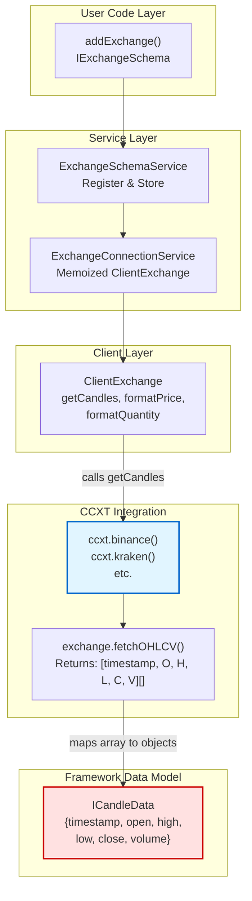
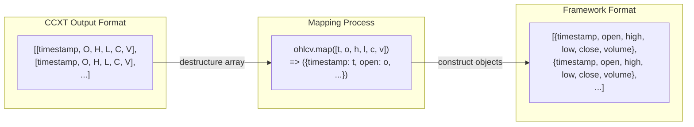
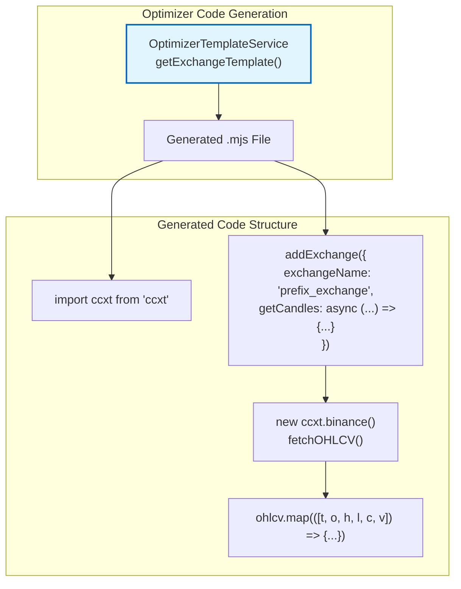
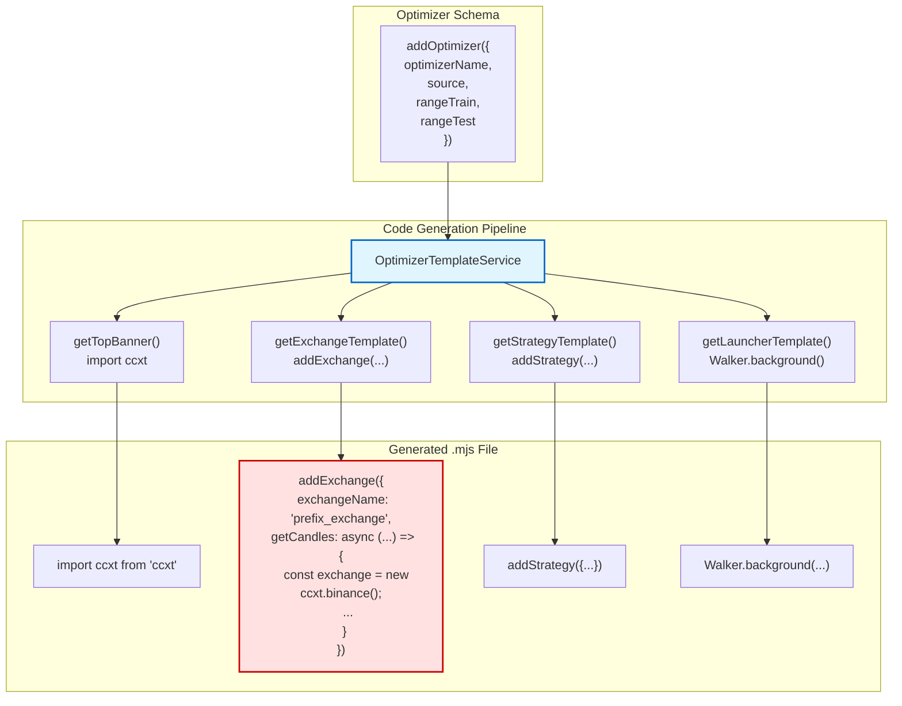

# CCXT Integration

This document explains how Backtest Kit integrates with the CCXT library to fetch market data from cryptocurrency exchanges. CCXT (CryptoCurrency eXchange Trading) serves as the primary data source implementation for the framework, providing historical OHLCV (Open, High, Low, Close, Volume) candle data.

For information about defining custom exchange configurations, see [Exchange Configuration](./36_exchanges-data-sources.md). For details on candle data structures and validation, see [Candle Data & Validation](./36_exchanges-data-sources.md).

---

## Overview

CCXT is a JavaScript/TypeScript library that provides a unified API for interacting with over 100+ cryptocurrency exchanges. Backtest Kit uses CCXT exclusively for **data fetching**, not for actual trading operations. The framework wraps CCXT's data fetching capabilities within the `IExchangeSchema` interface, providing a consistent interface regardless of the underlying exchange.

**Key Integration Points:**
- **Data Source**: CCXT provides historical OHLCV candles via `fetchOHLCV`
- **Price Formatting**: CCXT exchanges handle symbol-specific price precision
- **Quantity Formatting**: CCXT exchanges handle symbol-specific quantity precision
- **No Trading**: Backtest Kit does not use CCXT for order placement or account management


---

## Architecture Integration

### CCXT in the Exchange Layer



**Data Flow:**
1. User calls `addExchange()` with CCXT-based implementation
2. Schema stored in `ExchangeSchemaService`
3. `ClientExchange` instance created by `ExchangeConnectionService`
4. Strategy calls `getCandles()` → triggers CCXT `fetchOHLCV()`
5. CCXT returns nested arrays → mapped to `ICandleData` objects


---

## IExchangeSchema Implementation

### Required Methods

The `IExchangeSchema` interface requires three methods when implementing CCXT integration:

| Method | Purpose | CCXT Equivalent |
|--------|---------|-----------------|
| `getCandles` | Fetch historical OHLCV data | `exchange.fetchOHLCV()` |
| `formatPrice` | Format price to exchange precision | `exchange.priceToPrecision()` or custom |
| `formatQuantity` | Format quantity to exchange precision | `exchange.amountToPrecision()` or custom |

### Basic CCXT Implementation

```typescript
import ccxt from 'ccxt';
import { addExchange } from 'backtest-kit';

addExchange({
  exchangeName: 'binance',
  
  // Fetch candles using CCXT
  getCandles: async (symbol, interval, since, limit) => {
    const exchange = new ccxt.binance();
    const ohlcv = await exchange.fetchOHLCV(
      symbol,           // e.g., "BTCUSDT"
      interval,         // e.g., "1m", "5m", "1h"
      since.getTime(),  // Unix timestamp in milliseconds
      limit             // Number of candles to fetch
    );
    
    // Map CCXT array format to ICandleData object format
    return ohlcv.map(([timestamp, open, high, low, close, volume]) => ({
      timestamp,  // Unix timestamp (ms)
      open,       // Opening price
      high,       // Highest price
      low,        // Lowest price
      close,      // Closing price
      volume      // Trading volume
    }));
  },
  
  // Format price (simple approach)
  formatPrice: (symbol, price) => price.toFixed(2),
  
  // Format quantity (simple approach)
  formatQuantity: (symbol, quantity) => quantity.toFixed(8),
});
```


---

## Data Format Mapping

### CCXT OHLCV Array to ICandleData

CCXT returns OHLCV data as nested arrays with a specific structure. Backtest Kit requires object-based `ICandleData` format for easier manipulation and type safety.



**CCXT Array Structure:**
```
[
  timestamp (number),  // Index 0: Unix timestamp in milliseconds
  open (number),       // Index 1: Opening price
  high (number),       // Index 2: Highest price
  low (number),        // Index 3: Lowest price
  close (number),      // Index 4: Closing price
  volume (number)      // Index 5: Trading volume
]
```

**ICandleData Object Structure:**
```typescript
interface ICandleData {
  timestamp: number;  // Unix timestamp in milliseconds
  open: number;       // Opening price
  high: number;       // Highest price
  low: number;        // Lowest price
  close: number;      // Closing price
  volume: number;     // Trading volume
}
```


---

## Exchange Method Parameters

### getCandles Parameters

The `getCandles` method receives four parameters that must be passed to CCXT's `fetchOHLCV`:

| Parameter | Type | Description | CCXT Mapping |
|-----------|------|-------------|--------------|
| `symbol` | `string` | Trading pair (e.g., "BTCUSDT") | Direct pass-through |
| `interval` | `CandleInterval` | Timeframe string ("1m", "5m", etc.) | Direct pass-through |
| `since` | `Date` | Start date for data range | Convert to `since.getTime()` |
| `limit` | `number` | Maximum candles to fetch | Direct pass-through |

**Important Notes:**
- **Timestamp Conversion**: CCXT expects Unix timestamp in **milliseconds**, so use `since.getTime()` rather than `since`
- **Interval Format**: CCXT uses strings like `"1m"`, `"5m"`, `"1h"`, `"1d"` - same as Backtest Kit's `CandleInterval` type
- **Limit Behavior**: Some exchanges have maximum limits (e.g., 1000 candles per request). CCXT handles pagination internally for some methods, but `fetchOHLCV` typically requires manual pagination

### Example with Error Handling

```typescript
getCandles: async (symbol, interval, since, limit) => {
  const exchange = new ccxt.binance();
  
  try {
    const ohlcv = await exchange.fetchOHLCV(
      symbol,
      interval,
      since.getTime(),  // Convert Date to Unix timestamp (ms)
      limit
    );
    
    // Validate data exists
    if (!ohlcv || ohlcv.length === 0) {
      throw new Error(`No candle data returned for ${symbol}`);
    }
    
    return ohlcv.map(([timestamp, open, high, low, close, volume]) => ({
      timestamp,
      open,
      high,
      low,
      close,
      volume
    }));
  } catch (error) {
    console.error(`CCXT error fetching ${symbol}:`, error);
    throw error;
  }
}
```


---

## Formatter Methods

### formatPrice Implementation

The `formatPrice` method converts numeric prices to exchange-specific precision strings. While a simple `toFixed()` approach works for testing, production implementations should use CCXT's precision helpers.

**Simple Approach (Testing):**
```typescript
formatPrice: (symbol, price) => price.toFixed(2)
```

**Production Approach (Using CCXT Precision):**
```typescript
formatPrice: async (symbol, price) => {
  const exchange = new ccxt.binance();
  await exchange.loadMarkets();  // Load market metadata
  return exchange.priceToPrecision(symbol, price);
}
```

### formatQuantity Implementation

The `formatQuantity` method converts numeric quantities to exchange-specific precision strings.

**Simple Approach (Testing):**
```typescript
formatQuantity: (symbol, quantity) => quantity.toFixed(8)
```

**Production Approach (Using CCXT Precision):**
```typescript
formatQuantity: async (symbol, quantity) => {
  const exchange = new ccxt.binance();
  await exchange.loadMarkets();
  return exchange.amountToPrecision(symbol, quantity);
}
```

**Caching Consideration:**
Since `loadMarkets()` makes a network request, consider caching the exchange instance:

```typescript
const exchangeCache = new Map<string, ccxt.Exchange>();

function getExchange(exchangeName: string): ccxt.Exchange {
  if (!exchangeCache.has(exchangeName)) {
    const exchange = new ccxt.binance();
    exchangeCache.set(exchangeName, exchange);
  }
  return exchangeCache.get(exchangeName)!;
}

addExchange({
  exchangeName: 'binance',
  getCandles: async (symbol, interval, since, limit) => {
    const exchange = getExchange('binance');
    // ... rest of implementation
  },
  formatPrice: async (symbol, price) => {
    const exchange = getExchange('binance');
    await exchange.loadMarkets();
    return exchange.priceToPrecision(symbol, price);
  },
  formatQuantity: async (symbol, quantity) => {
    const exchange = getExchange('binance');
    await exchange.loadMarkets();
    return exchange.amountToPrecision(symbol, quantity);
  },
});
```


---

## Optimizer Template Generation

### Auto-Generated CCXT Code

The `OptimizerTemplateService` automatically generates CCXT integration code when creating strategy files. This ensures consistency across optimizer-generated strategies.



**Template Implementation:**

The `getExchangeTemplate` method in `src/lib/services/template/OptimizerTemplateService.ts:314-342` generates:

```typescript
addExchange({
    exchangeName: "${escapedExchangeName}",
    getCandles: async (symbol, interval, since, limit) => {
        const exchange = new ccxt.binance();
        const ohlcv = await exchange.fetchOHLCV(symbol, interval, since.getTime(), limit);
        return ohlcv.map(([timestamp, open, high, low, close, volume]) => ({
            timestamp, open, high, low, close, volume
        }));
    },
    formatPrice: async (symbol, price) => price.toFixed(2),
    formatQuantity: async (symbol, quantity) => quantity.toFixed(8),
});
```

**Key Features:**
- **Code Injection Protection**: Uses `escapedExchangeName` to prevent malicious input `src/lib/services/template/OptimizerTemplateService.ts:324-326`
- **Hardcoded Binance**: Currently generates Binance-specific code (could be parameterized in future)
- **Simple Formatters**: Uses basic `toFixed()` for price/quantity formatting


---

## Multi-Exchange Support

### Using Different CCXT Exchanges

CCXT supports 100+ exchanges. To use a different exchange, simply change the constructor:

```typescript
// Binance
const exchange = new ccxt.binance();

// Kraken
const exchange = new ccxt.kraken();

// Coinbase Pro
const exchange = new ccxt.coinbasepro();

// FTX (if available)
const exchange = new ccxt.ftx();
```

### Exchange-Specific Configuration

Some exchanges require API credentials even for public data:

```typescript
addExchange({
  exchangeName: 'kraken',
  getCandles: async (symbol, interval, since, limit) => {
    const exchange = new ccxt.kraken({
      apiKey: process.env.KRAKEN_API_KEY,       // Optional for public data
      secret: process.env.KRAKEN_SECRET,        // Optional for public data
      enableRateLimit: true,                     // Recommended
      timeout: 30000                             // 30 second timeout
    });
    
    const ohlcv = await exchange.fetchOHLCV(symbol, interval, since.getTime(), limit);
    return ohlcv.map(([timestamp, open, high, low, close, volume]) => ({
      timestamp, open, high, low, close, volume
    }));
  },
  // ... formatters
});
```

### Handling Exchange Rate Limits

CCXT provides built-in rate limiting:

```typescript
const exchange = new ccxt.binance({
  enableRateLimit: true,  // Automatically throttle requests
  rateLimit: 1200         // Milliseconds between requests (optional)
});
```

**Backtest Considerations:**
- During backtests, `getCandles` may be called thousands of times
- Enable `enableRateLimit` to avoid hitting exchange API limits
- Consider implementing a caching layer for frequently accessed data
- Use the framework's built-in candle buffering (handled by `ClientExchange`)


---

## Common Patterns and Best Practices

### Pattern 1: Singleton Exchange Instance

Create exchange instances once and reuse them:

```typescript
let exchangeInstance: ccxt.Exchange | null = null;

addExchange({
  exchangeName: 'binance',
  getCandles: async (symbol, interval, since, limit) => {
    if (!exchangeInstance) {
      exchangeInstance = new ccxt.binance({
        enableRateLimit: true
      });
    }
    
    const ohlcv = await exchangeInstance.fetchOHLCV(
      symbol, interval, since.getTime(), limit
    );
    
    return ohlcv.map(([timestamp, open, high, low, close, volume]) => ({
      timestamp, open, high, low, close, volume
    }));
  },
  // ... formatters
});
```

### Pattern 2: Symbol Normalization

Different exchanges use different symbol formats:

```typescript
function normalizeSymbol(symbol: string, exchangeName: string): string {
  // Binance uses "BTCUSDT", Kraken uses "BTC/USDT"
  if (exchangeName === 'binance') {
    return symbol.replace('/', '');  // BTC/USDT -> BTCUSDT
  }
  if (exchangeName === 'kraken') {
    return symbol.includes('/') ? symbol : `${symbol.slice(0, -4)}/${symbol.slice(-4)}`;
  }
  return symbol;
}

addExchange({
  exchangeName: 'binance',
  getCandles: async (symbol, interval, since, limit) => {
    const exchange = new ccxt.binance();
    const normalizedSymbol = normalizeSymbol(symbol, 'binance');
    // ... rest of implementation
  },
  // ... formatters
});
```

### Pattern 3: Error Recovery with Retries

Implement retry logic for network failures:

```typescript
async function fetchWithRetry<T>(
  fn: () => Promise<T>,
  retries: number = 3,
  delay: number = 1000
): Promise<T> {
  try {
    return await fn();
  } catch (error) {
    if (retries > 0) {
      await new Promise(resolve => setTimeout(resolve, delay));
      return fetchWithRetry(fn, retries - 1, delay * 2);
    }
    throw error;
  }
}

addExchange({
  exchangeName: 'binance',
  getCandles: async (symbol, interval, since, limit) => {
    const exchange = new ccxt.binance({ enableRateLimit: true });
    
    const ohlcv = await fetchWithRetry(() =>
      exchange.fetchOHLCV(symbol, interval, since.getTime(), limit)
    );
    
    return ohlcv.map(([timestamp, open, high, low, close, volume]) => ({
      timestamp, open, high, low, close, volume
    }));
  },
  // ... formatters
});
```


---

## Interval Mapping

### Supported Timeframes

CCXT and Backtest Kit both use string-based interval notation. Common intervals:

| Interval | Description | Typical Use Case |
|----------|-------------|------------------|
| `"1m"` | 1 minute | High-frequency strategies |
| `"5m"` | 5 minutes | Intraday trading |
| `"15m"` | 15 minutes | Short-term analysis |
| `"1h"` | 1 hour | Medium-term trends |
| `"4h"` | 4 hours | Swing trading |
| `"1d"` | 1 day | Long-term analysis |

**Note:** Not all exchanges support all intervals. Check CCXT documentation for exchange-specific limitations.

### Validating Interval Support

```typescript
addExchange({
  exchangeName: 'binance',
  getCandles: async (symbol, interval, since, limit) => {
    const exchange = new ccxt.binance();
    
    // Load markets to check supported timeframes
    await exchange.loadMarkets();
    
    const market = exchange.market(symbol);
    if (market && market.timeframes && !market.timeframes.includes(interval)) {
      throw new Error(
        `Interval ${interval} not supported for ${symbol} on ${exchange.name}`
      );
    }
    
    const ohlcv = await exchange.fetchOHLCV(symbol, interval, since.getTime(), limit);
    return ohlcv.map(([timestamp, open, high, low, close, volume]) => ({
      timestamp, open, high, low, close, volume
    }));
  },
  // ... formatters
});
```


---

## Testing and Debugging

### Logging CCXT Requests

Enable verbose logging to debug data fetching issues:

```typescript
addExchange({
  exchangeName: 'binance',
  getCandles: async (symbol, interval, since, limit) => {
    const exchange = new ccxt.binance({
      enableRateLimit: true,
      verbose: process.env.DEBUG === 'true'  // Enable in .env
    });
    
    console.log(`Fetching ${symbol} ${interval} from ${since.toISOString()}, limit=${limit}`);
    
    const ohlcv = await exchange.fetchOHLCV(symbol, interval, since.getTime(), limit);
    
    console.log(`Received ${ohlcv.length} candles`);
    
    return ohlcv.map(([timestamp, open, high, low, close, volume]) => ({
      timestamp, open, high, low, close, volume
    }));
  },
  // ... formatters
});
```

### Validating Data Quality

Check for common data issues:

```typescript
getCandles: async (symbol, interval, since, limit) => {
  const exchange = new ccxt.binance();
  const ohlcv = await exchange.fetchOHLCV(symbol, interval, since.getTime(), limit);
  
  // Validate data
  const candles = ohlcv.map(([timestamp, open, high, low, close, volume]) => {
    // Check for invalid prices
    if (open <= 0 || high <= 0 || low <= 0 || close <= 0) {
      console.warn(`Invalid prices for ${symbol} at ${timestamp}`);
    }
    
    // Check OHLC relationship
    if (high < Math.max(open, close) || low > Math.min(open, close)) {
      console.warn(`OHLC inconsistency for ${symbol} at ${timestamp}`);
    }
    
    return { timestamp, open, high, low, close, volume };
  });
  
  return candles;
}
```


---

## Common Issues and Solutions

### Issue 1: Rate Limit Exceeded

**Problem:** CCXT throws `RateLimitExceeded` error during backtests.

**Solution:**
```typescript
const exchange = new ccxt.binance({
  enableRateLimit: true,  // Enable automatic throttling
  rateLimit: 2000         // Increase delay between requests
});
```

### Issue 2: Missing Candles

**Problem:** CCXT returns fewer candles than requested `limit`.

**Explanation:** Exchanges may not have data for the entire requested range, especially for recent listings or delisted pairs.

**Solution:** Handle partial data gracefully:
```typescript
const ohlcv = await exchange.fetchOHLCV(symbol, interval, since.getTime(), limit);

if (ohlcv.length < limit) {
  console.warn(`Only ${ohlcv.length} of ${limit} candles available`);
}

// Framework handles incomplete data via anomaly detection (see page 8.2)
return ohlcv.map(/* ... */);
```

### Issue 3: Symbol Not Found

**Problem:** Exchange throws "symbol not found" error.

**Solution:** Load markets first and validate symbol exists:
```typescript
const exchange = new ccxt.binance();
await exchange.loadMarkets();

if (!exchange.has[symbol]) {
  throw new Error(`Symbol ${symbol} not found on ${exchange.name}`);
}
```

### Issue 4: Timestamp Mismatch

**Problem:** Candle timestamps don't align with requested `since` date.

**Explanation:** Exchanges return candles aligned to interval boundaries. Requesting data from `2024-01-01 14:23:00` with `1h` interval will return candles starting at `2024-01-01 14:00:00`.

**Solution:** This is expected behavior. The framework's time execution engine handles alignment automatically.


---

## Integration with Optimizer

The Optimizer system automatically generates CCXT integration code for strategy backtests. When you define an optimizer schema with `addOptimizer()`, the generated `.mjs` file includes a complete CCXT exchange configuration.

### Generated Code Structure



**Generated Exchange Code:**

From `src/lib/services/template/OptimizerTemplateService.ts:314-342`, the optimizer generates:

```typescript
import ccxt from 'ccxt';

addExchange({
    exchangeName: "abc123_exchange",
    getCandles: async (symbol, interval, since, limit) => {
        const exchange = new ccxt.binance();
        const ohlcv = await exchange.fetchOHLCV(symbol, interval, since.getTime(), limit);
        return ohlcv.map(([timestamp, open, high, low, close, volume]) => ({
            timestamp, open, high, low, close, volume
        }));
    },
    formatPrice: async (symbol, price) => price.toFixed(2),
    formatQuantity: async (symbol, quantity) => quantity.toFixed(8),
});
```

**Customizing Generated Exchange:**

To use a different exchange in generated code, override the `getExchangeTemplate` method:

```typescript
addOptimizer({
  optimizerName: 'my-optimizer',
  // ... other config
  template: {
    getExchangeTemplate: async (symbol, exchangeName) => {
      return `
        addExchange({
          exchangeName: "${exchangeName}",
          getCandles: async (symbol, interval, since, limit) => {
            const exchange = new ccxt.kraken();  // Use Kraken instead
            const ohlcv = await exchange.fetchOHLCV(symbol, interval, since.getTime(), limit);
            return ohlcv.map(([timestamp, open, high, low, close, volume]) => ({
              timestamp, open, high, low, close, volume
            }));
          },
          formatPrice: async (symbol, price) => price.toFixed(2),
          formatQuantity: async (symbol, quantity) => quantity.toFixed(8),
        });
      `;
    }
  }
});
```


---

## Summary

CCXT integration in Backtest Kit provides:

1. **Unified Data Access**: Single interface (`IExchangeSchema`) wraps CCXT's exchange-specific implementations
2. **Automatic Mapping**: CCXT's array-based OHLCV data automatically mapped to framework's object-based `ICandleData`
3. **Multi-Exchange Support**: Easy switching between 100+ exchanges by changing constructor
4. **Optimizer Integration**: Auto-generated CCXT code in optimizer-produced strategies
5. **Production Ready**: Built-in rate limiting, error handling, and retry logic support

**Key Takeaways:**
- CCXT is used **only for data fetching**, not trading
- Always enable rate limiting with `enableRateLimit: true`
- Use `since.getTime()` to convert Date to milliseconds
- Implement exchange instance caching for better performance
- Override optimizer templates to customize generated exchange code

For advanced exchange configuration patterns, see [Exchange Configuration](./36_exchanges-data-sources.md). For data validation and anomaly detection, see [Candle Data & Validation](./36_exchanges-data-sources.md).

