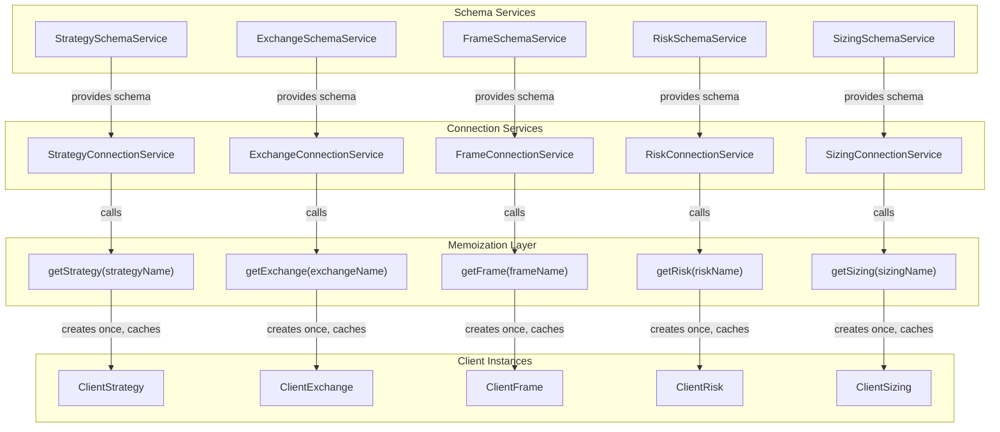
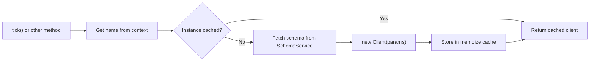
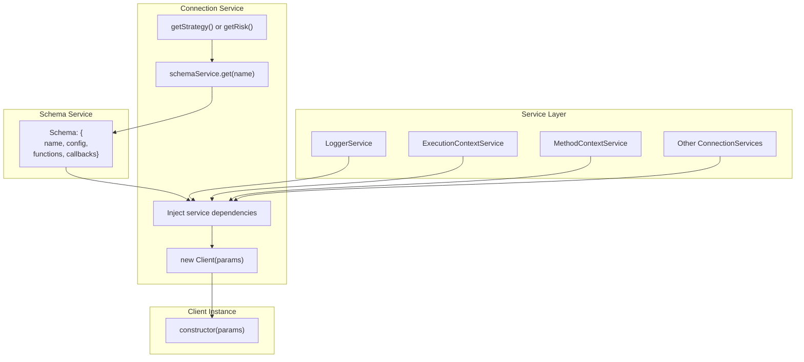
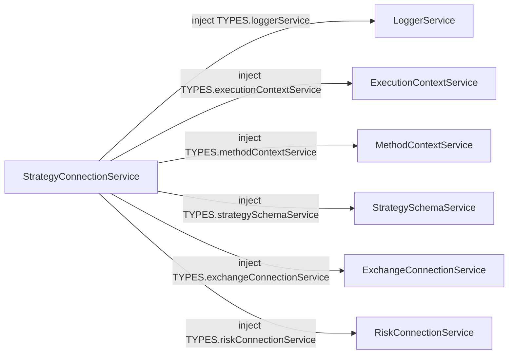
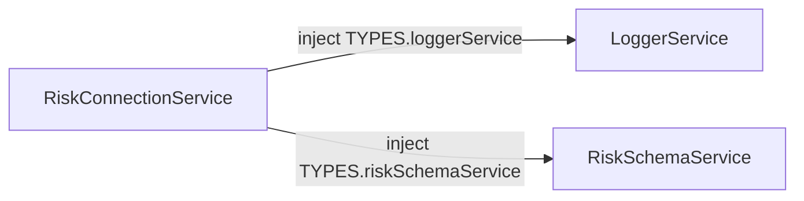
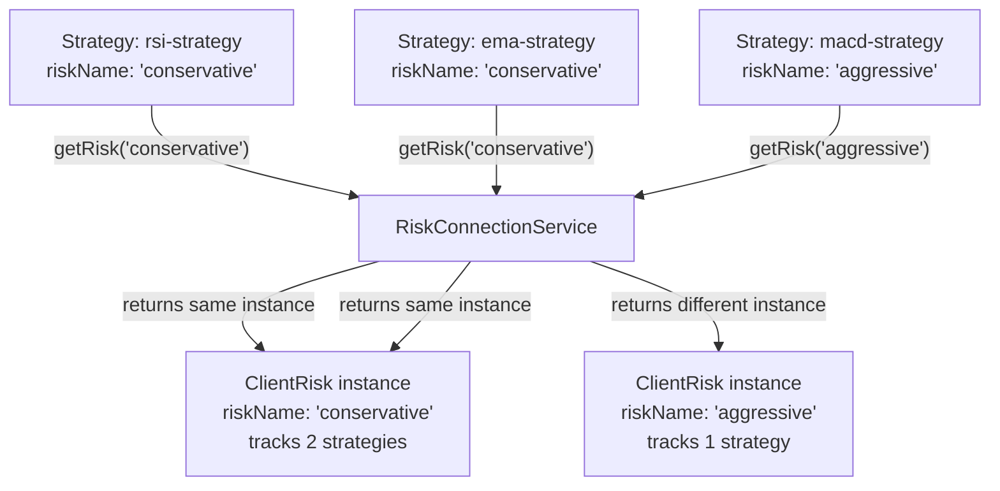
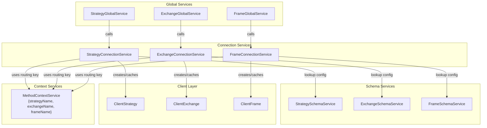

# Connection Services

## Purpose and Scope

Connection Services implement memoized client instance management within the service layer architecture. Each Connection Service is responsible for creating and caching client instances (ClientStrategy, ClientExchange, ClientFrame, ClientRisk, ClientSizing) based on their respective schema names. These services inject required dependencies into client constructors and ensure one instance exists per registered schema name.

This document covers all five Connection Services: `StrategyConnectionService`, `ExchangeConnectionService`, `FrameConnectionService`, `RiskConnectionService`, and `SizingConnectionService`. For schema registration, see page 7.3 Schema Services. For client implementations, see page 6 Core Business Logic. For routing context, see page 3.3 Context Propagation.

**Sources:** [src/lib/services/connection/StrategyConnectionService.ts:1-186](), [src/lib/services/connection/RiskConnectionService.ts:1-138](), [src/lib/core/types.ts:10-16]()

---

## Architecture Overview

Connection Services implement the factory pattern with memoization to manage client instance lifecycles. Each service injects dependencies from Schema Services and other infrastructure services into client constructors, then caches the resulting instances by name.

### Connection Services and Their Clients

| Connection Service | Client Class | Cache Key | Interface Implemented |
|-------------------|--------------|-----------|---------------------|
| StrategyConnectionService | ClientStrategy | strategyName | IStrategy |
| ExchangeConnectionService | ClientExchange | exchangeName | IExchange |
| FrameConnectionService | ClientFrame | frameName | IFrame |
| RiskConnectionService | ClientRisk | riskName | IRisk |
| SizingConnectionService | ClientSizing | sizingName | ISizing |

### Instance Management Architecture



**Sources:** [src/lib/services/connection/StrategyConnectionService.ts:76-94](), [src/lib/services/connection/RiskConnectionService.ts:56-65](), [src/lib/core/types.ts:10-16]()

---

## Memoization Pattern

All Connection Services use `memoize` from `functools-kit` to cache client instances. The pattern ensures each schema name maps to exactly one client instance for the application lifetime.

### Memoization Structure



### Memoize Key Function Pattern

Each Connection Service defines a key function that extracts the cache key from arguments:

**Example from StrategyConnectionService [src/lib/services/connection/StrategyConnectionService.ts:76-94]():**
```typescript
private getStrategy = memoize(
  ([strategyName]) => `${strategyName}`,  // Key function: extracts strategyName
  (strategyName: StrategyName) => {       // Factory function: creates instance
    const { riskName, getSignal, interval, callbacks } =
      this.strategySchemaService.get(strategyName);
    return new ClientStrategy({
      interval,
      execution: this.executionContextService,
      method: this.methodContextService,
      logger: this.loggerService,
      exchange: this.exchangeConnectionService,
      risk: riskName ? this.riskConnectionService.getRisk(riskName) : NOOP_RISK,
      riskName,
      strategyName,
      getSignal,
      callbacks,
    });
  }
);
```

**Example from RiskConnectionService [src/lib/services/connection/RiskConnectionService.ts:56-65]():**
```typescript
public getRisk = memoize(
  ([riskName]) => `${riskName}`,         // Key function
  (riskName: RiskName) => {              // Factory function
    const schema = this.riskSchemaService.get(riskName);
    return new ClientRisk({
      ...schema,
      logger: this.loggerService,
    });
  }
);
```

**Sources:** [src/lib/services/connection/StrategyConnectionService.ts:76-94](), [src/lib/services/connection/RiskConnectionService.ts:56-65]()

---

## Dependency Injection into Clients

Connection Services inject dependencies into client constructors, combining schema configuration with infrastructure services.

### Dependency Injection Patterns

**StrategyConnectionService [src/lib/services/connection/StrategyConnectionService.ts:76-94]():**
| Injected Dependency | Type | Purpose |
|-------------------|------|---------|
| `interval` | SignalInterval | From schema: throttling interval |
| `getSignal` | Function | From schema: signal generation logic |
| `callbacks` | Partial<IStrategyCallbacks> | From schema: lifecycle hooks |
| `riskName` | RiskName | From schema: risk profile identifier |
| `strategyName` | StrategyName | From schema: instance identifier |
| `logger` | LoggerService | Service layer: logging |
| `execution` | ExecutionContextService | Service layer: when/symbol/backtest |
| `method` | MethodContextService | Service layer: strategy/exchange/frame names |
| `exchange` | ExchangeConnectionService | Service layer: market data access |
| `risk` | IRisk | Service layer: risk checking (via RiskConnectionService) |

**RiskConnectionService [src/lib/services/connection/RiskConnectionService.ts:56-65]():**
| Injected Dependency | Type | Purpose |
|-------------------|------|---------|
| `riskName` | RiskName | From schema: instance identifier |
| `validations` | Array | From schema: custom validation functions |
| `callbacks` | Partial<IRiskCallbacks> | From schema: lifecycle hooks |
| `logger` | LoggerService | Service layer: logging |

### Injection Flow



**Sources:** [src/lib/services/connection/StrategyConnectionService.ts:76-94](), [src/lib/services/connection/RiskConnectionService.ts:56-65](), [src/client/ClientStrategy.ts:1-30](), [src/client/ClientRisk.ts:1-30]()

---

## StrategyConnectionService

Manages `ClientStrategy` instances by strategyName. Implements the `IStrategy` interface [src/interfaces/Strategy.interface.ts:298-344]() and routes all strategy operations to memoized instances.

### Constructor Dependencies



**Sources:** [src/lib/services/connection/StrategyConnectionService.ts:53-65](), [src/lib/core/types.ts:1-81]()

### Public Methods

#### tick()

Calls `ClientStrategy.tick()` for the current strategy. Routes to memoized instance via `methodContextService.context.strategyName`.

**Returns:** `Promise<IStrategyTickResult>`

**Flow:**
1. Get strategyName from context [src/lib/services/connection/StrategyConnectionService.ts:106-108]()
2. Call `getStrategy(strategyName)` to get cached instance
3. Call `strategy.waitForInit()` for persistence recovery [src/lib/services/connection/StrategyConnectionService.ts:109]()
4. Call `strategy.tick()` [src/lib/services/connection/StrategyConnectionService.ts:110]()
5. Emit result to signalEmitter, signalBacktestEmitter, signalLiveEmitter [src/lib/services/connection/StrategyConnectionService.ts:111-119]()

#### backtest(candles)

Calls `ClientStrategy.backtest(candles)` for the current strategy. Fast-forwards through historical candles.

**Parameters:** `candles: ICandleData[]`

**Returns:** `Promise<IStrategyBacktestResult>`

**Flow:** Similar to tick() but calls `strategy.backtest(candles)` [src/lib/services/connection/StrategyConnectionService.ts:132-150]()

#### stop(strategyName)

Calls `ClientStrategy.stop()` to prevent new signal generation. Active signals continue monitoring.

**Parameters:** `strategyName: StrategyName`

**Sources:** [src/lib/services/connection/StrategyConnectionService.ts:104-183]()

### NOOP_RISK Fallback

When a strategy has no `riskName`, a no-op risk implementation is injected [src/lib/services/connection/StrategyConnectionService.ts:25-29]():
```typescript
const NOOP_RISK: IRisk = {
  checkSignal: () => Promise.resolve(true),
  addSignal: () => Promise.resolve(),
  removeSignal: () => Promise.resolve(),
}
```

**Sources:** [src/lib/services/connection/StrategyConnectionService.ts:1-186]()

---

## RiskConnectionService

Manages `ClientRisk` instances by riskName. Implements `IRisk` interface methods and routes risk validation operations to memoized instances. Multiple strategies can share the same ClientRisk instance by specifying the same riskName.

### Constructor Dependencies



**Sources:** [src/lib/services/connection/RiskConnectionService.ts:42-45]()

### Instance Creation Pattern

The `getRisk` method [src/lib/services/connection/RiskConnectionService.ts:56-65]() creates ClientRisk instances with minimal dependencies:

```typescript
public getRisk = memoize(
  ([riskName]) => `${riskName}`,
  (riskName: RiskName) => {
    const schema = this.riskSchemaService.get(riskName);
    return new ClientRisk({
      ...schema,          // Spreads: riskName, validations, callbacks
      logger: this.loggerService,
    });
  }
);
```

### Public Methods

#### checkSignal(params, context)

Validates if a signal should be allowed based on risk limits. Delegates to `ClientRisk.checkSignal()`.

**Parameters:**
- `params: IRiskCheckArgs` - Contains symbol, strategyName, exchangeName, currentPrice, timestamp
- `context: { riskName: RiskName }` - Identifies which risk instance to use

**Returns:** `Promise<boolean>` - true if allowed, false if rejected

**Sources:** [src/lib/services/connection/RiskConnectionService.ts:77-86](), [src/interfaces/Risk.interface.ts:10-21]()

#### addSignal(symbol, context)

Registers an opened position in the risk tracker. Called after signal is opened.

**Parameters:**
- `symbol: string`
- `context: { strategyName: string; riskName: RiskName }`

**Sources:** [src/lib/services/connection/RiskConnectionService.ts:95-104]()

#### removeSignal(symbol, context)

Removes a closed position from the risk tracker. Called after signal is closed.

**Parameters:**
- `symbol: string`
- `context: { strategyName: string; riskName: RiskName }`

**Sources:** [src/lib/services/connection/RiskConnectionService.ts:113-122]()

### Shared Risk Instance Pattern

Multiple strategies with the same `riskName` share one ClientRisk instance [src/lib/services/connection/RiskConnectionService.ts:56-65](). This enables cross-strategy position tracking:



**Sources:** [src/lib/services/connection/RiskConnectionService.ts:1-138](), [src/client/ClientRisk.ts:1-221]()

---

## ExchangeConnectionService, FrameConnectionService, SizingConnectionService

The remaining Connection Services follow identical patterns to StrategyConnectionService and RiskConnectionService.

### ExchangeConnectionService

Manages `ClientExchange` instances by exchangeName. Routes market data operations (getCandles, getAveragePrice, formatPrice, formatQuantity).

**Injected Dependencies:**
- LoggerService
- ExecutionContextService
- MethodContextService
- ExchangeSchemaService

**Memoized Method:** `getExchange(exchangeName)` creates ClientExchange instances

**Sources:** [src/lib/services/connection/ExchangeConnectionService.ts:1-185]()

### FrameConnectionService

Manages `ClientFrame` instances by frameName. Routes timeframe generation for backtest periods.

**Injected Dependencies:**
- LoggerService
- MethodContextService
- FrameSchemaService

**Memoized Method:** `getFrame(frameName)` creates ClientFrame instances

**Note:** Not used in live mode where frameName is empty string.

**Sources:** [src/lib/services/connection/FrameConnectionService.ts:1-86]()

### SizingConnectionService

Manages `ClientSizing` instances by sizingName. Routes position size calculations (fixed-percentage, kelly-criterion, atr-based).

**Injected Dependencies:**
- LoggerService
- SizingSchemaService

**Memoized Method:** `getSizing(sizingName)` creates ClientSizing instances

**Sources:** [src/lib/core/types.ts:14](), [src/lib/core/provide.ts:57]()

---

## Integration Points

Connection Services integrate with multiple layers of the architecture, serving as the critical routing infrastructure.

### Service Dependencies



### Data Flow Through Connection Layer

| Source | Connection Service | Destination | Purpose |
|--------|-------------------|-------------|---------|
| Logic Services | StrategyConnectionService | ClientStrategy | Signal evaluation and backtest |
| ClientStrategy | ExchangeConnectionService | ClientExchange | Candle data and VWAP |
| Logic Services | ExchangeConnectionService | ClientExchange | Price formatting |
| Logic Services | FrameConnectionService | ClientFrame | Timeframe generation |

### Logging Integration

All Connection Services inject `LoggerService` and log operations with context-enriched metadata [src/lib/services/connection/StrategyConnectionService.ts:45](), [src/lib/services/connection/ExchangeConnectionService.ts:39](), [src/lib/services/connection/FrameConnectionService.ts:33]():

- `StrategyConnectionService`: Logs tick and backtest operations with candle counts
- `ExchangeConnectionService`: Logs all data fetching with symbol, interval, and limits
- `FrameConnectionService`: Logs timeframe retrieval with symbol

**Sources:** [src/lib/services/connection/StrategyConnectionService.ts:1-143](), [src/lib/services/connection/ExchangeConnectionService.ts:1-185](), [src/lib/services/connection/FrameConnectionService.ts:1-86]()