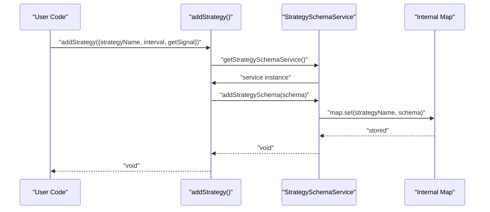
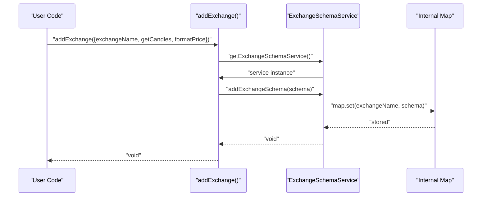
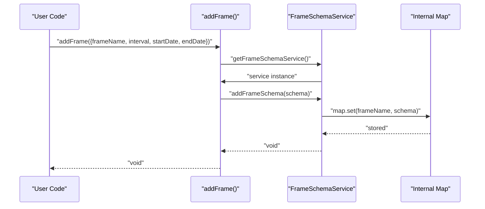
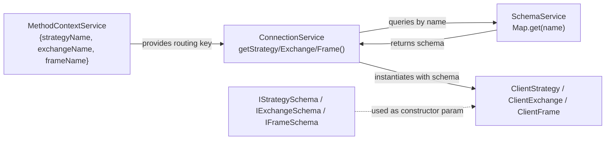
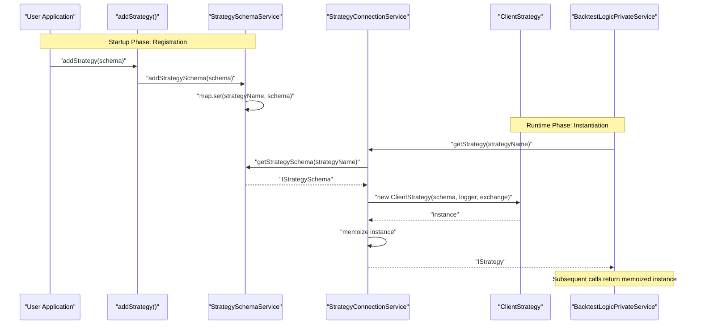

# Schema Services

Schema Services implement the registry pattern for storing configuration schemas in the backtest-kit framework. These services act as in-memory storage for strategy, exchange, and frame configurations registered at application startup via `addStrategy()`, `addExchange()`, and `addFrame()` functions. They provide lookup capabilities for Connection Services (see [5.1](#5.1)) which create runtime instances based on registered schemas.

For information about how registered schemas are instantiated into client objects, see [Connection Services](#5.1). For details on schema interfaces and registration functions, see [Configuration Functions](#3.1).

---

## Overview

The framework provides six schema services, each managing a specific domain's configuration registry:

| Service | Purpose | Schema Interface | Registration Function | Storage Key |
|---------|---------|------------------|----------------------|-------------|
| `StrategySchemaService` | Stores strategy configurations | `IStrategySchema` | `addStrategy()` | `strategyName` |
| `ExchangeSchemaService` | Stores exchange configurations | `IExchangeSchema` | `addExchange()` | `exchangeName` |
| `FrameSchemaService` | Stores frame configurations | `IFrameSchema` | `addFrame()` | `frameName` |
| `WalkerSchemaService` | Stores walker configurations | `IWalkerSchema` | `addWalker()` | `walkerName` |
| `SizingSchemaService` | Stores sizing configurations | `ISizingSchema` | `addSizing()` | `sizingName` |
| `RiskSchemaService` | Stores risk configurations | `IRiskSchema` | `addRisk()` | `riskName` |

All schema services follow identical patterns: singleton registration, `ToolRegistry`-based storage (from `functools-kit`), and name-based lookup. They are instantiated once during framework initialization and shared across all execution contexts.

**Sources:** [src/lib/core/types.ts:18-25](), [src/lib/core/provide.ts:62-67](), [src/function/add.ts:50-341]()

---

## Schema Service Architecture

The following diagram illustrates the relationship between registration functions, schema services, and connection services:

```mermaid
graph TB
    subgraph PublicAPI["Public API"]
        AddStrategy["addStrategy()"]
        AddExchange["addExchange()"]
        AddFrame["addFrame()"]
        AddWalker["addWalker()"]
        AddSizing["addSizing()"]
        AddRisk["addRisk()"]
    end
    
    subgraph SchemaServices["Schema Services (ToolRegistry-based Registries)"]
        StrategySchema["StrategySchemaService<br/>ToolRegistry&lt;IStrategySchema&gt;"]
        ExchangeSchema["ExchangeSchemaService<br/>ToolRegistry&lt;IExchangeSchema&gt;"]
        FrameSchema["FrameSchemaService<br/>ToolRegistry&lt;IFrameSchema&gt;"]
        WalkerSchema["WalkerSchemaService<br/>ToolRegistry&lt;IWalkerSchema&gt;"]
        SizingSchema["SizingSchemaService<br/>ToolRegistry&lt;ISizingSchema&gt;"]
        RiskSchema["RiskSchemaService<br/>ToolRegistry&lt;IRiskSchema&gt;"]
    end
    
    subgraph ConnectionServices["Connection Services (Consumers)"]
        StrategyConn["StrategyConnectionService"]
        ExchangeConn["ExchangeConnectionService"]
        FrameConn["FrameConnectionService"]
        SizingConn["SizingConnectionService"]
        RiskConn["RiskConnectionService"]
    end
    
    AddStrategy -->|"register()"| StrategySchema
    AddExchange -->|"register()"| ExchangeSchema
    AddFrame -->|"register()"| FrameSchema
    AddWalker -->|"register()"| WalkerSchema
    AddSizing -->|"register()"| SizingSchema
    AddRisk -->|"register()"| RiskSchema
    
    StrategyConn -->|"get()"| StrategySchema
    ExchangeConn -->|"get()"| ExchangeSchema
    FrameConn -->|"get()"| FrameSchema
    SizingConn -->|"get()"| SizingSchema
    RiskConn -->|"get()"| RiskSchema
```



**Diagram: Schema Service Registry Pattern**

This architecture separates registration (startup time) from instantiation (runtime). Users register schemas once during application initialization using `add*()` functions. Connection Services query these registries on-demand using `get()` methods to create memoized client instances. All schema services use `ToolRegistry` from `functools-kit` for type-safe storage and retrieval.

**Sources:** [src/lib/index.ts:80-90](), [src/lib/core/types.ts:18-25](), [src/lib/core/provide.ts:62-67](), [src/function/add.ts:50-341]()

---

## StrategySchemaService

`StrategySchemaService` manages the registry of strategy configurations. Each strategy is identified by a unique `strategyName` and contains signal generation logic and lifecycle callbacks.

### Storage Structure

The service uses a `Map<StrategyName, IStrategySchema>` to store registered strategies. The map key is the strategy name, and the value is the complete schema object.

### IStrategySchema Interface

The strategy schema interface defines:

```typescript
interface IStrategySchema {
    strategyName: StrategyName;           // Unique identifier
    interval: SignalInterval;             // Throttling interval (1m, 5m, 1h, etc.)
    getSignal: (symbol: string) => Promise<ISignalDto | null>;  // Signal generator
    callbacks?: Partial<IStrategyCallbacks>;  // Optional lifecycle hooks
}
```

**Field Descriptions:**

| Field | Type | Purpose |
|-------|------|---------|
| `strategyName` | `string` | Unique identifier used for registry lookup and routing |
| `interval` | `SignalInterval` | Minimum time between `getSignal()` calls for throttling |
| `getSignal` | `async function` | Signal generation logic, returns `null` or validated `ISignalDto` |
| `callbacks` | `object` (optional) | Lifecycle hooks: `onTick`, `onOpen`, `onActive`, `onIdle`, `onClose` |

### Registration via addStrategy()

The `addStrategy()` function registers a strategy schema into `StrategySchemaService`:



**Diagram: Strategy Schema Registration Flow**

The registration process validates that `strategyName` is unique and stores the schema for later retrieval by `StrategyConnectionService`.

**Sources:** [types.d.ts:413-422](), [types.d.ts:579-578](), [src/lib/services/schema/StrategySchemaService.ts]()

---

## ExchangeSchemaService

`ExchangeSchemaService` manages the registry of exchange data sources. Each exchange provides candle data fetching, price formatting, and quantity formatting logic.

### Storage Structure

The service uses a `Map<ExchangeName, IExchangeSchema>` to store registered exchanges. The map key is the exchange name, and the value is the complete schema object.

### IExchangeSchema Interface

The exchange schema interface defines:

```typescript
interface IExchangeSchema {
    exchangeName: ExchangeName;  // Unique identifier
    getCandles: (symbol: string, interval: CandleInterval, since: Date, limit: number) 
        => Promise<ICandleData[]>;
    formatQuantity: (symbol: string, quantity: number) => Promise<string>;
    formatPrice: (symbol: string, price: number) => Promise<string>;
    callbacks?: Partial<IExchangeCallbacks>;  // Optional onCandleData hook
}
```

**Field Descriptions:**

| Field | Type | Purpose |
|-------|------|---------|
| `exchangeName` | `string` | Unique identifier used for registry lookup and routing |
| `getCandles` | `async function` | Fetches historical OHLCV candle data from exchange/database |
| `formatQuantity` | `async function` | Formats quantity values to exchange precision rules |
| `formatPrice` | `async function` | Formats price values to exchange precision rules |
| `callbacks` | `object` (optional) | Lifecycle hooks: `onCandleData` for logging/monitoring |

### Registration via addExchange()

The `addExchange()` function registers an exchange schema into `ExchangeSchemaService`:



**Diagram: Exchange Schema Registration Flow**

The registration process validates that `exchangeName` is unique and stores the schema for later retrieval by `ExchangeConnectionService`.

**Sources:** [types.d.ts:137-171](), [types.d.ts:615-614](), [src/lib/services/schema/ExchangeSchemaService.ts]()

---

## FrameSchemaService

`FrameSchemaService` manages the registry of timeframe configurations for backtesting. Each frame defines the start date, end date, and interval for timestamp generation.

### Storage Structure

The service uses a `Map<FrameName, IFrameSchema>` to store registered frames. The map key is the frame name, and the value is the complete schema object.

### IFrameSchema Interface

The frame schema interface defines:

```typescript
interface IFrameSchema {
    frameName: FrameName;       // Unique identifier
    interval: FrameInterval;    // Timestamp interval (1m, 1h, 1d, etc.)
    startDate: Date;            // Backtest period start (inclusive)
    endDate: Date;              // Backtest period end (inclusive)
    callbacks?: Partial<IFrameCallbacks>;  // Optional onTimeframe hook
}
```

**Field Descriptions:**

| Field | Type | Purpose |
|-------|------|---------|
| `frameName` | `string` | Unique identifier used for registry lookup and routing |
| `interval` | `FrameInterval` | Time spacing between generated timestamps |
| `startDate` | `Date` | Beginning of backtest period (inclusive boundary) |
| `endDate` | `Date` | End of backtest period (inclusive boundary) |
| `callbacks` | `object` (optional) | Lifecycle hooks: `onTimeframe` called after generation |

### Registration via addFrame()

The `addFrame()` function registers a frame schema into `FrameSchemaService`:



**Diagram: Frame Schema Registration Flow**

The registration process validates that `frameName` is unique and stores the schema for later retrieval by `FrameConnectionService`.

**Sources:** [src/function/add.ts:143-149]()

---

## WalkerSchemaService

`WalkerSchemaService` manages the registry of walker configurations for strategy comparison. Each walker defines a list of strategies to compare, the exchange and frame to use, and the metric for ranking.

### Storage Structure

The service uses `ToolRegistry<IWalkerSchema>` from `functools-kit` to store registered walkers. The registry is keyed by `walkerName`.

### IWalkerSchema Interface

The walker schema interface defines:

```typescript
interface IWalkerSchema {
    walkerName: WalkerName;         // Unique identifier
    exchangeName: ExchangeName;     // Exchange to use for all strategies
    frameName: FrameName;           // Frame to use for all strategies
    strategies: StrategyName[];     // Array of strategy names to compare
    metric?: WalkerMetric;          // Ranking metric (default: "sharpeRatio")
    callbacks?: Partial<IWalkerCallbacks>;  // Optional lifecycle hooks
}
```

**Field Descriptions:**

| Field | Type | Purpose |
|-------|------|---------|
| `walkerName` | `string` | Unique identifier used for registry lookup and routing |
| `exchangeName` | `string` | Exchange name to use for all strategy backtests |
| `frameName` | `string` | Frame name to use for all strategy backtests |
| `strategies` | `string[]` | List of strategy names to execute and compare |
| `metric` | `string` (optional) | Metric for ranking strategies (sharpeRatio, totalPnl, winRate, etc.) |
| `callbacks` | `object` (optional) | Lifecycle hooks: `onStrategyComplete`, `onComplete` |

### Registration via addWalker()

The `addWalker()` function registers a walker schema into `WalkerSchemaService`:

```typescript
// src/function/add.ts
export function addWalker(walkerSchema: IWalkerSchema) {
  backtest.loggerService.info(ADD_WALKER_METHOD_NAME, { walkerSchema });
  backtest.walkerValidationService.addWalker(
    walkerSchema.walkerName,
    walkerSchema
  );
  backtest.walkerSchemaService.register(
    walkerSchema.walkerName,
    walkerSchema
  );
}
```

The registration process validates that `walkerName` is unique and stores the schema for later retrieval by `WalkerLogicPrivateService`.

**Sources:** [src/function/add.ts:188-200]()

---

## SizingSchemaService

`SizingSchemaService` manages the registry of position sizing configurations. Each sizing schema defines the method and parameters for calculating position sizes.

### Storage Structure

The service uses `ToolRegistry<ISizingSchema>` from `functools-kit` to store registered sizing configurations. The registry is keyed by `sizingName`.

### ISizingSchema Interface

The sizing schema is a discriminated union based on the `method` field:

```typescript
type ISizingSchema = 
  | IFixedPercentageSizing 
  | IKellyCriterionSizing 
  | IAtrBasedSizing;

interface IFixedPercentageSizing {
    method: "fixed-percentage";
    sizingName: SizingName;
    riskPercentage: number;        // % of account to risk per trade
    maxPositionPercentage?: number;
    minPositionSize?: number;
    maxPositionSize?: number;
}

interface IKellyCriterionSizing {
    method: "kelly-criterion";
    sizingName: SizingName;
    kellyMultiplier?: number;      // Default: 0.25 (quarter Kelly)
    maxPositionPercentage?: number;
    minPositionSize?: number;
    maxPositionSize?: number;
}

interface IAtrBasedSizing {
    method: "atr-based";
    sizingName: SizingName;
    riskPercentage: number;
    atrMultiplier?: number;        // Default: 2
    maxPositionPercentage?: number;
    minPositionSize?: number;
    maxPositionSize?: number;
}
```

### Registration via addSizing()

The `addSizing()` function registers a sizing schema into `SizingSchemaService`:

```typescript
// src/function/add.ts
export function addSizing(sizingSchema: ISizingSchema) {
  backtest.loggerService.info(ADD_SIZING_METHOD_NAME, { sizingSchema });
  backtest.sizingValidationService.addSizing(
    sizingSchema.sizingName,
    sizingSchema
  );
  backtest.sizingSchemaService.register(
    sizingSchema.sizingName,
    sizingSchema
  );
}
```

**Sources:** [src/function/add.ts:254-266]()

---

## RiskSchemaService

`RiskSchemaService` manages the registry of risk management configurations. Each risk schema defines position limits and custom validation functions.

### Storage Structure

The service uses `ToolRegistry<IRiskSchema>` from `functools-kit` to store registered risk configurations. The registry is keyed by `riskName`.

### IRiskSchema Interface

The risk schema interface defines:

```typescript
interface IRiskSchema {
    riskName: RiskName;                    // Unique identifier
    maxConcurrentPositions?: number;       // Optional position limit
    validations?: IRiskValidation[];       // Optional custom checks
    callbacks?: Partial<IRiskCallbacks>;   // Optional lifecycle hooks
}

interface IRiskValidation {
    validate: (payload: IRiskValidationPayload) => Promise<void>;
    docDescription?: string;
}
```

**Field Descriptions:**

| Field | Type | Purpose |
|-------|------|---------|
| `riskName` | `string` | Unique identifier used for registry lookup |
| `maxConcurrentPositions` | `number` (optional) | Maximum open positions across all strategies sharing this risk profile |
| `validations` | `array` (optional) | Custom validation functions with access to portfolio state |
| `callbacks` | `object` (optional) | Lifecycle hooks: `onRejected`, `onAllowed` |

### Registration via addRisk()

The `addRisk()` function registers a risk schema into `RiskSchemaService`:

```typescript
// src/function/add.ts
export function addRisk(riskSchema: IRiskSchema) {
  backtest.loggerService.info(ADD_RISK_METHOD_NAME, { riskSchema });
  backtest.riskValidationService.addRisk(
    riskSchema.riskName,
    riskSchema
  );
  backtest.riskSchemaService.register(
    riskSchema.riskName,
    riskSchema
  );
}
```

Risk schemas enable portfolio-level risk management where multiple strategies can share the same risk limits. The `ClientRisk` class tracks active positions across all strategies using the same `riskName`.

**Sources:** [src/function/add.ts:329-341]()

---

## Schema Lookup and Retrieval

Schema Services provide lookup methods that Connection Services call to retrieve registered configurations. The lookup pattern is identical across all three services.

### Lookup Pattern



**Diagram: Schema Lookup Flow**

The `MethodContextService` (see [2.3](#2.3)) provides the schema name as a routing key. Connection Services query Schema Services by name, retrieve the schema, and pass it to client constructors for instantiation.

### Common Schema Service Methods

All schema services use `ToolRegistry` from `functools-kit` and implement these methods:

| Method | Parameters | Return Type | Purpose |
|--------|------------|-------------|---------|
| `register()` | `name: string, schema: ISchema` | `void` | Registers a new schema in the ToolRegistry |
| `get()` | `name: string` | `ISchema` | Retrieves a registered schema by name |
| `has()` | `name: string` | `boolean` | Checks if a schema name is registered |
| `override()` | `name: string, partial: Partial<ISchema>` | `void` | Updates an existing schema with partial changes |
| `validateShallow()` | `schema: ISchema` | `void` | Validates required fields before registration |

The `ToolRegistry` pattern from `functools-kit` provides type-safe storage with built-in validation. It ensures that:
1. Schema names are unique (duplicate registrations throw errors)
2. Retrieved schemas exist (missing schemas throw errors)
3. Type safety is maintained throughout the registration and retrieval process

**Error Handling:** If `get()` is called with an unregistered name, `ToolRegistry` throws an error indicating the missing configuration. This fail-fast behavior ensures configuration errors are detected early in the application lifecycle.

**Sources:** [src/function/add.ts:50-341](), [docs/internals.md:32-33](), [docs/internals.md:48]()

---

## Integration with Dependency Injection

Schema Services are registered in the DI container as singletons, ensuring a single registry instance is shared across the entire application.

### Service Registration

The `provide.ts` file registers all six schema services in the DI container:

```typescript
// src/lib/core/provide.ts (lines 62-67)
{
    provide(TYPES.exchangeSchemaService, () => new ExchangeSchemaService());
    provide(TYPES.strategySchemaService, () => new StrategySchemaService());
    provide(TYPES.frameSchemaService, () => new FrameSchemaService());
    provide(TYPES.walkerSchemaService, () => new WalkerSchemaService());
    provide(TYPES.sizingSchemaService, () => new SizingSchemaService());
    provide(TYPES.riskSchemaService, () => new RiskSchemaService());
}
```

Each factory function creates a new service instance. The DI container (`di-kit`) ensures these factories are called only once, implementing the singleton pattern.

### Symbol Definitions

The `types.ts` file defines unique symbols for each schema service:

```typescript
// src/lib/core/types.ts (lines 18-25)
const schemaServices = {
    exchangeSchemaService: Symbol('exchangeSchemaService'),
    strategySchemaService: Symbol('strategySchemaService'),
    frameSchemaService: Symbol('frameSchemaService'),
    walkerSchemaService: Symbol('walkerSchemaService'),
    sizingSchemaService: Symbol('sizingSchemaService'),
    riskSchemaService: Symbol('riskSchemaService'),
}
```

These symbols serve as keys in the DI container, preventing naming collisions and enabling type-safe injection.

### Service Injection

The `index.ts` file injects all schema services into the `backtest` aggregator object:

```typescript
// src/lib/index.ts (lines 80-90)
const schemaServices = {
  exchangeSchemaService: inject<ExchangeSchemaService>(TYPES.exchangeSchemaService),
  strategySchemaService: inject<StrategySchemaService>(TYPES.strategySchemaService),
  frameSchemaService: inject<FrameSchemaService>(TYPES.frameSchemaService),
  walkerSchemaService: inject<WalkerSchemaService>(TYPES.walkerSchemaService),
  sizingSchemaService: inject<SizingSchemaService>(TYPES.sizingSchemaService),
  riskSchemaService: inject<RiskSchemaService>(TYPES.riskSchemaService),
};

export const backtest = {
  ...schemaServices,
  // ... other services
};
```

This makes all schema services accessible via `backtest.*SchemaService` for advanced use cases requiring direct registry access.

**Sources:** [src/lib/core/provide.ts:62-67](), [src/lib/core/types.ts:18-25](), [src/lib/index.ts:80-90]()

---

## Complete Registration and Instantiation Flow

The following diagram shows the complete lifecycle from user registration to client instantiation:



**Diagram: Complete Schema Registration and Instantiation Flow**

The registration phase occurs at application startup, storing schemas in the registry. The instantiation phase occurs at runtime when Logic Services require client instances. Connection Services query Schema Services, create clients, and memoize them for reuse.

**Sources:** [src/lib/services/schema/StrategySchemaService.ts](), [src/lib/services/connection/StrategyConnectionService.ts](), [src/lib/services/logic/private/BacktestLogicPrivateService.ts]()

---

## Design Rationale

### Registry Pattern Benefits

The registry pattern provides several architectural advantages:

1. **Separation of Configuration and Execution**: Schemas are registered at startup, instances created on-demand at runtime
2. **Multiple Configurations**: Multiple strategies/exchanges/frames can coexist without conflicts
3. **Dynamic Routing**: `MethodContextService` provides routing keys to select the correct schema at runtime
4. **Testability**: Services can be instantiated with mock schemas for unit testing
5. **Hot-Swapping**: New schemas can be registered without restarting (though not currently exposed)

### Singleton Registry Instances

Schema Services are singletons because:

1. **Global State**: Configuration registries must be shared across all execution contexts
2. **Performance**: Single Map instance avoids redundant storage overhead
3. **Consistency**: All Connection Services see the same registered schemas
4. **Thread Safety**: JavaScript's single-threaded model ensures no race conditions

### Map Data Structure

The `Map<string, ISchema>` data structure is chosen because:

1. **O(1) Lookup**: Fast retrieval by name during runtime execution
2. **Key Type Safety**: String keys match schema name types
3. **Iteration Support**: `getAllSchemas()` can iterate over values
4. **Uniqueness Guarantee**: Map keys enforce unique schema names

**Sources:** [src/lib/core/provide.ts:39-43](), [src/lib/services/connection/StrategyConnectionService.ts]()

---

## Usage Patterns

### Basic Schema Registration

Register schemas during application initialization before calling `Backtest.run()` or `Live.run()`:

```typescript
// Register exchange data source
addExchange({
  exchangeName: "binance",
  getCandles: async (symbol, interval, since, limit) => {
    // Fetch from API or database
    return candleData;
  },
  formatPrice: async (symbol, price) => price.toFixed(2),
  formatQuantity: async (symbol, quantity) => quantity.toFixed(8),
});

// Register strategy
addStrategy({
  strategyName: "momentum",
  interval: "5m",
  getSignal: async (symbol) => {
    // Signal generation logic
    return signalDto;
  },
});

// Register backtest frame
addFrame({
  frameName: "jan-2024",
  interval: "1m",
  startDate: new Date("2024-01-01"),
  endDate: new Date("2024-01-31"),
});
```

### Multi-Strategy Pattern with Walker

Register multiple strategies and use a walker to compare them:

```typescript
addStrategy({
  strategyName: "momentum-long",
  interval: "5m",
  getSignal: async (symbol) => {
    // Long-only momentum logic
  },
});

addStrategy({
  strategyName: "momentum-short",
  interval: "5m",
  getSignal: async (symbol) => {
    // Short-only momentum logic
  },
});

// Compare strategies using walker
addWalker({
  walkerName: "momentum-comparison",
  exchangeName: "binance",
  frameName: "jan-2024",
  strategies: ["momentum-long", "momentum-short"],
  metric: "sharpeRatio",
});

// Walker automatically backtests both and ranks them
for await (const result of Walker.run("BTCUSDT", {
  walker: "momentum-comparison",
})) {
  console.log(result); // Contains rankings and performance metrics
}
```

### Multi-Exchange Pattern

Register multiple exchanges for different data sources:

```typescript
addExchange({
  exchangeName: "binance",
  getCandles: async (...) => fetchFromBinance(...),
  // ...
});

addExchange({
  exchangeName: "coinbase",
  getCandles: async (...) => fetchFromCoinbase(...),
  // ...
});

// Compare strategy performance across exchanges
for await (const result of Backtest.run("BTCUSDT", {
  strategy: "momentum",
  exchange: "binance",
  frame: "jan-2024",
})) {
  // Binance results
}

for await (const result of Backtest.run("BTCUSDT", {
  strategy: "momentum",
  exchange: "coinbase",
  frame: "jan-2024",
})) {
  // Coinbase results
}
```

### Position Sizing and Risk Management

Register sizing and risk schemas for portfolio management:

```typescript
// Register position sizing method
addSizing({
  sizingName: "conservative",
  method: "fixed-percentage",
  riskPercentage: 1,  // Risk 1% of account per trade
  maxPositionPercentage: 10,
});

// Register risk limits shared across strategies
addRisk({
  riskName: "portfolio-risk",
  maxConcurrentPositions: 5,  // Max 5 open positions
  validations: [
    {
      validate: async ({ params }) => {
        const portfolio = await getPortfolioState();
        if (portfolio.drawdown > 20) {
          throw new Error("Portfolio drawdown exceeds 20%");
        }
      },
      docDescription: "Prevents trading during high drawdown",
    },
  ],
});

// Strategies reference sizing and risk by name
addStrategy({
  strategyName: "momentum",
  interval: "5m",
  sizingName: "conservative",
  riskName: "portfolio-risk",
  getSignal: async (symbol) => {
    // Signal generation logic
  },
});
```

**Sources:** [src/function/add.ts:254-341]()

---

## Error Handling

Schema Services implement validation to prevent common configuration errors:

### Duplicate Name Detection

Attempting to register a schema with an existing name throws an error:

```typescript
addStrategy({
  strategyName: "momentum",
  // ...
});

// Error: Strategy "momentum" already registered
addStrategy({
  strategyName: "momentum",  // Duplicate name
  // ...
});
```

### Missing Schema Detection

Attempting to instantiate a client with an unregistered schema name throws an error:

```typescript
// No strategy registered with name "nonexistent"
for await (const result of Backtest.run("BTCUSDT", {
  strategy: "nonexistent",  // Error thrown here
  exchange: "binance",
  frame: "jan-2024",
})) {
  // ...
}
```

### Schema Validation

Each schema service's `validateShallow()` method validates required fields during registration:

- `StrategySchemaService`: Validates `strategyName`, `interval`, `getSignal` are present
- `ExchangeSchemaService`: Validates `exchangeName`, `getCandles`, `formatPrice`, `formatQuantity` are present
- `FrameSchemaService`: Validates `frameName`, `interval`, `startDate`, `endDate` are present and dates are valid
- `WalkerSchemaService`: Validates `walkerName`, `exchangeName`, `frameName`, `strategies` array are present
- `SizingSchemaService`: Validates `sizingName`, `method`, and method-specific parameters are present
- `RiskSchemaService`: Validates `riskName` is present and custom validations are functions

The `validateShallow()` method performs type checking and ensures required fields exist before allowing registration. Deeper validation (e.g., verifying referenced strategies exist) is performed by Validation Services (see [7.4](#7.4)).

**Sources:** [src/function/add.ts:54-57](), [src/function/add.ts:103-106](), [src/function/add.ts:147](), [src/function/add.ts:192-195](), [src/function/add.ts:258-261](), [src/function/add.ts:333-336]()

---

## Relationship with Other Services

Schema Services interact with multiple layers of the architecture:

| Service Layer | Relationship | Direction |
|---------------|-------------|-----------|
| **Connection Services** | Consumers of schema registries | Connection Services query Schema Services |
| **Public API Functions** | Producers to schema registries | `add*()` functions register schemas |
| **Logic Services** | Indirect consumers via Connection layer | Logic Services use Connection Services, which query Schema Services |
| **Global Services** | Indirect consumers via Connection layer | Global Services use Connection Services, which query Schema Services |

Schema Services have no dependencies on other services—they are pure registries with no outbound calls to other components. This makes them the foundational layer of the service architecture.

For more information:
- Connection Services usage: [Connection Services](#5.1)
- Registration API details: [Configuration Functions](#3.1)
- Runtime orchestration: [Logic Services](#5.4)

**Sources:** [src/lib/index.ts:42-62](), [src/lib/services/connection/StrategyConnectionService.ts]()