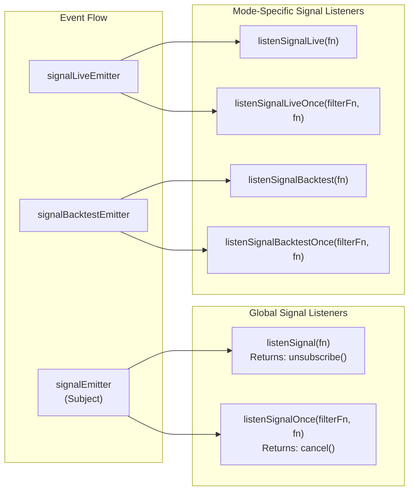
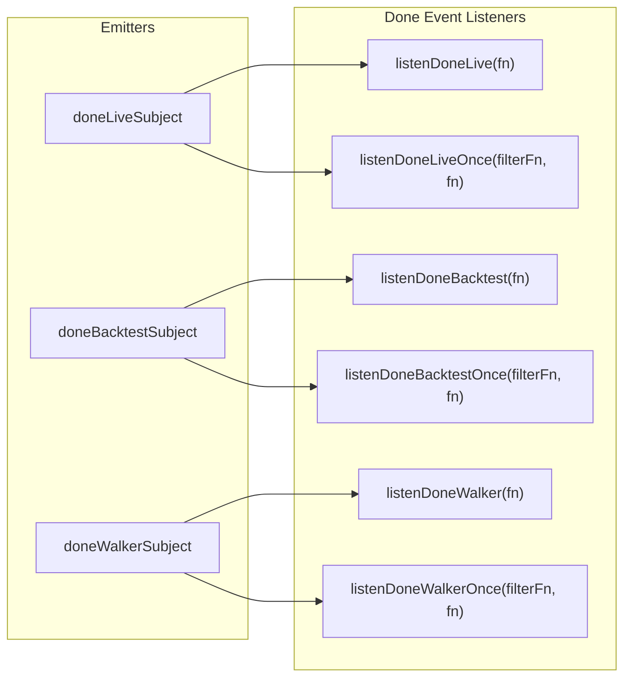
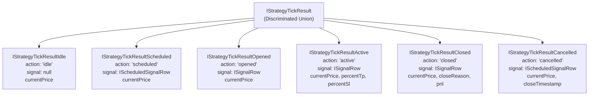
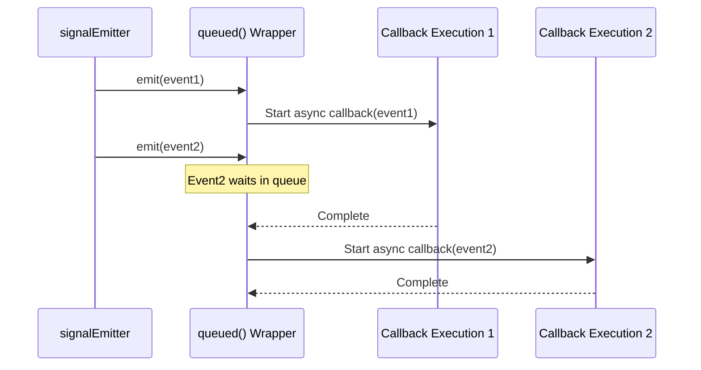
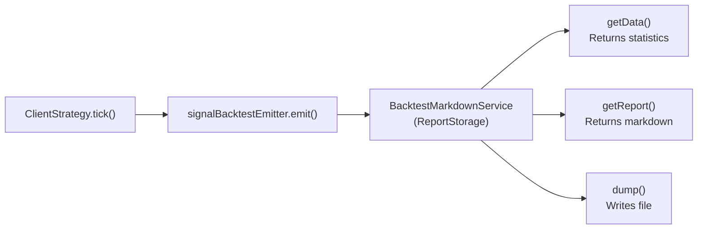

# Event Listeners

## Purpose and Scope

This document provides a complete reference for the event listener system in Backtest Kit. Event listeners enable real-time monitoring of strategy execution, signal lifecycle events, risk violations, and performance metrics. This page covers all available listener functions, event emitters, event contracts, and usage patterns.

For information about generating markdown reports from accumulated events, see [Markdown Reports](./40_reporting-monitoring.md). For statistics calculation models, see [Statistics Models](./40_reporting-monitoring.md).

---

## Event System Architecture

The framework implements a comprehensive event-driven architecture using the Subject pattern from `functools-kit`. Events flow from producers (strategy execution, risk validation, etc.) through emitters to consumers (listener functions). All listener callbacks are wrapped with `queued` to ensure sequential async execution, preventing race conditions.

**Architecture Diagram**

```mermaid
graph TB
    subgraph "Event Producers"
        ClientStrategy["ClientStrategy<br/>(tick/backtest methods)"]
        ClientRisk["ClientRisk<br/>(checkSignal)"]
        ClientPartial["ClientPartial<br/>(profit/loss)"]
        BacktestLogic["BacktestLogicPrivateService"]
        LiveLogic["LiveLogicPrivateService"]
        WalkerLogic["WalkerLogicPrivateService"]
    end
    
    subgraph "Event Emitters (Subject instances)"
        signalEmitter["signalEmitter<br/>(all signals)"]
        signalLiveEmitter["signalLiveEmitter<br/>(live only)"]
        signalBacktestEmitter["signalBacktestEmitter<br/>(backtest only)"]
        errorEmitter["errorEmitter<br/>(recoverable errors)"]
        exitEmitter["exitEmitter<br/>(fatal errors)"]
        doneBacktestSubject["doneBacktestSubject"]
        doneLiveSubject["doneLiveSubject"]
        doneWalkerSubject["doneWalkerSubject"]
        progressBacktestEmitter["progressBacktestEmitter"]
        progressWalkerEmitter["progressWalkerEmitter"]
        performanceEmitter["performanceEmitter"]
        walkerEmitter["walkerEmitter"]
        walkerCompleteSubject["walkerCompleteSubject"]
        riskSubject["riskSubject"]
        partialProfitSubject["partialProfitSubject"]
        partialLossSubject["partialLossSubject"]
    end
    
    subgraph "Listener Functions (Public API)"
        listenSignal["listenSignal()"]
        listenSignalOnce["listenSignalOnce()"]
        listenSignalLive["listenSignalLive()"]
        listenSignalBacktest["listenSignalBacktest()"]
        listenError["listenError()"]
        listenExit["listenExit()"]
        listenDoneBacktest["listenDoneBacktest()"]
        listenDoneLive["listenDoneLive()"]
        listenDoneWalker["listenDoneWalker()"]
        listenBacktestProgress["listenBacktestProgress()"]
        listenPerformance["listenPerformance()"]
        listenWalker["listenWalker()"]
        listenRisk["listenRisk()"]
        listenPartialProfit["listenPartialProfit()"]
        listenPartialLoss["listenPartialLoss()"]
    end
    
    subgraph "Queued Processing"
        queued["functools-kit queued()<br/>Sequential async execution"]
    end
    
    ClientStrategy --> signalEmitter
    ClientStrategy --> signalLiveEmitter
    ClientStrategy --> signalBacktestEmitter
    
    ClientRisk --> riskSubject
    ClientPartial --> partialProfitSubject
    ClientPartial --> partialLossSubject
    
    BacktestLogic --> progressBacktestEmitter
    BacktestLogic --> doneBacktestSubject
    BacktestLogic --> performanceEmitter
    
    LiveLogic --> doneLiveSubject
    LiveLogic --> performanceEmitter
    
    WalkerLogic --> progressWalkerEmitter
    WalkerLogic --> walkerEmitter
    WalkerLogic --> walkerCompleteSubject
    WalkerLogic --> doneWalkerSubject
    
    BacktestLogic --> errorEmitter
    LiveLogic --> errorEmitter
    WalkerLogic --> exitEmitter
    
    signalEmitter --> listenSignal
    signalEmitter --> listenSignalOnce
    signalLiveEmitter --> listenSignalLive
    signalBacktestEmitter --> listenSignalBacktest
    errorEmitter --> listenError
    exitEmitter --> listenExit
    doneBacktestSubject --> listenDoneBacktest
    doneLiveSubject --> listenDoneLive
    doneWalkerSubject --> listenDoneWalker
    progressBacktestEmitter --> listenBacktestProgress
    performanceEmitter --> listenPerformance
    walkerEmitter --> listenWalker
    riskSubject --> listenRisk
    partialProfitSubject --> listenPartialProfit
    partialLossSubject --> listenPartialLoss
    
    listenSignal --> queued
    listenSignalLive --> queued
    listenSignalBacktest --> queued
    listenError --> queued
    listenDoneBacktest --> queued
    listenDoneLive --> queued
    listenBacktestProgress --> queued
    listenPerformance --> queued
    listenWalker --> queued
    listenRisk --> queued
    listenPartialProfit --> queued
    listenPartialLoss --> queued
```



**Sources:** [src/config/emitters.ts:1-133](), [src/function/event.ts:1-400](), [types.d.ts:1-50]()

---

## Event Emitters Reference

All emitters are instances of `Subject` from `functools-kit` and are exported from `src/config/emitters.ts`. Markdown services subscribe to these emitters to accumulate data for report generation.

| Emitter | Type | Purpose | Emitted By |
|---------|------|---------|------------|
| `signalEmitter` | `Subject<IStrategyTickResult>` | All signal events (live + backtest) | ClientStrategy |
| `signalLiveEmitter` | `Subject<IStrategyTickResult>` | Live trading signals only | ClientStrategy |
| `signalBacktestEmitter` | `Subject<IStrategyTickResult>` | Backtest signals only | ClientStrategy |
| `errorEmitter` | `Subject<Error>` | Recoverable errors from background tasks | BacktestLogicPrivateService, LiveLogicPrivateService |
| `exitEmitter` | `Subject<Error>` | Fatal errors requiring termination | WalkerLogicPrivateService |
| `doneLiveSubject` | `Subject<DoneContract>` | Live execution completion | LiveLogicPrivateService |
| `doneBacktestSubject` | `Subject<DoneContract>` | Backtest execution completion | BacktestLogicPrivateService |
| `doneWalkerSubject` | `Subject<DoneContract>` | Walker execution completion | WalkerLogicPrivateService |
| `progressBacktestEmitter` | `Subject<ProgressBacktestContract>` | Backtest progress percentage | BacktestLogicPrivateService |
| `progressWalkerEmitter` | `Subject<ProgressWalkerContract>` | Walker strategy iteration progress | WalkerLogicPrivateService |
| `progressOptimizerEmitter` | `Subject<ProgressOptimizerContract>` | Optimizer execution progress | OptimizerLogicPrivateService |
| `performanceEmitter` | `Subject<PerformanceContract>` | Execution timing metrics | BacktestLogicPrivateService, LiveLogicPrivateService |
| `walkerEmitter` | `Subject<WalkerContract>` | Per-strategy walker results | WalkerLogicPrivateService |
| `walkerCompleteSubject` | `Subject<WalkerCompleteContract>` | Final walker comparison results | WalkerLogicPrivateService |
| `validationSubject` | `Subject<Error>` | Risk validation errors | ClientRisk |
| `partialProfitSubject` | `Subject<PartialProfitContract>` | Profit milestone events (10%, 20%, etc) | ClientPartial |
| `partialLossSubject` | `Subject<PartialLossContract>` | Loss milestone events (10%, 20%, etc) | ClientPartial |
| `riskSubject` | `Subject<RiskContract>` | Signal rejection due to risk limits | ClientRisk |

**Sources:** [src/config/emitters.ts:15-132](), [types.d.ts:1-50]()

---

## Listener Functions Reference

All listener functions are exported from `src/function/event.ts` and accept callbacks wrapped with `queued` for sequential async processing.

**Signal Listeners**



**Completion Listeners**



**Progress and Monitoring Listeners**

| Function | Parameters | Returns | Purpose |
|----------|------------|---------|---------|
| `listenBacktestProgress` | `fn: (event: ProgressBacktestContract) => void` | `unsubscribe: () => void` | Monitor backtest frame completion percentage |
| `listenWalkerProgress` | `fn: (event: ProgressWalkerContract) => void` | `unsubscribe: () => void` | Monitor walker strategy iteration |
| `listenOptimizerProgress` | `fn: (event: ProgressOptimizerContract) => void` | `unsubscribe: () => void` | Monitor optimizer execution |
| `listenPerformance` | `fn: (event: PerformanceContract) => void` | `unsubscribe: () => void` | Track execution timing metrics |
| `listenWalker` | `fn: (event: WalkerContract) => void` | `unsubscribe: () => void` | Receive per-strategy walker results |
| `listenWalkerOnce` | `filterFn, fn` | `cancel: () => void` | One-time walker event with filter |
| `listenWalkerComplete` | `fn: (event: WalkerCompleteContract) => void` | `unsubscribe: () => void` | Final walker comparison results |

**Risk and Partial Listeners**

| Function | Parameters | Returns | Purpose |
|----------|------------|---------|---------|
| `listenRisk` | `fn: (event: RiskContract) => void` | `unsubscribe: () => void` | Signal rejections due to risk limits |
| `listenRiskOnce` | `filterFn, fn` | `cancel: () => void` | One-time risk event with filter |
| `listenPartialProfit` | `fn: (event: PartialProfitContract) => void` | `unsubscribe: () => void` | Profit milestone events |
| `listenPartialProfitOnce` | `filterFn, fn` | `cancel: () => void` | One-time profit event with filter |
| `listenPartialLoss` | `fn: (event: PartialLossContract) => void` | `unsubscribe: () => void` | Loss milestone events |
| `listenPartialLossOnce` | `filterFn, fn` | `cancel: () => void` | One-time loss event with filter |

**Error Listeners**

| Function | Parameters | Returns | Purpose |
|----------|------------|---------|---------|
| `listenError` | `fn: (error: Error) => void` | `unsubscribe: () => void` | Recoverable errors from background tasks |
| `listenExit` | `fn: (error: Error) => void` | `unsubscribe: () => void` | Fatal errors requiring termination |
| `listenValidation` | `fn: (error: Error) => void` | `unsubscribe: () => void` | Risk validation errors |

**Sources:** [src/function/event.ts:45-400](), [types.d.ts:1-50]()

---

## Event Contracts

Event contracts define the structure of data passed to listener callbacks. All contracts are TypeScript interfaces exported from the framework.

**Signal Event Contract**

The `IStrategyTickResult` is a discriminated union representing all signal states:



**DoneContract**

Emitted when background execution completes:

```typescript
interface DoneContract {
  /** Trading pair symbol (e.g., "BTCUSDT") */
  symbol: string;
  /** Strategy name that completed */
  strategyName: string;
  /** Exchange name used */
  exchangeName: string;
  /** Frame name used (empty for live) */
  frameName?: string;
  /** Walker name (if applicable) */
  walkerName?: string;
  /** True if backtest, false if live */
  backtest: boolean;
  /** Unix timestamp in milliseconds when execution completed */
  timestamp: number;
}
```

**ProgressBacktestContract**

Emitted during backtest frame iteration:

```typescript
interface ProgressBacktestContract {
  /** Trading pair symbol */
  symbol: string;
  /** Strategy name */
  strategyName: string;
  /** Completion percentage (0-100) */
  progress: number;
  /** Unix timestamp in milliseconds */
  timestamp: number;
}
```

**WalkerContract**

Emitted after each strategy completes in walker:

```typescript
interface WalkerContract {
  /** Trading pair symbol */
  symbol: string;
  /** Walker name */
  walkerName: string;
  /** Strategy name that just completed */
  strategyName: string;
  /** Backtest statistics for this strategy */
  statistics: BacktestStatisticsModel;
  /** Metric value used for comparison */
  metricValue: number | null;
  /** Current strategy index (0-based) */
  currentIndex: number;
  /** Total number of strategies */
  totalStrategies: number;
  /** Unix timestamp in milliseconds */
  timestamp: number;
}
```

**RiskContract**

Emitted when signal is rejected by risk validation:

```typescript
interface RiskContract {
  /** Trading pair symbol */
  symbol: string;
  /** Strategy name that attempted to open signal */
  strategyName: string;
  /** Exchange name */
  exchangeName: string;
  /** Pending signal that was rejected */
  pendingSignal: ISignalDto;
  /** Number of active positions at rejection time */
  activePositionCount: number;
  /** Rejection reason (from validation note or "N/A") */
  comment: string;
  /** Current VWAP price */
  currentPrice: number;
  /** Unix timestamp in milliseconds */
  timestamp: number;
}
```

**PartialProfitContract and PartialLossContract**

Emitted when signal reaches profit/loss milestones:

```typescript
interface PartialProfitContract {
  /** Trading pair symbol */
  symbol: string;
  /** Signal data */
  signal: ISignalRow;
  /** Current VWAP price */
  currentPrice: number;
  /** Profit percentage reached (10, 20, 30, etc) */
  level: PartialLevel;
  /** True if backtest mode */
  backtest: boolean;
  /** Unix timestamp in milliseconds */
  timestamp: number;
}

interface PartialLossContract {
  /** Trading pair symbol */
  symbol: string;
  /** Signal data */
  signal: ISignalRow;
  /** Current VWAP price */
  currentPrice: number;
  /** Loss percentage reached (10, 20, 30, etc) */
  level: PartialLevel;
  /** True if backtest mode */
  backtest: boolean;
  /** Unix timestamp in milliseconds */
  timestamp: number;
}
```

**PerformanceContract**

Emitted for execution timing metrics:

```typescript
interface PerformanceContract {
  /** Metric type identifier */
  type: PerformanceMetricType;
  /** Trading pair symbol */
  symbol: string;
  /** Strategy name (if applicable) */
  strategyName?: string;
  /** Execution duration in milliseconds */
  duration: number;
  /** Unix timestamp in milliseconds */
  timestamp: number;
}
```

**Sources:** [types.d.ts:765-893](), [src/contract/*.contract.ts:1-100]()

---

## Usage Patterns

**Basic Signal Listening**

```typescript
import { listenSignal, Backtest } from 'backtest-kit';

// Subscribe to all signal events
const unsubscribe = listenSignal((event) => {
  if (event.action === 'opened') {
    console.log('New signal:', event.signal.id);
  } else if (event.action === 'closed') {
    console.log('PNL:', event.pnl.pnlPercentage);
  }
});

// Run backtest
Backtest.background('BTCUSDT', {
  strategyName: 'my-strategy',
  exchangeName: 'binance',
  frameName: '1d-test'
});

// Later: stop listening
unsubscribe();
```

**Filtering with Once Listeners**

```typescript
import { listenSignalOnce } from 'backtest-kit';

// Wait for first take profit hit
listenSignalOnce(
  (event) => event.action === 'closed' && event.closeReason === 'take_profit',
  (event) => {
    console.log('Take profit reached:', event.pnl.pnlPercentage);
    // Automatically unsubscribes after this executes
  }
);
```

**Mode-Specific Listening**

```typescript
import { listenSignalLive, listenSignalBacktest } from 'backtest-kit';

// Only listen to live trading
listenSignalLive((event) => {
  console.log('[LIVE]', event.action);
});

// Only listen to backtesting
listenSignalBacktest((event) => {
  console.log('[BACKTEST]', event.action);
});
```

**Completion Coordination**

```typescript
import { listenDoneBacktest, Backtest } from 'backtest-kit';

listenDoneBacktest(async (event) => {
  console.log('Backtest completed:', event.symbol, event.strategyName);
  
  // Generate report
  await Backtest.dump(event.symbol, event.strategyName);
  
  // Perform cleanup
});

Backtest.background('BTCUSDT', {
  strategyName: 'my-strategy',
  exchangeName: 'binance',
  frameName: '1d-test'
});
```

**Progress Monitoring**

```typescript
import { listenBacktestProgress } from 'backtest-kit';

listenBacktestProgress((event) => {
  console.log(`${event.symbol}: ${event.progress.toFixed(2)}% complete`);
});
```

**Risk Monitoring**

```typescript
import { listenRisk } from 'backtest-kit';

listenRisk((event) => {
  console.error(`Signal rejected for ${event.symbol}:`, event.comment);
  console.log('Active positions:', event.activePositionCount);
});
```

**Partial Profit/Loss Tracking**

```typescript
import { listenPartialProfit, listenPartialLoss } from 'backtest-kit';

listenPartialProfit((event) => {
  console.log(`Profit milestone: ${event.level}% on ${event.symbol}`);
});

listenPartialLoss((event) => {
  console.log(`Loss milestone: -${event.level}% on ${event.symbol}`);
});
```

**Walker Progress**

```typescript
import { listenWalker, listenWalkerComplete } from 'backtest-kit';

listenWalker((event) => {
  console.log(`Tested ${event.strategyName}: Sharpe ${event.statistics.sharpeRatio}`);
});

listenWalkerComplete((event) => {
  console.log('Best strategy:', event.results.bestStrategy);
  console.log('All results:', event.results.strategies);
});
```

**Error Handling**

```typescript
import { listenError, listenExit } from 'backtest-kit';

// Recoverable errors
listenError((error) => {
  console.error('Recoverable error:', error.message);
  // Continue execution
});

// Fatal errors
listenExit((error) => {
  console.error('Fatal error:', error.message);
  process.exit(1);
});
```

**Sources:** [src/function/event.ts:45-400](), [README.md:145-178]()

---

## Queued Processing

All listener callbacks are wrapped with `queued` from `functools-kit` to ensure sequential async execution. This prevents race conditions when multiple events arrive rapidly or when callbacks contain async operations.



**How It Works:**

1. Each listener function wraps the user callback with `queued(async (event) => fn(event))`
2. When an event is emitted, `queued` checks if a callback is currently executing
3. If yes, the event is queued
4. If no, the callback starts immediately
5. Once complete, the next queued event is processed
6. This ensures callbacks execute in order, one at a time

**Example from source:**

[src/function/event.ts:70-73]()
```typescript
export function listenSignal(fn: (event: IStrategyTickResult) => void) {
  backtest.loggerService.log(LISTEN_SIGNAL_METHOD_NAME);
  return signalEmitter.subscribe(queued(async (event) => fn(event)));
}
```

**Sources:** [src/function/event.ts:1-400]()

---

## Subscriber Management

**Unsubscribing**

All listener functions (except "once" variants) return an unsubscribe function:

```typescript
const unsubscribe = listenSignal((event) => {
  console.log(event);
});

// Later: stop listening
unsubscribe();
```

**Once Listeners**

Once listeners execute the callback exactly one time and automatically unsubscribe. They return a cancel function:

```typescript
const cancel = listenSignalOnce(
  (event) => event.action === 'closed',
  (event) => console.log('First closed signal')
);

// Cancel before event fires
cancel();
```

**Filter Predicates**

Once listeners accept a filter predicate to match specific events:

```typescript
listenSignalOnce(
  // Filter: only BTCUSDT stop losses
  (event) => event.action === 'closed' 
    && event.closeReason === 'stop_loss'
    && event.symbol === 'BTCUSDT',
  // Callback: executed once when matched
  (event) => {
    console.log('BTCUSDT hit stop loss');
  }
);
```

**Sources:** [src/function/event.ts:107-113]()

---

## Integration with Markdown Services

Markdown services subscribe to emitters to accumulate event data for report generation. For example, `BacktestMarkdownService` subscribes to `signalBacktestEmitter`:



Each markdown service maintains a `ReportStorage` instance that stores up to 250 events per `symbol:strategyName` key to prevent memory bloat during long-running executions.

**Sources:** [types.d.ts:1-50]()

---

## Best Practices

**1. Always Unsubscribe**

Prevent memory leaks by unsubscribing when listeners are no longer needed:

```typescript
const unsubscribe = listenSignal(callback);

// When done
unsubscribe();
```

**2. Use Mode-Specific Listeners**

Reduce noise by subscribing only to relevant execution modes:

```typescript
// Production: only live events
listenSignalLive(callback);

// Testing: only backtest events
listenSignalBacktest(callback);
```

**3. Use Once Listeners for Coordination**

Wait for specific conditions without manual unsubscription:

```typescript
listenDoneBacktestOnce(
  (event) => event.symbol === 'BTCUSDT',
  async (event) => {
    await generateReport(event.symbol);
  }
);
```

**4. Handle Async Operations Safely**

The `queued` wrapper ensures sequential execution, but still use try-catch:

```typescript
listenSignal(async (event) => {
  try {
    await sendNotification(event);
  } catch (error) {
    console.error('Notification failed:', error);
  }
});
```

**5. Log Errors Appropriately**

Use `listenError` for recoverable errors and `listenExit` for fatal errors:

```typescript
listenError((error) => {
  // Log and continue
  logger.error('Background error:', error);
});

listenExit((error) => {
  // Log and terminate
  logger.fatal('Fatal error:', error);
  process.exit(1);
});
```

**6. Monitor Progress for Long Operations**

Provide user feedback during lengthy backtests or walker comparisons:

```typescript
listenBacktestProgress((event) => {
  console.log(`Progress: ${event.progress.toFixed(0)}%`);
});
```

**7. Use Risk Listeners for Debugging**

Understand why signals are rejected:

```typescript
listenRisk((event) => {
  console.log('Rejection:', event.comment);
  console.log('Signal:', event.pendingSignal);
  console.log('Active positions:', event.activePositionCount);
});
```

**Sources:** [src/function/event.ts:1-400](), [README.md:173-177]()