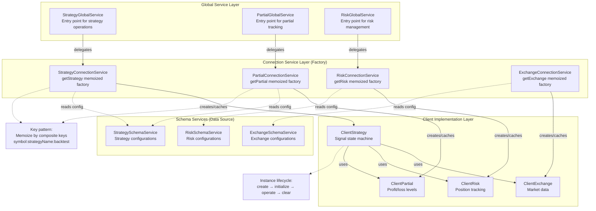
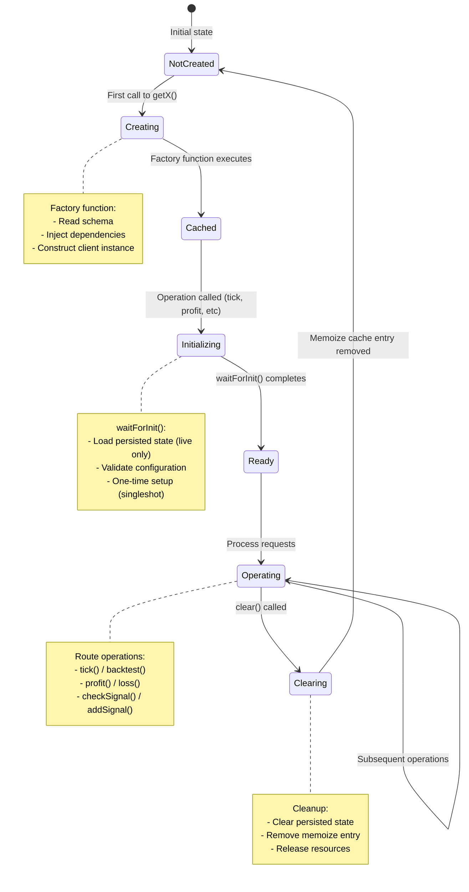
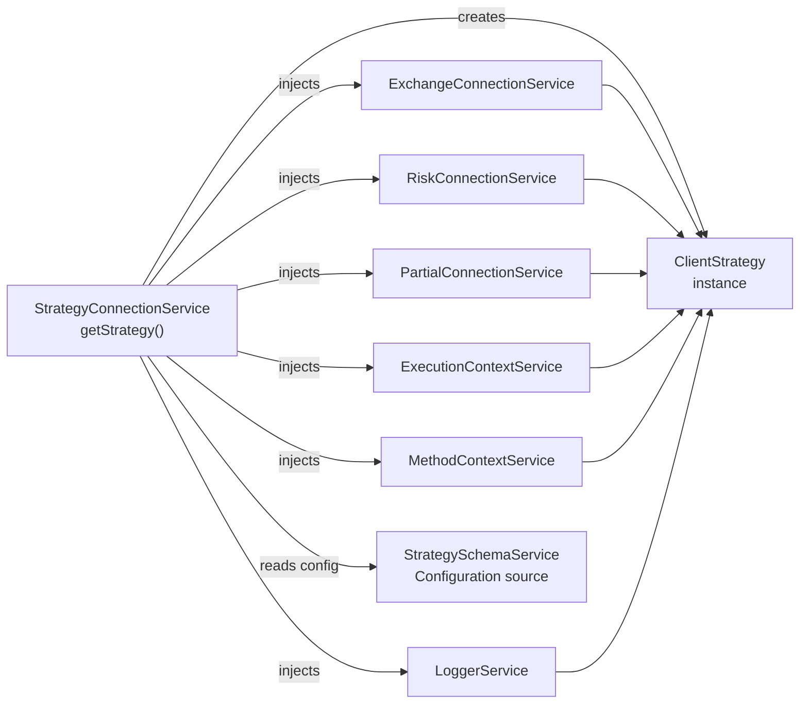
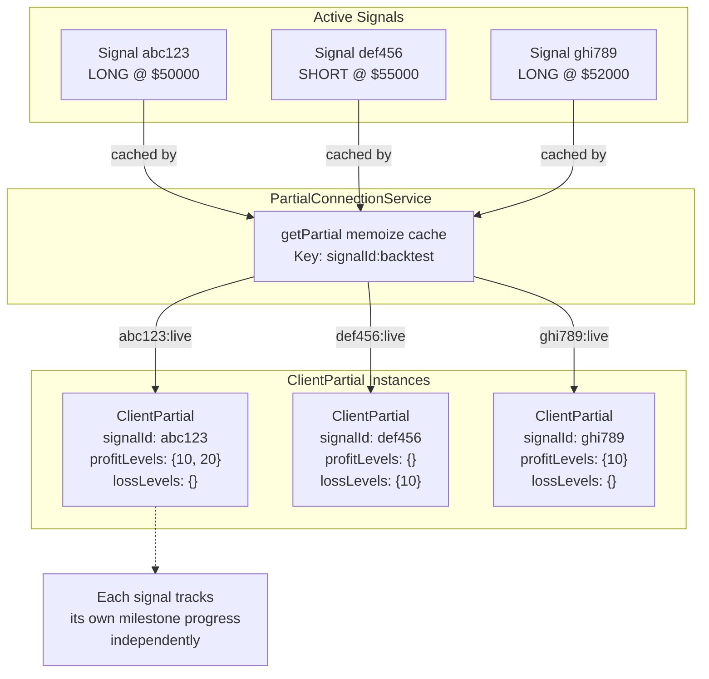
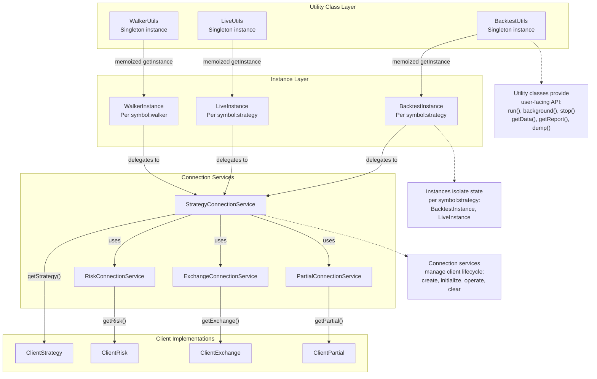

# Connection Services

<details>
<summary>Relevant source files</summary>

The following files were used as context for generating this wiki page:

- [src/classes/Backtest.ts](src/classes/Backtest.ts)
- [src/classes/Live.ts](src/classes/Live.ts)
- [src/classes/Persist.ts](src/classes/Persist.ts)
- [src/classes/Walker.ts](src/classes/Walker.ts)
- [src/client/ClientPartial.ts](src/client/ClientPartial.ts)
- [src/contract/PartialLoss.contract.ts](src/contract/PartialLoss.contract.ts)
- [src/contract/PartialProfit.contract.ts](src/contract/PartialProfit.contract.ts)
- [src/interfaces/Partial.interface.ts](src/interfaces/Partial.interface.ts)
- [src/lib/services/connection/PartialConnectionService.ts](src/lib/services/connection/PartialConnectionService.ts)
- [src/lib/services/connection/StrategyConnectionService.ts](src/lib/services/connection/StrategyConnectionService.ts)
- [src/lib/services/global/PartialGlobalService.ts](src/lib/services/global/PartialGlobalService.ts)

</details>


Connection Services form the factory layer in backtest-kit's service architecture. They create, cache, and manage client implementation instances, routing operations from global services to the appropriate client based on execution context. This layer uses memoization to ensure singleton behavior per unique identifier combination (e.g., `symbol:strategyName:backtest`), preventing duplicate instantiation and maintaining consistent state across the system.

For information about the client implementations that connection services instantiate, see [Client Implementations](#6). For the global services that delegate to connection services, see [Global Services](#7.5).

## Architecture Overview

Connection services sit between the global service layer and client implementations, acting as intelligent routers and instance factories. They inject dependencies into clients and ensure proper initialization before operation execution.



**Sources**: 
- [src/lib/services/connection/StrategyConnectionService.ts:1-325]()
- [src/lib/services/connection/PartialConnectionService.ts:1-267]()

## Factory Pattern Implementation

Connection services implement the factory pattern using `memoize()` from `functools-kit`. The factory function is wrapped with memoization, ensuring that repeated calls with the same parameters return the cached instance rather than creating duplicates.

### Memoization Function Structure

Each connection service defines a private `get*` method that serves as the memoized factory:

```typescript
private getStrategy = memoize<
  (symbol: string, strategyName: StrategyName, backtest: boolean) => ClientStrategy
>(
  // Key generator: converts arguments to unique string
  ([symbol, strategyName, backtest]) => `${symbol}:${strategyName}:${backtest ? "backtest" : "live"}`,
  
  // Factory function: creates new instance
  (symbol: string, strategyName: StrategyName, backtest: boolean) => {
    // Read schema configuration
    const { getSignal, interval, callbacks, riskName, riskList } = 
      this.strategySchemaService.get(strategyName);
    
    // Create client instance with dependencies
    return new ClientStrategy({
      symbol,
      interval,
      strategyName,
      getSignal,
      callbacks,
      execution: this.executionContextService,
      method: this.methodContextService,
      logger: this.loggerService,
      exchange: this.exchangeConnectionService,
      risk: GET_RISK_FN({riskName, riskList}, backtest, this),
      partial: this.partialConnectionService,
    });
  }
);
```

**Key Components**:
1. **Key Generator**: First parameter defines how to create unique cache keys from function arguments
2. **Factory Function**: Second parameter defines how to construct instances when cache miss occurs
3. **Return Type**: Generic type parameter specifies function signature for type safety

**Sources**: [src/lib/services/connection/StrategyConnectionService.ts:123-156]()

### Memoization Keys by Service

Different connection services use different key formats based on their isolation requirements:

| Service | Key Format | Rationale |
|---------|-----------|-----------|
| `StrategyConnectionService` | `symbol:strategyName:backtest` | Strategies are isolated per symbol, name, and execution mode |
| `PartialConnectionService` | `signalId:backtest` | Partial tracking is per signal ID, separate for backtest/live |
| `RiskConnectionService` | `riskName:backtest` | Risk profiles are shared across symbols but separate for backtest/live |
| `ExchangeConnectionService` | `exchangeName:backtest` | Exchanges are shared across symbols but have different behavior in backtest |

The `backtest` flag in keys ensures that live trading and backtesting never share the same client instances, preventing state contamination between execution modes.

**Sources**: 
- [src/lib/services/connection/StrategyConnectionService.ts:123-156]()
- [src/lib/services/connection/PartialConnectionService.ts:132-143]()

## Instance Lifecycle Management

Client instances follow a consistent lifecycle managed by their connection service:



### Initialization Pattern

All client instances use the `singleshot` pattern from `functools-kit` to ensure initialization happens exactly once:

```typescript
public waitForInit = singleshot(
  async (symbol: string, strategyName: string) => await WAIT_FOR_INIT_FN(symbol, strategyName, this)
);
```

Connection services call `waitForInit()` before delegating operations:

```typescript
public async profit(symbol: string, data: ISignalRow, ...) {
  const partial = this.getPartial(data.id, backtest);
  await partial.waitForInit(symbol, data.strategyName);  // Ensure initialization
  return await partial.profit(symbol, data, ...);        // Delegate operation
}
```

This pattern guarantees:
- Initialization code runs exactly once per instance
- Concurrent calls wait for the same initialization promise
- Operations never execute on uninitialized instances

**Sources**: 
- [src/lib/services/connection/PartialConnectionService.ts:159-185]()
- [src/client/ClientPartial.ts:330-332]()

### Cache Clearing

Connection services expose `clear()` methods to remove memoized instances from cache:

```typescript
public clear = async (backtest: boolean, ctx?: { symbol: string; strategyName: StrategyName }) => {
  if (ctx) {
    // Clear specific instance
    const key = `${ctx.symbol}:${ctx.strategyName}:${backtest ? "backtest" : "live"}`;
    this.getStrategy.clear(key);
  } else {
    // Clear all instances
    this.getStrategy.clear();
  }
};
```

Cache clearing is essential for:
- **Resource cleanup**: Releasing memory after backtest completes
- **State reset**: Ensuring fresh instances for new execution runs
- **Testing**: Isolating test cases from each other

**Sources**: [src/lib/services/connection/StrategyConnectionService.ts:303-321]()

## StrategyConnectionService

`StrategyConnectionService` manages the lifecycle of `ClientStrategy` instances, which implement the signal state machine. This is the most complex connection service due to the interdependencies between strategies, exchanges, risks, and partial tracking.

### Dependency Injection

The service injects multiple dependencies into each `ClientStrategy`:



**Injected Dependencies**:
- `execution`: `ExecutionContextService` for temporal isolation (symbol, timestamp, backtest flag)
- `method`: `MethodContextService` for schema selection (strategyName, exchangeName, frameName)
- `logger`: `LoggerService` for logging operations
- `exchange`: `ExchangeConnectionService` for market data (VWAP pricing, candles)
- `risk`: `IRisk` instance (single or merged) for portfolio validation
- `partial`: `PartialConnectionService` for profit/loss milestone tracking

**Sources**: [src/lib/services/connection/StrategyConnectionService.ts:126-155]()

### Risk Merging Logic

Strategies can specify risk management in three ways:
1. Single `riskName`: One risk profile
2. Array `riskList`: Multiple risk profiles
3. Both `riskName` and `riskList`: Primary risk + additional profiles

The connection service uses `GET_RISK_FN` to handle all three cases:

```typescript
const GET_RISK_FN = (dto: { riskName: RiskName; riskList: RiskName[] }, backtest: boolean, self: StrategyConnectionService) => {
  const hasRiskName = !!dto.riskName;
  const hasRiskList = !!dto.riskList?.length;
  
  // No risk management
  if (!hasRiskName && !hasRiskList) {
    return NOOP_RISK;
  }
  
  // Single risk
  if (hasRiskName && !hasRiskList) {
    return self.riskConnectionService.getRisk(dto.riskName, backtest);
  }
  
  // Multiple risks only
  if (!hasRiskName && hasRiskList) {
    return new MergeRisk(dto.riskList.map(riskName => 
      self.riskConnectionService.getRisk(riskName, backtest)
    ));
  }
  
  // Both: merge with riskName first
  return new MergeRisk([
    self.riskConnectionService.getRisk(dto.riskName, backtest),
    ...dto.riskList.map(riskName => self.riskConnectionService.getRisk(riskName, backtest))
  ]);
};
```

`MergeRisk` is a composite risk implementation that validates signals against all child risks sequentially, rejecting if any risk rejects.

**Sources**: [src/lib/services/connection/StrategyConnectionService.ts:33-70]()

### Operation Delegation

The connection service routes strategy operations through a consistent pattern:

1. **Retrieve or create instance**: `this.getStrategy(symbol, strategyName, backtest)`
2. **Ensure initialization**: `await strategy.waitForInit()`
3. **Delegate operation**: `await strategy.tick(...)` or `await strategy.backtest(...)`
4. **Emit events**: Broadcast result to event emitters

```typescript
public async tick(symbol: string, strategyName: StrategyName): Promise<IStrategyTickResult> {
  const backtest = this.executionContextService.context.backtest;
  const strategy = this.getStrategy(symbol, strategyName, backtest);
  await strategy.waitForInit();
  const tick = await strategy.tick(symbol, strategyName);
  
  // Emit to appropriate event streams
  if (this.executionContextService.context.backtest) {
    await signalBacktestEmitter.next(tick);
  }
  if (!this.executionContextService.context.backtest) {
    await signalLiveEmitter.next(tick);
  }
  await signalEmitter.next(tick);
  
  return tick;
}
```

**Sources**: [src/lib/services/connection/StrategyConnectionService.ts:216-238]()

### Utility Methods

Beyond operation delegation, the service provides utility methods for monitoring and control:

| Method | Purpose | Returns |
|--------|---------|---------|
| `getPendingSignal()` | Retrieve currently active signal | `ISignalRow \| null` |
| `getStopped()` | Check if strategy has been stopped | `boolean` |
| `stop()` | Set stop flag to prevent new signals | `void` |
| `clear()` | Remove memoized instance from cache | `void` |

These methods are used by:
- **BacktestUtils/LiveUtils**: For graceful shutdown and status checking
- **WalkerUtils**: To stop strategies during walker interruption
- **Testing utilities**: To reset state between test cases

**Sources**: [src/lib/services/connection/StrategyConnectionService.ts:168-321]()

## PartialConnectionService

`PartialConnectionService` manages `ClientPartial` instances for tracking profit/loss level milestones (10%, 20%, 30%, etc.). Unlike strategy connections which are keyed by `symbol:strategyName`, partial connections are keyed by individual `signalId`.

### Per-Signal Instance Creation

Each signal gets its own `ClientPartial` instance to track its profit/loss milestones:



The per-signal isolation ensures that:
- Profit/loss levels are tracked independently for each position
- Closing one signal doesn't affect others' milestone tracking
- State is properly cleaned up when signals complete

**Sources**: [src/lib/services/connection/PartialConnectionService.ts:132-143]()

### Event Emission Callbacks

The connection service provides callback functions that emit events to RxJS subjects:

```typescript
const COMMIT_PROFIT_FN = async (
  symbol: string,
  strategyName: string,
  exchangeName: string,
  data: ISignalRow,
  currentPrice: number,
  level: PartialLevel,
  backtest: boolean,
  timestamp: number
) => await partialProfitSubject.next({
  symbol,
  strategyName,
  exchangeName,
  data,
  currentPrice,
  level,
  backtest,
  timestamp,
});

const COMMIT_LOSS_FN = async (/* similar parameters */) => 
  await partialLossSubject.next({ /* loss event */ });
```

These callbacks are injected into `ClientPartial` during construction, allowing the client to emit events without direct dependencies on the event system:

```typescript
return new ClientPartial({
  signalId,
  logger: this.loggerService,
  backtest,
  onProfit: COMMIT_PROFIT_FN,
  onLoss: COMMIT_LOSS_FN,
});
```

**Sources**: 
- [src/lib/services/connection/PartialConnectionService.ts:28-83]()
- [src/lib/services/connection/PartialConnectionService.ts:132-143]()

### Operation Delegation Pattern

The connection service delegates profit/loss operations following the standard pattern:

```typescript
public async profit(
  symbol: string,
  data: ISignalRow,
  currentPrice: number,
  revenuePercent: number,
  backtest: boolean,
  when: Date
) {
  this.loggerService.log("partialConnectionService profit", { symbol, data, currentPrice, revenuePercent, backtest, when });
  
  const partial = this.getPartial(data.id, backtest);
  await partial.waitForInit(symbol, data.strategyName);
  
  return await partial.profit(symbol, data, currentPrice, revenuePercent, backtest, when);
}
```

The same pattern applies to `loss()` and `clear()` operations. This consistency makes the connection service layer predictable and easy to understand.

**Sources**: [src/lib/services/connection/PartialConnectionService.ts:159-227]()

### Cleanup on Signal Close

When a signal closes, the connection service clears both the client state and the memoized instance:

```typescript
public async clear(symbol: string, data: ISignalRow, priceClose: number, backtest: boolean) {
  const partial = this.getPartial(data.id, backtest);
  await partial.waitForInit(symbol, data.strategyName);
  
  // Clear client state (removes from _states Map, persists)
  await partial.clear(symbol, data, priceClose, backtest);
  
  // Remove memoized instance to prevent memory leaks
  const key = `${data.id}:${backtest ? "backtest" : "live"}`;
  this.getPartial.clear(key);
}
```

This two-step cleanup ensures:
1. Persisted state is updated (signal removed from disk file)
2. In-memory cache entry is released (prevents memory leaks)

**Sources**: [src/lib/services/connection/PartialConnectionService.ts:246-263]()

## Integration with Utility Classes

Connection services are primarily accessed through utility classes (`Backtest`, `Live`, `Walker`), which provide user-facing APIs. The utility classes follow a consistent pattern:



### Validation Before Delegation

Utility classes validate schemas before delegating to connection services:

```typescript
public run = (symbol: string, context: { strategyName: string; exchangeName: string; frameName: string }) => {
  // Validate schemas exist
  backtest.strategyValidationService.validate(context.strategyName, "BacktestUtils.run");
  backtest.exchangeValidationService.validate(context.exchangeName, "BacktestUtils.run");
  backtest.frameValidationService.validate(context.frameName, "BacktestUtils.run");
  
  // Validate associated risks
  const { riskName, riskList } = backtest.strategySchemaService.get(context.strategyName);
  riskName && backtest.riskValidationService.validate(riskName, "BacktestUtils.run");
  riskList && riskList.forEach((riskName) => backtest.riskValidationService.validate(riskName, "BacktestUtils.run"));
  
  // Get instance and delegate
  const instance = this._getInstance(symbol, context.strategyName);
  return instance.run(symbol, context);
};
```

This validation layer ensures that:
- All required schemas are registered before execution
- Clear error messages identify missing configurations
- Connection services receive only valid schema references

**Sources**: [src/classes/Backtest.ts:378-400]()

### Instance Isolation

Both `BacktestUtils` and `LiveUtils` use their own memoized `getInstance` methods to create isolated instances per `symbol:strategyName` pair:

```typescript
private _getInstance = memoize<
  (symbol: string, strategyName: StrategyName) => BacktestInstance
>(
  ([symbol, strategyName]) => `${symbol}:${strategyName}`,
  (symbol: string, strategyName: StrategyName) => new BacktestInstance(symbol, strategyName)
);
```

This creates a two-level memoization hierarchy:
1. **Utility level**: `BacktestInstance` or `LiveInstance` per `symbol:strategyName`
2. **Connection level**: `ClientStrategy` per `symbol:strategyName:backtest`

The utility instance delegates to the connection service, which delegates to the client. This separation allows utility instances to track execution state (e.g., `_isStopped`, `_isDone`) while connection services manage client instances.

**Sources**: 
- [src/classes/Backtest.ts:364-369]()
- [src/classes/Live.ts:381-386]()

## Connection Service Registry

All connection services are registered in the dependency injection container with unique type symbols:

| Service | TYPES Symbol | Client Type | Memoize Key |
|---------|-------------|-------------|-------------|
| `StrategyConnectionService` | `TYPES.strategyConnectionService` | `ClientStrategy` | `symbol:strategyName:backtest` |
| `ExchangeConnectionService` | `TYPES.exchangeConnectionService` | `ClientExchange` | `exchangeName:backtest` |
| `RiskConnectionService` | `TYPES.riskConnectionService` | `ClientRisk` | `riskName:backtest` |
| `PartialConnectionService` | `TYPES.partialConnectionService` | `ClientPartial` | `signalId:backtest` |
| `FrameConnectionService` | `TYPES.frameConnectionService` | `ClientFrame` | `frameName` |
| `SizingConnectionService` | `TYPES.sizingConnectionService` | `ClientSizing` | `sizingName` |
| `OptimizerConnectionService` | `TYPES.optimizerConnectionService` | `ClientOptimizer` | `optimizerName` |

Services are injected using the `inject<T>(TYPES.*)` pattern:

```typescript
export class StrategyConnectionService {
  public readonly loggerService = inject<LoggerService>(TYPES.loggerService);
  public readonly exchangeConnectionService = inject<ExchangeConnectionService>(TYPES.exchangeConnectionService);
  public readonly riskConnectionService = inject<RiskConnectionService>(TYPES.riskConnectionService);
  public readonly partialConnectionService = inject<PartialConnectionService>(TYPES.partialConnectionService);
  // ...
}
```

**Sources**: [src/lib/services/connection/StrategyConnectionService.ts:93-111]()