# Logic Services

<details>
<summary>Relevant source files</summary>

The following files were used as context for generating this wiki page:

- [assets/uml.svg](assets/uml.svg)
- [docs/internals.md](docs/internals.md)
- [docs/uml.puml](docs/uml.puml)
- [scripts/_convert-md-mermaid-to-svg.cjs](scripts/_convert-md-mermaid-to-svg.cjs)
- [scripts/gpt-docs.mjs](scripts/gpt-docs.mjs)
- [scripts/uml.mjs](scripts/uml.mjs)
- [src/lib/services/logic/private/BacktestLogicPrivateService.ts](src/lib/services/logic/private/BacktestLogicPrivateService.ts)
- [src/lib/services/logic/private/LiveLogicPrivateService.ts](src/lib/services/logic/private/LiveLogicPrivateService.ts)
- [src/lib/services/logic/public/BacktestLogicPublicService.ts](src/lib/services/logic/public/BacktestLogicPublicService.ts)
- [src/lib/services/logic/public/LiveLogicPublicService.ts](src/lib/services/logic/public/LiveLogicPublicService.ts)
- [test/e2e/timing.test.mjs](test/e2e/timing.test.mjs)

</details>


## Purpose and Scope

Logic Services orchestrate the execution of backtest and live trading operations using async generators. They coordinate between Strategy, Exchange, and Frame services while managing execution context propagation. Logic Services form the top layer of the Service Orchestration hierarchy and are the primary entry point for execution flows initiated by the Public API.

For configuration and registration of strategies, exchanges, and frames, see [Configuration Functions](#3.1). For the business logic implementations that Logic Services orchestrate, see [Core Business Logic](#4).

**Sources:** [src/lib/services/logic/private/BacktestLogicPrivateService.ts:1-123](), [src/lib/services/logic/private/LiveLogicPrivateService.ts:1-86](), [Diagram 1: Four-Layer Architecture Overview]()

---

## Architecture Overview

Logic Services follow a two-tier pattern with distinct responsibilities:

| Layer | Classes | Responsibility |
|-------|---------|----------------|
| **Public** | `BacktestLogicPublicService`, `LiveLogicPublicService` | Context propagation, method routing, public API exposure |
| **Private** | `BacktestLogicPrivateService`, `LiveLogicPrivateService` | Core orchestration logic, async generator implementation, service coordination |

### Service Hierarchy Diagram

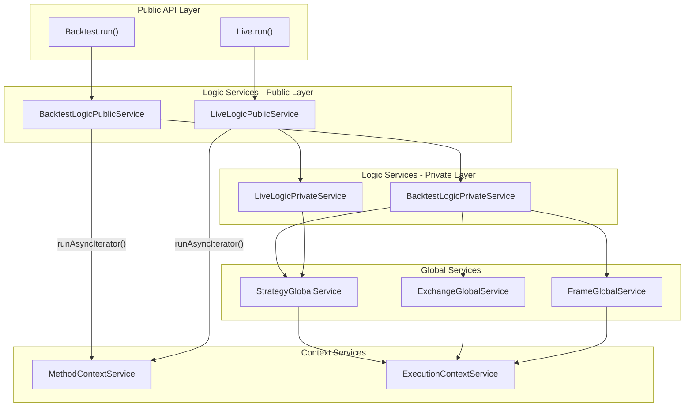

**Sources:** [src/lib/services/logic/public/BacktestLogicPublicService.ts:1-70](), [src/lib/services/logic/public/LiveLogicPublicService.ts:1-78](), [Diagram 1: Four-Layer Architecture Overview]()

---

## Public-Private Separation Pattern

Logic Services use a two-tier pattern to separate context management from execution logic:

### Responsibilities

**Public Services:**
- Wrap private service generators with `MethodContextService.runAsyncIterator()`
- Inject `IMethodContext` containing `strategyName`, `exchangeName`, `frameName`
- Provide the public interface for dependency injection consumers
- Located in [src/lib/services/logic/public/]()

**Private Services:**
- Implement core orchestration logic using async generators
- Coordinate between Global Services
- Manage execution flow (iteration, timing, result streaming)
- Located in [src/lib/services/logic/private/]()

### Context Propagation Flow

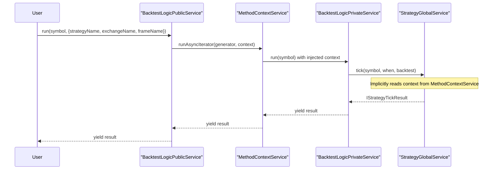

**Sources:** [src/lib/services/logic/public/BacktestLogicPublicService.ts:46-66](), [src/lib/services/context/MethodContextService.ts:1-56](), [Diagram 4: Configuration and Registration System]()

---

## BacktestLogicPrivateService

Core orchestration service for backtest execution using memory-efficient async generators.

### Class Structure

| Property | Type | Purpose |
|----------|------|---------|
| `loggerService` | `LoggerService` | Logs orchestration events (tick results, signal state changes) |
| `strategyGlobalService` | `StrategyGlobalService` | Executes `tick()` and `backtest()` operations |
| `exchangeGlobalService` | `ExchangeGlobalService` | Fetches future candles for fast-forward simulation |
| `frameGlobalService` | `FrameGlobalService` | Retrieves timeframe array for iteration |
| `methodContextService` | `TMethodContextService` | Accesses current execution context for event emission |

### Execution Flow

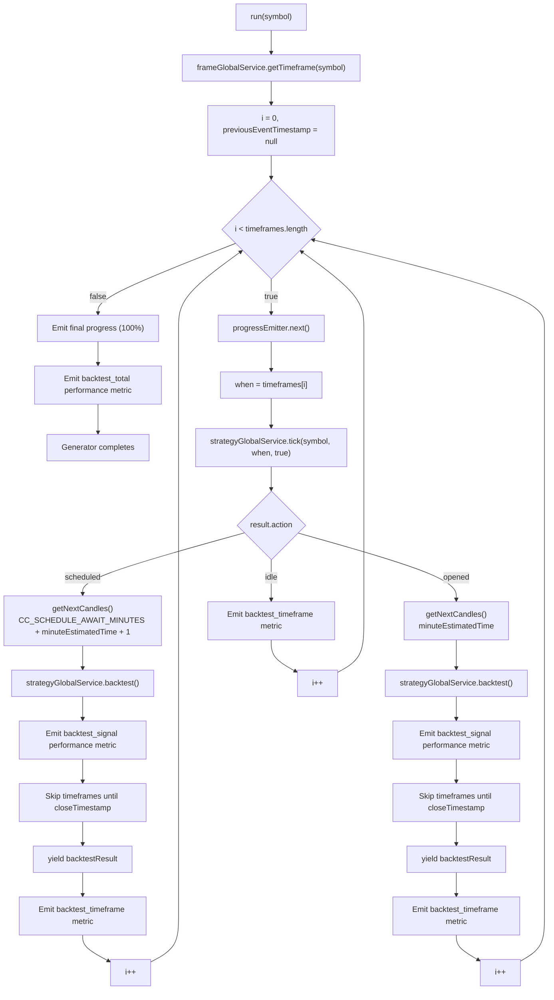

### Key Methods

**`run(symbol: string): AsyncGenerator<IStrategyTickResultClosed>`**

Iterates through historical timeframes, executing strategy ticks and fast-forwarding through opened signals. Handles both immediate and scheduled signals.

- Tracks total execution time from `performance.now()` [src/lib/services/logic/private/BacktestLogicPrivateService.ts:64]()
- Fetches timeframe array from `FrameGlobalService` [src/lib/services/logic/private/BacktestLogicPrivateService.ts:66-69]()
- Emits progress events for each processed timeframe [src/lib/services/logic/private/BacktestLogicPrivateService.ts:79-89]()
- Loops through each timestamp in the timeframe [src/lib/services/logic/private/BacktestLogicPrivateService.ts:75-271]()
- Calls `tick()` for each timestamp to check for signal generation [src/lib/services/logic/private/BacktestLogicPrivateService.ts:91]()
- Emits performance metrics for backtest_total, backtest_timeframe, backtest_signal [src/lib/services/logic/private/BacktestLogicPrivateService.ts:161-172,232-242,256-268,286-298]()
- Emits final 100% progress event on completion [src/lib/services/logic/private/BacktestLogicPrivateService.ts:274-283]()

### Signal Processing Logic

**Scheduled Signal Processing:**

When `action === "scheduled"`, the service handles signals waiting for price activation:

1. **Extended Candle Fetch**: Fetches `CC_SCHEDULE_AWAIT_MINUTES + minuteEstimatedTime + 1` candles to cover both the activation wait period and signal lifetime [src/lib/services/logic/private/BacktestLogicPrivateService.ts:109-119]()
2. **Activation Monitoring**: The `backtest()` method handles detecting if/when `priceOpen` is reached [src/lib/services/logic/private/BacktestLogicPrivateService.ts:138-143]()
3. **Timeout Handling**: If price never reaches `priceOpen` within `CC_SCHEDULE_AWAIT_MINUTES`, signal is cancelled [src/lib/services/logic/private/BacktestLogicPrivateService.ts:112]()
4. **Time Skip**: Advances loop index to skip past the signal's close/cancel timestamp [src/lib/services/logic/private/BacktestLogicPrivateService.ts:175-180]()
5. **Result Yield**: Emits `IStrategyTickResultClosed` or `IStrategyTickResultCancelled` [src/lib/services/logic/private/BacktestLogicPrivateService.ts:182]()

**Opened Signal Processing:**

When `action === "opened"`, the service handles immediately active signals:

1. **Candle Fetch**: Calls `getNextCandles(symbol, "1m", minuteEstimatedTime)` to retrieve future candles [src/lib/services/logic/private/BacktestLogicPrivateService.ts:197-203]()
2. **Fast-Forward**: Calls `backtest(candles)` to simulate signal lifecycle without iterating each timestamp [src/lib/services/logic/private/BacktestLogicPrivateService.ts:216-221]()
3. **Time Skip**: Advances loop index to skip past the signal's close timestamp [src/lib/services/logic/private/BacktestLogicPrivateService.ts:244-250]()
4. **Result Yield**: Emits `IStrategyTickResultClosed` with PnL calculation [src/lib/services/logic/private/BacktestLogicPrivateService.ts:252]()

### Performance Metrics Emission

The service emits granular performance metrics through `performanceEmitter`:

| Metric Type | Emitted When | Data Tracked |
|-------------|--------------|--------------|
| `backtest_timeframe` | After each timeframe iteration | Duration per timeframe tick |
| `backtest_signal` | After each signal closes | Duration from signal open to close |
| `backtest_total` | At generator completion | Total backtest execution time |

Each metric includes `timestamp`, `previousTimestamp`, `strategyName`, `exchangeName`, `symbol`, and `backtest: true` flag [src/lib/services/logic/private/BacktestLogicPrivateService.ts:161-172,232-242,256-268,286-298]().

**Sources:** [src/lib/services/logic/private/BacktestLogicPrivateService.ts:1-303](), [config/emitters.ts]()

---

## LiveLogicPrivateService

Core orchestration service for live trading execution with infinite async generation.

### Class Structure

| Property | Type | Purpose |
|----------|------|---------|
| `loggerService` | `LoggerService` | Logs tick results and signal state changes |
| `strategyGlobalService` | `StrategyGlobalService` | Executes `tick()` to monitor signals in real-time |
| `methodContextService` | `TMethodContextService` | Accesses current execution context for performance metrics |

### Constants

| Constant | Value | Purpose |
|----------|-------|---------|
| `TICK_TTL` | `1 * 60 * 1_000 + 1` | 1 minute + 1ms sleep duration between ticks |

### Execution Flow

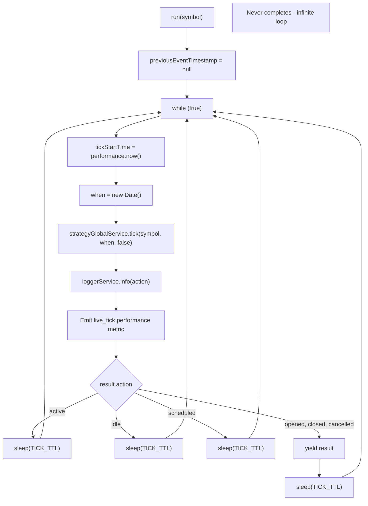

### Key Methods

**`run(symbol: string): AsyncGenerator<IStrategyTickResultOpened | IStrategyTickResultClosed | IStrategyTickResultCancelled>`**

Infinite generator that monitors signal state every minute and yields opened/closed/cancelled events.

- Initializes `previousEventTimestamp` for performance tracking [src/lib/services/logic/private/LiveLogicPrivateService.ts:65]()
- Runs infinite `while(true)` loop for continuous monitoring [src/lib/services/logic/private/LiveLogicPrivateService.ts:67]()
- Tracks tick duration with `performance.now()` [src/lib/services/logic/private/LiveLogicPrivateService.ts:68]()
- Creates real-time date with `new Date()` on each iteration [src/lib/services/logic/private/LiveLogicPrivateService.ts:69]()
- Calls `tick(symbol, when, false)` to check signal status [src/lib/services/logic/private/LiveLogicPrivateService.ts:71]()
- Emits `live_tick` performance metric after each tick [src/lib/services/logic/private/LiveLogicPrivateService.ts:79-91]()
- Filters out `idle`, `active`, and `scheduled` states (does not yield) [src/lib/services/logic/private/LiveLogicPrivateService.ts:93-106]()
- Yields `opened`, `closed`, and `cancelled` results [src/lib/services/logic/private/LiveLogicPrivateService.ts:109]()
- Sleeps for `TICK_TTL` (1 minute + 1ms) between iterations [src/lib/services/logic/private/LiveLogicPrivateService.ts:94,99,104,111]()

### State Filtering Strategy

Live trading filters intermediate states to reduce noise:

| State | Yielded | Reason |
|-------|---------|--------|
| `idle` | No | No active signal - nothing to report [src/lib/services/logic/private/LiveLogicPrivateService.ts:98-101]() |
| `scheduled` | No | Signal awaiting price activation - monitored internally [src/lib/services/logic/private/LiveLogicPrivateService.ts:103-106]() |
| `opened` | **Yes** | New signal created - requires notification [src/lib/services/logic/private/LiveLogicPrivateService.ts:109]() |
| `active` | No | Signal monitoring in progress - no state change [src/lib/services/logic/private/LiveLogicPrivateService.ts:93-96]() |
| `closed` | **Yes** | Signal completed - PnL finalized [src/lib/services/logic/private/LiveLogicPrivateService.ts:109]() |
| `cancelled` | **Yes** | Scheduled signal timeout/SL hit - requires notification [src/lib/services/logic/private/LiveLogicPrivateService.ts:109]() |

### Performance Metrics Emission

The service emits `live_tick` performance metrics through `performanceEmitter` after each tick cycle, tracking the duration of signal status checks. Each metric includes `timestamp`, `previousTimestamp`, `strategyName`, `exchangeName`, `symbol`, and `backtest: false` flag [src/lib/services/logic/private/LiveLogicPrivateService.ts:79-91]().

**Sources:** [src/lib/services/logic/private/LiveLogicPrivateService.ts:1-117](), [config/emitters.ts]()

---

## BacktestLogicPublicService

Public-facing wrapper for `BacktestLogicPrivateService` that manages context propagation.

### Class Structure

| Property | Type | Purpose |
|----------|------|---------|
| `loggerService` | `LoggerService` | Logs public service invocations |
| `backtestLogicPrivateService` | `BacktestLogicPrivateService` | Core orchestration logic |

### Key Methods

**`run(symbol: string, context: {strategyName, exchangeName, frameName}): AsyncGenerator`**

Wraps private service generator with method context injection.

```typescript
// Method signature from source
public run = (
  symbol: string,
  context: {
    strategyName: string;
    exchangeName: string;
    frameName: string;
  }
)
```

**Implementation Pattern:**
1. Logs invocation with context parameters [src/lib/services/logic/public/BacktestLogicPublicService.ts:54-57]()
2. Calls `MethodContextService.runAsyncIterator()` with generator and context [src/lib/services/logic/public/BacktestLogicPublicService.ts:58-65]()
3. Returns wrapped async generator that propagates context to all downstream services

### Context Object Structure

| Field | Type | Description |
|-------|------|-------------|
| `strategyName` | `string` | Identifies which strategy schema to use |
| `exchangeName` | `string` | Identifies which exchange schema to use |
| `frameName` | `string` | Identifies which frame schema to use for timeframe generation |

**Sources:** [src/lib/services/logic/public/BacktestLogicPublicService.ts:1-70](), [src/lib/services/context/MethodContextService.ts:12-19]()

---

## LiveLogicPublicService

Public-facing wrapper for `LiveLogicPrivateService` that manages context propagation.

### Class Structure

| Property | Type | Purpose |
|----------|------|---------|
| `loggerService` | `LoggerService` | Logs public service invocations |
| `liveLogicPrivateService` | `LiveLogicPrivateService` | Core orchestration logic |

### Key Methods

**`run(symbol: string, context: {strategyName, exchangeName}): AsyncGenerator`**

Wraps private service generator with method context injection.

```typescript
// Method signature from source
public run = (
  symbol: string,
  context: {
    strategyName: string;
    exchangeName: string;
  }
)
```

**Implementation Pattern:**
1. Logs invocation with context parameters [src/lib/services/logic/public/LiveLogicPublicService.ts:62-65]()
2. Calls `MethodContextService.runAsyncIterator()` with generator and context [src/lib/services/logic/public/LiveLogicPublicService.ts:66-73]()
3. Returns wrapped async generator that propagates context to all downstream services

### Context Object Structure

| Field | Type | Description |
|-------|------|-------------|
| `strategyName` | `string` | Identifies which strategy schema to use |
| `exchangeName` | `string` | Identifies which exchange schema to use |
| `frameName` | `string` | Empty string for live mode (no frame needed) [src/lib/services/logic/public/LiveLogicPublicService.ts:71]() |

**Sources:** [src/lib/services/logic/public/LiveLogicPublicService.ts:1-78](), [src/lib/services/context/MethodContextService.ts:12-19]()

---

## Async Generator Pattern

Logic Services use async generators (`async function*`) for memory-efficient streaming execution.

### Generator Characteristics

| Aspect | Backtest | Live |
|--------|----------|------|
| **Completion** | Finite (completes when timeframe exhausted) | Infinite (never completes) |
| **Iteration** | Array of historical timestamps | Real-time `new Date()` every minute |
| **Yielded Types** | `IStrategyTickResultClosed \| IStrategyTickResultCancelled` | `IStrategyTickResultOpened \| IStrategyTickResultClosed \| IStrategyTickResultCancelled` |
| **Memory Usage** | O(1) - streams results without accumulation | O(1) - no result accumulation |
| **Early Termination** | Supported via `break` in consumer | Supported via `break` in consumer |
| **Progress Tracking** | `progressEmitter` with percentage completion | `performanceEmitter` with tick duration |
| **Performance Metrics** | `backtest_total`, `backtest_timeframe`, `backtest_signal` | `live_tick` |

### Memory Efficiency Diagram

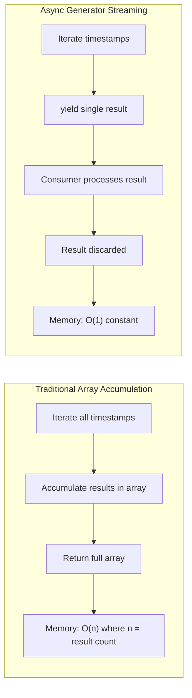

### Consumer Pattern Examples

**Backtest with Early Termination:**
```typescript
// Example from documentation
for await (const result of backtestLogic.run("BTCUSDT")) {
  console.log(result.closeReason, result.pnl.pnlPercentage);
  if (result.pnl.pnlPercentage < -10) break; // Early termination
}
```

**Live with Infinite Loop:**
```typescript
// Example from documentation
for await (const result of liveLogic.run("BTCUSDT")) {
  if (result.action === "opened") {
    console.log("New signal:", result.signal.id);
  }
  if (result.action === "closed") {
    console.log("PNL:", result.pnl.pnlPercentage);
  }
  // Infinite loop - will never complete
}
```

**Sources:** [src/lib/services/logic/private/BacktestLogicPrivateService.ts:59-300](), [src/lib/services/logic/private/LiveLogicPrivateService.ts:60-113]()

---

## Service Dependencies

Logic Services coordinate multiple service types through dependency injection.

### Dependency Injection Registration

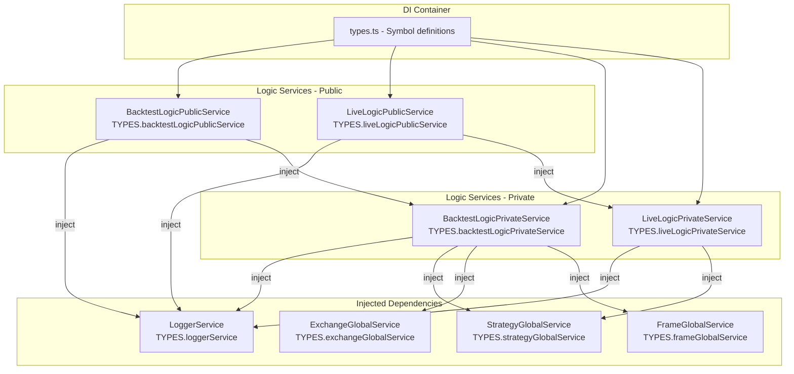

### Injected Dependencies by Service

**BacktestLogicPrivateService:**
- `LoggerService` - Event logging [src/lib/services/logic/private/BacktestLogicPrivateService.ts:23]()
- `StrategyGlobalService` - Signal tick and backtest execution [src/lib/services/logic/private/BacktestLogicPrivateService.ts:24-26]()
- `ExchangeGlobalService` - Future candle fetching [src/lib/services/logic/private/BacktestLogicPrivateService.ts:27-29]()
- `FrameGlobalService` - Timeframe array retrieval [src/lib/services/logic/private/BacktestLogicPrivateService.ts:30-32]()

**LiveLogicPrivateService:**
- `LoggerService` - Event logging [src/lib/services/logic/private/LiveLogicPrivateService.ts:30]()
- `StrategyGlobalService` - Signal tick execution [src/lib/services/logic/private/LiveLogicPrivateService.ts:31-33]()
- `TMethodContextService` - Context access for performance metrics [src/lib/services/logic/private/LiveLogicPrivateService.ts:34-36]()

**BacktestLogicPublicService:**
- `LoggerService` - Invocation logging [src/lib/services/logic/public/BacktestLogicPublicService.ts:32]()
- `BacktestLogicPrivateService` - Orchestration delegation [src/lib/services/logic/public/BacktestLogicPublicService.ts:33-34]()

**LiveLogicPublicService:**
- `LoggerService` - Invocation logging [src/lib/services/logic/public/LiveLogicPublicService.ts:39]()
- `LiveLogicPrivateService` - Orchestration delegation [src/lib/services/logic/public/LiveLogicPublicService.ts:40-42]()

**Sources:** [src/lib/services/logic/private/BacktestLogicPrivateService.ts:31-43](), [src/lib/services/logic/private/LiveLogicPrivateService.ts:30-36](), [src/lib/services/logic/public/BacktestLogicPublicService.ts:32-34](), [src/lib/services/logic/public/LiveLogicPublicService.ts:39-42]()

---

## Context Injection Mechanism

Logic Services use `MethodContextService.runAsyncIterator()` to inject context into async generators.

### MethodContextService Integration

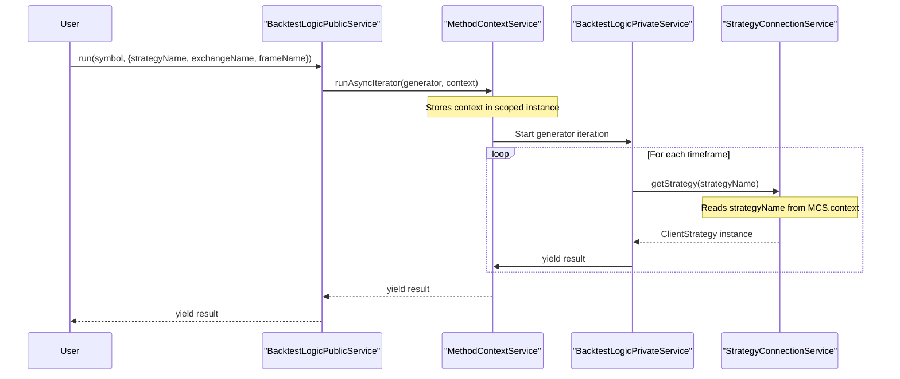

### Context Lifecycle

1. **Context Creation**: Public service receives context object with schema names [src/lib/services/logic/public/BacktestLogicPublicService.ts:48-52]()
2. **Scope Injection**: `MethodContextService.runAsyncIterator()` wraps generator with scoped context [src/lib/services/logic/public/BacktestLogicPublicService.ts:58-65]()
3. **Implicit Propagation**: Connection Services read context without explicit parameters [src/lib/services/context/MethodContextService.ts:41-45]()
4. **Scope Cleanup**: Context destroyed when generator completes or terminates

### IMethodContext Interface

| Field | Type | Purpose |
|-------|------|---------|
| `strategyName` | `StrategyName` | Routes to correct strategy schema |
| `exchangeName` | `ExchangeName` | Routes to correct exchange schema |
| `frameName` | `FrameName` | Routes to correct frame schema (empty for live) |

**Sources:** [src/lib/services/logic/public/BacktestLogicPublicService.ts:46-66](), [src/lib/services/logic/public/LiveLogicPublicService.ts:55-74](), [src/lib/services/context/MethodContextService.ts:1-56](), [Diagram 4: Configuration and Registration System]()

---

## Integration with Global Services

Logic Services delegate business logic execution to Global Services that inject `ExecutionContextService`.

### Service Call Patterns

**BacktestLogicPrivateService calls:**

| Global Service | Method | Purpose | Line Reference |
|----------------|--------|---------|----------------|
| `FrameGlobalService` | `getTimeframe(symbol)` | Retrieve historical timestamp array | [src/lib/services/logic/private/BacktestLogicPrivateService.ts:53]() |
| `StrategyGlobalService` | `tick(symbol, when, true)` | Check for signal generation at timestamp | [src/lib/services/logic/private/BacktestLogicPrivateService.ts:60]() |
| `ExchangeGlobalService` | `getNextCandles(symbol, "1m", limit)` | Fetch future candles for simulation | [src/lib/services/logic/private/BacktestLogicPrivateService.ts:73-79]() |
| `StrategyGlobalService` | `backtest(symbol, candles, when, true)` | Fast-forward simulate signal lifecycle | [src/lib/services/logic/private/BacktestLogicPrivateService.ts:92-97]() |

**LiveLogicPrivateService calls:**

| Global Service | Method | Purpose | Line Reference |
|----------------|--------|---------|----------------|
| `StrategyGlobalService` | `tick(symbol, when, false)` | Monitor signal status in real-time | [src/lib/services/logic/private/LiveLogicPrivateService.ts:61]() |

### Execution Context Injection

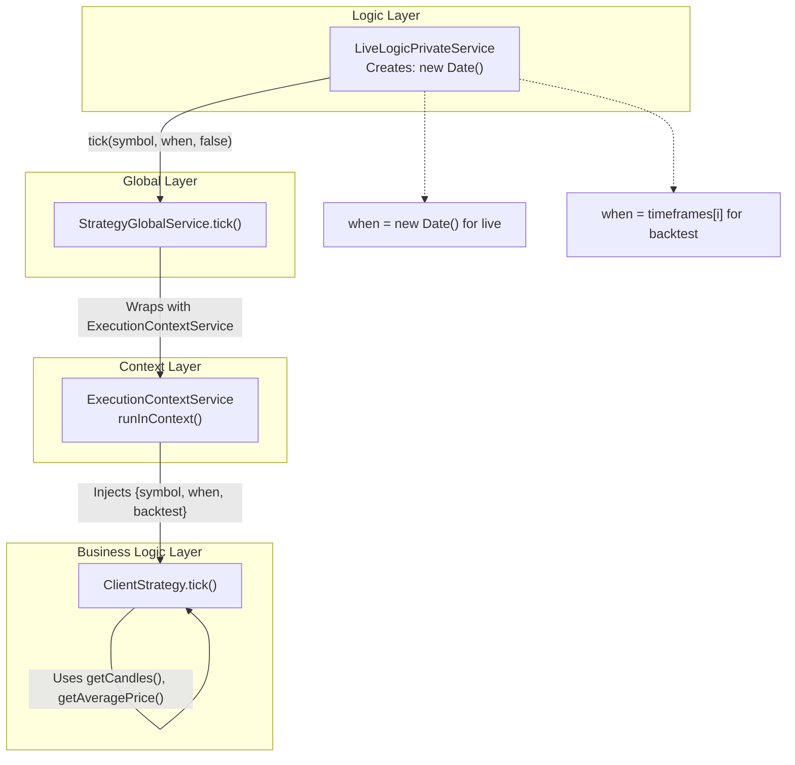

**Sources:** [src/lib/services/logic/private/BacktestLogicPrivateService.ts:91-252](), [src/lib/services/logic/private/LiveLogicPrivateService.ts:71]()

---

## WalkerLogicPrivateService

Core orchestration service for multi-strategy comparison execution.

### Purpose

`WalkerLogicPrivateService` orchestrates the sequential execution of multiple backtest runs to compare strategy performance. It iterates through a list of strategies, executes a full backtest for each, tracks the best-performing strategy, and emits progress updates.

### Class Structure

| Property | Type | Purpose |
|----------|------|---------|
| `loggerService` | `LoggerService` | Logs walker orchestration events |
| `backtestLogicPublicService` | `BacktestLogicPublicService` | Delegates individual backtest execution |
| `backtestMarkdownService` | `BacktestMarkdownService` | Generates reports for each strategy |
| `walkerSchemaService` | `WalkerSchemaService` | Retrieves walker configuration |

### Execution Flow Diagram

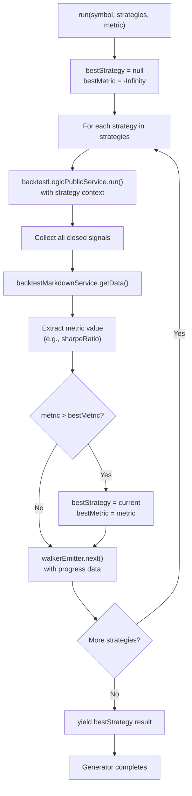

### Key Methods

**`run(symbol: string, strategies: string[], metric: string): AsyncGenerator`**

Executes backtests for all strategies sequentially and identifies the best performer based on the specified metric.

- Iterates through each strategy name in the `strategies` array
- Wraps each backtest with `MethodContextService.runAsyncIterator()` for context injection
- Collects all closed signals from each backtest run
- Extracts the comparison metric (e.g., Sharpe ratio, total PnL) from statistics
- Tracks and updates the best-performing strategy
- Emits walker progress events after each strategy completes
- Yields final comparison results with ranked strategies

### Integration with Backtest Logic

`WalkerLogicPrivateService` delegates to `BacktestLogicPublicService` for individual strategy execution:

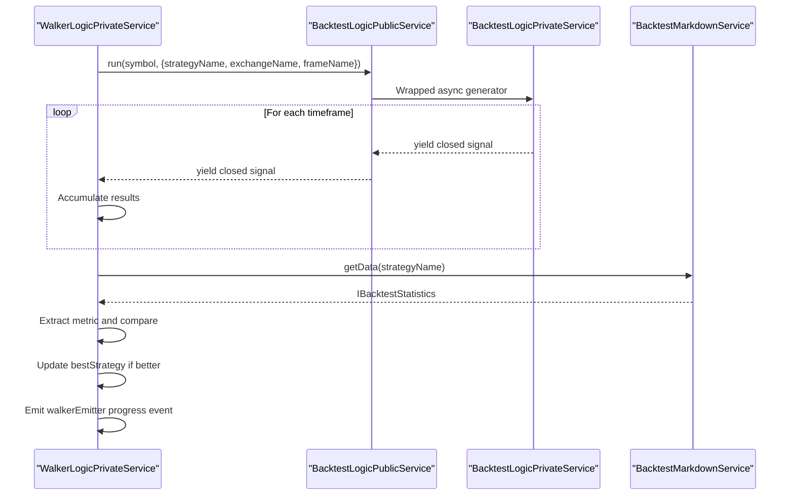

### Metric Comparison

The walker uses a configurable metric for strategy comparison:

| Common Metrics | Description | Optimization Goal |
|----------------|-------------|-------------------|
| `sharpeRatio` | Risk-adjusted return | Maximize |
| `totalPnl` | Total profit/loss | Maximize |
| `winRate` | Percentage of winning trades | Maximize |
| `maxDrawdown` | Largest peak-to-trough decline | Minimize (inverted) |
| `averagePnl` | Mean PnL per trade | Maximize |

The metric name must correspond to a field in `IBacktestStatistics` returned by `BacktestMarkdownService.getData()`.

**Sources:** [docs/internals.md:381-388]() (WalkerLogicPrivateService description), [Diagram 2: Component Lifecycle - Registration to Execution]()

---

## WalkerLogicPublicService

Public-facing wrapper for `WalkerLogicPrivateService` that manages context propagation.

### Class Structure

| Property | Type | Purpose |
|----------|------|---------|
| `loggerService` | `LoggerService` | Logs public walker invocations |
| `walkerLogicPrivateService` | `WalkerLogicPrivateService` | Core walker orchestration logic |
| `walkerSchemaService` | `WalkerSchemaService` | Retrieves walker schema configuration |

### Key Methods

**`run(symbol: string, context: {walkerName, exchangeName, frameName}): AsyncGenerator`**

Wraps private walker generator with method context injection and retrieves strategy list from walker schema.

```typescript
// Conceptual signature
public run = (
  symbol: string,
  context: {
    walkerName: string;
    exchangeName: string;
    frameName: string;
  }
)
```

**Implementation Pattern:**
1. Retrieves walker schema to get strategies list and metric
2. Calls `MethodContextService.runAsyncIterator()` with walker context
3. Delegates to `walkerLogicPrivateService.run(symbol, strategies, metric)`
4. Returns wrapped async generator propagating context to all backtest runs

### Context Object Structure

| Field | Type | Description |
|-------|------|-------------|
| `walkerName` | `string` | Identifies which walker schema to use |
| `exchangeName` | `string` | Exchange for all strategy backtests |
| `frameName` | `string` | Timeframe for all strategy backtests |

**Sources:** [docs/internals.md:374-380]() (WalkerLogicPublicService description)

---

## Usage from Public API

Logic Services are accessed through the `Backtest` and `Live` classes in the Public API layer.

### Call Chain Diagram

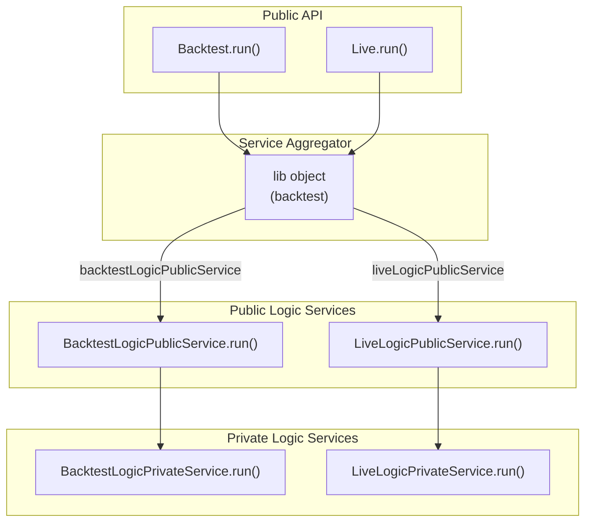

### Type Signatures

**Backtest Entry Point:**
```typescript
// From Backtest class
async *run(
  symbol: string,
  options: {
    strategyName: string;
    exchangeName: string;
    frameName: string;
  }
): AsyncGenerator<IStrategyTickResultClosed>
```

**Live Entry Point:**
```typescript
// From Live class
async *run(
  symbol: string,
  options: {
    strategyName: string;
    exchangeName: string;
  }
): AsyncGenerator<IStrategyTickResultOpened | IStrategyTickResultClosed>
```

**Sources:** [src/index.ts:44-55](), [types.d.ts:1-56](), [Diagram 1: Four-Layer Architecture Overview]()