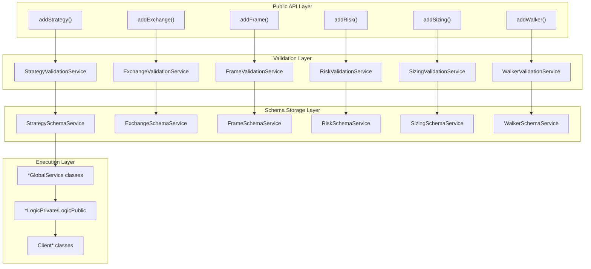
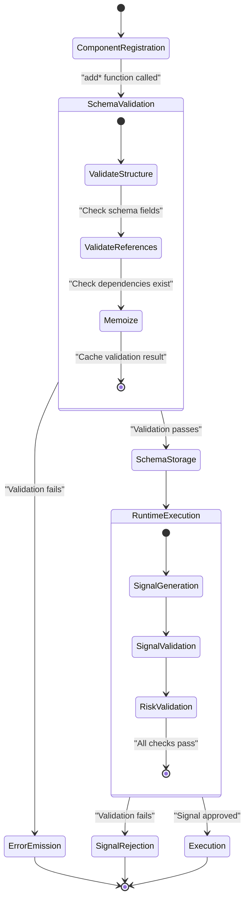
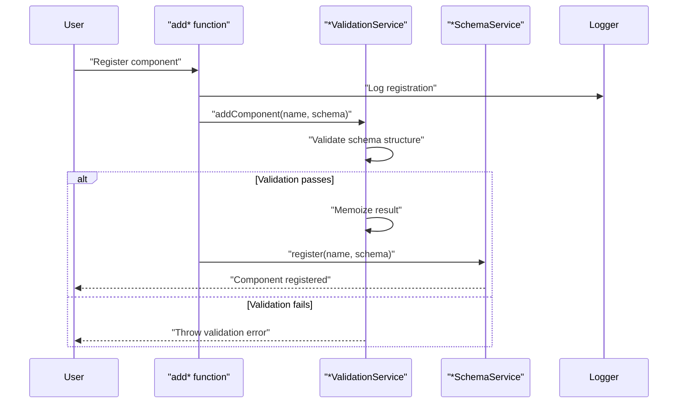
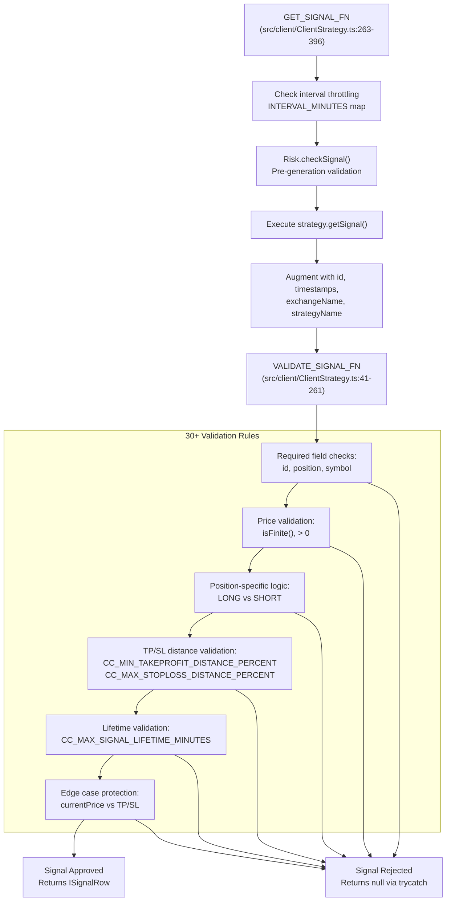
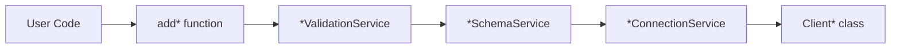

# Validation Services

<details>
<summary>Relevant source files</summary>

The following files were used as context for generating this wiki page:

- [src/client/ClientStrategy.ts](src/client/ClientStrategy.ts)
- [src/interfaces/Strategy.interface.ts](src/interfaces/Strategy.interface.ts)
- [test/e2e/defend.test.mjs](test/e2e/defend.test.mjs)
- [test/e2e/partial.test.mjs](test/e2e/partial.test.mjs)
- [test/index.mjs](test/index.mjs)
- [types.d.ts](types.d.ts)

</details>


## Purpose and Scope

Validation Services provide schema validation and runtime checks for all component types in the framework. These services ensure that components are correctly configured at registration time and that runtime data (signals, prices, risk parameters) meets safety constraints before execution. Validation Services act as gatekeepers between the public API and the execution engine, preventing invalid configurations from causing runtime errors or financial losses.

For information about how validated schemas are stored and retrieved, see [Schema Services](#7.3). For details on how validation results flow into execution, see [Global Services](#7.5).

---

## Architecture Overview

### Validation Services in the DI System



**Sources:** [src/function/add.ts:54-56](), [src/function/add.ts:103-105](), [src/lib/index.ts:143-150](), [src/lib/core/types.ts:59-66]()

### Validation Flow: Registration to Execution



**Sources:** [src/function/add.ts:50-62](), [test/e2e/defend.test.mjs:544-641](), [test/e2e/sanitize.test.mjs:27-131]()

---

## Validation Service Types

The framework provides six validation service classes, one for each component type. All validation services follow a common pattern: they validate schemas at registration time, memoize validation results, and provide a `list()` method for retrieving registered schemas.

### Service Responsibilities Table

| Service Class | Component Type | Primary Responsibilities | DI Symbol |
|--------------|----------------|-------------------------|-----------|
| `StrategyValidationService` | Strategy | Signal generation validation, interval checks, risk/sizing references | `TYPES.strategyValidationService` |
| `ExchangeValidationService` | Exchange | Market data interface validation, formatting function checks | `TYPES.exchangeValidationService` |
| `FrameValidationService` | Frame | Timeframe configuration validation, date range checks | `TYPES.frameValidationService` |
| `RiskValidationService` | Risk | Position limit validation, custom validation function checks | `TYPES.riskValidationService` |
| `SizingValidationService` | Sizing | Position sizing method validation, parameter range checks | `TYPES.sizingValidationService` |
| `WalkerValidationService` | Walker | Strategy comparison validation, metric selection checks | `TYPES.walkerValidationService` |

**Sources:** [src/lib/index.ts:143-150](), [src/lib/core/types.ts:59-66](), [src/lib/core/provide.ts:102-109]()

### Common Service Interface

All validation services implement a consistent interface pattern:

```typescript
interface IValidationService<TSchema> {
  // Store and validate schema
  addComponent(name: string, schema: TSchema): void;
  
  // Retrieve all registered schemas
  list(): Promise<TSchema[]>;
  
  // Internal validation logic (memoized)
  _validateSchema(schema: TSchema): ValidationResult;
}
```

The `addComponent` method (named `addStrategy`, `addExchange`, etc.) is called by the corresponding `add*` functions in the public API. Validation results are memoized to avoid repeated validation of the same schema.

**Sources:** [src/function/add.ts:50-62](), [src/function/list.ts:41-44]()

---

## Schema Validation

### Registration-Time Validation

Schema validation occurs when a component is registered via an `add*` function. The validation flow follows this sequence:



**Sources:** [src/function/add.ts:50-62](), [src/function/add.ts:99-111]()

### Validation Checks by Component Type

Each validation service performs component-specific checks:

#### Strategy Validation
- `strategyName` is non-empty string
- `interval` matches `FrameInterval` enum values
- `getSignal` is an async function
- `riskName` reference exists (if specified)
- `sizingName` reference exists (if specified)
- `callbacks` structure is valid (if specified)

#### Exchange Validation
- `exchangeName` is non-empty string
- `getCandles` is an async function returning candle array
- `formatPrice` is an async function
- `formatQuantity` is an async function
- `callbacks` structure is valid (if specified)

#### Frame Validation
- `frameName` is non-empty string
- `interval` matches `FrameInterval` enum values
- `startDate` is valid Date object
- `endDate` is valid Date object
- `startDate < endDate`
- `callbacks` structure is valid (if specified)

#### Risk Validation
- `riskName` is non-empty string
- `maxConcurrentPositions` is positive integer (if specified)
- `validations` array contains valid functions (if specified)
- `callbacks` structure is valid (if specified)

#### Sizing Validation
- `sizingName` is non-empty string
- `method` is one of: `"fixed-percentage"`, `"kelly-criterion"`, `"atr-based"`
- Method-specific parameters are valid (e.g., `riskPercentage`, `kellyMultiplier`)
- `callbacks` structure is valid (if specified)

#### Walker Validation
- `walkerName` is non-empty string
- `exchangeName` reference exists
- `frameName` reference exists
- `strategies` is non-empty array of strategy names
- All referenced strategies exist
- `metric` is valid metric name (if specified)
- `callbacks` structure is valid (if specified)

**Sources:** [src/function/add.ts:16-62](), [src/function/add.ts:99-111](), [src/function/add.ts:143-149](), [src/function/add.ts:188-199](), [src/function/add.ts:254-265](), [src/function/add.ts:329-340]()

### Memoization Pattern

Validation services use memoization to cache validation results. Once a schema is validated, subsequent calls with the same schema name return the cached result without re-running validation logic. This optimization is critical for performance during execution when validation services may be called frequently.

**Sources:** [src/lib/index.ts:143-150]()

---

## Signal Validation

### VALIDATE_SIGNAL_FN: Runtime Signal Checks

Signal validation occurs at runtime when a strategy generates a signal via `getSignal()`. The validation function `VALIDATE_SIGNAL_FN` in [src/client/ClientStrategy.ts:41-261]() performs comprehensive checks to ensure the signal is financially sound and meets safety constraints.

The function is invoked within `GET_SIGNAL_FN` at [src/client/ClientStrategy.ts:263-396]() after signal creation but before the signal is returned for execution. This ensures that invalid signals are rejected immediately without entering the execution pipeline.

**Runtime Signal Validation Flow**



**Sources:** [src/client/ClientStrategy.ts:41-261](), [src/client/ClientStrategy.ts:263-396](), [test/e2e/defend.test.mjs:25-145](), [test/e2e/sanitize.test.mjs:27-131]()
</thinking>

### Price Validation Checks

The framework validates all price fields to prevent impossible or dangerous trades. These checks occur in `VALIDATE_SIGNAL_FN` at [src/client/ClientStrategy.ts:64-103]():

| Check | Condition | Error Message Location | Purpose |
|-------|-----------|------------------------|---------|
| **Finite Numbers** | `isFinite(currentPrice)`, `isFinite(priceOpen)`, `isFinite(priceTakeProfit)`, `isFinite(priceStopLoss)` | [src/client/ClientStrategy.ts:65-89]() | Prevent NaN or Infinity values that cause calculation explosions |
| **Positive Prices** | `currentPrice > 0`, `priceOpen > 0`, `priceTakeProfit > 0`, `priceStopLoss > 0` | [src/client/ClientStrategy.ts:70-102]() | Prevent negative or zero prices that indicate data corruption |
| **Required Fields** | `id !== ''`, `exchangeName !== ''`, `strategyName !== ''`, `symbol !== ''` | [src/client/ClientStrategy.ts:45-62]() | Ensure signal has all required metadata for tracking |

**Example: NaN Price Rejection**
```typescript
// This signal will be rejected at validation
{
  position: "long",
  priceOpen: NaN,  // Invalid: causes "priceOpen must be a finite number" error
  priceTakeProfit: 43000,
  priceStopLoss: 41000,
  minuteEstimatedTime: 60
}
```

**Sources:** [src/client/ClientStrategy.ts:41-261](), [test/e2e/sanitize.test.mjs:360-452](), [test/e2e/sanitize.test.mjs:464-556](), [test/e2e/sanitize.test.mjs:568-660]()

### Price Validation Checks

The framework validates all price fields to prevent impossible or dangerous trades:

| Check | Condition | Purpose |
|-------|-----------|---------|
| **Positive Prices** | `priceOpen > 0`, `priceTakeProfit > 0`, `priceStopLoss > 0` | Prevent negative or zero prices |
| **Finite Numbers** | `isFinite(priceOpen)`, `isFinite(priceTakeProfit)`, `isFinite(priceStopLoss)` | Prevent NaN or Infinity values |
| **Non-NaN** | `!isNaN(priceOpen)`, `!isNaN(priceTakeProfit)`, `!isNaN(priceStopLoss)` | Prevent calculation explosions |

**Example: Negative Price Rejection**
```typescript
// This signal will be rejected at validation
{
  position: "long",
  priceOpen: -42000,  // Invalid: negative price
  priceTakeProfit: 43000,
  priceStopLoss: 41000,
  minuteEstimatedTime: 60
}
```

**Sources:** [test/e2e/sanitize.test.mjs:360-452](), [test/e2e/sanitize.test.mjs:464-556](), [test/e2e/sanitize.test.mjs:568-660]()

### TP/SL Logic Validation

The framework enforces position-specific logic for Take Profit and Stop Loss prices. These checks occur at [src/client/ClientStrategy.ts:104-222]() and implement different rules for LONG vs SHORT positions:

**LONG Position Logic (src/client/ClientStrategy.ts:105-162):**
- Take Profit must be above entry: `priceTakeProfit > priceOpen` (line 107-109)
- Stop Loss must be below entry: `priceStopLoss < priceOpen` (line 111-114)
- For immediate signals (not scheduled): `currentPrice` must not have already hit TP/SL (line 119-134)

**SHORT Position Logic (src/client/ClientStrategy.ts:165-222):**
- Take Profit must be below entry: `priceTakeProfit < priceOpen` (line 166-169)
- Stop Loss must be above entry: `priceStopLoss > priceOpen` (line 171-174)
- For immediate signals (not scheduled): `currentPrice` must not have already hit TP/SL (line 179-194)

**Edge Case Protection: Immediate TP/SL Hit**

The validation includes critical edge case checks at [src/client/ClientStrategy.ts:119-134]() (LONG) and [src/client/ClientStrategy.ts:179-194]() (SHORT):

```typescript
// LONG edge case check (line 119-134)
if (!isScheduled) {
  // Signal would immediately close at SL
  if (isFinite(currentPrice) && currentPrice < signal.priceStopLoss) {
    errors.push(
      `Long: currentPrice (${currentPrice}) < priceStopLoss (${signal.priceStopLoss}). ` +
      `Signal would be immediately cancelled. This signal is invalid.`
    );
  }
  // Profit opportunity already passed
  if (isFinite(currentPrice) && currentPrice > signal.priceTakeProfit) {
    errors.push(
      `Long: currentPrice (${currentPrice}) > priceTakeProfit (${signal.priceTakeProfit}). ` +
      `Signal is invalid - the profit opportunity has already passed.`
    );
  }
}
```

**Example: Invalid LONG Signal**
```typescript
// This signal will be rejected at validation
{
  position: "long",
  priceOpen: 41000,
  priceTakeProfit: 40000,  // Invalid: TP below priceOpen for LONG
  priceStopLoss: 39000,
  minuteEstimatedTime: 60
}
// Error: "Long: priceTakeProfit (40000) must be > priceOpen (41000)"
```

**Example: Invalid SHORT Signal**
```typescript
// This signal will be rejected at validation
{
  position: "short",
  priceOpen: 43000,
  priceTakeProfit: 44000,  // Invalid: TP above priceOpen for SHORT
  priceStopLoss: 45000,
  minuteEstimatedTime: 60
}
// Error: "Short: priceTakeProfit (44000) must be < priceOpen (43000)"
```

**Sources:** [src/client/ClientStrategy.ts:104-222](), [test/e2e/defend.test.mjs:544-641](), [test/e2e/defend.test.mjs:648-743](), [test/e2e/defend.test.mjs:751-845](), [test/e2e/defend.test.mjs:962-1069]()

### Distance Validation

The framework validates minimum and maximum distances for Take Profit and Stop Loss to ensure trades are profitable after fees and risk is bounded. These checks use `GLOBAL_CONFIG` parameters defined in [types.d.ts:5-72]():

| Parameter | Default Value | Validation Location | Purpose |
|-----------|---------------|---------------------|---------|
| `CC_MIN_TAKEPROFIT_DISTANCE_PERCENT` | 0.3% | [src/client/ClientStrategy.ts:138-148]() (LONG)<br/>[src/client/ClientStrategy.ts:198-208]() (SHORT) | Ensure TP distance covers trading fees (2×0.1% = 0.2%) plus minimum profit margin |
| `CC_MAX_STOPLOSS_DISTANCE_PERCENT` | 20% | [src/client/ClientStrategy.ts:151-161]() (LONG)<br/>[src/client/ClientStrategy.ts:211-221]() (SHORT) | Prevent catastrophic losses (one signal cannot lose >20% of position) |

**LONG Distance Calculation:**
```typescript
// Take Profit distance validation (line 138-148)
const tpDistancePercent = 
  ((signal.priceTakeProfit - signal.priceOpen) / signal.priceOpen) * 100;

if (tpDistancePercent < GLOBAL_CONFIG.CC_MIN_TAKEPROFIT_DISTANCE_PERCENT) {
  errors.push(
    `Long: TakeProfit too close to priceOpen (${tpDistancePercent.toFixed(3)}%). ` +
    `Minimum distance: ${GLOBAL_CONFIG.CC_MIN_TAKEPROFIT_DISTANCE_PERCENT}% to cover trading fees.`
  );
}

// Stop Loss distance validation (line 151-161)
const slDistancePercent = 
  ((signal.priceOpen - signal.priceStopLoss) / signal.priceOpen) * 100;

if (slDistancePercent > GLOBAL_CONFIG.CC_MAX_STOPLOSS_DISTANCE_PERCENT) {
  errors.push(
    `Long: StopLoss too far from priceOpen (${slDistancePercent.toFixed(3)}%). ` +
    `Maximum distance: ${GLOBAL_CONFIG.CC_MAX_STOPLOSS_DISTANCE_PERCENT}% to protect capital.`
  );
}
```

**SHORT Distance Calculation:**
```typescript
// Take Profit distance validation (line 198-208)
const tpDistancePercent = 
  ((signal.priceOpen - signal.priceTakeProfit) / signal.priceOpen) * 100;

// Stop Loss distance validation (line 211-221)
const slDistancePercent = 
  ((signal.priceStopLoss - signal.priceOpen) / signal.priceOpen) * 100;
```

**Example: Micro-Profit Rejection**
```typescript
// This signal will be rejected at validation
{
  position: "long",
  priceOpen: 42000,
  priceTakeProfit: 42010,  // Only 0.024% profit - fees will eat profit
  priceStopLoss: 41000,
  minuteEstimatedTime: 60
}
// Error: "Long: TakeProfit too close to priceOpen (0.024%). 
//         Minimum distance: 0.3% to cover trading fees."
// Net PNL after fees: 0.024% - 0.2% = -0.176% (loss!)
```

**Example: Extreme Stop Loss Rejection**
```typescript
// This signal will be rejected at validation
{
  position: "long",
  priceOpen: 42000,
  priceTakeProfit: 43000,
  priceStopLoss: 20000,  // -52% loss - catastrophic risk!
  minuteEstimatedTime: 60
}
// Error: "Long: StopLoss too far from priceOpen (52.381%). 
//         Maximum distance: 20% to protect capital."
```

**Sources:** [src/client/ClientStrategy.ts:138-161](), [src/client/ClientStrategy.ts:198-221](), [types.d.ts:20-27](), [test/e2e/sanitize.test.mjs:27-131](), [test/e2e/sanitize.test.mjs:143-238]()

### Lifetime Validation

The framework validates signal lifetime to prevent "eternal signals" that block risk limits indefinitely. These checks occur at [src/client/ClientStrategy.ts:224-247]():

| Parameter | Default Value | Validation Location | Purpose |
|-----------|---------------|---------------------|---------|
| `CC_MAX_SIGNAL_LIFETIME_MINUTES` | 1440 (1 day) | [src/client/ClientStrategy.ts:237-246]() | Prevent signals from blocking positions for weeks/months |

**Lifetime Validation Logic:**
```typescript
// Basic checks (line 225-234)
if (signal.minuteEstimatedTime <= 0) {
  errors.push(`minuteEstimatedTime must be positive, got ${signal.minuteEstimatedTime}`);
}
if (!Number.isInteger(signal.minuteEstimatedTime)) {
  errors.push(`minuteEstimatedTime must be an integer (whole number), got ${signal.minuteEstimatedTime}`);
}

// Maximum lifetime check (line 237-246)
if (GLOBAL_CONFIG.CC_MAX_SIGNAL_LIFETIME_MINUTES) {
  if (signal.minuteEstimatedTime > GLOBAL_CONFIG.CC_MAX_SIGNAL_LIFETIME_MINUTES) {
    const days = (signal.minuteEstimatedTime / 60 / 24).toFixed(1);
    const maxDays = (GLOBAL_CONFIG.CC_MAX_SIGNAL_LIFETIME_MINUTES / 60 / 24).toFixed(0);
    errors.push(
      `minuteEstimatedTime too large (${signal.minuteEstimatedTime} minutes = ${days} days). ` +
      `Maximum: ${GLOBAL_CONFIG.CC_MAX_SIGNAL_LIFETIME_MINUTES} minutes (${maxDays} days) to prevent strategy deadlock. ` +
      `Eternal signals block risk limits and prevent new trades.`
    );
  }
}
```

**Example: Excessive Lifetime Rejection**
```typescript
// This signal will be rejected at validation
{
  position: "long",
  priceOpen: 42000,
  priceTakeProfit: 43000,
  priceStopLoss: 41000,
  minuteEstimatedTime: 50000  // >34 days - strategy deadlock risk!
}
// Error: "minuteEstimatedTime too large (50000 minutes = 34.7 days). 
//         Maximum: 1440 minutes (1 days) to prevent strategy deadlock. 
//         Eternal signals block risk limits and prevent new trades."
```

**Sources:** [src/client/ClientStrategy.ts:224-247](), [types.d.ts:29-32](), [test/e2e/sanitize.test.mjs:250-348]()

---

## Global Configuration Parameters

Validation behavior is controlled by global configuration parameters that can be modified at runtime using `setConfig()`:

### Configuration Parameters Table

| Parameter | Type | Default | Type Definition | Description |
|-----------|------|---------|-----------------|-------------|
| `CC_MIN_TAKEPROFIT_DISTANCE_PERCENT` | `number` | 0.3 | [types.d.ts:20-22]() | Minimum TP distance from `priceOpen` (percentage). Must be greater than trading fees (2×0.1% = 0.2%) to ensure profitable trades. |
| `CC_MAX_STOPLOSS_DISTANCE_PERCENT` | `number` | 20 | [types.d.ts:23-27]() | Maximum SL distance from `priceOpen` (percentage). Prevents catastrophic losses from extreme StopLoss values. One signal cannot lose more than 20% of position. |
| `CC_MAX_SIGNAL_LIFETIME_MINUTES` | `number` | 1440 | [types.d.ts:29-32]() | Maximum signal lifetime in minutes. Prevents eternal signals that block risk limits for weeks/months. Default: 1440 minutes = 1 day. |
| `CC_SCHEDULE_AWAIT_MINUTES` | `number` | 120 | [types.d.ts:7-10]() | Time to wait for scheduled signal to activate (in minutes). Scheduled signals that don't reach `priceOpen` within this time are cancelled. |
| `CC_AVG_PRICE_CANDLES_COUNT` | `number` | 5 | [types.d.ts:12-14]() | Number of candles to use for average price calculation (VWAP). Default: 5 candles = last 5 minutes when using 1m interval. |
| `CC_GET_CANDLES_RETRY_COUNT` | `number` | 3 | [types.d.ts:35-37]() | Number of retries for `getCandles()` function when exchange API fails. |
| `CC_GET_CANDLES_RETRY_DELAY_MS` | `number` | 5000 | [types.d.ts:38-42]() | Delay between retries for `getCandles()` function in milliseconds. Default: 5000ms = 5 seconds. |

**Example: Customizing Validation Parameters**
```typescript
import { setConfig } from "backtest-kit";

// Stricter validation for high-leverage trading
setConfig({
  CC_MIN_TAKEPROFIT_DISTANCE_PERCENT: 0.5,   // Require 0.5% minimum TP
  CC_MAX_STOPLOSS_DISTANCE_PERCENT: 10,      // Limit SL to 10% max (tighter risk)
  CC_MAX_SIGNAL_LIFETIME_MINUTES: 720,       // Limit signals to 12 hours
  CC_SCHEDULE_AWAIT_MINUTES: 60,             // Cancel scheduled signals after 1 hour
});
```

The `setConfig()` function is defined in the public API and updates `GLOBAL_CONFIG` values. These parameters are then accessed by `VALIDATE_SIGNAL_FN` during signal validation at [src/client/ClientStrategy.ts:138](), [src/client/ClientStrategy.ts:151](), [src/client/ClientStrategy.ts:237]().

**Sources:** [types.d.ts:5-72](), [src/client/ClientStrategy.ts:138-161](), [src/client/ClientStrategy.ts:198-221](), [src/client/ClientStrategy.ts:237-246](), [test/config/setup.mjs:36-41]()

---

## Common Patterns

### Pattern 1: Validation at Registration

All `add*` functions follow the same pattern:
1. Log the registration attempt
2. Call the validation service's `addComponent` method
3. Call the schema service's `register` method

```typescript
// Pattern from src/function/add.ts:50-62
export function addStrategy(strategySchema: IStrategySchema) {
  backtest.loggerService.info(ADD_STRATEGY_METHOD_NAME, {
    strategySchema,
  });
  backtest.strategyValidationService.addStrategy(
    strategySchema.strategyName,
    strategySchema
  );
  backtest.strategySchemaService.register(
    strategySchema.strategyName,
    strategySchema
  );
}
```

This two-phase approach ensures that invalid schemas are rejected before being stored, preventing runtime errors later in the execution pipeline.

**Sources:** [src/function/add.ts:50-62](), [src/function/add.ts:99-111](), [src/function/add.ts:143-149]()

### Pattern 2: Validation Result Memoization

Validation services memoize validation results to avoid redundant checks. Once a schema is validated, subsequent references to the same component name use the cached validation result. This is critical for performance during execution when components may be referenced hundreds or thousands of times.

**Sources:** [src/lib/index.ts:143-150]()

### Pattern 3: Listing Registered Schemas

All validation services provide a `list()` method that returns an array of all registered schemas. This is used for debugging, documentation generation, and building dynamic UIs:

```typescript
// Pattern from src/function/list.ts:41-44
export async function listExchanges(): Promise<IExchangeSchema[]> {
  backtest.loggerService.log(LIST_EXCHANGES_METHOD_NAME);
  return await backtest.exchangeValidationService.list();
}
```

**Sources:** [src/function/list.ts:41-44](), [src/function/list.ts:76-79](), [src/function/list.ts:106-109]()

### Pattern 4: Reference Validation

Some validation services check that referenced components exist. For example, `WalkerValidationService` validates that all strategy names in the `strategies` array exist, and that the `exchangeName` and `frameName` references are valid.

This cross-component validation ensures that the execution engine never attempts to use non-existent components, preventing runtime errors.

**Sources:** [src/function/add.ts:188-199]()

---

## Error Handling

### Validation Errors

When validation fails, the validation service throws an error immediately. This error propagates back to the caller (typically the `add*` function), which then propagates to the user. Validation errors are synchronous and deterministic - they occur at registration time, not at execution time.

**Example Error Scenarios:**

1. **Invalid Schema Structure:** Missing required fields or invalid types
2. **Reference Errors:** Referenced components don't exist (e.g., `riskName` not registered)
3. **Constraint Violations:** Values outside valid ranges (e.g., negative `maxConcurrentPositions`)
4. **Runtime Signal Validation:** Invalid signal prices, TP/SL logic, or lifetime

**Sources:** [test/e2e/defend.test.mjs:544-641](), [test/e2e/sanitize.test.mjs:110-130]()

### Signal Rejection vs. Validation Errors

It's important to distinguish between two types of validation failures:

| Type | Timing | Behavior | Implementation | Example |
|------|--------|----------|----------------|---------|
| **Schema Validation Error** | Registration time | Throws exception, prevents component registration | Direct throw in `add*` functions | Missing `strategyName` field |
| **Signal Rejection** | Runtime (during execution) | Returns `null`, wrapped in `trycatch()` | [src/client/ClientStrategy.ts:263-396]() | TP/SL distances too close |

**Signal Rejection Flow:**

Signal rejections use `trycatch()` from `functools-kit` at [src/client/ClientStrategy.ts:263]() to catch validation errors:

```typescript
const GET_SIGNAL_FN = trycatch(
  async (self: ClientStrategy): Promise<ISignalRow | IScheduledSignalRow | null> => {
    // ... signal generation and validation ...
    VALIDATE_SIGNAL_FN(signalRow, currentPrice, false);
    return signalRow;
  },
  {
    defaultValue: null,  // Return null on validation failure
    fallback: (error) => {
      backtest.loggerService.warn("ClientStrategy exception thrown", {
        error: errorData(error),
        message: getErrorMessage(error),
      });
      errorEmitter.next(error);  // Emit to errorEmitter for monitoring
    },
  }
);
```

This pattern ensures that:
1. Invalid signals return `null` instead of throwing exceptions
2. Validation errors are logged via `LoggerService`
3. Error events are emitted to `errorEmitter` for external monitoring
4. Execution continues normally (strategy remains in `idle` state)

Schema validation errors, in contrast, throw immediately at registration time and prevent the component from being stored in the schema service.

**Sources:** [src/client/ClientStrategy.ts:263-396](), [src/client/ClientStrategy.ts:387-395](), [test/e2e/defend.test.mjs:25-145](), [test/e2e/sanitize.test.mjs:110-130]()

---

## Integration with Other Services

### Validation → Schema Storage Flow



After a schema passes validation:
1. It's stored in the corresponding `*SchemaService` (see [Schema Services](#7.3))
2. During execution, `*ConnectionService` retrieves it (see [Connection Services](#7.2))
3. `*ConnectionService` creates a memoized `Client*` instance
4. The `Client*` instance uses the validated schema for all operations

This ensures that only validated schemas reach the execution engine.

**Sources:** [src/function/add.ts:50-62](), [src/lib/index.ts:80-91](), [src/lib/index.ts:143-150]()

### Validation Service DI Bindings

All validation services are registered in the DI container as singletons:

```typescript
// From src/lib/core/provide.ts:102-109
{
    provide(TYPES.exchangeValidationService, () => new ExchangeValidationService());
    provide(TYPES.strategyValidationService, () => new StrategyValidationService());
    provide(TYPES.frameValidationService, () => new FrameValidationService());
    provide(TYPES.walkerValidationService, () => new WalkerValidationService());
    provide(TYPES.sizingValidationService, () => new SizingValidationService());
    provide(TYPES.riskValidationService, () => new RiskValidationService());
}
```

The singleton pattern ensures that validation results and registered schemas are shared across the entire application lifecycle.

**Sources:** [src/lib/core/provide.ts:102-109](), [src/lib/core/types.ts:59-66](), [src/lib/index.ts:143-150]()