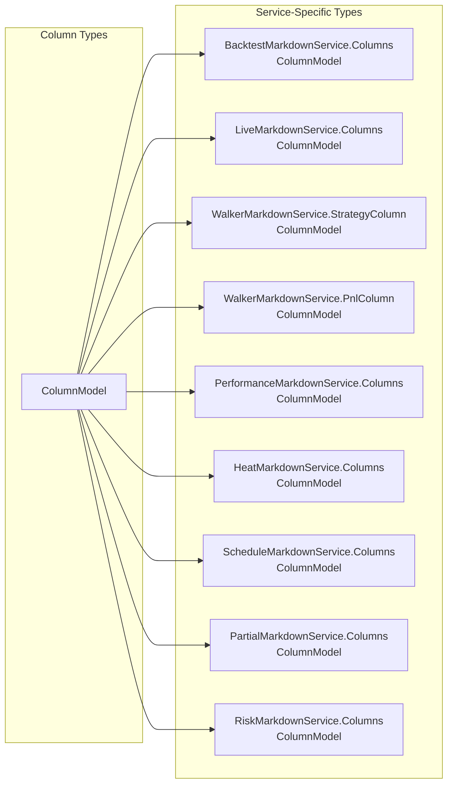

# Markdown Reports

This page covers the markdown report generation system in Backtest Kit. The framework provides eight specialized markdown services that accumulate event data, calculate statistics, and generate formatted reports. Each service exposes three methods: `getData()` for raw statistics, `getReport()` for markdown-formatted strings, and `dump()` for saving reports to disk.

For information about subscribing to the real-time events that feed these reports, see [Event Listeners](./40_reporting-monitoring.md). For details about the statistical models and their calculated metrics, see [Statistics Models](./40_reporting-monitoring.md).

## Overview of Markdown Services

The framework provides eight markdown service classes that follow a consistent architecture:

| Service | Purpose | Event Source | Storage Key |
|---------|---------|--------------|-------------|
| `BacktestMarkdownService` | Closed backtest signals with PNL | `signalBacktestEmitter` | `${symbol}:${strategyName}` |
| `LiveMarkdownService` | All live events (idle, opened, active, closed) | `signalLiveEmitter` | `${symbol}:${strategyName}` |
| `WalkerMarkdownService` | Strategy comparison results | `walkerEmitter` | `${walkerName}` |
| `PerformanceMarkdownService` | Execution timing metrics | `performanceEmitter` | `${symbol}:${strategyName}` |
| `HeatMarkdownService` | Portfolio-wide symbol aggregation | `signalEmitter` | `${strategyName}` |
| `ScheduleMarkdownService` | Scheduled signal lifecycle | `signalEmitter` | `${symbol}:${strategyName}` |
| `PartialMarkdownService` | Partial profit/loss milestones | `partialProfitSubject`, `partialLossSubject` | `${symbol}:${strategyName}` |
| `RiskMarkdownService` | Risk rejection events | `riskSubject` | `${symbol}:${strategyName}` |

All services automatically subscribe to their respective emitters during initialization using the `singleshot` pattern to ensure one-time subscription.

Sources: [src/lib/services/markdown/BacktestMarkdownService.ts:1-464](), [src/lib/services/markdown/LiveMarkdownService.ts:1-612](), [src/lib/services/markdown/WalkerMarkdownService.ts:1-606]()

## Service Architecture and Data Flow

```mermaid
graph TB
    subgraph "Event Layer"
        SigBT["signalBacktestEmitter"]
        SigLive["signalLiveEmitter"]
        WalkEm["walkerEmitter"]
        PerfEm["performanceEmitter"]
        SigGlobal["signalEmitter"]
        RiskEm["riskSubject"]
        PartProfit["partialProfitSubject"]
        PartLoss["partialLossSubject"]
    end
    
    subgraph "Markdown Service Layer"
        BTMD["BacktestMarkdownService"]
        LiveMD["LiveMarkdownService"]
        WalkMD["WalkerMarkdownService"]
        PerfMD["PerformanceMarkdownService"]
        HeatMD["HeatMarkdownService"]
        SchedMD["ScheduleMarkdownService"]
        PartMD["PartialMarkdownService"]
        RiskMD["RiskMarkdownService"]
    end
    
    subgraph "Storage Layer"
        BTStore["ReportStorage<br/>memoize by symbol:strategy"]
        LiveStore["ReportStorage<br/>memoize by symbol:strategy"]
        WalkStore["ReportStorage<br/>memoize by walkerName"]
        PerfStore["PerformanceStorage<br/>memoize by symbol:strategy"]
        HeatStore["HeatmapStorage<br/>memoize by strategyName"]
        SchedStore["ReportStorage<br/>memoize by symbol:strategy"]
        PartStore["ReportStorage<br/>memoize by symbol:strategy"]
        RiskStore["ReportStorage<br/>memoize by symbol:strategy"]
    end
    
    subgraph "Public API"
        BacktestAPI["Backtest.getData/getReport/dump"]
        LiveAPI["Live.getData/getReport/dump"]
        WalkerAPI["Walker.getData/getReport/dump"]
        PerfAPI["Performance.getData/getReport/dump"]
        HeatAPI["Heat.getData/getReport/dump"]
        SchedAPI["Schedule.getData/getReport/dump"]
        PartAPI["Partial.getData/getReport/dump"]
        RiskAPI["Risk.getData/getReport/dump"]
    end
    
    SigBT --> BTMD
    SigLive --> LiveMD
    WalkEm --> WalkMD
    PerfEm --> PerfMD
    SigGlobal --> HeatMD
    SigGlobal --> SchedMD
    RiskEm --> RiskMD
    PartProfit --> PartMD
    PartLoss --> PartMD
    
    BTMD --> BTStore
    LiveMD --> LiveStore
    WalkMD --> WalkStore
    PerfMD --> PerfStore
    HeatMD --> HeatStore
    SchedMD --> SchedStore
    PartMD --> PartStore
    RiskMD --> RiskStore
    
    BTStore --> BacktestAPI
    LiveStore --> LiveAPI
    WalkStore --> WalkerAPI
    PerfStore --> PerfAPI
    HeatStore --> HeatAPI
    SchedStore --> SchedAPI
    PartStore --> PartAPI
    RiskStore --> RiskAPI
```



Sources: [src/lib/services/markdown/BacktestMarkdownService.ts:282-461](), [src/classes/Backtest.ts:1-601](), [src/classes/Live.ts:1-614]()

## Common API Pattern

Every markdown service exposes three methods via public API classes (Backtest, Live, Walker, Performance, Heat, Schedule, Partial, Risk):

### getData()

Returns raw statistical data as a typed model object without formatting:

```typescript
// Returns BacktestStatisticsModel
const stats = await Backtest.getData("BTCUSDT", "my-strategy");
console.log(stats.sharpeRatio, stats.winRate, stats.totalPnl);

// Returns LiveStatisticsModel
const liveStats = await Live.getData("BTCUSDT", "my-strategy");
console.log(liveStats.totalEvents, liveStats.eventList);

// Returns WalkerStatisticsModel
const walkerData = await Walker.getData("BTCUSDT", "my-walker");
console.log(walkerData.bestStrategy, walkerData.strategyResults);
```

### getReport()

Generates markdown-formatted report string with tables and statistics. Accepts optional custom column configuration:

```typescript
// Default columns
const markdown = await Backtest.getReport("BTCUSDT", "my-strategy");

// Custom columns
const customColumns = [
  { key: "pnl", label: "PNL", format: (s) => `${s.pnl.pnlPercentage.toFixed(2)}%`, isVisible: () => true }
];
const customMarkdown = await Backtest.getReport("BTCUSDT", "my-strategy", customColumns);
```

### dump()

Saves report to disk as markdown file. Creates directory recursively if needed:

```typescript
// Save to default path: ./dump/backtest/my-strategy.md
await Backtest.dump("BTCUSDT", "my-strategy");

// Custom path: ./reports/my-strategy.md
await Backtest.dump("BTCUSDT", "my-strategy", "./reports");

// Custom path and columns
await Backtest.dump("BTCUSDT", "my-strategy", "./reports", customColumns);
```

Sources: [src/classes/Backtest.ts:276-337](), [src/classes/Live.ts:283-344](), [src/classes/Walker.ts:249-313]()

## Backtest Reports

`BacktestMarkdownService` accumulates closed backtest signals and calculates performance statistics.

### Characteristics

- **Event Source**: `signalBacktestEmitter` (only `action === "closed"`)
- **Storage**: Memoized by `${symbol}:${strategyName}`
- **Max Events**: 250 per symbol-strategy pair
- **Default Path**: `./dump/backtest/`
- **Model**: `BacktestStatisticsModel`

### Statistics Calculated

- Total signals, win/loss counts, win rate percentage
- Average PNL, total PNL
- Standard deviation
- Sharpe ratio (daily and annualized via `sqrt(365)`)
- Certainty ratio (average win / absolute average loss)
- Expected yearly returns (based on average trade duration)

### Usage Example

```typescript
// Run backtest
for await (const result of Backtest.run("BTCUSDT", {
  strategyName: "my-strategy",
  exchangeName: "binance",
  frameName: "1d-backtest"
})) {
  if (result.action === "closed") {
    console.log("Signal closed:", result.pnl.pnlPercentage);
  }
}

// Get raw statistics
const stats = await Backtest.getData("BTCUSDT", "my-strategy");
console.log("Sharpe Ratio:", stats.sharpeRatio);
console.log("Win Rate:", stats.winRate);

// Generate markdown report
const markdown = await Backtest.getReport("BTCUSDT", "my-strategy");
console.log(markdown);

// Save to disk
await Backtest.dump("BTCUSDT", "my-strategy");
```

### Report Structure

Generated markdown includes:
1. Title: `# Backtest Report: {strategyName}`
2. Markdown table with closed signals (default or custom columns)
3. Summary section:
   - `**Total signals:** {totalSignals}`
   - `**Win rate:** {winRate}% ({winCount}W / {lossCount}L) (higher is better)`
   - `**Average PNL:** {avgPnl}% (higher is better)`
   - `**Total PNL:** {totalPnl}% (higher is better)`
   - `**Standard Deviation:** {stdDev}% (lower is better)`
   - `**Sharpe Ratio:** {sharpeRatio} (higher is better)`
   - `**Annualized Sharpe Ratio:** {annualizedSharpeRatio} (higher is better)`
   - `**Certainty Ratio:** {certaintyRatio} (higher is better)`
   - `**Expected Yearly Returns:** {expectedYearlyReturns}% (higher is better)`

Sources: [src/lib/services/markdown/BacktestMarkdownService.ts:76-253](), [src/classes/Backtest.ts:276-337]()

## Live Trading Reports

`LiveMarkdownService` tracks all live trading events including idle states, signal openings, active monitoring, and closures.

### Characteristics

- **Event Source**: `signalLiveEmitter` (all action types)
- **Storage**: Memoized by `${symbol}:${strategyName}`
- **Max Events**: 250 per symbol-strategy pair
- **Default Path**: `./dump/live/`
- **Model**: `LiveStatisticsModel`

### Event Types Tracked

| Action | Description | Storage Behavior |
|--------|-------------|------------------|
| `idle` | No active signal | Replaces last idle if no opened/active events follow |
| `opened` | Signal activated | Added to front |
| `active` | Position monitoring | Replaces last active with same signalId |
| `closed` | Position closed | Added to front, used for statistics |

### Special Deduplication Logic

```typescript
// Idle event deduplication - prevents spam
const canReplaceLastIdle = lastIdleIndex !== -1 &&
  !this._eventList.slice(lastIdleIndex + 1)
    .some((event) => event.action === "opened" || event.action === "active");

// Active event deduplication - keeps latest state
const lastActiveIndex = this._eventList.findLastIndex(
  (event) => event.action === "active" && event.signalId === data.signal.id
);
```

### Usage Example

```typescript
// Start live trading
Live.background("BTCUSDT", {
  strategyName: "my-strategy",
  exchangeName: "binance"
});

// Query statistics (only closed events count toward metrics)
const stats = await Live.getData("BTCUSDT", "my-strategy");
console.log("Total events:", stats.totalEvents);  // All event types
console.log("Closed signals:", stats.totalClosed); // Only closed
console.log("Win rate:", stats.winRate);           // From closed only

// Generate report (shows ALL events in table)
const markdown = await Live.getReport("BTCUSDT", "my-strategy");

// Save to disk
await Live.dump("BTCUSDT", "my-strategy");
```

Sources: [src/lib/services/markdown/LiveMarkdownService.ts:78-391](), [src/classes/Live.ts:283-344]()

## Walker Comparison Reports

`WalkerMarkdownService` accumulates strategy comparison results and generates comparative analysis.

### Characteristics

- **Event Source**: `walkerEmitter` (progress per strategy)
- **Storage**: Memoized by `${walkerName}`
- **Max Events**: Unlimited (stores all strategy results)
- **Default Path**: `./dump/walker/`
- **Model**: `WalkerStatisticsModel`

### Data Structure

The walker storage maintains:
- **Metadata**: `totalStrategies`, `bestStrategy`, `bestMetric`
- **Best Strategy Stats**: Full `BacktestStatisticsModel` for best performer
- **Strategy Results Array**: `IStrategyResult[]` with strategyName, stats, metricValue
- **Signal List**: All closed signals from all strategies combined

### Report Tables

Walker reports generate two distinct tables:

**Strategy Comparison Table** (default top 10):
- Sorted by metric value descending
- Uses `walker_strategy_columns` from `COLUMN_CONFIG`
- Typically shows: Strategy, Metric Value, Trades, Win Rate, etc.

**PNL Table** (all signals):
- All closed signals from all strategies
- Uses `walker_pnl_columns` from `COLUMN_CONFIG`
- Typically shows: Strategy, Signal ID, Symbol, Position, PNL, Close Reason, etc.

### Usage Example

```typescript
// Run walker comparison
for await (const progress of Walker.run("BTCUSDT", {
  walkerName: "my-walker"
})) {
  console.log(`${progress.strategiesTested}/${progress.totalStrategies}`);
  console.log(`Best: ${progress.bestStrategy} (${progress.bestMetric})`);
}

// Get results
const results = await Walker.getData("BTCUSDT", "my-walker");
console.log("Winner:", results.bestStrategy);
console.log("Metric:", results.bestMetric);

// Generate report with both tables
const markdown = await Walker.getReport("BTCUSDT", "my-walker");

// Custom columns for strategy table
const stratCols = [
  { key: "name", label: "Strategy", format: (r) => r.strategyName, isVisible: () => true },
  { key: "sharpe", label: "Sharpe", format: (r) => r.stats.sharpeRatio?.toFixed(3) ?? "N/A", isVisible: () => true }
];
const customMarkdown = await Walker.getReport("BTCUSDT", "my-walker", stratCols);

// Save to disk
await Walker.dump("BTCUSDT", "my-walker");
```

### Report Structure

```
# Walker Comparison Report: {walkerName}

**Symbol:** {symbol}
**Exchange:** {exchangeName}
**Frame:** {frameName}
**Optimization Metric:** {metric}
**Strategies Tested:** {totalStrategies}

## Best Strategy: {bestStrategy}

**Best {metric}:** {bestMetric}
**Total Signals:** {bestStrategySignals}

## Top Strategies Comparison

| Strategy | Metric | Trades | ... |
| --- | --- | --- | --- |
| ... | ... | ... | ... |

## All Signals (PNL Table)

| Strategy | Signal | PNL | ... |
| --- | --- | --- | --- |
| ... | ... | ... | ... |

**Note:** Higher values are better for all metrics except Standard Deviation (lower is better).
```

Sources: [src/lib/services/markdown/WalkerMarkdownService.ts:124-388](), [src/classes/Walker.ts:249-313]()

## Specialized Report Services

### Performance Reports

`PerformanceMarkdownService` tracks execution timing for bottleneck identification.

**Key Details:**
- Event source: `performanceEmitter`
- Storage key: `${symbol}:${strategyName}`
- Max events: 10,000 (higher limit for granular profiling)
- Default path: `./dump/performance/`
- Model: `PerformanceStatisticsModel`

**Metrics per operation type:**
- Count, total duration, average duration
- Min/max duration
- Standard deviation
- Percentiles: Median, P95, P99
- Wait times between consecutive operations

```typescript
const stats = await Performance.getData("BTCUSDT", "my-strategy");
console.log("Total time:", stats.totalDuration);
console.log("Metrics by type:", stats.metricStats);

await Performance.dump("BTCUSDT", "my-strategy");
```

Sources: [src/lib/services/markdown/PerformanceMarkdownService.ts:81-283](), [src/classes/Performance.ts:1-159]()

### Heatmap Reports

`HeatMarkdownService` provides portfolio-wide aggregation across all symbols.

**Key Details:**
- Event source: `signalEmitter` (closed only)
- Storage key: `${strategyName}` (single storage per strategy)
- Max events: 250 per symbol within strategy
- Default path: `./dump/heatmap/`
- Model: `HeatmapStatisticsModel`

**Per-Symbol Metrics:**
- Total PNL, Sharpe Ratio, Max Drawdown
- Total trades, win/loss counts, win rate
- Average PNL, Standard Deviation
- Profit Factor, Average Win/Loss
- Max Win/Loss Streaks, Expectancy

**Portfolio Aggregates:**
- Total symbols count
- Portfolio total PNL (sum across symbols)
- Portfolio Sharpe Ratio (trade-weighted average)
- Portfolio total trades

```typescript
const stats = await Heat.getData("my-strategy");
console.log("Portfolio PNL:", stats.portfolioTotalPnl);
console.log("Symbols:", stats.totalSymbols);

// Iterate per-symbol
stats.symbols.forEach(row => {
  console.log(`${row.symbol}: ${row.totalPnl}% (${row.totalTrades} trades)`);
});

await Heat.dump("my-strategy");
```

Sources: [src/lib/services/markdown/HeatMarkdownService.ts:82-406](), [src/classes/Heat.ts:1-148]()

### Schedule Reports

`ScheduleMarkdownService` tracks scheduled signal lifecycle.

**Key Details:**
- Event source: `signalEmitter` (scheduled, opened, cancelled)
- Storage key: `${symbol}:${strategyName}`
- Max events: 250
- Default path: `./dump/schedule/`
- Model: `ScheduleStatisticsModel`

**Metrics:**
- Total scheduled/opened/cancelled counts
- Cancellation rate: `(cancelled / scheduled) * 100`
- Activation rate: `(opened / scheduled) * 100`
- Average wait time for cancelled signals
- Average activation time for opened signals

```typescript
const stats = await Schedule.getData("BTCUSDT", "my-strategy");
console.log("Cancellation rate:", stats.cancellationRate);
console.log("Avg activation:", stats.avgActivationTime);

await Schedule.dump("BTCUSDT", "my-strategy");
```

Sources: [src/lib/services/markdown/ScheduleMarkdownService.ts:59-301](), [src/classes/Schedule.ts:1-149]()

### Partial Reports

`PartialMarkdownService` tracks partial profit/loss milestone events.

**Key Details:**
- Event sources: `partialProfitSubject`, `partialLossSubject`
- Storage key: `${symbol}:${strategyName}`
- Max events: 250
- Default path: `./dump/partial/`
- Model: `PartialStatisticsModel`

**Event Types:**
- Profit: +10%, +20%, +30%, etc.
- Loss: −10%, −20%, −30%, etc.

```typescript
const stats = await Partial.getData("BTCUSDT", "my-strategy");
console.log("Profit events:", stats.totalProfit);
console.log("Loss events:", stats.totalLoss);

await Partial.dump("BTCUSDT", "my-strategy");
```

Sources: [src/lib/services/markdown/PartialMarkdownService.ts:60-236](), [src/classes/Partial.ts:1-193]()

### Risk Reports

`RiskMarkdownService` tracks risk validation rejection events.

**Key Details:**
- Event source: `riskSubject`
- Storage key: `${symbol}:${strategyName}`
- Max events: 250
- Default path: `./dump/risk/`
- Model: `RiskStatisticsModel`

**Metrics:**
- Total rejections
- Rejections grouped by symbol
- Rejections grouped by strategy

```typescript
const stats = await Risk.getData("BTCUSDT", "my-strategy");
console.log("Total rejections:", stats.totalRejections);
console.log("By symbol:", stats.bySymbol);

await Risk.dump("BTCUSDT", "my-strategy");
```

Sources: [src/lib/services/markdown/RiskMarkdownService.ts:52-185](), [src/classes/Risk.ts:153-246]()

## Column Customization

All report generation methods accept optional `Columns` parameter for fine-grained table formatting control.

### ColumnModel Interface

```typescript
interface ColumnModel<T extends object = any> {
  /** Unique column identifier */
  key: string;
  
  /** Display label for column header */
  label: string;
  
  /** Formatting function to convert data to string */
  format: (data: T, index: number) => string | Promise<string>;
  
  /** Function to determine if column should be visible */
  isVisible: () => boolean | Promise<boolean>;
}
```

The `T` type parameter corresponds to the data model for each service:
- Backtest: `IStrategyTickResultClosed`
- Live: `TickEvent`
- Walker (strategy table): `IStrategyResult`
- Walker (PNL table): `SignalData`
- Performance: `MetricStats`
- Heatmap: `IHeatmapRow`
- Schedule: `ScheduledEvent`
- Partial: `PartialEvent`
- Risk: `RiskEvent`

Sources: [src/model/Column.model.ts:1-39]()

### Column Type Definitions



Sources: [src/lib/services/markdown/BacktestMarkdownService.ts:17-48](), [src/lib/services/markdown/LiveMarkdownService.ts:19-50](), [src/lib/services/markdown/WalkerMarkdownService.ts:24-88]()

### Custom Column Examples

**Basic Backtest Columns:**

```typescript
const customColumns = [
  {
    key: "id",
    label: "ID",
    format: (signal) => signal.signal.id,
    isVisible: () => true
  },
  {
    key: "position",
    label: "Position",
    format: (signal) => signal.signal.position.toUpperCase(),
    isVisible: () => true
  },
  {
    key: "pnl",
    label: "PNL",
    format: (signal) => `${signal.pnl.pnlPercentage.toFixed(2)}%`,
    isVisible: () => true
  }
];

const report = await Backtest.getReport("BTCUSDT", "my-strategy", customColumns);
```

**Conditional Visibility:**

```typescript
const winColumn = {
  key: "bigWin",
  label: "Large Win",
  format: (signal) => signal.pnl.pnlPercentage > 5 ? "YES" : "NO",
  isVisible: async () => {
    // Could check environment, configuration, etc.
    return process.env.SHOW_WINS === "true";
  }
};
```

**Async Formatting:**

```typescript
const asyncColumn = {
  key: "formatted",
  label: "Formatted Price",
  format: async (signal, index) => {
    // Can perform async operations
    const formatted = await externalFormatter(signal.signal.priceOpen);
    return formatted;
  },
  isVisible: () => true
};
```

**Walker Strategy Comparison:**

```typescript
const strategyColumns = [
  {
    key: "strategy",
    label: "Strategy",
    format: (result) => result.strategyName,
    isVisible: () => true
  },
  {
    key: "sharpe",
    label: "Sharpe Ratio",
    format: (result) => result.stats.sharpeRatio?.toFixed(3) ?? "N/A",
    isVisible: () => true
  },
  {
    key: "trades",
    label: "Total Trades",
    format: (result) => result.stats.totalSignals.toString(),
    isVisible: () => true
  }
];

await Walker.getReport("BTCUSDT", "my-walker", strategyColumns);
```

Sources: [test/spec/columns.test.mjs:69-112](), [test/spec/columns.test.mjs:169-182]()

## Default Column Configuration

The framework provides default column configurations in `COLUMN_CONFIG`:

```typescript
// Default configurations used when no custom columns provided
export const COLUMN_CONFIG = {
  backtest_columns: Columns[],
  live_columns: Columns[],
  walker_strategy_columns: StrategyColumn[],
  walker_pnl_columns: PnlColumn[],
  performance_columns: Columns[],
  heat_columns: Columns[],
  schedule_columns: Columns[],
  partial_columns: Columns[],
  risk_columns: Columns[]
};
```

All services reference these defaults:

```typescript
// Example from BacktestMarkdownService
public async getReport(
  strategyName: StrategyName,
  columns: Columns[] = COLUMN_CONFIG.backtest_columns
): Promise<string> {
  // ...
}
```

Sources: [src/lib/services/markdown/BacktestMarkdownService.ts:177-180]()

## Report Storage and Memory Management

### Storage Pattern

Each service uses memoized storage instances to isolate data by unique keys:

```typescript
// Example from BacktestMarkdownService
private getStorage = memoize<(symbol: string, strategyName: string) => ReportStorage>(
  ([symbol, strategyName]) => `${symbol}:${strategyName}`,
  () => new ReportStorage()
);
```

### Memory Limits

| Service | Max Events | Reason |
|---------|------------|--------|
| Backtest | 250 | Balance history vs memory |
| Live | 250 | Balance history vs memory |
| Walker | Unlimited | All strategies needed for comparison |
| Performance | 10,000 | Granular profiling data |
| Heatmap | 250 per symbol | Portfolio-wide aggregation |
| Schedule | 250 | Balance history vs memory |
| Partial | 250 | Balance history vs memory |
| Risk | 250 | Balance history vs memory |

### Circular Buffer Implementation

Storage uses unshift/pop pattern to maintain FIFO ordering:

```typescript
public addSignal(data: IStrategyTickResultClosed) {
  this._signalList.unshift(data);  // Add to front
  
  // Trim from back if exceeded
  if (this._signalList.length > MAX_EVENTS) {
    this._signalList.pop();
  }
}
```

### Deduplication Strategies

**Idle Events (Live):**
```typescript
// Replace last idle if no opened/active events follow
const canReplaceLastIdle = lastIdleIndex !== -1 &&
  !this._eventList.slice(lastIdleIndex + 1)
    .some((event) => event.action === "opened" || event.action === "active");

if (canReplaceLastIdle) {
  this._eventList[lastIdleIndex] = newEvent;
  return;
}
```

**Active Events (Live):**
```typescript
// Replace last active event with same signalId
const lastActiveIndex = this._eventList.findLastIndex(
  (event) => event.action === "active" && event.signalId === data.signal.id
);

if (lastActiveIndex !== -1) {
  this._eventList[lastActiveIndex] = newEvent;
  return;
}
```

Sources: [src/lib/services/markdown/BacktestMarkdownService.ts:85-92](), [src/lib/services/markdown/LiveMarkdownService.ts:88-115](), [src/lib/services/markdown/LiveMarkdownService.ts:148-182]()

### Clearing Storage

All services provide `clear()` methods:

```typescript
// Clear specific key
await service.clear({ symbol: "BTCUSDT", strategyName: "my-strategy" });

// Clear all data
await service.clear();

// Clear by strategy (heatmap)
await service.clear("my-strategy");
```

Storage is automatically cleared at the start of each execution:

```typescript
// From Backtest.run()
{
  backtest.backtestMarkdownService.clear({ symbol, strategyName: context.strategyName });
  backtest.scheduleMarkdownService.clear({ symbol, strategyName: context.strategyName });
}
```

Sources: [src/lib/services/markdown/BacktestMarkdownService.ts:434-444](), [src/classes/Backtest.ts:163-176]()

## File System Output

### Directory Structure

Default output paths organize reports by type:

```
./dump/
├── backtest/{strategyName}.md
├── live/{strategyName}.md
├── walker/{walkerName}.md
├── performance/{strategyName}.md
├── heatmap/{strategyName}.md
├── schedule/{strategyName}.md
├── partial/{symbol}_{strategyName}.md
└── risk/{symbol}_{strategyName}.md
```

### Dump Implementation Pattern

All `dump()` methods follow this pattern:

```typescript
public async dump(
  strategyName: StrategyName,
  path = "./dump/backtest",
  columns: Columns[] = COLUMN_CONFIG.backtest_columns
): Promise<void> {
  const markdown = await this.getReport(strategyName, columns);
  
  try {
    const dir = join(process.cwd(), path);
    await mkdir(dir, { recursive: true });
    
    const filename = `${strategyName}.md`;
    const filepath = join(dir, filename);
    
    await writeFile(filepath, markdown, "utf-8");
    console.log(`Backtest report saved: ${filepath}`);
  } catch (error) {
    console.error(`Failed to save markdown report:`, error);
  }
}
```

Process:
1. Generate markdown via `getReport()`
2. Resolve absolute path from `process.cwd()`
3. Create directory recursively (`mkdir` with `recursive: true`)
4. Write UTF-8 encoded file
5. Log success/failure to console

Sources: [src/lib/services/markdown/BacktestMarkdownService.ts:233-252]()

## Event Subscription and Initialization

Services automatically subscribe to emitters during initialization using `singleshot`:

```typescript
protected init = singleshot(async () => {
  this.loggerService.log("backtestMarkdownService init");
  signalBacktestEmitter.subscribe(this.tick);
});
```

The `tick()` method (private) processes incoming events:

```typescript
private tick = async (data: IStrategyTickResult) => {
  this.loggerService.log("backtestMarkdownService tick", { data });
  
  if (data.action !== "closed") {
    return;  // Backtest only processes closed signals
  }
  
  const storage = this.getStorage(data.symbol, data.strategyName);
  storage.addSignal(data);
};
```

The `singleshot` wrapper ensures subscription happens only once, even if the service is accessed multiple times.

Sources: [src/lib/services/markdown/BacktestMarkdownService.ts:457-460](), [src/lib/services/markdown/BacktestMarkdownService.ts:314-325]()

## Safe Math and Statistics

All services implement safe math checks to handle edge cases gracefully:

### isUnsafe() Helper

```typescript
function isUnsafe(value: number | null): boolean {
  if (typeof value !== "number") return true;
  if (isNaN(value)) return true;
  if (!isFinite(value)) return true;
  return false;
}
```

### Null Value Handling

Statistics calculations check each metric:

```typescript
return {
  signalList: this._signalList,
  totalSignals,
  winCount,
  lossCount,
  winRate: isUnsafe(winRate) ? null : winRate,
  avgPnl: isUnsafe(avgPnl) ? null : avgPnl,
  totalPnl: isUnsafe(totalPnl) ? null : totalPnl,
  stdDev: isUnsafe(stdDev) ? null : stdDev,
  sharpeRatio: isUnsafe(sharpeRatio) ? null : sharpeRatio,
  annualizedSharpeRatio: isUnsafe(annualizedSharpeRatio) ? null : annualizedSharpeRatio,
  certaintyRatio: isUnsafe(certaintyRatio) ? null : certaintyRatio,
  expectedYearlyReturns: isUnsafe(expectedYearlyReturns) ? null : expectedYearlyReturns,
};
```

### Report Display

Null values display as "N/A":

```typescript
`**Average PNL:** ${stats.avgPnl === null ? "N/A" : `${stats.avgPnl > 0 ? "+" : ""}${stats.avgPnl.toFixed(2)}%`}`
```

This ensures reports are always readable even with insufficient data or calculation edge cases.

Sources: [src/lib/services/markdown/BacktestMarkdownService.ts:56-67](), [src/lib/services/markdown/BacktestMarkdownService.ts:154-167](), [src/lib/services/markdown/BacktestMarkdownService.ts:216-217]()