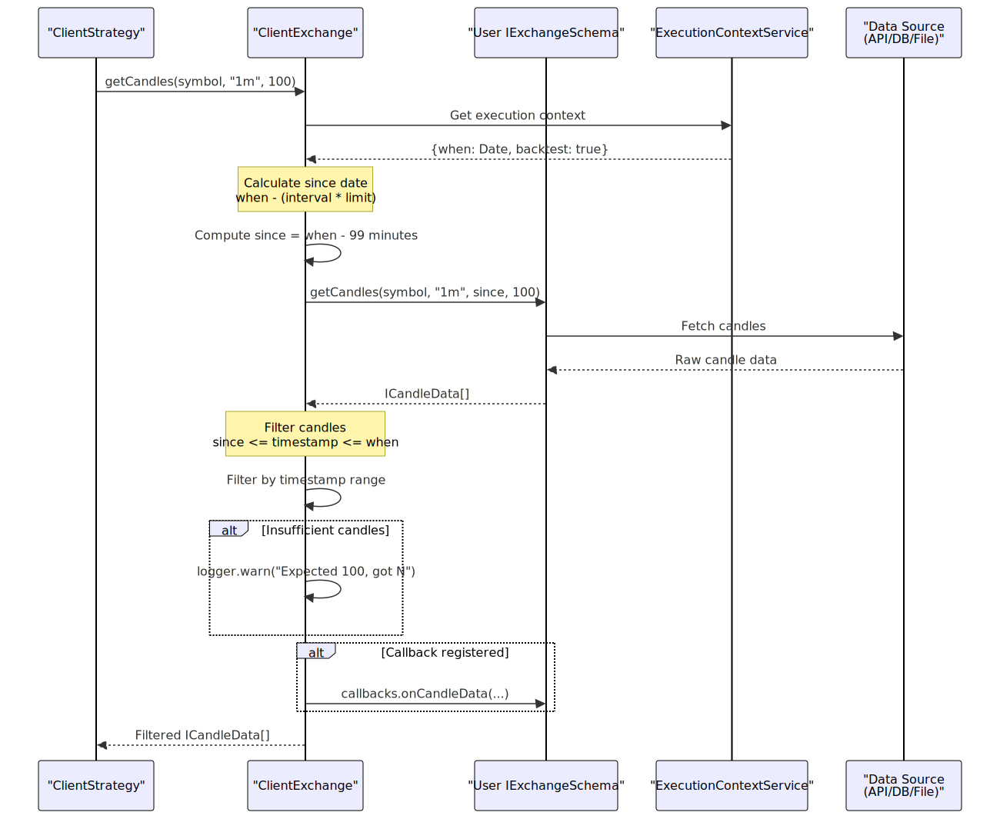

# Custom Exchange Integration

This document explains how to implement custom exchange data sources by creating `IExchangeSchema` implementations. Custom exchanges enable backtesting and live trading with data from any source including REST APIs, databases, CSV files, or WebSocket streams.

For information about using exchange functions (`getCandles`, `getAveragePrice`, etc.) in strategies, see [Exchange Functions](12_Exchange_Functions.md). For the internal architecture of exchange services, see [Connection Services](19_Connection_Services.md) and [Global Services](21_Global_Services.md).

---

## Overview

The framework uses a schema-based registration pattern where users provide a configuration object implementing `IExchangeSchema`. This schema is registered via `addExchange()` and wrapped by `ClientExchange` at runtime. The wrapper adds VWAP calculation, execution context integration, and bidirectional candle fetching (backwards for historical data, forwards for backtest simulation).


---

## Exchange Integration Architecture



**Diagram: Exchange integration flow from user schema to runtime instance**

This diagram shows how user-provided schemas are registered, cached, and wrapped by `ClientExchange` to provide enhanced functionality including VWAP calculation and execution context awareness.


---

## IExchangeSchema Interface

The `IExchangeSchema` interface defines the contract for exchange implementations. All methods must be async and handle errors appropriately.

| Property | Type | Required | Description |
|----------|------|----------|-------------|
| `exchangeName` | `ExchangeName` (string) | Yes | Unique identifier for this exchange |
| `getCandles` | Function | Yes | Fetches OHLCV candle data from data source |
| `formatPrice` | Function | Yes | Formats price values for exchange precision |
| `formatQuantity` | Function | Yes | Formats quantity values for exchange precision |
| `callbacks` | Object | No | Optional lifecycle event hooks |


---

## Implementing getCandles

The `getCandles` method is the core data source function. It must fetch historical OHLCV candles based on the provided parameters.

### Method Signature

```typescript
getCandles: (
  symbol: string,
  interval: CandleInterval,
  since: Date,
  limit: number
) => Promise<ICandleData[]>
```

### Parameters

| Parameter | Type | Description |
|-----------|------|-------------|
| `symbol` | `string` | Trading pair symbol (e.g., "BTCUSDT") |
| `interval` | `CandleInterval` | Candle timeframe ("1m", "3m", "5m", "15m", "30m", "1h", "2h", "4h", "6h", "8h") |
| `since` | `Date` | Start date for candle fetching (inclusive) |
| `limit` | `number` | Maximum number of candles to return |

### Return Value

Array of `ICandleData` objects, each containing:

| Field | Type | Description |
|-------|------|-------------|
| `timestamp` | `number` | Unix timestamp in milliseconds when candle opened |
| `open` | `number` | Opening price at candle start |
| `high` | `number` | Highest price during candle period |
| `low` | `number` | Lowest price during candle period |
| `close` | `number` | Closing price at candle end |
| `volume` | `number` | Trading volume during candle period |

### Implementation Requirements

1. **Timestamp Range**: Return candles from `since` date up to `limit` candles
2. **Ascending Order**: Candles must be sorted by timestamp (oldest first)
3. **No Gaps**: Avoid missing candles in the sequence when possible
4. **Exact Timestamps**: Candle timestamps should align to interval boundaries
5. **Error Handling**: Throw descriptive errors for failed requests


---

## ClientExchange Candle Processing



**Diagram: Candle fetching flow showing how ClientExchange wraps user schema**

`ClientExchange` automatically calculates the `since` parameter by subtracting `interval * limit` from the execution context `when` timestamp. This allows the user schema to focus solely on data retrieval.


---

## Example: REST API Exchange

Below is a conceptual example showing how to implement an exchange that fetches data from a REST API endpoint:

```typescript
import { addExchange, IExchangeSchema, ICandleData, CandleInterval } from "backtest-kit";

const INTERVAL_MAP: Record<CandleInterval, string> = {
  "1m": "1min",
  "5m": "5min",
  "1h": "1hour",
  // ... map framework intervals to API intervals
};

addExchange({
  exchangeName: "my-rest-api",
  
  async getCandles(symbol, interval, since, limit) {
    const apiInterval = INTERVAL_MAP[interval];
    const sinceTs = since.getTime();
    
    const response = await fetch(
      `https://api.example.com/candles?symbol=${symbol}&interval=${apiInterval}&since=${sinceTs}&limit=${limit}`
    );
    
    if (!response.ok) {
      throw new Error(`API error: ${response.statusText}`);
    }
    
    const data = await response.json();
    
    return data.candles.map((c: any): ICandleData => ({
      timestamp: c.time,
      open: parseFloat(c.o),
      high: parseFloat(c.h),
      low: parseFloat(c.l),
      close: parseFloat(c.c),
      volume: parseFloat(c.v),
    }));
  },
  
  async formatPrice(symbol, price) {
    return price.toFixed(2);
  },
  
  async formatQuantity(symbol, quantity) {
    return quantity.toFixed(8);
  },
});
```


---

## Example: Database Exchange

Conceptual example for fetching candles from a SQL database:

```typescript
import { addExchange } from "backtest-kit";
import Database from "better-sqlite3";

const db = new Database("market-data.db");

addExchange({
  exchangeName: "sqlite-db",
  
  async getCandles(symbol, interval, since, limit) {
    const sinceTs = since.getTime();
    
    const rows = db
      .prepare(
        `SELECT timestamp, open, high, low, close, volume
         FROM candles
         WHERE symbol = ? AND interval = ? AND timestamp >= ?
         ORDER BY timestamp ASC
         LIMIT ?`
      )
      .all(symbol, interval, sinceTs, limit);
    
    return rows.map((row: any) => ({
      timestamp: row.timestamp,
      open: row.open,
      high: row.high,
      low: row.low,
      close: row.close,
      volume: row.volume,
    }));
  },
  
  async formatPrice(symbol, price) {
    // Query precision from exchange_info table
    const info = db
      .prepare("SELECT price_precision FROM exchange_info WHERE symbol = ?")
      .get(symbol);
    return price.toFixed(info?.price_precision || 2);
  },
  
  async formatQuantity(symbol, quantity) {
    const info = db
      .prepare("SELECT qty_precision FROM exchange_info WHERE symbol = ?")
      .get(symbol);
    return quantity.toFixed(info?.qty_precision || 8);
  },
});
```


---

## Example: CSV File Exchange

Conceptual example for reading candles from CSV files:

```typescript
import { addExchange } from "backtest-kit";
import fs from "fs";
import { parse } from "csv-parse/sync";

addExchange({
  exchangeName: "csv-files",
  
  async getCandles(symbol, interval, since, limit) {
    const filename = `./data/${symbol}-${interval}.csv`;
    const content = fs.readFileSync(filename, "utf-8");
    
    const records = parse(content, {
      columns: true,
      skip_empty_lines: true,
    });
    
    const sinceTs = since.getTime();
    
    return records
      .map((row: any) => ({
        timestamp: parseInt(row.timestamp),
        open: parseFloat(row.open),
        high: parseFloat(row.high),
        low: parseFloat(row.low),
        close: parseFloat(row.close),
        volume: parseFloat(row.volume),
      }))
      .filter((c) => c.timestamp >= sinceTs)
      .slice(0, limit);
  },
  
  async formatPrice(symbol, price) {
    return price.toFixed(2);
  },
  
  async formatQuantity(symbol, quantity) {
    return quantity.toFixed(8);
  },
});
```


---

## Price and Quantity Formatting

The `formatPrice` and `formatQuantity` methods ensure values are formatted according to exchange-specific precision rules. These are critical for live trading to avoid order rejection due to invalid precision.

### formatPrice Implementation

```typescript
formatPrice: (symbol: string, price: number) => Promise<string>
```

**Purpose:** Format price values to exchange-allowed decimal places.

**Example implementations:**
- Fixed precision: `price.toFixed(2)`
- Dynamic lookup: Query exchange info API or database
- Symbol-specific: Different precision per trading pair

### formatQuantity Implementation

```typescript
formatQuantity: (symbol: string, quantity: number) => Promise<string>
```

**Purpose:** Format quantity/amount values to exchange-allowed decimal places.

**Example implementations:**
- Fixed precision: `quantity.toFixed(8)`
- Minimum quantity enforcement: Ensure above exchange minimums
- Lot size alignment: Round to exchange-required step sizes


---

## Lifecycle Callbacks

The optional `callbacks` property enables monitoring of exchange operations. Callbacks are invoked after data operations complete successfully.

### IExchangeCallbacks Interface

```typescript
interface IExchangeCallbacks {
  onCandleData: (
    symbol: string,
    interval: CandleInterval,
    since: Date,
    limit: number,
    data: ICandleData[]
  ) => void;
}
```

### Callback Usage

```typescript
addExchange({
  exchangeName: "monitored-exchange",
  
  // ... getCandles, formatPrice, formatQuantity implementations
  
  callbacks: {
    onCandleData: (symbol, interval, since, limit, data) => {
      console.log(`Fetched ${data.length} candles for ${symbol} ${interval}`);
      
      // Validate data quality
      if (data.length < limit * 0.9) {
        console.warn(`Data quality issue: expected ${limit}, got ${data.length}`);
      }
      
      // Log to monitoring system
      metrics.recordCandleFetch(symbol, interval, data.length);
    },
  },
});
```

**Use cases:**
- Logging for debugging and auditing
- Metrics collection for monitoring
- Data quality validation
- Cache warming or preloading


---

## VWAP Calculation by ClientExchange



**Diagram: VWAP calculation flow in ClientExchange.getAveragePrice()**

The `getAveragePrice` method is implemented entirely by `ClientExchange` and does not require user implementation. It automatically fetches the last 5 one-minute candles and calculates the Volume Weighted Average Price (VWAP).

Formula: `VWAP = Σ(Typical Price × Volume) / Σ(Volume)` where `Typical Price = (High + Low + Close) / 3`


---

## Execution Context Integration

`ClientExchange` automatically integrates with the execution context system to provide time-aware candle fetching. This enables both backtest and live mode operation without schema awareness.

### Context-Aware Candle Fetching

| Method | Direction | Uses Context | Purpose |
|--------|-----------|--------------|---------|
| `getCandles` | Backwards | Yes | Fetch historical candles ending at `context.when` |
| `getNextCandles` | Forwards | Yes | Fetch future candles starting at `context.when` (backtest only) |
| `getAveragePrice` | Backwards | Yes | Calculate VWAP from recent candles at `context.when` |

### Time Calculation Logic

When `getCandles(symbol, "1m", 100)` is called:

1. `ClientExchange` reads `context.when` from `ExecutionContextService`
2. Calculates `since = context.when - (interval × limit)` 
3. Calls `schema.getCandles(symbol, interval, since, limit)`
4. Filters results to range `[since, context.when]`
5. Returns filtered candles


---

## Candle Filtering and Validation

`ClientExchange` performs automatic filtering and validation on candles returned by user schemas:

### Timestamp Filtering

```typescript
// From ClientExchange.getCandles
const whenTimestamp = this.params.execution.context.when.getTime();
const sinceTimestamp = since.getTime();

const filteredData = data.filter(
  (candle) =>
    candle.timestamp >= sinceTimestamp && candle.timestamp <= whenTimestamp
);
```

This ensures only candles within the requested time range are returned, even if the user schema returns extra candles.

### Count Validation

```typescript
if (filteredData.length < limit) {
  this.params.logger.warn(
    `ClientExchange Expected ${limit} candles, got ${filteredData.length}`
  );
}
```

Logs warnings when fewer candles than requested are returned, indicating potential data gaps or quality issues.


---

## Bidirectional Candle Fetching



**Diagram: Bidirectional candle fetching in backtest mode**

- **Backward fetching** (`getCandles`): Used by strategies to access historical data for indicators
- **Forward fetching** (`getNextCandles`): Used by backtest simulation to get future candles for signal outcome

Both methods call the same `schema.getCandles()` implementation but with different time ranges.


---

## Integration with Framework Services



**Diagram: How user exchange schema integrates with framework service layers**

The framework uses dependency injection to route exchange calls through multiple service layers:

1. **SchemaService**: Stores registered schemas by name
2. **ConnectionService**: Creates and caches `ClientExchange` instances
3. **GlobalService**: Injects execution context before method calls
4. **ClientExchange**: Wraps user schema with enhanced functionality


---

## Testing Exchange Implementations

When implementing custom exchanges, test the following scenarios:

### Data Quality Tests

| Test Case | Validation |
|-----------|------------|
| **Complete data** | All requested candles returned |
| **Timestamp alignment** | Candles align to interval boundaries |
| **Sequential timestamps** | No gaps or duplicates in sequence |
| **Valid OHLCV** | `low <= open, close <= high` |
| **Positive volume** | Volume >= 0 for all candles |

### Edge Case Tests

| Test Case | Expected Behavior |
|-----------|-------------------|
| **Empty result** | Return `[]` when no data available |
| **Partial result** | Return available candles (framework logs warning) |
| **Future date** | Return `[]` for dates beyond current time |
| **Network error** | Throw descriptive error |
| **Invalid symbol** | Throw descriptive error |

### Performance Considerations

- **Caching**: Consider caching candle data to reduce API calls
- **Batching**: Fetch multiple symbols/intervals efficiently
- **Rate limiting**: Implement backoff for API rate limits
- **Timeout handling**: Set reasonable timeouts for data fetches


---

## Common Implementation Patterns

### Pattern: Caching Layer

```typescript
const cache = new Map<string, ICandleData[]>();

addExchange({
  exchangeName: "cached-exchange",
  
  async getCandles(symbol, interval, since, limit) {
    const cacheKey = `${symbol}-${interval}-${since.getTime()}-${limit}`;
    
    if (cache.has(cacheKey)) {
      return cache.get(cacheKey)!;
    }
    
    const candles = await fetchFromSource(symbol, interval, since, limit);
    cache.set(cacheKey, candles);
    
    return candles;
  },
  
  // ... other methods
});
```

### Pattern: Connection Pooling

```typescript
const pool = createConnectionPool({
  max: 10,
  min: 2,
});

addExchange({
  exchangeName: "pooled-db",
  
  async getCandles(symbol, interval, since, limit) {
    const connection = await pool.acquire();
    try {
      return await connection.query(/* ... */);
    } finally {
      pool.release(connection);
    }
  },
  
  // ... other methods
});
```

### Pattern: Retry Logic

```typescript
async function fetchWithRetry(fn: () => Promise<any>, maxRetries = 3) {
  for (let i = 0; i < maxRetries; i++) {
    try {
      return await fn();
    } catch (error) {
      if (i === maxRetries - 1) throw error;
      await new Promise(resolve => setTimeout(resolve, 1000 * (i + 1)));
    }
  }
}

addExchange({
  exchangeName: "retry-exchange",
  
  async getCandles(symbol, interval, since, limit) {
    return await fetchWithRetry(() => 
      fetch(/* ... */).then(r => r.json())
    );
  },
  
  // ... other methods
});
```


---

## Error Handling Guidelines

Exchange implementations should throw descriptive errors that help diagnose issues:

### Error Message Format

```typescript
throw new Error(`[${exchangeName}] ${operation}: ${reason}`);
```

### Common Error Scenarios

| Scenario | Error Message Example |
|----------|----------------------|
| Network failure | `[binance-api] getCandles: Network request failed` |
| Invalid symbol | `[database] getCandles: Symbol 'INVALID' not found` |
| Data corruption | `[csv-files] getCandles: Malformed CSV data` |
| Rate limit | `[rest-api] getCandles: Rate limit exceeded, retry after 60s` |
| Authentication | `[exchange-api] getCandles: API key invalid or expired` |

### Example Error Handling

```typescript
addExchange({
  exchangeName: "safe-exchange",
  
  async getCandles(symbol, interval, since, limit) {
    try {
      const response = await fetch(/* ... */);
      
      if (!response.ok) {
        throw new Error(`HTTP ${response.status}: ${response.statusText}`);
      }
      
      const data = await response.json();
      
      if (!Array.isArray(data.candles)) {
        throw new Error("Invalid response format: missing candles array");
      }
      
      return data.candles;
    } catch (error) {
      throw new Error(
        `[safe-exchange] getCandles failed for ${symbol} ${interval}: ${error.message}`
      );
    }
  },
  
  // ... other methods
});
```


---

## Summary

Custom exchange integration requires implementing three core methods (`getCandles`, `formatPrice`, `formatQuantity`) via the `IExchangeSchema` interface. The framework wraps user schemas with `ClientExchange` to add VWAP calculation, execution context integration, and bidirectional candle fetching. This design enables backtesting and live trading with any data source while maintaining a clean separation between data retrieval and business logic.

**Key implementation requirements:**
- Return candles in ascending timestamp order
- Handle errors with descriptive messages
- Respect exchange precision in formatting methods
- Consider caching and rate limiting for production use

