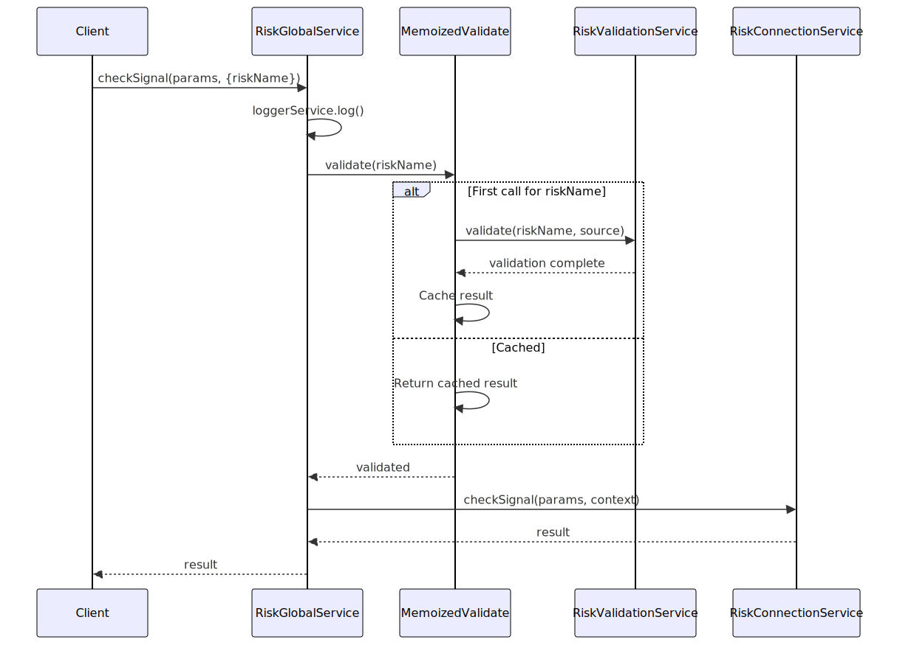

# Global Services

Global Services form Layer 1 of the service architecture, serving as public API entry points that orchestrate validation and delegate operations to lower-level services. These services provide a consistent interface for component registration, validation, and execution across the framework.

For information about the overall service layer organization, see [Service Architecture Overview](./39_Service_Architecture_Overview.md). For details on the services that Global Services delegate to, see [Connection Services](./54_Timeframe_Generation.md), [Schema Services](./55_Fast-Forward_Simulation.md), [Validation Services](./42_Validation_Services.md), and [Logic Services](./44_Logic_Services.md).

---

## Service Categories

The framework provides two categories of Global Services, each serving distinct purposes in the architecture.

### Component Global Services

Component Global Services manage the lifecycle and access patterns for registered components (strategies, exchanges, frames, risk profiles, sizing configurations, walkers). Each component type has a corresponding Global Service:

| Global Service Class | Component Type | Primary Responsibilities |
|---------------------|----------------|-------------------------|
| `StrategyGlobalService` | Trading strategies | Validation orchestration, delegation to StrategyConnectionService |
| `ExchangeGlobalService` | Market data sources | Validation orchestration, delegation to ExchangeConnectionService |
| `FrameGlobalService` | Backtest timeframes | Validation orchestration, delegation to FrameConnectionService |
| `RiskGlobalService` | Risk profiles | Validation orchestration, position tracking delegation |
| `SizingGlobalService` | Position sizing | Validation orchestration, sizing calculation delegation |
| `WalkerGlobalService` | Strategy comparisons | Validation orchestration, multi-strategy execution |

### Execution Mode Global Services

Execution Mode Global Services provide entry points for running backtests and live trading:

| Global Service Class | Execution Mode | Primary Responsibilities |
|---------------------|----------------|-------------------------|
| `BacktestGlobalService` | Historical simulation | Delegates to BacktestLogicPublicService |
| `LiveGlobalService` | Real-time trading | Delegates to LiveLogicPublicService |
| `WalkerGlobalService` | Strategy comparison | Also serves as execution mode service |

**Sources:** [src/lib/index.ts:93-108](), [src/lib/core/types.ts:27-36](), [src/lib/core/provide.ts:70-79]()

---

## Global Service Architecture



**Purpose**: This diagram illustrates how Global Services act as an intermediary layer between public APIs and lower-level services. Component Global Services orchestrate validation and delegate to Connection Services, while Execution Global Services delegate to Logic Services.

**Sources:** [src/lib/index.ts:49-162](), [src/function/add.ts:50-62](), [src/lib/services/global/RiskGlobalService.ts:15-114]()

---

## Component Global Service Pattern

Component Global Services follow a consistent implementation pattern with three key responsibilities: dependency injection, validation orchestration, and operation delegation.

### Standard Structure



**Purpose**: This diagram shows the standard implementation pattern for Component Global Services using RiskGlobalService as an example. All public methods follow the log-validate-delegate sequence.

**Sources:** [src/lib/services/global/RiskGlobalService.ts:15-114]()

### Dependency Injection Pattern

Component Global Services inject three types of dependencies:

```typescript
// Pattern from RiskGlobalService
private readonly loggerService = inject<LoggerService>(TYPES.loggerService);
private readonly riskConnectionService = inject<RiskConnectionService>(
  TYPES.riskConnectionService
);
private readonly riskValidationService = inject<RiskValidationService>(
  TYPES.riskValidationService
);
```

| Dependency Type | Purpose | Usage Pattern |
|----------------|---------|---------------|
| `LoggerService` | Operation logging | Every public method logs entry with context |
| `*ConnectionService` | Client instance management | Delegate actual operations after validation |
| `*ValidationService` | Schema validation | Called by memoized `validate()` method |

**Sources:** [src/lib/services/global/RiskGlobalService.ts:16-22]()

### Validation Orchestration

The validation pattern uses memoization to avoid redundant schema checks:



**Purpose**: This sequence diagram demonstrates the validation orchestration pattern. The first call to `validate()` for a given component name performs validation and caches the result. Subsequent calls return immediately from cache.

**Sources:** [src/lib/services/global/RiskGlobalService.ts:31-42](), [src/lib/services/global/RiskGlobalService.ts:51-61]()

### Implementation Example: RiskGlobalService

The `RiskGlobalService` exemplifies the Component Global Service pattern:

[src/lib/services/global/RiskGlobalService.ts:15-114]()

**Key methods:**

| Method | Parameters | Behavior |
|--------|-----------|----------|
| `validate()` | `riskName: RiskName` | Memoized validation call to `RiskValidationService.validate()` |
| `checkSignal()` | `params: IRiskCheckArgs`, `context: {riskName}` | Log → Validate → Delegate to `RiskConnectionService.checkSignal()` |
| `addSignal()` | `symbol: string`, `context: {strategyName, riskName}` | Log → Validate → Delegate to `RiskConnectionService.addSignal()` |
| `removeSignal()` | `symbol: string`, `context: {strategyName, riskName}` | Log → Validate → Delegate to `RiskConnectionService.removeSignal()` |
| `clear()` | `riskName?: RiskName` | Optional validation → Delegate to `RiskConnectionService.clear()` |

**Validation flow:**
1. Public method receives component name (e.g., `riskName`)
2. Calls `this.validate(riskName)` before operation
3. Memoized `validate()` checks if validation already performed
4. First call: delegates to `riskValidationService.validate(riskName, source)`
5. Subsequent calls: returns immediately (no-op)
6. After validation: delegates operation to Connection Service

**Sources:** [src/lib/services/global/RiskGlobalService.ts:31-61]()

---

## Integration with Public API

Global Services are used internally by the framework but can also be accessed directly through the exported `lib` object for advanced use cases.

### Direct Access Pattern



**Purpose**: This diagram shows how Global Services fit into the public API. The `add*` and `list*` functions bypass Global Services and access Validation/Schema services directly, while test code and advanced users can access Global Services through the `lib` export.

**Sources:** [src/function/add.ts:329-341](), [src/function/list.ts:214-217](), [test/spec/risk.test.mjs:67-92](), [src/lib/index.ts:152-162]()

### Test Usage Example

Tests demonstrate direct Global Service usage:

[test/spec/risk.test.mjs:67-92]()

```javascript
// Direct access via lib export
const { riskGlobalService } = lib;

// Add positions
await riskGlobalService.addSignal("BTCUSDT", { 
  strategyName: "test-strategy-1", 
  riskName: "test-max-positions" 
});

// Check risk limits
const result = await riskGlobalService.checkSignal(
  {
    symbol: "SOLUSDT",
    strategyName: "test-strategy-4",
    exchangeName: "binance",
    currentPrice: 100,
    timestamp: Date.now(),
  },
  { riskName: "test-max-positions" }
);
```

This pattern is useful for:
- Unit testing individual services
- Building custom orchestration logic
- Debugging component behavior
- Implementing advanced workflows

**Sources:** [test/spec/risk.test.mjs:41-93]()

---

## Execution Mode Global Services

Execution Mode Global Services differ from Component Global Services by delegating to Logic Services rather than Connection Services.

### BacktestGlobalService and LiveGlobalService

These services provide the entry points for `Backtest.run()` and `Live.run()` operations:



**Purpose**: This diagram illustrates the delegation chain from Execution Mode Global Services through Logic Services. Unlike Component Global Services that delegate to Connection Services, these delegate to Logic Services which manage context propagation and execution orchestration.

**Sources:** [src/lib/index.ts:101-103](), [src/lib/core/types.ts:32-33]()

### WalkerGlobalService Dual Role

`WalkerGlobalService` serves both as a Component Global Service (for walker registration) and an Execution Mode Global Service (for multi-strategy comparison):

| Role | Methods | Delegation Target |
|------|---------|------------------|
| Component Service | `validate()` | `WalkerValidationService` |
| Execution Service | `run()` | `WalkerLogicPublicService` |

**Sources:** [src/lib/services/global/WalkerGlobalService.ts]() (not directly visible in provided files but inferred from pattern)

---

## Service Registration and Discovery

Global Services are registered in the dependency injection container and made available through the `backtest` export.

### Registration Pattern

[src/lib/core/provide.ts:70-79]()

```typescript
{
    provide(TYPES.exchangeGlobalService, () => new ExchangeGlobalService());
    provide(TYPES.strategyGlobalService, () => new StrategyGlobalService());
    provide(TYPES.frameGlobalService, () => new FrameGlobalService());
    provide(TYPES.liveGlobalService, () => new LiveGlobalService());
    provide(TYPES.backtestGlobalService, () => new BacktestGlobalService());
    provide(TYPES.walkerGlobalService, () => new WalkerGlobalService());
    provide(TYPES.sizingGlobalService, () => new SizingGlobalService());
    provide(TYPES.riskGlobalService, () => new RiskGlobalService());
}
```

### Export Pattern

[src/lib/index.ts:93-108]()

```typescript
const globalServices = {
  exchangeGlobalService: inject<ExchangeGlobalService>(
    TYPES.exchangeGlobalService
  ),
  strategyGlobalService: inject<StrategyGlobalService>(
    TYPES.strategyGlobalService
  ),
  frameGlobalService: inject<FrameGlobalService>(
    TYPES.frameGlobalService
  ),
  liveGlobalService: inject<LiveGlobalService>(
    TYPES.liveGlobalService
  ),
  backtestGlobalService: inject<BacktestGlobalService>(
    TYPES.backtestGlobalService
  ),
  walkerGlobalService: inject<WalkerGlobalService>(
    TYPES.walkerGlobalService
  ),
  sizingGlobalService: inject<SizingGlobalService>(
    TYPES.sizingGlobalService
  ),
  riskGlobalService: inject<RiskGlobalService>(
    TYPES.riskGlobalService
  ),
};
```

All services are included in the `backtest` export object [src/lib/index.ts:152-162](), making them accessible as `backtest.riskGlobalService`, `backtest.strategyGlobalService`, etc.

**Sources:** [src/lib/core/provide.ts:70-79](), [src/lib/core/types.ts:27-36](), [src/lib/index.ts:93-162]()

---

## Key Characteristics

Global Services exhibit these consistent patterns across the framework:

### Stateless Operation

Global Services maintain no state themselves. They delegate state management to:
- Schema Services (component configurations)
- Connection Services (memoized client instances)
- Client Classes (signal state, position tracking)

### Memoized Validation

Validation is memoized by component name to avoid redundant schema checks:

```typescript
// Pattern from RiskGlobalService
private validate = memoize(
  ([riskName]) => `${riskName}`,  // Cache key
  async (riskName: RiskName) => {
    this.loggerService.log("riskGlobalService validate", {
      riskName,
    });
    this.riskValidationService.validate(
      riskName,
      "riskGlobalService validate"
    );
  }
);
```

The cache key is the component name string. First invocation performs validation, subsequent calls return immediately.

**Sources:** [src/lib/services/global/RiskGlobalService.ts:31-42]()

### Consistent Logging

Every public method logs its invocation with context:

```typescript
public checkSignal = async (
  params: IRiskCheckArgs,
  context: { riskName: RiskName }
) => {
  this.loggerService.log("riskGlobalService checkSignal", {
    symbol: params.symbol,
    context,
  });
  await this.validate(context.riskName);
  return await this.riskConnectionService.checkSignal(params, context);
};
```

Log entries include:
- Service and method name (e.g., `"riskGlobalService checkSignal"`)
- Operation-specific context (symbol, component names)
- Structured data for debugging

**Sources:** [src/lib/services/global/RiskGlobalService.ts:51-61]()

### Single Responsibility

Each Global Service manages exactly one component type or execution mode:
- `RiskGlobalService` → Risk profiles only
- `StrategyGlobalService` → Strategies only  
- `BacktestGlobalService` → Backtest execution only
- `WalkerGlobalService` → Both walker components AND walker execution (special case)

**Sources:** [src/lib/index.ts:93-108]()

---

## Delegation Flow Summary



**Purpose**: This diagram summarizes the complete delegation flow for both Component and Execution Global Services. Both types perform validation first, but Component services delegate to Connection Services while Execution services delegate to Logic Services.

**Sources:** [src/lib/services/global/RiskGlobalService.ts:15-114](), [src/lib/index.ts:93-132]()