# Markdown Services

<details>
<summary>Relevant source files</summary>

The following files were used as context for generating this wiki page:

- [README.md](README.md)
- [assets/uml.svg](assets/uml.svg)
- [docs/internals.md](docs/internals.md)
- [docs/uml.puml](docs/uml.puml)
- [scripts/_convert-md-mermaid-to-svg.cjs](scripts/_convert-md-mermaid-to-svg.cjs)
- [scripts/gpt-docs.mjs](scripts/gpt-docs.mjs)
- [scripts/uml.mjs](scripts/uml.mjs)
- [src/classes/Schedule.ts](src/classes/Schedule.ts)
- [src/lib/services/global/WalkerGlobalService.ts](src/lib/services/global/WalkerGlobalService.ts)
- [src/lib/services/markdown/BacktestMarkdownService.ts](src/lib/services/markdown/BacktestMarkdownService.ts)
- [src/lib/services/markdown/LiveMarkdownService.ts](src/lib/services/markdown/LiveMarkdownService.ts)
- [src/lib/services/markdown/ScheduleMarkdownService.ts](src/lib/services/markdown/ScheduleMarkdownService.ts)
- [test/spec/scheduled.test.mjs](test/spec/scheduled.test.mjs)

</details>


## Purpose and Scope

This document describes the Markdown Services subsystem, which provides automated report generation and performance analytics for backtesting and live trading operations. These services subscribe to execution events, accumulate statistical data, and generate markdown-formatted reports with comprehensive trading metrics.

For information about the event system that feeds these services, see [Event System](#3.4). For details on the execution modes that generate events, see [Execution Modes](#2.1).

---

## Service Architecture

The Markdown Services subsystem consists of three specialized service classes, each responsible for reporting on a specific execution mode:

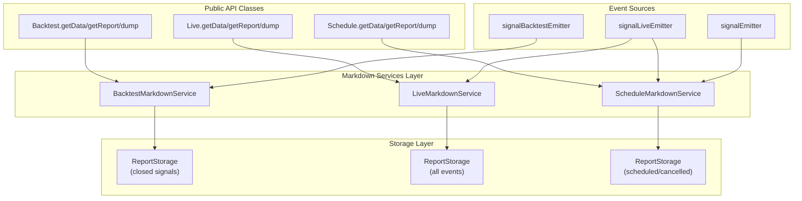

**Sources:** [src/lib/services/markdown/BacktestMarkdownService.ts:370-532](), [src/lib/services/markdown/LiveMarkdownService.ts:567-736](), [src/lib/services/markdown/ScheduleMarkdownService.ts:374-493]()

| Service | Event Source | Data Stored | Primary Purpose |
|---------|-------------|-------------|-----------------|
| `BacktestMarkdownService` | `signalBacktestEmitter` | Closed signals only | Historical backtest performance analysis |
| `LiveMarkdownService` | `signalLiveEmitter` | All events (idle, opened, active, closed) | Real-time trading activity monitoring |
| `ScheduleMarkdownService` | `signalEmitter`, `signalLiveEmitter` | Scheduled and cancelled signals | Limit order execution tracking |

**Sources:** [docs/internals.md:62]()

---

## Data Flow Architecture

The following diagram illustrates how trading events flow from execution contexts through emitters to markdown services, and finally to persistent reports:

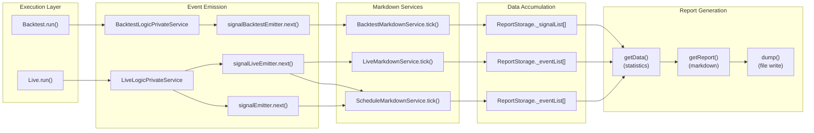

**Sources:** [src/lib/services/markdown/BacktestMarkdownService.ts:402-413](), [src/lib/services/markdown/LiveMarkdownService.ts:601-617](), [src/lib/services/markdown/ScheduleMarkdownService.ts:401-413]()

---

## BacktestMarkdownService

### Purpose

`BacktestMarkdownService` generates performance reports for historical backtesting by accumulating closed signals and calculating trading statistics. It only processes `closed` action events, ignoring intermediate states.

**Sources:** [src/lib/services/markdown/BacktestMarkdownService.ts:343-370]()

### Event Subscription

The service subscribes to `signalBacktestEmitter` during initialization using the `singleshot` pattern to ensure one-time setup:

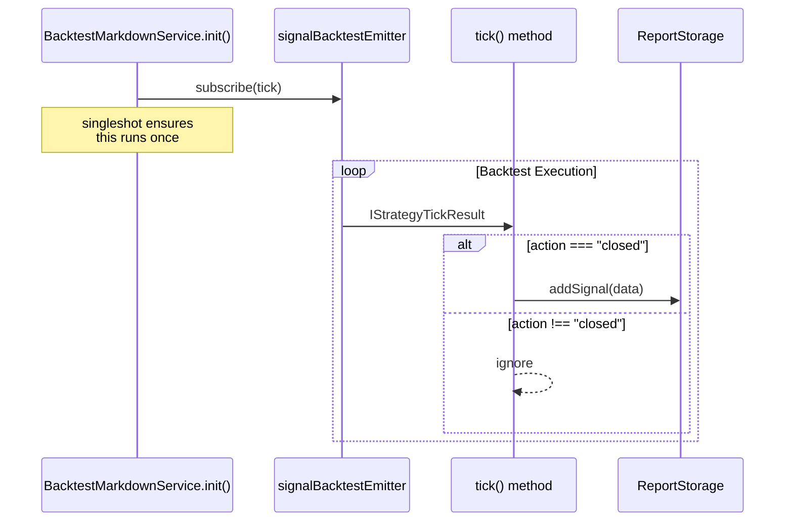

**Sources:** [src/lib/services/markdown/BacktestMarkdownService.ts:526-529](), [src/lib/services/markdown/BacktestMarkdownService.ts:402-413]()

### Internal Storage Structure

Each strategy gets an isolated `ReportStorage` instance via memoization:

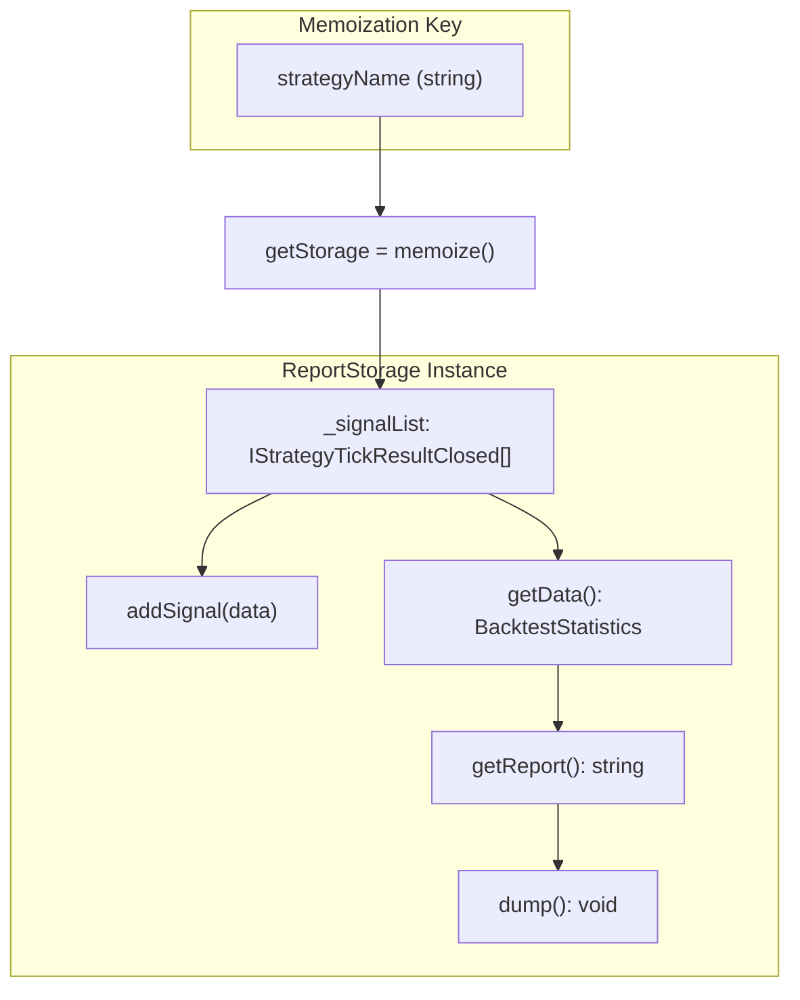

**Sources:** [src/lib/services/markdown/BacktestMarkdownService.ts:378-381](), [src/lib/services/markdown/BacktestMarkdownService.ts:179-194]()

### Statistics Interface

```typescript
interface BacktestStatistics {
  signalList: IStrategyTickResultClosed[];
  totalSignals: number;
  winCount: number;
  lossCount: number;
  winRate: number | null;          // 0-100%, null if unsafe
  avgPnl: number | null;            // Average PNL %
  totalPnl: number | null;          // Cumulative PNL %
  stdDev: number | null;            // Volatility
  sharpeRatio: number | null;       // avgPnl / stdDev
  annualizedSharpeRatio: number | null;  // sharpeRatio × √365
  certaintyRatio: number | null;    // avgWin / |avgLoss|
  expectedYearlyReturns: number | null;  // Projected annual return
}
```

**Sources:** [src/lib/services/markdown/BacktestMarkdownService.ts:46-102]()

### Safe Math Pattern

All numeric metrics use the `isUnsafe()` function to guard against `NaN`, `Infinity`, and invalid calculations:

**Sources:** [src/lib/services/markdown/BacktestMarkdownService.ts:33-44](), [src/lib/services/markdown/BacktestMarkdownService.ts:261-268]()

---

## LiveMarkdownService

### Purpose

`LiveMarkdownService` tracks real-time trading activity by accumulating all tick events (idle, opened, active, closed) and provides comprehensive live trading analytics.

**Sources:** [src/lib/services/markdown/LiveMarkdownService.ts:538-566]()

### Event Types Tracked

| Event Type | Stored As | Update Strategy |
|-----------|-----------|-----------------|
| `idle` | `TickEvent` | Replaces last idle if no open/active signals follow |
| `opened` | `TickEvent` | Appends to event list |
| `active` | `TickEvent` | Replaces existing event with same `signalId` |
| `closed` | `TickEvent` | Replaces existing event with same `signalId` |

**Sources:** [src/lib/services/markdown/LiveMarkdownService.ts:38-66](), [src/lib/services/markdown/LiveMarkdownService.ts:239-373]()

### Event Accumulation Logic

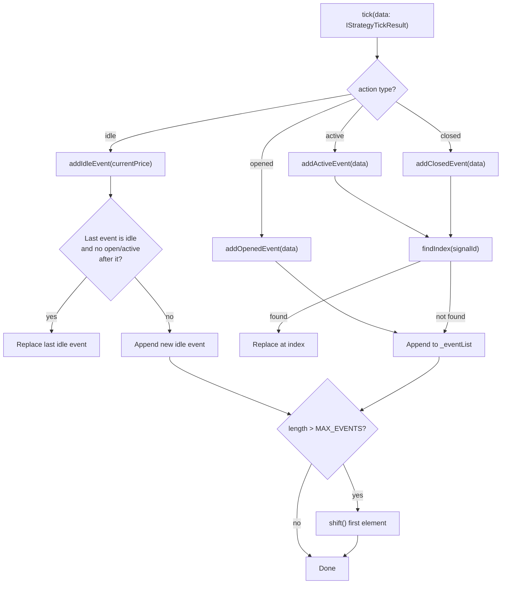

**Sources:** [src/lib/services/markdown/LiveMarkdownService.ts:239-373](), [src/lib/services/markdown/LiveMarkdownService.ts:222-224]()

### MAX_EVENTS Limit

The service maintains a bounded queue of 250 events to prevent memory leaks in long-running live trading sessions:

**Sources:** [src/lib/services/markdown/LiveMarkdownService.ts:223]()

---

## ScheduleMarkdownService

### Purpose

`ScheduleMarkdownService` tracks scheduled limit orders and their lifecycle outcomes (activated vs. cancelled), providing cancellation rate analytics.

**Sources:** [src/lib/services/markdown/ScheduleMarkdownService.ts:354-373]()

### Event Subscription Strategy

Unlike the other services, `ScheduleMarkdownService` subscribes to both `signalLiveEmitter` and the global `signalEmitter` to capture scheduled signals from live trading:

**Sources:** [src/lib/services/markdown/ScheduleMarkdownService.ts:471-474](), [docs/internals.md:62]()

### Statistics Interface

```typescript
interface ScheduleStatistics {
  eventList: ScheduledEvent[];
  totalEvents: number;
  totalScheduled: number;
  totalCancelled: number;
  cancellationRate: number | null;  // 0-100%, null if no scheduled
  avgWaitTime: number | null;       // Minutes, null if no cancelled
}
```

**Sources:** [src/lib/services/markdown/ScheduleMarkdownService.ts:47-86]()

### Cancellation Rate Calculation

The cancellation rate metric indicates what percentage of scheduled limit orders were cancelled without execution:

```
cancellationRate = (totalCancelled / totalScheduled) × 100
```

**Sources:** [src/lib/services/markdown/ScheduleMarkdownService.ts:267-268]()

---

## ReportStorage Pattern

### Architecture

Each markdown service contains an internal `ReportStorage` class that implements the Controller-View pattern for data management:

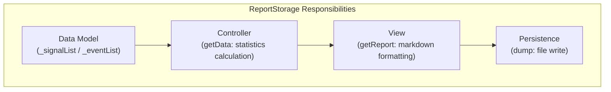

**Sources:** [src/lib/services/markdown/BacktestMarkdownService.ts:179-341](), [src/lib/services/markdown/LiveMarkdownService.ts:229-535]()

### Memoization Pattern

Services use `functools-kit` memoization to create one `ReportStorage` instance per strategy:

**Sources:** [src/lib/services/markdown/BacktestMarkdownService.ts:378-381](), [src/lib/services/markdown/LiveMarkdownService.ts:575-578](), [src/lib/services/markdown/ScheduleMarkdownService.ts:382-385]()

---

## Statistics Calculation Pipeline

### Calculation Flow

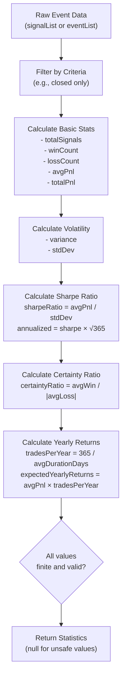

**Sources:** [src/lib/services/markdown/BacktestMarkdownService.ts:202-269](), [src/lib/services/markdown/LiveMarkdownService.ts:381-464]()

### Metric Definitions

| Metric | Formula | Interpretation |
|--------|---------|----------------|
| Win Rate | `(winCount / totalSignals) × 100` | Percentage of profitable trades |
| Sharpe Ratio | `avgPnl / stdDev` | Risk-adjusted return (higher is better) |
| Annualized Sharpe | `sharpeRatio × √365` | Annual risk-adjusted return |
| Certainty Ratio | `avgWin / |avgLoss|` | Average win vs. average loss ratio |
| Expected Yearly Returns | `avgPnl × (365 / avgDurationDays)` | Projected annual profit % |

**Sources:** [src/lib/services/markdown/BacktestMarkdownService.ts:224-254](), [src/lib/services/markdown/LiveMarkdownService.ts:405-447]()

---

## Report Generation

### Markdown Table Structure

All services generate markdown reports with column-based tables for event data:

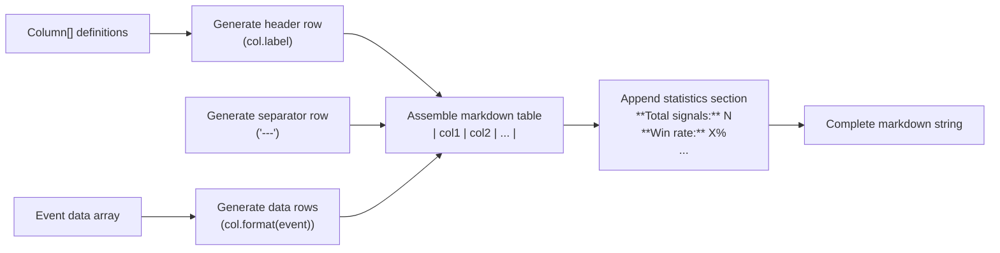

**Sources:** [src/lib/services/markdown/BacktestMarkdownService.ts:104-177](), [src/lib/services/markdown/LiveMarkdownService.ts:145-220]()

### Column Configuration

Columns are defined as arrays of objects with `key`, `label`, and `format` properties:

**Sources:** [src/lib/services/markdown/BacktestMarkdownService.ts:104-177](), [src/lib/services/markdown/LiveMarkdownService.ts:145-220]()

### File Output

The `dump()` method writes reports to disk with the following structure:

```
./logs/
  backtest/
    {strategyName}.md
  live/
    {strategyName}.md
  schedule/
    {strategyName}.md
```

**Sources:** [src/lib/services/markdown/BacktestMarkdownService.ts:322-340](), [src/lib/services/markdown/LiveMarkdownService.ts:516-534](), [src/lib/services/markdown/ScheduleMarkdownService.ts:332-350]()

---

## Integration with Public API

### Class Delegation Pattern

Public API classes (`Backtest`, `Live`, `Schedule`) delegate to markdown services through the dependency injection container:

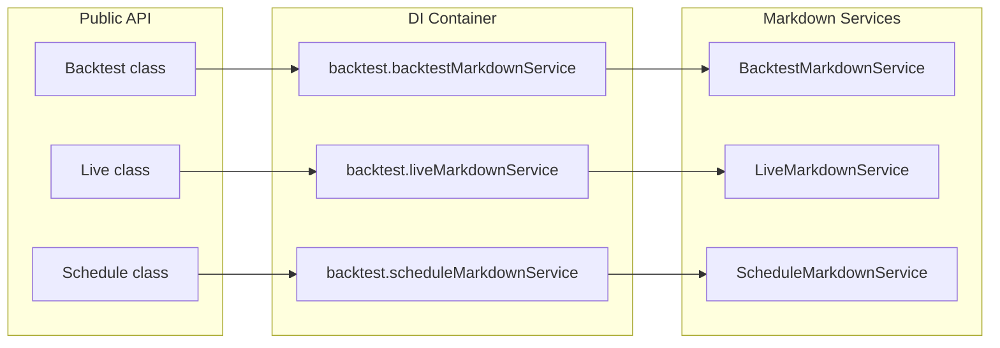

**Sources:** [src/classes/Backtest.ts:1-134](), [src/classes/Live.ts:1-134](), [src/classes/Schedule.ts:1-135]()

### Method Mapping

| Public Method | Service Method | Return Type |
|--------------|----------------|-------------|
| `Backtest.getData(strategyName)` | `backtestMarkdownService.getData(strategyName)` | `BacktestStatistics` |
| `Backtest.getReport(strategyName)` | `backtestMarkdownService.getReport(strategyName)` | `string` |
| `Backtest.dump(strategyName, path?)` | `backtestMarkdownService.dump(strategyName, path)` | `void` |
| `Live.getData(strategyName)` | `liveMarkdownService.getData(strategyName)` | `LiveStatistics` |
| `Live.getReport(strategyName)` | `liveMarkdownService.getReport(strategyName)` | `string` |
| `Live.dump(strategyName, path?)` | `liveMarkdownService.dump(strategyName, path)` | `void` |
| `Schedule.getData(strategyName)` | `scheduleMarkdownService.getData(strategyName)` | `ScheduleStatistics` |
| `Schedule.getReport(strategyName)` | `scheduleMarkdownService.getReport(strategyName)` | `string` |
| `Schedule.dump(strategyName, path?)` | `scheduleMarkdownService.dump(strategyName, path)` | `void` |

**Sources:** [src/classes/Backtest.ts:47-109](), [src/classes/Live.ts:47-109](), [src/classes/Schedule.ts:47-120]()

---

## Service Lifecycle

### Initialization Sequence

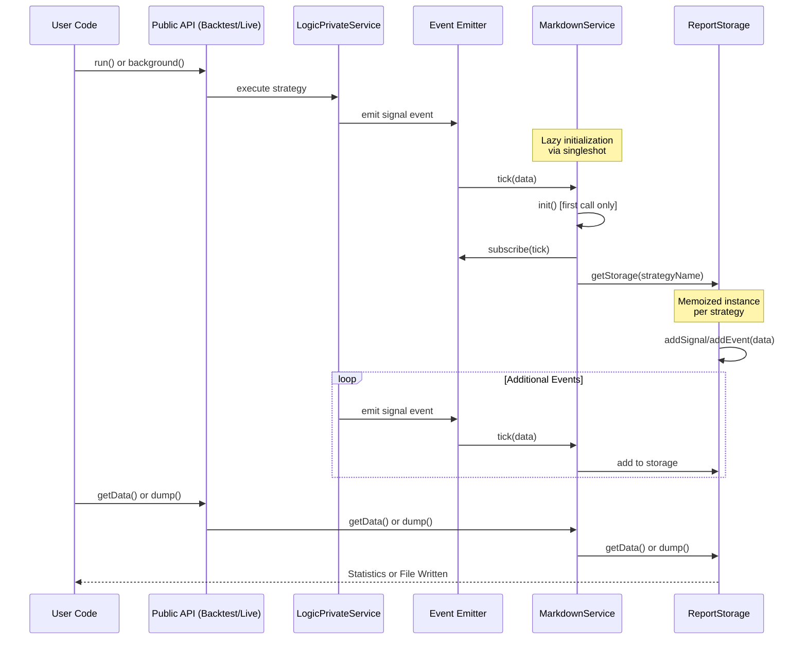

**Sources:** [src/lib/services/markdown/BacktestMarkdownService.ts:526-529](), [src/lib/services/markdown/LiveMarkdownService.ts:730-733](), [src/lib/services/markdown/ScheduleMarkdownService.ts:465-474]()

---

## Clear Operation

All markdown services implement a `clear()` method to reset accumulated data:

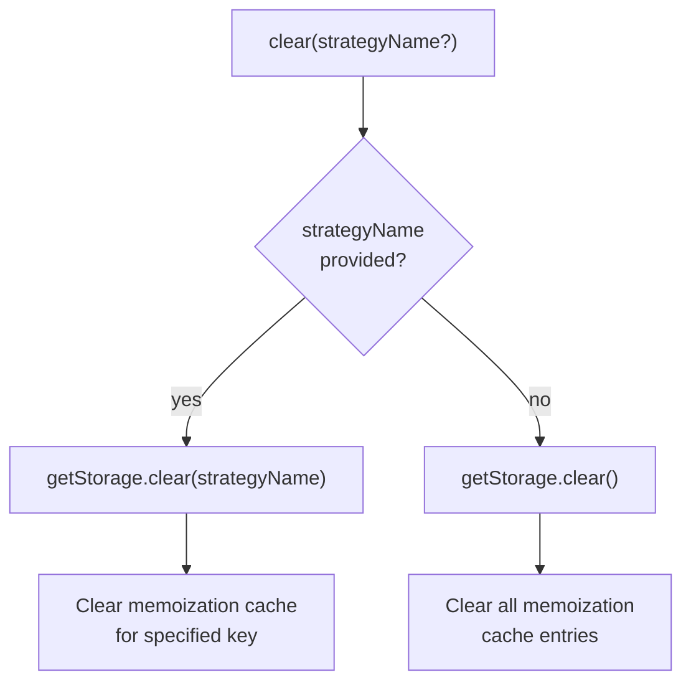

**Sources:** [src/lib/services/markdown/BacktestMarkdownService.ts:508-513](), [src/lib/services/markdown/LiveMarkdownService.ts:712-717](), [src/lib/services/markdown/ScheduleMarkdownService.ts:465-470]()