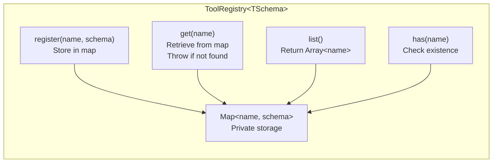
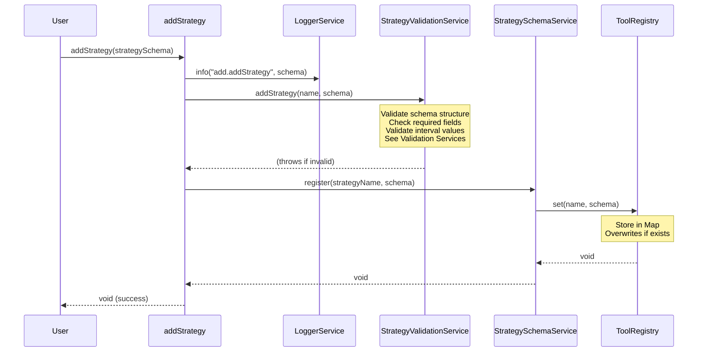
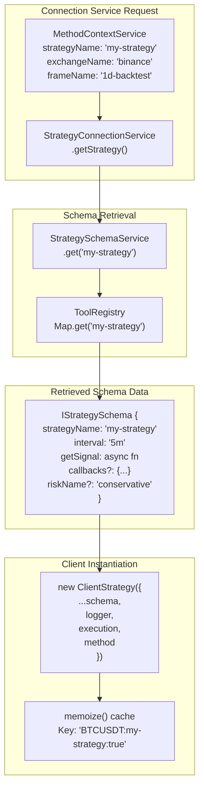
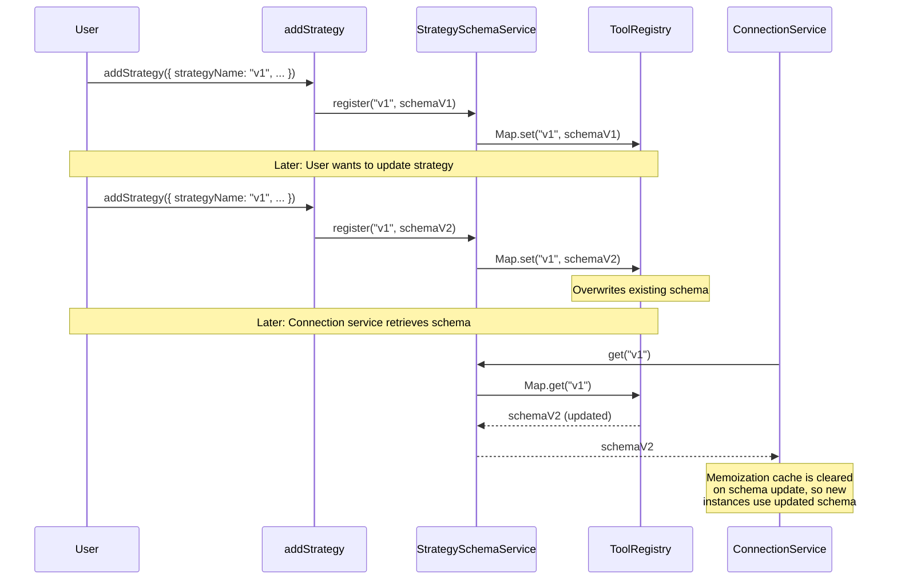

# Schema Services

<details>
<summary>Relevant source files</summary>

The following files were used as context for generating this wiki page:

- [src/config/emitters.ts](src/config/emitters.ts)
- [src/function/add.ts](src/function/add.ts)
- [src/function/event.ts](src/function/event.ts)
- [src/index.ts](src/index.ts)
- [src/lib/core/provide.ts](src/lib/core/provide.ts)
- [src/lib/core/types.ts](src/lib/core/types.ts)
- [src/lib/index.ts](src/lib/index.ts)
- [types.d.ts](types.d.ts)

</details>


Schema Services provide centralized in-memory storage for component configurations registered via the `add*` functions in the public API. Each schema service implements the ToolRegistry pattern to store, retrieve, and validate registered schemas before they are used by connection services to instantiate client implementations.

For information about how schemas are validated before registration, see [Validation Services](#7.4). For information about how registered schemas are used to create client instances, see [Connection Services](#7.2).

---

## Purpose and Responsibilities

Schema Services serve as the **configuration registry layer** in the service architecture. Their responsibilities include:

1. **Storage**: Maintain in-memory registries of validated component schemas
2. **Retrieval**: Provide access to registered schemas by unique name identifiers
3. **Override Detection**: Support replacing existing schemas with updated configurations
4. **Type Safety**: Enforce schema interface contracts through TypeScript typing
5. **Lifecycle Management**: Persist schemas throughout application lifetime (singleton pattern)

Schema Services do **not** perform validation logic (delegated to Validation Services) or instantiate clients (delegated to Connection Services). They are pure storage and retrieval mechanisms.

**Sources**: [src/lib/index.ts:98-112](), [src/function/add.ts:1-444]()

---

## Schema Service Types

The framework provides seven schema services, one for each registrable component type:

| Schema Service | Schema Interface | Name Type | Registration Function | DI Symbol |
|---|---|---|---|---|
| `ExchangeSchemaService` | `IExchangeSchema` | `ExchangeName` | `addExchange()` | `TYPES.exchangeSchemaService` |
| `StrategySchemaService` | `IStrategySchema` | `StrategyName` | `addStrategy()` | `TYPES.strategySchemaService` |
| `FrameSchemaService` | `IFrameSchema` | `FrameName` | `addFrame()` | `TYPES.frameSchemaService` |
| `WalkerSchemaService` | `IWalkerSchema` | `WalkerName` | `addWalker()` | `TYPES.walkerSchemaService` |
| `SizingSchemaService` | `ISizingSchema` | `SizingName` | `addSizing()` | `TYPES.sizingSchemaService` |
| `RiskSchemaService` | `IRiskSchema` | `RiskName` | `addRisk()` | `TYPES.riskSchemaService` |
| `OptimizerSchemaService` | `IOptimizerSchema` | `OptimizerName` | `addOptimizer()` | `TYPES.optimizerSchemaService` |

All schema services follow identical structural patterns but store different schema types.

**Sources**: [src/lib/index.ts:98-112](), [src/lib/core/types.ts:20-28](), [types.d.ts:119-156,261-275,417-426,730-749,956-971]()

---

## Service Architecture Integration

```mermaid
graph TB
    subgraph "Public API Layer"
        ADD_STRAT["addStrategy(schema)"]
        ADD_EXCH["addExchange(schema)"]
        ADD_FRAME["addFrame(schema)"]
        ADD_RISK["addRisk(schema)"]
        ADD_SIZING["addSizing(schema)"]
        ADD_WALKER["addWalker(schema)"]
        ADD_OPT["addOptimizer(schema)"]
    end
    
    subgraph "Validation Layer"
        VAL_STRAT["StrategyValidationService<br/>.addStrategy()"]
        VAL_EXCH["ExchangeValidationService<br/>.addExchange()"]
        VAL_FRAME["FrameValidationService<br/>.addFrame()"]
        VAL_RISK["RiskValidationService<br/>.addRisk()"]
        VAL_SIZING["SizingValidationService<br/>.addSizing()"]
        VAL_WALKER["WalkerValidationService<br/>.addWalker()"]
        VAL_OPT["OptimizerValidationService<br/>.addOptimizer()"]
    end
    
    subgraph "Schema Services (Storage Layer)"
        SCHEMA_STRAT["StrategySchemaService<br/>.register(name, schema)"]
        SCHEMA_EXCH["ExchangeSchemaService<br/>.register(name, schema)"]
        SCHEMA_FRAME["FrameSchemaService<br/>.register(name, schema)"]
        SCHEMA_RISK["RiskSchemaService<br/>.register(name, schema)"]
        SCHEMA_SIZING["SizingSchemaService<br/>.register(name, schema)"]
        SCHEMA_WALKER["WalkerSchemaService<br/>.register(name, schema)"]
        SCHEMA_OPT["OptimizerSchemaService<br/>.register(name, schema)"]
    end
    
    subgraph "In-Memory Storage"
        REGISTRY["ToolRegistry Pattern<br/>Map&lt;name, schema&gt;"]
    end
    
    subgraph "Connection Layer (Consumers)"
        CONN_STRAT["StrategyConnectionService<br/>.getStrategy(name)"]
        CONN_EXCH["ExchangeConnectionService<br/>.getExchange(name)"]
        CONN_FRAME["FrameConnectionService<br/>.getFrame(name)"]
        CONN_RISK["RiskConnectionService<br/>.getRisk(name)"]
        CONN_SIZING["SizingConnectionService<br/>.getSizing(name)"]
        CONN_OPT["OptimizerConnectionService<br/>.getOptimizer(name)"]
    end
    
    ADD_STRAT --> VAL_STRAT
    ADD_STRAT --> SCHEMA_STRAT
    ADD_EXCH --> VAL_EXCH
    ADD_EXCH --> SCHEMA_EXCH
    ADD_FRAME --> VAL_FRAME
    ADD_FRAME --> SCHEMA_FRAME
    ADD_RISK --> VAL_RISK
    ADD_RISK --> SCHEMA_RISK
    ADD_SIZING --> VAL_SIZING
    ADD_SIZING --> SCHEMA_SIZING
    ADD_WALKER --> VAL_WALKER
    ADD_WALKER --> SCHEMA_WALKER
    ADD_OPT --> VAL_OPT
    ADD_OPT --> SCHEMA_OPT
    
    SCHEMA_STRAT --> REGISTRY
    SCHEMA_EXCH --> REGISTRY
    SCHEMA_FRAME --> REGISTRY
    SCHEMA_RISK --> REGISTRY
    SCHEMA_SIZING --> REGISTRY
    SCHEMA_WALKER --> REGISTRY
    SCHEMA_OPT --> REGISTRY
    
    CONN_STRAT -.retrieves.-> SCHEMA_STRAT
    CONN_EXCH -.retrieves.-> SCHEMA_EXCH
    CONN_FRAME -.retrieves.-> SCHEMA_FRAME
    CONN_RISK -.retrieves.-> SCHEMA_RISK
    CONN_SIZING -.retrieves.-> SCHEMA_SIZING
    CONN_OPT -.retrieves.-> SCHEMA_OPT
```



**Diagram: Schema Services in the Service Layer Hierarchy**

This diagram shows how schema services sit between validation and connection layers. The public API functions call validation services for checks, then schema services for storage. Later, connection services retrieve schemas to instantiate clients.

**Sources**: [src/function/add.ts:52-64,101-113,145-151,190-202,256-268,331-343,432-444](), [src/lib/index.ts:74-96,98-112]()

---

## ToolRegistry Pattern

Each schema service implements the **ToolRegistry pattern** for in-memory storage. This pattern provides:

1. **Map-based storage**: `Map<string, TSchema>` where key is the unique name
2. **Register operation**: Store or overwrite schema by name
3. **Retrieve operation**: Get schema by name, throw if not found
4. **List operation**: Return all registered names
5. **Override support**: Replacing existing schemas is allowed

### Core ToolRegistry Interface



**Diagram: ToolRegistry Storage Operations**

The ToolRegistry pattern provides a simple but consistent API across all schema services. Each operation interacts with the underlying Map storage.

**Sources**: [src/lib/index.ts:98-112](), [src/function/add.ts:52-444]()

---

## Registration Flow

The registration flow is consistent across all component types. Here is the detailed flow for strategy registration:



**Diagram: Strategy Registration Sequence**

The registration flow shows the orchestration between validation and storage. Validation occurs first (throwing errors if schema is invalid), followed by storage in the schema service's ToolRegistry.

**Sources**: [src/function/add.ts:52-64]()

---

## Schema Retrieval by Connection Services

Connection services are the primary consumers of schema services. They retrieve stored schemas to create memoized client instances:



**Diagram: Schema Retrieval and Client Instantiation Flow**

Connection services use `MethodContextService` to determine which schema to retrieve, then fetch it from the appropriate schema service. The retrieved schema is combined with runtime dependencies (logger, context services) to instantiate a memoized client.

**Sources**: [src/lib/index.ts:74-96](), [types.d.ts:298-329]()

---

## Individual Schema Service Responsibilities

### StrategySchemaService

**Stores**: `IStrategySchema` configurations with signal generation logic

**Key Fields**:
- `strategyName`: Unique identifier
- `interval`: Signal generation throttle interval (`"1m" | "3m" | "5m" | "15m" | "30m" | "1h"`)
- `getSignal`: Async function returning `ISignalDto | null`
- `callbacks`: Optional lifecycle hooks (`onOpen`, `onClose`, `onActive`, etc.)
- `riskName` / `riskList`: Optional risk profile references

**Used By**: `StrategyConnectionService` to create `ClientStrategy` instances

**Sources**: [src/function/add.ts:52-64](), [types.d.ts:730-749]()

---

### ExchangeSchemaService

**Stores**: `IExchangeSchema` configurations for market data access

**Key Fields**:
- `exchangeName`: Unique identifier
- `getCandles`: Async function fetching OHLCV data
- `formatPrice`: Price formatting for exchange precision
- `formatQuantity`: Quantity formatting for exchange precision
- `callbacks`: Optional hooks (`onCandleData`)

**Used By**: `ExchangeConnectionService` to create `ClientExchange` instances

**Sources**: [src/function/add.ts:101-113](), [types.d.ts:119-156]()

---

### FrameSchemaService

**Stores**: `IFrameSchema` configurations for backtest timeframe generation

**Key Fields**:
- `frameName`: Unique identifier
- `interval`: Timeframe granularity (`"1m" | "3m" | "5m" | ... | "1d" | "3d"`)
- `startDate`: Backtest period start
- `endDate`: Backtest period end
- `callbacks`: Optional hooks (`onTimeframe`)

**Used By**: `FrameConnectionService` to create `ClientFrame` instances

**Sources**: [src/function/add.ts:145-151](), [types.d.ts:261-275]()

---

### RiskSchemaService

**Stores**: `IRiskSchema` configurations for portfolio risk management

**Key Fields**:
- `riskName`: Unique identifier
- `validations`: Array of `IRiskValidation` functions
- `callbacks`: Optional hooks (`onRejected`, `onAllowed`)

**Used By**: `RiskConnectionService` to create `ClientRisk` instances shared across strategies

**Sources**: [src/function/add.ts:331-343](), [types.d.ts:417-426]()

---

### SizingSchemaService

**Stores**: `ISizingSchema` configurations for position sizing calculations

**Key Fields**:
- `sizingName`: Unique identifier
- `method`: Sizing algorithm (`"fixed-percentage" | "kelly-criterion" | "atr-based"`)
- Method-specific parameters (risk percentages, multipliers, constraints)
- `callbacks`: Optional hooks (`onCalculate`)

**Used By**: `SizingConnectionService` to create `ClientSizing` instances

**Sources**: [src/function/add.ts:256-268]()

---

### WalkerSchemaService

**Stores**: `IWalkerSchema` configurations for strategy comparison

**Key Fields**:
- `walkerName`: Unique identifier
- `strategies`: Array of strategy names to compare
- `exchangeName`: Exchange to use for all backtests
- `frameName`: Timeframe to use for all backtests
- `metric`: Optimization metric (default: `"sharpeRatio"`)
- `callbacks`: Optional hooks (`onStrategyComplete`, `onComplete`)

**Used By**: `WalkerCommandService` for orchestrating multi-strategy backtests

**Sources**: [src/function/add.ts:190-202](), [types.d.ts:956-971]()

---

### OptimizerSchemaService

**Stores**: `IOptimizerSchema` configurations for LLM-based strategy generation

**Key Fields**:
- `optimizerName`: Unique identifier
- `rangeTrain`: Array of training periods (generates strategy variants)
- `rangeTest`: Testing period for validation
- `source`: Array of data sources for LLM conversation building
- `getPrompt`: Function generating strategy prompts from conversation history
- `template`: Optional code generation template overrides
- `callbacks`: Optional hooks (`onData`, `onCode`, `onDump`, `onSourceData`)

**Used By**: `OptimizerConnectionService` to create `ClientOptimizer` instances

**Sources**: [src/function/add.ts:432-444]()

---

## Dependency Injection Integration

Schema services are registered in the DI container as singleton instances:

```mermaid
graph TB
    subgraph "DI Registration (src/lib/core/provide.ts)"
        REG_STRAT["provide(TYPES.strategySchemaService,<br/>() => new StrategySchemaService())"]
        REG_EXCH["provide(TYPES.exchangeSchemaService,<br/>() => new ExchangeSchemaService())"]
        REG_FRAME["provide(TYPES.frameSchemaService,<br/>() => new FrameSchemaService())"]
        REG_RISK["provide(TYPES.riskSchemaService,<br/>() => new RiskSchemaService())"]
        REG_SIZING["provide(TYPES.sizingSchemaService,<br/>() => new SizingSchemaService())"]
        REG_WALKER["provide(TYPES.walkerSchemaService,<br/>() => new WalkerSchemaService())"]
        REG_OPT["provide(TYPES.optimizerSchemaService,<br/>() => new OptimizerSchemaService())"]
    end
    
    subgraph "TYPES Symbols (src/lib/core/types.ts)"
        SYM_STRAT["TYPES.strategySchemaService<br/>Symbol('strategySchemaService')"]
        SYM_EXCH["TYPES.exchangeSchemaService<br/>Symbol('exchangeSchemaService')"]
        SYM_FRAME["TYPES.frameSchemaService<br/>Symbol('frameSchemaService')"]
        SYM_RISK["TYPES.riskSchemaService<br/>Symbol('riskSchemaService')"]
        SYM_SIZING["TYPES.sizingSchemaService<br/>Symbol('sizingSchemaService')"]
        SYM_WALKER["TYPES.walkerSchemaService<br/>Symbol('walkerSchemaService')"]
        SYM_OPT["TYPES.optimizerSchemaService<br/>Symbol('optimizerSchemaService')"]
    end
    
    subgraph "Service Injection (src/lib/index.ts)"
        INJ_STRAT["inject&lt;StrategySchemaService&gt;<br/>(TYPES.strategySchemaService)"]
        INJ_EXCH["inject&lt;ExchangeSchemaService&gt;<br/>(TYPES.exchangeSchemaService)"]
        INJ_FRAME["inject&lt;FrameSchemaService&gt;<br/>(TYPES.frameSchemaService)"]
        INJ_RISK["inject&lt;RiskSchemaService&gt;<br/>(TYPES.riskSchemaService)"]
        INJ_SIZING["inject&lt;SizingSchemaService&gt;<br/>(TYPES.sizingSchemaService)"]
        INJ_WALKER["inject&lt;WalkerSchemaService&gt;<br/>(TYPES.walkerSchemaService)"]
        INJ_OPT["inject&lt;OptimizerSchemaService&gt;<br/>(TYPES.optimizerSchemaService)"]
    end
    
    subgraph "Exported Services"
        EXPORT["backtest.strategySchemaService<br/>backtest.exchangeSchemaService<br/>backtest.frameSchemaService<br/>backtest.riskSchemaService<br/>backtest.sizingSchemaService<br/>backtest.walkerSchemaService<br/>backtest.optimizerSchemaService"]
    end
    
    REG_STRAT --> SYM_STRAT
    REG_EXCH --> SYM_EXCH
    REG_FRAME --> SYM_FRAME
    REG_RISK --> SYM_RISK
    REG_SIZING --> SYM_SIZING
    REG_WALKER --> SYM_WALKER
    REG_OPT --> SYM_OPT
    
    SYM_STRAT --> INJ_STRAT
    SYM_EXCH --> INJ_EXCH
    SYM_FRAME --> INJ_FRAME
    SYM_RISK --> INJ_RISK
    SYM_SIZING --> INJ_SIZING
    SYM_WALKER --> INJ_WALKER
    SYM_OPT --> INJ_OPT
    
    INJ_STRAT --> EXPORT
    INJ_EXCH --> EXPORT
    INJ_FRAME --> EXPORT
    INJ_RISK --> EXPORT
    INJ_SIZING --> EXPORT
    INJ_WALKER --> EXPORT
    INJ_OPT --> EXPORT
```



**Diagram: Schema Services Dependency Injection Flow**

Schema services are registered once at application startup via `provide()` calls, creating singleton instances. The `inject()` function retrieves these instances using TYPES symbols, making them available throughout the application.

**Sources**: [src/lib/core/provide.ts:75-83](), [src/lib/core/types.ts:20-28](), [src/lib/index.ts:98-112]()

---

## Schema Override Mechanism

Schema services support **schema replacement** through re-registration. When `register(name, schema)` is called with an existing name, the new schema overwrites the old one:



**Diagram: Schema Override and Cache Invalidation**

When a schema is re-registered, the ToolRegistry overwrites the previous version. Connection services that memoize client instances must invalidate their caches to ensure new instances use the updated schema.

**Sources**: [src/function/add.ts:52-64]()

---

## Error Handling

Schema services throw errors in two primary scenarios:

### Schema Not Found

```typescript
// Attempting to retrieve non-existent schema
const schema = schemaService.get("non-existent-name");
// Throws: Error("Schema 'non-existent-name' not found in StrategySchemaService")
```

This error occurs when connection services attempt to retrieve a schema that was never registered. The error message includes the schema name and service type for debugging.

### Validation Failures

Validation errors occur **before** schema registration, in the validation service layer:

```typescript
addStrategy({
  strategyName: "invalid",
  interval: "INVALID_INTERVAL", // Type error: not a valid SignalInterval
  getSignal: async () => null,
});
// Throws in StrategyValidationService.addStrategy() before reaching schema service
```

Schema services themselves do not perform validation—they assume incoming schemas have already been validated.

**Sources**: [src/function/add.ts:52-64]()

---

## Listing Registered Schemas

Each schema service provides a method to list all registered names:

```typescript
// List all registered strategies
const strategies: StrategyName[] = backtest.strategySchemaService.list();
// Returns: ["strategy-v1", "strategy-v2", "strategy-v3"]

// List all registered exchanges
const exchanges: ExchangeName[] = backtest.exchangeSchemaService.list();
// Returns: ["binance", "coinbase", "kraken"]
```

This is useful for:
- Debugging: Confirming which components are registered
- Dynamic selection: Building UI dropdowns or CLI menus
- Validation: Checking if a name exists before retrieval

The framework also exposes public `list*` functions that wrap schema service list methods:

| Public Function | Schema Service Method | Return Type |
|---|---|---|
| `listStrategies()` | `strategySchemaService.list()` | `StrategyName[]` |
| `listExchanges()` | `exchangeSchemaService.list()` | `ExchangeName[]` |
| `listFrames()` | `frameSchemaService.list()` | `FrameName[]` |
| `listWalkers()` | `walkerSchemaService.list()` | `WalkerName[]` |
| `listSizings()` | `sizingSchemaService.list()` | `SizingName[]` |
| `listRisks()` | `riskSchemaService.list()` | `RiskName[]` |
| `listOptimizers()` | `optimizerSchemaService.list()` | `OptimizerName[]` |

**Sources**: [src/index.ts:20-26]()

---

## Performance Characteristics

Schema services are designed for high-performance retrieval:

### Storage Complexity

| Operation | Time Complexity | Space Complexity |
|---|---|---|
| `register(name, schema)` | O(1) | O(1) per schema |
| `get(name)` | O(1) | O(1) |
| `list()` | O(n) where n = schema count | O(n) |
| `has(name)` | O(1) | O(1) |

### Singleton Pattern

Schema services are **singleton instances** created once at application startup. All `add*` calls modify the same service instance, ensuring:
- **Consistent state**: All parts of the application see the same registered schemas
- **Memory efficiency**: No duplicate schema storage
- **Fast lookups**: Map-based retrieval is O(1) for all consumers

### No Persistence

Schema services store configurations **only in memory**. Schemas are lost on process restart. This design is intentional because:
1. Schemas contain executable code (`getSignal`, `getCandles` functions)
2. Serializing functions is unsafe and non-portable
3. Applications should re-register schemas on startup via configuration files

**Sources**: [src/lib/core/provide.ts:75-83](), [src/lib/index.ts:98-112]()

---

## Usage Patterns

### Basic Registration

```typescript
import { addStrategy } from "backtest-kit";

addStrategy({
  strategyName: "momentum-long",
  interval: "5m",
  getSignal: async (symbol, when) => {
    // Strategy logic here
    return {
      position: "long",
      priceTakeProfit: 51000,
      priceStopLoss: 49000,
      minuteEstimatedTime: 60,
    };
  },
});
```

### Schema Override (Hot Reload)

```typescript
// Initial registration
addStrategy({
  strategyName: "v1",
  interval: "5m",
  getSignal: async () => ({ /* v1 logic */ }),
});

// Later: Update strategy logic
addStrategy({
  strategyName: "v1", // Same name = override
  interval: "3m", // Can change any field
  getSignal: async () => ({ /* v2 logic */ }),
});

// All future executions use updated schema
```

### Conditional Registration

```typescript
const strategies = [
  { name: "conservative", risk: 1 },
  { name: "aggressive", risk: 5 },
];

strategies.forEach(({ name, risk }) => {
  addStrategy({
    strategyName: name,
    interval: "5m",
    riskName: risk > 2 ? "high-risk" : "low-risk",
    getSignal: async () => ({ /* ... */ }),
  });
});
```

**Sources**: [src/function/add.ts:52-64]()

---

## Relationship to Other Service Layers

Schema Services interact with multiple service layers:

| Service Layer | Relationship | Direction |
|---|---|---|
| **Validation Services** | Schemas are validated before storage | Validation → Schema |
| **Connection Services** | Schemas are retrieved to create clients | Schema → Connection |
| **Global Services** | Global services orchestrate validation + storage | Public API → Global → Schema |
| **Core Services** | Core services use connection services (which use schemas) | Schema → Connection → Core |
| **Command Services** | Commands retrieve schemas via connection services | Schema → Connection → Command |

Schema Services are **pure storage** with no business logic. They do not:
- Validate schemas (Validation Services)
- Create client instances (Connection Services)
- Execute strategies (Core Services)
- Orchestrate workflows (Command Services)

**Sources**: [src/lib/index.ts:61-241]()

---

## Summary

Schema Services implement the ToolRegistry pattern to provide centralized, in-memory storage for component configurations. They offer:

1. **Consistent API**: All services follow the `register(name, schema)` and `get(name)` pattern
2. **Type Safety**: Each service stores a specific schema interface
3. **Singleton Instances**: One service instance per application lifecycle
4. **O(1) Retrieval**: Map-based storage for fast lookups
5. **Override Support**: Re-registration replaces existing schemas
6. **DI Integration**: Services are injected via TYPES symbols
7. **No Validation**: Assumes schemas are pre-validated by Validation Services
8. **No Instantiation**: Connection Services handle client creation

Schema Services serve as the **configuration registry** that bridges the public API (`add*` functions) with the internal service architecture (connection/core/command layers).

**Sources**: [src/lib/index.ts:98-112](), [src/lib/core/provide.ts:75-83](), [src/function/add.ts:1-444]()