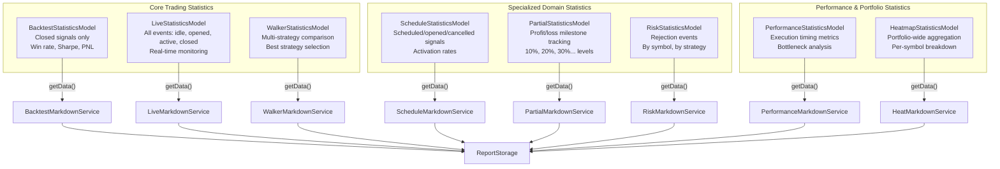
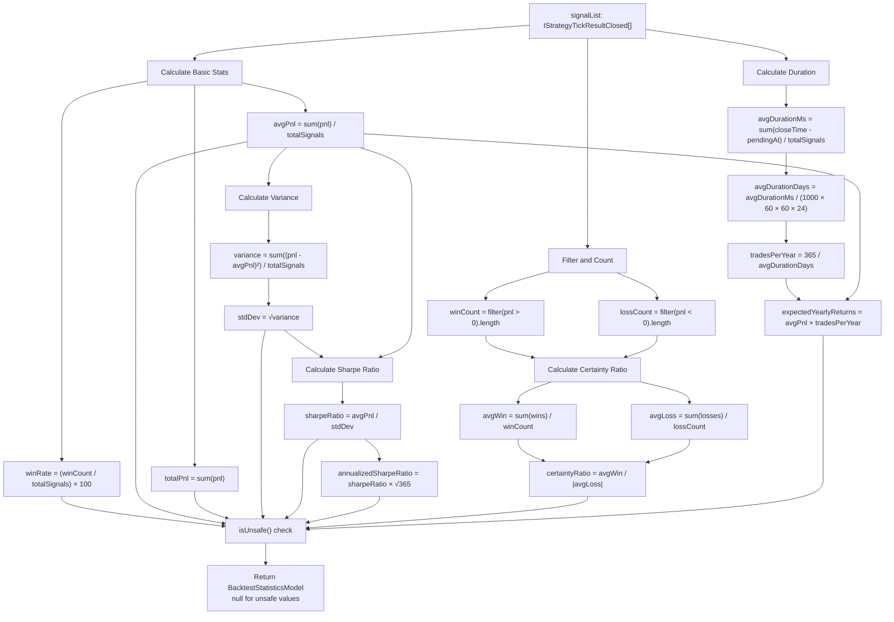
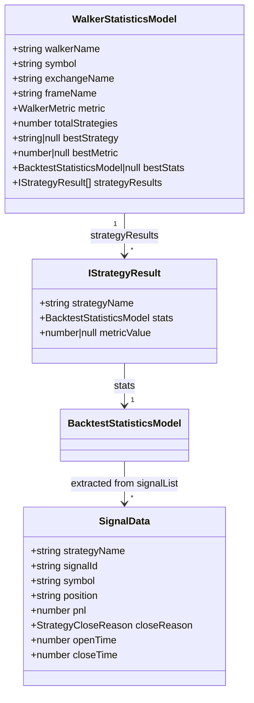
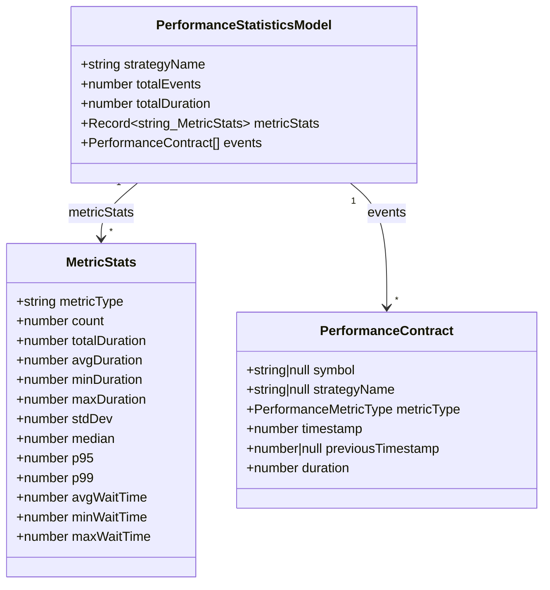
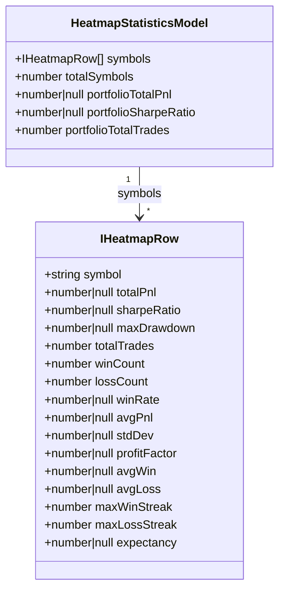

# Statistics Models

## Purpose and Scope

This document describes the eight statistics model interfaces that aggregate and compute performance metrics from trading execution data. These models transform raw event data into actionable statistics including profit/loss calculations, risk-adjusted returns (Sharpe Ratio), win rates, and timing metrics.

For information about the markdown services that generate these statistics, see [Markdown Reports](./40_reporting-monitoring.md). For details on the event system that feeds data into statistics calculation, see [Event Listeners](./40_reporting-monitoring.md).


---

## Statistics Model Hierarchy

The framework provides eight distinct statistics models, each serving a specific reporting domain:




---

## BacktestStatisticsModel

The `BacktestStatisticsModel` interface defines the canonical structure for backtest performance metrics, computed from closed signal data only.

### Structure

| Field | Type | Description | Interpretation |
|-------|------|-------------|----------------|
| `signalList` | `IStrategyTickResultClosed[]` | Array of all closed signals with full details | Raw data source |
| `totalSignals` | `number` | Total count of closed signals | Volume metric |
| `winCount` | `number` | Number of profitable signals (PNL > 0) | Win frequency |
| `lossCount` | `number` | Number of losing signals (PNL < 0) | Loss frequency |
| `winRate` | `number \| null` | Percentage of winning signals (0-100) | **Higher is better** |
| `avgPnl` | `number \| null` | Average PNL per signal as percentage | **Higher is better** |
| `totalPnl` | `number \| null` | Cumulative PNL across all signals | **Higher is better** |
| `stdDev` | `number \| null` | Standard deviation of returns (volatility) | **Lower is better** |
| `sharpeRatio` | `number \| null` | Risk-adjusted return (avgPnl / stdDev) | **Higher is better** |
| `annualizedSharpeRatio` | `number \| null` | Sharpe × √365 | **Higher is better** |
| `certaintyRatio` | `number \| null` | avgWin / \|avgLoss\| | **Higher is better** |
| `expectedYearlyReturns` | `number \| null` | Projected annual returns based on trade frequency | **Higher is better** |


### Calculation Implementation

The calculation occurs in `BacktestMarkdownService.ts:100-168` within the `ReportStorage.getData()` method:




### Safe Math Enforcement

All numeric metrics return `null` if the calculated value is `NaN`, `Infinity`, or non-finite. The `isUnsafe()` helper function `BacktestMarkdownService.ts:56-67` performs validation:

```typescript
function isUnsafe(value: number | null): boolean {
  if (typeof value !== "number") return true;
  if (isNaN(value)) return true;
  if (!isFinite(value)) return true;
  return false;
}
```

This ensures reports display "N/A" instead of invalid numeric values.


---

## LiveStatisticsModel

The `LiveStatisticsModel` extends backtest statistics with real-time event tracking, including idle and active states.

### Structure Differences

| Field | Type | Description |
|-------|------|-------------|
| `eventList` | `TickEvent[]` | All events: idle, opened, active, closed |
| `totalEvents` | `number` | Count of all events (not just closed) |
| `totalClosed` | `number` | Count of closed signals only |
| *(inherits)* | | All `BacktestStatisticsModel` fields |

The `TickEvent` type (defined in `src/model/LiveStatistics.model.ts`) supports discriminated union based on `action` field:

- `"idle"`: No active signal
- `"opened"`: Signal just created
- `"active"`: Signal being monitored (with `percentTp`, `percentSl`)
- `"closed"`: Signal completed (with `pnl`, `closeReason`, `duration`)


### Event Replacement Strategy

The `LiveMarkdownService.ReportStorage` implements intelligent event deduplication to prevent memory bloat:

1. **Idle events**: Replace last idle event if no opened/active events follow it `LiveMarkdownService.ts:88-114`
2. **Active events**: Replace last active event with same `signalId` `LiveMarkdownService.ts:148-182`
3. **Opened/Closed events**: Always insert new `LiveMarkdownService.ts:122-140`, `LiveMarkdownService.ts:189-215`

This maintains a 250-event maximum per symbol-strategy pair `LiveMarkdownService.ts:72` while preserving event history.


---

## WalkerStatisticsModel

The `WalkerStatisticsModel` aggregates results from multiple strategy backtests for comparison.

### Structure




### Calculation Flow

The `WalkerMarkdownService.ReportStorage` `WalkerMarkdownService.ts:124-192` accumulates strategy results incrementally:

1. Each `WalkerContract` event `WalkerMarkdownService.ts:144-158` adds a strategy result
2. Best strategy is tracked by comparing `metricValue` fields
3. `getData()` returns final aggregated model with all strategy results sorted by metric

The `WalkerMetric` type defines comparison criteria:

```typescript
type WalkerMetric = 
  | "sharpeRatio" 
  | "annualizedSharpeRatio" 
  | "winRate" 
  | "totalPnl" 
  | "certaintyRatio" 
  | "avgPnl" 
  | "expectedYearlyReturns";
```

**Higher values always indicate better performance** for all metrics.


---

## ScheduleStatisticsModel

The `ScheduleStatisticsModel` tracks scheduled signal lifecycle events: creation, activation, and cancellation.

### Structure

| Field | Type | Description |
|-------|------|-------------|
| `eventList` | `ScheduledEvent[]` | All scheduled/opened/cancelled events |
| `totalEvents` | `number` | Count of all events |
| `totalScheduled` | `number` | Count of scheduled signals |
| `totalOpened` | `number` | Count of activated signals |
| `totalCancelled` | `number` | Count of cancelled signals |
| `cancellationRate` | `number \| null` | `(totalCancelled / totalScheduled) × 100` |
| `activationRate` | `number \| null` | `(totalOpened / totalScheduled) × 100` |
| `avgWaitTime` | `number \| null` | Average minutes until cancellation |
| `avgActivationTime` | `number \| null` | Average minutes until activation |


### Event Processing Logic

The service `ScheduleMarkdownService.ts:351-369` filters events intelligently:

- **Scheduled events**: Directly added `ScheduleMarkdownService.ts:358-359`
- **Opened events**: Only added if `scheduledAt ≠ pendingAt` `ScheduleMarkdownService.ts:360-366` (indicates it was scheduled first)
- **Cancelled events**: Always added `ScheduleMarkdownService.ts:367-368`

This prevents double-counting immediate signals that were never scheduled.


---

## PartialStatisticsModel

The `PartialStatisticsModel` tracks profit and loss milestone events (10%, 20%, 30%, etc.) during active signal monitoring.

### Structure

| Field | Type | Description |
|-------|------|-------------|
| `eventList` | `PartialEvent[]` | All profit/loss milestone events |
| `totalEvents` | `number` | Count of all milestone events |
| `totalProfit` | `number` | Count of profit milestone events |
| `totalLoss` | `number` | Count of loss milestone events |

Each `PartialEvent` contains:

| Field | Type | Description |
|-------|------|-------------|
| `timestamp` | `number` | Event timestamp in milliseconds |
| `action` | `"profit" \| "loss"` | Event type |
| `symbol` | `string` | Trading pair |
| `strategyName` | `string` | Strategy name |
| `signalId` | `string` | Signal identifier |
| `position` | `"long" \| "short"` | Trade direction |
| `currentPrice` | `number` | Market price at milestone |
| `level` | `PartialLevel` | Milestone level (10, 20, ..., 100) |
| `backtest` | `boolean` | Execution mode |


### Deduplication via Set-Based Tracking

Partial events are emitted by `ClientPartial` `types.d.ts:548-639` which uses Set-based deduplication to ensure each level emits only once per signal. The markdown service simply accumulates these deduplicated events.


---

## RiskStatisticsModel

The `RiskStatisticsModel` aggregates risk rejection events when signals fail validation checks.

### Structure

| Field | Type | Description |
|-------|------|-------------|
| `eventList` | `RiskEvent[]` | All rejection events |
| `totalRejections` | `number` | Count of rejected signals |
| `bySymbol` | `Record<string, number>` | Rejection count per symbol |
| `byStrategy` | `Record<string, number>` | Rejection count per strategy |

Each `RiskEvent` contains:

| Field | Type | Description |
|-------|------|-------------|
| `symbol` | `string` | Trading pair |
| `strategyName` | `string` | Strategy name |
| `timestamp` | `number` | Rejection timestamp |
| `activePositionCount` | `number` | Active positions at rejection |
| `comment` | `string` | Rejection reason |


### Aggregation Logic

The `getData()` method `RiskMarkdownService.ts:75-99` iterates through all rejection events and builds aggregation maps:

```typescript
const bySymbol: Record<string, number> = {};
const byStrategy: Record<string, number> = {};

for (const event of this._eventList) {
  bySymbol[event.symbol] = (bySymbol[event.symbol] || 0) + 1;
  byStrategy[event.strategyName] = (byStrategy[event.strategyName] || 0) + 1;
}
```

This enables identification of which symbols or strategies trigger rejections most frequently.


---

## PerformanceStatisticsModel

The `PerformanceStatisticsModel` aggregates execution timing metrics for profiling and bottleneck detection.

### Structure




### Percentile Calculation

The service `PerformanceMarkdownService.ts:68-72` includes a percentile helper:

```typescript
function percentile(sortedArray: number[], p: number): number {
  if (sortedArray.length === 0) return 0;
  const index = Math.ceil((sortedArray.length * p) / 100) - 1;
  return sortedArray[Math.max(0, index)];
}
```

This computes P95 and P99 response times for each `PerformanceMetricType`:

- `"backtest.getSignal"`: Signal generation duration
- `"backtest.tick"`: Tick processing duration
- `"backtest.backtest"`: Fast backtest duration
- `"live.tick"`: Live tick processing duration
- And others defined by the system


---

## HeatmapStatisticsModel

The `HeatmapStatisticsModel` provides portfolio-wide aggregation across all symbols for a strategy.

### Structure




### Per-Symbol Calculation

Each `IHeatmapRow` `HeatMarkdownService.ts:115-271` is calculated independently from the symbol's closed signals:

1. **Basic metrics**: Win rate, total PNL, average PNL
2. **Volatility**: Standard deviation
3. **Risk-adjusted**: Sharpe Ratio
4. **Drawdown**: Maximum consecutive loss from peak
5. **Win/Loss analysis**: Profit factor, average win/loss
6. **Streaks**: Maximum consecutive wins/losses
7. **Expectancy**: `(winRate × avgWin) + (lossRate × avgLoss)`

All metrics undergo safe math validation `HeatMarkdownService.ts:242-251`.


### Portfolio Aggregation

Portfolio-wide metrics `HeatMarkdownService.ts:278-330` are computed as:

- **portfolioTotalPnl**: Sum of all symbol PNLs
- **portfolioSharpeRatio**: Trade-weighted average of symbol Sharpe Ratios
- **portfolioTotalTrades**: Sum of all symbol trade counts

Symbols are sorted by Sharpe Ratio descending (best performers first, nulls last).


---

## Common Calculation Patterns

All statistics models follow consistent implementation patterns across the markdown services.

### Pattern 1: ReportStorage Classes

Each markdown service contains an internal `ReportStorage` class that:

1. Accumulates raw event data in private arrays/maps
2. Implements `getData()` returning the statistics model
3. Implements `getReport()` generating markdown tables
4. Implements `dump()` saving reports to disk

```mermaid
graph LR
    A["Event Emitter<br/>(signalEmitter, etc.)"] --> B["MarkdownService.tick()"]
    B --> C["ReportStorage.addEvent()"]
    C --> D["_eventList / _signalList<br/>(internal storage)"]
    D --> E["ReportStorage.getData()"]
    E --> F["StatisticsModel"]
    F --> G["ReportStorage.getReport()"]
    G --> H["Markdown String"]
    H --> I["ReportStorage.dump()"]
    I --> J["File System<br/>(./dump/*)"]
```




### Pattern 2: Memoized Storage Factory

Each markdown service uses `memoize()` from `functools-kit` to cache storage instances per key:

```typescript
private getStorage = memoize<(symbol: string, strategyName: string) => ReportStorage>(
  ([symbol, strategyName]) => `${symbol}:${strategyName}`,
  () => new ReportStorage()
);
```

This ensures each symbol-strategy pair has isolated storage with a maximum of 250 events `BacktestMarkdownService.ts:70`, `LiveMarkdownService.ts:72`.


### Pattern 3: Safe Math Validation

All statistics models return `null` for unsafe numeric values. Each service defines an `isUnsafe()` helper:

```typescript
function isUnsafe(value: number | null): boolean {
  if (typeof value !== "number") return true;
  if (isNaN(value)) return true;
  if (!isFinite(value)) return true;
  return false;
}
```

This is applied to all calculated metrics before returning the model:

```typescript
return {
  // ...
  winRate: isUnsafe(winRate) ? null : winRate,
  avgPnl: isUnsafe(avgPnl) ? null : avgPnl,
  sharpeRatio: isUnsafe(sharpeRatio) ? null : sharpeRatio,
  // ...
};
```

Markdown reports display "N/A" for null values `BacktestMarkdownService.ts:215-222`.


### Pattern 4: Singleshot Initialization

All markdown services use `singleshot()` from `functools-kit` to ensure event subscription happens exactly once:

```typescript
protected init = singleshot(async () => {
  this.loggerService.log("backtestMarkdownService init");
  signalBacktestEmitter.subscribe(this.tick);
});
```

This prevents duplicate subscriptions even if multiple instances are created or methods called multiple times.


---

## Statistics Model Export and Usage

All statistics models are exported from the main package entry point `src/index.ts:139-146`:

```typescript
export { BacktestStatisticsModel } from "./model/BacktestStatistics.model";
export { LiveStatisticsModel } from "./model/LiveStatistics.model";
export { HeatmapStatisticsModel } from "./model/HeatmapStatistics.model";
export { ScheduleStatisticsModel } from "./model/ScheduleStatistics.model";
export { PerformanceStatisticsModel } from "./model/PerformanceStatistics.model";
export { WalkerStatisticsModel } from "./model/WalkerStatistics.model";
export { PartialStatisticsModel } from "./model/PartialStatistics.model";
export { RiskStatisticsModel } from "./model/RiskStatistics.model";
```

These TypeScript interfaces are used by:

1. Markdown services for type-safe statistics calculation
2. Public API classes (`Backtest`, `Live`, `Walker`, etc.) for `getData()` return types
3. External consumers for type checking and autocomplete

All models are accessed via the public API classes documented in [Reporting Classes API](./56_api-reference.md).

