# Logic Services

Logic Services implement the core execution orchestration layer for the three operational modes: Backtest, Live, and Walker. These services manage the temporal progression, signal lifecycle coordination, and result streaming for each execution mode.

This page documents the Logic Service architecture, the Private/Public service separation pattern, and the AsyncGenerator streaming model. For information about Strategy execution logic, see [ClientStrategy](./47_Signal_States.md). For command validation and delegation, see [Service Architecture Overview](./39_Service_Architecture_Overview.md).

## Architecture Overview

Logic Services are organized into three execution mode families, each with Private and Public service tiers:

| Execution Mode | Private Service | Public Service | Purpose |
|---|---|---|---|
| Backtest | `BacktestLogicPrivateService` | `BacktestLogicPublicService` | Historical simulation with timeframe iteration |
| Live | `LiveLogicPrivateService` | `LiveLogicPublicService` | Real-time trading with crash recovery |
| Walker | `WalkerLogicPrivateService` | `WalkerLogicPublicService` | Strategy comparison with metric optimization |

**Private Services** implement the core execution algorithms using AsyncGenerator streaming. They have no context management and require explicit parameters.

**Public Services** wrap Private Services with `MethodContextService` to provide implicit context propagation, allowing downstream functions to access `strategyName`, `exchangeName`, and `frameName` without explicit parameters.



**Sources:** [src/lib/services/logic/private/BacktestLogicPrivateService.ts:1-387](), [src/lib/services/logic/private/LiveLogicPrivateService.ts:1-134](), [src/lib/services/logic/private/WalkerLogicPrivateService.ts:1-255]()

## Private vs Public Service Separation

The Logic Service architecture implements a two-tier separation pattern where Private Services contain pure execution algorithms and Public Services add context management.

### Private Service Characteristics

Private Services implement the core execution logic with these properties:

- **No Context Dependencies**: All parameters are explicitly passed to methods
- **AsyncGenerator Streaming**: Results are yielded incrementally for memory efficiency
- **Dependency Injection**: Services are injected via `inject<T>(TYPES.*)` pattern
- **Event Emission**: Progress, performance, and error events are emitted directly
- **No Context Wrapping**: Calls to Global Services pass context explicitly

[src/lib/services/logic/private/BacktestLogicPrivateService.ts:33-46]() demonstrates the Private Service dependency pattern:

```typescript
export class BacktestLogicPrivateService {
  private readonly loggerService = inject<LoggerService>(TYPES.loggerService);
  private readonly strategyGlobalService = inject<StrategyGlobalService>(
    TYPES.strategyGlobalService
  );
  private readonly exchangeGlobalService = inject<ExchangeGlobalService>(
    TYPES.exchangeGlobalService
  );
  private readonly frameGlobalService = inject<FrameGlobalService>(
    TYPES.frameGlobalService
  );
  private readonly methodContextService = inject<TMethodContextService>(
    TYPES.methodContextService
  );
```

### Public Service Characteristics

Public Services wrap Private Services with context injection:

- **Context Propagation**: Wraps Private Service calls with `MethodContextService.bind()`
- **Simplified API**: Accepts `context` object instead of explicit service references
- **Consistent Interface**: All Public Services expose `run(symbol, context)` signature
- **Transparent Delegation**: Context is injected, then Private Service is called

The Public Service pattern is implemented in [src/lib/services/logic/public/BacktestLogicPublicService.ts]() using function composition:

```typescript
public readonly run = (
  symbol: string,
  context: {
    strategyName: string;
    exchangeName: string;
    frameName: string;
  }
): AsyncGenerator<IStrategyBacktestResult> =>
  this.methodContextService.bind(
    context,
    () => this.backtestLogicPrivateService.run(symbol)
  );
```

This pattern allows downstream functions like `getCandles()` and `getSignal()` to access context implicitly through `MethodContextService`.

**Sources:** [src/lib/services/logic/public/BacktestLogicPublicService.ts](), [src/lib/services/logic/public/LiveLogicPublicService.ts](), [src/lib/services/logic/private/BacktestLogicPrivateService.ts:33-46]()

## BacktestLogicPrivateService

`BacktestLogicPrivateService` implements historical simulation through sequential timeframe iteration with skip-ahead optimization.

### Execution Flow



**Sources:** [src/lib/services/logic/private/BacktestLogicPrivateService.ts:62-384]()

### Key Implementation Details

**Timeframe Iteration**: [src/lib/services/logic/private/BacktestLogicPrivateService.ts:69-74]() loads the complete date range from `FrameGlobalService` and iterates sequentially:

```typescript
const timeframes = await this.frameGlobalService.getTimeframe(
  symbol,
  this.methodContextService.context.frameName
);
```

**Signal Detection**: [src/lib/services/logic/private/BacktestLogicPrivateService.ts:96]() calls `tick()` with `backtest=true` to check for signal generation at each timeframe:

```typescript
result = await this.strategyGlobalService.tick(symbol, when, true);
```

**Scheduled Signal Handling**: [src/lib/services/logic/private/BacktestLogicPrivateService.ts:113-155]() fetches extended candle range for scheduled signals to monitor activation/cancellation plus full signal duration:

```typescript
const candlesNeeded = GLOBAL_CONFIG.CC_SCHEDULE_AWAIT_MINUTES + signal.minuteEstimatedTime + 1;
candles = await this.exchangeGlobalService.getNextCandles(
  symbol,
  "1m",
  candlesNeeded,
  when,
  true
);
```

**Skip-Ahead Optimization**: [src/lib/services/logic/private/BacktestLogicPrivateService.ts:227-232]() advances the timeframe iterator to the signal close time, avoiding redundant `tick()` calls:

```typescript
while (
  i < timeframes.length &&
  timeframes[i].getTime() < backtestResult.closeTimestamp
) {
  i++;
}
```

**Performance Tracking**: [src/lib/services/logic/private/BacktestLogicPrivateService.ts:214-224]() emits granular timing metrics for signal processing duration:

```typescript
await performanceEmitter.next({
  timestamp: currentTimestamp,
  previousTimestamp: previousEventTimestamp,
  metricType: "backtest_signal",
  duration: signalEndTime - signalStartTime,
  strategyName: this.methodContextService.context.strategyName,
  exchangeName: this.methodContextService.context.exchangeName,
  symbol,
  backtest: true,
});
```

### Error Handling

All operations are wrapped in try-catch blocks that emit errors via `errorEmitter` and continue iteration:

- [src/lib/services/logic/private/BacktestLogicPrivateService.ts:95-110](): `tick()` failures skip the current timeframe
- [src/lib/services/logic/private/BacktestLogicPrivateService.ts:133-155](): `getNextCandles()` failures skip signal processing
- [src/lib/services/logic/private/BacktestLogicPrivateService.ts:175-195](): `backtest()` failures skip signal result

**Sources:** [src/lib/services/logic/private/BacktestLogicPrivateService.ts:62-384]()

## LiveLogicPrivateService

`LiveLogicPrivateService` implements real-time trading through an infinite polling loop with crash recovery support.

### Execution Flow



**Sources:** [src/lib/services/logic/private/LiveLogicPrivateService.ts:61-130]()

### Key Implementation Details

**Infinite Loop**: [src/lib/services/logic/private/LiveLogicPrivateService.ts:68]() implements continuous monitoring that never completes:

```typescript
while (true) {
  const when = new Date();
  // ... tick logic
  await sleep(TICK_TTL);
}
```

**Real-Time Timestamps**: [src/lib/services/logic/private/LiveLogicPrivateService.ts:70]() creates fresh Date objects for each iteration, ensuring time progresses naturally:

```typescript
const when = new Date();
```

**Tick Interval**: [src/lib/services/logic/private/LiveLogicPrivateService.ts:12]() defines a 61-second polling interval (slightly over 1 minute to avoid clock skew issues):

```typescript
const TICK_TTL = 1 * 60 * 1_000 + 1;
```

**Selective Yielding**: [src/lib/services/logic/private/LiveLogicPrivateService.ts:110-126]() filters tick results, only yielding `opened` and `closed` actions while sleeping for `idle`, `active`, and `scheduled`:

```typescript
if (result.action === "active") {
  await sleep(TICK_TTL);
  continue;
}

if (result.action === "idle") {
  await sleep(TICK_TTL);
  continue;
}

if (result.action === "scheduled") {
  await sleep(TICK_TTL);
  continue;
}

// Yield opened, closed results
yield result as IStrategyTickResultClosed | IStrategyTickResultOpened;
```

**Crash Recovery**: State recovery happens transparently in `ClientStrategy.waitForInit()` which is called by `StrategyGlobalService` before the first `tick()`. The Live Logic Service has no explicit recovery logic because persistence is handled by `ClientStrategy`.

**Error Resilience**: [src/lib/services/logic/private/LiveLogicPrivateService.ts:75-88]() catches all tick errors, emits them, sleeps, and continues the loop:

```typescript
try {
  result = await this.strategyGlobalService.tick(symbol, when, false);
} catch (error) {
  this.loggerService.warn(
    "liveLogicPrivateService tick failed, retrying after sleep",
    { symbol, when: when.toISOString(), error: errorData(error) }
  );
  await errorEmitter.next(error);
  await sleep(TICK_TTL);
  continue;
}
```

**Sources:** [src/lib/services/logic/private/LiveLogicPrivateService.ts:1-134]()

## WalkerLogicPrivateService

`WalkerLogicPrivateService` orchestrates strategy comparison by running multiple backtest executions sequentially and tracking the best-performing strategy by a configurable metric.

### Execution Flow


**Sources:** [src/lib/services/logic/private/WalkerLogicPrivateService.ts:70-251]()

### Key Implementation Details

**Sequential Execution**: [src/lib/services/logic/private/WalkerLogicPrivateService.ts:107-228]() runs one backtest at a time to avoid resource contention:

```typescript
for (const strategyName of strategies) {
  const iterator = this.backtestLogicPublicService.run(symbol, {
    strategyName,
    exchangeName: context.exchangeName,
    frameName: context.frameName,
  });
  
  result = await resolveDocuments(iterator);
  // ... process results
}
```

**Backtest Delegation**: [src/lib/services/logic/private/WalkerLogicPrivateService.ts:117-121]() uses `BacktestLogicPublicService` to execute each strategy with proper context injection:

```typescript
const iterator = this.backtestLogicPublicService.run(symbol, {
  strategyName,
  exchangeName: context.exchangeName,
  frameName: context.frameName,
});
```

**Statistics Extraction**: [src/lib/services/logic/private/WalkerLogicPrivateService.ts:165]() retrieves computed metrics from `BacktestMarkdownService`:

```typescript
const stats = await this.backtestMarkdownService.getData(symbol, strategyName);
```

**Metric Comparison**: [src/lib/services/logic/private/WalkerLogicPrivateService.ts:167-186]() extracts and validates the configured metric, updating best strategy if superior:

```typescript
const value = stats[metric];
const metricValue =
  value !== null &&
  value !== undefined &&
  typeof value === "number" &&
  !isNaN(value) &&
  isFinite(value)
    ? value
    : null;

const isBetter =
  bestMetric === null ||
  (metricValue !== null && metricValue > bestMetric);

if (isBetter && metricValue !== null) {
  bestMetric = metricValue;
  bestStrategy = strategyName;
}
```

**Progress Yielding**: [src/lib/services/logic/private/WalkerLogicPrivateService.ts:190-227]() constructs and yields `WalkerContract` after each strategy completes:

```typescript
const walkerContract: WalkerContract = {
  walkerName: context.walkerName,
  exchangeName: context.exchangeName,
  frameName: context.frameName,
  symbol,
  strategyName,
  stats,
  metricValue,
  metric,
  bestMetric,
  bestStrategy,
  strategiesTested,
  totalStrategies: strategies.length,
};

await walkerEmitter.next(walkerContract);
yield walkerContract;
```

**Schema Callbacks**: [src/lib/services/logic/private/WalkerLogicPrivateService.ts:109-111](), [src/lib/services/logic/private/WalkerLogicPrivateService.ts:217-224](), and [src/lib/services/logic/private/WalkerLogicPrivateService.ts:246-248]() invoke optional lifecycle callbacks:

- `onStrategyStart(strategyName, symbol)`: Before backtest begins
- `onStrategyComplete(strategyName, symbol, stats, metricValue)`: After backtest finishes
- `onStrategyError(strategyName, symbol, error)`: If backtest fails
- `onComplete(finalResults)`: After all strategies complete

**Cancellation Support**: [src/lib/services/logic/private/WalkerLogicPrivateService.ts:96-104]() listens for `walkerStopSubject` events to allow external cancellation:

```typescript
const listenStop = walkerStopSubject
  .filter((data) => {
    let isOk = true;
    isOk = isOk && data.symbol === symbol;
    isOk = isOk && data.strategyName === pendingStrategy;
    return isOk;
  })
  .map(() => CANCEL_SYMBOL)
  .toPromise();
```

**Sources:** [src/lib/services/logic/private/WalkerLogicPrivateService.ts:70-251]()

## AsyncGenerator Streaming Architecture

All Logic Services use AsyncGenerator functions (`async *`) for memory-efficient result streaming with support for early termination.

### AsyncGenerator Pattern



**Sources:** [src/lib/services/logic/private/BacktestLogicPrivateService.ts:62](), [src/lib/services/logic/private/LiveLogicPrivateService.ts:61](), [src/lib/services/logic/private/WalkerLogicPrivateService.ts:70]()

### Benefits of AsyncGenerator Pattern

| Aspect | Traditional Array Return | AsyncGenerator Streaming |
|---|---|---|
| Memory Usage | Accumulates all results in memory | Processes one result at a time |
| Time to First Result | Must complete entire execution | Yields results incrementally |
| Early Termination | Not supported | Consumer can `break` to cancel |
| Progress Monitoring | No visibility until complete | Real-time progress via yielded results |
| Error Recovery | Single point of failure | Can catch errors per iteration |

### Streaming Execution Models

**Backtest Mode** - Finite Generator:
- Yields `IStrategyBacktestResult` for each closed signal
- Completes when all timeframes are processed
- Consumer receives final result when generator exhausts

**Live Mode** - Infinite Generator:
- Yields `IStrategyTickResultOpened` and `IStrategyTickResultClosed`
- Never completes (infinite `while(true)` loop)
- Consumer must handle continuous stream

**Walker Mode** - Progress Generator:
- Yields `WalkerContract` after each strategy completes
- Shows incremental progress with `strategiesTested` counter
- Completes when all strategies are compared

### Consumer Patterns

Consumers iterate Logic Services using `for await...of`:

```typescript
// Backtest: Collect all results
const results = [];
for await (const result of backtestLogic.run("BTCUSDT")) {
  results.push(result);
  console.log("Closed:", result.closeReason, result.pnl.pnlPercentage);
}

// Live: Infinite monitoring
for await (const result of liveLogic.run("BTCUSDT")) {
  if (result.action === "opened") {
    console.log("New signal:", result.signal.id);
  }
  if (result.action === "closed") {
    console.log("PNL:", result.pnl.pnlPercentage);
  }
}

// Walker: Progress tracking
for await (const progress of walkerLogic.run("BTCUSDT", strategies, metric, ctx)) {
  console.log(`Progress: ${progress.strategiesTested}/${progress.totalStrategies}`);
  console.log(`Best: ${progress.bestStrategy} = ${progress.bestMetric}`);
}
```

Early termination example from [src/lib/services/logic/private/BacktestLogicPrivateService.ts:58-59]():

```typescript
for await (const result of backtestLogic.run("BTCUSDT")) {
  if (result.pnl.pnlPercentage < -10) break; // Cancel remaining execution
}
```

**Sources:** [src/lib/services/logic/private/BacktestLogicPrivateService.ts:54-60](), [src/lib/services/logic/private/LiveLogicPrivateService.ts:48-59](), [src/lib/services/logic/private/WalkerLogicPrivateService.ts:54-68]()

## Event Emission

Logic Services emit events at key execution points for observability and progress tracking.

### Event Types by Service

| Service | Events Emitted | Purpose |
|---|---|---|
| `BacktestLogicPrivateService` | `progressBacktestEmitter`<br/>`performanceEmitter`<br/>`errorEmitter` | Frame progress<br/>Timing metrics<br/>Error logging |
| `LiveLogicPrivateService` | `performanceEmitter`<br/>`errorEmitter` | Tick timing<br/>Error logging |
| `WalkerLogicPrivateService` | `progressWalkerEmitter`<br/>`walkerEmitter`<br/>`walkerCompleteSubject`<br/>`errorEmitter` | Strategy progress<br/>Current best<br/>Final results<br/>Error logging |

### Progress Emission

**Backtest Progress**: [src/lib/services/logic/private/BacktestLogicPrivateService.ts:84-92]() emits frame-level progress with completion percentage:

```typescript
await progressBacktestEmitter.next({
  exchangeName: this.methodContextService.context.exchangeName,
  strategyName: this.methodContextService.context.strategyName,
  symbol,
  totalFrames,
  processedFrames: i,
  progress: totalFrames > 0 ? i / totalFrames : 0,
});
```

**Walker Progress**: [src/lib/services/logic/private/WalkerLogicPrivateService.ts:206-214]() emits strategy-level progress:

```typescript
await progressWalkerEmitter.next({
  walkerName: context.walkerName,
  exchangeName: context.exchangeName,
  frameName: context.frameName,
  symbol,
  totalStrategies: strategies.length,
  processedStrategies: strategiesTested,
  progress: strategies.length > 0 ? strategiesTested / strategies.length : 0,
});
```

### Performance Metrics

All Logic Services emit granular timing metrics via `performanceEmitter`:

- `metricType`: Identifies the operation type
  - `"backtest_timeframe"`: Time per timeframe iteration
  - `"backtest_signal"`: Time to process one signal
  - `"backtest_total"`: Total backtest duration
  - `"live_tick"`: Time per live tick
- `duration`: Elapsed time in milliseconds
- `timestamp`: Current timestamp
- `previousTimestamp`: Previous event timestamp (for interval calculation)
- `strategyName`, `exchangeName`, `symbol`, `backtest`: Context metadata

Example from [src/lib/services/logic/private/BacktestLogicPrivateService.ts:214-224]():

```typescript
await performanceEmitter.next({
  timestamp: currentTimestamp,
  previousTimestamp: previousEventTimestamp,
  metricType: "backtest_signal",
  duration: signalEndTime - signalStartTime,
  strategyName: this.methodContextService.context.strategyName,
  exchangeName: this.methodContextService.context.exchangeName,
  symbol,
  backtest: true,
});
```

**Sources:** [src/lib/services/logic/private/BacktestLogicPrivateService.ts:84-92](), [src/lib/services/logic/private/BacktestLogicPrivateService.ts:214-224](), [src/lib/services/logic/private/LiveLogicPrivateService.ts:98-108](), [src/lib/services/logic/private/WalkerLogicPrivateService.ts:206-214]()

## Integration with Other Services

Logic Services coordinate execution by orchestrating calls to Global Services, Schema Services, and Markdown Services.


**Sources:** [src/lib/services/logic/private/BacktestLogicPrivateService.ts:35-46](), [src/lib/services/logic/private/LiveLogicPrivateService.ts:31-37](), [src/lib/services/logic/private/WalkerLogicPrivateService.ts:31-40]()

### Service Dependencies

**BacktestLogicPrivateService Dependencies**:
- `StrategyGlobalService`: Calls `tick()` and `backtest()` for signal lifecycle
- `ExchangeGlobalService`: Calls `getNextCandles()` for future data fetching
- `FrameGlobalService`: Calls `getTimeframe()` to load date range
- `MethodContextService`: Reads `strategyName`, `exchangeName`, `frameName` from context

**LiveLogicPrivateService Dependencies**:
- `StrategyGlobalService`: Calls `tick()` for signal status checking
- `MethodContextService`: Reads `strategyName`, `exchangeName` from context

**WalkerLogicPrivateService Dependencies**:
- `BacktestLogicPublicService`: Delegates to backtest execution
- `WalkerSchemaService`: Retrieves walker configuration and callbacks
- `BacktestMarkdownService`: Extracts statistics for metric comparison

### Call Patterns

**Backtest Timeframe Iteration**: [src/lib/services/logic/private/BacktestLogicPrivateService.ts:69-74]()

```
FrameGlobalService.getTimeframe()
  → returns Date[] array
  → BacktestLogic iterates sequentially
  → StrategyGlobalService.tick() per timeframe
```

**Live Continuous Polling**: [src/lib/services/logic/private/LiveLogicPrivateService.ts:68-74]()

```
while (true):
  new Date() creates current timestamp
  → StrategyGlobalService.tick(when, false)
  → sleep(TICK_TTL)
```

**Walker Strategy Comparison**: [src/lib/services/logic/private/WalkerLogicPrivateService.ts:107-165]()

```
for each strategy:
  BacktestLogicPublicService.run(symbol, context)
  → await all results
  → BacktestMarkdownService.getData(symbol, strategy)
  → compare metric values
```

**Sources:** [src/lib/services/logic/private/BacktestLogicPrivateService.ts:69-96](), [src/lib/services/logic/private/LiveLogicPrivateService.ts:68-88](), [src/lib/services/logic/private/WalkerLogicPrivateService.ts:107-165]()

## Execution Mode Comparison

| Characteristic | Backtest | Live | Walker |
|---|---|---|---|
| **Completion** | Finite (exhausts timeframes) | Infinite (never completes) | Finite (exhausts strategies) |
| **Time Progression** | Historical (from frame array) | Real-time (`new Date()`) | Historical (delegates to Backtest) |
| **Result Type** | `IStrategyBacktestResult` | `IStrategyTickResultOpened`<br/>`IStrategyTickResultClosed` | `WalkerContract` |
| **Primary Loop** | `for` over timeframes | `while(true)` infinite | `for` over strategies |
| **Sleep/Delay** | None (continuous) | `TICK_TTL` (61s) between ticks | None (sequential) |
| **Persistence** | None (stateless) | Crash recovery via `ClientStrategy` | None (stateless) |
| **Progress Events** | Frame count and percentage | No progress events | Strategy count and percentage |
| **Signal Processing** | Fast-forward with `getNextCandles()` | Real-time monitoring | Delegates to Backtest |
| **Skip Optimization** | Yes (jump to closeTimestamp) | No (continuous monitoring) | N/A (runs full backtest) |
| **Error Handling** | Skip timeframe, continue | Sleep and retry | Skip strategy, continue |
| **Context Parameters** | `strategyName`, `exchangeName`, `frameName` | `strategyName`, `exchangeName` | `walkerName`, `exchangeName`, `frameName` |
| **Use Case** | Historical analysis | Production trading | Strategy comparison |

**Sources:** [src/lib/services/logic/private/BacktestLogicPrivateService.ts:21-32](), [src/lib/services/logic/private/LiveLogicPrivateService.ts:14-29](), [src/lib/services/logic/private/WalkerLogicPrivateService.ts:21-30]()