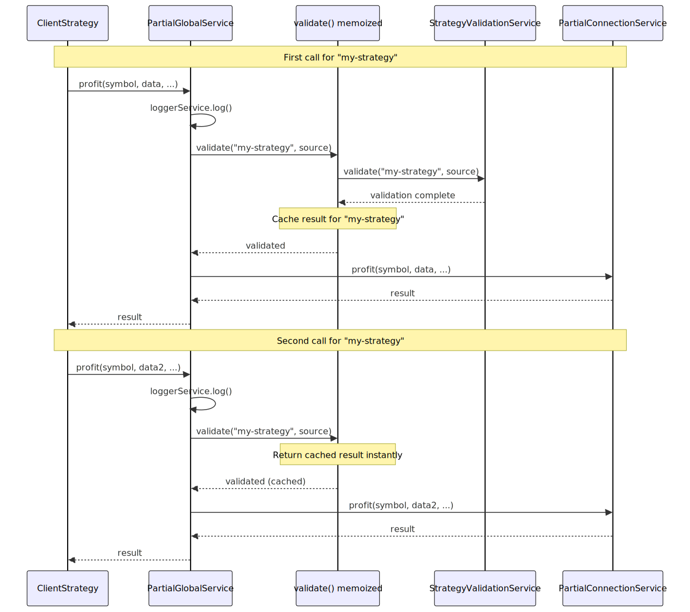
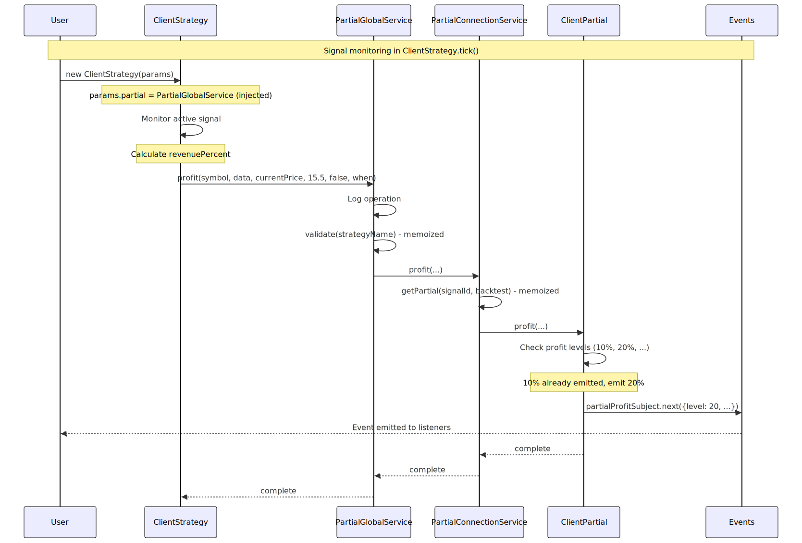

# Global Services

Global Services provide entry points for runtime operations that require validation and delegation to connection services. Unlike schema services (which store configurations) and command services (which orchestrate execution), global services act as facades that coordinate validation, logging, and delegation for specific subsystems.

The framework provides four Global Services, each managing a distinct domain:

| Global Service Class | Domain | Primary Responsibilities |
|---------------------|--------|-------------------------|
| `RiskGlobalService` | Portfolio risk management | Validates risk profiles, delegates position tracking to RiskConnectionService |
| `SizingGlobalService` | Position sizing | Validates sizing configurations, delegates calculations to SizingConnectionService |
| `PartialGlobalService` | Profit/loss milestones | Validates strategies, delegates milestone tracking to PartialConnectionService |
| `OptimizerGlobalService` | LLM strategy generation | Validates optimizer configurations, delegates code generation to OptimizerConnectionService |

For information about the overall service layer organization, see [Service Architecture Overview](./41_Service_Architecture_Overview.md). For details on the services that Global Services delegate to, see [Connection Services](./42_Connection_Services.md), [Schema Services](./43_Schema_Services.md), and [Validation Services](./44_Validation_Services.md).

**Sources:** [src/lib/index.ts:120-129](), [src/lib/core/types.ts:36-41](), [src/lib/core/provide.ts:91-96]()
</thinking>

---

## Global Services vs Other Service Layers

Global Services occupy a specific niche in the service architecture distinct from other layers.

### Architectural Position



**Purpose**: This diagram shows how Global Services fit between client classes and connection services. Unlike `add*` functions which access schema/validation services directly, global services provide validated entry points for runtime operations.

**Sources:** [src/lib/index.ts:120-129](), [src/function/add.ts:52-64](), [src/lib/services/global/PartialGlobalService.ts:40-54]()

### Comparison with Other Layers

| Layer | Purpose | State Management | Used By |
|-------|---------|------------------|---------|
| **Schema Services** | Store registered configurations | In-memory ToolRegistry | add* functions, Connection Services |
| **Validation Services** | Enforce registration rules | Stateless (memoized checks) | add* functions, Global Services |
| **Connection Services** | Create/cache client instances | Memoized client instances per key | Global Services, Core Services |
| **Global Services** | Coordinate validation + delegation | Stateless (delegates to Connection) | Client classes (ClientStrategy, etc.) |
| **Command Services** | Orchestrate execution workflows | Stateless (delegates to Logic) | Utility classes (Backtest, Live, Walker) |

**Key distinction**: Global Services are **runtime facades** used by client classes during execution. Schema Services are **configuration stores** used during setup. Command Services are **execution orchestrators** used by utility classes.

**Sources:** [src/lib/index.ts:61-129](), [src/lib/services/global/PartialGlobalService.ts:1-205]()

---

## Standard Global Service Pattern

All Global Services follow a consistent three-step pattern for public methods:

### Implementation Pattern


**Purpose**: This diagram shows the standard three-step pattern that all Global Service methods follow: log the operation, validate component existence, then delegate to the corresponding Connection Service.

**Sources:** [src/lib/services/global/PartialGlobalService.ts:110-135]()

### Standard Method Structure

Every public method in a Global Service follows this template:

```typescript
// Pattern from PartialGlobalService.profit()
public profit = async (
  symbol: string,
  data: ISignalRow,
  currentPrice: number,
  revenuePercent: number,
  backtest: boolean,
  when: Date
) => {
  // Step 1: Log operation with context
  this.loggerService.log("partialGlobalService profit", {
    symbol,
    data,
    currentPrice,
    revenuePercent,
    backtest,
    when,
  });
  
  // Step 2: Validate component existence (memoized)
  this.validate(data.strategyName, "partialGlobalService profit");
  
  // Step 3: Delegate to Connection Service
  return await this.partialConnectionService.profit(
    symbol,
    data,
    currentPrice,
    revenuePercent,
    backtest,
    when
  );
};
```

**Sources:** [src/lib/services/global/PartialGlobalService.ts:110-135]()

---

## Dependency Injection Pattern

All Global Services inject three types of dependencies via the DI container:

### Injected Dependencies



**Purpose**: This diagram shows the dependency injection pattern used by PartialGlobalService. All dependencies are injected using the `inject()` function with TYPES symbols.

**Sources:** [src/lib/services/global/PartialGlobalService.ts:40-74]()

### Dependency Categories

| Dependency Type | Instance | Purpose | Usage |
|----------------|----------|---------|-------|
| **Logger** | `LoggerService` | Operation logging | Called at method entry with context |
| **Connection** | `*ConnectionService` | Client factory | Delegates operations after validation |
| **Validation** | `*ValidationService` | Schema checks | Called by memoized `validate()` |
| **Schema** | `*SchemaService` | Configuration retrieval | Accessed to check related components |

Example from PartialGlobalService:

[src/lib/services/global/PartialGlobalService.ts:40-74]()

```typescript
private readonly loggerService = inject<LoggerService>(TYPES.loggerService);
private readonly partialConnectionService = inject<PartialConnectionService>(
  TYPES.partialConnectionService
);
private readonly strategyValidationService = inject<StrategyValidationService>(
  TYPES.strategyValidationService
);
private readonly strategySchemaService = inject<StrategySchemaService>(
  TYPES.strategySchemaService
);
private readonly riskValidationService = inject<RiskValidationService>(
  TYPES.riskValidationService
);
```

**Sources:** [src/lib/services/global/PartialGlobalService.ts:40-74]()

---

## Memoized Validation

Global Services use memoization to avoid redundant validation calls for the same component.

### Validation Caching Pattern



**Purpose**: This sequence diagram shows how memoization prevents redundant validation. The first call performs validation and caches the result. Subsequent calls for the same strategy return immediately from cache.

**Sources:** [src/lib/services/global/PartialGlobalService.ts:77-95](), [src/lib/services/global/PartialGlobalService.ts:110-135]()

### Memoize Implementation

The `validate()` method is wrapped with `memoize()` from functools-kit:

[src/lib/services/global/PartialGlobalService.ts:77-95]()

```typescript
private validate = memoize(
  // Cache key: strategy name
  ([strategyName]) => `${strategyName}`,
  
  // Validation logic (only runs once per key)
  (strategyName: string, methodName: string) => {
    this.loggerService.log("partialGlobalService validate", {
      strategyName,
      methodName,
    });
    
    // Validate strategy exists
    this.strategyValidationService.validate(strategyName, methodName);
    
    // Validate associated risk profiles
    const { riskName, riskList } = this.strategySchemaService.get(strategyName);
    riskName && this.riskValidationService.validate(riskName, methodName);
    riskList && riskList.forEach((riskName) => 
      this.riskValidationService.validate(riskName, methodName)
    );
  }
);
```

**Key aspects:**
- **Cache key**: Strategy name as string
- **First call**: Validates strategy and associated risk profiles
- **Subsequent calls**: Returns immediately (no validation performed)
- **Scope**: Per Global Service instance (singleton via DI)

**Sources:** [src/lib/services/global/PartialGlobalService.ts:77-95]()

---

## PartialGlobalService

PartialGlobalService coordinates partial profit/loss milestone tracking. It validates strategies and delegates milestone operations to PartialConnectionService.

### Service Overview



**Purpose**: This diagram shows PartialGlobalService's role in the partial tracking system. ClientStrategy calls the global service, which validates and delegates to PartialConnectionService, which manages ClientPartial instances.

**Sources:** [src/lib/services/global/PartialGlobalService.ts:1-205](), [src/lib/services/connection/PartialConnectionService.ts:117-264]()

### Public Methods

| Method | Parameters | Description |
|--------|-----------|-------------|
| `profit()` | `symbol, data, currentPrice, revenuePercent, backtest, when` | Processes profit state, emits events for new levels (10%, 20%, etc) |
| `loss()` | `symbol, data, currentPrice, lossPercent, backtest, when` | Processes loss state, emits events for new levels (-10%, -20%, etc) |
| `clear()` | `symbol, data, priceClose, backtest` | Clears milestone state when signal closes |

Example usage from ClientStrategy:

[src/lib/services/global/PartialGlobalService.ts:110-175]()

```typescript
// Called during signal monitoring when in profit
public profit = async (
  symbol: string,
  data: ISignalRow,
  currentPrice: number,
  revenuePercent: number,
  backtest: boolean,
  when: Date
) => {
  this.loggerService.log("partialGlobalService profit", {
    symbol,
    data,
    currentPrice,
    revenuePercent,
    backtest,
    when,
  });
  this.validate(data.strategyName, "partialGlobalService profit");
  return await this.partialConnectionService.profit(
    symbol,
    data,
    currentPrice,
    revenuePercent,
    backtest,
    when
  );
};
```

**Validation flow:**
1. Validates strategy exists via `StrategyValidationService`
2. Retrieves strategy schema to check `riskName` and `riskList`
3. Validates each associated risk profile via `RiskValidationService`
4. Delegates to `PartialConnectionService`

**Sources:** [src/lib/services/global/PartialGlobalService.ts:77-201]()

---

## RiskGlobalService

RiskGlobalService coordinates portfolio-level risk management. It validates risk profiles and delegates position tracking to RiskConnectionService. (Not fully detailed in provided files, but follows the same pattern as PartialGlobalService.)

**Sources:** [src/lib/index.ts:122](), [src/lib/core/types.ts:38]()

---

## SizingGlobalService

SizingGlobalService coordinates position sizing calculations. It validates sizing configurations and delegates calculations to SizingConnectionService. (Not fully detailed in provided files, but follows the same pattern.)

**Sources:** [src/lib/index.ts:121](), [src/lib/core/types.ts:37]()

---

## OptimizerGlobalService

OptimizerGlobalService coordinates LLM-based strategy generation. It validates optimizer configurations and delegates code generation to OptimizerConnectionService. (Not fully detailed in provided files, but follows the same pattern.)

**Sources:** [src/lib/index.ts:123-125](), [src/lib/core/types.ts:39]()

---

## Integration with Client Classes

Global Services are primarily used by client classes during runtime execution, not by public API functions.

### Usage Pattern: ClientStrategy → PartialGlobalService



**Purpose**: This sequence diagram shows the complete call chain from ClientStrategy through PartialGlobalService to ClientPartial. Global Services act as validated entry points, not as direct public APIs.

**Sources:** [src/lib/services/global/PartialGlobalService.ts:110-135](), [src/lib/services/connection/PartialConnectionService.ts:159-185](), [src/client/ClientPartial.ts:399-424]()

### Injection Pattern

Client classes receive Global Services via their constructor parameters:

```typescript
// From IStrategyParams interface (not shown but inferred)
interface IStrategyParams {
  partial: PartialGlobalService;  // Injected global service
  risk: RiskGlobalService;        // Injected global service
  sizing: SizingGlobalService;    // Injected global service
  // ...
}

// ClientStrategy uses injected services
class ClientStrategy {
  constructor(readonly params: IStrategyParams) {}
  
  async monitorSignal(...) {
    // Use injected PartialGlobalService
    if (revenuePercent > 0) {
      await this.params.partial.profit(symbol, data, currentPrice, revenuePercent, backtest, when);
    }
  }
}
```

**Key points:**
- Global Services are **injected** into client classes, not imported directly
- Client classes access them via `this.params.*GlobalService`
- Public API functions (`add*`, `list*`) do NOT use Global Services
- Global Services are runtime facades, not configuration APIs

**Sources:** [src/lib/services/global/PartialGlobalService.ts:40-54]()

---

## Service Registration

Global Services are registered in the dependency injection container during framework initialization.

### DI Registration

[src/lib/core/provide.ts:91-96]()

```typescript
{
    provide(TYPES.sizingGlobalService, () => new SizingGlobalService());
    provide(TYPES.riskGlobalService, () => new RiskGlobalService());
    provide(TYPES.optimizerGlobalService, () => new OptimizerGlobalService());
    provide(TYPES.partialGlobalService, () => new PartialGlobalService());
}
```

### Export Pattern

[src/lib/index.ts:120-129]()

```typescript
const globalServices = {
  sizingGlobalService: inject<SizingGlobalService>(TYPES.sizingGlobalService),
  riskGlobalService: inject<RiskGlobalService>(TYPES.riskGlobalService),
  optimizerGlobalService: inject<OptimizerGlobalService>(
    TYPES.optimizerGlobalService
  ),
  partialGlobalService: inject<PartialGlobalService>(
    TYPES.partialGlobalService
  ),
};
```

All services are included in the `backtest` export object [src/lib/index.ts:225-246](), making them accessible as:
- `backtest.sizingGlobalService`
- `backtest.riskGlobalService`
- `backtest.optimizerGlobalService`
- `backtest.partialGlobalService`

### TYPES Symbols

[src/lib/core/types.ts:36-41]()

```typescript
const globalServices = {
    sizingGlobalService: Symbol('sizingGlobalService'),
    riskGlobalService: Symbol('riskGlobalService'),
    optimizerGlobalService: Symbol('optimizerGlobalService'),
    partialGlobalService: Symbol('partialGlobalService'),
}
```

**Key aspects:**
- Each service has a unique Symbol identifier in TYPES
- Services are registered as factory functions via `provide()`
- Services are lazily initialized on first `inject()` call
- Singletons: Only one instance per service type

**Sources:** [src/lib/core/provide.ts:91-96](), [src/lib/core/types.ts:36-41](), [src/lib/index.ts:120-129]()

---

## Key Characteristics

Global Services exhibit these consistent patterns across the framework:

### Stateless Operation

Global Services maintain no state themselves. They delegate state management to:
- Schema Services (component configurations)
- Connection Services (memoized client instances)
- Client Classes (signal state, position tracking)

### Memoized Validation

Validation is memoized by component name to avoid redundant schema checks:

```typescript
// Pattern from RiskGlobalService
private validate = memoize(
  ([riskName]) => `${riskName}`,  // Cache key
  async (riskName: RiskName) => {
    this.loggerService.log("riskGlobalService validate", {
      riskName,
    });
    this.riskValidationService.validate(
      riskName,
      "riskGlobalService validate"
    );
  }
);
```

The cache key is the component name string. First invocation performs validation, subsequent calls return immediately.

**Sources:** [src/lib/services/global/RiskGlobalService.ts:31-42]()

### Consistent Logging

Every public method logs its invocation with context:

```typescript
public checkSignal = async (
  params: IRiskCheckArgs,
  context: { riskName: RiskName }
) => {
  this.loggerService.log("riskGlobalService checkSignal", {
    symbol: params.symbol,
    context,
  });
  await this.validate(context.riskName);
  return await this.riskConnectionService.checkSignal(params, context);
};
```

Log entries include:
- Service and method name (e.g., `"riskGlobalService checkSignal"`)
- Operation-specific context (symbol, component names)
- Structured data for debugging

**Sources:** [src/lib/services/global/RiskGlobalService.ts:51-61]()

### Single Responsibility

Each Global Service manages exactly one component type or execution mode:
- `RiskGlobalService` → Risk profiles only
- `StrategyGlobalService` → Strategies only  
- `BacktestGlobalService` → Backtest execution only
- `WalkerGlobalService` → Both walker components AND walker execution (special case)

**Sources:** [src/lib/index.ts:93-108]()

---

## Delegation Flow Summary



**Purpose**: This diagram summarizes the complete delegation flow for both Component and Execution Global Services. Both types perform validation first, but Component services delegate to Connection Services while Execution services delegate to Logic Services.

**Sources:** [src/lib/services/global/RiskGlobalService.ts:15-114](), [src/lib/index.ts:93-132]()