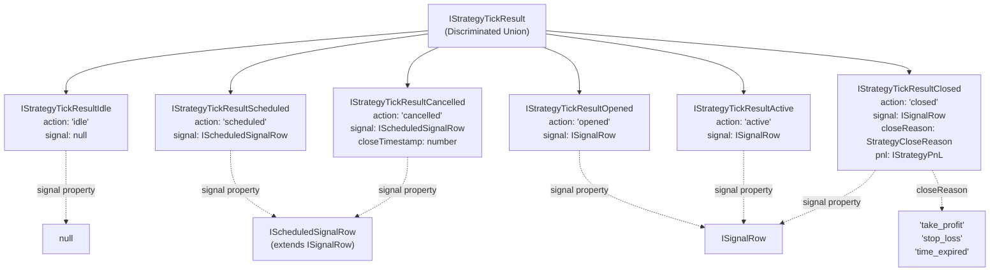
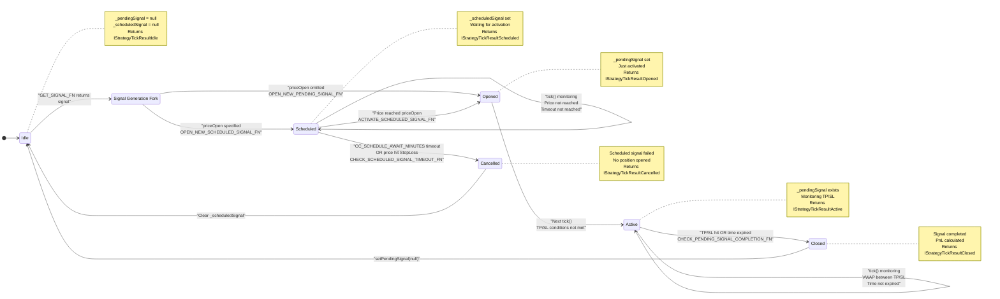
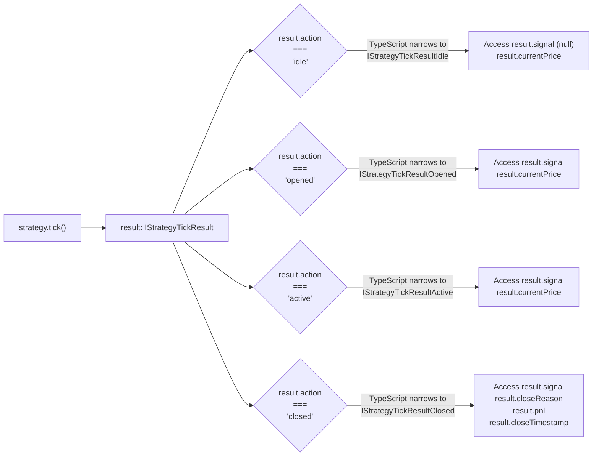

# Signal States

<details>
<summary>Relevant source files</summary>

The following files were used as context for generating this wiki page:

- [src/client/ClientStrategy.ts](src/client/ClientStrategy.ts)
- [src/index.ts](src/index.ts)
- [src/interfaces/Strategy.interface.ts](src/interfaces/Strategy.interface.ts)
- [src/lib/services/connection/StrategyConnectionService.ts](src/lib/services/connection/StrategyConnectionService.ts)
- [test/index.mjs](test/index.mjs)
- [types.d.ts](types.d.ts)

</details>


This page documents the four signal states in the backtest-kit framework and their corresponding TypeScript interfaces. Each state is represented by a distinct interface in a discriminated union, enabling type-safe signal lifecycle management.

For information about how signals are generated and validated, see [Signal Generation and Validation](#6.2). For details on state persistence between crashes, see [Signal Persistence](#6.3). For PnL calculation logic in the closed state, see [PnL Calculation](#6.4).

## Overview

Signals progress through six distinct states during their lifecycle. The framework uses a discriminated union pattern with an `action` property as the type discriminator. All state interfaces are defined in [types.d.ts:654-765]() and returned by `ClientStrategy.tick()` in [src/client/ClientStrategy.ts]().

| State | Action Value | Description | Signal Type | Price Monitoring |
|-------|-------------|-------------|-------------|------------------|
| **Idle** | `"idle"` | No active signal exists | N/A (`null`) | Current VWAP only |
| **Scheduled** | `"scheduled"` | Waiting for price to reach `priceOpen` | `IScheduledSignalRow` | Activation price monitoring |
| **Opened** | `"opened"` | Signal just created/activated | `ISignalRow` | Entry price |
| **Active** | `"active"` | Monitoring TP/SL conditions | `ISignalRow` | Continuous VWAP |
| **Closed** | `"closed"` | Signal completed with PnL | `ISignalRow` | Final close price |
| **Cancelled** | `"cancelled"` | Scheduled signal timeout/rejected | `IScheduledSignalRow` | Cancellation price |

The key distinction is between **immediate signals** (no `priceOpen` specified, opens instantly) and **scheduled signals** (`priceOpen` specified, waits for price activation).

**Sources:** [types.d.ts:654-765](), [src/client/ClientStrategy.ts:1-1180](), [src/interfaces/Strategy.interface.ts:19-73]()

## State Discriminated Union Type System

### Discriminated Union Diagram



The `IStrategyTickResult` type is a discriminated union defined at [types.d.ts:770](). TypeScript uses the `action` property to narrow types in conditional blocks:

```typescript
// Type narrowing with discriminator
const result: IStrategyTickResult = await strategy.tick();

if (result.action === "closed") {
  // TypeScript knows result is IStrategyTickResultClosed
  console.log(result.pnl.pnlPercentage); // OK
  console.log(result.closeReason); // OK
}

if (result.action === "scheduled") {
  // TypeScript knows result is IStrategyTickResultScheduled
  console.log(result.signal.priceOpen); // OK
  console.log(result.currentPrice); // OK
}

if (result.action === "cancelled") {
  // TypeScript knows result is IStrategyTickResultCancelled
  console.log(result.closeTimestamp); // OK
  console.log(result.signal.id); // OK
}
```

**Sources:** [types.d.ts:770](), [types.d.ts:654-765](), [src/interfaces/Strategy.interface.ts:162-278]()

## State Transition Flow

### Complete State Machine Diagram



The state machine is implemented in `ClientStrategy.tick()`. The `_pendingSignal` field at [src/client/ClientStrategy.ts:1093]() tracks active signals, while `_scheduledSignal` at [src/client/ClientStrategy.ts:1094]() tracks scheduled signals waiting for price activation.

### Immediate vs Scheduled Signal Paths

| Path | Trigger | Entry State | Activation Condition | Implementation |
|------|---------|-------------|---------------------|----------------|
| **Immediate** | `getSignal()` returns `ISignalDto` without `priceOpen` | `opened` | Opens at current VWAP instantly | `OPEN_NEW_PENDING_SIGNAL_FN` at [src/client/ClientStrategy.ts:623-673]() |
| **Scheduled** | `getSignal()` returns `ISignalDto` with `priceOpen` | `scheduled` | Waits for price to reach `priceOpen` | `OPEN_NEW_SCHEDULED_SIGNAL_FN` at [src/client/ClientStrategy.ts:578-621]() |

**Sources:** [src/client/ClientStrategy.ts:1093-1094](), [src/client/ClientStrategy.ts:578-673](), [src/client/ClientStrategy.ts:332-551]()

## Idle State

The idle state indicates no active or scheduled signal exists. This is the default state when both `ClientStrategy._pendingSignal` and `ClientStrategy._scheduledSignal` are `null`.

### IStrategyTickResultIdle Interface

Defined at [types.d.ts:654-667]():

```typescript
interface IStrategyTickResultIdle {
  action: "idle";
  signal: null;
  strategyName: StrategyName;
  exchangeName: ExchangeName;
  symbol: string;
  currentPrice: number;
}
```

### Idle State Behavior

Implementation in `ClientStrategy.tick()`:

1. **Signal Generation Check**: Calls `GET_SIGNAL_FN()` at [src/client/ClientStrategy.ts:187-283]() to check if a new signal should be generated
2. **Throttling**: `GET_SIGNAL_FN` enforces interval-based throttling using `_lastSignalTimestamp` at [src/client/ClientStrategy.ts:194-208]()
3. **Risk Check**: Calls `risk.checkSignal()` at [src/client/ClientStrategy.ts:212-222]() before generating signal
4. **Price Fetch**: If no signal, fetches current VWAP via `exchange.getAveragePrice()` in `RETURN_IDLE_FN` at [src/client/ClientStrategy.ts:816-846]()
5. **Callbacks**: Triggers `callbacks.onIdle` if configured at [src/client/ClientStrategy.ts:820-826]()
6. **Return**: Constructs `IStrategyTickResultIdle` with current price at [src/client/ClientStrategy.ts:828-834]()

The idle state is returned when both `_pendingSignal` and `_scheduledSignal` remain `null` after attempting signal generation.

**Sources:** [types.d.ts:654-667](), [src/client/ClientStrategy.ts:187-283](), [src/client/ClientStrategy.ts:816-846]()

## Scheduled State

The scheduled state represents a signal waiting for price to reach `priceOpen` before activating. This occurs when `getSignal()` returns `ISignalDto` with `priceOpen` specified.

### IStrategyTickResultScheduled Interface

Defined at [types.d.ts:672-685]():

```typescript
interface IStrategyTickResultScheduled {
  action: "scheduled";
  signal: IScheduledSignalRow;
  strategyName: StrategyName;
  exchangeName: ExchangeName;
  symbol: string;
  currentPrice: number;
}
```

### IScheduledSignalRow Interface

Defined at [types.d.ts:588-591]():

```typescript
interface IScheduledSignalRow extends ISignalRow {
  priceOpen: number;
}
```

This interface inherits all properties from `ISignalRow` and explicitly requires `priceOpen` to be set (not optional).

### Scheduled State Behavior

Implementation in `OPEN_NEW_SCHEDULED_SIGNAL_FN` at [src/client/ClientStrategy.ts:578-621]():

1. **Signal Creation**: `GET_SIGNAL_FN()` returns `ISignalDto` with `priceOpen` field populated at [src/client/ClientStrategy.ts:233-254]()
2. **ID Generation**: Assigns random UUID via `randomString()` at [src/client/ClientStrategy.ts:235]()
3. **Row Creation**: Creates `IScheduledSignalRow` with `_isScheduled: true` marker at [src/client/ClientStrategy.ts:234-248]()
4. **Validation**: `VALIDATE_SIGNAL_FN()` checks prices, TP/SL distances, and lifetime at [src/client/ClientStrategy.ts:40-185]()
5. **Storage**: Sets `_scheduledSignal` field (not persisted to disk) at [src/client/ClientStrategy.ts:580]()
6. **Callbacks**: Triggers `callbacks.onSchedule` at [src/client/ClientStrategy.ts:594-601]()
7. **Return**: Constructs `IStrategyTickResultScheduled` at [src/client/ClientStrategy.ts:603-610]()

### Scheduled Signal Monitoring

On subsequent ticks with `_scheduledSignal` set, the framework monitors for three outcomes:

| Outcome | Condition | Implementation | Next State |
|---------|-----------|----------------|-----------|
| **Activation** | Current price reaches `priceOpen` | `ACTIVATE_SCHEDULED_SIGNAL_FN` at [src/client/ClientStrategy.ts:459-551]() | `opened` |
| **Timeout** | `CC_SCHEDULE_AWAIT_MINUTES` elapsed | `CHECK_SCHEDULED_SIGNAL_TIMEOUT_FN` at [src/client/ClientStrategy.ts:332-386]() | `cancelled` |
| **StopLoss Hit** | Price crosses StopLoss before activation | `CANCEL_SCHEDULED_SIGNAL_BY_STOPLOSS_FN` at [src/client/ClientStrategy.ts:424-457]() | `idle` |

**Sources:** [types.d.ts:672-685](), [types.d.ts:588-591](), [src/client/ClientStrategy.ts:578-621](), [src/client/ClientStrategy.ts:233-254](), [src/client/ClientStrategy.ts:332-551]()

## Opened State

The opened state occurs when a signal is activated - either immediately (no `priceOpen`) or after scheduled signal activation. This state is yielded exactly once per signal.

### IStrategyTickResultOpened Interface

Defined at [types.d.ts:690-703]():

```typescript
interface IStrategyTickResultOpened {
  action: "opened";
  signal: ISignalRow;
  strategyName: StrategyName;
  exchangeName: ExchangeName;
  symbol: string;
  currentPrice: number;
}
```

### Opened State Behavior - Immediate Signal Path

Implementation in `OPEN_NEW_PENDING_SIGNAL_FN` at [src/client/ClientStrategy.ts:623-673]():

1. **Signal Creation**: `GET_SIGNAL_FN()` returns `ISignalDto` without `priceOpen` at [src/client/ClientStrategy.ts:256-271]()
2. **ID Generation**: Assigns random UUID via `randomString()` at [src/client/ClientStrategy.ts:257]()
3. **Price Assignment**: Uses current VWAP as `priceOpen` at [src/client/ClientStrategy.ts:258]()
4. **Validation**: `VALIDATE_SIGNAL_FN()` checks prices and constraints at [src/client/ClientStrategy.ts:40-185]()
5. **Risk Check**: Calls `risk.checkSignal()` at [src/client/ClientStrategy.ts:627-637](), returns `null` if rejected
6. **Persistence**: `setPendingSignal(signal)` atomically writes to disk (live mode) at [src/client/ClientStrategy.ts:1105-1118]()
7. **Position Tracking**: Calls `risk.addSignal()` at [src/client/ClientStrategy.ts:641-644]()
8. **Callbacks**: Triggers `callbacks.onOpen` at [src/client/ClientStrategy.ts:646-653]()
9. **Return**: Constructs `IStrategyTickResultOpened` at [src/client/ClientStrategy.ts:655-662]()

### Opened State Behavior - Scheduled Signal Activation Path

Implementation in `ACTIVATE_SCHEDULED_SIGNAL_FN` at [src/client/ClientStrategy.ts:459-551]():

1. **Stop Check**: Returns `null` if `_isStopped` flag is set at [src/client/ClientStrategy.ts:465-472]()
2. **Risk Revalidation**: Calls `risk.checkSignal()` again at activation time at [src/client/ClientStrategy.ts:489-506]()
3. **Timestamp Update**: Updates `pendingAt` to activation time (was `scheduledAt` during scheduled state) at [src/client/ClientStrategy.ts:511-515]()
4. **Signal Conversion**: Converts `IScheduledSignalRow` to `ISignalRow` with `_isScheduled: false` at [src/client/ClientStrategy.ts:511-515]()
5. **Persistence**: `setPendingSignal(activatedSignal)` writes activated signal at [src/client/ClientStrategy.ts:517]()
6. **Position Tracking**: Calls `risk.addSignal()` at [src/client/ClientStrategy.ts:519-522]()
7. **Callbacks**: Triggers `callbacks.onOpen` at [src/client/ClientStrategy.ts:524-531]()
8. **Return**: Constructs `IStrategyTickResultOpened` at [src/client/ClientStrategy.ts:533-540]()

After returning opened state, the next `tick()` call transitions to active state since `_pendingSignal` now exists.

**Sources:** [types.d.ts:690-703](), [src/client/ClientStrategy.ts:623-673](), [src/client/ClientStrategy.ts:459-551](), [src/client/ClientStrategy.ts:256-271]()

## Active State

The active state represents ongoing monitoring of take profit, stop loss, and time expiration conditions. This state repeats across multiple ticks until a close condition is met.

### IStrategyTickResultActive Interface

Defined at [types.d.ts:708-721]():

```typescript
interface IStrategyTickResultActive {
  action: "active";
  signal: ISignalRow;
  currentPrice: number;
  strategyName: StrategyName;
  exchangeName: ExchangeName;
  symbol: string;
}
```

### Active State Behavior

Implementation in `RETURN_PENDING_SIGNAL_ACTIVE_FN` at [src/client/ClientStrategy.ts:791-814]():

1. **Signal Existence**: Check `if (_pendingSignal)` evaluates to true
2. **Price Monitoring**: Fetches current VWAP via `exchange.getAveragePrice()`
3. **Condition Checks**: Evaluates TP/SL and time expiration in `CHECK_PENDING_SIGNAL_COMPLETION_FN` at [src/client/ClientStrategy.ts:675-734]()
4. **No Match**: If no conditions trigger, proceeds to active state
5. **Callbacks**: Triggers `callbacks.onActive` at [src/client/ClientStrategy.ts:806-813]() if configured
6. **Return**: Constructs `IStrategyTickResultActive` with current VWAP at [src/client/ClientStrategy.ts:796-803]()

### Monitoring Logic in CHECK_PENDING_SIGNAL_COMPLETION_FN

The condition checks at [src/client/ClientStrategy.ts:675-734]() evaluate in order:

| Check | Long Position | Short Position | Implementation |
|-------|--------------|----------------|----------------|
| **Time Expiration** | `currentTime >= pendingAt + minuteEstimatedTime * 60 * 1000` | Same | Line 680-683 |
| **Take Profit** | `averagePrice >= priceTakeProfit` | `averagePrice <= priceTakeProfit` | Lines 686-703 |
| **Stop Loss** | `averagePrice <= priceStopLoss` | `averagePrice >= priceStopLoss` | Lines 705-724 |

If any condition is true, returns `IStrategyTickResultClosed` instead of proceeding to active state. Uses **exact TP/SL prices** for close (not current VWAP) at lines 700, 709, 719, 728.

### Critical Implementation Detail: pendingAt vs scheduledAt

Time expiration calculation uses `signal.pendingAt` at [src/client/ClientStrategy.ts:681](), NOT `signal.scheduledAt`. This ensures scheduled signals only start their lifetime countdown after activation, not from initial creation.

**Sources:** [types.d.ts:708-721](), [src/client/ClientStrategy.ts:791-814](), [src/client/ClientStrategy.ts:675-734]()

## Closed State

The closed state represents signal completion with calculated profit/loss. This is the terminal state for an active signal before returning to idle.

### IStrategyTickResultClosed Interface

Defined at [types.d.ts:726-745]():

```typescript
interface IStrategyTickResultClosed {
  action: "closed";
  signal: ISignalRow;
  currentPrice: number;
  closeReason: StrategyCloseReason;
  closeTimestamp: number;
  pnl: IStrategyPnL;
  strategyName: StrategyName;
  exchangeName: ExchangeName;
  symbol: string;
}
```

### Close Reason Types

The `StrategyCloseReason` type at [types.d.ts:638]() has three possible values:

| Close Reason | Condition | Long Example | Short Example |
|--------------|-----------|--------------|---------------|
| `"take_profit"` | VWAP reached `priceTakeProfit` | Price rises to TP | Price falls to TP |
| `"stop_loss"` | VWAP reached `priceStopLoss` | Price falls to SL | Price rises to SL |
| `"time_expired"` | `currentTime >= pendingAt + minuteEstimatedTime * 60 * 1000` | Duration elapsed | Duration elapsed |

### Closed State Behavior

Implementation in `CLOSE_PENDING_SIGNAL_FN` at [src/client/ClientStrategy.ts:736-789]():

1. **PnL Calculation**: Calls `toProfitLossDto(signal, currentPrice)` at [src/client/ClientStrategy.ts:742]() to compute fees/slippage-adjusted profit/loss
2. **Logging**: Logs close reason and PnL at [src/client/ClientStrategy.ts:744-750]()
3. **Callbacks**: Triggers `callbacks.onClose` at [src/client/ClientStrategy.ts:752-759]()
4. **Position Tracking**: Calls `risk.removeSignal()` at [src/client/ClientStrategy.ts:761-764]()
5. **State Clearing**: Calls `setPendingSignal(null)` at [src/client/ClientStrategy.ts:766]() to clear persistence
6. **Timestamp Capture**: Records `closeTimestamp` from `execution.context.when` at [src/client/ClientStrategy.ts:773]()
7. **Return**: Constructs `IStrategyTickResultClosed` with all metadata at [src/client/ClientStrategy.ts:768-777]()
8. **Event Emission**: Triggers `callbacks.onTick` at [src/client/ClientStrategy.ts:779-784]()

### Price Resolution for Close

Close prices use **exact TP/SL values** at [src/client/ClientStrategy.ts:700-728](), not the current VWAP that triggered the close:

- **Take Profit Close**: Uses `signal.priceTakeProfit` as `currentPrice` parameter
- **Stop Loss Close**: Uses `signal.priceStopLoss` as `currentPrice` parameter
- **Time Expiration**: Uses actual VWAP at time of expiration

This ensures PnL calculations are based on the actual limit prices, not approximations.

### Backtest Fast-Forward

The `ClientStrategy.backtest()` method at [src/client/ClientStrategy.ts:1001-1179]() always returns `IStrategyBacktestResult` which can be either `IStrategyTickResultClosed` or `IStrategyTickResultCancelled`. For active signals, it:

1. Iterates through future candles
2. Checks TP/SL against candle high/low for each timestamp
3. Returns `time_expired` if duration elapses without hitting TP/SL
4. Uses exact TP/SL prices (not VWAP) for close price

**Sources:** [types.d.ts:726-745](), [types.d.ts:638](), [src/client/ClientStrategy.ts:736-789](), [src/client/ClientStrategy.ts:1001-1179]()

## Cancelled State

The cancelled state represents a scheduled signal that failed to activate. This occurs when the signal times out or hits stop loss before price reaches `priceOpen`.

### IStrategyTickResultCancelled Interface

Defined at [types.d.ts:750-765]():

```typescript
interface IStrategyTickResultCancelled {
  action: "cancelled";
  signal: IScheduledSignalRow;
  currentPrice: number;
  closeTimestamp: number;
  strategyName: StrategyName;
  exchangeName: ExchangeName;
  symbol: string;
}
```

### Cancelled State Behavior - Timeout Path

Implementation in `CHECK_SCHEDULED_SIGNAL_TIMEOUT_FN` at [src/client/ClientStrategy.ts:332-386]():

1. **Time Check**: Evaluates `currentTime - scheduledAt >= CC_SCHEDULE_AWAIT_MINUTES * 60 * 1000` at [src/client/ClientStrategy.ts:339-343]()
2. **Early Return**: Returns `null` if timeout not reached at [src/client/ClientStrategy.ts:342-344]()
3. **Logging**: Logs cancellation with elapsed minutes at [src/client/ClientStrategy.ts:346-353]()
4. **State Clearing**: Sets `_scheduledSignal = null` at [src/client/ClientStrategy.ts:355]()
5. **Callbacks**: Triggers `callbacks.onCancel` at [src/client/ClientStrategy.ts:357-364]()
6. **Return**: Constructs `IStrategyTickResultCancelled` at [src/client/ClientStrategy.ts:366-373]()
7. **Event Emission**: Triggers `callbacks.onTick` at [src/client/ClientStrategy.ts:375-380]()

### Cancelled State Behavior - StopLoss Hit Path

Implementation in `CHECK_SCHEDULED_SIGNAL_PRICE_ACTIVATION_FN` at [src/client/ClientStrategy.ts:388-422]():

Checks for stop loss conditions before activation:

| Position | Cancellation Condition | Implementation |
|----------|----------------------|----------------|
| **Long** | `currentPrice <= priceStopLoss` | Line 398-399 |
| **Short** | `currentPrice >= priceStopLoss` | Line 411-412 |

When cancelled by stop loss:
1. Returns `shouldCancel: true` from price activation check
2. Calls `CANCEL_SCHEDULED_SIGNAL_BY_STOPLOSS_FN` at [src/client/ClientStrategy.ts:424-457]()
3. Clears `_scheduledSignal` and returns `idle` (not `cancelled`) at [src/client/ClientStrategy.ts:437-455]()

### Critical Difference: Timeout vs StopLoss Cancellation

| Cancellation Type | Returns State | Reason |
|------------------|---------------|---------|
| **Timeout** (CC_SCHEDULE_AWAIT_MINUTES) | `cancelled` | Explicit cancellation event for tracking |
| **StopLoss Hit** | `idle` | Treated as price rejection, not cancellation |

### Backtest Cancellation

In backtest mode, `CANCEL_SCHEDULED_SIGNAL_IN_BACKTEST_FN` at [src/client/ClientStrategy.ts:848-895]() handles scheduled signal cancellations and always returns `IStrategyTickResultCancelled` (not `idle`).

**Sources:** [types.d.ts:750-765](), [src/client/ClientStrategy.ts:332-386](), [src/client/ClientStrategy.ts:388-457](), [src/client/ClientStrategy.ts:848-895]()

## Type-Safe State Handling



### Usage Example

The discriminated union enables exhaustive type checking:

```typescript
async function handleTick(strategy: ClientStrategy) {
  const result = await strategy.tick();
  
  switch (result.action) {
    case "idle":
      // result is IStrategyTickResultIdle
      console.log(`No signal, price: ${result.currentPrice}`);
      break;
      
    case "opened":
      // result is IStrategyTickResultOpened
      console.log(`Signal opened: ${result.signal.id}`);
      console.log(`Entry price: ${result.currentPrice}`);
      break;
      
    case "active":
      // result is IStrategyTickResultActive
      console.log(`Monitoring signal: ${result.signal.id}`);
      console.log(`Current VWAP: ${result.currentPrice}`);
      break;
      
    case "closed":
      // result is IStrategyTickResultClosed
      console.log(`Signal closed: ${result.closeReason}`);
      console.log(`PnL: ${result.pnl.pnlPercentage}%`);
      console.log(`Close timestamp: ${result.closeTimestamp}`);
      break;
      
    default:
      // TypeScript ensures exhaustiveness
      const _exhaustive: never = result;
  }
}
```

### State Filtering in Live Mode

The `LiveLogicPrivateService` at [src/lib/services/logic/LiveLogicPrivateService.ts]() filters active states to reduce noise. Only `opened` and `closed` states are yielded to the user in live trading, while backtest mode yields all states for analysis.

**Sources:** [src/interfaces/Strategy.interface.ts:204-208](), [src/client/ClientStrategy.ts:258-464]()