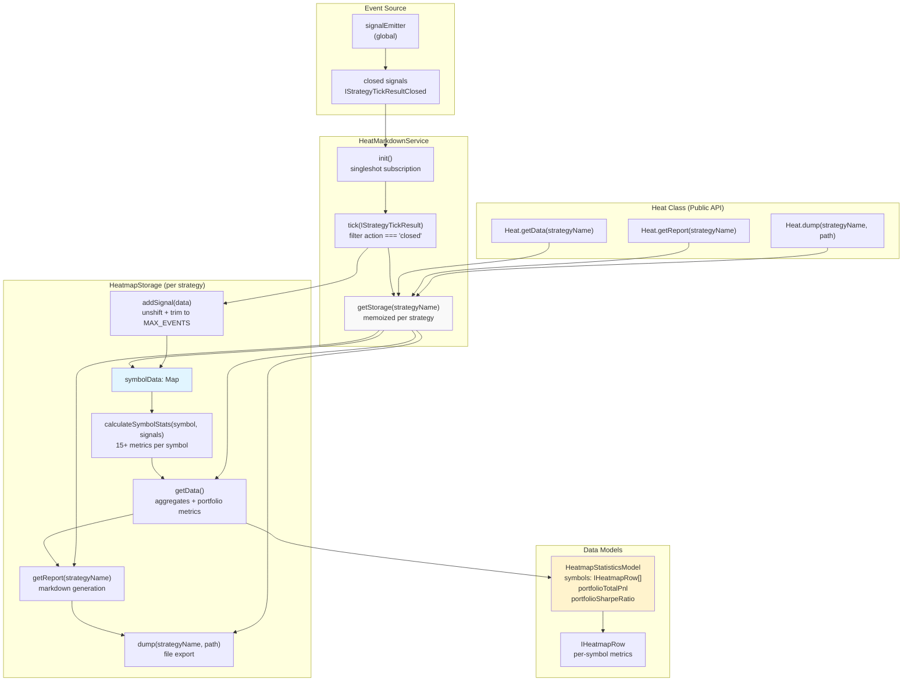
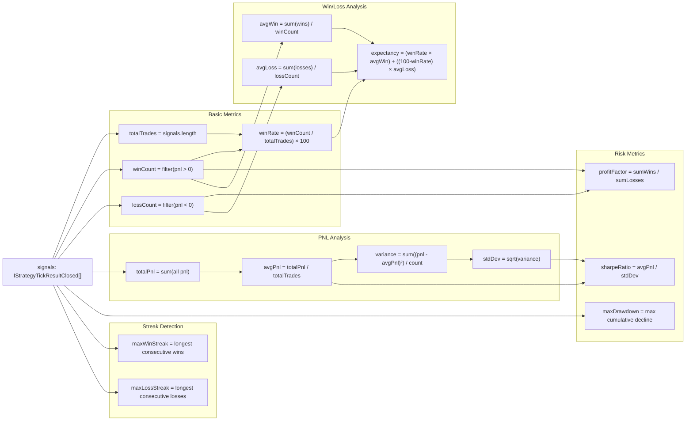
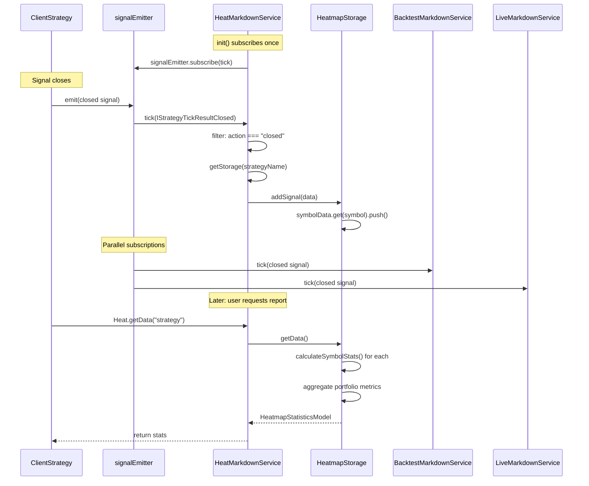
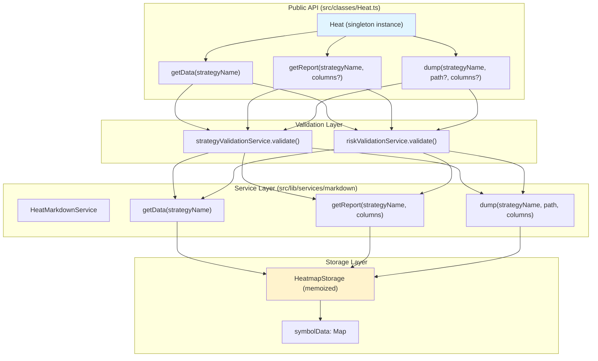

# Portfolio Heatmap

The Portfolio Heatmap provides cross-symbol aggregation and visualization for a single strategy's performance across multiple trading pairs. It calculates per-symbol and portfolio-wide statistics including Total PNL, Sharpe Ratio, Maximum Drawdown, and trade counts. This enables traders to identify which symbols perform best with a given strategy and evaluate overall portfolio health.

For single symbol-strategy reporting, see [Markdown Reports](./40_reporting-monitoring.md). For performance timing analysis, see [Performance Tracking](./40_reporting-monitoring.md).

---

## Overview

The heatmap system aggregates closed signals from all symbols traded by a strategy and generates comprehensive portfolio-wide reports. Unlike per-symbol reports that show individual trade sequences, the heatmap presents a bird's-eye view of strategy performance distributed across multiple markets.

**Key capabilities:**
- Automatic accumulation of closed signals per strategy (up to 250 signals per symbol)
- Real-time calculation of 15+ statistical metrics per symbol
- Portfolio-wide aggregated metrics (weighted Sharpe Ratio, total PNL)
- Markdown table generation sorted by performance
- Safe math handling (NaN/Infinity protection)

Sources: [src/lib/services/markdown/HeatMarkdownService.ts:1-606](), [src/classes/Heat.ts:1-148]()

---

## System Architecture



**Flow:**
1. `signalEmitter` broadcasts all closed signals from any strategy/symbol
2. `HeatMarkdownService.tick()` filters for `action === "closed"`
3. Signals are routed to memoized `HeatmapStorage` instances (one per strategy)
4. `HeatmapStorage.addSignal()` accumulates signals in a `Map<symbol, signals[]>`
5. `getData()` calculates per-symbol statistics and aggregates portfolio metrics
6. `Heat` class provides convenient public API wrapping the service

Sources: [src/lib/services/markdown/HeatMarkdownService.ts:434-606](), [src/classes/Heat.ts:33-148]()

---

## Data Model

The heatmap uses a two-level statistical model: per-symbol rows and portfolio-wide aggregates.

### IHeatmapRow (Per-Symbol Statistics)

Each symbol gets a row containing 15 calculated metrics:

| Field | Type | Description |
|-------|------|-------------|
| `symbol` | `string` | Trading pair identifier |
| `totalPnl` | `number \| null` | Sum of all PNL percentages |
| `sharpeRatio` | `number \| null` | Risk-adjusted returns (avgPnl / stdDev) |
| `maxDrawdown` | `number \| null` | Largest peak-to-trough decline |
| `totalTrades` | `number` | Count of closed signals |
| `winCount` | `number` | Trades with PNL > 0 |
| `lossCount` | `number` | Trades with PNL < 0 |
| `winRate` | `number \| null` | (winCount / totalTrades) × 100 |
| `avgPnl` | `number \| null` | Mean PNL percentage |
| `stdDev` | `number \| null` | Standard deviation of returns |
| `profitFactor` | `number \| null` | Sum of wins / Sum of losses |
| `avgWin` | `number \| null` | Mean winning trade PNL |
| `avgLoss` | `number \| null` | Mean losing trade PNL |
| `maxWinStreak` | `number` | Longest consecutive win sequence |
| `maxLossStreak` | `number` | Longest consecutive loss sequence |
| `expectancy` | `number \| null` | Expected return per trade |

### HeatmapStatisticsModel (Portfolio Aggregate)

```typescript
interface HeatmapStatisticsModel {
  symbols: IHeatmapRow[];           // All per-symbol rows
  totalSymbols: number;             // Count of symbols traded
  portfolioTotalPnl: number | null; // Sum of all symbol PNLs
  portfolioSharpeRatio: number | null; // Trade-weighted Sharpe
  portfolioTotalTrades: number;     // Sum of all trades
}
```

**Safe Math:** All numeric fields are nullable. The `isUnsafe()` function [src/lib/services/markdown/HeatMarkdownService.ts:62-73]() checks for `NaN`, `Infinity`, or non-numeric values and converts them to `null` to prevent rendering issues.

Sources: [src/interfaces/Heatmap.interface.ts](), [src/model/HeatmapStatistics.model.ts](), [src/lib/services/markdown/HeatMarkdownService.ts:108-271]()

---

## Per-Symbol Statistics Calculation

The `calculateSymbolStats()` method [src/lib/services/markdown/HeatMarkdownService.ts:115-271]() processes each symbol's signal array independently.



### Maximum Drawdown Algorithm

The drawdown calculation [src/lib/services/markdown/HeatMarkdownService.ts:158-178]() tracks cumulative PNL and measures the largest decline from peak:

```typescript
let peak = 0;
let maxDD = 0;

for (const signal of signals) {
  peak += signal.pnl.pnlPercentage;
  if (peak > 0) {
    // New peak, reset drawdown tracking
  } else {
    const currentDD = Math.abs(peak);
    if (currentDD > maxDD) {
      maxDD = currentDD;
    }
  }
}
```

Sources: [src/lib/services/markdown/HeatMarkdownService.ts:115-271]()

---

## Portfolio-Wide Aggregation

The `getData()` method [src/lib/services/markdown/HeatMarkdownService.ts:278-330]() aggregates per-symbol statistics into portfolio metrics.

### Portfolio Total PNL

Simple summation across all symbols:
```typescript
portfolioTotalPnl = symbols.reduce((acc, s) => acc + (s.totalPnl || 0), 0);
```

### Portfolio Sharpe Ratio (Trade-Weighted)

Weighted by number of trades per symbol:
```typescript
const validSharpes = symbols.filter(s => s.sharpeRatio !== null);
const weightedSum = validSharpes.reduce(
  (acc, s) => acc + s.sharpeRatio! * s.totalTrades,
  0
);
portfolioSharpeRatio = weightedSum / portfolioTotalTrades;
```

This weighting ensures symbols with more trades have proportionally greater influence on the portfolio Sharpe Ratio.

### Symbol Sorting

Symbols are sorted by Sharpe Ratio descending before returning:
```typescript
symbols.sort((a, b) => {
  if (a.sharpeRatio === null && b.sharpeRatio === null) return 0;
  if (a.sharpeRatio === null) return 1;  // Nulls last
  if (b.sharpeRatio === null) return -1;
  return b.sharpeRatio - a.sharpeRatio;  // Descending
});
```

Sources: [src/lib/services/markdown/HeatMarkdownService.ts:278-330]()

---

## Markdown Report Generation

The `getReport()` method [src/lib/services/markdown/HeatMarkdownService.ts:339-377]() produces formatted markdown with customizable columns.

### Report Structure

```
# Portfolio Heatmap: {strategyName}

**Total Symbols:** 5 | **Portfolio PNL:** +45.30% | **Portfolio Sharpe:** 1.85 | **Total Trades:** 120

| Symbol | Total PNL | Sharpe | Max DD | Trades | Win Rate | Avg PNL | Profit Factor |
|--------|-----------|--------|--------|--------|----------|---------|---------------|
| BTCUSDT | +15.50% | 2.10 | -2.50% | 45 | 65.00% | +0.34% | 2.45 |
| ETHUSDT | +12.30% | 1.85 | -3.10% | 38 | 60.00% | +0.32% | 2.10 |
| ... | ... | ... | ... | ... | ... | ... | ... |
```

### Column Configuration

Default columns are defined in `COLUMN_CONFIG.heat_columns` [src/config/columns.ts](). Custom columns can be provided via the `columns` parameter:

```typescript
interface ColumnModel<IHeatmapRow> {
  key: string;
  label: string;
  format: (row: IHeatmapRow, index: number) => string | Promise<string>;
  isVisible: () => boolean | Promise<boolean>;
}
```

Example custom column:
```typescript
const customColumn = {
  key: "symbol",
  label: "Market",
  format: (row) => row.symbol.replace("USDT", " (Tether)"),
  isVisible: () => true
};
```

### Column Visibility

Only columns with `isVisible() === true` are rendered. This allows dynamic column filtering based on runtime conditions.

Sources: [src/lib/services/markdown/HeatMarkdownService.ts:339-377](), [src/config/columns.ts](), [src/model/Column.model.ts:1-39]()

---

## Usage Examples

### Basic Data Retrieval

```typescript
import { Heat } from "backtest-kit";

// Get raw statistics
const stats = await Heat.getData("my-strategy");

console.log(`Portfolio PNL: ${stats.portfolioTotalPnl}%`);
console.log(`Portfolio Sharpe: ${stats.portfolioSharpeRatio}`);
console.log(`Total Symbols: ${stats.totalSymbols}`);

// Iterate per-symbol data
stats.symbols.forEach(row => {
  console.log(`${row.symbol}: ${row.totalPnl}% (${row.totalTrades} trades)`);
});
```

### Generating Reports

```typescript
// Get markdown report with default columns
const markdown = await Heat.getReport("my-strategy");
console.log(markdown);

// Save to disk (default: ./dump/heatmap/my-strategy.md)
await Heat.dump("my-strategy");

// Custom directory
await Heat.dump("my-strategy", "./reports");
```

### Custom Column Configuration

```typescript
import { Heat } from "backtest-kit";

const customColumns = [
  {
    key: "symbol",
    label: "Symbol",
    format: (row) => row.symbol,
    isVisible: () => true
  },
  {
    key: "totalPnl",
    label: "P&L",
    format: (row) => row.totalPnl !== null 
      ? `${row.totalPnl > 0 ? '+' : ''}${row.totalPnl.toFixed(2)}%`
      : "N/A",
    isVisible: () => true
  },
  {
    key: "sharpe",
    label: "Sharpe",
    format: (row) => row.sharpeRatio !== null
      ? row.sharpeRatio.toFixed(2)
      : "N/A",
    isVisible: () => true
  }
];

const report = await Heat.getReport("my-strategy", customColumns);
await Heat.dump("my-strategy", "./reports", customColumns);
```

### Filtering Top Performers

```typescript
const stats = await Heat.getData("my-strategy");

// Top 5 by Sharpe Ratio
const topSymbols = stats.symbols
  .filter(s => s.sharpeRatio !== null)
  .slice(0, 5);

topSymbols.forEach((row, i) => {
  console.log(`${i+1}. ${row.symbol}: Sharpe ${row.sharpeRatio}`);
});

// Symbols with negative PNL
const losers = stats.symbols.filter(s => s.totalPnl !== null && s.totalPnl < 0);
console.log(`Underperforming symbols: ${losers.length}`);
```

Sources: [src/classes/Heat.ts:33-148](), [test/spec/columns.test.mjs:1-218]()

---

## Storage and Memory Management

### Memoization Strategy

`HeatMarkdownService` uses a memoized storage factory [src/lib/services/markdown/HeatMarkdownService.ts:442-445]():

```typescript
private getStorage = memoize<(strategyName: string) => HeatmapStorage>(
  ([strategyName]) => `${strategyName}`,
  () => new HeatmapStorage()
);
```

Each strategy gets exactly one `HeatmapStorage` instance. Multiple calls with the same strategy name return the same instance.

### Per-Symbol Signal Limits

Each symbol within a strategy is limited to `MAX_EVENTS = 250` signals [src/lib/services/markdown/HeatMarkdownService.ts:76]():

```typescript
public addSignal(data: IStrategyTickResultClosed) {
  const { symbol } = data;
  
  if (!this.symbolData.has(symbol)) {
    this.symbolData.set(symbol, []);
  }
  
  const signals = this.symbolData.get(symbol)!;
  signals.unshift(data);  // Add to front (most recent)
  
  if (signals.length > MAX_EVENTS) {
    signals.pop();  // Remove oldest
  }
}
```

For a strategy trading 10 symbols, maximum memory usage is 2,500 signals total.

### Clearing Data

The service provides a `clear()` method [src/lib/services/markdown/HeatMarkdownService.ts:579-591]():

```typescript
// Clear specific strategy
await heatMarkdownService.clear("my-strategy");

// Clear all strategies
await heatMarkdownService.clear();
```

This is useful for:
- Freeing memory between test runs
- Resetting statistics mid-session
- Isolating multiple backtest executions

Sources: [src/lib/services/markdown/HeatMarkdownService.ts:82-105](), [src/lib/services/markdown/HeatMarkdownService.ts:442-445](), [src/lib/services/markdown/HeatMarkdownService.ts:579-591]()

---

## Event System Integration



### Subscription Lifecycle

The service uses `singleshot` initialization [src/lib/services/markdown/HeatMarkdownService.ts:593-606]():

```typescript
protected init = singleshot(async () => {
  this.loggerService.log("heatMarkdownService init");
  signalEmitter.subscribe(this.tick);
});
```

This ensures subscription happens exactly once, even if multiple methods are called concurrently. The `init()` is automatically triggered on first use via the `singleshot` wrapper.

### Event Filtering

The `tick()` method [src/lib/services/markdown/HeatMarkdownService.ts:455-466]() filters incoming events:

```typescript
private tick = async (data: IStrategyTickResult) => {
  if (data.action !== "closed") {
    return;  // Ignore idle, scheduled, opened, active, cancelled
  }
  
  const storage = this.getStorage(data.strategyName);
  storage.addSignal(data);
};
```

Only closed signals contribute to heatmap statistics. This ensures:
- No double-counting of active positions
- Accurate PNL calculations (only realized gains/losses)
- Consistent statistics across live and backtest modes

### Parallel Processing

Multiple markdown services subscribe to `signalEmitter` simultaneously:
- `BacktestMarkdownService` - per symbol-strategy reports
- `LiveMarkdownService` - real-time event logs
- `HeatMarkdownService` - cross-symbol aggregation
- `ScheduleMarkdownService` - scheduled signal tracking

Each service filters events independently and maintains separate storage.

Sources: [src/lib/services/markdown/HeatMarkdownService.ts:455-466](), [src/lib/services/markdown/HeatMarkdownService.ts:593-606](), [src/config/emitters.ts]()

---

## File Export

The `dump()` method [src/lib/services/markdown/HeatMarkdownService.ts:386-405]() writes reports to disk:

```typescript
public async dump(
  strategyName: StrategyName,
  path = "./dump/heatmap",
  columns: Columns[] = COLUMN_CONFIG.heat_columns
): Promise<void> {
  const markdown = await this.getReport(strategyName, columns);
  
  try {
    const dir = join(process.cwd(), path);
    await mkdir(dir, { recursive: true });  // Create if missing
    
    const filename = `${strategyName}.md`;
    const filepath = join(dir, filename);
    
    await writeFile(filepath, markdown, "utf-8");
    console.log(`Heatmap report saved: ${filepath}`);
  } catch (error) {
    console.error(`Failed to save heatmap report:`, error);
  }
}
```

**Filename convention:** `{strategyName}.md`

**Directory structure:**
```
./dump/
  heatmap/
    my-strategy.md
    another-strategy.md
  backtest/
    BTCUSDT_my-strategy.md
  live/
    BTCUSDT_my-strategy.md
```

The heatmap uses strategy name only (not symbol) because it aggregates across all symbols.

Sources: [src/lib/services/markdown/HeatMarkdownService.ts:386-405]()

---

## Integration with Public API

The `Heat` class [src/classes/Heat.ts:1-148]() provides the public-facing API:



**Validation flow:**
1. `Heat` methods validate strategy name exists
2. Extract `riskName` and `riskList` from strategy schema
3. Validate each risk profile exists
4. Delegate to `HeatMarkdownService`

This ensures all referenced entities exist before attempting data access, preventing runtime errors.

Sources: [src/classes/Heat.ts:33-148](), [src/lib/services/markdown/HeatMarkdownService.ts:487-567]()

---

## Comparison with Other Markdown Services

| Feature | HeatMarkdownService | BacktestMarkdownService | WalkerMarkdownService |
|---------|---------------------|------------------------|----------------------|
| **Aggregation Level** | Cross-symbol, per-strategy | Per symbol-strategy pair | Cross-strategy comparison |
| **Storage Key** | `strategyName` | `symbol:strategyName` | `walkerName` |
| **Primary Use Case** | Portfolio overview | Individual backtest results | Strategy optimization |
| **Report Focus** | Symbol performance matrix | Chronological signal list | Best strategy identification |
| **Sorting** | By Sharpe Ratio | By timestamp (newest first) | By metric value |
| **Event Filter** | `action === "closed"` | `action === "closed"` | All walker progress events |
| **Statistics** | 15 per symbol + portfolio | Win rate, Sharpe, total PNL | Per-strategy comparison table |

The heatmap complements other reporting services by answering the question: "How does this strategy perform across my entire portfolio?"

Sources: [src/lib/services/markdown/HeatMarkdownService.ts:1-606](), [src/lib/services/markdown/BacktestMarkdownService.ts:1-464](), [src/lib/services/markdown/WalkerMarkdownService.ts:1-606]()