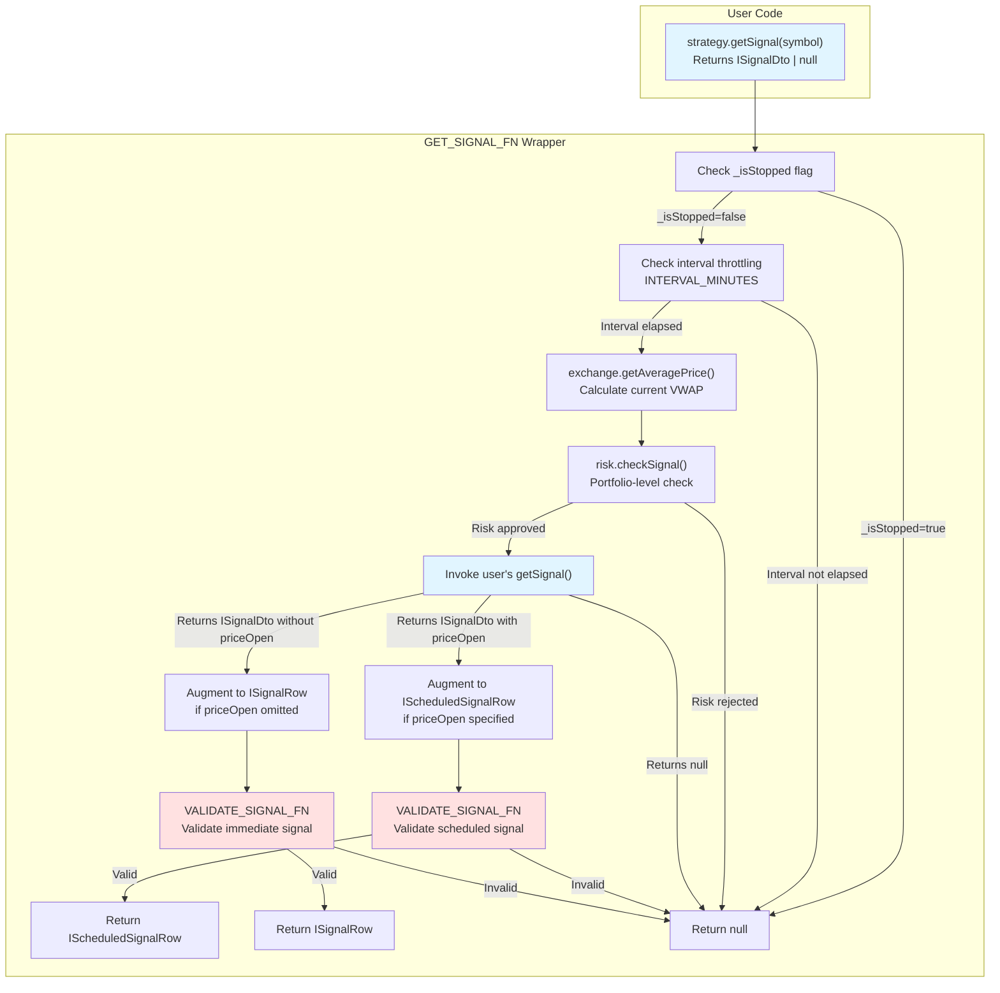
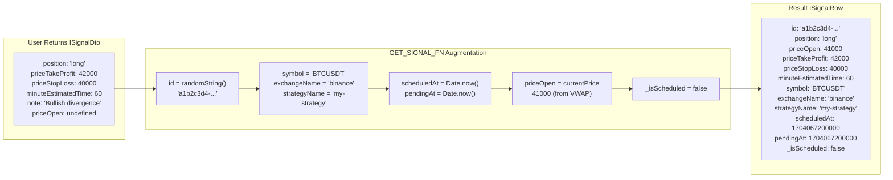
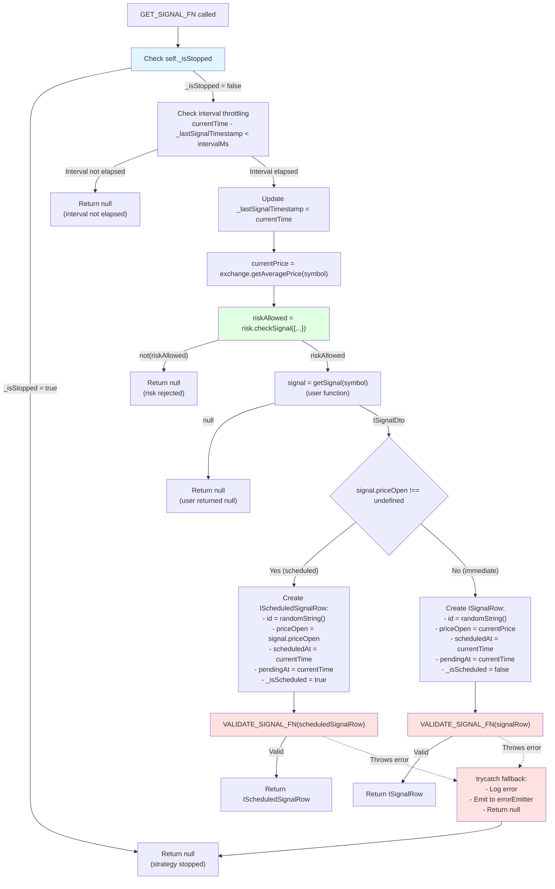
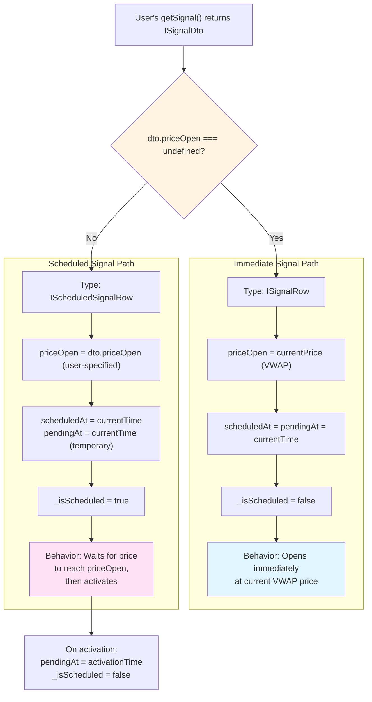
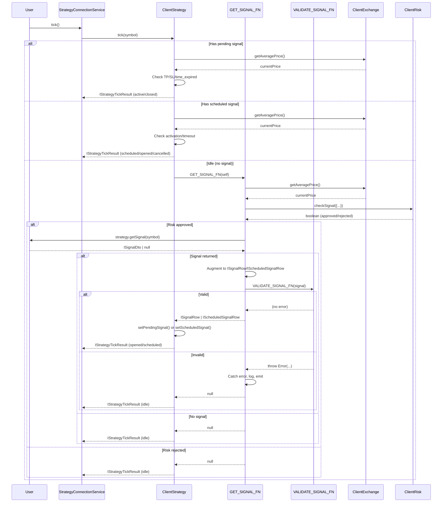

# Signal Generation and Validation

<details>
<summary>Relevant source files</summary>

The following files were used as context for generating this wiki page:

- [src/classes/Persist.ts](src/classes/Persist.ts)
- [src/client/ClientStrategy.ts](src/client/ClientStrategy.ts)
- [src/config/params.ts](src/config/params.ts)
- [src/index.ts](src/index.ts)
- [src/interfaces/Strategy.interface.ts](src/interfaces/Strategy.interface.ts)
- [src/lib/services/connection/StrategyConnectionService.ts](src/lib/services/connection/StrategyConnectionService.ts)
- [src/utils/writeFileAtomic.ts](src/utils/writeFileAtomic.ts)
- [test/config/setup.mjs](test/config/setup.mjs)
- [test/e2e/defend.test.mjs](test/e2e/defend.test.mjs)
- [test/e2e/sanitize.test.mjs](test/e2e/sanitize.test.mjs)
- [test/index.mjs](test/index.mjs)
- [types.d.ts](types.d.ts)

</details>


This page explains how trading signals are generated by user-defined strategies and validated by the framework before execution. Signal validation ensures financial safety by rejecting signals with invalid prices, insufficient profit margins, excessive risk, or unrealistic lifetimes.

**Scope**: This page covers the `GET_SIGNAL_FN` wrapper, `VALIDATE_SIGNAL_FN` validation logic, signal augmentation from `ISignalDto` to `ISignalRow`, and global configuration parameters controlling validation thresholds. For signal lifecycle management after validation, see [Signal States](#8.1). For risk management validation, see [Risk Validation](#12.2).

---

## Signal Generation Flow

When a strategy's `tick()` method executes, the framework calls the user's `getSignal()` function through the `GET_SIGNAL_FN` wrapper, which orchestrates signal generation, validation, and augmentation.

### End-to-End Signal Generation Pipeline



**Sources**: [src/client/ClientStrategy.ts:187-283]()

---

## Signal Data Structures

The framework transforms user-provided `ISignalDto` objects into validated `ISignalRow` objects through augmentation with auto-generated metadata.

### Interface Comparison

| Field | ISignalDto | ISignalRow | IScheduledSignalRow | Description |
|-------|------------|------------|---------------------|-------------|
| `id` | Optional | **Required** (UUID v4) | **Required** | Auto-generated if not provided |
| `position` | **Required** | **Required** | **Required** | Trade direction: `"long"` or `"short"` |
| `priceOpen` | Optional | **Required** | **Required** | Entry price (current VWAP if omitted) |
| `priceTakeProfit` | **Required** | **Required** | **Required** | Take profit target price |
| `priceStopLoss` | **Required** | **Required** | **Required** | Stop loss exit price |
| `minuteEstimatedTime` | **Required** | **Required** | **Required** | Expected signal lifetime in minutes |
| `note` | Optional | Optional | Optional | Human-readable description |
| `symbol` | - | **Required** | **Required** | Trading pair (e.g., "BTCUSDT") |
| `exchangeName` | - | **Required** | **Required** | Exchange identifier |
| `strategyName` | - | **Required** | **Required** | Strategy identifier |
| `scheduledAt` | - | **Required** | **Required** | Signal creation timestamp (ms) |
| `pendingAt` | - | **Required** | **Required** | Position activation timestamp (ms) |
| `_isScheduled` | - | **Required** | **Required** | Runtime marker for scheduled signals |

**Key Differences**:
- `ISignalDto`: User-facing DTO returned by `getSignal()`
- `ISignalRow`: Framework-augmented signal with execution context
- `IScheduledSignalRow`: Extends `ISignalRow` with guaranteed `priceOpen` (delayed entry signal)

**Sources**: [types.d.ts:544-591](), [src/interfaces/Strategy.interface.ts:23-72]()

### Augmentation Example



**Sources**: [src/client/ClientStrategy.ts:232-272]()

---

## VALIDATE_SIGNAL_FN Validation Checks

The `VALIDATE_SIGNAL_FN` performs comprehensive validation of signal parameters to prevent financial losses from invalid trades. All validation checks throw descriptive errors that are caught by `GET_SIGNAL_FN`'s `trycatch` wrapper.

### Validation Architecture

```mermaid
graph TB
    subgraph "VALIDATE_SIGNAL_FN"
        Input["Input: ISignalRow"]
        ErrorArray["errors: string[] = []"]
        
        subgraph "Category 1: Safety Checks"
            CheckFinite["isFinite() checks<br/>Reject NaN/Infinity"]
            CheckPositive["Price > 0 checks<br/>Reject negative/zero"]
        end
        
        subgraph "Category 2: Position Logic"
            CheckLongTP["Long: TP > priceOpen"]
            CheckLongSL["Long: SL < priceOpen"]
            CheckShortTP["Short: TP < priceOpen"]
            CheckShortSL["Short: SL > priceOpen"]
        end
        
        subgraph "Category 3: Distance Constraints"
            CheckTPDistance["TP distance >= CC_MIN_TAKEPROFIT_DISTANCE_PERCENT<br/>Covers fees (0.1% × 2)"]
            CheckSLDistance["SL distance <= CC_MAX_STOPLOSS_DISTANCE_PERCENT<br/>Limits catastrophic loss"]
        end
        
        subgraph "Category 4: Lifetime Constraints"
            CheckMinutePositive["minuteEstimatedTime > 0"]
            CheckMaxLifetime["minuteEstimatedTime <= CC_MAX_SIGNAL_LIFETIME_MINUTES<br/>Prevents eternal signals"]
        end
        
        subgraph "Category 5: Timestamp Checks"
            CheckScheduledAt["scheduledAt > 0"]
            CheckPendingAt["pendingAt > 0"]
        end
        
        ThrowError["if errors.length > 0:<br/>throw Error(errors.join('\\n'))"]
    end
    
    Input --> ErrorArray
    ErrorArray --> CheckFinite
    CheckFinite --> CheckPositive
    CheckPositive --> CheckLongTP
    CheckLongTP --> CheckLongSL
    CheckLongSL --> CheckShortTP
    CheckShortTP --> CheckShortSL
    CheckShortSL --> CheckTPDistance
    CheckTPDistance --> CheckSLDistance
    CheckSLDistance --> CheckMinutePositive
    CheckMinutePositive --> CheckMaxLifetime
    CheckMaxLifetime --> CheckScheduledAt
    CheckScheduledAt --> CheckPendingAt
    CheckPendingAt --> ThrowError
    
    style CheckFinite fill:#ffe1e1
    style CheckTPDistance fill:#fff4e1
    style CheckSLDistance fill:#fff4e1
    style CheckMaxLifetime fill:#fff4e1
```



**Sources**: [src/client/ClientStrategy.ts:40-185]()

### Validation Check Catalog

#### 1. Safety Checks (NaN/Infinity Protection)

Prevents calculation explosions from non-finite values.

```typescript
// Lines 43-58
if (!isFinite(signal.priceOpen)) {
  errors.push(`priceOpen must be a finite number, got ${signal.priceOpen}`);
}
if (!isFinite(signal.priceTakeProfit)) {
  errors.push(`priceTakeProfit must be a finite number, got ${signal.priceTakeProfit}`);
}
if (!isFinite(signal.priceStopLoss)) {
  errors.push(`priceStopLoss must be a finite number, got ${signal.priceStopLoss}`);
}
```

**Rationale**: `NaN` or `Infinity` in prices causes all PnL calculations to become `NaN`, corrupting backtest results.

**Sources**: [src/client/ClientStrategy.ts:43-58](), [test/e2e/sanitize.test.mjs:464-660]()

#### 2. Positive Price Checks

Ensures all prices are positive numbers (physically possible prices).

```typescript
// Lines 61-71
if (isFinite(signal.priceOpen) && signal.priceOpen <= 0) {
  errors.push(`priceOpen must be positive, got ${signal.priceOpen}`);
}
if (isFinite(signal.priceTakeProfit) && signal.priceTakeProfit <= 0) {
  errors.push(`priceTakeProfit must be positive, got ${signal.priceTakeProfit}`);
}
if (isFinite(signal.priceStopLoss) && signal.priceStopLoss <= 0) {
  errors.push(`priceStopLoss must be positive, got ${signal.priceStopLoss}`);
}
```

**Rationale**: Negative or zero prices are impossible on exchanges and cause undefined behavior in price calculations.

**Sources**: [src/client/ClientStrategy.ts:61-71](), [test/e2e/sanitize.test.mjs:360-452]()

#### 3. Position-Specific Logic Validation

Validates TP/SL relationship to `priceOpen` based on trade direction.

##### Long Position Rules

```typescript
// Lines 74-110
if (signal.position === "long") {
  // TP must be ABOVE priceOpen (profit on price increase)
  if (signal.priceTakeProfit <= signal.priceOpen) {
    errors.push(`Long: priceTakeProfit (${signal.priceTakeProfit}) must be > priceOpen (${signal.priceOpen})`);
  }
  
  // SL must be BELOW priceOpen (limit loss on price decrease)
  if (signal.priceStopLoss >= signal.priceOpen) {
    errors.push(`Long: priceStopLoss (${signal.priceStopLoss}) must be < priceOpen (${signal.priceOpen})`);
  }
}
```

**Rationale**: Long positions profit when price increases, so TP must be higher than entry price, and SL must be lower to cut losses.

##### Short Position Rules

```typescript
// Lines 114-150
if (signal.position === "short") {
  // TP must be BELOW priceOpen (profit on price decrease)
  if (signal.priceTakeProfit >= signal.priceOpen) {
    errors.push(`Short: priceTakeProfit (${signal.priceTakeProfit}) must be < priceOpen (${signal.priceOpen})`);
  }
  
  // SL must be ABOVE priceOpen (limit loss on price increase)
  if (signal.priceStopLoss <= signal.priceOpen) {
    errors.push(`Short: priceStopLoss (${signal.priceStopLoss}) must be > priceOpen (${signal.priceOpen})`);
  }
}
```

**Rationale**: Short positions profit when price decreases, so TP must be lower than entry price, and SL must be higher to cut losses.

**Sources**: [src/client/ClientStrategy.ts:74-150](), [test/e2e/defend.test.mjs:544-641]()

#### 4. Minimum TakeProfit Distance (Fee Coverage)

Ensures TakeProfit is far enough from entry to cover trading fees and slippage.

```typescript
// Lines 87-97 (Long example)
const tpDistancePercent = ((signal.priceTakeProfit - signal.priceOpen) / signal.priceOpen) * 100;
if (tpDistancePercent < GLOBAL_CONFIG.CC_MIN_TAKEPROFIT_DISTANCE_PERCENT) {
  errors.push(
    `Long: TakeProfit too close to priceOpen (${tpDistancePercent.toFixed(3)}%). ` +
    `Minimum distance: ${GLOBAL_CONFIG.CC_MIN_TAKEPROFIT_DISTANCE_PERCENT}% to cover trading fees. ` +
    `Current: TP=${signal.priceTakeProfit}, Open=${signal.priceOpen}`
  );
}
```

**Default Configuration**: `CC_MIN_TAKEPROFIT_DISTANCE_PERCENT = 0.1%`

**Rationale**: Trading fees (0.1% entry + 0.1% exit) plus slippage require minimum 0.2-0.3% profit margin to avoid net losses on winning trades.

**Example Rejection**:
- `priceOpen = 42000`, `priceTakeProfit = 42010` → Distance = 0.024% → **REJECTED**
- Net PnL after fees: 0.024% - 0.2% = **-0.176% loss despite "winning" trade**

**Sources**: [src/client/ClientStrategy.ts:87-97](), [src/config/params.ts:16-18](), [test/e2e/sanitize.test.mjs:27-131]()

#### 5. Maximum StopLoss Distance (Catastrophic Loss Prevention)

Limits maximum loss per signal to protect capital from extreme StopLoss values.

```typescript
// Lines 100-110 (Long example)
const slDistancePercent = ((signal.priceOpen - signal.priceStopLoss) / signal.priceOpen) * 100;
if (slDistancePercent > GLOBAL_CONFIG.CC_MAX_STOPLOSS_DISTANCE_PERCENT) {
  errors.push(
    `Long: StopLoss too far from priceOpen (${slDistancePercent.toFixed(3)}%). ` +
    `Maximum distance: ${GLOBAL_CONFIG.CC_MAX_STOPLOSS_DISTANCE_PERCENT}% to protect capital. ` +
    `Current: SL=${signal.priceStopLoss}, Open=${signal.priceOpen}`
  );
}
```

**Default Configuration**: `CC_MAX_STOPLOSS_DISTANCE_PERCENT = 20%`

**Rationale**: Prevents single trades from causing catastrophic portfolio drawdowns. A 50% loss requires 100% gain to recover.

**Example Rejection**:
- `priceOpen = 42000`, `priceStopLoss = 20000` → Distance = 52.4% → **REJECTED**
- Single trade could lose >50% of position value

**Sources**: [src/client/ClientStrategy.ts:100-110](), [src/config/params.ts:19-23](), [test/e2e/sanitize.test.mjs:143-238]()

#### 6. Maximum Signal Lifetime (Eternal Signal Prevention)

Prevents signals from blocking risk limits indefinitely.

```typescript
// Lines 161-170
if (signal.minuteEstimatedTime > GLOBAL_CONFIG.CC_MAX_SIGNAL_LIFETIME_MINUTES) {
  const days = (signal.minuteEstimatedTime / 60 / 24).toFixed(1);
  const maxDays = (GLOBAL_CONFIG.CC_MAX_SIGNAL_LIFETIME_MINUTES / 60 / 24).toFixed(0);
  errors.push(
    `minuteEstimatedTime too large (${signal.minuteEstimatedTime} minutes = ${days} days). ` +
    `Maximum: ${GLOBAL_CONFIG.CC_MAX_SIGNAL_LIFETIME_MINUTES} minutes (${maxDays} days) to prevent strategy deadlock. ` +
    `Eternal signals block risk limits and prevent new trades.`
  );
}
```

**Default Configuration**: `CC_MAX_SIGNAL_LIFETIME_MINUTES = 1440` (1 day)

**Rationale**: Active signals count against `maxConcurrentPositions` risk limits. A signal with `minuteEstimatedTime = 50000` (34 days) blocks the risk slot for over a month, preventing new trades.

**Example Rejection**:
- `minuteEstimatedTime = 50000` minutes (34.7 days) → **REJECTED**
- Strategy would be unable to open new positions for >1 month

**Sources**: [src/client/ClientStrategy.ts:161-170](), [src/config/params.ts:24-29](), [test/e2e/sanitize.test.mjs:250-348]()

---

## GET_SIGNAL_FN Orchestration

The `GET_SIGNAL_FN` wrapper coordinates signal generation, validation, and error handling through a `trycatch` wrapper with automatic error emission.

### GET_SIGNAL_FN Control Flow



**Sources**: [src/client/ClientStrategy.ts:187-283]()

### Interval Throttling

The `INTERVAL_MINUTES` map converts `SignalInterval` strings to milliseconds for throttling:

```typescript
// Lines 31-38
const INTERVAL_MINUTES: Record<SignalInterval, number> = {
  "1m": 1,
  "3m": 3,
  "5m": 5,
  "15m": 15,
  "30m": 30,
  "1h": 60,
};
```

**Logic** (lines 196-208):
```typescript
const intervalMinutes = INTERVAL_MINUTES[self.params.interval];
const intervalMs = intervalMinutes * 60 * 1000;

// Only call getSignal if enough time has passed
if (self._lastSignalTimestamp !== null && 
    currentTime - self._lastSignalTimestamp < intervalMs) {
  return null;
}

self._lastSignalTimestamp = currentTime;
```

**Purpose**: Prevents excessive API calls and ensures strategies generate signals at specified intervals (e.g., `interval: "5m"` → max 1 signal per 5 minutes).

**Sources**: [src/client/ClientStrategy.ts:31-38](), [src/client/ClientStrategy.ts:196-208]()

### Error Handling Strategy

The `trycatch` wrapper (lines 187-283) catches validation errors and prevents crashes:

```typescript
const GET_SIGNAL_FN = trycatch(
  async (self: ClientStrategy): Promise<ISignalRow | IScheduledSignalRow | null> => {
    // ... signal generation logic ...
  },
  {
    defaultValue: null,
    fallback: (error) => {
      backtest.loggerService.warn("ClientStrategy exception thrown", {
        error: errorData(error),
        message: getErrorMessage(error),
      });
      errorEmitter.next(error);
    },
  }
);
```

**Behavior**:
- **Validation errors** → Logged, emitted to `errorEmitter`, returns `null`
- **User function errors** → Same handling (logged + emitted + null)
- **Framework continues execution** without crashing

**Observability**: Errors are emitted to `errorEmitter` for monitoring via `listenError()` event listener.

**Sources**: [src/client/ClientStrategy.ts:187-283](), [src/config/emitters.ts]()

---

## Scheduled vs Immediate Signals

Signals can be immediate (open at current price) or scheduled (wait for specific entry price).

### Signal Type Decision Tree



**Sources**: [src/client/ClientStrategy.ts:232-272](), [src/interfaces/Strategy.interface.ts:64-72]()

### Immediate Signal Example

```typescript
// User returns ISignalDto without priceOpen
{
  position: "long",
  priceTakeProfit: 42000,
  priceStopLoss: 40000,
  minuteEstimatedTime: 60,
}

// Framework augments to ISignalRow (lines 256-269)
{
  id: "a1b2c3d4-e5f6-7890-abcd-ef1234567890",
  priceOpen: 41000,  // ← currentPrice from VWAP
  position: "long",
  priceTakeProfit: 42000,
  priceStopLoss: 40000,
  minuteEstimatedTime: 60,
  symbol: "BTCUSDT",
  exchangeName: "binance",
  strategyName: "my-strategy",
  scheduledAt: 1704067200000,  // ← Same timestamp
  pendingAt: 1704067200000,    // ← Same timestamp (immediate entry)
  _isScheduled: false,
}
```

**Behavior**: Position opens immediately at current VWAP price. Both `scheduledAt` and `pendingAt` are identical.

**Sources**: [src/client/ClientStrategy.ts:256-269]()

### Scheduled Signal Example

```typescript
// User returns ISignalDto with priceOpen
{
  position: "long",
  priceOpen: 41000,  // ← User specifies entry price
  priceTakeProfit: 42000,
  priceStopLoss: 40000,
  minuteEstimatedTime: 60,
}

// Framework augments to IScheduledSignalRow (lines 234-251)
{
  id: "a1b2c3d4-e5f6-7890-abcd-ef1234567890",
  priceOpen: 41000,  // ← User's specified price
  position: "long",
  priceTakeProfit: 42000,
  priceStopLoss: 40000,
  minuteEstimatedTime: 60,
  symbol: "BTCUSDT",
  exchangeName: "binance",
  strategyName: "my-strategy",
  scheduledAt: 1704067200000,  // ← Creation time
  pendingAt: 1704067200000,    // ← Temporary (updated on activation)
  _isScheduled: true,
}

// On activation (lines 510-515)
{
  // ... same fields ...
  pendingAt: 1704067800000,  // ← Updated to activation time (+10min)
  _isScheduled: false,       // ← Converted to regular signal
}
```

**Behavior**: Signal waits until market price reaches `priceOpen`, then activates. The `pendingAt` timestamp is updated at activation time to accurately track position duration.

**Timeout**: Scheduled signals cancel after `CC_SCHEDULE_AWAIT_MINUTES` (default: 120 minutes) if price never reaches `priceOpen`.

**Sources**: [src/client/ClientStrategy.ts:234-251](), [src/client/ClientStrategy.ts:510-515](), [src/config/params.ts:6-7]()

---

## Configuration Parameters

Global configuration parameters control validation thresholds. These can be modified via `setConfig()` to customize validation behavior.

### Validation Configuration Table

| Parameter | Default | Unit | Purpose | Validation Target |
|-----------|---------|------|---------|-------------------|
| `CC_MIN_TAKEPROFIT_DISTANCE_PERCENT` | `0.1` | % | Minimum TP-priceOpen distance | Fee coverage check |
| `CC_MAX_STOPLOSS_DISTANCE_PERCENT` | `20` | % | Maximum SL-priceOpen distance | Catastrophic loss prevention |
| `CC_MAX_SIGNAL_LIFETIME_MINUTES` | `1440` | minutes | Maximum signal lifetime | Eternal signal prevention |
| `CC_SCHEDULE_AWAIT_MINUTES` | `120` | minutes | Scheduled signal timeout | Scheduled signal cancellation |

**Sources**: [src/config/params.ts:1-36](), [types.d.ts:5-34]()

### Configuration Usage Example

```typescript
import { setConfig } from "backtest-kit";

// Customize validation thresholds
setConfig({
  CC_MIN_TAKEPROFIT_DISTANCE_PERCENT: 0.3,  // Require 0.3% profit margin
  CC_MAX_STOPLOSS_DISTANCE_PERCENT: 10,     // Limit max loss to 10%
  CC_MAX_SIGNAL_LIFETIME_MINUTES: 720,      // Max 12-hour signal lifetime
});
```

**Effect**: All subsequent signal validations use the updated thresholds.

**Testing Strategy**: Test suites disable validation for legacy tests by setting permissive values:

```typescript
// test/config/setup.mjs:36-41
setConfig({
  CC_MIN_TAKEPROFIT_DISTANCE_PERCENT: 0,      // No TP distance check
  CC_MAX_STOPLOSS_DISTANCE_PERCENT: 100,      // Allow any SL
  CC_MAX_SIGNAL_LIFETIME_MINUTES: 999999,     // No lifetime limit
});
```

**Sources**: [types.d.ts:85-97](), [test/config/setup.mjs:36-41]()

---

## Validation Error Examples

This section demonstrates common validation failures and their error messages.

### Example 1: Micro-Profit Eaten by Fees

```typescript
// User's getSignal returns:
{
  position: "long",
  priceOpen: 42000,
  priceTakeProfit: 42010,  // Only +0.024% profit
  priceStopLoss: 41000,
  minuteEstimatedTime: 60,
}

// VALIDATE_SIGNAL_FN throws:
// "Long: TakeProfit too close to priceOpen (0.024%). 
//  Minimum distance: 0.1% to cover trading fees. 
//  Current: TP=42010, Open=42000"
```

**Why Rejected**: Profit of 0.024% cannot cover trading fees (0.1% entry + 0.1% exit = 0.2%). Net result would be -0.176% loss despite hitting TP.

**Sources**: [test/e2e/sanitize.test.mjs:27-131]()

### Example 2: Catastrophic StopLoss

```typescript
// User's getSignal returns:
{
  position: "long",
  priceOpen: 42000,
  priceTakeProfit: 43000,
  priceStopLoss: 20000,  // -52.4% loss!
  minuteEstimatedTime: 60,
}

// VALIDATE_SIGNAL_FN throws:
// "Long: StopLoss too far from priceOpen (52.381%). 
//  Maximum distance: 20% to protect capital. 
//  Current: SL=20000, Open=42000"
```

**Why Rejected**: Single trade could lose >50% of position value, requiring >100% gain to recover.

**Sources**: [test/e2e/sanitize.test.mjs:143-238]()

### Example 3: Eternal Signal

```typescript
// User's getSignal returns:
{
  position: "long",
  priceOpen: 42000,
  priceTakeProfit: 43000,
  priceStopLoss: 41000,
  minuteEstimatedTime: 50000,  // 34.7 days!
}

// VALIDATE_SIGNAL_FN throws:
// "minuteEstimatedTime too large (50000 minutes = 34.7 days). 
//  Maximum: 1440 minutes (1 days) to prevent strategy deadlock. 
//  Eternal signals block risk limits and prevent new trades."
```

**Why Rejected**: Signal would occupy risk limit slot for >1 month, preventing new trades.

**Sources**: [test/e2e/sanitize.test.mjs:250-348]()

### Example 4: NaN Price

```typescript
// User's getSignal returns:
{
  position: "long",
  priceOpen: NaN,  // Invalid!
  priceTakeProfit: 43000,
  priceStopLoss: 41000,
  minuteEstimatedTime: 60,
}

// VALIDATE_SIGNAL_FN throws:
// "priceOpen must be a finite number, got NaN (number)"
```

**Why Rejected**: NaN propagates through all calculations, corrupting PnL results.

**Sources**: [test/e2e/sanitize.test.mjs:464-556]()

### Example 5: Invalid Long Position Logic

```typescript
// User's getSignal returns:
{
  position: "long",
  priceOpen: 41000,
  priceTakeProfit: 40000,  // TP BELOW priceOpen!
  priceStopLoss: 39000,
  minuteEstimatedTime: 60,
}

// VALIDATE_SIGNAL_FN throws:
// "Long: priceTakeProfit (40000) must be > priceOpen (41000)"
```

**Why Rejected**: Long positions profit when price increases. TP must be above entry price.

**Sources**: [test/e2e/defend.test.mjs:544-641]()

---

## Integration with ClientStrategy

The `GET_SIGNAL_FN` is called from `ClientStrategy.tick()` method during strategy execution.

### ClientStrategy.tick() Call Chain



**Sources**: [src/client/ClientStrategy.ts:187-283](), [src/lib/services/connection/StrategyConnectionService.ts:104-121]()

---

## Summary

Signal generation and validation in backtest-kit ensures financial safety through:

1. **GET_SIGNAL_FN Wrapper**: Orchestrates signal generation, interval throttling, risk checks, and validation
2. **VALIDATE_SIGNAL_FN Logic**: Comprehensive validation covering price safety, position logic, distance constraints, and lifetime limits
3. **Configuration Flexibility**: Tunable thresholds via `GLOBAL_CONFIG` parameters
4. **Scheduled Signals**: Support for delayed entry at specific prices with timeout handling
5. **Error Resilience**: Automatic error handling prevents crashes while maintaining observability

**Key Validation Checks**:
- ✅ Finite prices (no NaN/Infinity)
- ✅ Positive prices (no negative/zero)
- ✅ Position-specific logic (TP/SL direction)
- ✅ Fee coverage (TP distance ≥ 0.1%)
- ✅ Loss limits (SL distance ≤ 20%)
- ✅ Lifetime constraints (≤ 1440 minutes)

**Sources**: [src/client/ClientStrategy.ts:40-283](), [src/config/params.ts:1-36](), [types.d.ts:5-34]()