# Signal Lifecycle

<details>
<summary>Relevant source files</summary>

The following files were used as context for generating this wiki page:

- [src/client/ClientStrategy.ts](src/client/ClientStrategy.ts)
- [src/interfaces/Strategy.interface.ts](src/interfaces/Strategy.interface.ts)
- [test/e2e/defend.test.mjs](test/e2e/defend.test.mjs)
- [test/e2e/partial.test.mjs](test/e2e/partial.test.mjs)
- [test/index.mjs](test/index.mjs)
- [types.d.ts](types.d.ts)

</details>


This document provides a comprehensive guide to the signal lifecycle in backtest-kit. It covers signal states, generation, validation, state transitions, and persistence. The signal lifecycle is the core mechanism through which trading positions are created, monitored, and closed by the framework.

For information about risk management checks that occur during signal generation, see [Risk Management](#12). For details on execution modes (Backtest vs Live) that affect lifecycle behavior, see [Execution Modes](#2.1).

---

## Signal States Overview

Signals in backtest-kit follow a discriminated union pattern with six possible states. Each state is represented by a specific TypeScript interface with an `action` discriminator field for type-safe handling.

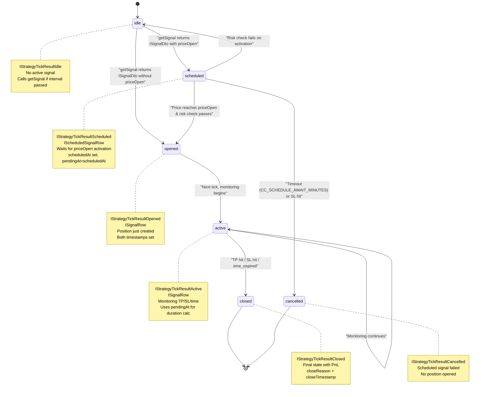

**Sources:** [types.d.ts:653-770](), [src/interfaces/Strategy.interface.ts:159-295]()

---

## Signal Data Structures

The framework defines a hierarchy of signal types with increasing levels of completeness and metadata.

### Core Signal Types

| Type | Description | Key Fields | Usage |
|------|-------------|------------|-------|
| `ISignalDto` | User-returned signal from `getSignal()` | `position`, `priceTakeProfit`, `priceStopLoss`, `minuteEstimatedTime`, optional `priceOpen` | Returned by strategy's `getSignal` function |
| `ISignalRow` | Validated signal with metadata | Extends `ISignalDto` + `id`, `priceOpen` (required), `scheduledAt`, `pendingAt`, `symbol`, `strategyName`, `exchangeName`, `_isScheduled` | Used throughout lifecycle |
| `IScheduledSignalRow` | Scheduled signal variant | Extends `ISignalRow`, enforces `priceOpen` presence | Represents delayed entry signals |

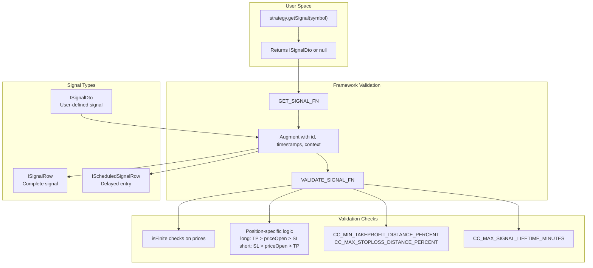

**Sources:** [types.d.ts:543-592](), [src/interfaces/Strategy.interface.ts:19-72](), [src/client/ClientStrategy.ts:187-283]()

---

## Signal Generation Process

Signal generation occurs within `ClientStrategy` and involves throttling, risk checks, and validation. The `GET_SIGNAL_FN` wrapper coordinates this process.

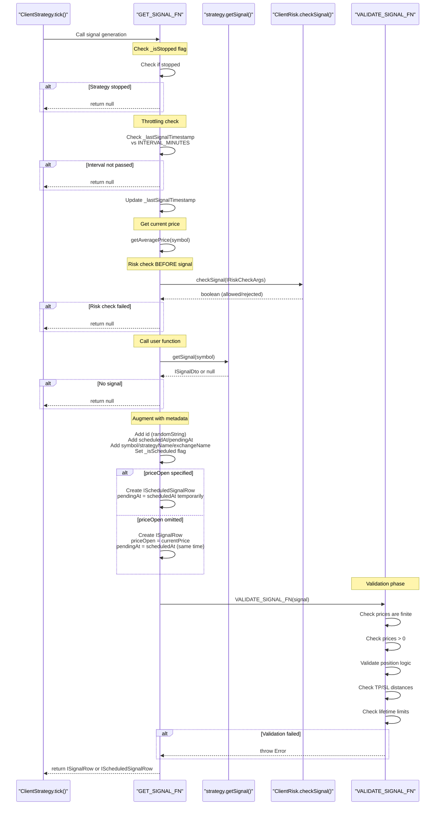

**Sources:** [src/client/ClientStrategy.ts:187-283](), [src/client/ClientStrategy.ts:31-38]()

---

## Signal Validation Rules

The `VALIDATE_SIGNAL_FN` enforces critical safety checks to prevent invalid signals from entering the system. All validations throw descriptive errors if checks fail.

### Validation Categories

**1. Finite Number Protection**
```typescript
// Protects against NaN/Infinity from calculation errors
if (!isFinite(signal.priceOpen)) { /* error */ }
if (!isFinite(signal.priceTakeProfit)) { /* error */ }
if (!isFinite(signal.priceStopLoss)) { /* error */ }
```

**2. Price Positivity**
```typescript
// All prices must be positive
priceOpen > 0
priceTakeProfit > 0
priceStopLoss > 0
```

**3. Position Logic (Long)**
```typescript
// Long position: buy low, sell high
priceTakeProfit > priceOpen > priceStopLoss
```

**4. Position Logic (Short)**
```typescript
// Short position: sell high, buy low
priceStopLoss > priceOpen > priceTakeProfit
```

**5. TakeProfit Distance**
```typescript
// Must cover trading fees (default 0.3% > 2×0.1% fees)
const tpDistancePercent = Math.abs((priceTakeProfit - priceOpen) / priceOpen) * 100;
tpDistancePercent >= CC_MIN_TAKEPROFIT_DISTANCE_PERCENT
```

**6. StopLoss Distance**
```typescript
// Prevents catastrophic losses (default max 20%)
const slDistancePercent = Math.abs((priceStopLoss - priceOpen) / priceOpen) * 100;
slDistancePercent <= CC_MAX_STOPLOSS_DISTANCE_PERCENT
```

**7. Signal Lifetime**
```typescript
// Prevents eternal signals blocking risk limits (default max 1440 minutes = 1 day)
minuteEstimatedTime <= CC_MAX_SIGNAL_LIFETIME_MINUTES
```

**Sources:** [src/client/ClientStrategy.ts:40-185](), [types.d.ts:5-34]()

---

## State Transition: Idle to Opened/Scheduled

When no active signal exists, `ClientStrategy.tick()` attempts to generate a new signal. The flow differs based on whether `priceOpen` is specified.

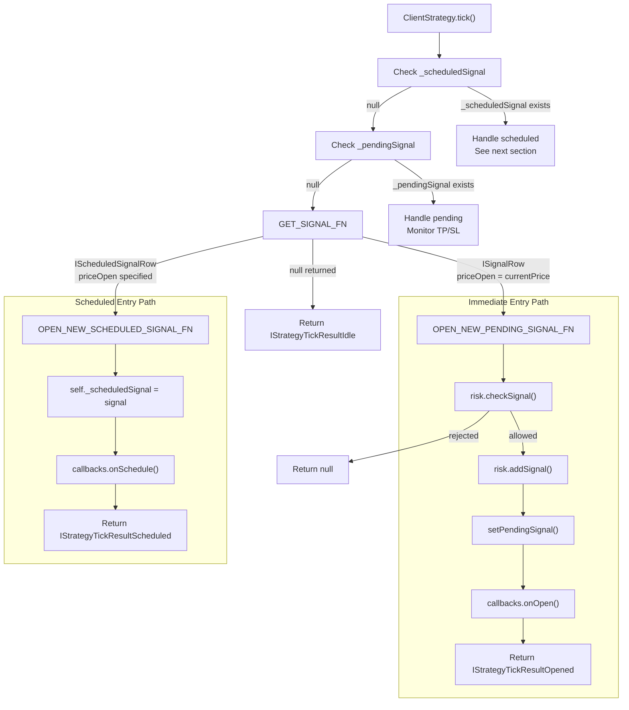

**Key Difference:** Immediate signals undergo risk check and call `risk.addSignal()` immediately. Scheduled signals defer risk check until price activation.

**Sources:** [src/client/ClientStrategy.ts:578-621](), [src/client/ClientStrategy.ts:623-673]()

---

## Scheduled Signal Lifecycle

Scheduled signals represent delayed entry positions that wait for price to reach `priceOpen`. They have special activation and cancellation logic.

### Scheduled Signal State Machine

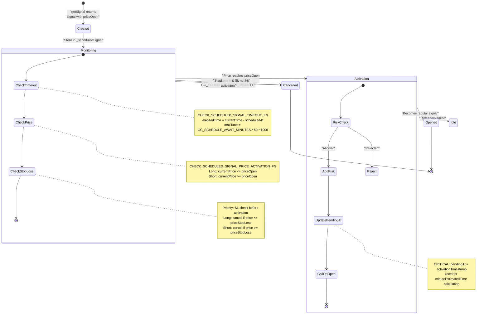

**Sources:** [src/client/ClientStrategy.ts:332-386](), [src/client/ClientStrategy.ts:388-422](), [src/client/ClientStrategy.ts:459-551]()

### Activation vs Cancellation Priority

The framework prioritizes StopLoss cancellation over activation to prevent opening positions that would immediately lose:

```typescript
// CHECK_SCHEDULED_SIGNAL_PRICE_ACTIVATION_FN logic
if (scheduled.position === "long") {
  // Check StopLoss FIRST (cancellation priority)
  if (currentPrice <= scheduled.priceStopLoss) {
    shouldCancel = true;
  }
  // Only activate if NOT cancelled
  else if (currentPrice <= scheduled.priceOpen) {
    shouldActivate = true;
  }
}
```

**Sources:** [src/client/ClientStrategy.ts:388-422]()

---

## State Transition: Active to Closed

Once a signal is opened (stored in `_pendingSignal`), it enters active monitoring. The framework checks for TP/SL conditions and time expiration on each tick.

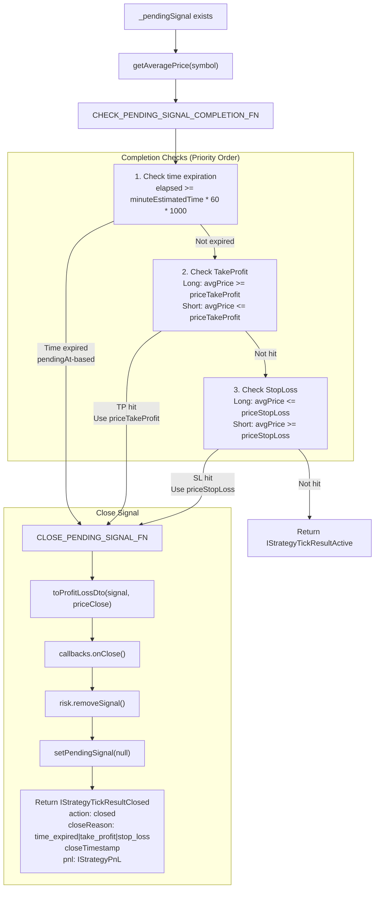

**Critical Detail:** Time expiration uses `pendingAt` timestamp, not `scheduledAt`. For scheduled signals, this ensures `minuteEstimatedTime` counts from activation, not from creation.

**Sources:** [src/client/ClientStrategy.ts:675-734](), [src/client/ClientStrategy.ts:736-789]()

---

## Timestamp Management

Signals maintain two critical timestamps with distinct semantics:

| Timestamp | Meaning | Set When | Used For |
|-----------|---------|----------|----------|
| `scheduledAt` | Signal creation time | Signal first generated by `getSignal()` | Tracking signal age, scheduled timeout calculation |
| `pendingAt` | Position active time | Immediate: same as `scheduledAt`<br/>Scheduled: updated on activation | `minuteEstimatedTime` duration calculation, TP/SL/time monitoring |

### Timestamp Flow for Immediate Signals

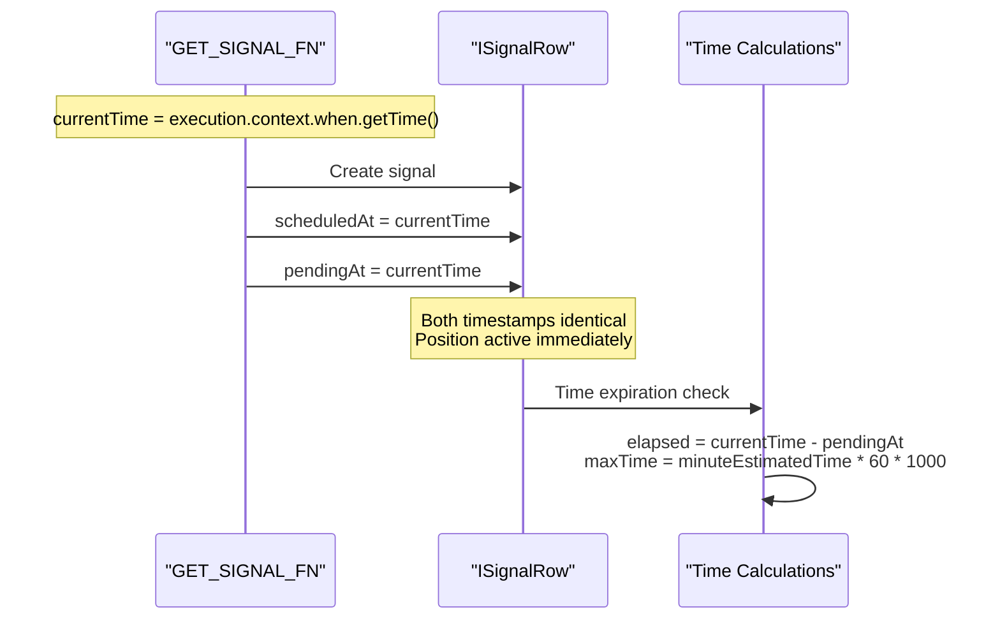

### Timestamp Flow for Scheduled Signals

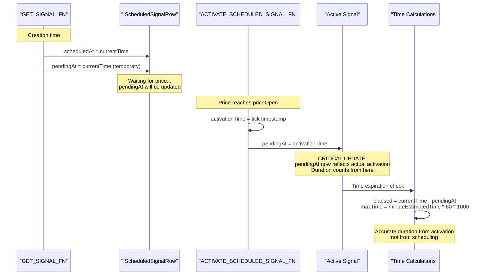

**Sources:** [src/client/ClientStrategy.ts:243-266](), [src/client/ClientStrategy.ts:510-515](), [src/client/ClientStrategy.ts:949-954](), [src/client/ClientStrategy.ts:675-683]()

---

## Signal Persistence (Live Mode Only)

In live trading mode, signals are persisted to disk after every state change to enable crash recovery. The `PersistSignalAdapter` provides atomic file operations.

### Persistence Architecture

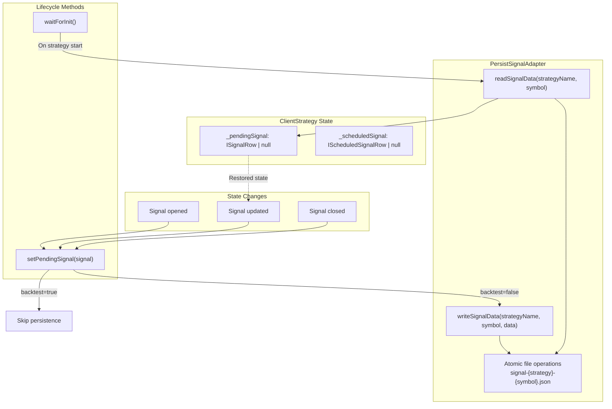

### Persistence Flow Example

```typescript
// setPendingSignal implementation
async setPendingSignal(signal: ISignalRow | null) {
  this._pendingSignal = signal;
  
  // Persist only in live mode (not backtest)
  if (!this.params.execution.context.backtest) {
    await PersistSignalAdaper.writeSignalData(
      this.params.strategyName,
      this.params.execution.context.symbol,
      signal
    );
  }
}

// waitForInit implementation
async waitForInit() {
  if (this.params.execution.context.backtest) {
    return; // No persistence in backtest
  }
  
  const pendingSignal = await PersistSignalAdaper.readSignalData(
    this.params.strategyName,
    this.params.execution.context.symbol
  );
  
  if (pendingSignal) {
    this._pendingSignal = pendingSignal;
    
    // Call onActive callback for restored signal
    if (this.params.callbacks?.onActive) {
      const currentPrice = await this.params.exchange.getAveragePrice(
        this.params.execution.context.symbol
      );
      this.params.callbacks.onActive(
        this.params.execution.context.symbol,
        pendingSignal,
        currentPrice,
        false // backtest=false
      );
    }
  }
}
```

**Note:** Scheduled signals (`_scheduledSignal`) are NOT persisted. Only active positions (`_pendingSignal`) survive crashes.

**Sources:** [src/client/ClientStrategy.ts:1068-1081](), [src/client/ClientStrategy.ts:298-330](), [src/classes/Persist.ts:1-300]()

---

## PnL Calculation

Profit and loss is calculated by `toProfitLossDto` which applies trading fees and slippage to both entry and exit prices.

### Fee and Slippage Model

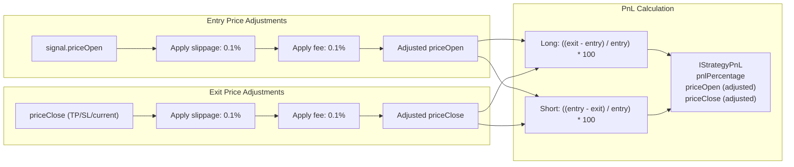

### Long Position Example

```typescript
// Original signal
priceOpen = 100
priceTakeProfit = 101

// TP hit, calculate PnL
priceClose = 101

// Apply fees/slippage to entry
entryPrice = 100 * (1 + 0.001) * (1 + 0.001) = 100.2001

// Apply fees/slippage to exit
exitPrice = 101 * (1 - 0.001) * (1 - 0.001) = 100.797999

// Calculate PnL
pnlPercentage = ((100.797999 - 100.2001) / 100.2001) * 100 = 0.597%
```

### Short Position Example

```typescript
// Original signal
priceOpen = 100
priceTakeProfit = 99

// TP hit, calculate PnL
priceClose = 99

// Apply fees/slippage to entry (worse price for short = lower)
entryPrice = 100 * (1 - 0.001) * (1 - 0.001) = 99.7999

// Apply fees/slippage to exit (worse price for short = higher)
exitPrice = 99 * (1 + 0.001) * (1 + 0.001) = 99.198001

// Calculate PnL
pnlPercentage = ((99.7999 - 99.198001) / 99.7999) * 100 = 0.603%
```

**Note:** The `CC_MIN_TAKEPROFIT_DISTANCE_PERCENT` default of 0.3% accounts for the 0.2% total fees (entry + exit), ensuring profitable trades after costs.

**Sources:** [src/helpers/toProfitLossDto.ts:1-50](), [types.d.ts:16-20]()

---

## Backtest vs Live Lifecycle Differences

The signal lifecycle behaves differently in backtest and live modes due to timing and data availability constraints.

| Aspect | Backtest Mode | Live Mode |
|--------|---------------|-----------|
| **Time Source** | Historical candle timestamps | `Date.now()` |
| **Signal Generation** | Once per candle timestamp | Throttled by real time + `INTERVAL_MINUTES` |
| **TP/SL Detection** | Check `candle.high` and `candle.low` | Check VWAP from `getAveragePrice()` |
| **Fast-Forward** | `strategy.backtest(candles)` processes all at once | `strategy.tick()` processes one tick at a time |
| **Scheduled Activation Timestamp** | `candle.timestamp + 60*1000` (next candle) | Actual tick time when detected |
| **Persistence** | None | `PersistSignalAdapter` writes to disk |
| **Crash Recovery** | N/A | `waitForInit()` restores state |
| **Callbacks** | `backtest=true` flag | `backtest=false` flag |

### Backtest Fast-Forward Algorithm

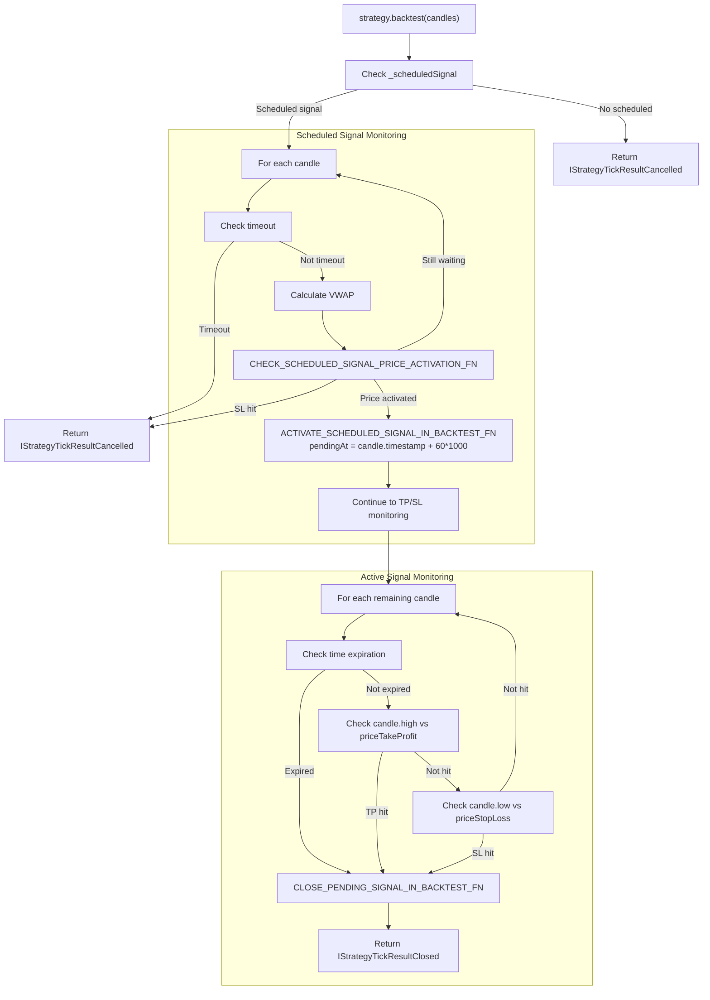

**Key Optimization:** The backtest method processes all candles in a single pass without yielding control, making it significantly faster than tick-by-tick iteration.

**Sources:** [src/client/ClientStrategy.ts:1008-1177](), [src/client/ClientStrategy.ts:897-973](), [src/client/ClientStrategy.ts:975-1006]()

---

## Event Emission During Lifecycle

Every state transition emits events through Subject-based emitters, enabling observability and report generation.

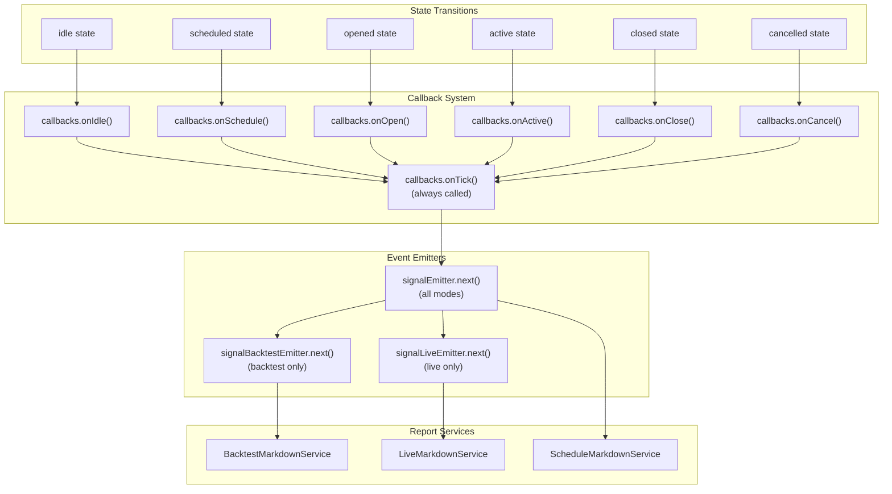

**Event Flow:** Each state transition calls the specific lifecycle callback (e.g., `onOpen`), then always calls `onTick` with the full result. The result is then emitted to all registered listeners via the Subject pattern.

**Sources:** [src/config/emitters.ts:1-100](), [src/lib/services/connection/StrategyConnectionService.ts:104-121](), [types.d.ts:595-611]()

---

## Summary Table: Signal Lifecycle Functions

| Function | Location | Purpose | Returns |
|----------|----------|---------|---------|
| `GET_SIGNAL_FN` | [ClientStrategy.ts:187-283]() | Throttled signal generation with risk check | `ISignalRow \| IScheduledSignalRow \| null` |
| `VALIDATE_SIGNAL_FN` | [ClientStrategy.ts:40-185]() | Validate prices, TP/SL logic, distances, lifetime | `void` (throws on error) |
| `CHECK_SCHEDULED_SIGNAL_TIMEOUT_FN` | [ClientStrategy.ts:332-386]() | Check if scheduled signal timed out | `IStrategyTickResultCancelled \| null` |
| `CHECK_SCHEDULED_SIGNAL_PRICE_ACTIVATION_FN` | [ClientStrategy.ts:388-422]() | Determine if scheduled signal should activate/cancel | `{ shouldActivate, shouldCancel }` |
| `ACTIVATE_SCHEDULED_SIGNAL_FN` | [ClientStrategy.ts:459-551]() | Convert scheduled to active signal (live) | `IStrategyTickResultOpened \| null` |
| `ACTIVATE_SCHEDULED_SIGNAL_IN_BACKTEST_FN` | [ClientStrategy.ts:897-973]() | Convert scheduled to active signal (backtest) | `boolean` |
| `OPEN_NEW_PENDING_SIGNAL_FN` | [ClientStrategy.ts:623-673]() | Create immediate entry signal | `IStrategyTickResultOpened \| null` |
| `OPEN_NEW_SCHEDULED_SIGNAL_FN` | [ClientStrategy.ts:578-621]() | Create delayed entry signal | `IStrategyTickResultScheduled` |
| `CHECK_PENDING_SIGNAL_COMPLETION_FN` | [ClientStrategy.ts:675-734]() | Check TP/SL/time conditions | `IStrategyTickResultClosed \| null` |
| `CLOSE_PENDING_SIGNAL_FN` | [ClientStrategy.ts:736-789]() | Close signal and calculate PnL (live) | `IStrategyTickResultClosed` |
| `CLOSE_PENDING_SIGNAL_IN_BACKTEST_FN` | [ClientStrategy.ts:975-1006]() | Close signal and calculate PnL (backtest) | `IStrategyTickResultClosed` |
| `toProfitLossDto` | [toProfitLossDto.ts:1-50]() | Calculate PnL with fees/slippage | `IStrategyPnL` |

**Sources:** [src/client/ClientStrategy.ts:1-1300](), [src/helpers/toProfitLossDto.ts:1-50]()