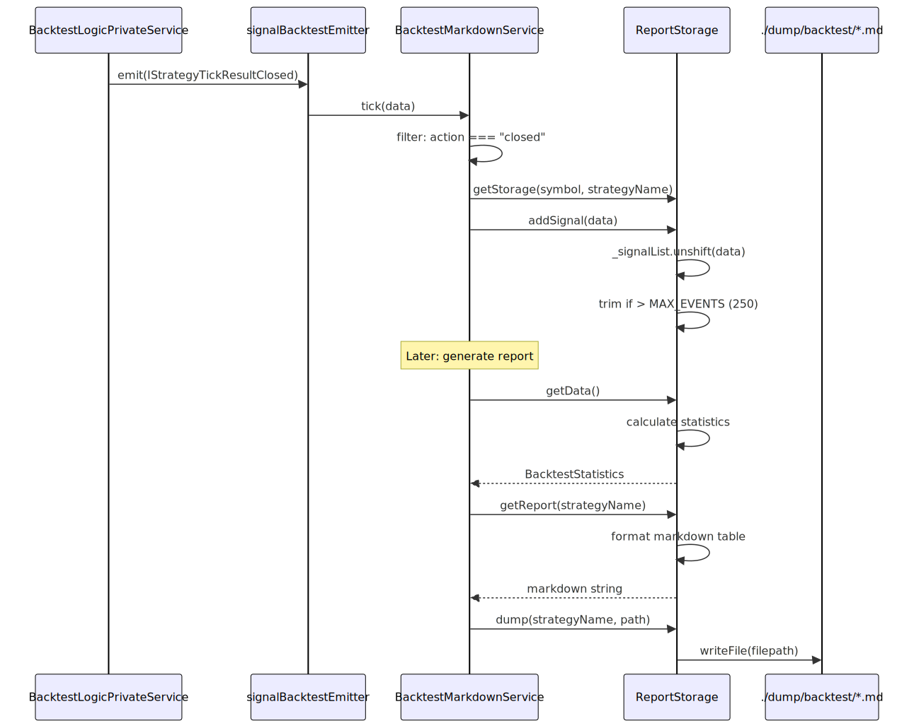
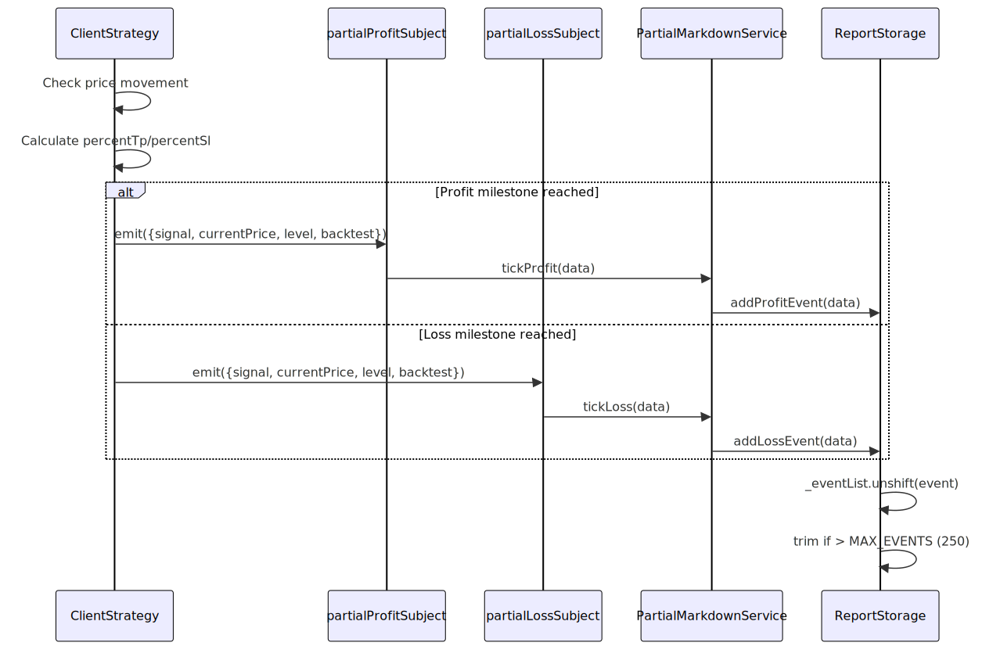
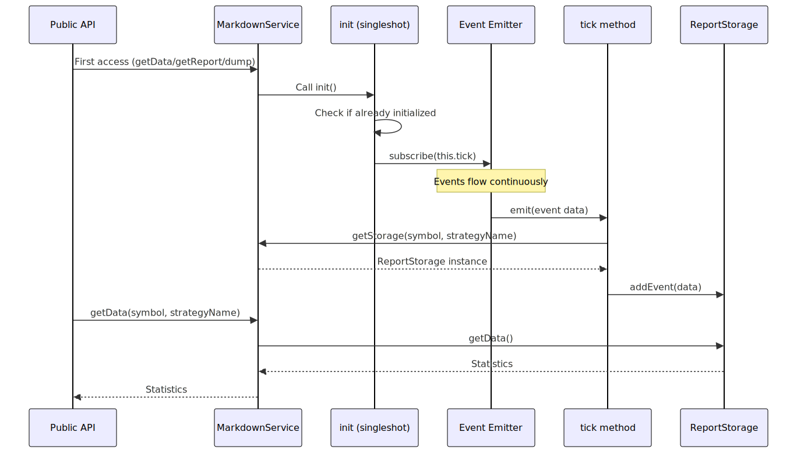

# Markdown Services

## Purpose and Scope

Markdown Services comprise the reporting and analytics layer of the backtest-kit framework. These services listen to various event emitters, accumulate signal and performance data, calculate trading statistics, and generate formatted markdown reports persisted to disk. Each service specializes in a specific aspect of trading analysis: backtest results, live trading events, scheduled signals, partial profit/loss milestones, strategy comparisons, portfolio heatmaps, and performance profiling.

For information about the event system that feeds these services, see [3.4](./14_Event_System.md). For details about the execution modes that generate events, see [2.1](./06_Execution_Modes.md).

## Architecture Overview

All Markdown Services follow a consistent architecture with three layers: **Event Subscription**, **Storage Accumulation**, and **Report Generation**. Each service subscribes to specific event emitters during initialization, maintains memoized storage instances per symbol-strategy pair, and provides methods to retrieve statistics or generate markdown reports.



**Sources:** [src/lib/services/markdown/BacktestMarkdownService.ts:1-571](), [src/lib/services/markdown/LiveMarkdownService.ts:1-778](), [src/lib/services/markdown/ScheduleMarkdownService.ts:1-625](), [src/lib/services/markdown/PartialMarkdownService.ts:1-481](), [src/lib/services/markdown/WalkerMarkdownService.ts:1-675](), [src/lib/services/markdown/HeatMarkdownService.ts:1-599](), [src/lib/services/markdown/PerformanceMarkdownService.ts:1-506]()

## Service Catalog

| Service | Event Source | Scope | Report Type | Statistics Interface |
|---------|-------------|-------|-------------|---------------------|
| `BacktestMarkdownService` | `signalBacktestEmitter` | Symbol-Strategy | Closed signals only | `BacktestStatistics` |
| `LiveMarkdownService` | `signalLiveEmitter` | Symbol-Strategy | All events (idle/opened/active/closed) | `LiveStatistics` |
| `ScheduleMarkdownService` | `signalEmitter` | Symbol-Strategy | Scheduled/opened/cancelled signals | `ScheduleStatistics` |
| `PartialMarkdownService` | `partialProfitSubject`, `partialLossSubject` | Symbol-Strategy | Profit/loss milestones | `PartialStatistics` |
| `WalkerMarkdownService` | `walkerEmitter` | Walker | Strategy comparison | `WalkerStatistics` |
| `HeatMarkdownService` | `signalEmitter` | Strategy | Portfolio heatmap | `IHeatmapStatistics` |
| `PerformanceMarkdownService` | `performanceEmitter` | Symbol-Strategy | Performance profiling | `PerformanceStatistics` |

**Sources:** [src/lib/services/markdown/BacktestMarkdownService.ts:369-395](), [src/lib/services/markdown/LiveMarkdownService.ts:566-595](), [src/lib/services/markdown/ScheduleMarkdownService.ts:424-444](), [src/lib/services/markdown/PartialMarkdownService.ts:307-327](), [src/lib/services/markdown/WalkerMarkdownService.ts:503-518](), [src/lib/services/markdown/HeatMarkdownService.ts:460-485](), [src/lib/services/markdown/PerformanceMarkdownService.ts:396-422]()

## Common Architecture Pattern

All Markdown Services implement a consistent internal structure with a memoized `ReportStorage` class that handles data accumulation and report generation. The service layer provides dependency injection integration and event subscription.



**Sources:** [src/lib/services/markdown/BacktestMarkdownService.ts:196-367](), [src/lib/services/markdown/LiveMarkdownService.ts:260-564]()

### Memoized Storage Pattern

Each service uses `memoize` from `functools-kit` to create and cache `ReportStorage` instances. The key is typically `${symbol}:${strategyName}` for symbol-strategy scoped services, or just `${walkerName}` for walker services.

```typescript
// Example from BacktestMarkdownService
private getStorage = memoize<(symbol: string, strategyName: string) => ReportStorage>(
  ([symbol, strategyName]) => `${symbol}:${strategyName}`,
  () => new ReportStorage()
);
```

This ensures that each unique symbol-strategy pair maintains isolated state, preventing cross-contamination of statistics.

**Sources:** [src/lib/services/markdown/BacktestMarkdownService.ts:404-407](), [src/lib/services/markdown/LiveMarkdownService.ts:604-607](), [src/lib/services/markdown/ScheduleMarkdownService.ts:453-456]()

### Singleshot Initialization

Services use `singleshot` from `functools-kit` to ensure event subscription occurs exactly once. This initialization happens lazily on first use.

```typescript
protected init = singleshot(async () => {
  this.loggerService.log("backtestMarkdownService init");
  signalBacktestEmitter.subscribe(this.tick);
});
```

**Sources:** [src/lib/services/markdown/BacktestMarkdownService.ts:564-567](), [src/lib/services/markdown/LiveMarkdownService.ts:771-774]()

## BacktestMarkdownService

Accumulates closed signals from backtest executions and generates comprehensive performance reports. Only processes signals with `action === "closed"`, ignoring opened/active/idle states.

### Key Features

- Subscribes to `signalBacktestEmitter`
- Stores up to `MAX_EVENTS` (250) closed signals per symbol-strategy pair
- Calculates 9 performance metrics: win rate, average PNL, total PNL, standard deviation, Sharpe ratio, annualized Sharpe ratio, certainty ratio, and expected yearly returns
- Generates markdown tables with 12 columns including signal ID, symbol, position, prices, PNL, close reason, duration, and timestamps

### Statistics Interface

```typescript
interface BacktestStatistics {
  signalList: IStrategyTickResultClosed[];
  totalSignals: number;
  winCount: number;
  lossCount: number;
  winRate: number | null;        // 0-100%, null if unsafe
  avgPnl: number | null;          // percentage
  totalPnl: number | null;        // cumulative percentage
  stdDev: number | null;          // volatility
  sharpeRatio: number | null;     // avgPnl / stdDev
  annualizedSharpeRatio: number | null;  // sharpeRatio × √365
  certaintyRatio: number | null;  // avgWin / |avgLoss|
  expectedYearlyReturns: number | null;  // avgPnl × tradesPerYear
}
```

**Sources:** [src/lib/services/markdown/BacktestMarkdownService.ts:70-106](), [docs/interfaces/BacktestStatistics.md:1-110]()

### Data Flow



**Sources:** [src/lib/services/markdown/BacktestMarkdownService.ts:428-439](), [src/lib/services/markdown/BacktestMarkdownService.ts:227-295]()

## LiveMarkdownService

Tracks all tick events from live trading including idle, opened, active, and closed states. Provides real-time monitoring of strategy execution with automatic idle event deduplication.

### Key Features

- Subscribes to `signalLiveEmitter`
- Stores up to `MAX_EVENTS` (250) events per symbol-strategy pair
- Replaces idle events intelligently: only replaces the last idle if no opened/active signals occurred after it
- Replaces active events with the same `signalId` to avoid duplicate active rows
- Calculates same 9 performance metrics as BacktestMarkdownService
- 14-column markdown table includes percentage to TP/SL for active signals

### Idle Event Replacement Logic

The service implements smart idle event deduplication to prevent idle event spam while preserving important state transitions:



**Sources:** [src/lib/services/markdown/LiveMarkdownService.ts:274-301]()

### Active Event Replacement

Active events for the same signal are replaced rather than accumulated, ensuring only the latest active state is stored:

```typescript
// Find the last active event with the same signalId
const lastActiveIndex = this._eventList.findLastIndex(
  (event) => event.action === "active" && event.signalId === data.signal.id
);

// Replace the last active event with the same signalId
if (lastActiveIndex !== -1) {
  this._eventList[lastActiveIndex] = newEvent;
  return;
}
```

**Sources:** [src/lib/services/markdown/LiveMarkdownService.ts:350-359]()

## ScheduleMarkdownService

Monitors scheduled signals (limit orders) through their lifecycle: scheduled → opened or cancelled. Tracks activation times and cancellation rates.

### Key Features

- Subscribes to `signalEmitter` (global, not live-specific)
- Filters for `scheduled`, `opened`, and `cancelled` actions
- For opened events, only tracks if `scheduledAt !== pendingAt` (was previously scheduled)
- Calculates activation rate, cancellation rate, average wait times

### Statistics Interface

```typescript
interface ScheduleStatistics {
  eventList: ScheduledEvent[];
  totalEvents: number;
  totalScheduled: number;
  totalOpened: number;
  totalCancelled: number;
  cancellationRate: number | null;     // (cancelled / scheduled) × 100
  activationRate: number | null;        // (opened / scheduled) × 100
  avgWaitTime: number | null;           // minutes for cancelled signals
  avgActivationTime: number | null;     // minutes for opened signals
}
```

**Sources:** [src/lib/services/markdown/ScheduleMarkdownService.ts:72-99]()

### Event Processing Logic



**Sources:** [src/lib/services/markdown/ScheduleMarkdownService.ts:472-490]()

## PartialMarkdownService

Tracks partial profit and loss milestones (10%, 20%, 30%, etc.) as signals progress toward TP or SL. Provides insight into price action before final close.

### Key Features

- Subscribes to `partialProfitSubject` and `partialLossSubject`
- Records timestamp, symbol, strategy, signal ID, position, current price, level, and mode (backtest/live)
- Separate counters for profit vs loss events
- 9-column table with action, symbol, strategy, signal ID, position, level, current price, timestamp, mode

### Statistics Interface

```typescript
interface PartialStatistics {
  eventList: PartialEvent[];
  totalEvents: number;
  totalProfit: number;    // count of profit milestone events
  totalLoss: number;      // count of loss milestone events
}
```

**Sources:** [src/lib/services/markdown/PartialMarkdownService.ts:39-65]()

### Event Flow



**Sources:** [src/lib/services/markdown/PartialMarkdownService.ts:341-380]()

## WalkerMarkdownService

Aggregates results from walker strategy comparisons. Ranks strategies by optimization metric and generates comparison tables with PNL details for all closed signals across all strategies.

### Key Features

- Subscribes to `walkerEmitter`
- One `ReportStorage` instance per walker name (not per symbol-strategy)
- Stores metadata: `totalStrategies`, `bestStats`, `bestMetric`, `bestStrategy`
- Accumulates all strategy results for comparison table
- Generates two tables: Top N strategies comparison + All signals PNL table

### Statistics Interface

```typescript
interface WalkerStatistics extends IWalkerResults {
  strategyResults: IStrategyResult[];  // Array of all strategy results
}

interface IStrategyResult {
  strategyName: StrategyName;
  stats: BacktestStatistics;
  metricValue: number | null;  // Value of optimization metric
}
```

**Sources:** [src/lib/services/markdown/WalkerMarkdownService.ts:17-69]()

### Comparison Table Generation

The service dynamically creates column configuration based on the optimization metric:



**Sources:** [src/lib/services/markdown/WalkerMarkdownService.ts:131-203](), [src/lib/services/markdown/WalkerMarkdownService.ts:342-372](), [src/lib/services/markdown/WalkerMarkdownService.ts:380-419]()

## HeatMarkdownService

Provides portfolio-level analytics by aggregating signals across all symbols for a strategy. Calculates per-symbol statistics and portfolio-wide metrics.

### Key Features

- Subscribes to `signalEmitter` (global)
- Memoizes storage by `strategyName` only (not symbol)
- Maintains `Map<string, IStrategyTickResultClosed[]>` for symbol-level storage
- Calculates 13 metrics per symbol: Total PNL, Sharpe Ratio, Max Drawdown, Profit Factor, Expectancy, Win Rate, Avg Win/Loss, Max Win/Loss Streak, Total Trades
- Sorts symbols by Sharpe Ratio (best performers first)
- Calculates portfolio-wide aggregates

### Statistics Interface

```typescript
interface IHeatmapStatistics {
  symbols: IHeatmapRow[];          // Per-symbol stats
  totalSymbols: number;
  portfolioTotalPnl: number | null;
  portfolioSharpeRatio: number | null;  // Weighted by trade count
  portfolioTotalTrades: number;
}

interface IHeatmapRow {
  symbol: string;
  totalPnl: number | null;
  sharpeRatio: number | null;
  maxDrawdown: number | null;
  profitFactor: number | null;     // sumWins / |sumLosses|
  expectancy: number | null;        // winRate × avgWin + lossRate × avgLoss
  winRate: number | null;
  avgWin: number | null;
  avgLoss: number | null;
  maxWinStreak: number;
  maxLossStreak: number;
  totalTrades: number;
  // ... additional fields
}
```

**Sources:** [src/lib/services/markdown/HeatMarkdownService.ts:13-16]()

### Portfolio Metrics Calculation



**Sources:** [src/lib/services/markdown/HeatMarkdownService.ts:180-336](), [src/lib/services/markdown/HeatMarkdownService.ts:343-395]()

## PerformanceMarkdownService

Profiles execution performance by tracking metric durations, percentiles, and wait times. Identifies bottlenecks in strategy execution.

### Key Features

- Subscribes to `performanceEmitter`
- Groups events by `metricType` (e.g., "getSignal", "getCandles", "checkSignal")
- Stores up to `MAX_EVENTS` (10,000) per symbol-strategy pair
- Calculates 13 statistics per metric type: count, total/avg/min/max duration, std dev, median, P95, P99, avg/min/max wait time
- Sorts metrics by total duration (descending) to show bottlenecks first
- Displays time distribution as percentages

### Statistics Interface

```typescript
interface PerformanceStatistics {
  strategyName: string;
  totalEvents: number;
  totalDuration: number;  // milliseconds
  metricStats: Record<string, MetricStats>;
  events: PerformanceContract[];
}

interface MetricStats {
  metricType: PerformanceMetricType;
  count: number;
  totalDuration: number;
  avgDuration: number;
  minDuration: number;
  maxDuration: number;
  stdDev: number;
  median: number;
  p95: number;    // 95th percentile
  p99: number;    // 99th percentile
  avgWaitTime: number;    // interval between consecutive events
  minWaitTime: number;
  maxWaitTime: number;
}
```

**Sources:** [src/lib/services/markdown/PerformanceMarkdownService.ts:14-75]()

### Percentile Calculation

The service calculates percentiles to identify outliers and tail latencies:

```typescript
function percentile(sortedArray: number[], p: number): number {
  if (sortedArray.length === 0) return 0;
  const index = Math.ceil((sortedArray.length * p) / 100) - 1;
  return sortedArray[Math.max(0, index)];
}

// Usage
median: percentile(durations, 50),
p95: percentile(durations, 95),
p99: percentile(durations, 99),
```

**Sources:** [src/lib/services/markdown/PerformanceMarkdownService.ts:96-100]()

## Column Configuration Pattern

All services use a `Column[]` array to define table structure. Each column specifies how to extract and format data from event objects.

### Column Interface

```typescript
interface Column {
  key: string;                                  // Unique identifier
  label: string;                                // Table header
  format: (data: EventType) => string;         // Data formatter
  isVisible: () => boolean;                     // Conditional rendering
}
```

### Example from BacktestMarkdownService

```typescript
const columns: Column[] = [
  {
    key: "signalId",
    label: "Signal ID",
    format: (data) => data.signal.id,
    isVisible: () => true,
  },
  {
    key: "note",
    label: "Note",
    format: (data) => toPlainString(data.signal.note ?? "N/A"),
    isVisible: () => GLOBAL_CONFIG.CC_REPORT_SHOW_SIGNAL_NOTE,
  },
  {
    key: "pnl",
    label: "PNL (net)",
    format: (data) => {
      const pnlPercentage = data.pnl.pnlPercentage;
      return `${pnlPercentage > 0 ? "+" : ""}${pnlPercentage.toFixed(2)}%`;
    },
    isVisible: () => true,
  },
  // ... more columns
];
```

**Sources:** [src/lib/services/markdown/BacktestMarkdownService.ts:108-194]()

### Table Generation Process


The generated markdown follows this format:

```markdown
| Signal ID | Symbol | Position | PNL (net) | Close Reason | Duration (min) |
| --- | --- | --- | --- | --- | --- |
| abc123 | BTCUSDT | LONG | +2.45% | take_profit | 45 |
| def456 | ETHUSDT | SHORT | -1.20% | stop_loss | 30 |
```

**Sources:** [src/lib/services/markdown/BacktestMarkdownService.ts:314-322]()

## Safe Math and Null Handling

All services implement `isUnsafe()` function to detect NaN, Infinity, or null values. Unsafe values are replaced with `null` in statistics interfaces, ensuring reports display "N/A" instead of corrupted numbers.

```typescript
function isUnsafe(value: number | null): boolean {
  if (typeof value !== "number") {
    return true;
  }
  if (isNaN(value)) {
    return true;
  }
  if (!isFinite(value)) {
    return true;
  }
  return false;
}

// Usage
if (isUnsafe(winRate)) winRate = null;
if (isUnsafe(sharpeRatio)) sharpeRatio = null;
```

This prevents division by zero, empty array reductions, and other edge cases from producing invalid statistics.

**Sources:** [src/lib/services/markdown/BacktestMarkdownService.ts:32-48](), [src/lib/services/markdown/LiveMarkdownService.ts:24-35](), [src/lib/services/markdown/HeatMarkdownService.ts:39-55]()

## Public API Methods

All services expose four public methods for programmatic access:

| Method | Parameters | Returns | Purpose |
|--------|-----------|---------|---------|
| `getData()` | `symbol`, `strategyName` | `Promise<Statistics>` | Retrieve calculated statistics |
| `getReport()` | `symbol`, `strategyName` | `Promise<string>` | Generate markdown report |
| `dump()` | `symbol`, `strategyName`, `path?` | `Promise<void>` | Save report to disk |
| `clear()` | `ctx?` | `Promise<void>` | Clear accumulated data |

### Example Usage

```typescript
// Get statistics programmatically
const stats = await Backtest.getData("BTCUSDT", "my-strategy");
console.log(`Win Rate: ${stats.winRate}%`);
console.log(`Sharpe Ratio: ${stats.sharpeRatio}`);

// Generate markdown string
const markdown = await Backtest.getReport("BTCUSDT", "my-strategy");
console.log(markdown);

// Save to disk
await Backtest.dump("BTCUSDT", "my-strategy", "./custom/path");

// Clear data
await Backtest.clear({ symbol: "BTCUSDT", strategyName: "my-strategy" });
```

**Sources:** [src/lib/services/markdown/BacktestMarkdownService.ts:456-463](), [src/lib/services/markdown/BacktestMarkdownService.ts:480-487](), [src/lib/services/markdown/BacktestMarkdownService.ts:509-521](), [src/lib/services/markdown/BacktestMarkdownService.ts:541-551]()

## File Output Structure

Reports are written to `./dump/` directory with subdirectories per service type:

```
./dump/
├── backtest/
│   ├── strategy-a.md
│   └── strategy-b.md
├── live/
│   ├── strategy-a.md
│   └── strategy-b.md
├── schedule/
│   ├── strategy-a.md
│   └── strategy-b.md
├── partial/
│   ├── BTCUSDT_strategy-a.md
│   └── ETHUSDT_strategy-a.md
├── walker/
│   ├── walker-comparison-1.md
│   └── walker-comparison-2.md
├── heatmap/
│   ├── strategy-a.md
│   └── strategy-b.md
└── performance/
    ├── BTCUSDT_strategy-a.md
    └── ETHUSDT_strategy-a.md
```

Naming conventions:
- Backtest/Live/Schedule/Heatmap: `{strategyName}.md`
- Partial/Performance: `{symbol}_{strategyName}.md`
- Walker: `{walkerName}.md`

**Sources:** [src/lib/services/markdown/BacktestMarkdownService.ts:348-366](), [src/lib/services/markdown/LiveMarkdownService.ts:545-563](), [src/lib/services/markdown/PartialMarkdownService.ts:289-304]()

## Integration with Event System

Markdown Services are automatically initialized and subscribed to their respective emitters. The initialization occurs lazily via `singleshot` wrapper, ensuring subscriptions happen only once regardless of how many times the service is accessed.



**Sources:** [src/lib/services/markdown/BacktestMarkdownService.ts:564-567](), [src/lib/services/markdown/LiveMarkdownService.ts:771-774](), [src/lib/services/markdown/ScheduleMarkdownService.ts:618-621]()