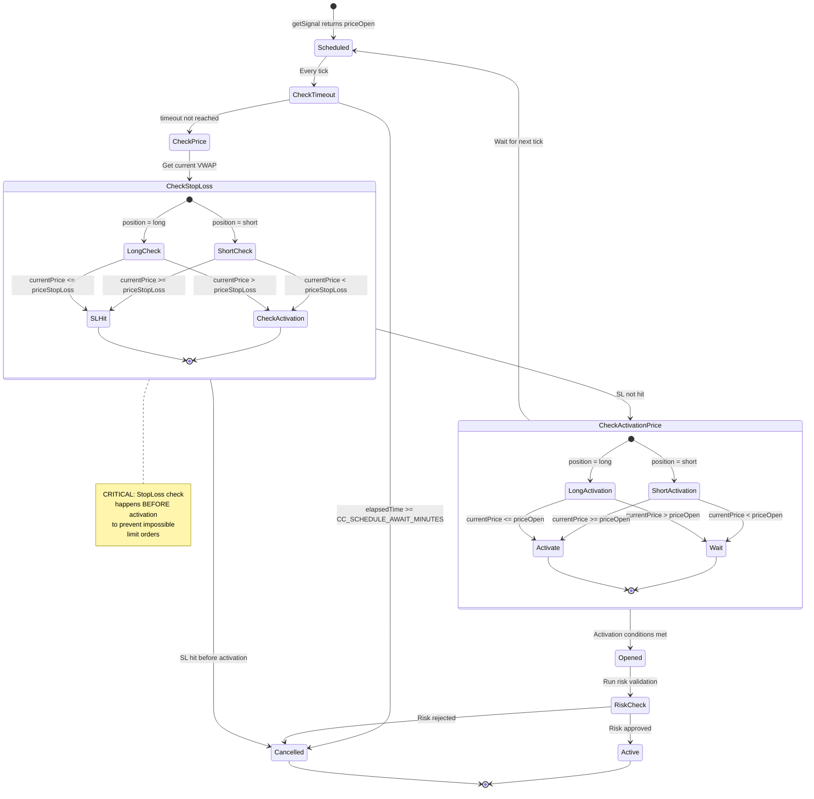
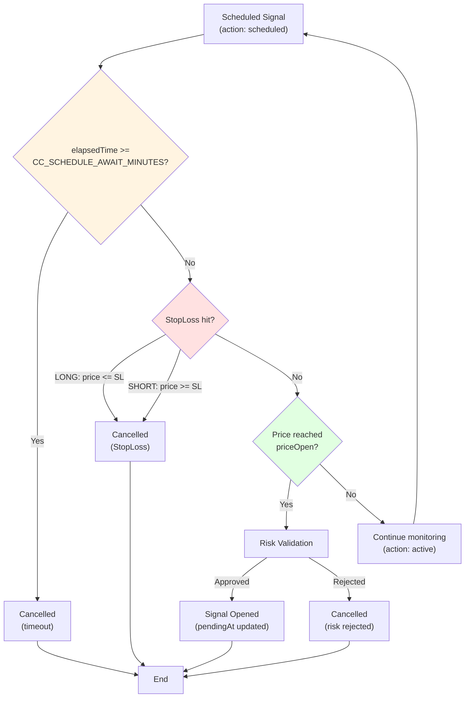
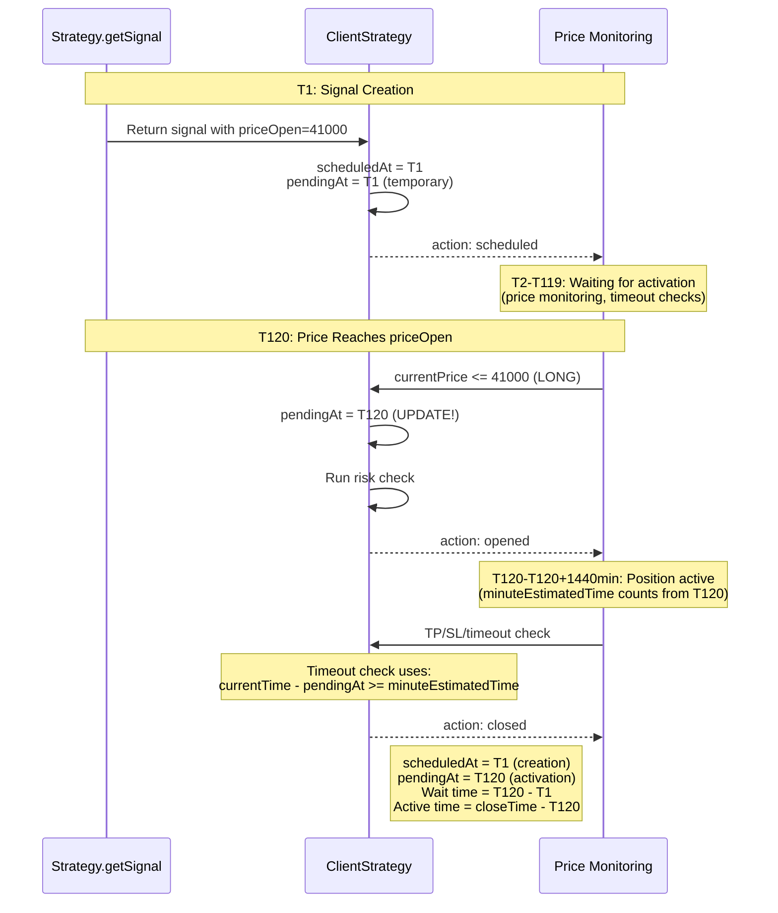
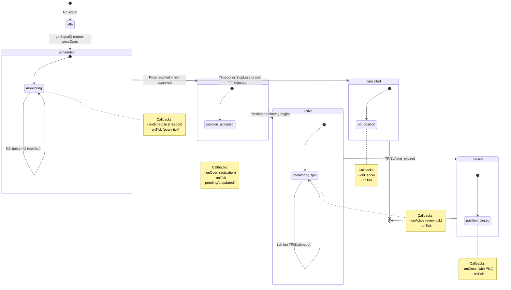

# Scheduled Signals

<details>
<summary>Relevant source files</summary>

The following files were used as context for generating this wiki page:

- [src/classes/Persist.ts](src/classes/Persist.ts)
- [src/client/ClientStrategy.ts](src/client/ClientStrategy.ts)
- [src/config/params.ts](src/config/params.ts)
- [src/interfaces/Strategy.interface.ts](src/interfaces/Strategy.interface.ts)
- [src/lib/services/connection/StrategyConnectionService.ts](src/lib/services/connection/StrategyConnectionService.ts)
- [src/lib/services/logic/private/BacktestLogicPrivateService.ts](src/lib/services/logic/private/BacktestLogicPrivateService.ts)
- [src/lib/services/logic/private/LiveLogicPrivateService.ts](src/lib/services/logic/private/LiveLogicPrivateService.ts)
- [src/lib/services/logic/public/BacktestLogicPublicService.ts](src/lib/services/logic/public/BacktestLogicPublicService.ts)
- [src/lib/services/logic/public/LiveLogicPublicService.ts](src/lib/services/logic/public/LiveLogicPublicService.ts)
- [src/utils/writeFileAtomic.ts](src/utils/writeFileAtomic.ts)
- [test/config/setup.mjs](test/config/setup.mjs)
- [test/e2e/defend.test.mjs](test/e2e/defend.test.mjs)
- [test/e2e/sanitize.test.mjs](test/e2e/sanitize.test.mjs)
- [test/e2e/timing.test.mjs](test/e2e/timing.test.mjs)

</details>


## Purpose and Scope

This document explains **scheduled signals** in backtest-kit: signals that wait for a specific entry price (`priceOpen`) to be reached before activating. Scheduled signals implement limit order behavior, allowing strategies to enter positions at predetermined prices rather than immediately at market price.

For general signal lifecycle information, see [Signal Lifecycle Overview](#8.2). For signal persistence mechanics, see [Signal Persistence](#8.4). For PNL calculation after closure, see [PnL Calculation](#8.5).

---

## Scheduled vs Immediate Signals

Signals in backtest-kit can be created in two modes based on the presence of `priceOpen` in the signal DTO returned by `getSignal()`:

| Aspect | Immediate Signal | Scheduled Signal |
|--------|-----------------|------------------|
| **priceOpen specified?** | No (undefined) | Yes (explicit price) |
| **Entry timing** | Immediate at current VWAP | Delayed until price reaches `priceOpen` |
| **Risk check timing** | At signal creation | At activation (when price reached) |
| **Initial state** | `opened` | `scheduled` |
| **scheduledAt** | Current timestamp | Current timestamp |
| **pendingAt** | Current timestamp | Activation timestamp (updated later) |
| **Timeout logic** | Uses `minuteEstimatedTime` from `pendingAt` | Uses `CC_SCHEDULE_AWAIT_MINUTES` from `scheduledAt`, then `minuteEstimatedTime` from `pendingAt` after activation |

**Sources:** [src/interfaces/Strategy.interface.ts:63-72](), [src/client/ClientStrategy.ts:232-254](), [src/client/ClientStrategy.ts:256-272]()

---

## Creating a Scheduled Signal

A scheduled signal is created when `getSignal()` returns a signal DTO with `priceOpen` explicitly specified:

```typescript
// In your strategy's getSignal function
return {
  position: "long",
  priceOpen: 41000,        // Explicit entry price = scheduled signal
  priceTakeProfit: 42000,
  priceStopLoss: 40000,
  minuteEstimatedTime: 60,
  note: "Wait for price to drop to 41000"
};
```

The framework augments this DTO into an `IScheduledSignalRow` with metadata:

```typescript
const scheduledSignalRow: IScheduledSignalRow = {
  id: randomString(),           // Auto-generated UUID
  priceOpen: signal.priceOpen,  // From user DTO
  // ... other fields from DTO
  symbol: context.symbol,
  exchangeName: context.exchangeName,
  strategyName: context.strategyName,
  scheduledAt: currentTime,     // Timestamp when scheduled
  pendingAt: currentTime,       // Initially equals scheduledAt, updated on activation
  _isScheduled: true,           // Internal marker
};
```

**Sources:** [src/client/ClientStrategy.ts:232-254]()

---

## Activation Logic: Price-Based Entry

### Title: Scheduled Signal Activation Flow



### Position-Specific Activation Rules

The activation logic differs based on position type to implement proper limit order semantics:

**LONG Position (buy lower):**
- Waits for price to **fall** to or below `priceOpen`
- Activates when: `currentPrice <= priceOpen`
- Cancels if: `currentPrice <= priceStopLoss` (before activation)
- Example: priceOpen=41000, waits for price to drop from 43000 to 41000

**SHORT Position (sell higher):**
- Waits for price to **rise** to or above `priceOpen`
- Activates when: `currentPrice >= priceOpen`
- Cancels if: `currentPrice >= priceStopLoss` (before activation)
- Example: priceOpen=43000, waits for price to rise from 41000 to 43000

**Sources:** [src/client/ClientStrategy.ts:388-422](), [src/client/ClientStrategy.ts:1081-1105]()

---

## Cancellation Logic

### Title: Scheduled Signal Cancellation Conditions



### Timeout Cancellation

Scheduled signals automatically cancel if they do not activate within `CC_SCHEDULE_AWAIT_MINUTES` (default: 120 minutes):

```typescript
const maxTimeToWait = GLOBAL_CONFIG.CC_SCHEDULE_AWAIT_MINUTES * 60 * 1000;
const elapsedTime = currentTime - scheduled.scheduledAt;  // From scheduledAt, not pendingAt!

if (elapsedTime >= maxTimeToWait) {
  // Cancel signal - timeout
  return {
    action: "cancelled",
    signal: scheduled,
    closeTimestamp: currentTime
  };
}
```

**Key timing rule:** Timeout is calculated from `scheduledAt` (when signal was created), NOT from `pendingAt`.

**Sources:** [src/client/ClientStrategy.ts:332-386](), [src/config/params.ts:6]()

### StopLoss Cancellation

**CRITICAL:** StopLoss cancellation is checked **before** activation to prevent physically impossible limit orders:

```typescript
// LONG position: Cancel if price drops too far (below SL)
if (scheduled.position === "long") {
  if (currentPrice <= scheduled.priceStopLoss) {
    shouldCancel = true;  // Cancel - price went too low
  } else if (currentPrice <= scheduled.priceOpen) {
    shouldActivate = true;  // Activate - price reached entry
  }
}

// SHORT position: Cancel if price rises too far (above SL)
if (scheduled.position === "short") {
  if (currentPrice >= scheduled.priceStopLoss) {
    shouldCancel = true;  // Cancel - price went too high
  } else if (currentPrice >= scheduled.priceOpen) {
    shouldActivate = true;  // Activate - price reached entry
  }
}
```

**Why this order matters:** For a LONG limit order at priceOpen=41000 with SL=40000:
- If price falls to 40500, it passes through 41000 (activation) before hitting 40000 (SL)
- The check order ensures activation happens first (physically correct)
- If price falls directly to 39000, it never reaches 41000, so cancellation occurs

**Sources:** [src/client/ClientStrategy.ts:396-420](), [src/client/ClientStrategy.ts:1082-1105](), [test/e2e/defend.test.mjs:24-145]()

---

## Critical Timing: scheduledAt vs pendingAt

### The Timing Problem

Scheduled signals have **two** critical timestamps that determine their lifecycle:

| Timestamp | Meaning | Set When | Used For |
|-----------|---------|----------|----------|
| `scheduledAt` | When signal was **created** | Signal creation time | Timeout calculation (`CC_SCHEDULE_AWAIT_MINUTES`) |
| `pendingAt` | When signal **activated** (position opened) | Activation time (updated from `scheduledAt`) | Duration calculation (`minuteEstimatedTime`) |

**The critical rule:** `minuteEstimatedTime` counts from `pendingAt`, NOT from `scheduledAt`.

### Title: Scheduled Signal Timeline



### Code Implementation

When scheduled signal activates, `pendingAt` is **updated** from the original `scheduledAt`:

```typescript
// CRITICAL: Update pendingAt on activation
const activatedSignal: ISignalRow = {
  ...scheduled,
  pendingAt: activationTime,  // Updated from scheduledAt!
  _isScheduled: false,
};
```

When checking if position should close by timeout, the calculation uses `pendingAt`:

```typescript
const signalTime = signal.pendingAt;  // CRITICAL: use pendingAt, not scheduledAt!
const maxTimeToWait = signal.minuteEstimatedTime * 60 * 1000;
const elapsedTime = currentTime - signalTime;

if (elapsedTime >= maxTimeToWait) {
  // Close by time_expired
}
```

**What happens if you use `scheduledAt` instead?** Signal closes prematurely because it includes the waiting time before activation. This was a critical bug fixed in the codebase.

**Sources:** [src/client/ClientStrategy.ts:510-515](), [src/client/ClientStrategy.ts:680-683](), [test/e2e/timing.test.mjs:34-153]()

---

## Live vs Backtest Behavior

### Live Mode: Continuous Monitoring

In live mode, scheduled signals are monitored at each tick (every ~1 minute):

```typescript
// Live mode: Check scheduled signal every tick
const result = await strategy.tick();

if (result.action === "scheduled") {
  // Check timeout (from scheduledAt)
  const timeoutResult = await CHECK_SCHEDULED_SIGNAL_TIMEOUT_FN(...);
  if (timeoutResult) return timeoutResult;
  
  // Check price activation and StopLoss
  const currentPrice = await exchange.getAveragePrice(symbol);
  const { shouldActivate, shouldCancel } = CHECK_SCHEDULED_SIGNAL_PRICE_ACTIVATION_FN(
    scheduled, 
    currentPrice
  );
  
  if (shouldCancel) {
    return CANCEL_SCHEDULED_SIGNAL_BY_STOPLOSS_FN(...);
  }
  
  if (shouldActivate) {
    return ACTIVATE_SCHEDULED_SIGNAL_FN(...);
  }
  
  // Still waiting - return active
  return { action: "active", signal: scheduled };
}
```

**Sources:** [src/client/ClientStrategy.ts:332-576](), [src/lib/services/logic/private/LiveLogicPrivateService.ts:67-111]()

### Backtest Mode: Candle Array Processing

In backtest mode, scheduled signals are processed through historical candles for fast-forward simulation:

```typescript
// Backtest mode: Process candles array
if (result.action === "scheduled") {
  // Request candles for monitoring period + signal lifetime
  const candlesNeeded = CC_SCHEDULE_AWAIT_MINUTES + signal.minuteEstimatedTime + 1;
  const candles = await exchange.getNextCandles(symbol, "1m", candlesNeeded, when, true);
  
  // Process each candle until activation/cancellation
  const { activated, cancelled, activationIndex, result } = 
    await PROCESS_SCHEDULED_SIGNAL_CANDLES_FN(scheduled, candles);
  
  if (cancelled) {
    yield result;  // Cancelled by timeout or StopLoss
  }
  
  if (activated) {
    // Continue with remaining candles for TP/SL monitoring
    const remainingCandles = candles.slice(activationIndex);
    const closedResult = await PROCESS_PENDING_SIGNAL_CANDLES_FN(signal, remainingCandles);
    yield closedResult;
  }
}
```

**Key difference:** Backtest uses `candle.high` and `candle.low` for precise TP/SL detection within a candle, while live uses VWAP calculated from recent candles.

**Sources:** [src/lib/services/logic/private/BacktestLogicPrivateService.ts:93-183](), [src/client/ClientStrategy.ts:1048-1134]()

---

## State Transitions and Callbacks

### Title: Scheduled Signal State Machine with Callbacks



### Callback Invocation Order

For a scheduled signal that successfully activates:

1. **onSchedule**: When signal created with priceOpen
2. **onTick**: With `action: "scheduled"`
3. (Multiple ticks with `action: "active"` while waiting)
4. **onOpen**: When price reaches priceOpen and risk approved (pendingAt updated here)
5. **onTick**: With `action: "opened"`
6. (Multiple ticks with `action: "active"` while monitoring TP/SL)
7. **onClose**: When TP/SL/timeout hit
8. **onTick**: With `action: "closed"`

For a scheduled signal that times out:

1. **onSchedule**: When signal created
2. **onTick**: With `action: "scheduled"`
3. (Multiple ticks with `action: "active"` while waiting)
4. **onCancel**: When timeout or StopLoss hit
5. **onTick**: With `action: "cancelled"`

**Sources:** [src/interfaces/Strategy.interface.ts:93-115](), [src/client/ClientStrategy.ts:594-601](), [src/client/ClientStrategy.ts:524-531](), [src/client/ClientStrategy.ts:358-365]()

---

## Configuration Parameters

### CC_SCHEDULE_AWAIT_MINUTES

```typescript
CC_SCHEDULE_AWAIT_MINUTES: 120  // Default: 2 hours
```

Maximum time (in minutes) to wait for scheduled signal activation. Calculated from `scheduledAt` timestamp.

**Use case:** Prevents "eternal" scheduled signals that never activate, freeing up risk limits.

**Boundary behavior:** Signal cancels when `elapsedTime >= CC_SCHEDULE_AWAIT_MINUTES` (inclusive).

**Sources:** [src/config/params.ts:6](), [src/client/ClientStrategy.ts:339](), [test/e2e/defend.test.mjs:445-536]()

---

## Implementation Details: Key Functions

### Function Mapping Table

| Function | Purpose | Mode | File Location |
|----------|---------|------|---------------|
| `GET_SIGNAL_FN` | Creates `IScheduledSignalRow` when priceOpen specified | Both | [ClientStrategy.ts:187-283]() |
| `CHECK_SCHEDULED_SIGNAL_TIMEOUT_FN` | Checks if scheduled signal timed out | Live | [ClientStrategy.ts:332-386]() |
| `CHECK_SCHEDULED_SIGNAL_PRICE_ACTIVATION_FN` | Determines if price conditions met for activation | Live | [ClientStrategy.ts:388-422]() |
| `CANCEL_SCHEDULED_SIGNAL_BY_STOPLOSS_FN` | Cancels scheduled signal when SL hit pre-activation | Live | [ClientStrategy.ts:424-457]() |
| `ACTIVATE_SCHEDULED_SIGNAL_FN` | Activates scheduled signal, updates `pendingAt` | Live | [ClientStrategy.ts:459-551]() |
| `RETURN_SCHEDULED_SIGNAL_ACTIVE_FN` | Returns active state for scheduled signal still waiting | Live | [ClientStrategy.ts:553-576]() |
| `OPEN_NEW_SCHEDULED_SIGNAL_FN` | Returns scheduled result when signal first created | Live | [ClientStrategy.ts:578-621]() |
| `ACTIVATE_SCHEDULED_SIGNAL_IN_BACKTEST_FN` | Activates scheduled signal in backtest mode | Backtest | [ClientStrategy.ts:897-973]() |
| `CANCEL_SCHEDULED_SIGNAL_IN_BACKTEST_FN` | Cancels scheduled signal in backtest mode | Backtest | [ClientStrategy.ts:848-895]() |
| `PROCESS_SCHEDULED_SIGNAL_CANDLES_FN` | Processes candle array for scheduled signal | Backtest | [ClientStrategy.ts:1048-1134]() |

**Sources:** [src/client/ClientStrategy.ts:187-1134]()

---

## Common Pitfalls

### 1. Using scheduledAt for Duration Calculation

**Wrong:**
```typescript
const elapsedTime = currentTime - signal.scheduledAt;  // Includes wait time!
if (elapsedTime >= signal.minuteEstimatedTime * 60 * 1000) {
  closeSignal();  // Closes prematurely!
}
```

**Correct:**
```typescript
const elapsedTime = currentTime - signal.pendingAt;  // Only active time
if (elapsedTime >= signal.minuteEstimatedTime * 60 * 1000) {
  closeSignal();  // Closes at correct time
}
```

**Sources:** [src/client/ClientStrategy.ts:680-683](), [test/e2e/timing.test.mjs:34-153]()

### 2. Checking Activation Before StopLoss

**Wrong:**
```typescript
// Activation checked first - can activate when SL already hit
if (currentPrice <= priceOpen) activate();
if (currentPrice <= priceStopLoss) cancel();  // Too late!
```

**Correct:**
```typescript
// StopLoss checked first - prevents impossible activation
if (currentPrice <= priceStopLoss) {
  cancel();  // Priority: cancel before activating
} else if (currentPrice <= priceOpen) {
  activate();
}
```

**Sources:** [src/client/ClientStrategy.ts:396-420](), [test/e2e/defend.test.mjs:24-145]()

### 3. Forgetting to Update pendingAt on Activation

**Wrong:**
```typescript
const activatedSignal = {
  ...scheduled,
  _isScheduled: false,
  // pendingAt still equals scheduledAt - BUG!
};
```

**Correct:**
```typescript
const activatedSignal = {
  ...scheduled,
  pendingAt: activationTime,  // Must update!
  _isScheduled: false,
};
```

**Sources:** [src/client/ClientStrategy.ts:510-515](), [src/client/ClientStrategy.ts:949-954]()

---

**Sources:** [src/client/ClientStrategy.ts:1-1346](), [src/interfaces/Strategy.interface.ts:63-72](), [src/config/params.ts:1-36](), [src/lib/services/logic/private/BacktestLogicPrivateService.ts:93-183](), [src/lib/services/logic/private/LiveLogicPrivateService.ts:60-113](), [test/e2e/defend.test.mjs:1-1632](), [test/e2e/timing.test.mjs:1-630]()