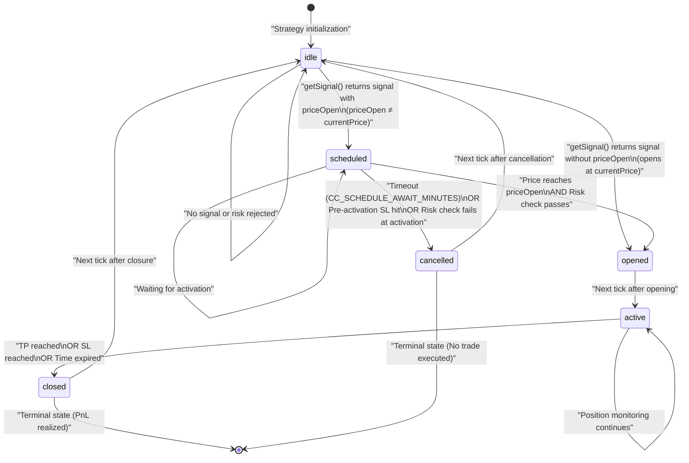
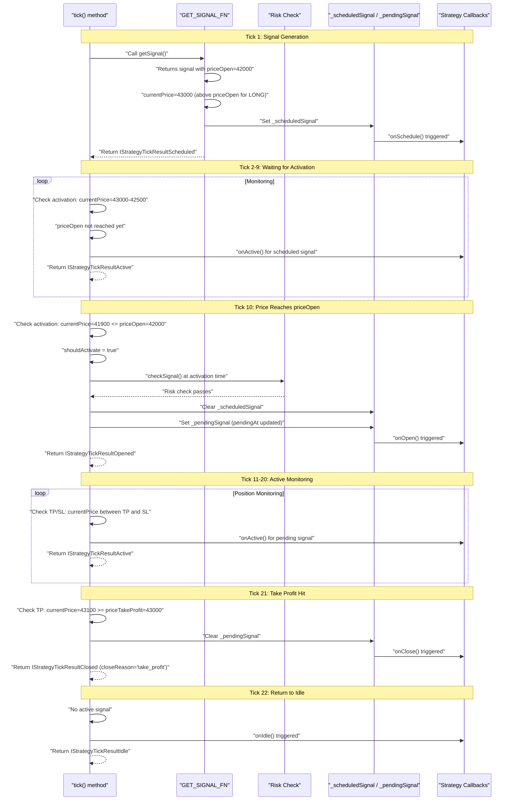
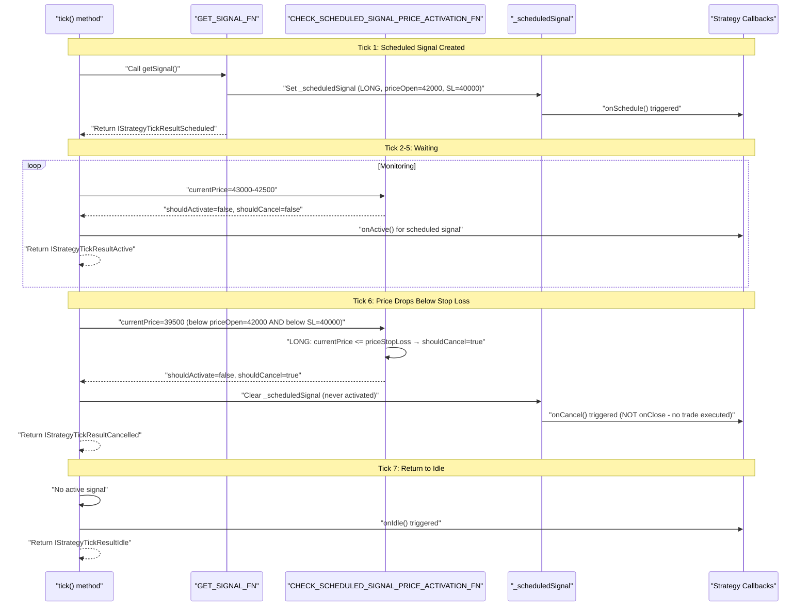

# Signal States

<details>
<summary>Relevant source files</summary>

The following files were used as context for generating this wiki page:

- [src/client/ClientStrategy.ts](src/client/ClientStrategy.ts)
- [src/interfaces/Strategy.interface.ts](src/interfaces/Strategy.interface.ts)
- [test/e2e/defend.test.mjs](test/e2e/defend.test.mjs)
- [test/e2e/partial.test.mjs](test/e2e/partial.test.mjs)
- [test/index.mjs](test/index.mjs)
- [types.d.ts](types.d.ts)

</details>


This page defines the six distinct states a trading signal can occupy during its lifecycle: **idle**, **scheduled**, **opened**, **active**, **closed**, and **cancelled**. Each state represents a specific phase of signal execution with well-defined entry conditions, exit conditions, and behaviors. Understanding these states is critical for implementing strategies, monitoring execution, and debugging signal lifecycle issues.

For information about signal generation and validation rules, see [Signal Generation and Validation](#8.2). For details on scheduled signal behavior and activation, see [Scheduled Signals](#8.3). For crash recovery and state persistence, see [Signal Persistence](#8.4).

---

## State Overview

The framework models signal lifecycle as a deterministic state machine with six states:

| State | Description | Internal Flag | Terminal State |
|-------|-------------|---------------|----------------|
| **idle** | No active signal; strategy waiting for entry conditions | `_pendingSignal === null && _scheduledSignal === null` | No |
| **scheduled** | Limit order waiting for `priceOpen` activation | `_scheduledSignal !== null` | No |
| **opened** | Signal just created and position opened | `_pendingSignal !== null` (first tick after creation) | No |
| **active** | Position being monitored for TP/SL/timeout | `_pendingSignal !== null` (subsequent ticks) | No |
| **closed** | Position closed with realized PnL | `_pendingSignal === null` (after TP/SL/timeout) | Yes |
| **cancelled** | Scheduled signal cancelled without opening | `_scheduledSignal === null` (after timeout/SL) | Yes |

**Sources:**
- [src/interfaces/Strategy.interface.ts:173-289]()
- [src/client/ClientStrategy.ts:1-100]()
- [types.d.ts:853-965]()

---

## State Definitions

### 1. Idle State

**Discriminator:** `action: "idle"`

The idle state indicates no active trading position exists. The strategy is evaluating market conditions via `getSignal()` but has not yet generated a valid signal that passes risk validation. This is the default state at strategy initialization and after signal closure.

**Characteristics:**
- `signal` field is `null`
- `getSignal()` called on every tick (subject to interval throttling)
- Risk checks performed via `checkSignal()` before signal creation
- Callback: `onIdle(symbol, currentPrice, backtest)` triggered

**State Tracking:**
```typescript
// Internal ClientStrategy state
_pendingSignal: ISignalRow | null = null;
_scheduledSignal: IScheduledSignalRow | null = null;
// idle when both are null
```

**Type Definition:**
```typescript
interface IStrategyTickResultIdle {
  action: "idle";
  signal: null;
  strategyName: StrategyName;
  exchangeName: ExchangeName;
  symbol: string;
  currentPrice: number;
}
```

**Sources:**
- [src/interfaces/Strategy.interface.ts:173-186]()
- [src/client/ClientStrategy.ts:263-310]()
- [types.d.ts:853-867]()

---

### 2. Scheduled State

**Discriminator:** `action: "scheduled"`

A scheduled signal represents a limit order waiting for price to reach the specified `priceOpen` entry point. This state exists when `getSignal()` returns a signal with an explicit `priceOpen` value that differs from the current market price.

**Characteristics:**
- `priceOpen` explicitly specified in signal DTO
- Position has NOT yet opened (no risk capital committed)
- Waiting for market price to reach `priceOpen` for activation
- Subject to timeout cancellation (default: 120 minutes via `CC_SCHEDULE_AWAIT_MINUTES`)
- Subject to pre-activation SL cancellation if price moves adversely
- Callback: `onSchedule(symbol, data, currentPrice, backtest)` triggered

**Activation Conditions:**
```typescript
// LONG: activate when currentPrice <= priceOpen
// SHORT: activate when currentPrice >= priceOpen
const shouldActivate = 
  (signal.position === "long" && currentPrice <= signal.priceOpen) ||
  (signal.position === "short" && currentPrice >= signal.priceOpen);
```

**Cancellation Conditions:**
- **Timeout:** `(currentTime - scheduledAt) >= CC_SCHEDULE_AWAIT_MINUTES * 60000`
- **Pre-activation SL:** Price crosses StopLoss before reaching `priceOpen`
- **Risk rejection:** Risk check fails at activation time

**Type Definition:**
```typescript
interface IStrategyTickResultScheduled {
  action: "scheduled";
  signal: IScheduledSignalRow;
  strategyName: StrategyName;
  exchangeName: ExchangeName;
  symbol: string;
  currentPrice: number;
}
```

**Sources:**
- [src/interfaces/Strategy.interface.ts:192-205]()
- [src/client/ClientStrategy.ts:312-367]()
- [src/client/ClientStrategy.ts:530-564]()
- [types.d.ts:871-885]()

---

### 3. Opened State

**Discriminator:** `action: "opened"`

The opened state represents the first tick immediately after signal creation and position opening. This is a transient state that transitions to **active** on the next tick. It signals that capital has been committed and the position is now being monitored.

**Characteristics:**
- Position just created (market order or scheduled activation)
- `pendingAt` timestamp set to current time
- Risk capital now allocated (tracked via `addSignal()`)
- Callback: `onOpen(symbol, data, currentPrice, backtest)` triggered
- Next tick will transition to **active** state

**Creation Paths:**
1. **Immediate Market Order:** `getSignal()` returns signal without `priceOpen` → opens at current VWAP
2. **Scheduled Activation:** Scheduled signal reaches `priceOpen` and passes risk re-check

**Type Definition:**
```typescript
interface IStrategyTickResultOpened {
  action: "opened";
  signal: ISignalRow;
  strategyName: StrategyName;
  exchangeName: ExchangeName;
  symbol: string;
  currentPrice: number;
}
```

**Sources:**
- [src/interfaces/Strategy.interface.ts:211-224]()
- [src/client/ClientStrategy.ts:765-815]()
- [src/client/ClientStrategy.ts:601-693]()
- [types.d.ts:887-903]()

---

### 4. Active State

**Discriminator:** `action: "active"`

The active state represents ongoing position monitoring. The strategy continuously checks market price against Take Profit, Stop Loss, and time expiration conditions. This state persists until one of the exit conditions is met.

**Characteristics:**
- Position opened and being monitored
- VWAP calculated on every tick via `getAveragePrice()`
- TP/SL/timeout conditions checked continuously
- Partial profit/loss tracking active (10%, 20%, 30% milestones)
- Callback: `onActive(symbol, data, currentPrice, backtest)` triggered
- Callbacks: `onPartialProfit()` / `onPartialLoss()` triggered at milestones

**Exit Condition Checks:**
```typescript
// Time expiration
if ((currentTime - signal.pendingAt) >= signal.minuteEstimatedTime * 60000) {
  // Close with reason: "time_expired"
}

// Take Profit
if (signal.position === "long" && currentPrice >= signal.priceTakeProfit) {
  // Close with reason: "take_profit"
}
if (signal.position === "short" && currentPrice <= signal.priceTakeProfit) {
  // Close with reason: "take_profit"
}

// Stop Loss
if (signal.position === "long" && currentPrice <= signal.priceStopLoss) {
  // Close with reason: "stop_loss"
}
if (signal.position === "short" && currentPrice >= signal.priceStopLoss) {
  // Close with reason: "stop_loss"
}
```

**Type Definition:**
```typescript
interface IStrategyTickResultActive {
  action: "active";
  signal: ISignalRow;
  currentPrice: number;
  strategyName: StrategyName;
  exchangeName: ExchangeName;
  symbol: string;
}
```

**Sources:**
- [src/interfaces/Strategy.interface.ts:230-243]()
- [src/client/ClientStrategy.ts:817-876]()
- [src/client/ClientStrategy.ts:917-959]()
- [types.d.ts:905-922]()

---

### 5. Closed State

**Discriminator:** `action: "closed"`

The closed state is a terminal state indicating the position has been closed with realized profit or loss. This state includes the final close price, close reason, and calculated PnL with fees and slippage.

**Characteristics:**
- Position closed and capital released
- `closeReason` specifies why closure occurred
- `pnl` object contains realized profit/loss percentage
- Risk capital deallocated (tracked via `removeSignal()`)
- Callback: `onClose(symbol, data, priceClose, backtest)` triggered
- Partial profit/loss state cleared via `partial.clear()`
- Returns to **idle** state on next tick

**Close Reasons:**
- `"take_profit"` - Price reached `priceTakeProfit` target
- `"stop_loss"` - Price hit `priceStopLoss` exit
- `"time_expired"` - Signal exceeded `minuteEstimatedTime` duration

**PnL Calculation:**
The `pnl` object includes:
- `pnlPercentage` - Profit/loss as percentage (e.g., +1.5% or -2.3%)
- `priceOpen` - Entry price adjusted with fees (0.1%) and slippage (0.1%)
- `priceClose` - Exit price adjusted with fees (0.1%) and slippage (0.1%)

**Type Definition:**
```typescript
interface IStrategyTickResultClosed {
  action: "closed";
  signal: ISignalRow;
  currentPrice: number;
  closeReason: "time_expired" | "take_profit" | "stop_loss";
  closeTimestamp: number;
  pnl: IStrategyPnL;
  strategyName: StrategyName;
  exchangeName: ExchangeName;
  symbol: string;
}
```

**Sources:**
- [src/interfaces/Strategy.interface.ts:249-268]()
- [src/client/ClientStrategy.ts:878-959]()
- [src/helpers/toProfitLossDto.ts:1-50]()
- [types.d.ts:924-945]()

---

### 6. Cancelled State

**Discriminator:** `action: "cancelled"`

The cancelled state is a terminal state for scheduled signals that were cancelled without opening a position. This occurs when the scheduled signal fails to activate within the timeout window or is invalidated by pre-activation Stop Loss.

**Characteristics:**
- Scheduled signal cancelled before opening
- No capital was committed (no trade executed)
- No PnL impact (no fees paid)
- Callback: `onCancel(symbol, data, currentPrice, backtest)` triggered
- Returns to **idle** state on next tick

**Cancellation Reasons:**
1. **Timeout:** Signal waited longer than `CC_SCHEDULE_AWAIT_MINUTES` (default: 120 minutes)
2. **Pre-activation SL:** Price crossed Stop Loss before reaching `priceOpen`
3. **Risk rejection:** Risk check failed at activation time (signal destroyed without callback)

**Pre-activation SL Logic:**
```typescript
// LONG: cancel if price drops below SL before reaching priceOpen
if (signal.position === "long" && currentPrice <= signal.priceStopLoss) {
  // Cancel without opening
}

// SHORT: cancel if price rises above SL before reaching priceOpen
if (signal.position === "short" && currentPrice >= signal.priceStopLoss) {
  // Cancel without opening
}
```

**Type Definition:**
```typescript
interface IStrategyTickResultCancelled {
  action: "cancelled";
  signal: IScheduledSignalRow;
  currentPrice: number;
  closeTimestamp: number;
  strategyName: StrategyName;
  exchangeName: ExchangeName;
  symbol: string;
}
```

**Sources:**
- [src/interfaces/Strategy.interface.ts:274-289]()
- [src/client/ClientStrategy.ts:474-528]()
- [src/client/ClientStrategy.ts:566-599]()
- [types.d.ts:947-965]()

---

## State Machine Diagram



**State Transition Summary:**

| From State | To State | Trigger |
|------------|----------|---------|
| idle → scheduled | `getSignal()` returns signal with `priceOpen ≠ currentPrice` |
| idle → opened | `getSignal()` returns signal without `priceOpen` or `priceOpen = currentPrice` |
| scheduled → opened | Price reaches `priceOpen` AND risk check passes |
| scheduled → cancelled | Timeout OR pre-activation SL OR risk rejection |
| opened → active | Next tick after signal creation |
| active → closed | TP/SL/timeout condition met |
| closed → idle | Next tick after closure |
| cancelled → idle | Next tick after cancellation |

**Sources:**
- [src/client/ClientStrategy.ts:960-1100]()
- Diagram 2 from high-level architecture

---

## Internal State Tracking

`ClientStrategy` maintains two nullable fields to track signal state:

### _pendingSignal

```typescript
private _pendingSignal: ISignalRow | null = null;
```

Stores the currently active position being monitored. Non-null during **opened** and **active** states. Set via `setPendingSignal()` method which performs atomic persistence in live mode.

**Lifecycle:**
- Set to `ISignalRow` when signal opens (market order or scheduled activation)
- Remains populated during position monitoring
- Cleared to `null` when position closes (TP/SL/timeout)

**Persistence:**
In live mode (non-backtest), state is persisted via `PersistSignalAdapter.writeSignalData()` for crash recovery.

**Sources:**
- [src/client/ClientStrategy.ts:133-145]()
- [src/client/ClientStrategy.ts:147-167]()

### _scheduledSignal

```typescript
private _scheduledSignal: IScheduledSignalRow | null = null;
```

Stores the pending limit order awaiting activation. Non-null only during **scheduled** state. Set via `setScheduledSignal()` method which performs atomic persistence in live mode.

**Lifecycle:**
- Set to `IScheduledSignalRow` when limit order created
- Remains populated during activation wait
- Cleared to `null` when activated (transitions to `_pendingSignal`) or cancelled

**Persistence:**
In live mode, state is persisted via `PersistScheduleAdapter.writeScheduleData()` for crash recovery.

**Sources:**
- [src/client/ClientStrategy.ts:169-181]()
- [src/client/ClientStrategy.ts:183-203]()

---

## Discriminated Union Type

All signal states are represented as a discriminated union type `IStrategyTickResult` with the `action` field as the discriminator:

```typescript
type IStrategyTickResult =
  | IStrategyTickResultIdle
  | IStrategyTickResultScheduled
  | IStrategyTickResultOpened
  | IStrategyTickResultActive
  | IStrategyTickResultClosed
  | IStrategyTickResultCancelled;
```

This enables type-safe state handling via TypeScript type guards:

```typescript
const result = await strategy.tick(symbol, strategyName);

if (result.action === "closed") {
  // TypeScript narrows type to IStrategyTickResultClosed
  const pnl = result.pnl.pnlPercentage;
  const reason = result.closeReason; // "take_profit" | "stop_loss" | "time_expired"
}

if (result.action === "scheduled") {
  // TypeScript narrows type to IStrategyTickResultScheduled
  const priceOpen = result.signal.priceOpen;
}
```

**Backtest-Specific Type:**

The `backtest()` method returns a subset of states (only terminal states):

```typescript
type IStrategyBacktestResult = 
  | IStrategyTickResultClosed 
  | IStrategyTickResultCancelled;
```

This is because backtesting fast-forwards through the entire signal lifecycle and always returns a terminal state (either closed with PnL or cancelled without execution).

**Sources:**
- [src/interfaces/Strategy.interface.ts:295-306]()
- [types.d.ts:966-975]()

---

## State Transition Conditions

### Idle → Scheduled

**Condition:** `getSignal()` returns signal with `priceOpen` explicitly set, and activation check determines price has not yet reached entry point.

```typescript
// GET_SIGNAL_FN logic
if (signal.priceOpen !== undefined) {
  const shouldActivateImmediately =
    (signal.position === "long" && currentPrice <= signal.priceOpen) ||
    (signal.position === "short" && currentPrice >= signal.priceOpen);
    
  if (!shouldActivateImmediately) {
    // Create scheduled signal
    const scheduledSignalRow: IScheduledSignalRow = {
      id: randomString(),
      priceOpen: signal.priceOpen,
      // ... other fields
      _isScheduled: true,
    };
    return scheduledSignalRow;
  }
}
```

**Sources:**
- [src/client/ClientStrategy.ts:312-367]()

### Idle → Opened

**Condition:** `getSignal()` returns signal without `priceOpen` OR with `priceOpen` already reached, and risk check passes.

```typescript
// Market order (no priceOpen specified)
const signalRow: ISignalRow = {
  id: randomString(),
  priceOpen: currentPrice, // Use current VWAP
  // ... other fields
  _isScheduled: false,
};

// Immediate activation (priceOpen already reached)
if (shouldActivateImmediately) {
  const signalRow: ISignalRow = {
    id: randomString(),
    priceOpen: signal.priceOpen, // Use specified priceOpen
    // ... other fields
    _isScheduled: false,
  };
}
```

**Sources:**
- [src/client/ClientStrategy.ts:323-344]()
- [src/client/ClientStrategy.ts:369-384]()

### Scheduled → Opened

**Condition:** Market price reaches `priceOpen` activation point AND risk check passes at activation time.

```typescript
// CHECK_SCHEDULED_SIGNAL_PRICE_ACTIVATION_FN
const { shouldActivate, shouldCancel } = 
  CHECK_SCHEDULED_SIGNAL_PRICE_ACTIVATION_FN(scheduled, currentPrice);

if (shouldActivate && !shouldCancel) {
  // Re-run risk check at activation time
  if (await risk.checkSignal({ ... })) {
    const activatedSignal: ISignalRow = {
      ...scheduled,
      pendingAt: activationTime, // Update to actual activation time
      _isScheduled: false,
    };
    // Transition to opened
  }
}
```

**Sources:**
- [src/client/ClientStrategy.ts:530-564]()
- [src/client/ClientStrategy.ts:601-693]()

### Scheduled → Cancelled

**Condition:** Timeout expires OR pre-activation Stop Loss hit OR risk check fails at activation.

```typescript
// Timeout check
const currentTime = when.getTime();
const signalTime = scheduled.scheduledAt;
const maxTimeToWait = CC_SCHEDULE_AWAIT_MINUTES * 60 * 1000;
const elapsedTime = currentTime - signalTime;

if (elapsedTime >= maxTimeToWait) {
  // Cancel by timeout
  return { action: "cancelled", ... };
}

// Pre-activation SL check (LONG)
if (scheduled.position === "long" && currentPrice <= scheduled.priceStopLoss) {
  // Cancel by SL (price fell too far before activation)
  return { action: "cancelled", ... };
}

// Pre-activation SL check (SHORT)
if (scheduled.position === "short" && currentPrice >= scheduled.priceStopLoss) {
  // Cancel by SL (price rose too far before activation)
  return { action: "cancelled", ... };
}
```

**Sources:**
- [src/client/ClientStrategy.ts:474-528]()
- [src/client/ClientStrategy.ts:530-564]()
- [test/e2e/defend.test.mjs:446-537]()

### Opened → Active

**Condition:** Automatic transition on next tick after signal opening. No explicit condition checked.

**Sources:**
- [src/client/ClientStrategy.ts:960-1020]()

### Active → Closed

**Condition:** Price reaches Take Profit, Stop Loss, or time expires.

```typescript
// CHECK_PENDING_SIGNAL_COMPLETION_FN
const currentTime = when.getTime();
const signalTime = signal.pendingAt; // Use pendingAt, not scheduledAt!
const maxTimeToWait = signal.minuteEstimatedTime * 60 * 1000;
const elapsedTime = currentTime - signalTime;

// Time expiration
if (elapsedTime >= maxTimeToWait) {
  return CLOSE_PENDING_SIGNAL_FN(self, signal, averagePrice, "time_expired");
}

// Take Profit (LONG)
if (signal.position === "long" && averagePrice >= signal.priceTakeProfit) {
  return CLOSE_PENDING_SIGNAL_FN(self, signal, signal.priceTakeProfit, "take_profit");
}

// Take Profit (SHORT)
if (signal.position === "short" && averagePrice <= signal.priceTakeProfit) {
  return CLOSE_PENDING_SIGNAL_FN(self, signal, signal.priceTakeProfit, "take_profit");
}

// Stop Loss (LONG)
if (signal.position === "long" && averagePrice <= signal.priceStopLoss) {
  return CLOSE_PENDING_SIGNAL_FN(self, signal, signal.priceStopLoss, "stop_loss");
}

// Stop Loss (SHORT)
if (signal.position === "short" && averagePrice >= signal.priceStopLoss) {
  return CLOSE_PENDING_SIGNAL_FN(self, signal, signal.priceStopLoss, "stop_loss");
}
```

**Sources:**
- [src/client/ClientStrategy.ts:817-876]()
- [src/client/ClientStrategy.ts:878-915]()

### Closed → Idle

**Condition:** Automatic transition on next tick after signal closure. `_pendingSignal` cleared to `null`.

**Sources:**
- [src/client/ClientStrategy.ts:960-1020]()

### Cancelled → Idle

**Condition:** Automatic transition on next tick after cancellation. `_scheduledSignal` cleared to `null`.

**Sources:**
- [src/client/ClientStrategy.ts:960-1020]()

---

## Example State Flow: Scheduled Signal with Activation



**Sources:**
- [src/client/ClientStrategy.ts:960-1100]()
- [test/e2e/defend.test.mjs:291-439]()

---

## Example State Flow: Pre-activation Cancellation



**Key Difference from Opened→Closed:**
- `onCancel()` fired instead of `onClose()` 
- No `pnl` object (no trade executed, no fees paid)
- Action is `"cancelled"` not `"closed"`

**Sources:**
- [src/client/ClientStrategy.ts:530-564]()
- [src/client/ClientStrategy.ts:566-599]()
- [test/e2e/defend.test.mjs:1393-1507]()