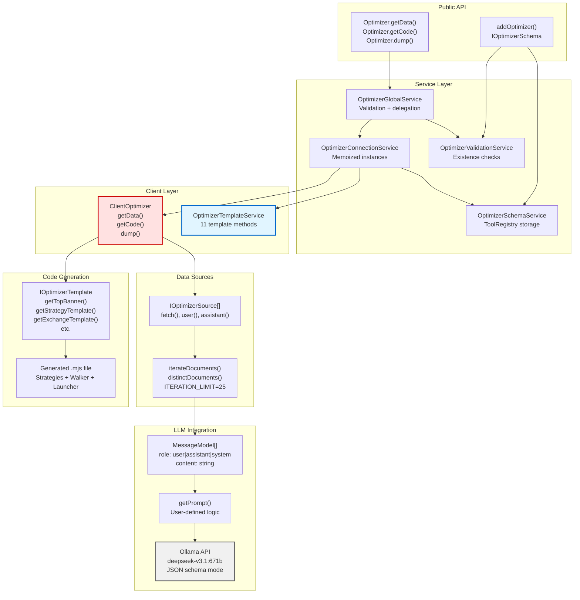
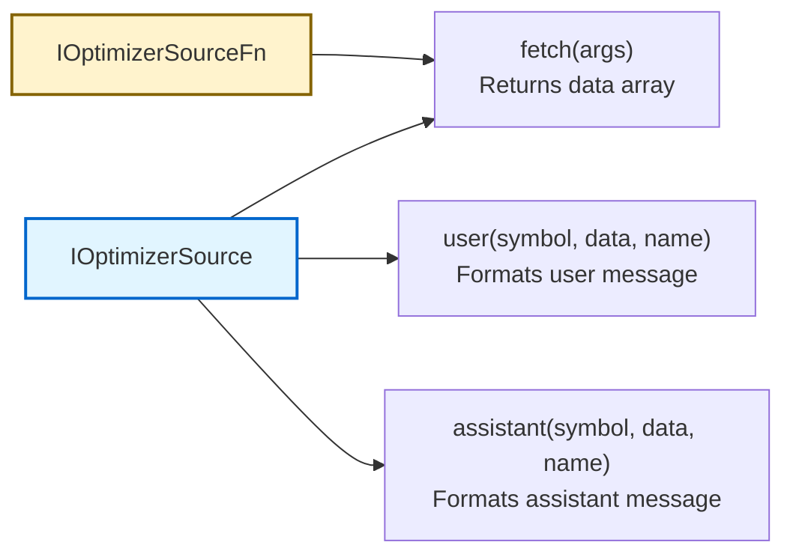
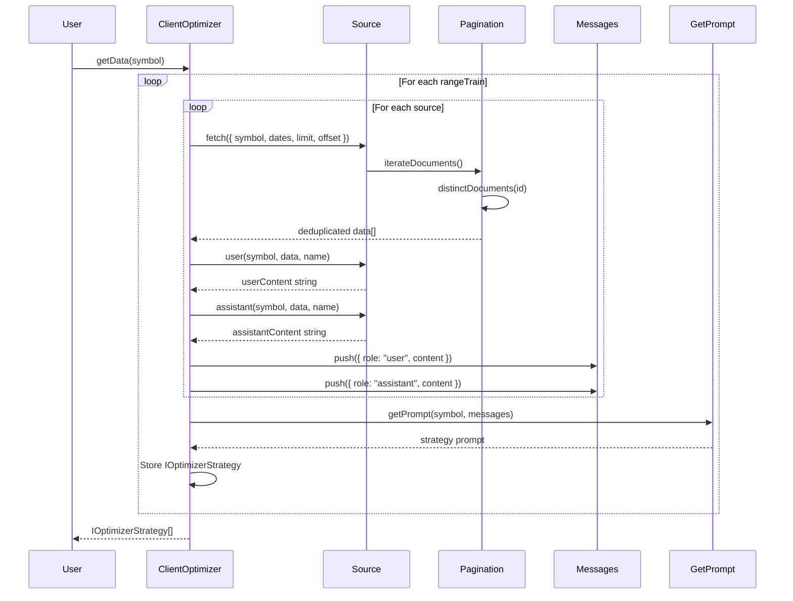
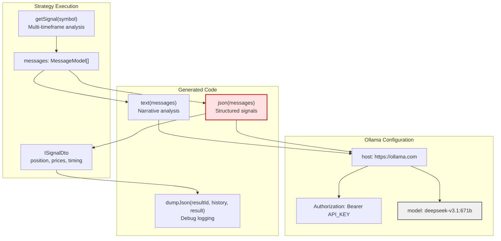
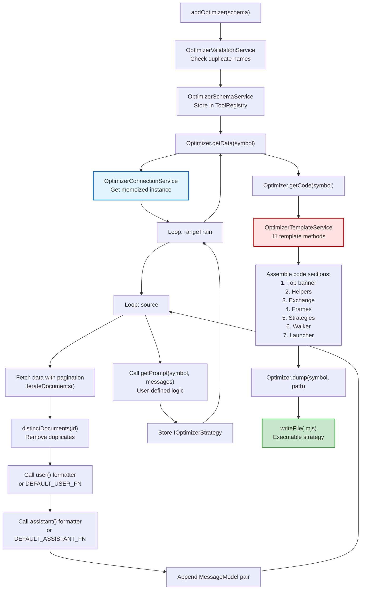

# LLM-Powered Strategy Generation

## Purpose and Scope

This page documents the LLM-powered strategy generation system in Backtest Kit, which uses AI language models to automatically generate trading strategies from historical data and market analysis. The system collects data from configurable sources, builds conversation context for an LLM, generates strategy prompts, and outputs executable TypeScript code complete with strategies, walkers, and backtests.

For information about the Optimizer system architecture, see [Optimizer System](./46_advanced-features.md). For details on code generation templates, see [Code Generation & Templates](./46_advanced-features.md).

**Key Capabilities:**
- Automated strategy creation from historical backtest data
- Multi-timeframe market analysis (1m, 5m, 15m, 1h candles)
- LLM conversation history building with pagination support
- Complete executable code generation with Walker comparison
- Debug logging of LLM conversations to `./dump/strategy/`

**Sources:** [README.md:111-143](), [src/interfaces/Optimizer.interface.ts:1-483]()

---

## System Architecture

The LLM strategy generation system consists of four main layers: schema registration, data collection, LLM interaction, and code generation. The `ClientOptimizer` orchestrates the entire workflow while `OptimizerTemplateService` provides the code generation templates.



**Architecture Flow:**

1. **Registration**: User calls `addOptimizer()` with `IOptimizerSchema` configuration
2. **Validation**: `OptimizerValidationService` checks for duplicate names
3. **Storage**: `OptimizerSchemaService` stores schema in `ToolRegistry`
4. **Instantiation**: `OptimizerConnectionService` creates memoized `ClientOptimizer` instances
5. **Execution**: `ClientOptimizer.getData()` fetches from sources, builds messages, calls LLM
6. **Generation**: `ClientOptimizer.getCode()` uses templates to generate executable code
7. **Export**: `ClientOptimizer.dump()` writes `.mjs` file to disk

**Sources:** [src/client/ClientOptimizer.ts:1-459](), [src/lib/services/template/OptimizerTemplateService.ts:1-732](), [src/lib/services/connection/OptimizerConnectionService.ts:1-175]()

---

## Core Interfaces

### IOptimizerSchema Configuration

The `IOptimizerSchema` interface defines the complete optimizer configuration, including data sources, time ranges, and custom generation logic.

| Field | Type | Required | Description |
|-------|------|----------|-------------|
| `optimizerName` | `OptimizerName` | Yes | Unique identifier for registry lookup |
| `rangeTrain` | `IOptimizerRange[]` | Yes | Training periods for strategy generation |
| `rangeTest` | `IOptimizerRange` | Yes | Testing period for Walker validation |
| `source` | `Source[]` | Yes | Data sources (functions or objects) |
| `getPrompt` | `(symbol, messages) => string` | Yes | Generates strategy prompt from messages |
| `template` | `Partial<IOptimizerTemplate>` | No | Custom template method overrides |
| `callbacks` | `Partial<IOptimizerCallbacks>` | No | Lifecycle event hooks |

**Sources:** [src/interfaces/Optimizer.interface.ts:376-433]()

### IOptimizerRange Time Periods

```typescript
interface IOptimizerRange {
  note?: string;        // Optional description
  startDate: Date;      // Inclusive start
  endDate: Date;        // Inclusive end
}
```

**Multiple Training Ranges**: Each range in `rangeTrain` generates a separate strategy variant. For example, configuring three ranges produces three strategies that are compared in the generated Walker.

**Sources:** [src/interfaces/Optimizer.interface.ts:12-32]()

### IOptimizerSource Data Fetching

Data sources can be simple functions or full configuration objects with custom message formatters:



**Simple Function Source**:
```typescript
const source: IOptimizerSourceFn = async ({ symbol, startDate, endDate, limit, offset }) => {
  // Fetch and return data array
  return data;
};
```

**Full Configuration Source**:
```typescript
const source: IOptimizerSource = {
  name: "backtest-results",
  note: "Historical performance data",
  fetch: async (args) => { /* ... */ },
  user: async (symbol, data, name) => `Analyze these ${data.length} backtests...`,
  assistant: async (symbol, data, name) => "Analysis complete"
};
```

**Sources:** [src/interfaces/Optimizer.interface.ts:86-186]()

---

## Data Collection Pipeline

The data collection pipeline fetches data from all sources across all training ranges, building a comprehensive conversation history for the LLM. Pagination is handled automatically via `functools-kit`.



### Pagination Implementation

The system uses `functools-kit` utilities for automatic pagination with deduplication:

**Pagination Constants**:
- `ITERATION_LIMIT = 25` - Records per page [src/client/ClientOptimizer.ts:19]()

**Pagination Flow**:
1. `iterateDocuments()` - Creates async iterator with `limit` and `offset`
2. `distinctDocuments()` - Deduplicates by `data.id` field
3. `resolveDocuments()` - Materializes all pages into array

**Sources:** [src/client/ClientOptimizer.ts:70-88](), [src/client/ClientOptimizer.ts:99-215]()

### Message Building

For each source in each training range, the system creates a user-assistant message pair:

| Step | Action | Output |
|------|--------|--------|
| 1 | Fetch all data from source | `Data[]` with pagination |
| 2 | Call `callbacks.onSourceData()` | Monitoring hook (optional) |
| 3 | Format user message | `user(symbol, data, name)` → string |
| 4 | Format assistant message | `assistant(symbol, data, name)` → string |
| 5 | Append to message list | `MessageModel[]` |
| 6 | Call `getPrompt()` after all sources | Strategy description string |

**Default Message Formatters**: If source doesn't provide custom `user()` or `assistant()` functions, defaults delegate to template methods:
- [src/client/ClientOptimizer.ts:34-41]() - `DEFAULT_USER_FN`
- [src/client/ClientOptimizer.ts:43-60]() - `DEFAULT_ASSISTANT_FN`

**Sources:** [src/client/ClientOptimizer.ts:99-215](), [src/interfaces/Optimizer.interface.ts:126-177]()

---

## LLM Integration

The generated code integrates with Ollama LLM for real-time strategy decisions. The template system creates two LLM helper functions: `text()` for narrative analysis and `json()` for structured signal generation.

### LLM Helper Functions



### text() Template

The `text()` function generates narrative market analysis with fundamental recommendations:

**Template Location**: [src/lib/services/template/OptimizerTemplateService.ts:555-612]()

**Key Features**:
- Uses `deepseek-v3.1:671b` model
- System prompt: "Write strategy with no extra text, ready for copy-paste"
- User prompt asks for support/resistance analysis, entry points, R/R ratios
- Escapes special characters to prevent code injection
- Returns plain text analysis

**Generated Function Structure**:
```typescript
async function text(messages) {
  const ollama = new Ollama({
    host: "https://ollama.com",
    headers: { Authorization: `Bearer ${process.env.OLLAMA_API_KEY}` }
  });
  
  const response = await ollama.chat({
    model: "deepseek-v3.1:671b",
    messages: [
      { role: "system", content: "Strategic recommendation, no greetings" },
      ...messages,
      { role: "user", content: "Market analysis for ${symbol}" }
    ]
  });
  
  return escapedContent;
}
```

**Sources:** [src/lib/services/template/OptimizerTemplateService.ts:555-612]()

### json() Template with Signal Schema

The `json()` function generates structured trading signals using JSON schema validation:

**Template Location**: [src/lib/services/template/OptimizerTemplateService.ts:614-732]()

**Signal Schema Definition**:

| Field | Type | Required | Enum/Range | Description |
|-------|------|----------|------------|-------------|
| `position` | string | Yes | `wait`, `long`, `short` | Trade direction |
| `note` | string | Yes | - | Strategy explanation |
| `priceOpen` | number | Conditional | > 0 | Entry price (if not `wait`) |
| `priceTakeProfit` | number | Conditional | > 0 | Target price (if not `wait`) |
| `priceStopLoss` | number | Conditional | > 0 | Stop price (if not `wait`) |
| `minuteEstimatedTime` | integer | Conditional | 1-360 | Duration (if not `wait`) |

**JSON Schema Enforcement**:
```json
{
  "type": "object",
  "required": ["position", "note"],
  "properties": {
    "position": { "type": "string", "enum": ["wait", "long", "short"] },
    "note": { "type": "string" },
    "priceOpen": { "type": "number", "minimum": 0 },
    "priceTakeProfit": { "type": "number", "minimum": 0 },
    "priceStopLoss": { "type": "number", "minimum": 0 },
    "minuteEstimatedTime": { "type": "integer", "minimum": 1, "maximum": 360 }
  },
  "if": { "properties": { "position": { "not": { "const": "wait" } } } },
  "then": {
    "required": ["priceOpen", "priceTakeProfit", "priceStopLoss", "minuteEstimatedTime"]
  }
}
```

**Generated Function Structure**:
```typescript
async function json(messages) {
  const ollama = new Ollama({
    host: "https://ollama.com",
    headers: { Authorization: `Bearer ${process.env.OLLAMA_API_KEY}` }
  });
  
  const response = await ollama.chat({
    model: "deepseek-v3.1:671b",
    messages: [
      { role: "system", content: "Analyze strategy and return signal" },
      ...messages
    ],
    format: { type: "json", schema: signalSchema }
  });
  
  return JSON.parse(response.message.content);
}
```

**Sources:** [src/lib/services/template/OptimizerTemplateService.ts:614-732]()

### Debug Logging - dumpJson()

The `dumpJson()` function saves LLM conversations and results to `./dump/strategy/{resultId}/`:

**Generated Files**:
1. `00_system_prompt.md` - System messages and output summary
2. `01_user_message.md`, `02_user_message.md`, etc. - User inputs
3. `0X_llm_output.md` - Final LLM response

**Warning System**: Logs warning if user message exceeds `WARN_KB = 100` kilobytes

**Sources:** [src/lib/services/template/OptimizerTemplateService.ts:452-546]()

---

## Strategy Generation Workflow

The complete workflow from configuration to executable code involves multiple stages: data fetching, message building, prompt generation, and code assembly.



### Phase 1: Registration

**Entry Point**: `addOptimizer(schema: IOptimizerSchema)` [src/index.ts]()

**Validation Steps**:
1. Check for duplicate `optimizerName` [src/lib/services/validation/OptimizerValidationService.ts:25-34]()
2. Validate schema structure [src/lib/services/schema/OptimizerSchemaService.ts:41-67]()
3. Store in `ToolRegistry` [src/lib/services/schema/OptimizerSchemaService.ts:28-32]()

**Sources:** [src/lib/services/validation/OptimizerValidationService.ts:1-72](), [src/lib/services/schema/OptimizerSchemaService.ts:1-97]()

### Phase 2: Data Collection

**Entry Point**: `Optimizer.getData(symbol, { optimizerName })` [src/classes/Optimizer.ts:42-59]()

**Execution Flow**:
1. `OptimizerGlobalService.getData()` validates and delegates [src/lib/services/global/OptimizerGlobalService.ts:37-50]()
2. `OptimizerConnectionService.getData()` retrieves memoized instance [src/lib/services/connection/OptimizerConnectionService.ts:122-132]()
3. `ClientOptimizer.getData()` executes collection logic [src/client/ClientOptimizer.ts:99-215]()

**Inner Loops**:
- **Outer Loop**: Iterate through `rangeTrain` array
- **Inner Loop**: Iterate through `source` array
- For each (range, source) pair:
  - Fetch data with pagination
  - Format user and assistant messages
  - Append to message list
- After each range:
  - Call `getPrompt(symbol, messages)`
  - Store `IOptimizerStrategy` object

**Progress Events**: Emits `ProgressOptimizerContract` via `progressOptimizerEmitter` [src/client/ClientOptimizer.ts:108-114]()

**Sources:** [src/client/ClientOptimizer.ts:99-215](), [src/classes/Optimizer.ts:42-59]()

### Phase 3: Code Generation

**Entry Point**: `Optimizer.getCode(symbol, { optimizerName })` [src/classes/Optimizer.ts:70-87]()

**Template Merging**: `OptimizerConnectionService` merges custom templates with defaults [src/lib/services/connection/OptimizerConnectionService.ts:59-112]()

**Code Assembly Order**:

| Section | Template Method | Description |
|---------|----------------|-------------|
| 1 | `getTopBanner()` | Shebang, imports, constants |
| 2 | `getJsonDumpTemplate()` | Debug logging helper |
| 3 | `getTextTemplate()` | LLM text generation |
| 4 | `getJsonTemplate()` | LLM JSON signal generation |
| 5 | `getExchangeTemplate()` | CCXT Binance configuration |
| 6 | `getFrameTemplate()` (loop) | Train and test timeframes |
| 7 | `getStrategyTemplate()` (loop) | Strategies from prompt |
| 8 | `getWalkerTemplate()` | Strategy comparison |
| 9 | `getLauncherTemplate()` | Event listeners and execution |

**Prefix Generation**: Uses random prefix to prevent naming conflicts [src/client/ClientOptimizer.ts:22](), [src/client/ClientOptimizer.ts:228]()

**Sources:** [src/client/ClientOptimizer.ts:217-350](), [src/lib/services/template/OptimizerTemplateService.ts:1-732]()

### Phase 4: File Export

**Entry Point**: `Optimizer.dump(symbol, { optimizerName }, path)` [src/classes/Optimizer.ts:100-120]()

**File Operations**:
1. Generate complete code via `getCode()`
2. Create output directory with `mkdir(path, { recursive: true })`
3. Write file: `{optimizerName}_{symbol}.mjs`
4. Call `callbacks.onDump()` if provided

**Default Path**: Current working directory (`./`)

**Sources:** [src/client/ClientOptimizer.ts:360-384](), [src/classes/Optimizer.ts:100-120]()

---

## Generated Code Structure

The generated `.mjs` file is a complete, executable Node.js script that includes all necessary components for strategy comparison. The structure follows a consistent 9-section format.

### Complete File Anatomy

```mermaid
graph TB
    subgraph "Section 1: Banner"
        Shebang["#!/usr/bin/env node"]
        Imports["import Ollama, ccxt, backtest-kit"]
        Constants["WARN_KB = 100"]
    end
    
    subgraph "Section 2-4: Helpers"
        DumpJson["async function dumpJson()<br/>Saves to ./dump/strategy/"]
        Text["async function text()<br/>Narrative analysis"]
        Json["async function json()<br/>Signal schema validation"]
    end
    
    subgraph "Section 5: Exchange"
        AddExchange["addExchange()<br/>exchangeName: prefix_exchange<br/>CCXT Binance integration"]
    end
    
    subgraph "Section 6: Frames"
        TrainFrames["addFrame() × rangeTrain.length<br/>frameName: prefix_train_frame-N<br/>interval: 1m"]
        TestFrame["addFrame()<br/>frameName: prefix_test_frame<br/>rangeTest dates"]
    end
    
    subgraph "Section 7: Strategies"
        Strategies["addStrategy() × strategyData.length<br/>strategyName: prefix_strategy-N<br/>interval: 5m<br/>getSignal: multi-timeframe + LLM"]
    end
    
    subgraph "Section 8: Walker"
        AddWalker["addWalker()<br/>walkerName: prefix_walker<br/>All strategies for comparison"]
    end
    
    subgraph "Section 9: Launcher"
        Background["Walker.background(symbol)"]
        Listeners["listenSignalBacktest()<br/>listenBacktestProgress()<br/>listenWalkerProgress()<br/>listenWalkerComplete()<br/>listenDoneBacktest()<br/>listenError()"]
    end
    
    Shebang --> Imports
    Imports --> Constants
    Constants --> DumpJson
    DumpJson --> Text
    Text --> Json
    Json --> AddExchange
    AddExchange --> TrainFrames
    TrainFrames --> TestFrame
    TestFrame --> Strategies
    Strategies --> AddWalker
    AddWalker --> Background
    Background --> Listeners
    
    style Strategies fill:#ffe1e1,stroke:#cc0000,stroke-width:2px
    style AddWalker fill:#e1f5ff,stroke:#0066cc,stroke-width:2px
```



**Sources:** [src/client/ClientOptimizer.ts:217-350]()

### Multi-Timeframe Strategy Template

Each generated strategy performs four-level timeframe analysis before calling the LLM:

**Timeframe Cascade**:
1. **Medium-term (1h)**: 24 candles for trend context
2. **Short-term (15m)**: 24 candles for momentum
3. **Main-term (5m)**: 24 candles for signal generation
4. **Micro-term (1m)**: 30 candles for precise entry

**Message Building**:
```typescript
addStrategy({
  strategyName: "${prefix}_strategy-1",
  interval: "5m",
  getSignal: async (symbol) => {
    const messages = [];
    
    // Load all timeframes
    const microTermCandles = await getCandles(symbol, "1m", 30);
    const mainTermCandles = await getCandles(symbol, "5m", 24);
    const shortTermCandles = await getCandles(symbol, "15m", 24);
    const mediumTermCandles = await getCandles(symbol, "1h", 24);
    
    // Helper to format candles
    function formatCandles(candles, timeframe) {
      return candles.map((c) =>
        `${new Date(c.timestamp).toISOString()}[${timeframe}]: O:${c.open} H:${c.high} L:${c.low} C:${c.close} V:${c.volume}`
      ).join("\n");
    }
    
    // Message 1: Medium-term trend
    messages.push(
      { role: "user", content: `${symbol}\nAnalyze 1h candles:\n\n${formatCandles(mediumTermCandles, "1h")}` },
      { role: "assistant", content: "1h trend analyzed" }
    );
    
    // Message 2: Short-term trend
    messages.push(
      { role: "user", content: `Analyze 15m candles:\n\n${formatCandles(shortTermCandles, "15m")}` },
      { role: "assistant", content: "15m trend analyzed" }
    );
    
    // Message 3: Main timeframe
    messages.push(
      { role: "user", content: `Analyze 5m candles:\n\n${formatCandles(mainTermCandles, "5m")}` },
      { role: "assistant", content: "5m timeframe analyzed" }
    );
    
    // Message 4: Micro-structure
    messages.push(
      { role: "user", content: `Analyze 1m candles:\n\n${formatCandles(microTermCandles, "1m")}` },
      { role: "assistant", content: "1m microstructure analyzed" }
    );
    
    // Message 5: Request signal
    messages.push({
      role: "user",
      content: [
        "Analyze all timeframes and generate signal per strategy.",
        "",
        `${escapedPrompt}`,  // User's strategy logic
        "",
        "If signals contradict or trend weak then position: wait"
      ].join("\n")
    });
    
    const resultId = uuid();
    const result = await json(messages);
    await dumpJson(resultId, messages, result);
    
    result.id = resultId;
    return result;
  }
});
```

**Sources:** [src/lib/services/template/OptimizerTemplateService.ts:168-304]()

### Walker Comparison Setup

The generated Walker compares all strategies on the test frame:

**Configuration**:
```typescript
addWalker({
  walkerName: "${prefix}_walker",
  exchangeName: "${prefix}_exchange",
  frameName: "${prefix}_test_frame",
  strategies: [
    "${prefix}_strategy-1",
    "${prefix}_strategy-2",
    "${prefix}_strategy-3"
  ]
});
```

**Launcher with Event Listeners**:
```typescript
Walker.background("BTCUSDT", {
  walkerName: "${prefix}_walker"
});

listenSignalBacktest((event) => {
  console.log(event);
});

listenBacktestProgress((event) => {
  console.log(`Progress: ${(event.progress * 100).toFixed(2)}%`);
  console.log(`Processed: ${event.processedFrames} / ${event.totalFrames}`);
});

listenWalkerProgress((event) => {
  console.log(`Progress: ${(event.progress * 100).toFixed(2)}%`);
  console.log(`${event.processedStrategies} / ${event.totalStrategies} strategies`);
  console.log(`Walker: ${event.walkerName}, Symbol: ${event.symbol}`);
});

listenWalkerComplete((results) => {
  console.log("Walker completed:", results.bestStrategy);
  Walker.dump("BTCUSDT", results.walkerName);
});

listenDoneBacktest((event) => {
  console.log("Backtest completed:", event.symbol);
  Backtest.dump(event.symbol, event.strategyName);
});

listenError((error) => {
  console.error("Error occurred:", error);
});
```

**Sources:** [src/lib/services/template/OptimizerTemplateService.ts:395-443]()

---

## Configuration Examples

### Basic Optimizer Configuration

Minimal configuration with single source and training range:

```typescript
import { addOptimizer } from "backtest-kit";

addOptimizer({
  optimizerName: "simple-optimizer",
  
  // Training period
  rangeTrain: [
    {
      note: "Bull market 2024",
      startDate: new Date("2024-01-01"),
      endDate: new Date("2024-03-31")
    }
  ],
  
  // Testing period
  rangeTest: {
    note: "Validation period",
    startDate: new Date("2024-04-01"),
    endDate: new Date("2024-06-30")
  },
  
  // Single data source
  source: [
    async ({ symbol, startDate, endDate, limit, offset }) => {
      // Fetch historical backtest results
      const results = await fetchBacktests({
        symbol,
        startDate,
        endDate,
        limit,
        offset
      });
      return results.map(r => ({
        id: r.id,
        pnl: r.pnl,
        winRate: r.winRate,
        sharpe: r.sharpe
      }));
    }
  ],
  
  // Generate strategy prompt
  getPrompt: async (symbol, messages) => {
    return `Based on the analysis above, trade ${symbol} with conservative risk management`;
  }
});
```

**Sources:** [README.md:111-143](), [src/interfaces/Optimizer.interface.ts:376-433]()

### Advanced Configuration with Custom Templates

Full-featured configuration with multiple sources, custom messages, and template overrides:

```typescript
import { addOptimizer } from "backtest-kit";

addOptimizer({
  optimizerName: "advanced-optimizer",
  
  // Multiple training ranges for strategy variants
  rangeTrain: [
    {
      note: "Bull market",
      startDate: new Date("2024-01-01"),
      endDate: new Date("2024-03-31")
    },
    {
      note: "Sideways market",
      startDate: new Date("2023-06-01"),
      endDate: new Date("2023-09-30")
    },
    {
      note: "Bear market",
      startDate: new Date("2022-05-01"),
      endDate: new Date("2022-08-31")
    }
  ],
  
  rangeTest: {
    startDate: new Date("2024-04-01"),
    endDate: new Date("2024-06-30")
  },
  
  // Multiple data sources
  source: [
    // Source 1: Backtest results
    {
      name: "backtest-results",
      note: "Historical performance data",
      fetch: async (args) => {
        const results = await fetchBacktests(args);
        return results.map(r => ({
          id: r.id,
          strategy: r.strategyName,
          pnl: r.totalPnl,
          trades: r.closedSignals.length,
          winRate: r.statistics.winRate
        }));
      },
      user: async (symbol, data, name) => {
        return [
          `Historical backtest results for ${symbol}:`,
          "",
          JSON.stringify(data, null, 2),
          "",
          `Total strategies tested: ${data.length}`
        ].join("\n");
      },
      assistant: async (symbol, data, name) => {
        const avgPnl = data.reduce((sum, d) => sum + d.pnl, 0) / data.length;
        return `Analyzed ${data.length} strategies. Average PNL: ${avgPnl.toFixed(2)}%`;
      }
    },
    
    // Source 2: Market news
    {
      name: "market-sentiment",
      fetch: async ({ symbol, startDate, endDate, limit, offset }) => {
        const news = await fetchNews(symbol, startDate, endDate, limit, offset);
        return news.map(n => ({
          id: n.id,
          date: n.publishedAt,
          headline: n.title,
          sentiment: n.sentimentScore
        }));
      },
      user: async (symbol, data, name) => {
        return `Recent news for ${symbol}:\n${data.map(n => `${n.date}: ${n.headline} (sentiment: ${n.sentiment})`).join("\n")}`;
      },
      assistant: async () => "News sentiment analyzed"
    },
    
    // Source 3: Technical indicators
    async ({ symbol, startDate, endDate, limit, offset }) => {
      const indicators = await calculateIndicators(symbol, startDate, endDate, limit, offset);
      return indicators.map(i => ({
        id: `${symbol}_${i.timestamp}`,
        timestamp: i.timestamp,
        rsi: i.rsi,
        macd: i.macd,
        bbands: i.bbands
      }));
    }
  ],
  
  // LLM prompt generation
  getPrompt: async (symbol, messages) => {
    // Could call text() here for LLM-generated prompt
    return [
      `Trade ${symbol} using the following strategy:`,
      "",
      "1. Confirm trend direction across all timeframes",
      "2. Wait for RSI divergence on 15m timeframe",
      "3. Enter on 5m momentum confirmation",
      "4. Set stop-loss at recent structure level",
      "5. Target 2:1 risk-reward minimum",
      "",
      "Risk Management:",
      "- Maximum 2% risk per trade",
      "- No more than 3 concurrent positions",
      "- Close all positions if daily loss exceeds 5%"
    ].join("\n");
  },
  
  // Custom template overrides
  template: {
    // Override strategy template to use different intervals
    getStrategyTemplate: async (strategyName, interval, prompt) => {
      return [
        `addStrategy({`,
        `  strategyName: "${strategyName}",`,
        `  interval: "15m",  // Custom: 15m instead of 5m`,
        `  getSignal: async (symbol) => {`,
        `    // Custom multi-timeframe logic`,
        `    const candles4h = await getCandles(symbol, "4h", 24);`,
        `    const candles1h = await getCandles(symbol, "1h", 48);`,
        `    const candles15m = await getCandles(symbol, "15m", 96);`,
        `    // ... custom implementation`,
        `  }`,
        `});`
      ].join("\n");
    }
  },
  
  // Lifecycle callbacks
  callbacks: {
    onSourceData: async (symbol, sourceName, data, startDate, endDate) => {
      console.log(`Fetched ${data.length} rows from ${sourceName} for ${symbol}`);
      console.log(`Period: ${startDate.toISOString()} to ${endDate.toISOString()}`);
    },
    
    onData: async (symbol, strategyData) => {
      console.log(`Generated ${strategyData.length} strategy variants for ${symbol}`);
      strategyData.forEach((s, i) => {
        console.log(`Strategy ${i + 1}: ${s.messages.length} messages, prompt length: ${s.strategy.length} chars`);
      });
    },
    
    onCode: async (symbol, code) => {
      console.log(`Generated code for ${symbol}: ${code.length} characters`);
      console.log(`Lines: ${code.split("\n").length}`);
    },
    
    onDump: async (symbol, filepath) => {
      console.log(`Saved strategy to: ${filepath}`);
      console.log(`Run with: node ${filepath}`);
    }
  }
});
```

**Sources:** [src/interfaces/Optimizer.interface.ts:126-237](), [src/interfaces/Optimizer.interface.ts:376-433]()

---

## API Reference

### Optimizer Class Methods

| Method | Signature | Description |
|--------|-----------|-------------|
| `getData()` | `async (symbol: string, context: { optimizerName: string }) => IOptimizerStrategy[]` | Fetches data and generates strategies |
| `getCode()` | `async (symbol: string, context: { optimizerName: string }) => string` | Generates executable code |
| `dump()` | `async (symbol: string, context: { optimizerName: string }, path?: string) => void` | Saves code to file |

**Sources:** [src/classes/Optimizer.ts:1-135]()

### Event Emitters

**Progress Tracking**:
```typescript
import { listenProgressOptimizer } from "backtest-kit";

listenProgressOptimizer((progress) => {
  console.log(`Optimizer: ${progress.optimizerName}`);
  console.log(`Symbol: ${progress.symbol}`);
  console.log(`Progress: ${(progress.progress * 100).toFixed(2)}%`);
  console.log(`Processed: ${progress.processedSources} / ${progress.totalSources}`);
});
```

**Contract Definition**:
```typescript
interface ProgressOptimizerContract {
  optimizerName: string;
  symbol: string;
  totalSources: number;        // Total data sources to process
  processedSources: number;    // Sources completed
  progress: number;            // 0.0 to 1.0
}
```

**Sources:** [src/contract/ProgressOptimizer.contract.ts](), [src/client/ClientOptimizer.ts:108-114]()

### Template Method Reference

All template methods return `string | Promise<string>` and can be overridden in `IOptimizerSchema.template`:

| Method | Parameters | Purpose |
|--------|------------|---------|
| `getTopBanner()` | `symbol: string` | Imports and constants |
| `getUserMessage()` | `symbol: string, data: any[], name: string` | Default user message |
| `getAssistantMessage()` | `symbol: string, data: any[], name: string` | Default assistant message |
| `getWalkerTemplate()` | `walkerName, exchangeName, frameName, strategies[]` | Walker config |
| `getExchangeTemplate()` | `symbol, exchangeName` | Exchange config |
| `getFrameTemplate()` | `symbol, frameName, interval, startDate, endDate` | Frame config |
| `getStrategyTemplate()` | `strategyName, interval, prompt` | Strategy with getSignal |
| `getLauncherTemplate()` | `symbol, walkerName` | Walker execution |
| `getTextTemplate()` | `symbol` | LLM text helper |
| `getJsonTemplate()` | `symbol` | LLM JSON helper |
| `getJsonDumpTemplate()` | `symbol` | Debug logging helper |

**Sources:** [src/interfaces/Optimizer.interface.ts:238-374]()

---

## Integration Patterns

### Using with Walker for Comparison

The generated code automatically creates a Walker that compares all strategy variants:

```typescript
// Register optimizer with 3 training ranges
addOptimizer({
  optimizerName: "market-conditions",
  rangeTrain: [
    { startDate: new Date("2024-01-01"), endDate: new Date("2024-02-01") },  // Bull
    { startDate: new Date("2023-06-01"), endDate: new Date("2023-07-01") },  // Sideways
    { startDate: new Date("2022-11-01"), endDate: new Date("2022-12-01") }   // Bear
  ],
  rangeTest: { startDate: new Date("2024-04-01"), endDate: new Date("2024-05-01") },
  source: [/* ... */],
  getPrompt: async (symbol, messages) => "Strategy for specific market condition"
});

// Generate code
await Optimizer.dump("BTCUSDT", { optimizerName: "market-conditions" }, "./output");

// Run generated file
// $ node ./output/market-conditions_BTCUSDT.mjs
// 
// Output:
// Progress: 33.33%
// 1 / 3 strategies
// Walker: abc123_walker, Symbol: BTCUSDT
// 
// Progress: 66.67%
// 2 / 3 strategies
// 
// Progress: 100.00%
// 3 / 3 strategies
// 
// Walker completed: abc123_strategy-2
// Best strategy: abc123_strategy-2 (Sideways market variant)
```

**Sources:** [src/lib/services/template/OptimizerTemplateService.ts:122-157](), [src/lib/services/template/OptimizerTemplateService.ts:395-443]()

### Custom Data Source with Pagination

Implement a paginated data source with proper ID handling:

```typescript
interface BacktestResult extends IOptimizerData {
  id: string;
  strategyName: string;
  symbol: string;
  pnl: number;
  winRate: number;
  sharpeRatio: number;
  totalTrades: number;
}

const backtestSource: IOptimizerSourceFn<BacktestResult> = async ({
  symbol,
  startDate,
  endDate,
  limit,
  offset
}) => {
  // Fetch from database with pagination
  const results = await db.backtests.findMany({
    where: {
      symbol,
      completedAt: {
        gte: startDate,
        lte: endDate
      }
    },
    skip: offset,
    take: limit,
    orderBy: { completedAt: "asc" }
  });
  
  // Map to IOptimizerData with required id field
  return results.map(r => ({
    id: r.id,  // Required for deduplication
    strategyName: r.strategyName,
    symbol: r.symbol,
    pnl: r.totalPnl,
    winRate: (r.profitableTrades / r.totalTrades) * 100,
    sharpeRatio: r.sharpeRatio,
    totalTrades: r.totalTrades
  }));
};

addOptimizer({
  optimizerName: "historical-learner",
  rangeTrain: [/* ... */],
  rangeTest: { /* ... */ },
  source: [backtestSource],
  getPrompt: async (symbol, messages) => {
    // Analyze conversation history to generate prompt
    return "Strategy based on historical performance patterns";
  }
});
```

**Deduplication**: The `id` field is used by `distinctDocuments()` to remove duplicates when pages overlap.

**Sources:** [src/client/ClientOptimizer.ts:70-88](), [src/interfaces/Optimizer.interface.ts:36-44]()

### Custom Message Formatting

Override default message formatters for specialized data presentation:

```typescript
addOptimizer({
  optimizerName: "custom-messages",
  rangeTrain: [/* ... */],
  rangeTest: { /* ... */ },
  source: [
    {
      name: "performance-metrics",
      fetch: async (args) => {
        const metrics = await fetchMetrics(args);
        return metrics.map(m => ({
          id: m.id,
          sharpe: m.sharpeRatio,
          sortino: m.sortinoRatio,
          calmar: m.calmarRatio,
          maxDrawdown: m.maxDrawdown
        }));
      },
      
      // Custom user message with formatted table
      user: async (symbol, data, name) => {
        const table = data.map(d => 
          `| ${d.sharpe.toFixed(2)} | ${d.sortino.toFixed(2)} | ${d.calmar.toFixed(2)} | ${(d.maxDrawdown * 100).toFixed(2)}% |`
        ).join("\n");
        
        return [
          `Performance metrics for ${symbol}:`,
          "",
          "| Sharpe | Sortino | Calmar | Max DD |",
          "|--------|---------|--------|--------|",
          table,
          "",
          `Total records: ${data.length}`
        ].join("\n");
      },
      
      // Custom assistant message with analysis
      assistant: async (symbol, data, name) => {
        const avgSharpe = data.reduce((sum, d) => sum + d.sharpe, 0) / data.length;
        const avgMaxDD = data.reduce((sum, d) => sum + d.maxDrawdown, 0) / data.length;
        
        return [
          `Analyzed ${data.length} performance records.`,
          `Average Sharpe Ratio: ${avgSharpe.toFixed(2)}`,
          `Average Max Drawdown: ${(avgMaxDD * 100).toFixed(2)}%`,
          `Risk-adjusted returns are ${avgSharpe > 1 ? "favorable" : "unfavorable"}.`
        ].join(" ");
      }
    }
  ],
  getPrompt: async (symbol, messages) => "Risk-optimized strategy"
});
```

**Sources:** [src/interfaces/Optimizer.interface.ts:126-177](), [src/client/ClientOptimizer.ts:34-60]()

---

## Performance Considerations

### Memory Management

**Data Deduplication**: The `distinctDocuments()` function prevents memory bloat from overlapping pagination:
- Maintains a `Set` of seen IDs
- Filters out duplicate records
- Critical for large datasets with many pages

**Message Size Warning**: The `dumpJson()` function warns when user messages exceed 100KB [src/lib/services/template/OptimizerTemplateService.ts:508-515]()

**Sources:** [src/client/ClientOptimizer.ts:70-88]()

### Memoization

**Optimizer Instance Caching**: `OptimizerConnectionService` memoizes `ClientOptimizer` instances by `optimizerName`:
- Single instance per optimizer name
- Template merging done once
- Reduces initialization overhead

**Memoization Key**: `[optimizerName]` [src/lib/services/connection/OptimizerConnectionService.ts:59-112]()

**Sources:** [src/lib/services/connection/OptimizerConnectionService.ts:59-112]()

### Pagination Efficiency

**Iteration Limit**: `ITERATION_LIMIT = 25` records per page balances:
- Network request overhead
- Memory consumption
- Response time

**Optimal For**:
- Database sources with efficient `LIMIT`/`OFFSET`
- APIs with cursor-based pagination
- Datasets with 100-10,000 total records

**Sources:** [src/client/ClientOptimizer.ts:19]()