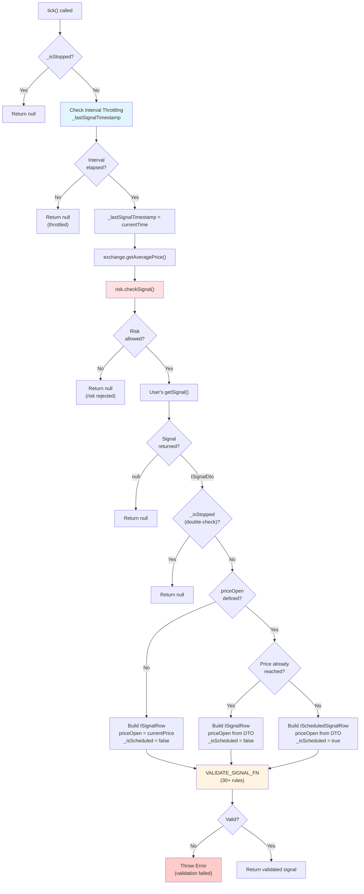
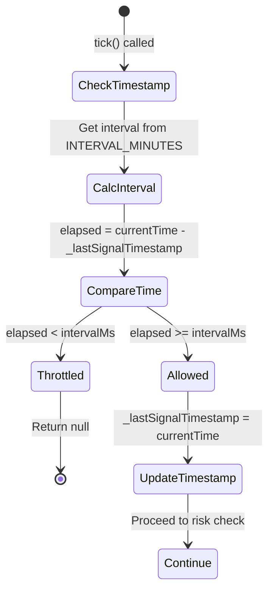
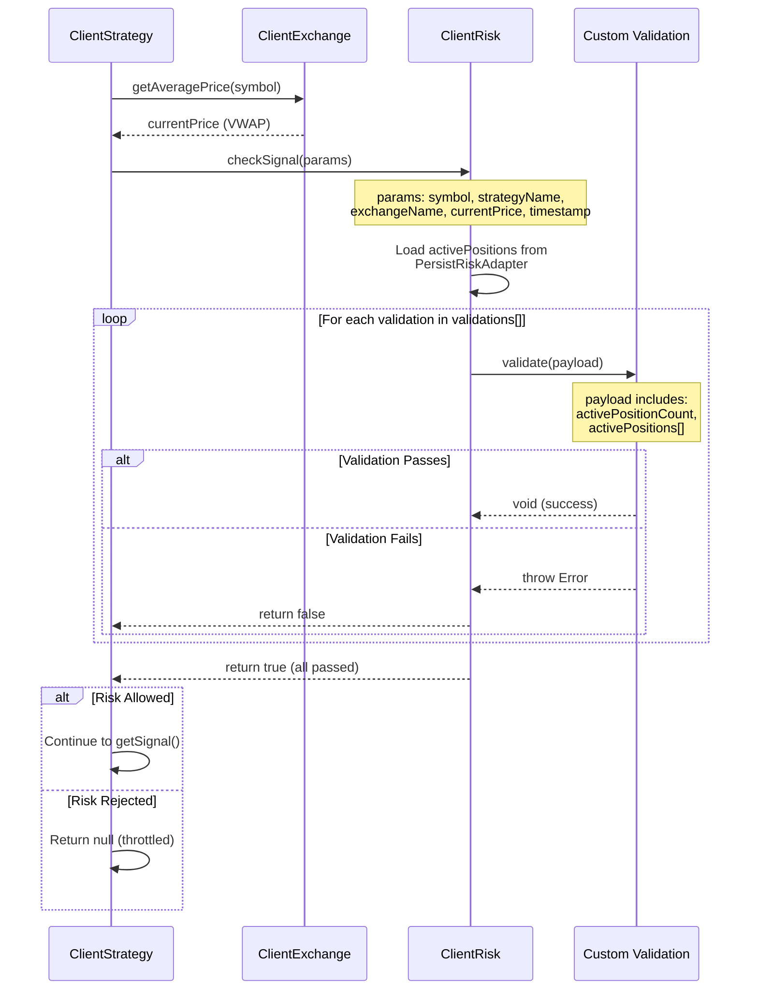
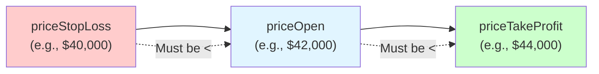
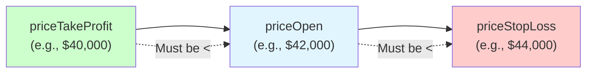
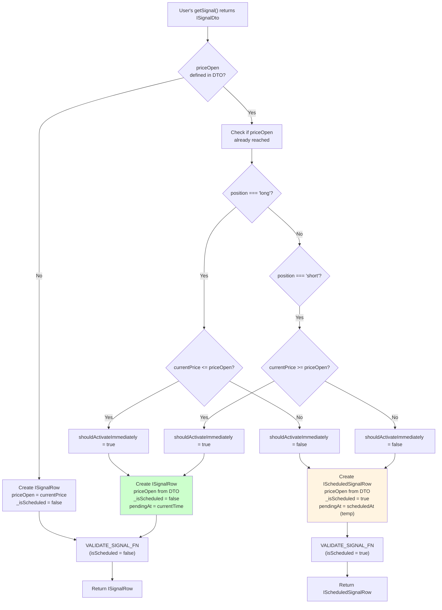
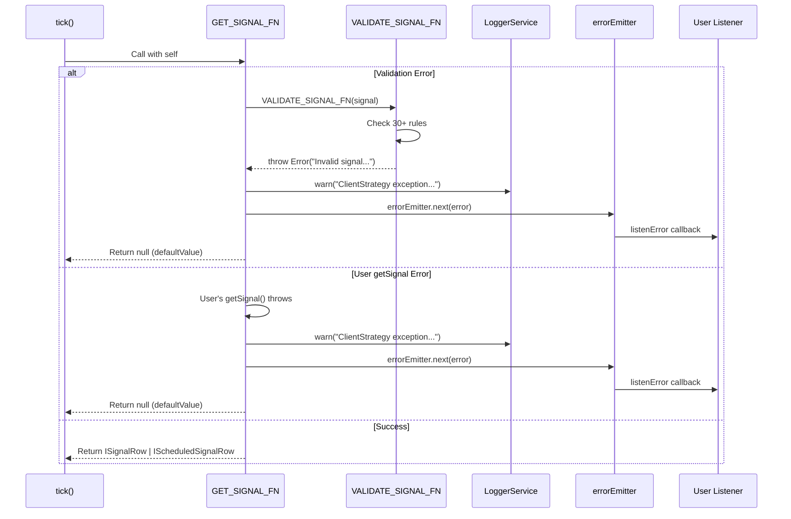

# Signal Generation and Validation

## Purpose and Scope

This page documents the signal generation and validation pipeline in `ClientStrategy`, which implements a three-layer validation architecture to ensure trading safety: interval throttling, risk management gates, and structural validation. This system processes user-provided `getSignal()` functions and transforms raw signal DTOs into validated `ISignalRow` objects ready for execution.

For information about signal states and lifecycle transitions, see [Signal States](#8.1). For scheduled signal activation logic, see [Scheduled Signals](#8.3). For signal persistence and crash recovery, see [Signal Persistence](#8.4).

## Signal Generation Pipeline

The signal generation process is orchestrated by `GET_SIGNAL_FN` in [src/client/ClientStrategy.ts:263-396]() and executes a multi-stage pipeline with early-exit optimization at each validation layer.



**Sources:** [src/client/ClientStrategy.ts:263-396](), [src/interfaces/Strategy.interface.ts:132-149]()

## Three-Layer Validation Architecture

The validation pipeline implements defense-in-depth with three independent validation layers, each serving a distinct purpose:

| Layer | Location | Purpose | Exit Strategy |
|-------|----------|---------|---------------|
| **Interval Throttling** | [src/client/ClientStrategy.ts:272-284]() | Rate limiting based on `SignalInterval` | Return null (silent) |
| **Risk Gates** | [src/client/ClientStrategy.ts:288-300]() | Portfolio-level risk validation via `IRisk.checkSignal()` | Return null (silent) |
| **Structure Validation** | [src/client/ClientStrategy.ts:41-261]() | Signal integrity checks (30+ rules) | Throw Error (loud) |

The first two layers fail silently (return `null`) to prevent log spam during normal operation. The structure validation layer throws errors because invalid signals indicate programming errors that should halt execution.

**Sources:** [src/client/ClientStrategy.ts:263-396]()

## Interval Throttling

Interval throttling enforces minimum time between `getSignal()` invocations using `_lastSignalTimestamp` to prevent computational waste and API rate limits.

### SignalInterval Configuration

```typescript
// src/client/ClientStrategy.ts:32-39
const INTERVAL_MINUTES: Record<SignalInterval, number> = {
  "1m": 1,
  "3m": 3,
  "5m": 5,
  "15m": 15,
  "30m": 30,
  "1h": 60,
};
```

### Throttling Logic



The throttling mechanism [src/client/ClientStrategy.ts:272-284]() checks if sufficient time has elapsed since the last signal generation attempt. If `_lastSignalTimestamp` is `null` (first call), the check passes immediately. Otherwise, it compares `currentTime - _lastSignalTimestamp` against the configured interval in milliseconds.

**Example:** A strategy with `interval: "5m"` can generate at most one signal every 5 minutes, regardless of how frequently `tick()` is called.

**Sources:** [src/client/ClientStrategy.ts:32-39](), [src/client/ClientStrategy.ts:272-284](), [src/interfaces/Strategy.interface.ts:12-18]()

## Risk Gates

Risk gates provide pre-generation validation through `IRisk.checkSignal()` [src/client/ClientStrategy.ts:288-300](), which evaluates portfolio-level constraints before allowing signal creation.

### Risk Check Parameters

The risk check receives `IRiskCheckArgs` [types.d.ts:443-458]():

```typescript
interface IRiskCheckArgs {
  symbol: string;              // Trading pair
  strategyName: StrategyName;  // Strategy requesting signal
  exchangeName: ExchangeName;  // Exchange name
  currentPrice: number;        // Current VWAP price
  timestamp: number;           // Current timestamp
}
```

### Risk Validation Flow



If any validation in the risk profile throws an error or `checkSignal()` returns `false`, signal generation is aborted and `tick()` returns `null`. This prevents violating portfolio limits like maximum concurrent positions or leverage constraints.

**Sources:** [src/client/ClientStrategy.ts:288-300](), [types.d.ts:443-512](), [src/interfaces/Risk.interface.ts]()

## Signal Structure Validation

Structure validation is implemented by `VALIDATE_SIGNAL_FN` [src/client/ClientStrategy.ts:41-261](), which enforces 30+ rules organized into eight categories. Validation occurs after signal construction but before returning from `GET_SIGNAL_FN`.

### Validation Rules Table

| Category | Rule | Check | Threshold/Value |
|----------|------|-------|-----------------|
| **Required Fields** | ID presence | `id !== undefined && id !== null && id !== ''` | Non-empty string |
| | Exchange name | `exchangeName !== undefined && !== null && !== ''` | Non-empty string |
| | Strategy name | `strategyName !== undefined && !== null && !== ''` | Non-empty string |
| | Symbol | `symbol !== undefined && !== null && !== ''` | Non-empty string |
| | Position | `position === "long" \|\| position === "short"` | Enum validation |
| | Scheduled marker | `_isScheduled !== undefined && !== null` | Boolean |
| **NaN/Infinity Protection** | Current price finite | `isFinite(currentPrice)` | No NaN/Infinity |
| | Current price positive | `currentPrice > 0` | Must be > 0 |
| | priceOpen finite | `isFinite(signal.priceOpen)` | No NaN/Infinity |
| | priceTakeProfit finite | `isFinite(signal.priceTakeProfit)` | No NaN/Infinity |
| | priceStopLoss finite | `isFinite(signal.priceStopLoss)` | No NaN/Infinity |
| | Prices positive | `price > 0` for all price fields | Must be > 0 |
| **LONG Position Logic** | TP above open | `priceTakeProfit > priceOpen` | Strict inequality |
| | SL below open | `priceStopLoss < priceOpen` | Strict inequality |
| | Current price vs SL | `currentPrice >= priceStopLoss` | Immediate signals only |
| | Current price vs TP | `currentPrice <= priceTakeProfit` | Immediate signals only |
| **SHORT Position Logic** | TP below open | `priceTakeProfit < priceOpen` | Strict inequality |
| | SL above open | `priceStopLoss > priceOpen` | Strict inequality |
| | Current price vs SL | `currentPrice <= priceStopLoss` | Immediate signals only |
| | Current price vs TP | `currentPrice >= priceTakeProfit` | Immediate signals only |
| **Minimum Profit Distance** | LONG TP distance | `((TP - open) / open) * 100` | ≥ `CC_MIN_TAKEPROFIT_DISTANCE_PERCENT` (0.3%) |
| | SHORT TP distance | `((open - TP) / open) * 100` | ≥ `CC_MIN_TAKEPROFIT_DISTANCE_PERCENT` (0.3%) |
| **Maximum Loss Distance** | LONG SL distance | `((open - SL) / open) * 100` | ≤ `CC_MAX_STOPLOSS_DISTANCE_PERCENT` (20%) |
| | SHORT SL distance | `((SL - open) / open) * 100` | ≤ `CC_MAX_STOPLOSS_DISTANCE_PERCENT` (20%) |
| **Time Validation** | Time positive | `minuteEstimatedTime > 0` | Must be > 0 |
| | Time integer | `Number.isInteger(minuteEstimatedTime)` | Whole minutes only |
| | Maximum lifetime | `minuteEstimatedTime` | ≤ `CC_MAX_SIGNAL_LIFETIME_MINUTES` (1440) |
| | scheduledAt positive | `scheduledAt > 0` | Must be > 0 |
| | pendingAt positive | `pendingAt > 0` | Must be > 0 |

**Sources:** [src/client/ClientStrategy.ts:41-261](), [types.d.ts:5-72]()

## Validation Categories Detail

### Required Fields Validation

Required fields validation [src/client/ClientStrategy.ts:44-62]() ensures all mandatory `ISignalRow` properties are present and non-empty. This prevents downstream errors from undefined values.

```typescript
// Validation checks existence, non-null, and non-empty for strings
if (signal.id === undefined || signal.id === null || signal.id === '') {
  errors.push('id is required and must be a non-empty string');
}
```

### NaN/Infinity Protection

NaN/Infinity protection [src/client/ClientStrategy.ts:64-103]() guards against arithmetic errors and incomplete candle data from exchanges.

**Rationale:** Exchange APIs (especially Binance) occasionally return candles with prices near $0.01-1 when data is incomplete. The validation layer catches these anomalies before they corrupt PnL calculations.

```typescript
// Check finite before value range validation
if (!isFinite(signal.priceOpen)) {
  errors.push(`priceOpen must be a finite number, got ${signal.priceOpen}`);
}
if (isFinite(signal.priceOpen) && signal.priceOpen <= 0) {
  errors.push(`priceOpen must be positive, got ${signal.priceOpen}`);
}
```

**Sources:** [src/client/ClientStrategy.ts:64-103](), [types.d.ts:45-71]()

### LONG Position Price Logic

LONG position validation [src/client/ClientStrategy.ts:105-162]() enforces the invariant: `priceStopLoss < priceOpen < priceTakeProfit`.



#### Edge Case Protection for Immediate Signals

For immediate (non-scheduled) signals [src/client/ClientStrategy.ts:118-135](), the validator checks that `currentPrice` hasn't already breached TP or SL:

- **SL breach check:** `currentPrice < priceStopLoss` → Error (position would immediately close at loss)
- **TP breach check:** `currentPrice > priceTakeProfit` → Error (profit opportunity already passed)

**Example violation:**
```typescript
// INVALID: Current price ($39,000) already below SL ($40,000)
{
  position: "long",
  priceOpen: 42000,      // Current VWAP
  priceTakeProfit: 44000,
  priceStopLoss: 40000,  // currentPrice = 39000 < 40000 ❌
}
// Error: "currentPrice (39000) < priceStopLoss (40000). Signal would be immediately cancelled."
```

**Sources:** [src/client/ClientStrategy.ts:105-162]()

### SHORT Position Price Logic

SHORT position validation [src/client/ClientStrategy.ts:165-222]() enforces the invariant: `priceTakeProfit < priceOpen < priceStopLoss`.



SHORT logic is inverted from LONG: profits occur when price falls (toward TP), losses occur when price rises (toward SL).

**Sources:** [src/client/ClientStrategy.ts:165-222]()

### Minimum Profit Distance Validation

Minimum profit distance [src/client/ClientStrategy.ts:138-148]() prevents micro-profit signals that cannot cover trading fees (typically 2 × 0.1% = 0.2% total).

**Configuration:** `CC_MIN_TAKEPROFIT_DISTANCE_PERCENT` defaults to 0.3% [types.d.ts:21]().

**Calculation:**
- **LONG:** `tpDistancePercent = ((priceTakeProfit - priceOpen) / priceOpen) * 100`
- **SHORT:** `tpDistancePercent = ((priceOpen - priceTakeProfit) / priceOpen) * 100`

**Example rejection:**
```typescript
// INVALID: TP distance = 0.15% < 0.3% minimum
{
  position: "long",
  priceOpen: 42000,
  priceTakeProfit: 42063,  // Only $63 profit = 0.15%
  priceStopLoss: 40000,
}
// Error: "TakeProfit too close to priceOpen (0.150%). Minimum distance: 0.3% to cover trading fees."
```

**Sources:** [src/client/ClientStrategy.ts:138-148](), [src/client/ClientStrategy.ts:198-208](), [types.d.ts:16-20]()

### Maximum Loss Distance Validation

Maximum loss distance [src/client/ClientStrategy.ts:151-161]() prevents catastrophic losses from extreme StopLoss values.

**Configuration:** `CC_MAX_STOPLOSS_DISTANCE_PERCENT` defaults to 20% [types.d.ts:27]().

**Calculation:**
- **LONG:** `slDistancePercent = ((priceOpen - priceStopLoss) / priceOpen) * 100`
- **SHORT:** `slDistancePercent = ((priceStopLoss - priceOpen) / priceOpen) * 100`

**Example rejection:**
```typescript
// INVALID: SL distance = 35% > 20% maximum
{
  position: "long",
  priceOpen: 42000,
  priceTakeProfit: 44000,
  priceStopLoss: 27300,  // 35% loss if hit
}
// Error: "StopLoss too far from priceOpen (35.000%). Maximum distance: 20% to protect capital."
```

**Sources:** [src/client/ClientStrategy.ts:151-161](), [src/client/ClientStrategy.ts:211-221](), [types.d.ts:24-27]()

### Time Parameter Validation

Time validation [src/client/ClientStrategy.ts:225-254]() ensures signal lifetime parameters are sane.

**Rules:**
1. **Positive integer:** `minuteEstimatedTime > 0 && Number.isInteger(minuteEstimatedTime)`
2. **Maximum lifetime:** `minuteEstimatedTime <= CC_MAX_SIGNAL_LIFETIME_MINUTES` (default: 1440 = 1 day)
3. **Timestamp validity:** `scheduledAt > 0 && pendingAt > 0`

**Rationale for maximum lifetime:** Eternal signals (e.g., `minuteEstimatedTime: 100000`) block risk limits indefinitely, preventing new signals from opening. The 1-day maximum prevents strategy deadlock.

**Sources:** [src/client/ClientStrategy.ts:225-254](), [types.d.ts:29-33]()

## Scheduled vs Immediate Signal Determination

After successful validation, `GET_SIGNAL_FN` determines whether to create a scheduled or immediate signal based on `priceOpen` and current market conditions [src/client/ClientStrategy.ts:313-367]().

### Decision Tree



### Activation Logic

**LONG signals:**
- **Immediate:** `currentPrice <= priceOpen` (price already fell to entry)
- **Scheduled:** `currentPrice > priceOpen` (wait for price to fall)

**SHORT signals:**
- **Immediate:** `currentPrice >= priceOpen` (price already rose to entry)
- **Scheduled:** `currentPrice < priceOpen` (wait for price to rise)

### Code Entity Mapping

```typescript
// src/client/ClientStrategy.ts:313-344
if (signal.priceOpen !== undefined) {
  const shouldActivateImmediately =
    (signal.position === "long" && currentPrice <= signal.priceOpen) ||
    (signal.position === "short" && currentPrice >= signal.priceOpen);

  if (shouldActivateImmediately) {
    // Immediate activation: price already reached entry
    const signalRow: ISignalRow = {
      id: randomString(),
      priceOpen: signal.priceOpen,  // Use specified priceOpen
      // ... other fields
      _isScheduled: false,
    };
    return signalRow;
  }

  // Scheduled: wait for price to reach entry
  const scheduledSignalRow: IScheduledSignalRow = {
    id: randomString(),
    priceOpen: signal.priceOpen,
    // ... other fields
    _isScheduled: true,
  };
  return scheduledSignalRow;
}
```

**Sources:** [src/client/ClientStrategy.ts:313-367](), [src/interfaces/Strategy.interface.ts:64-73]()

## Error Handling and Recovery

Signal generation is wrapped in a `trycatch` decorator [src/client/ClientStrategy.ts:263-396]() that provides graceful error handling without crashing the execution loop.

### Error Handling Configuration

```typescript
// src/client/ClientStrategy.ts:263-396
const GET_SIGNAL_FN = trycatch(
  async (self: ClientStrategy): Promise<ISignalRow | IScheduledSignalRow | null> => {
    // ... signal generation logic
  },
  {
    defaultValue: null,  // Return null on error
    fallback: (error) => {
      backtest.loggerService.warn("ClientStrategy exception thrown", {
        error: errorData(error),
        message: getErrorMessage(error),
      });
      errorEmitter.next(error);  // Emit to listenError subscribers
    },
  }
);
```

### Error Flow



The `trycatch` wrapper ensures:
1. **Logging:** All errors are logged via `LoggerService`
2. **Event emission:** Errors are emitted to `errorEmitter` for monitoring
3. **Graceful degradation:** Returns `null` instead of crashing, allowing `tick()` to continue
4. **Observability:** Errors can be captured by `listenError()` subscribers

### Validation Error Format

Validation errors accumulate all rule violations before throwing [src/client/ClientStrategy.ts:256-260]():

```typescript
if (errors.length > 0) {
  throw new Error(
    `Invalid signal for ${signal.position} position:\n${errors.join("\n")}`
  );
}
```

**Example error message:**
```
Invalid signal for long position:
priceTakeProfit (41500) must be > priceOpen (42000)
minuteEstimatedTime must be positive, got -10
```

**Sources:** [src/client/ClientStrategy.ts:263-396](), [src/client/ClientStrategy.ts:41-261]()

## Validation Test Coverage

The validation system has extensive test coverage in [test/e2e/defend.test.mjs](), including:

| Test | Scenario | Expected Behavior |
|------|----------|-------------------|
| Invalid LONG TP | `priceTakeProfit <= priceOpen` | Signal rejected, `scheduledCount = 0` |
| Invalid SHORT TP | `priceTakeProfit >= priceOpen` | Signal rejected, `scheduledCount = 0` |
| Invalid LONG SL | `priceStopLoss >= priceOpen` | Signal rejected, `scheduledCount = 0` |
| Zero StopLoss | `priceStopLoss = 0` | Signal rejected (unlimited risk) |
| Inverted SHORT logic | `priceTakeProfit > priceOpen` | Signal rejected (wrong direction) |
| Zero time | `minuteEstimatedTime = 0` | Signal rejected (instant timeout) |
| TP equals open | `priceTakeProfit = priceOpen` | Signal rejected (zero profit) |
| Edge case: immediate SL | `currentPrice < priceStopLoss` for LONG | Signal rejected (already breached) |

**Test pattern:**
```javascript
// test/e2e/defend.test.mjs:545-642
test("DEFEND: Invalid LONG signal rejected (TP below priceOpen)", async ({ pass, fail }) => {
  let scheduledCount = 0;
  let openedCount = 0;
  
  addStrategy({
    strategyName: "test-defend-invalid-long",
    interval: "1m",
    getSignal: async () => {
      return {
        position: "long",
        priceOpen: 41000,
        priceTakeProfit: 40000,  // INVALID: TP < priceOpen for LONG
        priceStopLoss: 39000,
        minuteEstimatedTime: 60,
      };
    },
    callbacks: {
      onSchedule: () => { scheduledCount++; },
      onOpen: () => { openedCount++; },
    },
  });
  
  // ... run backtest
  
  if (scheduledCount === 0 && openedCount === 0) {
    pass("MONEY SAFE: Invalid LONG signal rejected");
  } else {
    fail("CRITICAL BUG: Invalid signal was NOT rejected!");
  }
});
```

**Sources:** [test/e2e/defend.test.mjs:545-1744]()

## Global Configuration Parameters

Validation thresholds are configurable via `setConfig()` [types.d.ts:135]():

```typescript
import { setConfig } from "backtest-kit";

setConfig({
  CC_MIN_TAKEPROFIT_DISTANCE_PERCENT: 0.5,  // Increase minimum TP distance to 0.5%
  CC_MAX_STOPLOSS_DISTANCE_PERCENT: 15,     // Reduce maximum SL distance to 15%
  CC_MAX_SIGNAL_LIFETIME_MINUTES: 720,      // Reduce maximum lifetime to 12 hours
});
```

**Available parameters:**
- `CC_MIN_TAKEPROFIT_DISTANCE_PERCENT`: Minimum TP distance (default: 0.3%)
- `CC_MAX_STOPLOSS_DISTANCE_PERCENT`: Maximum SL distance (default: 20%)
- `CC_MAX_SIGNAL_LIFETIME_MINUTES`: Maximum signal lifetime (default: 1440 minutes)
- `CC_SCHEDULE_AWAIT_MINUTES`: Scheduled signal timeout (default: 120 minutes)

**Sources:** [types.d.ts:5-72](), [types.d.ts:123-135]()