# Signal Lifecycle

<details>
<summary>Relevant source files</summary>

The following files were used as context for generating this wiki page:

- [README.md](README.md)
- [src/client/ClientStrategy.ts](src/client/ClientStrategy.ts)
- [src/config/emitters.ts](src/config/emitters.ts)
- [src/function/event.ts](src/function/event.ts)
- [src/index.ts](src/index.ts)
- [src/interfaces/Strategy.interface.ts](src/interfaces/Strategy.interface.ts)
- [test/e2e/defend.test.mjs](test/e2e/defend.test.mjs)
- [test/index.mjs](test/index.mjs)
- [types.d.ts](types.d.ts)

</details>


This document provides a comprehensive guide to the signal lifecycle in backtest-kit. It covers signal states, generation, validation, state transitions, and persistence. The signal lifecycle is the core mechanism through which trading positions are created, monitored, and closed by the framework.

For information about risk management checks that occur during signal generation, see [Risk Management](#12). For details on execution modes (Backtest vs Live) that affect lifecycle behavior, see [Execution Modes](#2.1).

---

## Signal States Overview

Signals in backtest-kit follow a discriminated union pattern (`IStrategyTickResult`) with six possible states. Each state is represented by a specific TypeScript interface with an `action` discriminator field for type-safe handling.

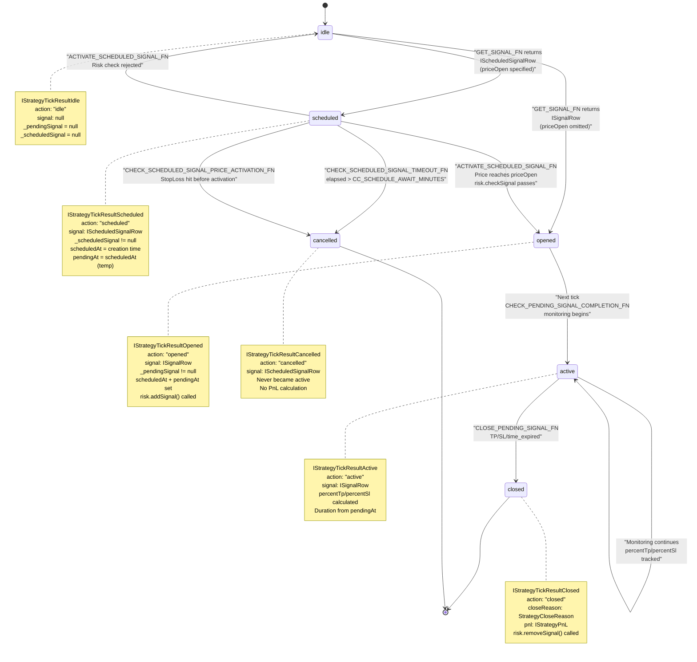

**Sources:** [src/interfaces/Strategy.interface.ts:171-305](), [src/client/ClientStrategy.ts:45-330](), [src/client/ClientStrategy.ts:554-801]()

---

## Signal Data Structures

The framework defines a hierarchy of signal types with increasing levels of completeness and metadata.

### Core Signal Types

| Type | Description | Key Fields | Usage |
|------|-------------|------------|-------|
| `ISignalDto` | User-returned signal from `getSignal()` | `position`, `priceTakeProfit`, `priceStopLoss`, `minuteEstimatedTime`, optional `priceOpen` | Returned by strategy's `getSignal` function |
| `ISignalRow` | Validated signal with metadata | Extends `ISignalDto` + `id`, `priceOpen` (required), `scheduledAt`, `pendingAt`, `symbol`, `strategyName`, `exchangeName`, `_isScheduled` | Used throughout lifecycle |
| `IScheduledSignalRow` | Scheduled signal variant | Extends `ISignalRow`, enforces `priceOpen` presence | Represents delayed entry signals |

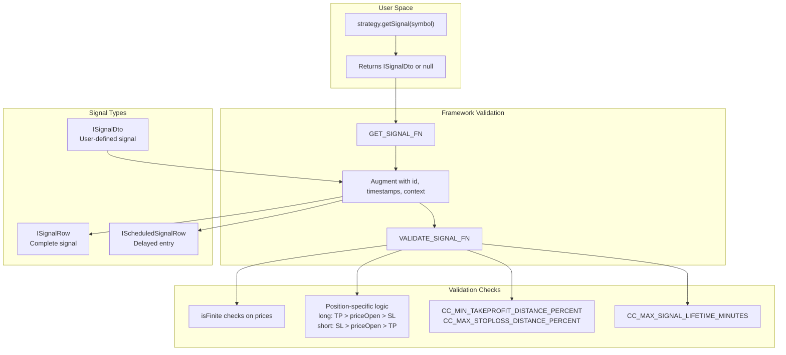

**Sources:** [types.d.ts:543-592](), [src/interfaces/Strategy.interface.ts:19-72](), [src/client/ClientStrategy.ts:187-283]()

---

## Signal Generation Process

Signal generation occurs within `ClientStrategy.tick()` via the `GET_SIGNAL_FN` wrapper ([ClientStrategy.ts:332-476]()), which coordinates throttling, risk checks, validation, and signal augmentation.

### Signal Generation Pipeline

```mermaid
sequenceDiagram
    participant Tick as "ClientStrategy.tick()"
    participant GetSignalFn as "GET_SIGNAL_FN<br/>(line 332-476)"
    participant UserCode as "strategy.getSignal(symbol, when)"
    participant Risk as "risk.checkSignal()<br/>(IRiskCheckArgs)"
    participant Validate as "VALIDATE_SIGNAL_FN<br/>(line 45-330)"
    
    Tick->>GetSignalFn: Call signal generation
    
    Note over GetSignalFn: 1. Check _isStopped flag<br/>(line 336-338)
    GetSignalFn->>GetSignalFn: if (self._isStopped) return null
    alt Strategy stopped
        GetSignalFn-->>Tick: return null
    end
    
    Note over GetSignalFn: 2. Throttling check<br/>(line 340-352)
    GetSignalFn->>GetSignalFn: currentTime = execution.context.when.getTime()
    GetSignalFn->>GetSignalFn: intervalMinutes = INTERVAL_MINUTES[interval]
    GetSignalFn->>GetSignalFn: intervalMs = intervalMinutes * 60000
    GetSignalFn->>GetSignalFn: Check: _lastSignalTimestamp + intervalMs
    alt Interval not passed
        GetSignalFn-->>Tick: return null
    end
    GetSignalFn->>GetSignalFn: _lastSignalTimestamp = currentTime
    
    Note over GetSignalFn: 3. Get current price<br/>(line 354-356)
    GetSignalFn->>GetSignalFn: currentPrice = getAveragePrice(symbol)
    
    Note over GetSignalFn: 4. Call user function with timeout<br/>(line 357-367)
    GetSignalFn->>GetSignalFn: timeout = CC_MAX_SIGNAL_GENERATION_SECONDS * 1000
    GetSignalFn->>UserCode: Promise.race([getSignal(...), sleep(timeout)])
    UserCode-->>GetSignalFn: ISignalDto or null or TIMEOUT_SYMBOL
    alt Timeout exceeded
        GetSignalFn-->>Tick: throw Error("Timeout for {strategy}")
    end
    alt No signal
        GetSignalFn-->>Tick: return null
    end
    alt Strategy stopped during generation
        GetSignalFn-->>Tick: return null
    end
    
    Note over GetSignalFn: 5. Risk check BEFORE signal creation<br/>(line 374-387)
    GetSignalFn->>Risk: checkSignal({ pendingSignal, symbol, strategyName, currentPrice, timestamp })
    Risk-->>GetSignalFn: boolean (true=allowed, false=rejected)
    alt Risk check failed
        GetSignalFn-->>Tick: return null
    end
    
    Note over GetSignalFn: 6. Determine signal type<br/>(line 389-420)
    alt priceOpen specified
        GetSignalFn->>GetSignalFn: Check if should activate immediately<br/>LONG: currentPrice <= priceOpen<br/>SHORT: currentPrice >= priceOpen
        alt Immediate activation
            GetSignalFn->>GetSignalFn: Create ISignalRow<br/>priceOpen from signal<br/>scheduledAt = pendingAt = currentTime<br/>_isScheduled = false
        else Wait for activation
            GetSignalFn->>GetSignalFn: Create IScheduledSignalRow<br/>priceOpen from signal<br/>scheduledAt = pendingAt = currentTime (temp)<br/>_isScheduled = true
        end
    else priceOpen omitted
        GetSignalFn->>GetSignalFn: Create ISignalRow<br/>priceOpen = currentPrice<br/>scheduledAt = pendingAt = currentTime<br/>_isScheduled = false
    end
    
    Note over GetSignalFn: 7. Augment with metadata<br/>(line 401-461)
    GetSignalFn->>GetSignalFn: id = randomString()
    GetSignalFn->>GetSignalFn: symbol = execution.context.symbol
    GetSignalFn->>GetSignalFn: strategyName = method.context.strategyName
    GetSignalFn->>GetSignalFn: exchangeName = method.context.exchangeName
    GetSignalFn->>GetSignalFn: note = toPlainString(signal.note)
    
    Note over Validate: 8. Validation phase<br/>(line 417, 440, 459)
    GetSignalFn->>Validate: VALIDATE_SIGNAL_FN(signal, currentPrice, isScheduled)
    Validate->>Validate: Check prices are finite (isFinite)
    Validate->>Validate: Check prices > 0
    Validate->>Validate: Validate position logic<br/>(LONG: TP > Open > SL)<br/>(SHORT: SL > Open > TP)
    Validate->>Validate: Check TP distance >= CC_MIN_TAKEPROFIT_DISTANCE_PERCENT
    Validate->>Validate: Check SL distance >= CC_MIN_STOPLOSS_DISTANCE_PERCENT
    Validate->>Validate: Check SL distance <= CC_MAX_STOPLOSS_DISTANCE_PERCENT
    Validate->>Validate: Check minuteEstimatedTime <= CC_MAX_SIGNAL_LIFETIME_MINUTES
    Validate->>Validate: Check immediate close prevention<br/>(currentPrice between SL and TP)
    alt Validation failed
        Validate-->>GetSignalFn: throw Error (caught by trycatch wrapper)
        GetSignalFn->>GetSignalFn: Log warning + emit errorEmitter
        GetSignalFn-->>Tick: return null (defaultValue)
    end
    
    GetSignalFn-->>Tick: return ISignalRow or IScheduledSignalRow
```

### Throttling Mechanism: INTERVAL_MINUTES

The framework enforces minimum time between `getSignal()` calls using the `interval` field from `IStrategySchema`:

```typescript
// INTERVAL_MINUTES constant (line 34-41)
const INTERVAL_MINUTES: Record<SignalInterval, number> = {
  "1m": 1,
  "3m": 3,
  "5m": 5,
  "15m": 15,
  "30m": 30,
  "1h": 60,
};

// Throttling logic (line 340-352)
const intervalMinutes = INTERVAL_MINUTES[self.params.interval];
const intervalMs = intervalMinutes * 60 * 1000;

if (
  self._lastSignalTimestamp !== null &&
  currentTime - self._lastSignalTimestamp < intervalMs
) {
  return null; // Too soon, skip signal generation
}

self._lastSignalTimestamp = currentTime; // Update timestamp
```

**Purpose:**
- Prevents strategy spam (generating signal every tick)
- Reduces computational overhead
- Enforces deliberate strategy design (e.g., "1h" interval = strategy runs hourly)

**Error Handling:**

The `GET_SIGNAL_FN` is wrapped with `trycatch` from `functools-kit` ([ClientStrategy.ts:332]()), which catches all exceptions and:
1. Logs warning via `loggerService.warn()`
2. Emits error via `errorEmitter.next(error)`
3. Returns `null` (defaultValue) instead of crashing

**Sources:** [src/client/ClientStrategy.ts:332-476](), [src/client/ClientStrategy.ts:34-41](), [src/client/ClientStrategy.ts:45-330](), [src/interfaces/Strategy.interface.ts:8-18]()

---

## Signal Validation Rules

The `VALIDATE_SIGNAL_FN` (defined at [ClientStrategy.ts:45-330]()) enforces critical safety checks to prevent invalid signals from entering the system. All validations throw descriptive errors with context if checks fail.

### Validation Categories and Configuration

| Validation | Check | Config Parameter | Default | Purpose |
|------------|-------|------------------|---------|---------|
| **Finite Numbers** | `isFinite(price)` | N/A | Required | Protect against `NaN`/`Infinity` from calculation errors |
| **Price Positivity** | `price > 0` | N/A | Required | All prices must be positive real numbers |
| **Position Logic (LONG)** | `TP > priceOpen > SL` | N/A | Required | Ensure valid long position price ordering |
| **Position Logic (SHORT)** | `SL > priceOpen > TP` | N/A | Required | Ensure valid short position price ordering |
| **TakeProfit Distance** | `distance >= threshold` | `CC_MIN_TAKEPROFIT_DISTANCE_PERCENT` | `0.3%` | Must cover trading fees (2×0.1% entry+exit) |
| **StopLoss Min Distance** | `distance >= threshold` | `CC_MIN_STOPLOSS_DISTANCE_PERCENT` | `0.1%` | Prevent instant stop-out from volatility |
| **StopLoss Max Distance** | `distance <= threshold` | `CC_MAX_STOPLOSS_DISTANCE_PERCENT` | `20%` | Prevent catastrophic losses |
| **Signal Lifetime** | `minutes <= max` | `CC_MAX_SIGNAL_LIFETIME_MINUTES` | `1440` (1 day) | Prevent eternal signals blocking risk limits |
| **Immediate Close Check** | Complex logic | N/A | Required | Prevent signals that close instantly |

### Validation Logic: Position Price Ordering

**LONG Position (Buy Low, Sell High):**
```typescript
// VALIDATE_SIGNAL_FN line 112-200
if (signal.position === "long") {
  // Price ordering validation
  if (signal.priceTakeProfit <= signal.priceOpen) {
    throw new Error(
      `Long: priceTakeProfit (${signal.priceTakeProfit}) must be > priceOpen (${signal.priceOpen})`
    );
  }
  if (signal.priceStopLoss >= signal.priceOpen) {
    throw new Error(
      `Long: priceStopLoss (${signal.priceStopLoss}) must be < priceOpen (${signal.priceOpen})`
    );
  }
  
  // TakeProfit distance check (covers fees)
  if (GLOBAL_CONFIG.CC_MIN_TAKEPROFIT_DISTANCE_PERCENT) {
    const tpDistancePercent = ((signal.priceTakeProfit - signal.priceOpen) / signal.priceOpen) * 100;
    if (tpDistancePercent < GLOBAL_CONFIG.CC_MIN_TAKEPROFIT_DISTANCE_PERCENT) {
      throw new Error(
        `Long: TakeProfit too close to priceOpen (${tpDistancePercent.toFixed(3)}%). ` +
        `Minimum distance: ${GLOBAL_CONFIG.CC_MIN_TAKEPROFIT_DISTANCE_PERCENT}% to cover trading fees.`
      );
    }
  }
  
  // StopLoss distance checks (prevent instant stop-out and catastrophic losses)
  if (GLOBAL_CONFIG.CC_MIN_STOPLOSS_DISTANCE_PERCENT) {
    const slDistancePercent = ((signal.priceOpen - signal.priceStopLoss) / signal.priceOpen) * 100;
    if (slDistancePercent < GLOBAL_CONFIG.CC_MIN_STOPLOSS_DISTANCE_PERCENT) {
      throw new Error(
        `Long: StopLoss too close to priceOpen (${slDistancePercent.toFixed(3)}%). ` +
        `Minimum distance: ${GLOBAL_CONFIG.CC_MIN_STOPLOSS_DISTANCE_PERCENT}% to avoid instant stop out.`
      );
    }
  }
  
  if (GLOBAL_CONFIG.CC_MAX_STOPLOSS_DISTANCE_PERCENT) {
    const slDistancePercent = ((signal.priceOpen - signal.priceStopLoss) / signal.priceOpen) * 100;
    if (slDistancePercent > GLOBAL_CONFIG.CC_MAX_STOPLOSS_DISTANCE_PERCENT) {
      throw new Error(
        `Long: StopLoss too far from priceOpen (${slDistancePercent.toFixed(3)}%). ` +
        `Maximum distance: ${GLOBAL_CONFIG.CC_MAX_STOPLOSS_DISTANCE_PERCENT}% to protect capital.`
      );
    }
  }
}
```

**SHORT Position (Sell High, Buy Low):**
```typescript
// VALIDATE_SIGNAL_FN line 202-291
if (signal.position === "short") {
  // Price ordering validation (opposite of long)
  if (signal.priceTakeProfit >= signal.priceOpen) {
    throw new Error(
      `Short: priceTakeProfit (${signal.priceTakeProfit}) must be < priceOpen (${signal.priceOpen})`
    );
  }
  if (signal.priceStopLoss <= signal.priceOpen) {
    throw new Error(
      `Short: priceStopLoss (${signal.priceStopLoss}) must be > priceOpen (${signal.priceOpen})`
    );
  }
  
  // Similar distance checks as LONG, but reversed direction
  // ...
}
```

### Critical Validation: Prevent Immediate Close

The framework prevents signals that would close instantly by checking if current price already exceeds TP/SL boundaries:

```typescript
// VALIDATE_SIGNAL_FN line 125-160 (LONG immediate check)
if (!isScheduled && isFinite(currentPrice)) {
  // LONG: currentPrice must be BETWEEN SL and TP
  // SL < currentPrice < TP
  if (currentPrice <= signal.priceStopLoss) {
    throw new Error(
      `Long immediate: currentPrice (${currentPrice}) <= priceStopLoss (${signal.priceStopLoss}). ` +
      `Signal would be immediately closed by stop loss. Cannot open position that is already stopped out.`
    );
  }
  
  if (currentPrice >= signal.priceTakeProfit) {
    throw new Error(
      `Long immediate: currentPrice (${currentPrice}) >= priceTakeProfit (${signal.priceTakeProfit}). ` +
      `Signal would be immediately closed by take profit. The profit opportunity has already passed.`
    );
  }
}
```

**Why This Matters:**
- Prevents opening positions that close on the same tick
- Avoids wasting trading fees (0.2%) on instant-close trades
- Improves strategy statistics accuracy
- Catches logic errors in user's `getSignal()` implementation

**Example of Caught Error:**
```
getSignal returns:
  position: "long"
  priceOpen: 100000 (current market price)
  priceTakeProfit: 99000 (below current price!)
  priceStopLoss: 98000

VALIDATE_SIGNAL_FN throws:
  "Long immediate: currentPrice (100000) >= priceTakeProfit (99000).
   Signal would be immediately closed by take profit.
   The profit opportunity has already passed."
```

**Sources:** [src/client/ClientStrategy.ts:45-330](), [src/config/params.ts:1-50](), [test/spec/validation.test.mjs:1-500]()

---

## State Transition: Idle to Opened/Scheduled

When no active signal exists, `ClientStrategy.tick()` attempts to generate a new signal. The flow differs based on whether `priceOpen` is specified.

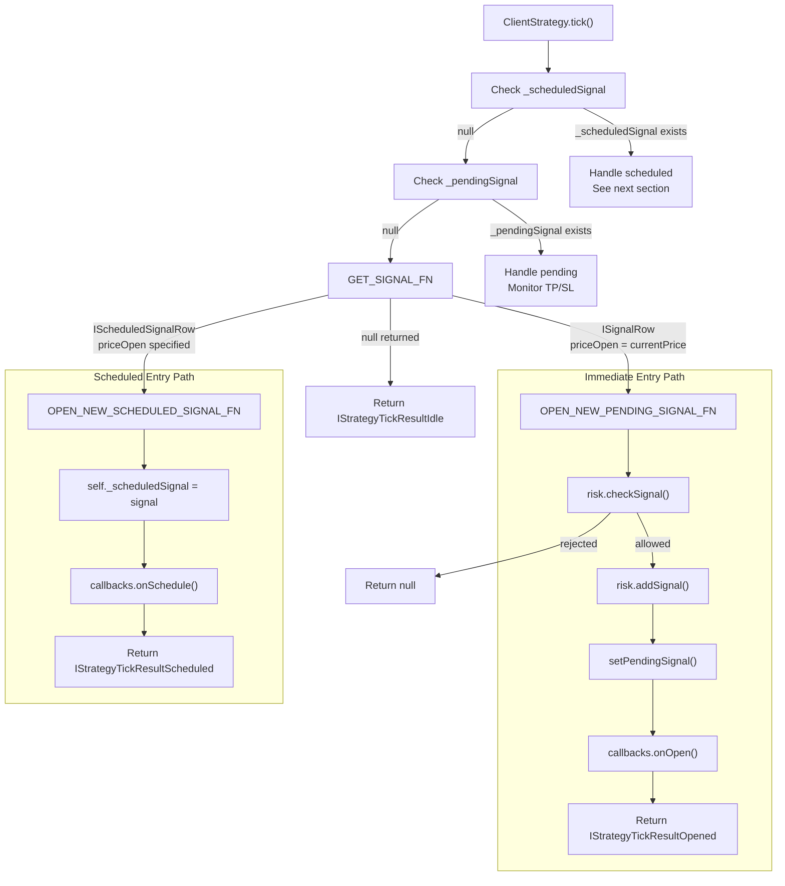

**Key Difference:** Immediate signals undergo risk check and call `risk.addSignal()` immediately. Scheduled signals defer risk check until price activation.

**Sources:** [src/client/ClientStrategy.ts:578-621](), [src/client/ClientStrategy.ts:623-673]()

---

## Scheduled Signal Lifecycle

Scheduled signals (`IScheduledSignalRow`) represent delayed entry positions that wait for price to reach `priceOpen`. They are stored in `ClientStrategy._scheduledSignal` and undergo special activation/cancellation logic before becoming active positions.

### Scheduled Signal Monitoring Flow

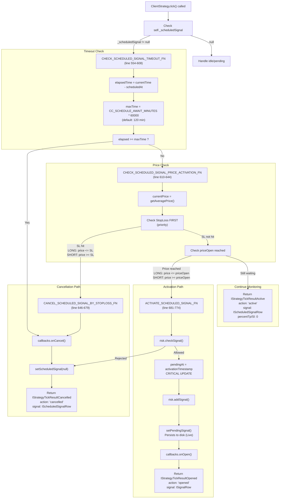

### Activation Priority: StopLoss Before Entry

The framework checks StopLoss **before** checking entry activation to prevent opening positions that would immediately lose:

```typescript
// CHECK_SCHEDULED_SIGNAL_PRICE_ACTIVATION_FN (line 610-644)
const CHECK_SCHEDULED_SIGNAL_PRICE_ACTIVATION_FN = (
  scheduled: IScheduledSignalRow,
  currentPrice: number
): { shouldActivate: boolean; shouldCancel: boolean } => {
  let shouldActivate = false;
  let shouldCancel = false;

  if (scheduled.position === "long") {
    // CRITICAL: Check StopLoss FIRST (cancellation priority)
    if (currentPrice <= scheduled.priceStopLoss) {
      shouldCancel = true;  // Price fell too low - cancel signal
    }
    // Only activate if SL not hit
    else if (currentPrice <= scheduled.priceOpen) {
      shouldActivate = true;  // Price reached entry - activate
    }
  }

  if (scheduled.position === "short") {
    // CRITICAL: Check StopLoss FIRST (cancellation priority)
    if (currentPrice >= scheduled.priceStopLoss) {
      shouldCancel = true;  // Price rose too high - cancel signal
    }
    // Only activate if SL not hit
    else if (currentPrice >= scheduled.priceOpen) {
      shouldActivate = true;  // Price reached entry - activate
    }
  }

  return { shouldActivate, shouldCancel };
};
```

**Why This Priority Matters:**
- Prevents opening positions that would instantly hit StopLoss
- Saves trading fees (0.2% per trade)
- Avoids artificially inflating loss statistics

**Example Scenario (LONG position):**
```
priceOpen = 99500
priceStopLoss = 98500
priceTakeProfit = 100500

Candle: low=98000, high=100000

Without priority check:
  1. Price touches priceOpen (99500) - activate signal
  2. Same candle touches priceStopLoss (98500) - instant loss
  3. Result: -1% loss + 0.2% fees = -1.2% total loss

With priority check:
  1. Price touches priceStopLoss first (98000 < 98500) - cancel signal
  2. Never opens position
  3. Result: No loss, no fees wasted
```

**Sources:** [src/client/ClientStrategy.ts:554-679](), [src/client/ClientStrategy.ts:681-774](), [src/client/ClientStrategy.ts:610-644](), [test/e2e/scheduled.test.mjs:17-219](), [test/e2e/timing.test.mjs:521-643]()

### Activation vs Cancellation Priority

The framework prioritizes StopLoss cancellation over activation to prevent opening positions that would immediately lose:

```typescript
// CHECK_SCHEDULED_SIGNAL_PRICE_ACTIVATION_FN logic
if (scheduled.position === "long") {
  // Check StopLoss FIRST (cancellation priority)
  if (currentPrice <= scheduled.priceStopLoss) {
    shouldCancel = true;
  }
  // Only activate if NOT cancelled
  else if (currentPrice <= scheduled.priceOpen) {
    shouldActivate = true;
  }
}
```

**Sources:** [src/client/ClientStrategy.ts:388-422]()

---

## State Transition: Active to Closed

Once a signal is opened (stored in `_pendingSignal`), it enters active monitoring. The framework checks for TP/SL conditions and time expiration on each tick.

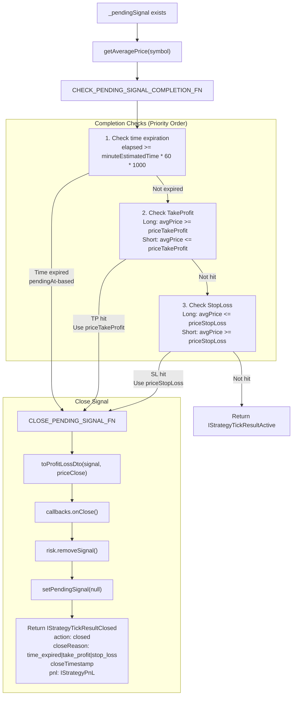

**Critical Detail:** Time expiration uses `pendingAt` timestamp, not `scheduledAt`. For scheduled signals, this ensures `minuteEstimatedTime` counts from activation, not from creation.

**Sources:** [src/client/ClientStrategy.ts:675-734](), [src/client/ClientStrategy.ts:736-789]()

---

## Timestamp Management: scheduledAt vs pendingAt

Signals maintain two critical timestamps that enable proper lifecycle tracking. The distinction is essential for accurate `minuteEstimatedTime` calculations, especially for scheduled signals.

### Timestamp Semantics

| Field | Type | Semantic Meaning | Set Location | Purpose |
|-------|------|------------------|--------------|---------|
| `scheduledAt` | `number` | Signal creation time (when `getSignal()` returned signal) | [ClientStrategy.ts:445-453]() for immediate<br/>[ClientStrategy.ts:423-437]() for scheduled | Tracks signal age<br/>Timeout calc for scheduled signals via `CHECK_SCHEDULED_SIGNAL_TIMEOUT_FN` |
| `pendingAt` | `number` | Position activation time (when position became active at `priceOpen`) | Immediate: same as `scheduledAt`<br/>Scheduled: updated in `ACTIVATE_SCHEDULED_SIGNAL_FN` | Duration calculation: `minuteEstimatedTime` countdown<br/>TP/SL/time_expired monitoring |

### Critical Difference: Immediate vs Scheduled Signals

**Immediate Signal (no `priceOpen` specified):**
```typescript
// GET_SIGNAL_FN creates ISignalRow at line 445-461
const signalRow: ISignalRow = {
  id: randomString(),
  priceOpen: currentPrice, // Set to current market price
  // ...
  scheduledAt: currentTime,
  pendingAt: currentTime,   // SAME as scheduledAt - position active immediately
  _isScheduled: false,
};
```

**Scheduled Signal (with `priceOpen` specified):**
```typescript
// GET_SIGNAL_FN creates IScheduledSignalRow at line 423-442
const scheduledSignalRow: IScheduledSignalRow = {
  id: randomString(),
  priceOpen: signal.priceOpen, // User-specified entry price
  // ...
  scheduledAt: currentTime,
  pendingAt: currentTime,        // TEMPORARY - will be updated on activation
  _isScheduled: true,
};

// Later, when price reaches priceOpen...
// ACTIVATE_SCHEDULED_SIGNAL_FN at line 734-738
const activatedSignal: ISignalRow = {
  ...scheduled,
  pendingAt: activationTime,     // CRITICAL: Updated to actual activation time
  _isScheduled: false,
};
```

### Timestamp Flow: Immediate Entry Signal

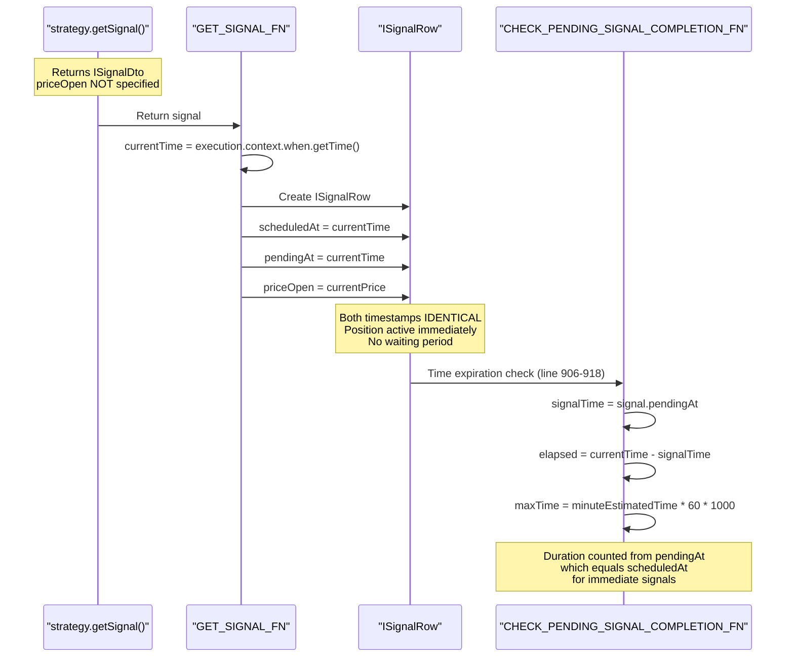

### Timestamp Flow: Scheduled Entry Signal

```mermaid
sequenceDiagram
    participant User as "strategy.getSignal()"
    participant GetSignal as "GET_SIGNAL_FN"
    participant Scheduled as "_scheduledSignal"
    participant CheckPrice as "CHECK_SCHEDULED_SIGNAL_PRICE_ACTIVATION_FN"
    participant Activate as "ACTIVATE_SCHEDULED_SIGNAL_FN"
    participant Active as "_pendingSignal"
    participant Monitor as "CHECK_PENDING_SIGNAL_COMPLETION_FN"
    
    Note over User: Returns ISignalDto<br/>priceOpen = 99500
    
    User->>GetSignal: Return signal
    GetSignal->>GetSignal: T1 = execution.context.when.getTime()
    GetSignal->>Scheduled: Create IScheduledSignalRow
    GetSignal->>Scheduled: scheduledAt = T1
    GetSignal->>Scheduled: pendingAt = T1 (TEMPORARY)
    
    Note over Scheduled: WAITING STATE<br/>pendingAt will be updated<br/>on activation
    
    Note over Scheduled,CheckPrice: Time passes...<br/>Price moves toward priceOpen
    
    Scheduled->>CheckPrice: Check every tick (line 610-644)
    CheckPrice->>CheckPrice: currentPrice <= priceOpen (LONG)<br/>OR currentPrice >= priceOpen (SHORT)
    CheckPrice-->>Activate: shouldActivate = true
    
    Activate->>Activate: T2 = activationTimestamp
    Note over Activate: CRITICAL UPDATE<br/>at line 734-738
    Activate->>Active: pendingAt = T2
    Activate->>Active: scheduledAt remains T1
    
    Note over Active: NOW ACTIVE<br/>pendingAt reflects actual activation<br/>Duration counts from T2, not T1
    
    Active->>Monitor: Time expiration check (line 906-918)
    Monitor->>Monitor: signalTime = signal.pendingAt (T2)
    Monitor->>Monitor: elapsed = currentTime - T2
    Monitor->>Monitor: maxTime = minuteEstimatedTime * 60 * 1000
    
    Note over Monitor: Duration counted from pendingAt (T2)<br/>NOT from scheduledAt (T1)<br/>Ensures accurate time tracking
```

### Why This Matters: Financial Impact

**Problem Without Correct Timestamp Handling:**
```typescript
// BUG SCENARIO (if using scheduledAt for duration):
// Signal created at T1 = 10:00:00
// Signal activated at T2 = 10:30:00 (30 minutes later)
// minuteEstimatedTime = 60 minutes

// WRONG: Using scheduledAt
elapsed = currentTime - scheduledAt
// At 11:00:00, elapsed = 60 minutes, signal expires
// But it was only ACTIVE for 30 minutes!

// CORRECT: Using pendingAt
elapsed = currentTime - pendingAt
// At 11:00:00, elapsed = 30 minutes, signal continues
// At 11:30:00, elapsed = 60 minutes, signal expires correctly
```

**Consequences of bug:**
- Premature signal closure causes financial losses (wasted trading fees: ~0.2% per trade)
- Strategy appears to perform worse than actual backtests
- Risk management becomes inaccurate (positions close before expected)

**Sources:** [src/client/ClientStrategy.ts:445-461](), [src/client/ClientStrategy.ts:423-442](), [src/client/ClientStrategy.ts:734-738](), [src/client/ClientStrategy.ts:906-918](), [test/e2e/timing.test.mjs:34-201]()

---

## Signal Persistence (Live Mode Only)

In live trading mode, signals are persisted to disk after every state change to enable crash recovery. The `PersistSignalAdapter` provides atomic file operations.

### Persistence Architecture

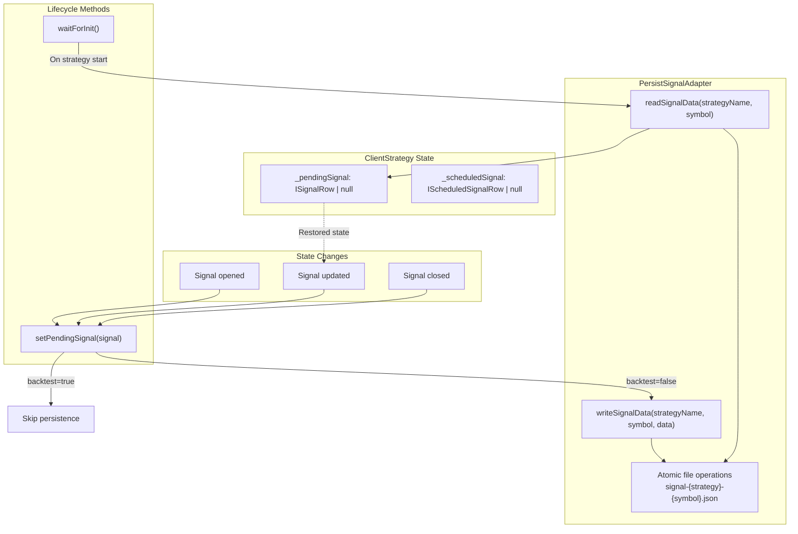

### Persistence Flow Example

```typescript
// setPendingSignal implementation
async setPendingSignal(signal: ISignalRow | null) {
  this._pendingSignal = signal;
  
  // Persist only in live mode (not backtest)
  if (!this.params.execution.context.backtest) {
    await PersistSignalAdaper.writeSignalData(
      this.params.strategyName,
      this.params.execution.context.symbol,
      signal
    );
  }
}

// waitForInit implementation
async waitForInit() {
  if (this.params.execution.context.backtest) {
    return; // No persistence in backtest
  }
  
  const pendingSignal = await PersistSignalAdaper.readSignalData(
    this.params.strategyName,
    this.params.execution.context.symbol
  );
  
  if (pendingSignal) {
    this._pendingSignal = pendingSignal;
    
    // Call onActive callback for restored signal
    if (this.params.callbacks?.onActive) {
      const currentPrice = await this.params.exchange.getAveragePrice(
        this.params.execution.context.symbol
      );
      this.params.callbacks.onActive(
        this.params.execution.context.symbol,
        pendingSignal,
        currentPrice,
        false // backtest=false
      );
    }
  }
}
```

**Note:** Scheduled signals (`_scheduledSignal`) are NOT persisted. Only active positions (`_pendingSignal`) survive crashes.

**Sources:** [src/client/ClientStrategy.ts:1068-1081](), [src/client/ClientStrategy.ts:298-330](), [src/classes/Persist.ts:1-300]()

---

## PnL Calculation

Profit and loss is calculated by `toProfitLossDto` which applies trading fees and slippage to both entry and exit prices.

### Fee and Slippage Model

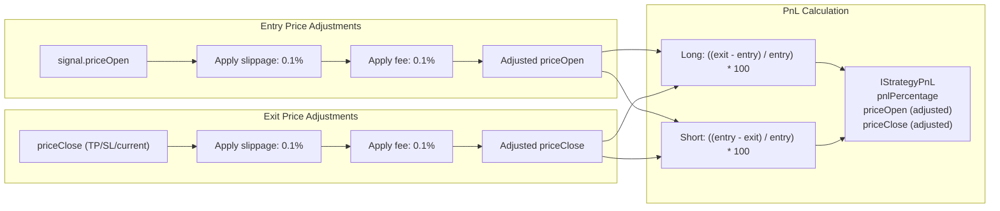

### Long Position Example

```typescript
// Original signal
priceOpen = 100
priceTakeProfit = 101

// TP hit, calculate PnL
priceClose = 101

// Apply fees/slippage to entry
entryPrice = 100 * (1 + 0.001) * (1 + 0.001) = 100.2001

// Apply fees/slippage to exit
exitPrice = 101 * (1 - 0.001) * (1 - 0.001) = 100.797999

// Calculate PnL
pnlPercentage = ((100.797999 - 100.2001) / 100.2001) * 100 = 0.597%
```

### Short Position Example

```typescript
// Original signal
priceOpen = 100
priceTakeProfit = 99

// TP hit, calculate PnL
priceClose = 99

// Apply fees/slippage to entry (worse price for short = lower)
entryPrice = 100 * (1 - 0.001) * (1 - 0.001) = 99.7999

// Apply fees/slippage to exit (worse price for short = higher)
exitPrice = 99 * (1 + 0.001) * (1 + 0.001) = 99.198001

// Calculate PnL
pnlPercentage = ((99.7999 - 99.198001) / 99.7999) * 100 = 0.603%
```

**Note:** The `CC_MIN_TAKEPROFIT_DISTANCE_PERCENT` default of 0.3% accounts for the 0.2% total fees (entry + exit), ensuring profitable trades after costs.

**Sources:** [src/helpers/toProfitLossDto.ts:1-50](), [types.d.ts:16-20]()

---

## Backtest vs Live Lifecycle Differences

The signal lifecycle behaves differently in backtest and live modes due to timing and data availability constraints.

| Aspect | Backtest Mode | Live Mode |
|--------|---------------|-----------|
| **Time Source** | Historical candle timestamps | `Date.now()` |
| **Signal Generation** | Once per candle timestamp | Throttled by real time + `INTERVAL_MINUTES` |
| **TP/SL Detection** | Check `candle.high` and `candle.low` | Check VWAP from `getAveragePrice()` |
| **Fast-Forward** | `strategy.backtest(candles)` processes all at once | `strategy.tick()` processes one tick at a time |
| **Scheduled Activation Timestamp** | `candle.timestamp + 60*1000` (next candle) | Actual tick time when detected |
| **Persistence** | None | `PersistSignalAdapter` writes to disk |
| **Crash Recovery** | N/A | `waitForInit()` restores state |
| **Callbacks** | `backtest=true` flag | `backtest=false` flag |

### Backtest Fast-Forward Algorithm

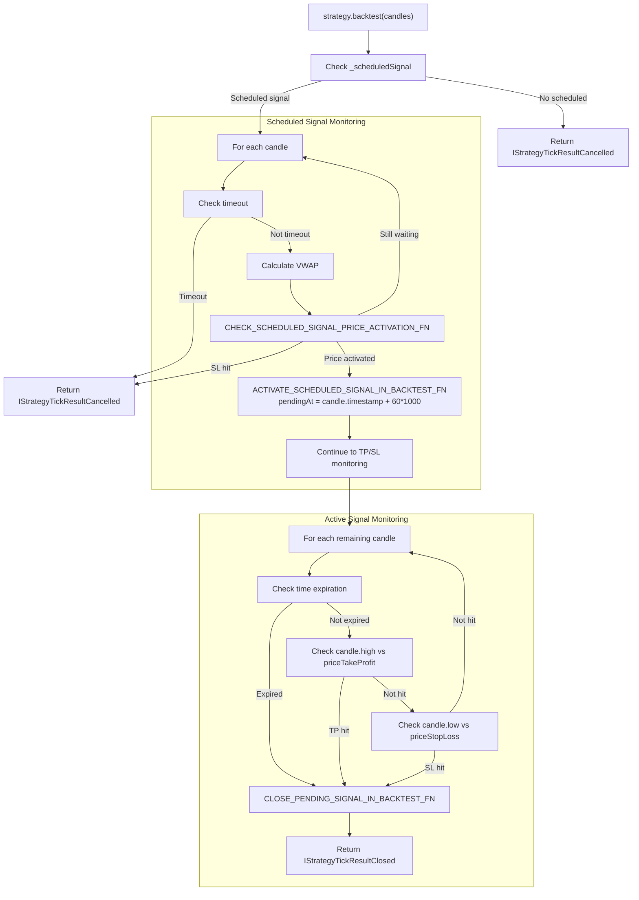

**Key Optimization:** The backtest method processes all candles in a single pass without yielding control, making it significantly faster than tick-by-tick iteration.

**Sources:** [src/client/ClientStrategy.ts:1008-1177](), [src/client/ClientStrategy.ts:897-973](), [src/client/ClientStrategy.ts:975-1006]()

---

## Event Emission During Lifecycle

Every state transition emits events through Subject-based emitters, enabling observability and report generation.

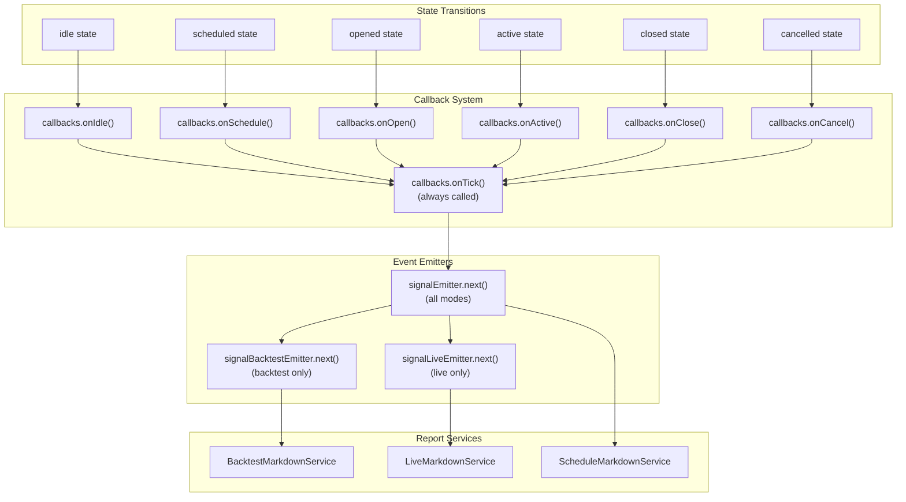

**Event Flow:** Each state transition calls the specific lifecycle callback (e.g., `onOpen`), then always calls `onTick` with the full result. The result is then emitted to all registered listeners via the Subject pattern.

**Sources:** [src/config/emitters.ts:1-100](), [src/lib/services/connection/StrategyConnectionService.ts:104-121](), [types.d.ts:595-611]()

---

## Summary Table: Signal Lifecycle Functions

| Function | Location | Purpose | Returns |
|----------|----------|---------|---------|
| `GET_SIGNAL_FN` | [ClientStrategy.ts:187-283]() | Throttled signal generation with risk check | `ISignalRow \| IScheduledSignalRow \| null` |
| `VALIDATE_SIGNAL_FN` | [ClientStrategy.ts:40-185]() | Validate prices, TP/SL logic, distances, lifetime | `void` (throws on error) |
| `CHECK_SCHEDULED_SIGNAL_TIMEOUT_FN` | [ClientStrategy.ts:332-386]() | Check if scheduled signal timed out | `IStrategyTickResultCancelled \| null` |
| `CHECK_SCHEDULED_SIGNAL_PRICE_ACTIVATION_FN` | [ClientStrategy.ts:388-422]() | Determine if scheduled signal should activate/cancel | `{ shouldActivate, shouldCancel }` |
| `ACTIVATE_SCHEDULED_SIGNAL_FN` | [ClientStrategy.ts:459-551]() | Convert scheduled to active signal (live) | `IStrategyTickResultOpened \| null` |
| `ACTIVATE_SCHEDULED_SIGNAL_IN_BACKTEST_FN` | [ClientStrategy.ts:897-973]() | Convert scheduled to active signal (backtest) | `boolean` |
| `OPEN_NEW_PENDING_SIGNAL_FN` | [ClientStrategy.ts:623-673]() | Create immediate entry signal | `IStrategyTickResultOpened \| null` |
| `OPEN_NEW_SCHEDULED_SIGNAL_FN` | [ClientStrategy.ts:578-621]() | Create delayed entry signal | `IStrategyTickResultScheduled` |
| `CHECK_PENDING_SIGNAL_COMPLETION_FN` | [ClientStrategy.ts:675-734]() | Check TP/SL/time conditions | `IStrategyTickResultClosed \| null` |
| `CLOSE_PENDING_SIGNAL_FN` | [ClientStrategy.ts:736-789]() | Close signal and calculate PnL (live) | `IStrategyTickResultClosed` |
| `CLOSE_PENDING_SIGNAL_IN_BACKTEST_FN` | [ClientStrategy.ts:975-1006]() | Close signal and calculate PnL (backtest) | `IStrategyTickResultClosed` |
| `toProfitLossDto` | [toProfitLossDto.ts:1-50]() | Calculate PnL with fees/slippage | `IStrategyPnL` |

**Sources:** [src/client/ClientStrategy.ts:1-1300](), [src/helpers/toProfitLossDto.ts:1-50]()