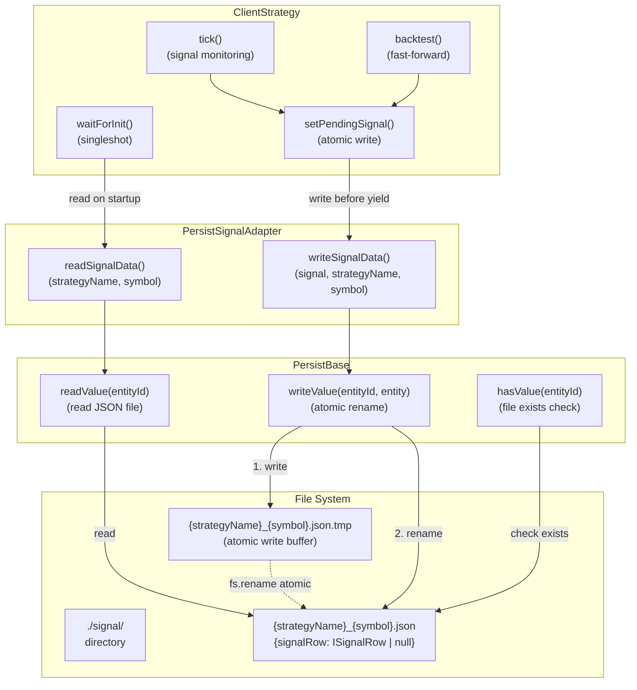
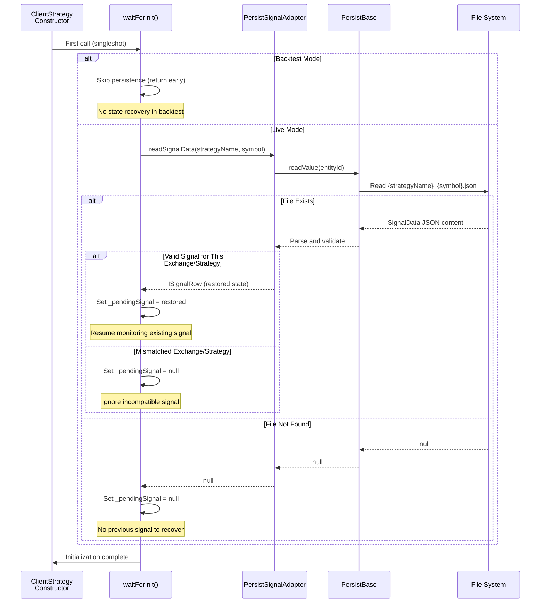
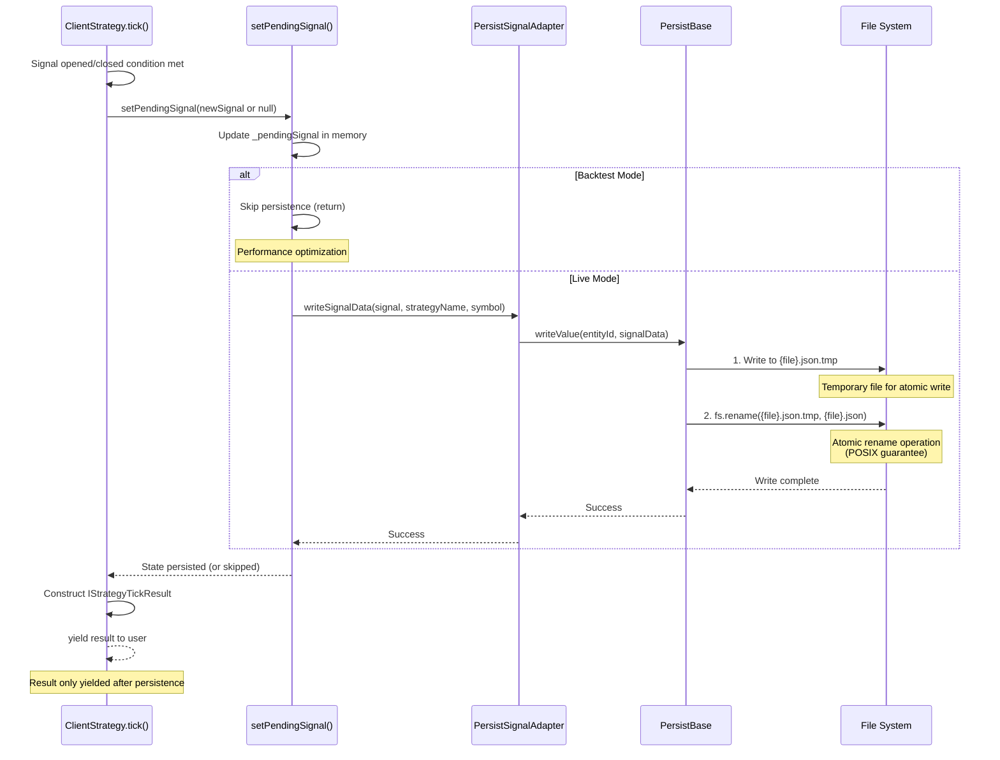
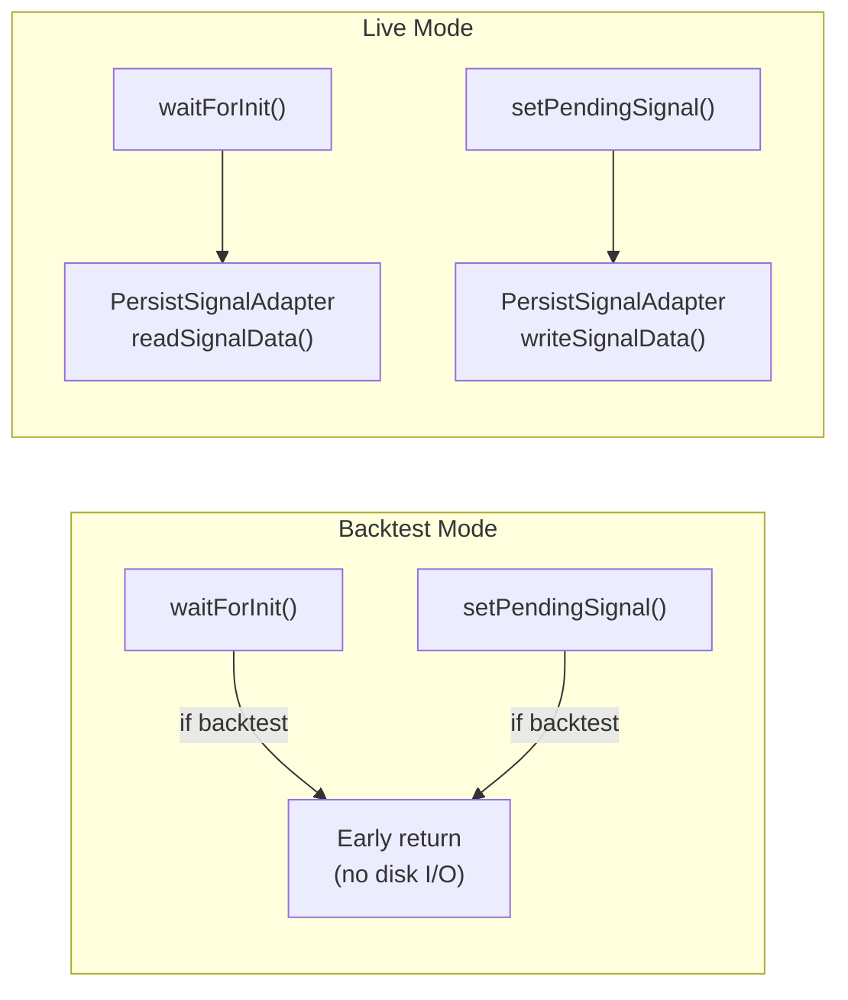
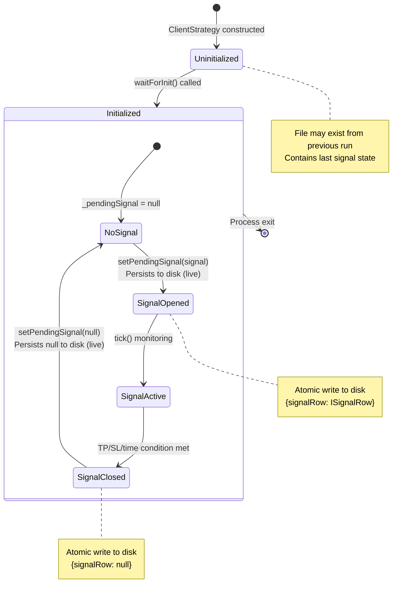
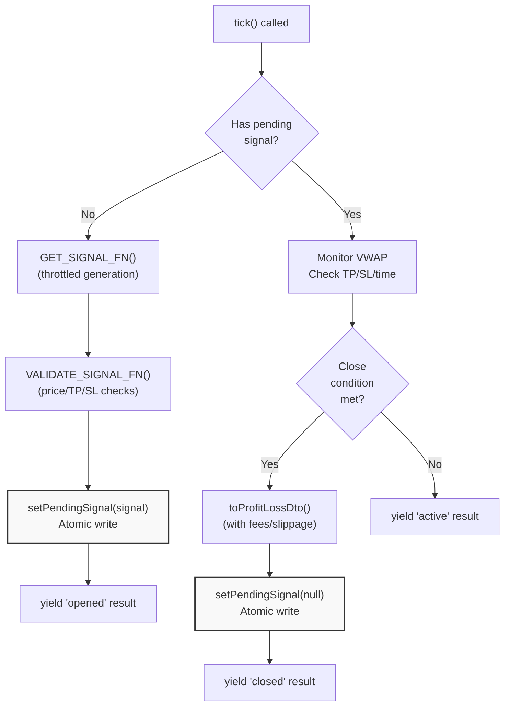

# Signal Persistence

<details>
<summary>Relevant source files</summary>

The following files were used as context for generating this wiki page:

- [README.md](README.md)
- [src/classes/Persist.ts](src/classes/Persist.ts)
- [src/classes/Schedule.ts](src/classes/Schedule.ts)
- [src/client/ClientStrategy.ts](src/client/ClientStrategy.ts)
- [src/config/params.ts](src/config/params.ts)
- [src/interfaces/Strategy.interface.ts](src/interfaces/Strategy.interface.ts)
- [src/lib/services/connection/StrategyConnectionService.ts](src/lib/services/connection/StrategyConnectionService.ts)
- [src/lib/services/global/WalkerGlobalService.ts](src/lib/services/global/WalkerGlobalService.ts)
- [src/lib/services/markdown/BacktestMarkdownService.ts](src/lib/services/markdown/BacktestMarkdownService.ts)
- [src/lib/services/markdown/LiveMarkdownService.ts](src/lib/services/markdown/LiveMarkdownService.ts)
- [src/lib/services/markdown/ScheduleMarkdownService.ts](src/lib/services/markdown/ScheduleMarkdownService.ts)
- [src/utils/writeFileAtomic.ts](src/utils/writeFileAtomic.ts)
- [test/config/setup.mjs](test/config/setup.mjs)
- [test/e2e/defend.test.mjs](test/e2e/defend.test.mjs)
- [test/e2e/sanitize.test.mjs](test/e2e/sanitize.test.mjs)
- [test/spec/scheduled.test.mjs](test/spec/scheduled.test.mjs)

</details>


Signal persistence ensures crash-safe operation during live trading by atomically writing signal state to disk before yielding results. This prevents duplicate signals and enables seamless recovery after process restarts. In backtest mode, persistence is disabled for performance.

For information about signal states and transitions, see [Signal States](#6.1). For custom storage backends (Redis, PostgreSQL), see [Custom Persistence Backends](#11.2).

## Overview

The persistence system provides durability guarantees for active trading signals through atomic file operations. When a signal is opened or closed, the state change is written to disk before the result is returned to the user. On restart, `ClientStrategy` loads the last known signal state and resumes monitoring without generating duplicate signals.

**Key Components:**

| Component | Purpose | Location |
|-----------|---------|----------|
| `PersistSignalAdapter` | Static adapter for signal CRUD operations | [src/classes/Persist.ts:31-168]() |
| `ClientStrategy.waitForInit()` | Loads persisted state on startup | [src/client/ClientStrategy.ts:209-209]() |
| `ClientStrategy.setPendingSignal()` | Writes signal state atomically | [src/client/ClientStrategy.ts:220-233]() |
| `PersistBase<ISignalData>` | Base class for file-based persistence | [src/classes/Persist.ts:15-29]() |

**Sources:** [src/client/ClientStrategy.ts:146-165](), [src/classes/Persist.ts:31-168](), [types.d.ts:895-910]()

## Persistence Architecture



**Sources:** [src/client/ClientStrategy.ts:146-233](), [src/classes/Persist.ts:31-168]()

The architecture uses a three-layer approach:

1. **ClientStrategy** - Business logic layer that coordinates persistence calls
2. **PersistSignalAdapter** - Domain-specific adapter that converts between `ISignalRow` and `ISignalData`
3. **PersistBase** - Generic file-based persistence with atomic write guarantees

## Signal State Recovery

On initialization, `ClientStrategy.waitForInit()` attempts to load the last persisted signal state. This occurs once per strategy instance using the `singleshot` pattern from `functools-kit`.



**Sources:** [src/client/ClientStrategy.ts:146-165](), [src/classes/Persist.ts:91-168]()

The recovery process validates that the persisted signal matches the current execution context:

```typescript
// Validation checks in WAIT_FOR_INIT_FN
if (pendingSignal.exchangeName !== self.params.method.context.exchangeName) {
  return; // Different exchange, ignore
}
if (pendingSignal.strategyName !== self.params.method.context.strategyName) {
  return; // Different strategy, ignore
}
```

**Sources:** [src/client/ClientStrategy.ts:158-163]()

## Atomic Write Operations

Every signal state change is persisted atomically through `ClientStrategy.setPendingSignal()`. The method writes to disk **before** the result is yielded to the user, ensuring durability.



**Sources:** [src/client/ClientStrategy.ts:220-233](), [src/classes/Persist.ts:66-89]()

The atomic write pattern ensures crash safety:

1. **Write to temporary file** - New state written to `{filename}.json.tmp`
2. **Atomic rename** - `fs.rename()` atomically replaces old file with new file
3. **No intermediate state** - File is either old state or new state, never corrupted

This pattern is implemented in `PersistBase.writeValue()`:

**Sources:** [src/classes/Persist.ts:66-89]()

## File System Structure

Signals are stored in a flat directory structure under `./signal/` in the working directory. Each signal is identified by `{strategyName}_{symbol}` and stored as a JSON file.

**Directory Layout:**

```
./signal/
├── strategy1_BTCUSDT.json      # Active signal for strategy1 on BTCUSDT
├── strategy1_ETHUSDT.json      # Active signal for strategy1 on ETHUSDT
├── strategy2_BTCUSDT.json      # Active signal for strategy2 on BTCUSDT
└── strategy3_SOLUSDT.json.tmp  # Temporary file during atomic write
```

**File Content Example:**

```json
{
  "signalRow": {
    "id": "abc123-def456-ghi789",
    "position": "long",
    "priceOpen": 50000.0,
    "priceTakeProfit": 51000.0,
    "priceStopLoss": 49000.0,
    "minuteEstimatedTime": 60,
    "timestamp": 1704067200000,
    "symbol": "BTCUSDT",
    "exchangeName": "binance",
    "strategyName": "momentum-strategy",
    "note": "Bullish momentum detected"
  }
}
```

When a signal is closed, the file contains:

```json
{
  "signalRow": null
}
```

**Sources:** [src/classes/Persist.ts:31-168](), [types.d.ts:895-910]()

## Entity ID Generation

The `PersistSignalAdapter` generates entity IDs by combining strategy name and symbol:

```typescript
const entityId = `${strategyName}_${symbol}`;
```

This creates a unique identifier for each strategy-symbol pair. Multiple strategies can run on the same symbol without conflicts, and the same strategy can run on multiple symbols independently.

**Entity ID Examples:**

| Strategy Name | Symbol | Entity ID | File Path |
|---------------|--------|-----------|-----------|
| `momentum-5m` | `BTCUSDT` | `momentum-5m_BTCUSDT` | `./signal/momentum-5m_BTCUSDT.json` |
| `mean-reversion` | `ETHUSDT` | `mean-reversion_ETHUSDT` | `./signal/mean-reversion_ETHUSDT.json` |
| `momentum-5m` | `ETHUSDT` | `momentum-5m_ETHUSDT` | `./signal/momentum-5m_ETHUSDT.json` |

**Sources:** [src/classes/Persist.ts:91-168]()

## Backtest vs Live Mode

Persistence behavior differs significantly between execution modes:



**Sources:** [src/client/ClientStrategy.ts:146-233]()

**Comparison Table:**

| Operation | Backtest Mode | Live Mode |
|-----------|---------------|-----------|
| `waitForInit()` | Returns immediately (no read) | Reads from `./signal/{entityId}.json` |
| `setPendingSignal()` | Updates in-memory state only | Writes to disk atomically before return |
| Crash Recovery | Not applicable (single-process simulation) | Full state recovery on restart |
| Performance | Maximum (no I/O overhead) | Slight latency from disk writes (~1-5ms) |
| Durability | None (in-memory only) | Full durability (survives crashes) |

The mode is determined by `params.execution.context.backtest`:

```typescript
if (this.params.execution.context.backtest) {
  return; // Skip persistence
}
```

**Sources:** [src/client/ClientStrategy.ts:148-149](), [src/client/ClientStrategy.ts:225-227]()

## Persistence Lifecycle



**Sources:** [src/client/ClientStrategy.ts:146-233](), [src/client/ClientStrategy.ts:258-464]()

## Error Handling

Persistence operations are wrapped in `trycatch` patterns to handle file system errors gracefully:

**Read Errors:**
- File not found → Returns `null` (no previous signal)
- Invalid JSON → Logs warning, returns `null`
- Permission denied → Throws error (fatal)

**Write Errors:**
- Directory not exists → Creates directory automatically
- Disk full → Throws error (fatal)
- Permission denied → Throws error (fatal)

All fatal errors are logged and propagated to the caller, preventing the strategy from yielding results with unconfirmed persistence.

**Sources:** [src/classes/Persist.ts:15-89]()

## Custom Persistence Backends

The framework supports custom persistence implementations through the `usePersistSignalAdapter()` function. This allows replacing file-based storage with databases or distributed systems.

**Example: Redis-backed persistence**

```typescript
import { usePersistSignalAdapter } from "backtest-kit";

class RedisPersistAdapter {
  async readSignalData(strategyName, symbol) {
    const key = `signal:${strategyName}:${symbol}`;
    const data = await redis.get(key);
    return data ? JSON.parse(data).signalRow : null;
  }
  
  async writeSignalData(signal, strategyName, symbol) {
    const key = `signal:${strategyName}:${symbol}`;
    await redis.set(key, JSON.stringify({ signalRow: signal }));
  }
}

usePersistSignalAdapter(new RedisPersistAdapter());
```

For detailed information on implementing custom persistence backends, see [Custom Persistence Backends](#11.2).

**Sources:** [types.d.ts:895-976]()

## Integration with Signal Lifecycle

Persistence is called at critical transition points in the signal lifecycle:



**Sources:** [src/client/ClientStrategy.ts:258-464]()

The persistence calls occur at exactly two points:

1. **Signal Opened** - After validation, before yielding `opened` result [src/client/ClientStrategy.ts:263]()
2. **Signal Closed** - After PnL calculation, before yielding `closed` result [src/client/ClientStrategy.ts:414]()

This ensures that the yielded results always reflect the persisted state, maintaining consistency between in-memory and disk state.