# Scheduled Signals

## Purpose

This page documents the **scheduled signal** feature, which enables delayed entry at specific price levels. Scheduled signals implement limit order behavior by waiting for the market price to reach a target entry point (`priceOpen`) before activating the position. This differs from immediate signals that open at the current market price.

For general signal lifecycle concepts, see [Signal Lifecycle Overview](./46_Signal_Lifecycle.md). For signal validation rules, see [Signal Generation and Validation](./48_Signal_Generation_and_Validation.md). For persistence behavior in live mode, see [Signal Persistence](./50_Signal_Persistence.md).

---

## Scheduled vs Immediate Signals

Signals are created with two different execution modes based on whether `priceOpen` is specified in the `ISignalDto` returned by `getSignal()`:

| Signal Type | `priceOpen` Field | Opens At | Use Case |
|-------------|------------------|----------|----------|
| **Immediate** | `undefined` or equals current price | Current market price (VWAP) | Execute immediately at market |
| **Scheduled** | Specified and differs from current price | Specified `priceOpen` price | Wait for better entry price (limit order) |


---

## Signal Creation with priceOpen

When `getSignal()` returns a signal DTO with `priceOpen` specified, `ClientStrategy` determines whether to schedule or activate immediately based on current market conditions:

```typescript
interface ISignalDto {
  position: "long" | "short";
  priceOpen?: number;  // If provided, signal becomes scheduled
  priceTakeProfit: number;
  priceStopLoss: number;
  minuteEstimatedTime: number;
}
```

### Immediate Activation Logic

The framework checks if the specified `priceOpen` has already been reached by the current price:

- **LONG**: If `currentPrice <= priceOpen`, activate immediately (price already dropped to target)
- **SHORT**: If `currentPrice >= priceOpen`, activate immediately (price already rose to target)

If activation conditions are met, the signal skips the scheduled phase and opens directly as a regular `ISignalRow` with `_isScheduled: false`.


---

## Scheduled Signal State Machine



**Scheduled Signal Flow:**

1. **Creation**: Signal created with `_isScheduled: true`, written to `PersistScheduleAdapter`
2. **Monitoring**: `tick()` checks price activation and cancellation conditions every 61 seconds
3. **Activation**: When price reaches `priceOpen` (and SL not hit), performs risk re-check
4. **Cancellation**: Signal cancelled if timeout (120min), SL hit, or risk check fails at activation


---

## Price-Based Activation Conditions

The activation check compares current VWAP price against `priceOpen` and `priceStopLoss` to determine whether to activate or cancel:



**Critical Priority Order (Pre-Activation Cancellation):**

StopLoss checks occur **before** `priceOpen` checks. This prevents activating positions that would immediately close at a loss:

- **LONG**: If `currentPrice <= priceStopLoss`, cancel (don't check if `<= priceOpen`)
- **SHORT**: If `currentPrice >= priceStopLoss`, cancel (don't check if `>= priceOpen`)

This logic ensures scheduled signals only activate when market conditions are favorable.


---

## Pre-Activation Cancellation Mechanisms

Scheduled signals can be cancelled **before** opening a position through three mechanisms:

### 1. Timeout Cancellation (CC_SCHEDULE_AWAIT_MINUTES)

Scheduled signals expire if `priceOpen` is not reached within the configured timeout period:

```typescript
const elapsedTime = currentTime - signal.scheduledAt;
const maxTimeToWait = CC_SCHEDULE_AWAIT_MINUTES * 60 * 1000; // Default: 120 min

if (elapsedTime >= maxTimeToWait) {
  // Cancel signal - timeout expired
  // Return IStrategyTickResultCancelled
}
```

Default timeout: **120 minutes** (2 hours)

### 2. StopLoss Hit Before Activation

If market price moves past `priceStopLoss` before reaching `priceOpen`, the scheduled signal is cancelled to prevent opening a losing position:

- **LONG**: `currentPrice <= priceStopLoss` → cancel (price dropped too far)
- **SHORT**: `currentPrice >= priceStopLoss` → cancel (price rose too far)

This implements pre-emptive risk management by detecting when market conditions have deteriorated.

### 3. Risk Check Failure at Activation

When price reaches `priceOpen`, the framework performs a **second** risk check (`risk.checkSignal()`) at activation time. If risk limits have changed (e.g., other strategies opened positions), activation is rejected:

```typescript
// Risk check performed twice:
// 1. At signal creation (before scheduling)
// 2. At activation time (after price reaches priceOpen)

if (await not(risk.checkSignal({ ... }))) {
  // Cancel signal - risk limits violated
  await setScheduledSignal(null);
  return null;
}
```

**Cancellation Results:**

| Cancellation Type | Return Type | closeTimestamp | Callbacks |
|------------------|-------------|----------------|-----------|
| Timeout | `IStrategyTickResultCancelled` | Current time | `onCancel()` |
| StopLoss Hit | `IStrategyTickResultIdle` | Not set | None (immediate return to idle) |
| Risk Rejected | No result (returns `null`) | N/A | None (silently cancelled) |


---

## Risk Re-validation at Activation

Scheduled signals implement **two-phase risk validation** to ensure risk limits are still valid when the position actually opens.

**Why Two Checks Are Necessary:**

1. **At Creation**: Validates signal can be scheduled without violating current risk limits
2. **At Activation**: Re-validates that risk limits are still satisfied after time has passed

Between creation and activation, portfolio state may change:
- Other strategies may have opened positions (increasing active position count)
- Risk limits may have been dynamically adjusted
- Correlation risks may have increased

The second check prevents opening positions that would violate updated risk constraints.


---

## Timing Behavior: scheduledAt vs pendingAt

Scheduled signals track two distinct timestamps that differ in meaning and calculation:

| Timestamp Field | Set At | Meaning | Used For |
|----------------|--------|---------|----------|
| `scheduledAt` | Signal creation | When signal was first generated by `getSignal()` | Timeout calculation (`CC_SCHEDULE_AWAIT_MINUTES`) |
| `pendingAt` | Activation | When position actually opened at `priceOpen` | Position duration calculation (`minuteEstimatedTime`) |

### Initial State (Scheduled)

```typescript
const scheduledSignalRow: IScheduledSignalRow = {
  id: randomString(),
  scheduledAt: currentTime,      // Signal creation time
  pendingAt: currentTime,         // Initially same as scheduledAt
  _isScheduled: true,
  // ...
};
```

### Activation State (Converted to ISignalRow)

```typescript
const activatedSignal: ISignalRow = {
  ...scheduled,
  pendingAt: activationTime,  // UPDATED to actual activation time
  _isScheduled: false,
};
```

**Critical Distinction:**

- **Timeout countdown** uses `scheduledAt`: `elapsedTime = currentTime - signal.scheduledAt`
- **Position duration** uses `pendingAt`: `elapsedTime = currentTime - signal.pendingAt`

This ensures that:
1. Scheduled signals timeout after 120 minutes from creation (not activation)
2. Active positions timeout after `minuteEstimatedTime` from activation (not creation)

**Example Timeline:**

```
T=0min:   getSignal() creates scheduled signal
          scheduledAt = 0, pendingAt = 0
          
T=30min:  Price monitoring continues
          Timeout check: 30 < 120 (continue)
          
T=45min:  Price reaches priceOpen, signal activates
          scheduledAt = 0 (unchanged)
          pendingAt = 45 (UPDATED)
          
T=105min: Position monitoring
          Signal timeout check: 105 - 45 = 60min (continue if minuteEstimatedTime=120)
```


---

## Scheduled Signal Lifecycle in Backtest vs Live

### Backtest Mode Behavior

In backtest mode, scheduled signals are processed through the `backtest()` method which iterates through historical candles:



**Key Differences from Live Mode:**

- No actual waiting time - processes candles sequentially
- No risk re-check at activation (backtest assumes static conditions)
- Scheduled signals resolve to either `cancelled` or `closed` (never timeout in practice due to frame duration)
- Activation timestamp is precise: `candle.timestamp + 60000` (next minute after price reached)

### Live Mode Behavior

In live mode, scheduled signals are persisted and monitored asynchronously:

1. **Persistence**: Written to `PersistScheduleAdapter` immediately after creation
2. **Monitoring**: `tick()` called every 61 seconds (`TICK_TTL`) checks activation/cancellation
3. **Timeout**: Enforced strictly at 120 minutes from `scheduledAt`
4. **Risk Re-check**: Performed at activation to validate current portfolio state
5. **Recovery**: Restored from disk after crash via `waitForInit()`


---

## Configuration Parameters

### CC_SCHEDULE_AWAIT_MINUTES

Maximum time to wait for scheduled signal activation before timeout cancellation.

```typescript
GLOBAL_CONFIG.CC_SCHEDULE_AWAIT_MINUTES: number  // Default: 120 minutes
```

**Configuration Example:**

```typescript
import { setConfig } from "backtest-kit";

setConfig({
  CC_SCHEDULE_AWAIT_MINUTES: 90  // Reduce timeout to 90 minutes
});
```

**Considerations:**

- **Shorter timeout** (e.g., 30-60 min): Reduces exposure to stale signals, faster capital recycling
- **Longer timeout** (e.g., 180-240 min): Allows more time for price to reach target, fewer cancelled signals
- **Risk tradeoff**: Longer timeouts tie up risk limits for inactive scheduled signals

**Timeout Calculation:**

```typescript
const elapsedTime = currentTime - signal.scheduledAt;
const maxTimeToWait = CC_SCHEDULE_AWAIT_MINUTES * 60 * 1000;

if (elapsedTime >= maxTimeToWait) {
  // Cancel scheduled signal
}
```


---

## Scheduled Signal Callbacks

### onSchedule

Called when scheduled signal is created (before activation):

```typescript
interface IStrategyCallbacks {
  onSchedule?: (
    symbol: string,
    data: IScheduledSignalRow,
    currentPrice: number,
    backtest: boolean
  ) => void;
}
```

**Example Usage:**

```typescript
addStrategy({
  strategyName: "limit-order-strategy",
  interval: "1m",
  getSignal: async (symbol, when) => ({
    position: "long",
    priceOpen: 40000,  // Wait for price to drop to 40k
    priceTakeProfit: 42000,
    priceStopLoss: 39000,
    minuteEstimatedTime: 60
  }),
  callbacks: {
    onSchedule: (symbol, data, currentPrice, backtest) => {
      console.log(`Scheduled LONG at ${data.priceOpen}, current: ${currentPrice}`);
      console.log(`Waiting for price to drop by ${currentPrice - data.priceOpen}`);
    }
  }
});
```

### onCancel

Called when scheduled signal is cancelled without opening:

```typescript
interface IStrategyCallbacks {
  onCancel?: (
    symbol: string,
    data: IScheduledSignalRow,
    currentPrice: number,
    backtest: boolean
  ) => void;
}
```

**Cancellation Scenarios:**

- Timeout: `elapsedTime >= CC_SCHEDULE_AWAIT_MINUTES`
- Pre-activation SL hit: Price moved past `priceStopLoss` before reaching `priceOpen`

**Example Usage:**

```typescript
callbacks: {
  onCancel: (symbol, data, currentPrice, backtest) => {
    const elapsed = (Date.now() - data.scheduledAt) / 60000;
    console.log(`Scheduled signal cancelled after ${elapsed.toFixed(1)} minutes`);
    console.log(`Reason: ${elapsed >= 120 ? 'timeout' : 'SL hit before activation'}`);
  }
}
```


---

## Practical Examples

### Example 1: LONG Limit Order (Buy on Dip)

Wait for price to drop to $40,000 before opening a LONG position:

```typescript
addStrategy({
  strategyName: "buy-dip-long",
  interval: "5m",
  getSignal: async (symbol, when) => {
    const currentPrice = await getAveragePrice(symbol);
    
    if (currentPrice > 42000) {
      // Current price too high, wait for dip
      return {
        position: "long",
        priceOpen: 40000,        // Open when price drops to 40k
        priceTakeProfit: 42000,  // Target 5% profit
        priceStopLoss: 38000,    // Limit loss to 5%
        minuteEstimatedTime: 120
      };
    }
    
    return null;
  }
});
```

**Behavior:**
- Signal created as scheduled when `currentPrice > 40000`
- Activates when price drops to `<= 40000`
- Cancelled if price drops below `38000` before reaching `40000` (pre-activation SL)
- Cancelled if 120 minutes pass without activation (timeout)

### Example 2: SHORT Limit Order (Sell on Pump)

Wait for price to rise to $44,000 before opening a SHORT position:

```typescript
addStrategy({
  strategyName: "sell-pump-short",
  interval: "5m",
  getSignal: async (symbol, when) => {
    const currentPrice = await getAveragePrice(symbol);
    
    if (currentPrice < 42000) {
      // Current price too low, wait for pump
      return {
        position: "short",
        priceOpen: 44000,        // Open when price rises to 44k
        priceTakeProfit: 42000,  // Target 4.5% profit
        priceStopLoss: 46000,    // Limit loss to 4.5%
        minuteEstimatedTime: 120
      };
    }
    
    return null;
  }
});
```

**Behavior:**
- Signal created as scheduled when `currentPrice < 44000`
- Activates when price rises to `>= 44000`
- Cancelled if price rises above `46000` before reaching `44000` (pre-activation SL)
- Cancelled if 120 minutes pass without activation (timeout)

### Example 3: Immediate Activation with priceOpen

If `priceOpen` is already reached at signal creation, the framework opens immediately:

```typescript
getSignal: async (symbol, when) => {
  const currentPrice = await getAveragePrice(symbol); // 39000
  
  return {
    position: "long",
    priceOpen: 40000,  // currentPrice (39000) <= priceOpen (40000)
    priceTakeProfit: 42000,
    priceStopLoss: 38000,
    minuteEstimatedTime: 60
  };
}
```

**Result:** Signal opens **immediately** as `ISignalRow` (not scheduled) because `currentPrice <= priceOpen` for LONG. The scheduled phase is skipped entirely.


---

## Edge Cases and Safety Mechanisms

### 1. Immediate TP/SL After Activation

If price reaches both `priceOpen` and TP/SL on the same candle (extreme volatility), the signal activates and closes immediately:

```typescript
// Candle: low=40500 (activates priceOpen=41000), high=43500 (hits TP=43000)
// Result: Signal activates at 41000, closes at TP=43000 on same candle
```

The framework ensures `pendingAt` is updated correctly to distinguish between scheduled time and activation time.


### 2. Pre-Activation SL Priority

StopLoss checks occur **before** `priceOpen` checks to prevent activating losing positions:

```typescript
// LONG: priceOpen=41000, SL=40000
// If price drops from 43000 to 39000 (skipping 41000):
// - Check SL first: 39000 <= 40000 → CANCEL
// - Never checks if price reached priceOpen
```

This prevents the following bad scenario:
- Activate at `priceOpen=41000`
- Immediately close at `SL=40000`
- Lock in guaranteed loss


### 3. Risk Check Failure at Activation

Even if price reaches `priceOpen`, activation can still be rejected if risk limits changed:

```typescript
// T=0: Signal scheduled, risk check passes (0 active positions)
// T=30: Other strategy opens 5 positions
// T=45: Price reaches priceOpen
// Risk check: 5 active positions > maxConcurrentPositions → REJECT
// Result: Scheduled signal cancelled, never opens
```


### 4. Crash Recovery in Live Mode

Scheduled signals persist across process restarts:

```typescript
// Before crash: _scheduledSignal written to PersistScheduleAdapter
// After restart: waitForInit() restores _scheduledSignal from disk
// Monitoring resumes: tick() continues checking activation/cancellation
```

The `onSchedule` callback is re-triggered on restoration to notify external systems.


---

## Performance Characteristics

### Backtest Mode

- **Time Complexity**: O(n) where n = number of candles from signal creation to activation/cancellation
- **Memory**: One scheduled signal per strategy (memoized in `ClientStrategy._scheduledSignal`)
- **Overhead**: Minimal - sequential candle iteration with early exit on activation

### Live Mode

- **Persistence I/O**: One write on creation, one delete on activation/cancellation
- **Polling Frequency**: Every 61 seconds (`TICK_TTL`)
- **Timeout Check Cost**: Simple timestamp comparison (< 1ms)
- **Risk Re-check**: Full portfolio scan at activation (depends on risk implementation)

