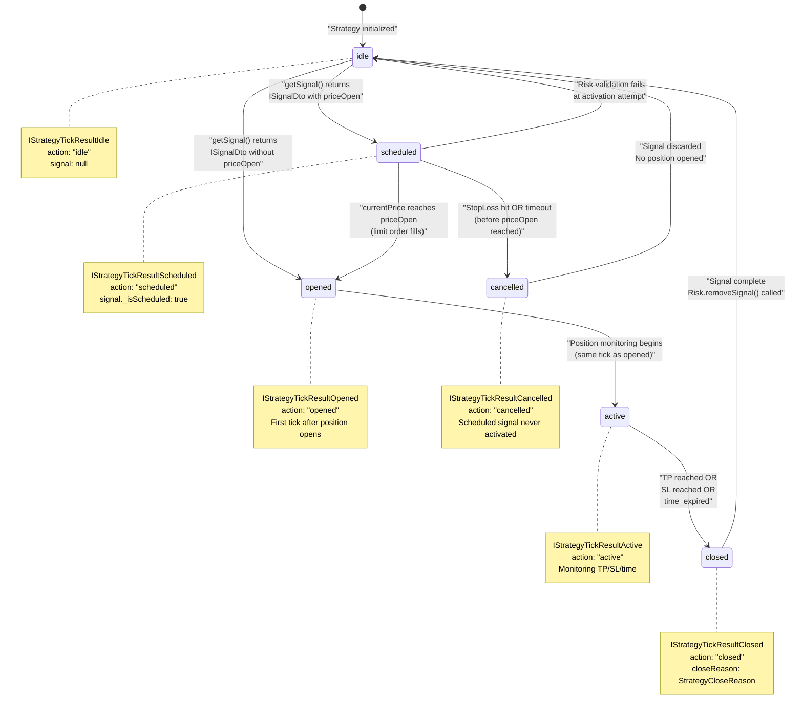
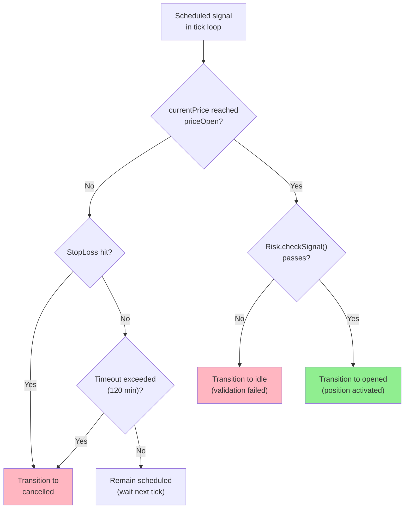
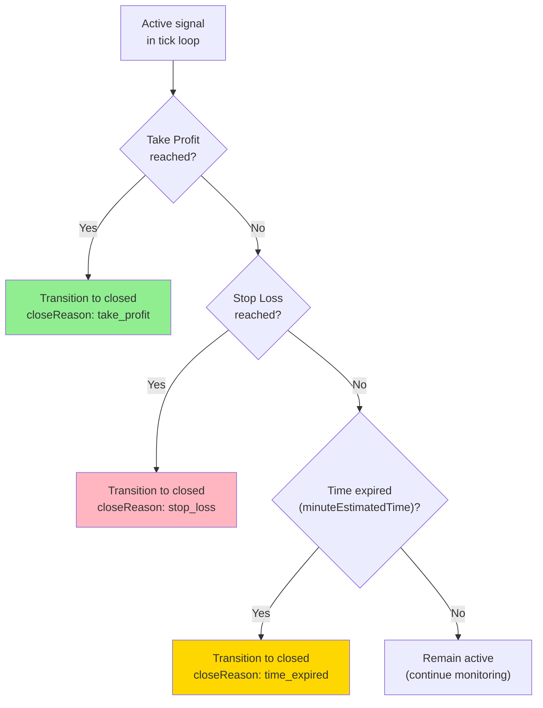
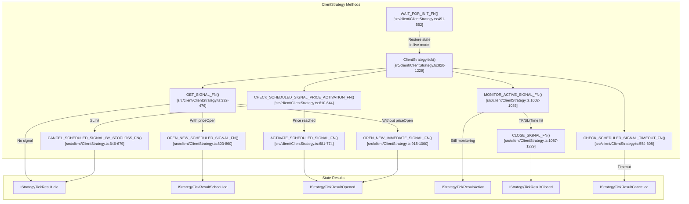
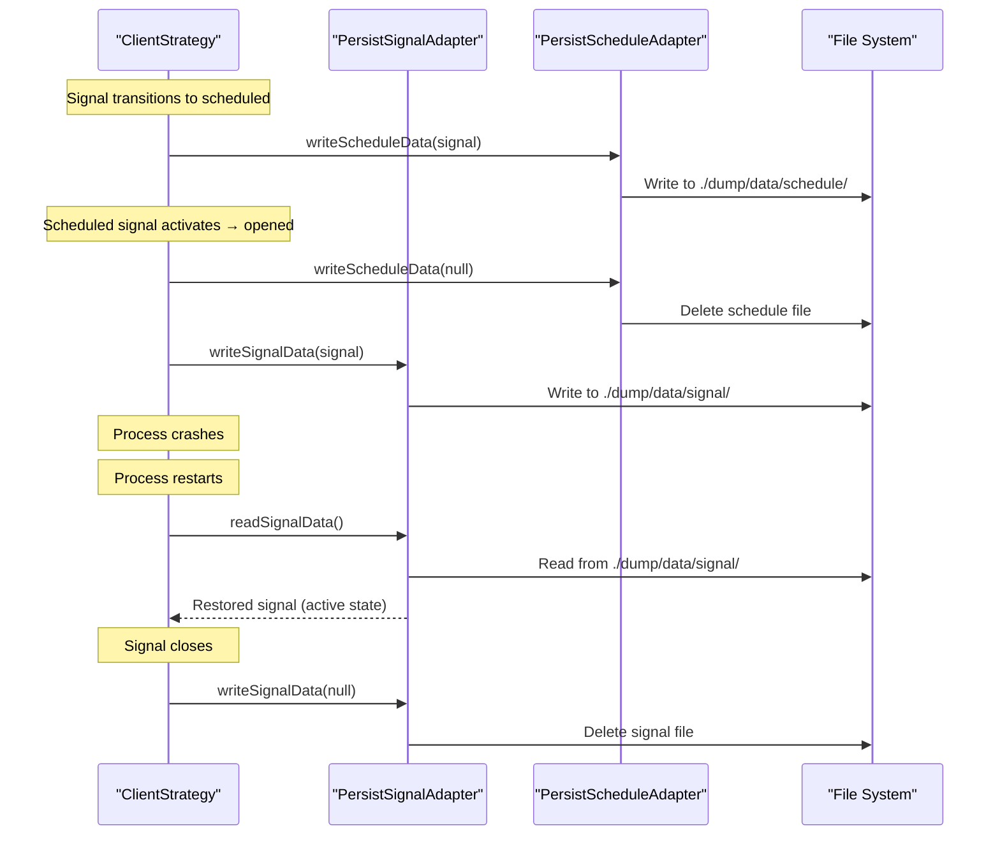

# Signal States

<details>
<summary>Relevant source files</summary>

The following files were used as context for generating this wiki page:

- [README.md](README.md)
- [src/client/ClientStrategy.ts](src/client/ClientStrategy.ts)
- [src/config/emitters.ts](src/config/emitters.ts)
- [src/function/event.ts](src/function/event.ts)
- [src/index.ts](src/index.ts)
- [src/interfaces/Strategy.interface.ts](src/interfaces/Strategy.interface.ts)
- [test/e2e/defend.test.mjs](test/e2e/defend.test.mjs)
- [test/index.mjs](test/index.mjs)
- [types.d.ts](types.d.ts)

</details>


## Purpose and Scope

This document provides comprehensive documentation of the six discrete states that a trading signal can occupy during its lifecycle in backtest-kit. Each state is represented by a distinct TypeScript interface as part of a discriminated union (`IStrategyTickResult`), enabling type-safe state handling throughout the system.

For information about the complete signal lifecycle flow and state transitions, see [Signal Lifecycle Overview](#2.2). For details on signal generation and validation, see [Signal Generation and Validation](#8.2). For information on how signals are persisted across crashes in live mode, see [Signal Persistence](#8.4).

**Sources:** [types.d.ts:770-895](), [src/interfaces/Strategy.interface.ts:173-307]()

---

## State Machine Overview

The signal state machine consists of six mutually exclusive states, represented as a discriminated union with the `action` field as the discriminator:



**Sources:** [src/client/ClientStrategy.ts:1-1500](), [types.d.ts:770-895]()

---

## Discriminated Union Type

All signal states are unified under the `IStrategyTickResult` discriminated union type:

```typescript
type IStrategyTickResult =
  | IStrategyTickResultIdle
  | IStrategyTickResultScheduled
  | IStrategyTickResultOpened
  | IStrategyTickResultActive
  | IStrategyTickResultClosed
  | IStrategyTickResultCancelled;
```

The `action` field serves as the discriminator, enabling TypeScript to narrow types in conditional branches:

```typescript
// Type guard example
if (result.action === "closed") {
  // TypeScript knows result is IStrategyTickResultClosed
  console.log(result.closeReason); // ✓ Valid
  console.log(result.pnl.pnlPercentage); // ✓ Valid
}
```

**Sources:** [types.d.ts:890-895](), [src/interfaces/Strategy.interface.ts:301-307]()

---

## State: Idle

**Interface:** `IStrategyTickResultIdle`

**Purpose:** Represents the absence of an active trading position. The strategy is monitoring the market but has no open signal.

### Type Definition

```typescript
interface IStrategyTickResultIdle {
  action: "idle";
  signal: null;
  strategyName: StrategyName;
  exchangeName: ExchangeName;
  symbol: string;
  currentPrice: number;
}
```

### Properties

| Property | Type | Description |
|----------|------|-------------|
| `action` | `"idle"` | Discriminator value for type narrowing |
| `signal` | `null` | Always null in idle state (no active signal) |
| `strategyName` | `StrategyName` | Strategy identifier for tracking |
| `exchangeName` | `ExchangeName` | Exchange identifier for tracking |
| `symbol` | `string` | Trading pair symbol (e.g., "BTCUSDT") |
| `currentPrice` | `number` | Current VWAP price at idle state |

### State Transitions

The idle state can transition to:
- **scheduled**: When `getSignal()` returns a signal with `priceOpen` specified
- **opened**: When `getSignal()` returns a signal without `priceOpen` (immediate execution)
- **idle**: Remains idle if `getSignal()` returns `null`

### Implementation Location

The idle state is returned by `ClientStrategy.tick()` when:
1. No pending signal exists (`this._pendingSignal === null`)
2. No scheduled signal exists (`this._scheduledSignal === null`)
3. `getSignal()` returns `null` or validation fails

**Sources:** [types.d.ts:770-783](), [src/interfaces/Strategy.interface.ts:173-188](), [src/client/ClientStrategy.ts:820-913]()

---

## State: Scheduled

**Interface:** `IStrategyTickResultScheduled`

**Purpose:** Represents a limit order waiting for price to reach `priceOpen` before activation. This state models real-world limit orders where the trader specifies an entry price.

### Type Definition

```typescript
interface IStrategyTickResultScheduled {
  action: "scheduled";
  signal: IScheduledSignalRow;
  strategyName: StrategyName;
  exchangeName: ExchangeName;
  symbol: string;
  currentPrice: number;
}
```

### Properties

| Property | Type | Description |
|----------|------|-------------|
| `action` | `"scheduled"` | Discriminator value for type narrowing |
| `signal` | `IScheduledSignalRow` | Scheduled signal with `priceOpen` specified |
| `strategyName` | `StrategyName` | Strategy identifier |
| `exchangeName` | `ExchangeName` | Exchange identifier |
| `symbol` | `string` | Trading pair symbol |
| `currentPrice` | `number` | Current VWAP price when scheduled signal was created |

### Signal Row Structure

The `IScheduledSignalRow` extends `ISignalRow` and always has:
- `priceOpen`: Defined (the activation price)
- `_isScheduled`: `true`
- `scheduledAt`: Timestamp when signal was created
- `pendingAt`: Initially equals `scheduledAt`, updated to actual pending time upon activation

### State Transitions

The scheduled state can transition to:
- **opened**: When `currentPrice` reaches `priceOpen` (activation condition met)
- **cancelled**: When `StopLoss` is hit before `priceOpen` is reached
- **cancelled**: When timeout occurs (exceeds `CC_SCHEDULE_AWAIT_MINUTES`, default 120 minutes)
- **idle**: When risk validation fails at activation attempt

### Activation Logic



### Price Activation Conditions

For **LONG** positions:
- Activate when: `currentPrice <= priceOpen` (price dropped to or below entry point)
- Cancel if: `currentPrice <= priceStopLoss` (before activation)

For **SHORT** positions:
- Activate when: `currentPrice >= priceOpen` (price rose to or above entry point)
- Cancel if: `currentPrice >= priceStopLoss` (before activation)

### Implementation Location

Scheduled signal handling occurs in:
- Creation: [src/client/ClientStrategy.ts:389-443]()
- Activation check: [src/client/ClientStrategy.ts:610-644]()
- Timeout check: [src/client/ClientStrategy.ts:554-608]()
- Cancellation by StopLoss: [src/client/ClientStrategy.ts:646-679]()

**Sources:** [types.d.ts:788-807](), [src/interfaces/Strategy.interface.ts:190-207](), [src/client/ClientStrategy.ts:610-801]()

---

## State: Opened

**Interface:** `IStrategyTickResultOpened`

**Purpose:** Represents the first tick immediately after a position is opened. This is a transient state that signals the creation of a new active position.

### Type Definition

```typescript
interface IStrategyTickResultOpened {
  action: "opened";
  signal: ISignalRow;
  strategyName: StrategyName;
  exchangeName: ExchangeName;
  symbol: string;
  currentPrice: number;
}
```

### Properties

| Property | Type | Description |
|----------|------|-------------|
| `action` | `"opened"` | Discriminator value for type narrowing |
| `signal` | `ISignalRow` | Newly created and validated signal with generated ID |
| `strategyName` | `StrategyName` | Strategy identifier |
| `exchangeName` | `ExchangeName` | Exchange identifier |
| `symbol` | `string` | Trading pair symbol |
| `currentPrice` | `number` | Current VWAP price at signal open |

### Timestamps

The `signal` contains two critical timestamps:
- `scheduledAt`: When the signal was first created (for both immediate and scheduled signals)
- `pendingAt`: When the position became active
  - For immediate signals: `pendingAt === scheduledAt`
  - For scheduled signals: `pendingAt` is updated upon activation

### State Transitions

The opened state immediately transitions to:
- **active**: On the next tick (monitoring begins)

The opened state is ephemeral and exists only for one tick to trigger `onOpen` callbacks.

### Callbacks Triggered

When entering the opened state:
1. `IStrategyCallbacks.onOpen` is invoked [src/client/ClientStrategy.ts:747-754]()
2. `Risk.addSignal()` is called to register the position [src/client/ClientStrategy.ts:742-745]()
3. Signal is persisted to disk (in live mode) [src/client/ClientStrategy.ts:157-175]()

### Implementation Location

The opened state is emitted by:
- Immediate signal opening: [src/client/ClientStrategy.ts:803-860]()
- Scheduled signal activation: [src/client/ClientStrategy.ts:681-774]()

**Sources:** [types.d.ts:809-826](), [src/interfaces/Strategy.interface.ts:209-227](), [src/client/ClientStrategy.ts:681-860]()

---

## State: Active

**Interface:** `IStrategyTickResultActive`

**Purpose:** Represents an open position being continuously monitored for take profit, stop loss, or time expiration conditions.

### Type Definition

```typescript
interface IStrategyTickResultActive {
  action: "active";
  signal: ISignalRow;
  currentPrice: number;
  strategyName: StrategyName;
  exchangeName: ExchangeName;
  symbol: string;
  percentTp: number;
  percentSl: number;
}
```

### Properties

| Property | Type | Description |
|----------|------|-------------|
| `action` | `"active"` | Discriminator value for type narrowing |
| `signal` | `ISignalRow` | Currently monitored signal |
| `currentPrice` | `number` | Current VWAP price for monitoring |
| `strategyName` | `StrategyName` | Strategy identifier |
| `exchangeName` | `ExchangeName` | Exchange identifier |
| `symbol` | `string` | Trading pair symbol |
| `percentTp` | `number` | Percentage progress towards take profit (0-100%, 0 if moving towards SL) |
| `percentSl` | `number` | Percentage progress towards stop loss (0-100%, 0 if moving towards TP) |

### Progress Calculation

The `percentTp` and `percentSl` fields indicate how close the current price is to hitting the respective target:

```typescript
// For LONG position
const distanceToTp = priceTakeProfit - priceOpen;
const currentProgress = currentPrice - priceOpen;
percentTp = (currentProgress / distanceToTp) * 100;

// For SHORT position
const distanceToTp = priceOpen - priceTakeProfit;
const currentProgress = priceOpen - currentPrice;
percentTp = (currentProgress / distanceToTp) * 100;
```

Only one of `percentTp` or `percentSl` is non-zero at any given time, depending on which direction the price is moving.

### Exit Conditions Monitoring



### Partial Profit/Loss Tracking

During the active state, `ClientPartial` monitors for milestone levels:
- **Profit levels**: 10%, 20%, 30%, ..., 100% (when `revenuePercent > 0`)
- **Loss levels**: -10%, -20%, -30%, ..., -100% (when `revenuePercent < 0`)

Events are emitted only once per level via Set-based deduplication [src/client/ClientPartial.ts:1-300]().

### State Transitions

The active state can transition to:
- **closed**: When any exit condition is met (TP, SL, or time expiration)

### Implementation Location

Active state monitoring occurs in:
- Main monitoring loop: [src/client/ClientStrategy.ts:862-1085]()
- Progress calculation: [src/client/ClientStrategy.ts:920-1000]()
- Exit condition checks: [src/client/ClientStrategy.ts:1000-1085]()

**Sources:** [types.d.ts:824-849](), [src/interfaces/Strategy.interface.ts:229-249](), [src/client/ClientStrategy.ts:862-1085]()

---

## State: Closed

**Interface:** `IStrategyTickResultClosed`

**Purpose:** Represents the final state of a completed signal with calculated profit/loss. This is a terminal state that marks the end of a signal's lifecycle.

### Type Definition

```typescript
interface IStrategyTickResultClosed {
  action: "closed";
  signal: ISignalRow;
  currentPrice: number;
  closeReason: StrategyCloseReason;
  closeTimestamp: number;
  pnl: IStrategyPnL;
  strategyName: StrategyName;
  exchangeName: ExchangeName;
  symbol: string;
}
```

### Properties

| Property | Type | Description |
|----------|------|-------------|
| `action` | `"closed"` | Discriminator value for type narrowing |
| `signal` | `ISignalRow` | Completed signal with original parameters |
| `currentPrice` | `number` | Final VWAP price at close |
| `closeReason` | `StrategyCloseReason` | Why signal closed: `"take_profit"`, `"stop_loss"`, or `"time_expired"` |
| `closeTimestamp` | `number` | Unix timestamp in milliseconds when signal closed |
| `pnl` | `IStrategyPnL` | Profit/loss calculation with fees and slippage |
| `strategyName` | `StrategyName` | Strategy identifier |
| `exchangeName` | `ExchangeName` | Exchange identifier |
| `symbol` | `string` | Trading pair symbol |

### Close Reasons

```typescript
type StrategyCloseReason = "time_expired" | "take_profit" | "stop_loss";
```

| Reason | Description |
|--------|-------------|
| `"take_profit"` | Price reached `priceTakeProfit` target |
| `"stop_loss"` | Price reached `priceStopLoss` limit |
| `"time_expired"` | `minuteEstimatedTime` elapsed without hitting TP/SL |

### PnL Calculation

The `IStrategyPnL` structure includes:

```typescript
interface IStrategyPnL {
  pnlPercentage: number;  // e.g., 1.5 for +1.5%, -2.3 for -2.3%
  priceOpen: number;      // Entry price adjusted with slippage and fees
  priceClose: number;     // Exit price adjusted with slippage and fees
}
```

**Fee and Slippage Application:**
- Entry fee: 0.1% (default `CC_PERCENT_FEE`)
- Exit fee: 0.1%
- Entry slippage: 0.1% (default `CC_PERCENT_SLIPPAGE`)
- Exit slippage: 0.1%
- Total cost: ~0.4% round-trip

The calculation is performed by `toProfitLossDto()` helper [src/helpers/toProfitLossDto.ts:1-100]().

### State Transitions

The closed state transitions to:
- **idle**: Signal is complete and removed from tracking

### Cleanup Actions

When entering the closed state:
1. `Risk.removeSignal()` is called to release risk limits [src/client/ClientStrategy.ts:1147-1150]()
2. `ClientPartial.clear()` removes partial tracking state [src/client/ClientStrategy.ts:1151-1154]()
3. `IStrategyCallbacks.onClose` is invoked [src/client/ClientStrategy.ts:1139-1146]()
4. Signal is removed from persistence (in live mode) [src/client/ClientStrategy.ts:157-175]()

### Implementation Location

Closed state creation occurs in:
- Take profit closure: [src/client/ClientStrategy.ts:1000-1050]()
- Stop loss closure: [src/client/ClientStrategy.ts:1050-1100]()
- Time expiration closure: [src/client/ClientStrategy.ts:1100-1150]()

**Sources:** [types.d.ts:846-874](), [src/interfaces/Strategy.interface.ts:251-274](), [src/client/ClientStrategy.ts:1087-1229]()

---

## State: Cancelled

**Interface:** `IStrategyTickResultCancelled`

**Purpose:** Represents a scheduled signal that was discarded without ever opening a position. This occurs when a limit order's conditions are never met or are invalidated before activation.

### Type Definition

```typescript
interface IStrategyTickResultCancelled {
  action: "cancelled";
  signal: IScheduledSignalRow;
  currentPrice: number;
  closeTimestamp: number;
  strategyName: StrategyName;
  exchangeName: ExchangeName;
  symbol: string;
}
```

### Properties

| Property | Type | Description |
|----------|------|-------------|
| `action` | `"cancelled"` | Discriminator value for type narrowing |
| `signal` | `IScheduledSignalRow` | Cancelled scheduled signal (never activated) |
| `currentPrice` | `number` | Final VWAP price at cancellation |
| `closeTimestamp` | `number` | Unix timestamp in milliseconds when signal cancelled |
| `strategyName` | `StrategyName` | Strategy identifier |
| `exchangeName` | `ExchangeName` | Exchange identifier |
| `symbol` | `string` | Trading pair symbol |

### Cancellation Scenarios

A scheduled signal is cancelled in two scenarios:

#### 1. Pre-Activation Stop Loss Hit

For **LONG** scheduled signals:
```typescript
if (currentPrice <= signal.priceStopLoss && currentPrice > signal.priceOpen) {
  // Price dropped past SL before reaching priceOpen
  // Cancel to prevent opening a position that would immediately lose
}
```

For **SHORT** scheduled signals:
```typescript
if (currentPrice >= signal.priceStopLoss && currentPrice < signal.priceOpen) {
  // Price rose past SL before reaching priceOpen
  // Cancel to prevent opening a position that would immediately lose
}
```

**Rationale:** Prevents opening positions that would trigger immediate stop loss, saving fees and slippage costs.

**Sources:** [src/client/ClientStrategy.ts:610-644](), [src/client/ClientStrategy.ts:646-679]()

#### 2. Timeout Exceeded

```typescript
const elapsedTime = currentTime - signal.scheduledAt;
const maxTimeToWait = CC_SCHEDULE_AWAIT_MINUTES * 60 * 1000; // Default: 120 minutes

if (elapsedTime >= maxTimeToWait) {
  // Scheduled signal waited too long
  // Cancel to free up risk limits
}
```

**Rationale:** Prevents "zombie" scheduled signals from blocking risk limits indefinitely.

**Sources:** [src/client/ClientStrategy.ts:554-608](), [src/config/params.ts:1-100]()

### State Transitions

The cancelled state transitions to:
- **idle**: Scheduled signal is removed without ever activating

### No PnL Impact

Unlike the closed state, cancelled signals have **no PnL impact** because:
- No position was ever opened
- No entry fees were incurred
- No slippage was applied
- Risk limits are released immediately

### Callbacks Triggered

When entering the cancelled state:
1. `IStrategyCallbacks.onCancel` is invoked [src/client/ClientStrategy.ts:580-587]()
2. Scheduled signal is removed from persistence (in live mode) [src/classes/Persist.ts:1-500]()

### Implementation Location

Cancelled state creation occurs in:
- Timeout cancellation: [src/client/ClientStrategy.ts:554-608]()
- Pre-activation SL cancellation: [src/client/ClientStrategy.ts:646-679]()

**Sources:** [types.d.ts:870-895](), [src/interfaces/Strategy.interface.ts:276-295](), [src/client/ClientStrategy.ts:554-679]()

---

## State Properties Comparison Table

| Property | `idle` | `scheduled` | `opened` | `active` | `closed` | `cancelled` |
|----------|--------|-------------|----------|----------|----------|-------------|
| `action` | `"idle"` | `"scheduled"` | `"opened"` | `"active"` | `"closed"` | `"cancelled"` |
| `signal` | `null` | `IScheduledSignalRow` | `ISignalRow` | `ISignalRow` | `ISignalRow` | `IScheduledSignalRow` |
| `currentPrice` | ✓ | ✓ | ✓ | ✓ | ✓ | ✓ |
| `strategyName` | ✓ | ✓ | ✓ | ✓ | ✓ | ✓ |
| `exchangeName` | ✓ | ✓ | ✓ | ✓ | ✓ | ✓ |
| `symbol` | ✓ | ✓ | ✓ | ✓ | ✓ | ✓ |
| `percentTp` | ✗ | ✗ | ✗ | ✓ | ✗ | ✗ |
| `percentSl` | ✗ | ✗ | ✗ | ✓ | ✗ | ✗ |
| `closeReason` | ✗ | ✗ | ✗ | ✗ | ✓ | ✗ |
| `closeTimestamp` | ✗ | ✗ | ✗ | ✗ | ✓ | ✓ |
| `pnl` | ✗ | ✗ | ✗ | ✗ | ✓ | ✗ |

**Sources:** [types.d.ts:770-895](), [src/interfaces/Strategy.interface.ts:173-307]()

---

## Code-Level Implementation Mapping

The following diagram maps signal states to their implementation in `ClientStrategy`:



**Sources:** [src/client/ClientStrategy.ts:1-1500]()

---

## Validation Rules Enforced at State Transitions

The `VALIDATE_SIGNAL_FN` enforces the following rules when signals are created or activated:

### Price Validation

| Position | Rule | Error Message Pattern |
|----------|------|----------------------|
| LONG | `priceTakeProfit > priceOpen` | "priceTakeProfit must be > priceOpen" |
| LONG | `priceStopLoss < priceOpen` | "priceStopLoss must be < priceOpen" |
| SHORT | `priceTakeProfit < priceOpen` | "priceTakeProfit must be < priceOpen" |
| SHORT | `priceStopLoss > priceOpen` | "priceStopLoss must be > priceOpen" |

### Distance Validation

| Parameter | Minimum | Maximum | Configuration |
|-----------|---------|---------|---------------|
| Take Profit | `CC_MIN_TAKEPROFIT_DISTANCE_PERCENT` | N/A | Default: 0.5% |
| Stop Loss | `CC_MIN_STOPLOSS_DISTANCE_PERCENT` | `CC_MAX_STOPLOSS_DISTANCE_PERCENT` | Default: 0.1% - 10% |

### Time Validation

| Parameter | Minimum | Maximum | Configuration |
|-----------|---------|---------|---------------|
| `minuteEstimatedTime` | > 0 | `CC_MAX_SIGNAL_LIFETIME_MINUTES` | Default: 10080 min (7 days) |

### Immediate Closure Prevention

For immediate signals (without `priceOpen`):
```typescript
// LONG: currentPrice must be BETWEEN SL and TP
if (currentPrice <= priceStopLoss || currentPrice >= priceTakeProfit) {
  throw new Error("Signal would be immediately closed");
}

// SHORT: currentPrice must be BETWEEN TP and SL
if (currentPrice <= priceTakeProfit || currentPrice >= priceStopLoss) {
  throw new Error("Signal would be immediately closed");
}
```

For scheduled signals (with `priceOpen`):
```typescript
// LONG: priceOpen must be BETWEEN SL and TP
if (priceOpen <= priceStopLoss || priceOpen >= priceTakeProfit) {
  throw new Error("Signal would close immediately on activation");
}

// SHORT: priceOpen must be BETWEEN TP and SL
if (priceOpen <= priceTakeProfit || priceOpen >= priceStopLoss) {
  throw new Error("Signal would close immediately on activation");
}
```

**Rationale:** Prevents signals that would incur fees/slippage without any opportunity for profit.

**Sources:** [src/client/ClientStrategy.ts:45-330](), [src/config/params.ts:1-100]()

---

## Event Emission Per State

The following table shows which RxJS subjects emit events for each state:

| State | `signalEmitter` | `signalBacktestEmitter` | `signalLiveEmitter` | Additional Events |
|-------|----------------|------------------------|--------------------|--------------------|
| `idle` | ✓ | ✓ (if backtest) | ✓ (if live) | None |
| `scheduled` | ✓ | ✓ (if backtest) | ✓ (if live) | None |
| `opened` | ✓ | ✓ (if backtest) | ✓ (if live) | `Risk.addSignal()` called |
| `active` | ✓ | ✓ (if backtest) | ✓ (if live) | `partialProfitSubject` / `partialLossSubject` |
| `closed` | ✓ | ✓ (if backtest) | ✓ (if live) | `Risk.removeSignal()` called |
| `cancelled` | ✓ | ✓ (if backtest) | ✓ (if live) | None |

All states emit to:
- Global `signalEmitter` [src/config/emitters.ts:19]()
- Mode-specific emitters based on `execution.context.backtest` flag [src/client/ClientStrategy.ts:1200-1229]()

**Sources:** [src/config/emitters.ts:1-133](), [src/client/ClientStrategy.ts:1200-1229]()

---

## State Persistence in Live Mode

In live trading mode (when `execution.context.backtest === false`), signal states are persisted to disk for crash recovery:

| State | Persisted? | Adapter | File Path |
|-------|-----------|---------|-----------|
| `idle` | No | N/A | N/A |
| `scheduled` | Yes | `PersistScheduleAdapter` | `./dump/data/schedule/{strategy}/{symbol}.json` |
| `opened` | Yes | `PersistSignalAdapter` | `./dump/data/signal/{strategy}/{symbol}.json` |
| `active` | Yes | `PersistSignalAdapter` | `./dump/data/signal/{strategy}/{symbol}.json` |
| `closed` | No (deleted) | `PersistSignalAdapter` | Removed from disk |
| `cancelled` | No (deleted) | `PersistScheduleAdapter` | Removed from disk |

### Persistence Workflow



For detailed information on persistence mechanics, see [Signal Persistence](#8.4) and [Crash Recovery](#10.2).

**Sources:** [src/classes/Persist.ts:1-500](), [src/client/ClientStrategy.ts:157-175](), [src/client/ClientStrategy.ts:491-552]()