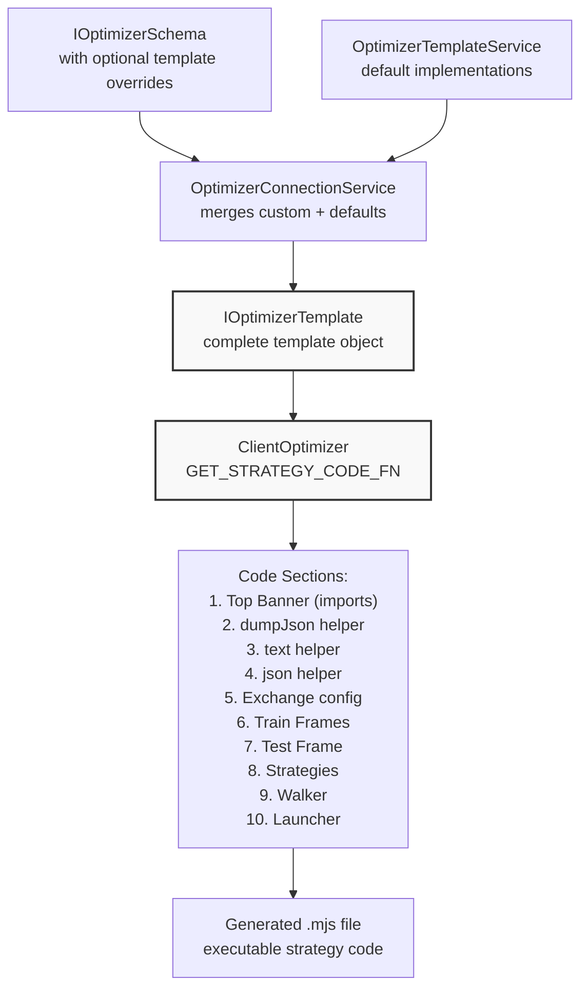
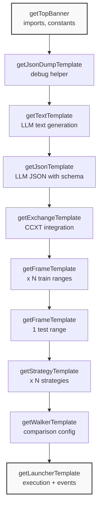
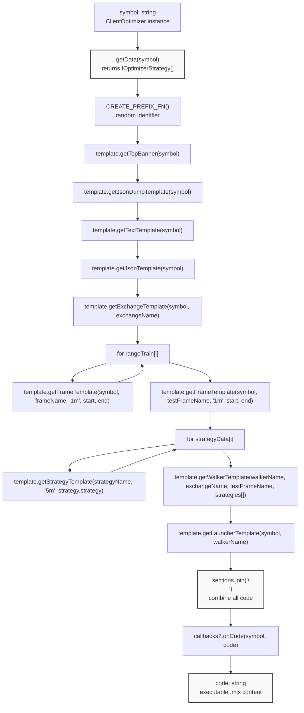
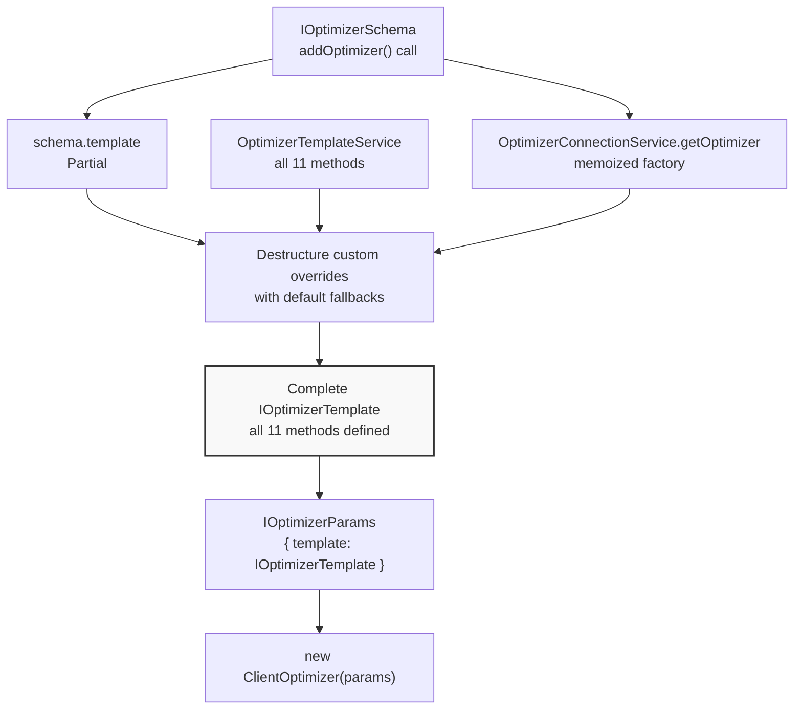
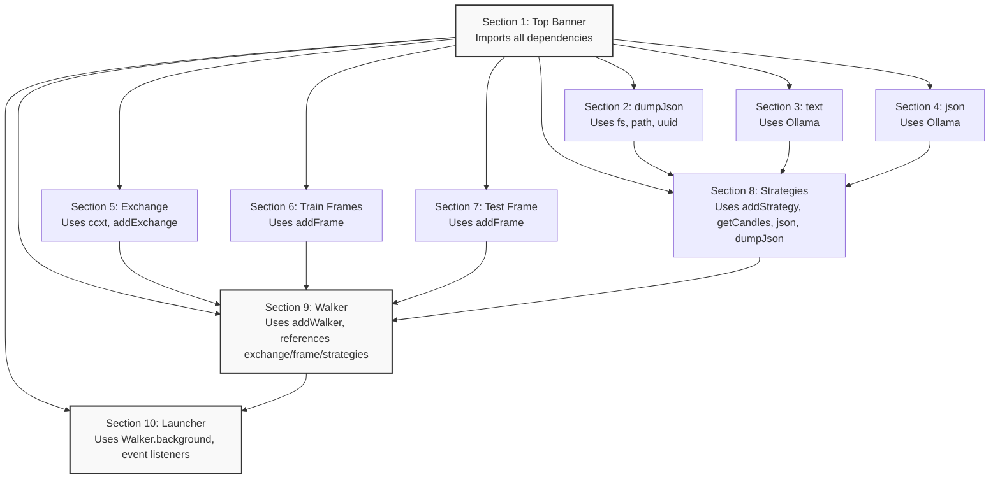
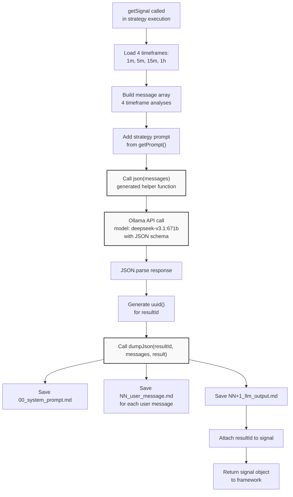
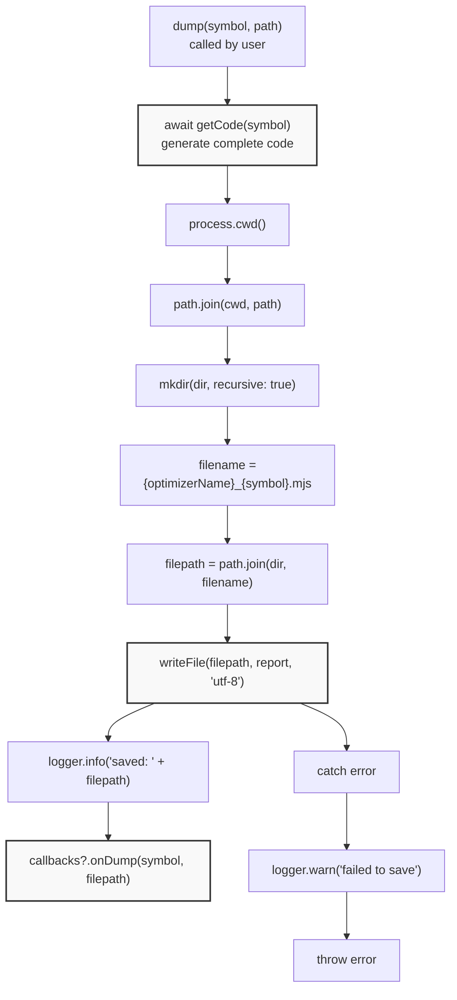
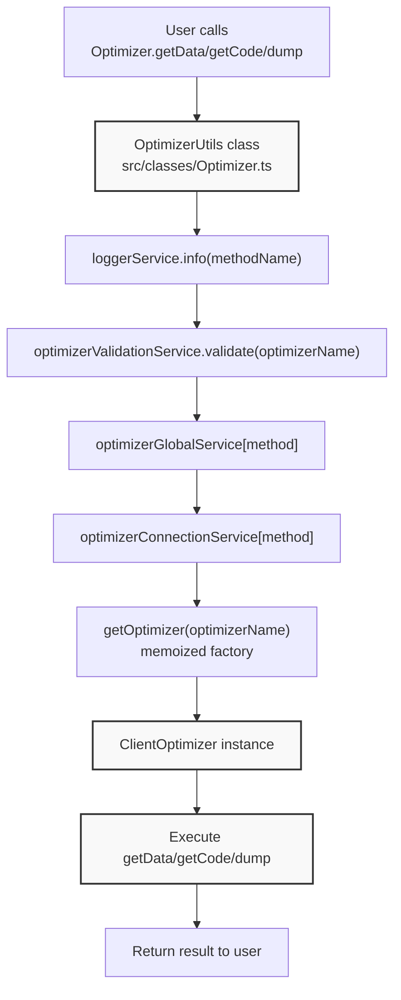

# Code Generation & Templates

This document covers the template system used by the Optimizer to generate executable strategy code. It explains the `IOptimizerTemplate` interface, the default `OptimizerTemplateService` implementation, how templates are assembled into complete `.mjs` files, and how to customize code generation for specific use cases.

For information about the overall optimizer system and data collection, see [Optimizer System](./46_advanced-features.md). For details on LLM integration and prompt engineering, see [LLM-Powered Strategy Generation](./46_advanced-features.md).

---

## Template System Overview

The template system transforms optimizer data (market analysis, backtest results, etc.) into executable Node.js modules that run Walker-based strategy comparisons with integrated LLM decision-making. Templates are TypeScript/JavaScript code generators that return strings of code.

**Template Workflow Diagram**




---

## IOptimizerTemplate Interface

The `IOptimizerTemplate` interface defines 11 template methods that generate different sections of the final strategy code. Each method returns a string (or Promise<string>) containing valid TypeScript/JavaScript code.

**Template Methods Table**

| Method | Parameters | Purpose | Output |
|--------|-----------|---------|--------|
| `getTopBanner` | symbol | Imports and initialization | Shebang, imports, constants |
| `getUserMessage` | symbol, data, name | Default LLM user message | Formatted data prompt |
| `getAssistantMessage` | symbol, data, name | Default LLM assistant response | Acknowledgment message |
| `getWalkerTemplate` | walkerName, exchangeName, frameName, strategies | Walker configuration | `addWalker()` call |
| `getExchangeTemplate` | symbol, exchangeName | Exchange configuration | `addExchange()` with CCXT |
| `getFrameTemplate` | symbol, frameName, interval, startDate, endDate | Timeframe configuration | `addFrame()` call |
| `getStrategyTemplate` | strategyName, interval, prompt | Strategy with LLM logic | `addStrategy()` with getSignal |
| `getLauncherTemplate` | symbol, walkerName | Walker execution | `Walker.background()` + listeners |
| `getTextTemplate` | symbol | LLM text generation helper | `async text()` function |
| `getJsonTemplate` | symbol | LLM JSON generation helper | `async json()` function with schema |
| `getJsonDumpTemplate` | symbol | Debug output helper | `async dumpJson()` function |


**Template Method Dependencies**




---

## OptimizerTemplateService Default Implementation

The `OptimizerTemplateService` class provides default implementations for all `IOptimizerTemplate` methods. It generates code optimized for multi-timeframe analysis (1m, 5m, 15m, 1h) with Ollama LLM integration and comprehensive debugging.

**Key Features**

- **Multi-Timeframe Analysis**: Loads candles from 4 timeframes and formats them for LLM context `src/lib/services/template/OptimizerTemplateService.ts:202-276`
- **JSON Structured Output**: Uses Ollama's `format` parameter with strict schema for trading signals `src/lib/services/template/OptimizerTemplateService.ts:675-705`
- **Debug Logging**: Saves LLM conversations and results to `./dump/strategy/{resultId}/` `src/lib/services/template/OptimizerTemplateService.ts:457-544`
- **Code Injection Prevention**: Escapes special characters in all string interpolations `src/lib/services/template/OptimizerTemplateService.ts:136-147`, `src/lib/services/template/OptimizerTemplateService.ts:183-192`
- **CCXT Integration**: Default exchange uses `ccxt.binance()` with standard formatters `src/lib/services/template/OptimizerTemplateService.ts:328-341`

**Default Template Method Implementations**

| Method | Implementation Details | Key Escaping |
|--------|----------------------|--------------|
| `getTopBanner` | Returns shebang + imports (Ollama, ccxt, backtest-kit, fs, uuid, path) + `WARN_KB` constant | None (static) |
| `getStrategyTemplate` | Generates 5-message conversation: 1h analysis → 15m analysis → 5m analysis → 1m analysis → signal request | strategyName, interval, prompt (backticks, $) |
| `getExchangeTemplate` | CCXT Binance with fetchOHLCV, price/quantity formatters | exchangeName |
| `getFrameTemplate` | addFrame with ISO date strings | frameName, interval |
| `getWalkerTemplate` | addWalker with strategy array | walkerName, exchangeName, frameName, strategies[] |
| `getLauncherTemplate` | Walker.background + 7 event listeners (signal, progress, complete, done, error) | symbol, walkerName |
| `getTextTemplate` | Ollama chat with market analysis prompt, returns escaped text | symbol (in prompt) |
| `getJsonTemplate` | Ollama chat with signal schema (position, note, prices, time) | None (static schema) |
| `getJsonDumpTemplate` | Saves messages to numbered markdown files with size warnings | None (dynamic paths) |


**getStrategyTemplate Multi-Timeframe Flow**

```mermaid
graph TB
    Start["getSignal called<br/>by framework"]
    Messages["messages = []"]
    
    Load1h["Load mediumTermCandles<br/>getCandles('1h', 24)"]
    Format1h["formatCandles helper<br/>ISO timestamp + OHLCV"]
    Push1h["Push user message:<br/>'Analyze 1h candles'<br/>+ formatted data"]
    Ack1h["Push assistant:<br/>'1h trend analyzed'"]
    
    Load15m["Load shortTermCandles<br/>getCandles('15m', 24)"]
    Format15m["formatCandles helper"]
    Push15m["Push user message:<br/>'Analyze 15m candles'"]
    Ack15m["Push assistant:<br/>'15m trend analyzed'"]
    
    Load5m["Load mainTermCandles<br/>getCandles('5m', 24)"]
    Format5m["formatCandles helper"]
    Push5m["Push user message:<br/>'Analyze 5m candles'"]
    Ack5m["Push assistant:<br/>'5m timeframe analyzed'"]
    
    Load1m["Load microTermCandles<br/>getCandles('1m', 30)"]
    Format1m["formatCandles helper"]
    Push1m["Push user message:<br/>'Analyze 1m candles'"]
    Ack1m["Push assistant:<br/>'1m microstructure analyzed'"]
    
    Strategy["Push user message:<br/>Analyze all timeframes<br/>+ escapedPrompt<br/>'If conflicting, wait'"]
    
    Json["Call json(messages)<br/>Ollama with schema"]
    Dump["Call dumpJson<br/>save to disk"]
    Return["Return signal object<br/>with resultId"]
    
    Start --> Messages
    Messages --> Load1h
    Load1h --> Format1h
    Format1h --> Push1h
    Push1h --> Ack1h
    
    Ack1h --> Load15m
    Load15m --> Format15m
    Format15m --> Push15m
    Push15m --> Ack15m
    
    Ack15m --> Load5m
    Load5m --> Format5m
    Format5m --> Push5m
    Push5m --> Ack5m
    
    Ack5m --> Load1m
    Load1m --> Format1m
    Format1m --> Push1m
    Push1m --> Ack1m
    
    Ack1m --> Strategy
    Strategy --> Json
    Json --> Dump
    Dump --> Return
    
    style Start fill:#f9f9f9,stroke:#333,stroke-width:2px
    style Json fill:#f9f9f9,stroke:#333,stroke-width:2px
    style Return fill:#f9f9f9,stroke:#333,stroke-width:2px
```




---

## Code Generation Workflow in ClientOptimizer

The `ClientOptimizer.getCode` method orchestrates template calls to assemble a complete executable strategy file. The `GET_STRATEGY_CODE_FN` function `src/client/ClientOptimizer.ts:225-350` performs the following steps:

**Code Assembly Process**

1. **Fetch Strategy Data**: Call `getData(symbol)` to collect LLM conversation history `src/client/ClientOptimizer.ts:226`
2. **Generate Prefix**: Create random prefix for unique naming (e.g., `"a1b2c3"`) `src/client/ClientOptimizer.ts:228`
3. **Initialize Sections Array**: Accumulate code strings `src/client/ClientOptimizer.ts:229`
4. **Top Banner**: Imports and constants `src/client/ClientOptimizer.ts:233-236`
5. **JSON Dump Helper**: Debug output function `src/client/ClientOptimizer.ts:238-242`
6. **Helper Functions**: `text()` and `json()` LLM wrappers `src/client/ClientOptimizer.ts:244-253`
7. **Exchange Configuration**: CCXT integration `src/client/ClientOptimizer.ts:256-264`
8. **Train Frames**: One frame per training range `src/client/ClientOptimizer.ts:267-282`
9. **Test Frame**: Single validation timeframe `src/client/ClientOptimizer.ts:285-297`
10. **Strategies**: One strategy per training range × source combination `src/client/ClientOptimizer.ts:300-314`
11. **Walker Configuration**: Compare all strategies `src/client/ClientOptimizer.ts:317-332`
12. **Launcher**: Execute Walker with event listeners `src/client/ClientOptimizer.ts:335-341`
13. **Join and Callback**: Combine sections, trigger `onCode` callback `src/client/ClientOptimizer.ts:343-348`

**Generated File Naming Convention**

- **Exchange**: `{prefix}_exchange` (e.g., `"a1b2c3_exchange"`)
- **Train Frames**: `{prefix}_train_frame-{N}` (e.g., `"a1b2c3_train_frame-1"`, `"a1b2c3_train_frame-2"`)
- **Test Frame**: `{prefix}_test_frame`
- **Strategies**: `{prefix}_strategy-{N}` (e.g., `"a1b2c3_strategy-1"`)
- **Walker**: `{prefix}_walker`


**Code Generation Data Flow**




---

## Template Customization

Users can override individual template methods in the `IOptimizerSchema.template` property. The `OptimizerConnectionService` merges custom overrides with defaults from `OptimizerTemplateService`.

**Template Merging Process**




**Custom Template Example**

```typescript
addOptimizer({
  optimizerName: "custom-template-optimizer",
  rangeTrain: [...],
  rangeTest: {...},
  source: [...],
  getPrompt: async (symbol, messages) => {...},
  
  // Override specific templates
  template: {
    // Custom strategy template with different timeframes
    getStrategyTemplate: async (strategyName, interval, prompt) => {
      return [
        `addStrategy({`,
        `    strategyName: "${strategyName}",`,
        `    interval: "${interval}",`,
        `    getSignal: async (symbol) => {`,
        `        // Load only 15m and 1h candles`,
        `        const shortTerm = await getCandles(symbol, "15m", 12);`,
        `        const mediumTerm = await getCandles(symbol, "1h", 12);`,
        `        `,
        `        // Custom analysis logic`,
        `        const signal = await analyzeCustom(shortTerm, mediumTerm);`,
        `        return signal;`,
        `    },`,
        `});`
      ].join("\n");
    },
    
    // Custom exchange with different CCXT exchange
    getExchangeTemplate: async (symbol, exchangeName) => {
      return [
        `addExchange({`,
        `    exchangeName: "${exchangeName}",`,
        `    getCandles: async (symbol, interval, since, limit) => {`,
        `        const exchange = new ccxt.kraken(); // Use Kraken instead`,
        `        const ohlcv = await exchange.fetchOHLCV(symbol, interval, since.getTime(), limit);`,
        `        return ohlcv.map(([timestamp, open, high, low, close, volume]) => ({`,
        `            timestamp, open, high, low, close, volume`,
        `        }));`,
        `    },`,
        `    formatPrice: async (symbol, price) => price.toFixed(4), // Different precision`,
        `    formatQuantity: async (symbol, quantity) => quantity.toFixed(6),`,
        `});`
      ].join("\n");
    },
    
    // All other methods use defaults from OptimizerTemplateService
  }
});
```

**Partial Override Behavior**

The merging logic in `OptimizerConnectionService.getOptimizer` `src/lib/services/connection/OptimizerConnectionService.ts:72-97` uses destructuring with default fallbacks:

```typescript
const {
  getAssistantMessage = this.optimizerTemplateService.getAssistantMessage,
  getExchangeTemplate = this.optimizerTemplateService.getExchangeTemplate,
  getFrameTemplate = this.optimizerTemplateService.getFrameTemplate,
  // ... all 11 methods
} = rawTemplate;
```

Any method not provided in `schema.template` automatically uses the default implementation.


---

## Generated Code Structure

The final `.mjs` file produced by `ClientOptimizer.getCode` follows a 10-section structure with strict ordering to ensure correct dependency resolution.

**Complete File Structure**

```javascript
#!/usr/bin/env node

// ===== SECTION 1: Top Banner =====
import { Ollama } from "ollama";
import ccxt from "ccxt";
import {
    addExchange,
    addStrategy,
    addFrame,
    addWalker,
    Walker,
    Backtest,
    getCandles,
    listenSignalBacktest,
    listenWalkerComplete,
    listenDoneBacktest,
    listenBacktestProgress,
    listenWalkerProgress,
    listenError,
} from "backtest-kit";
import { promises as fs } from "fs";
import { v4 as uuid } from "uuid";
import path from "path";

const WARN_KB = 100;

// ===== SECTION 2: dumpJson Helper =====
async function dumpJson(resultId, history, result, outputDir = "./dump/strategy") {
    // Saves to ./dump/strategy/{resultId}/00_system_prompt.md
    // Saves to ./dump/strategy/{resultId}/01_user_message.md
    // ... etc
}

// ===== SECTION 3: text Helper =====
async function text(messages) {
    // Ollama chat for text generation
    // Returns escaped string
}

// ===== SECTION 4: json Helper =====
async function json(messages) {
    // Ollama chat with JSON schema
    // Returns parsed signal object
}

// ===== SECTION 5: Exchange Configuration =====
addExchange({
    exchangeName: "a1b2c3_exchange",
    getCandles: async (symbol, interval, since, limit) => {
        const exchange = new ccxt.binance();
        const ohlcv = await exchange.fetchOHLCV(symbol, interval, since.getTime(), limit);
        return ohlcv.map(([timestamp, open, high, low, close, volume]) => ({
            timestamp, open, high, low, close, volume
        }));
    },
    formatPrice: async (symbol, price) => price.toFixed(2),
    formatQuantity: async (symbol, quantity) => quantity.toFixed(8),
});

// ===== SECTION 6: Train Frames (one per training range) =====
addFrame({
    frameName: "a1b2c3_train_frame-1",
    interval: "1m",
    startDate: new Date("2024-01-01T00:00:00.000Z"),
    endDate: new Date("2024-02-01T00:00:00.000Z"),
});

addFrame({
    frameName: "a1b2c3_train_frame-2",
    interval: "1m",
    startDate: new Date("2024-02-01T00:00:00.000Z"),
    endDate: new Date("2024-03-01T00:00:00.000Z"),
});

// ===== SECTION 7: Test Frame =====
addFrame({
    frameName: "a1b2c3_test_frame",
    interval: "1m",
    startDate: new Date("2024-03-01T00:00:00.000Z"),
    endDate: new Date("2024-04-01T00:00:00.000Z"),
});

// ===== SECTION 8: Strategies (one per training range) =====
addStrategy({
    strategyName: "a1b2c3_strategy-1",
    interval: "5m",
    getSignal: async (symbol) => {
        const messages = [];
        
        // Load 4 timeframes
        const microTermCandles = await getCandles(symbol, "1m", 30);
        const mainTermCandles = await getCandles(symbol, "5m", 24);
        const shortTermCandles = await getCandles(symbol, "15m", 24);
        const mediumTermCandles = await getCandles(symbol, "1h", 24);
        
        function formatCandles(candles, timeframe) {
            return candles.map((c) =>
                `${new Date(c.timestamp).toISOString()}[${timeframe}]: O:${c.open} H:${c.high} L:${c.low} C:${c.close} V:${c.volume}`
            ).join("\n");
        }
        
        // Build 5-message conversation
        messages.push(
            { role: "user", content: "Analyze 1h candles:\n\n" + formatCandles(mediumTermCandles, "1h") },
            { role: "assistant", content: "1h trend analyzed" }
        );
        messages.push(
            { role: "user", content: "Analyze 15m candles:\n\n" + formatCandles(shortTermCandles, "15m") },
            { role: "assistant", content: "15m trend analyzed" }
        );
        messages.push(
            { role: "user", content: "Analyze 5m candles:\n\n" + formatCandles(mainTermCandles, "5m") },
            { role: "assistant", content: "5m timeframe analyzed" }
        );
        messages.push(
            { role: "user", content: "Analyze 1m candles:\n\n" + formatCandles(microTermCandles, "1m") },
            { role: "assistant", content: "1m microstructure analyzed" }
        );
        messages.push({
            role: "user",
            content: "Generate signal according to strategy:\n\n[STRATEGY_PROMPT_HERE]\n\nIf conflicting, wait"
        });
        
        const resultId = uuid();
        const result = await json(messages);
        await dumpJson(resultId, messages, result);
        result.id = resultId;
        
        return result;
    },
});

addStrategy({
    strategyName: "a1b2c3_strategy-2",
    interval: "5m",
    getSignal: async (symbol) => {
        // Same structure, different strategy prompt
    },
});

// ===== SECTION 9: Walker Configuration =====
addWalker({
    walkerName: "a1b2c3_walker",
    exchangeName: "a1b2c3_exchange",
    frameName: "a1b2c3_test_frame",
    strategies: ["a1b2c3_strategy-1", "a1b2c3_strategy-2"],
});

// ===== SECTION 10: Launcher =====
Walker.background("BTCUSDT", {
    walkerName: "a1b2c3_walker"
});

listenSignalBacktest((event) => {
    console.log(event);
});

listenBacktestProgress((event) => {
    console.log(`Progress: ${(event.progress * 100).toFixed(2)}%`);
    console.log(`Processed: ${event.processedFrames} / ${event.totalFrames}`);
});

listenWalkerProgress((event) => {
    console.log(`Progress: ${(event.progress * 100).toFixed(2)}%`);
    console.log(`${event.processedStrategies} / ${event.totalStrategies} strategies`);
    console.log(`Walker: ${event.walkerName}, Symbol: ${event.symbol}`);
});

listenWalkerComplete((results) => {
    console.log("Walker completed:", results.bestStrategy);
    Walker.dump("BTCUSDT", results.walkerName);
});

listenDoneBacktest((event) => {
    console.log("Backtest completed:", event.symbol);
    Backtest.dump(event.symbol, event.strategyName);
});

listenError((error) => {
    console.error("Error occurred:", error);
});
```

**Section Dependencies**




---

## LLM Integration Templates

The `getTextTemplate`, `getJsonTemplate`, and `getJsonDumpTemplate` methods generate helper functions that integrate Ollama LLM into the strategy's `getSignal` function.

**JSON Template Signal Schema**

The `json()` helper enforces a strict signal schema using Ollama's `format` parameter `src/lib/services/template/OptimizerTemplateService.ts:675-705`:

```json
{
  "type": "object",
  "properties": {
    "position": {
      "type": "string",
      "enum": ["wait", "long", "short"],
      "description": "Trade decision: wait (no signal), long (buy), or short (sell)"
    },
    "note": {
      "type": "string",
      "description": "Professional trading recommendation with price levels"
    },
    "priceOpen": {
      "type": "number",
      "description": "Entry price (current market price or limit order price)"
    },
    "priceTakeProfit": {
      "type": "number",
      "description": "Take profit target price"
    },
    "priceStopLoss": {
      "type": "number",
      "description": "Stop loss exit price"
    },
    "minuteEstimatedTime": {
      "type": "number",
      "description": "Expected time to reach TP in minutes (max 360)"
    }
  },
  "required": ["position", "note", "priceOpen", "priceTakeProfit", "priceStopLoss", "minuteEstimatedTime"]
}
```

**System Prompt for JSON Signals**

The system message defines position opening rules `src/lib/services/template/OptimizerTemplateService.ts:646-671`:

- Position types: `wait` (no clear signal), `long` (bullish), `short` (bearish)
- Entry price: can be immediate (market) or delayed (limit order)
- Exit levels: must have technical justification (Fibonacci, S/R, Bollinger)
- Time estimates: based on ATR, ADX, MACD, Momentum, Slope (max 360 minutes)
- TP/SL logic validation: LONG requires `priceTakeProfit > priceOpen > priceStopLoss`, SHORT requires `priceStopLoss > priceOpen > priceTakeProfit`

**Debug Output Structure**

The `dumpJson()` function saves three types of files to `./dump/strategy/{resultId}/` `src/lib/services/template/OptimizerTemplateService.ts:457-544`:

1. `00_system_prompt.md`: System messages + output JSON + result ID
2. `{NN}_user_message.md`: Each user message with size warning if > 100 KB
3. `{NN+1}_llm_output.md`: Final LLM JSON output with result ID

**LLM Template Workflow**




---

## Code Escaping and Security

All template methods that interpolate user-provided strings perform escaping to prevent code injection. The escaping strategy varies by context:

**Escaping Patterns**

| Context | Special Characters | Escape Method | Example |
|---------|-------------------|---------------|---------|
| Double-quoted strings | `\` `"` | Backslash prefix | `\"optimizerName\"` |
| Template literals | `` ` `` `$` | Backslash prefix | `` \`symbol\` `` |
| Plain strings | None | None | Used for ISO dates, static code |

**Escape Implementation Examples**

Strategy name escaping `src/lib/services/template/OptimizerTemplateService.ts:183-186`:
```typescript
const escapedStrategyName = String(strategyName)
  .replace(/\\/g, '\\\\')
  .replace(/"/g, '\\"');
```

Prompt content escaping `src/lib/services/template/OptimizerTemplateService.ts:189-192`:
```typescript
const escapedPrompt = String(plainPrompt)
  .replace(/\\/g, '\\\\')
  .replace(/`/g, '\\`')
  .replace(/\$/g, '\\$');
```

Symbol escaping for template literals `src/lib/services/template/OptimizerTemplateService.ts:561-565`:
```typescript
const escapedSymbol = String(symbol)
  .replace(/\\/g, '\\\\')
  .replace(/`/g, '\\`')
  .replace(/\$/g, '\\$')
  .toUpperCase();
```

**Injection Prevention**

The escaping prevents several attack vectors:
- **Command injection**: Escaped backslashes prevent shell command expansion
- **String termination**: Escaped quotes prevent breaking out of string literals
- **Variable interpolation**: Escaped `$` prevents unintended template variable expansion
- **Template literal escape**: Escaped backticks prevent breaking out of template literals

All user-controlled inputs (names, prompts, symbols) are escaped before code generation.


---

## File Output and Persistence

The `ClientOptimizer.dump` method saves generated code to the file system using the `GET_STRATEGY_DUMP_FN` function `src/client/ClientOptimizer.ts:360-384`.

**Dump Workflow**



**File Naming Convention**

Format: `{optimizerName}_{symbol}.mjs`

Examples:
- `"momentum-optimizer_BTCUSDT.mjs"`
- `"reversal-strategy_ETHUSDT.mjs"`
- `"trend-following_BNBUSDT.mjs"`

The `.mjs` extension indicates ES module format, allowing the file to be executed directly:
```bash
chmod +x momentum-optimizer_BTCUSDT.mjs
./momentum-optimizer_BTCUSDT.mjs
```

Or with Node.js:
```bash
node momentum-optimizer_BTCUSDT.mjs
```

**Directory Creation**

The `mkdir` call uses `{ recursive: true }` to create parent directories if they don't exist `src/client/ClientOptimizer.ts:369`. This allows paths like:
- `"./output/optimizers/"` (creates `output` then `optimizers`)
- `"./strategies/2024/Q1/"` (creates entire nested structure)

**Callback Integration**

After successful write, the `onDump` callback is invoked `src/client/ClientOptimizer.ts:377-379`:
```typescript
if (self.params.callbacks?.onDump) {
  await self.params.callbacks.onDump(symbol, filepath);
}
```

This enables users to:
- Log to external systems
- Trigger CI/CD pipelines
- Update strategy registries
- Send notifications


---

## Public API Usage

Users interact with the template system through three primary methods on the `Optimizer` class.

**Optimizer API Methods**

| Method | Parameters | Returns | Description |
|--------|-----------|---------|-------------|
| `getData` | symbol, { optimizerName } | Promise<IOptimizerStrategy[]> | Collects data from sources, returns strategies with conversation history |
| `getCode` | symbol, { optimizerName } | Promise<string> | Generates complete executable code |
| `dump` | symbol, { optimizerName }, path? | Promise<void> | Saves code to file (default: `"./"`) |

**Usage Example**

```typescript
import { addOptimizer, Optimizer } from "backtest-kit";

// 1. Register optimizer with custom templates
addOptimizer({
  optimizerName: "my-optimizer",
  rangeTrain: [
    { startDate: new Date("2024-01-01"), endDate: new Date("2024-02-01") }
  ],
  rangeTest: { startDate: new Date("2024-03-01"), endDate: new Date("2024-04-01") },
  source: [
    {
      name: "backtest-results",
      fetch: async ({ symbol, startDate, endDate, limit, offset }) => {
        // Fetch your training data
        return data;
      }
    }
  ],
  getPrompt: async (symbol, messages) => {
    // Generate strategy description from conversation
    return "Buy when RSI < 30, sell when RSI > 70";
  },
  template: {
    // Optional: override specific templates
    getStrategyTemplate: async (strategyName, interval, prompt) => {
      return `addStrategy({ strategyName: "${strategyName}", ... })`;
    }
  }
});

// 2. Generate and view code
const code = await Optimizer.getCode("BTCUSDT", {
  optimizerName: "my-optimizer"
});
console.log(code);

// 3. Save to file
await Optimizer.dump("BTCUSDT", {
  optimizerName: "my-optimizer"
}, "./output");
// Creates: ./output/my-optimizer_BTCUSDT.mjs

// 4. Get strategy data (for debugging/analysis)
const strategies = await Optimizer.getData("BTCUSDT", {
  optimizerName: "my-optimizer"
});
console.log(strategies[0].messages); // View LLM conversation
console.log(strategies[0].strategy); // View generated strategy prompt
```

**Method Call Flow**




---

## Template System Design Rationale

The template system follows several key design principles:

**1. Composability**: Each template method generates a self-contained code section. Users can override individual methods without affecting others.

**2. Safety**: All user inputs are escaped before code generation, preventing injection attacks.

**3. Debuggability**: The `dumpJson` helper saves complete LLM conversations for analysis. Generated files include unique IDs linking signals to debug logs.

**4. Flexibility**: Default templates work for common cases (CCXT + Ollama), but all methods can be overridden for custom integrations.

**5. Memoization**: `OptimizerConnectionService` caches optimizer instances, so template merging happens only once per optimizer name.

**6. Separation of Concerns**: Templates generate code; ClientOptimizer orchestrates assembly; ConnectionService handles instantiation; GlobalService validates.

**Architecture Alignment**

The template system integrates with the broader optimizer architecture as follows:

- **Schema Layer**: `IOptimizerSchema` defines `template?: Partial<IOptimizerTemplate>` for customization
- **Connection Layer**: `OptimizerConnectionService` merges custom and default templates
- **Client Layer**: `ClientOptimizer` calls template methods to generate code sections
- **Template Layer**: `OptimizerTemplateService` provides sensible defaults
- **Validation Layer**: `OptimizerValidationService` ensures optimizer exists before template usage
