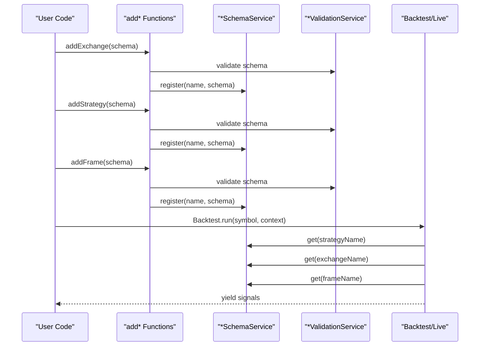
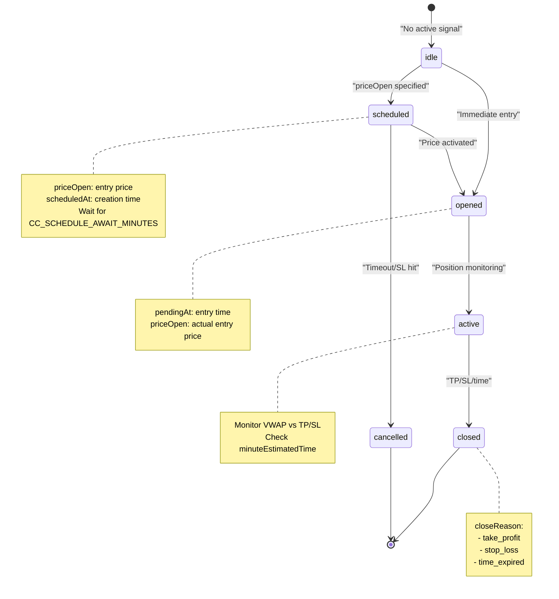
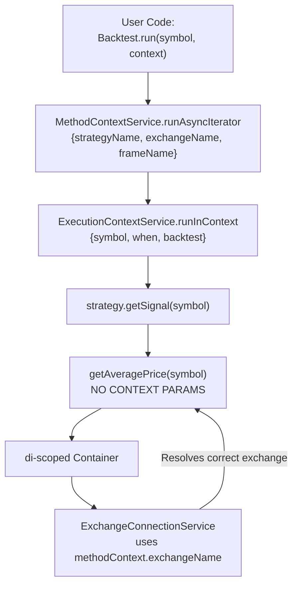

# Quick Start Guide

<details>
<summary>Relevant source files</summary>

The following files were used as context for generating this wiki page:

- [README.md](README.md)
- [src/classes/Schedule.ts](src/classes/Schedule.ts)
- [src/function/add.ts](src/function/add.ts)
- [src/function/list.ts](src/function/list.ts)
- [src/index.ts](src/index.ts)
- [src/lib/core/provide.ts](src/lib/core/provide.ts)
- [src/lib/core/types.ts](src/lib/core/types.ts)
- [src/lib/index.ts](src/lib/index.ts)
- [src/lib/services/global/WalkerGlobalService.ts](src/lib/services/global/WalkerGlobalService.ts)
- [src/lib/services/markdown/BacktestMarkdownService.ts](src/lib/services/markdown/BacktestMarkdownService.ts)
- [src/lib/services/markdown/LiveMarkdownService.ts](src/lib/services/markdown/LiveMarkdownService.ts)
- [src/lib/services/markdown/ScheduleMarkdownService.ts](src/lib/services/markdown/ScheduleMarkdownService.ts)
- [test/index.mjs](test/index.mjs)
- [test/spec/scheduled.test.mjs](test/spec/scheduled.test.mjs)
- [types.d.ts](types.d.ts)

</details>


**Purpose**: This guide provides a minimal working example to get you started with backtest-kit. You will learn how to register components (exchange, strategy, frame), run a backtest, and listen to events. After completing this guide, you will have a functioning backtest that generates trading signals and calculates performance metrics.

**Scope**: This guide covers only the essential steps to run your first backtest. For detailed explanations of execution modes, see [Execution Modes](#2.1). For signal lifecycle details, see [Signal Lifecycle Overview](#2.2). For component registration details, see [Component Registration](#2.3).

## Minimal Working Example

Here's a complete working example that demonstrates the core workflow:

```typescript
import {
  addExchange,
  addStrategy,
  addFrame,
  Backtest,
  listenSignalBacktest,
  listenDoneBacktest,
  getAveragePrice,
} from "backtest-kit";
import ccxt from "ccxt";

// 1. Register exchange data source
addExchange({
  exchangeName: "binance",
  getCandles: async (symbol, interval, since, limit) => {
    const exchange = new ccxt.binance();
    const ohlcv = await exchange.fetchOHLCV(symbol, interval, since.getTime(), limit);
    return ohlcv.map(([timestamp, open, high, low, close, volume]) => ({
      timestamp, open, high, low, close, volume
    }));
  },
  formatPrice: async (symbol, price) => price.toFixed(2),
  formatQuantity: async (symbol, quantity) => quantity.toFixed(8),
});

// 2. Register trading strategy
addStrategy({
  strategyName: "simple-breakout",
  interval: "5m",
  getSignal: async (symbol) => {
    const price = await getAveragePrice(symbol);
    return {
      position: "long",
      note: "Breakout signal",
      priceTakeProfit: price * 1.02,  // 2% profit target
      priceStopLoss: price * 0.98,    // 2% stop loss
      minuteEstimatedTime: 60,
    };
  },
});

// 3. Register timeframe for backtesting
addFrame({
  frameName: "1d-backtest",
  interval: "1m",
  startDate: new Date("2024-01-01T00:00:00Z"),
  endDate: new Date("2024-01-02T00:00:00Z"),
});

// 4. Listen to events
listenSignalBacktest((event) => {
  if (event.action === "closed") {
    console.log(`Signal closed: ${event.pnl.pnlPercentage}%`);
  }
});

listenDoneBacktest((event) => {
  console.log("Backtest completed:", event.symbol);
  Backtest.dump(event.strategyName);
});

// 5. Run backtest in background
Backtest.background("BTCUSDT", {
  strategyName: "simple-breakout",
  exchangeName: "binance",
  frameName: "1d-backtest",
});
```

**Sources**: [README.md:94-185](), [test/spec/backtest.test.mjs:1-50](), [src/function/add.ts:1-342]()

## Component Registration Flow

The framework uses a registration-first architecture. You must register all components before execution using the `add*` functions:



### Registration Functions

| Function | Purpose | Key Parameters | File Reference |
|----------|---------|----------------|----------------|
| `addExchange()` | Register data source (CCXT, database, API) | `exchangeName`, `getCandles`, `formatPrice`, `formatQuantity` | [src/function/add.ts:99-111]() |
| `addStrategy()` | Register trading logic | `strategyName`, `interval`, `getSignal`, `callbacks` | [src/function/add.ts:50-62]() |
| `addFrame()` | Register backtest timeframe | `frameName`, `interval`, `startDate`, `endDate` | [src/function/add.ts:143-149]() |
| `addRisk()` | Register risk management rules | `riskName`, `validations`, `callbacks` | [src/function/add.ts:329-341]() |
| `addWalker()` | Register strategy comparison | `walkerName`, `strategies`, `metric` | [src/function/add.ts:188-200]() |

**Sources**: [src/function/add.ts:1-342](), [src/index.ts:1-5](), [types.d.ts:1-300]()

## Exchange Registration

The exchange provides candle data and price/quantity formatting. You can use CCXT for live data or a database for faster backtesting:

```typescript
// Option 1: CCXT (live or historical)
import ccxt from "ccxt";

addExchange({
  exchangeName: "binance",
  getCandles: async (symbol, interval, since, limit) => {
    const exchange = new ccxt.binance();
    const ohlcv = await exchange.fetchOHLCV(symbol, interval, since.getTime(), limit);
    return ohlcv.map(([timestamp, open, high, low, close, volume]) => ({
      timestamp, open, high, low, close, volume
    }));
  },
  formatPrice: async (symbol, price) => price.toFixed(2),
  formatQuantity: async (symbol, quantity) => quantity.toFixed(8),
});

// Option 2: Database (faster backtesting)
addExchange({
  exchangeName: "binance-db",
  getCandles: async (symbol, interval, since, limit) => {
    return await db.query(`
      SELECT timestamp, open, high, low, close, volume
      FROM candles
      WHERE symbol = $1 AND interval = $2 AND timestamp >= $3
      ORDER BY timestamp ASC LIMIT $4
    `, [symbol, interval, since, limit]);
  },
  formatPrice: async (symbol, price) => price.toFixed(2),
  formatQuantity: async (symbol, quantity) => quantity.toFixed(8),
});
```

**Key Concepts**:
- `getCandles()` must return array of `ICandleData` objects with `timestamp`, `open`, `high`, `low`, `close`, `volume`
- `formatPrice()` and `formatQuantity()` apply exchange-specific precision rules
- Exchange instances are memoized per `exchangeName` by `ExchangeConnectionService`

**Sources**: [README.md:262-301](), [types.d.ts:167-221](), [src/function/add.ts:99-111]()

## Strategy Registration

The strategy defines signal generation logic. The `getSignal()` function returns trade parameters or `null`:

```typescript
addStrategy({
  strategyName: "my-strategy",
  interval: "5m",  // Minimum time between getSignal() calls
  getSignal: async (symbol) => {
    const price = await getAveragePrice(symbol);
    
    // Return null for no signal
    if (someCondition) return null;
    
    // Return signal for immediate entry (market order)
    return {
      position: "long",
      note: "Breakout signal",
      priceTakeProfit: price * 1.02,
      priceStopLoss: price * 0.98,
      minuteEstimatedTime: 60,
    };
    
    // Or return signal with priceOpen for delayed entry (limit order)
    return {
      position: "long",
      note: "Limit order",
      priceOpen: price * 0.99,  // Wait for 1% pullback
      priceTakeProfit: price * 1.02,
      priceStopLoss: price * 0.98,
      minuteEstimatedTime: 60,
    };
  },
  callbacks: {
    onOpen: (symbol, signal, currentPrice, backtest) => {
      console.log(`Signal opened: ${signal.id}`);
    },
    onClose: (symbol, signal, priceClose, backtest) => {
      console.log(`Signal closed: ${priceClose}`);
    },
  },
});
```

**Signal Validation Rules** (automatic):
- Take Profit must be > priceOpen for long positions, < priceOpen for short
- Stop Loss must be < priceOpen for long positions, > priceOpen for short
- TP/SL distance constraints: `CC_MIN_TAKEPROFIT_DISTANCE_PERCENT`, `CC_MAX_STOPLOSS_DISTANCE_PERCENT`
- Maximum lifetime: `CC_MAX_SIGNAL_LIFETIME_MINUTES`

**Sources**: [README.md:306-333](), [types.d.ts:544-633](), [src/function/add.ts:50-62]()

## Frame Registration

The frame defines the backtest period and timestamp generation interval:

```typescript
addFrame({
  frameName: "1d-backtest",
  interval: "1m",  // Generate timestamps every 1 minute
  startDate: new Date("2024-01-01T00:00:00Z"),
  endDate: new Date("2024-01-02T00:00:00Z"),
  callbacks: {
    onTimeframe: (timeframe, startDate, endDate, interval) => {
      console.log(`Generated ${timeframe.length} timestamps`);
    },
  },
});
```

**Supported Intervals**: `"1m"`, `"3m"`, `"5m"`, `"15m"`, `"30m"`, `"1h"`, `"2h"`, `"4h"`, `"6h"`, `"8h"`, `"12h"`, `"1d"`, `"3d"`

**Sources**: [types.d.ts:284-341](), [src/function/add.ts:143-149]()

## Running Backtest

The framework provides two execution modes:

### Option 1: Background Mode (Recommended)

Runs backtest asynchronously with event-based output:

```typescript
// Start backtest in background
Backtest.background("BTCUSDT", {
  strategyName: "my-strategy",
  exchangeName: "binance",
  frameName: "1d-backtest",
});

// Listen to signals
listenSignalBacktest((event) => {
  if (event.action === "closed") {
    console.log(`PNL: ${event.pnl.pnlPercentage}%`);
  }
});

// Listen to completion
listenDoneBacktest((event) => {
  console.log("Backtest completed:", event.symbol);
  Backtest.dump(event.strategyName);  // Save markdown report
});
```

**Sources**: [README.md:339-358](), [test/spec/backtest.test.mjs:1-100]()

### Option 2: Generator Mode (Manual Control)

Use async generator for manual iteration and early termination:

```typescript
for await (const result of Backtest.run("BTCUSDT", {
  strategyName: "my-strategy",
  exchangeName: "binance",
  frameName: "1d-backtest",
})) {
  console.log(`PNL: ${result.pnl.pnlPercentage}%`);
  
  // Early termination example
  if (result.pnl.pnlPercentage < -5) {
    console.log("Stop loss threshold reached");
    break;
  }
}
```

**Sources**: [README.md:361-369]()

## Signal Lifecycle

Signals transition through states during execution:



**State Transitions**:

| From State | To State | Trigger | Event Emitted |
|------------|----------|---------|---------------|
| `idle` | `scheduled` | `getSignal()` returns signal with `priceOpen` | `onSchedule()` |
| `idle` | `opened` | `getSignal()` returns signal without `priceOpen` | `onOpen()` |
| `scheduled` | `opened` | Price reaches `priceOpen` | `onOpen()` |
| `scheduled` | `cancelled` | Timeout or stop loss hit before entry | `onCancel()` |
| `opened` | `active` | Position being monitored | `onActive()` |
| `active` | `closed` | TP/SL hit or time expired | `onClose()` |

**Sources**: [types.d.ts:544-774](), [README.md:54-68]()

## Event Listening

The framework emits events through RxJS-style `Subject` emitters:

```typescript
import { 
  listenSignalBacktest,
  listenDoneBacktest,
  listenError,
} from "backtest-kit";

// Listen to all backtest signals
listenSignalBacktest((event) => {
  switch (event.action) {
    case "opened":
      console.log(`Signal opened: ${event.signal.id}`);
      break;
    case "active":
      console.log(`Signal active: ${event.signal.id}`);
      break;
    case "closed":
      console.log(`Signal closed: ${event.closeReason}, PNL: ${event.pnl.pnlPercentage}%`);
      break;
  }
});

// Listen to backtest completion
listenDoneBacktest((event) => {
  console.log("Backtest completed:", {
    symbol: event.symbol,
    strategyName: event.strategyName,
    timestamp: event.timestamp,
  });
});

// Listen to errors
listenError((error) => {
  console.error("Error:", error);
});
```

**Available Event Listeners**:

| Function | Purpose | Event Type |
|----------|---------|------------|
| `listenSignal()` | All signals (backtest + live) | `IStrategyTickResult` |
| `listenSignalBacktest()` | Backtest signals only | `IStrategyTickResult` |
| `listenSignalLive()` | Live signals only | `IStrategyTickResult` |
| `listenDoneBacktest()` | Backtest completion | `DoneContract` |
| `listenDoneLive()` | Live completion | `DoneContract` |
| `listenError()` | All errors | `Error` |

**Sources**: [src/function/event.ts:1-200](), [types.d.ts:1-100]()

## Generating Reports

After backtest completion, generate and save markdown reports:

```typescript
// Get statistics
const stats = await Backtest.getData("my-strategy");
console.log("Win rate:", stats.winRate);
console.log("Sharpe ratio:", stats.sharpeRatio);
console.log("Total PNL:", stats.totalPnl);

// Generate markdown report
const markdown = await Backtest.getReport("my-strategy");
console.log(markdown);

// Save to disk (default: ./logs/backtest/my-strategy.md)
await Backtest.dump("my-strategy");

// Save to custom path
await Backtest.dump("my-strategy", "./custom/path");
```

**Report Contents**:
- Table of all closed signals with prices, PNL, duration
- Win rate, average PNL, total PNL
- Standard deviation, Sharpe ratio, annualized Sharpe ratio
- Certainty ratio (avgWin / |avgLoss|)
- Expected yearly returns

**Sources**: [README.md:339-369](), [src/lib/services/markdown/BacktestMarkdownService.ts:1-533](), [types.d.ts:846-871]()

## Context Propagation (Advanced)

The framework uses `di-scoped` for implicit context propagation. You don't need to pass context parameters explicitly:

```typescript
// Inside strategy.getSignal()
const price = await getAveragePrice(symbol);  // No context params needed!

// Framework automatically provides:
// - executionContext: { symbol, when: timestamp, backtest: true/false }
// - methodContext: { strategyName, exchangeName, frameName }
```

**How It Works**:



**Benefits**:
- Clean API: No parameter drilling through layers
- Time-travel: Same code works for backtest (historical) and live (real-time)
- Automatic routing: Framework resolves correct component instances

For details, see [Context Propagation](#3.3).

**Sources**: [types.d.ts:100-143](), [types.d.ts:362-403](), [README.md:29-30]()

## Next Steps

Now that you have a working backtest, explore these topics:

1. **Execution Modes**: Learn about [Backtest](#2.1), [Live Trading](#2.1), and [Walker](#2.1) modes
2. **Signal Lifecycle**: Deep dive into [signal states and transitions](#2.2)
3. **Risk Management**: Add portfolio-level controls with [Risk Schemas](#5.4)
4. **Position Sizing**: Calculate optimal position sizes with [Sizing Schemas](#5.5)
5. **Live Trading**: Deploy strategies with [Live Trading API](#4.4) and crash-safe persistence
6. **Strategy Comparison**: Compare multiple strategies with [Walker API](#4.5)

**Complete Example Projects**: See [README.md:84-257]() for full working examples including CCXT integration, database sources, and advanced features.

**Sources**: [README.md:1-257](), [types.d.ts:1-1000]()