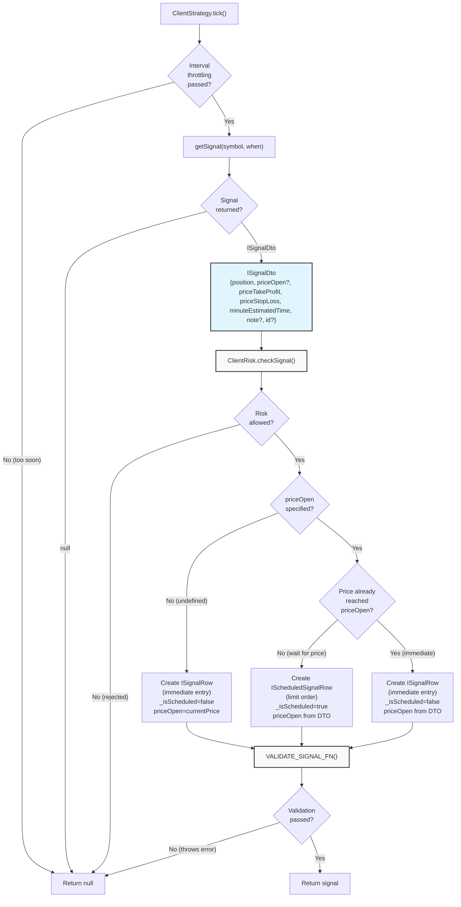
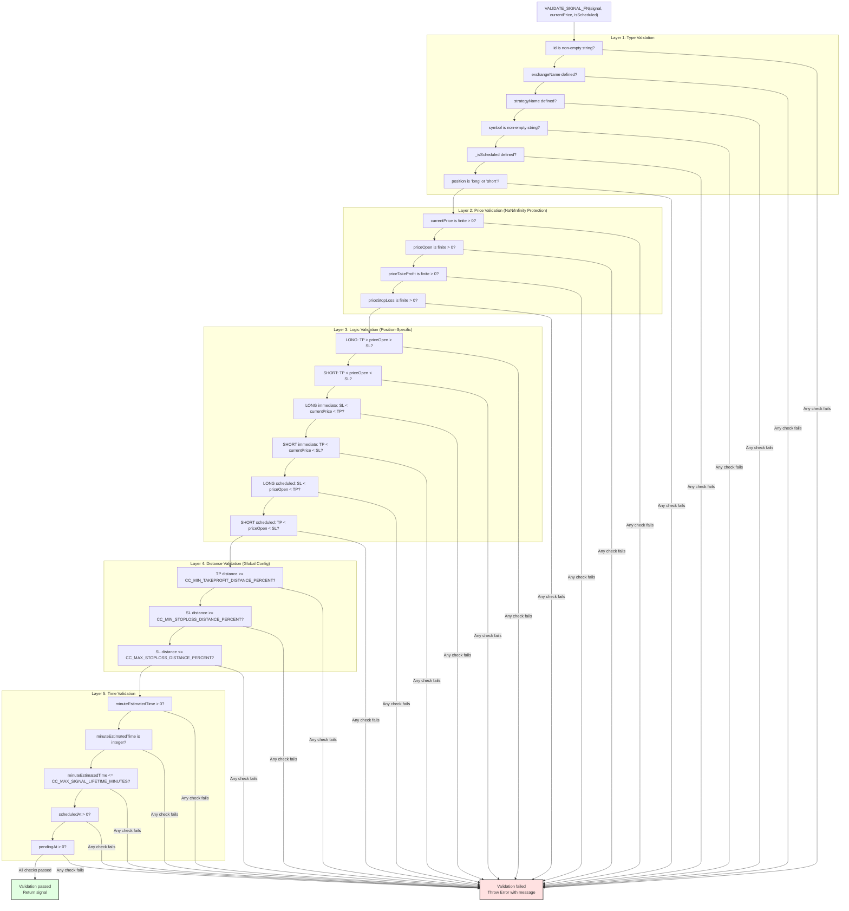
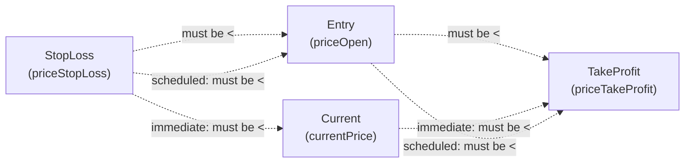
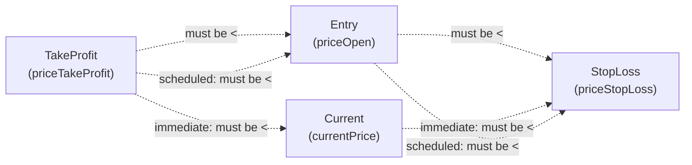
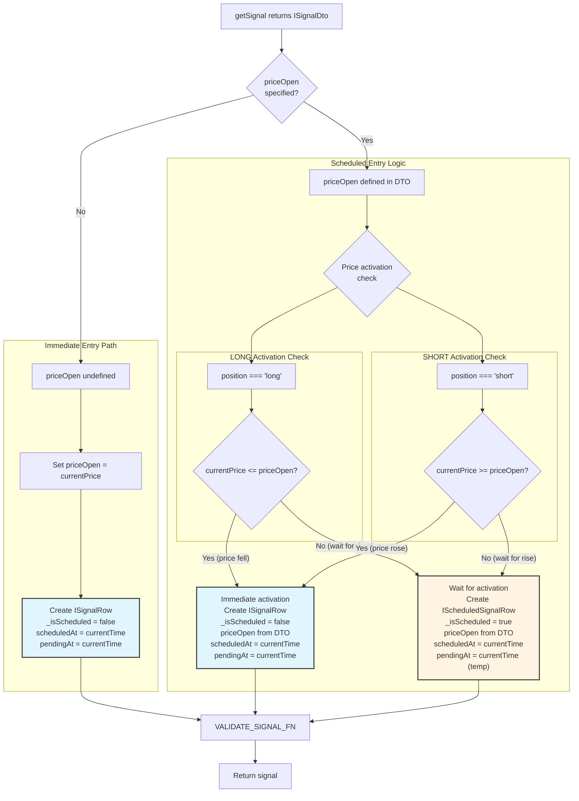
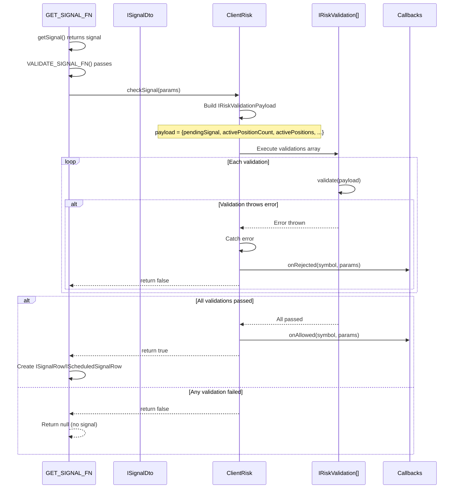
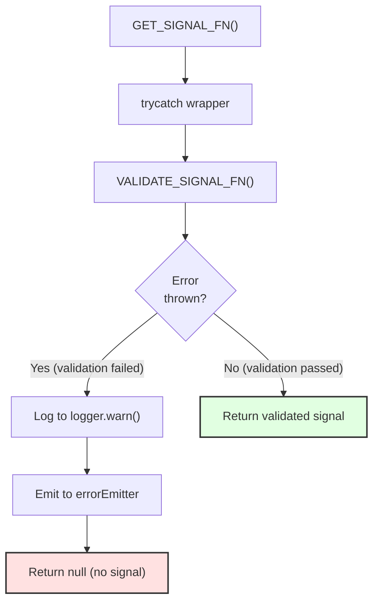

# Signal Generation and Validation

<details>
<summary>Relevant source files</summary>

The following files were used as context for generating this wiki page:

- [README.md](README.md)
- [src/client/ClientStrategy.ts](src/client/ClientStrategy.ts)
- [src/config/emitters.ts](src/config/emitters.ts)
- [src/function/event.ts](src/function/event.ts)
- [src/index.ts](src/index.ts)
- [src/interfaces/Strategy.interface.ts](src/interfaces/Strategy.interface.ts)
- [test/e2e/defend.test.mjs](test/e2e/defend.test.mjs)
- [test/index.mjs](test/index.mjs)
- [types.d.ts](types.d.ts)

</details>


This page documents the signal generation process and the multi-layer validation pipeline that ensures all trading signals meet safety and logical requirements before execution. Signal generation occurs in the `getSignal` function defined in `IStrategySchema`, and validation is performed by `VALIDATE_SIGNAL_FN` within `ClientStrategy`.

**Scope**: This page covers the mechanics of signal creation from `getSignal()` through validation. For information about signal state transitions after validation, see [Signal States](#8.1). For the actual risk checking integration, see [Risk Management](#12). For signal persistence after validation, see [Signal Persistence](#8.4).

---

## Signal Generation Overview

Signal generation is the entry point for all trading decisions. The `getSignal` function is called by `ClientStrategy` at intervals specified by the strategy's `interval` parameter, respecting throttling limits to prevent excessive signal generation.

### Signal Generation Flow Diagram



**Sources**: [src/client/ClientStrategy.ts:332-476]()

---

## Signal Data Transfer Object (ISignalDto)

The `getSignal` function returns an `ISignalDto` object containing the signal parameters. This DTO is then validated and augmented with metadata to create an `ISignalRow`.

### ISignalDto Structure

| Field | Type | Required | Description |
|-------|------|----------|-------------|
| `id` | `string` | No | Optional signal ID (UUID v4 auto-generated if omitted) |
| `position` | `"long" \| "short"` | Yes | Trade direction: "long" for buy, "short" for sell |
| `note` | `string` | No | Human-readable description of signal reason |
| `priceOpen` | `number` | No | Entry price for limit order. If omitted, opens immediately at current VWAP |
| `priceTakeProfit` | `number` | Yes | Target exit price for profit |
| `priceStopLoss` | `number` | Yes | Exit price for loss protection |
| `minuteEstimatedTime` | `number` | Yes | Expected duration in minutes before time expiration |

**Sources**: [src/interfaces/Strategy.interface.ts:20-39](), [types.d.ts:649-667]()

### Augmented Signal Row (ISignalRow)

After validation, `ISignalDto` is augmented with system metadata to create `ISignalRow`:

| Additional Field | Type | Description |
|-----------------|------|-------------|
| `id` | `string` | Guaranteed non-empty (generated if missing) |
| `priceOpen` | `number` | Guaranteed defined (set to currentPrice if omitted) |
| `exchangeName` | `ExchangeName` | Exchange identifier from strategy context |
| `strategyName` | `StrategyName` | Strategy identifier from strategy context |
| `symbol` | `string` | Trading pair symbol (e.g., "BTCUSDT") |
| `scheduledAt` | `number` | Signal creation timestamp (milliseconds) |
| `pendingAt` | `number` | Position activation timestamp (milliseconds) |
| `_isScheduled` | `boolean` | Internal marker for scheduled signals |

**Sources**: [src/interfaces/Strategy.interface.ts:41-62](), [src/client/ClientStrategy.ts:400-456]()

---

## Validation Pipeline (VALIDATE_SIGNAL_FN)

The validation function `VALIDATE_SIGNAL_FN` performs comprehensive safety checks before a signal is allowed to proceed. This function throws an error if any validation fails, preventing invalid signals from being executed.

### Validation Layers



**Sources**: [src/client/ClientStrategy.ts:45-330]()

---

## Layer 1: Type Validation

Type validation ensures all required fields are present and have valid types. This prevents runtime errors from missing or malformed data.

### Required Field Checks

```typescript
// Example validation checks (pseudocode from VALIDATE_SIGNAL_FN)
if (signal.id === undefined || signal.id === null || signal.id === '') {
  errors.push('id is required and must be a non-empty string');
}

if (signal.position !== "long" && signal.position !== "short") {
  errors.push(`position must be "long" or "short", got "${signal.position}"`);
}
```

**Validation Rules**:
- `id`: Must be non-empty string (auto-generated if missing in DTO, but required in ISignalRow)
- `exchangeName`: Must be defined and non-empty
- `strategyName`: Must be defined and non-empty
- `symbol`: Must be defined and non-empty string
- `_isScheduled`: Must be boolean
- `position`: Must be exactly `"long"` or `"short"` (no other values allowed)

**Sources**: [src/client/ClientStrategy.ts:48-70]()

---

## Layer 2: Price Validation (NaN/Infinity Protection)

Price validation protects against `NaN` and `Infinity` values that could cause financial losses or system crashes. All price fields must be finite positive numbers.

### Price Safety Checks

| Check | Purpose | Example Error |
|-------|---------|---------------|
| `isFinite(currentPrice)` | Prevent NaN/Infinity in current market price | "currentPrice must be a finite number, got NaN" |
| `currentPrice > 0` | Prevent negative or zero prices | "currentPrice must be positive, got -42000" |
| `isFinite(priceOpen)` | Prevent NaN/Infinity in entry price | "priceOpen must be a finite number, got Infinity" |
| `priceOpen > 0` | Prevent negative or zero entry | "priceOpen must be positive, got 0" |
| `isFinite(priceTakeProfit)` | Prevent NaN/Infinity in TP | "priceTakeProfit must be a finite number" |
| `priceTakeProfit > 0` | Prevent negative or zero TP | "priceTakeProfit must be positive" |
| `isFinite(priceStopLoss)` | Prevent NaN/Infinity in SL | "priceStopLoss must be a finite number" |
| `priceStopLoss > 0` | Prevent negative or zero SL | "priceStopLoss must be positive" |

**Critical Protection**: These checks prevent catastrophic scenarios:
- **Zero StopLoss**: Would allow unlimited losses in flash crashes
- **NaN prices**: Would cause position to never close (TP/SL comparisons always false)
- **Infinity prices**: Would cause position to never trigger TP or SL

**Sources**: [src/client/ClientStrategy.ts:71-109]()

---

## Layer 3: Logic Validation (Position-Specific Rules)

Logic validation enforces the mathematical relationships between prices based on position direction. LONG and SHORT positions have opposite requirements.

### LONG Position Rules



**LONG Position Requirements**:
1. **Basic**: `priceStopLoss < priceOpen < priceTakeProfit`
   - Buy low, sell higher for profit
   - Exit low to cut losses
2. **Immediate Entry**: `priceStopLoss < currentPrice < priceTakeProfit`
   - Current price must be between SL and TP
   - Prevents opening positions that would close immediately
3. **Scheduled Entry**: `priceStopLoss < priceOpen < priceTakeProfit`
   - Entry price must be between SL and TP
   - Prevents limit orders that would activate and close immediately

**Example Error Messages**:
```
Long: priceTakeProfit (42000) must be > priceOpen (43000)
Long immediate: currentPrice (41000) <= priceStopLoss (41500). 
  Signal would be immediately closed by stop loss.
Long scheduled: priceOpen (40000) <= priceStopLoss (40500). 
  Signal would be immediately cancelled on activation.
```

**Sources**: [src/client/ClientStrategy.ts:111-200]()

### SHORT Position Rules



**SHORT Position Requirements**:
1. **Basic**: `priceTakeProfit < priceOpen < priceStopLoss`
   - Sell high, buy back lower for profit
   - Exit high to cut losses
2. **Immediate Entry**: `priceTakeProfit < currentPrice < priceStopLoss`
   - Current price must be between TP and SL
   - Prevents opening positions that would close immediately
3. **Scheduled Entry**: `priceTakeProfit < priceOpen < priceStopLoss`
   - Entry price must be between TP and SL
   - Prevents limit orders that would activate and close immediately

**Example Error Messages**:
```
Short: priceTakeProfit (44000) must be < priceOpen (43000)
Short immediate: currentPrice (45000) >= priceStopLoss (44500). 
  Signal would be immediately closed by stop loss.
Short scheduled: priceOpen (46000) >= priceStopLoss (45500). 
  Signal would be immediately cancelled on activation.
```

**Sources**: [src/client/ClientStrategy.ts:202-291]()

---

## Layer 4: Distance Validation (Global Config)

Distance validation enforces minimum and maximum distances between prices to prevent unprofitable or overly risky trades. These thresholds are configured globally via `setConfig()`.

### Distance Validation Rules

| Validation | Config Parameter | Purpose |
|------------|-----------------|---------|
| Minimum TP Distance | `CC_MIN_TAKEPROFIT_DISTANCE_PERCENT` | Ensures TP is far enough to cover fees + slippage (default: no minimum) |
| Minimum SL Distance | `CC_MIN_STOPLOSS_DISTANCE_PERCENT` | Prevents micro-SL that triggers on normal volatility (default: no minimum) |
| Maximum SL Distance | `CC_MAX_STOPLOSS_DISTANCE_PERCENT` | Caps maximum loss per trade to protect capital (default: no maximum) |

### Minimum TakeProfit Distance

**Calculation** (LONG):
```typescript
const tpDistancePercent = ((priceTakeProfit - priceOpen) / priceOpen) * 100;
// Example: ((43000 - 42000) / 42000) * 100 = 2.38%
```

**Calculation** (SHORT):
```typescript
const tpDistancePercent = ((priceOpen - priceTakeProfit) / priceOpen) * 100;
// Example: ((43000 - 42000) / 43000) * 100 = 2.33%
```

**Protection**: With fees (0.1%) + slippage (0.1%) = 0.2% total overhead, a minimum TP distance (e.g., 0.5%) ensures trades can be profitable after costs.

**Sources**: [src/client/ClientStrategy.ts:163-173](), [src/client/ClientStrategy.ts:254-263]()

### Minimum StopLoss Distance

**Purpose**: Prevents "micro-stoploss" that triggers on normal market volatility before the trade has a chance to succeed.

**Example**: If `CC_MIN_STOPLOSS_DISTANCE_PERCENT = 0.3`, then:
- LONG at 42000 requires SL ≤ 41874 (0.3% away)
- SHORT at 43000 requires SL ≥ 43129 (0.3% away)

**Error Example**:
```
Long: StopLoss too close to priceOpen (0.120%). 
  Minimum distance: 0.300% to avoid instant stop out on market volatility. 
  Current: SL=41950, Open=42000
```

**Sources**: [src/client/ClientStrategy.ts:176-186](), [src/client/ClientStrategy.ts:266-276]()

### Maximum StopLoss Distance

**Purpose**: Caps the maximum loss per trade to prevent catastrophic losses from a single position.

**Example**: If `CC_MAX_STOPLOSS_DISTANCE_PERCENT = 5.0`, then:
- LONG at 42000 requires SL ≥ 39900 (5% maximum loss)
- SHORT at 43000 requires SL ≤ 45150 (5% maximum loss)

**Risk Management**: Protects portfolio from single-trade wipeout scenarios. Combined with position sizing, this enforces maximum risk per trade.

**Error Example**:
```
Long: StopLoss too far from priceOpen (8.500%). 
  Maximum distance: 5.000% to protect capital. 
  Current: SL=38430, Open=42000
```

**Sources**: [src/client/ClientStrategy.ts:189-199](), [src/client/ClientStrategy.ts:279-290]()

---

## Layer 5: Time Validation

Time validation ensures signal lifetime parameters are reasonable and prevents pathological edge cases like eternal signals or instant timeouts.

### Time Parameter Checks

| Check | Requirement | Protection |
|-------|------------|------------|
| `minuteEstimatedTime > 0` | Positive duration | Prevents instant timeout (0 minutes = immediate close) |
| `Number.isInteger(minuteEstimatedTime)` | Whole number | Ensures precise minute-based timing |
| `minuteEstimatedTime <= CC_MAX_SIGNAL_LIFETIME_MINUTES` | Maximum duration cap | Prevents eternal signals that block risk limits indefinitely |
| `scheduledAt > 0` | Valid timestamp | Ensures signal creation time is tracked |
| `pendingAt > 0` | Valid timestamp | Ensures activation time is tracked |

### Maximum Signal Lifetime Protection

**Configuration**: `CC_MAX_SIGNAL_LIFETIME_MINUTES` (default: undefined = unlimited)

**Problem**: Signals with extremely long `minuteEstimatedTime` (e.g., 43200 minutes = 30 days) can:
- Block risk limit slots for weeks
- Prevent new signals from opening
- Create "zombie positions" that never close
- Tie up capital indefinitely

**Example Error**:
```
minuteEstimatedTime too large (43200 minutes = 30.0 days). 
  Maximum: 10080 minutes (7 days) to prevent strategy deadlock. 
  Eternal signals block risk limits and prevent new trades.
```

**Sources**: [src/client/ClientStrategy.ts:294-323]()

---

## Scheduled vs Immediate Signal Logic

The signal generation logic determines whether to create an immediate entry (`_isScheduled=false`) or a scheduled entry (`_isScheduled=true`) based on the `priceOpen` parameter and current market price.

### Signal Type Decision Tree



### Immediate Entry (Market Order)

**Trigger**: `priceOpen` is `undefined` in `ISignalDto`

**Behavior**:
1. System fetches current VWAP price via `exchange.getAveragePrice(symbol)`
2. Sets `priceOpen = currentPrice`
3. Creates `ISignalRow` with `_isScheduled = false`
4. Position opens immediately on next tick
5. Both `scheduledAt` and `pendingAt` are set to same timestamp

**Use Case**: Market orders that execute at current market price without waiting.

**Sources**: [src/client/ClientStrategy.ts:445-461]()

### Scheduled Entry (Limit Order) - Wait for Activation

**Trigger**: `priceOpen` is specified AND price has NOT yet reached entry point

**Conditions**:
- **LONG**: `currentPrice > priceOpen` (waiting for price to fall)
- **SHORT**: `currentPrice < priceOpen` (waiting for price to rise)

**Behavior**:
1. Creates `IScheduledSignalRow` with `_isScheduled = true`
2. `priceOpen` is stored from DTO
3. `scheduledAt = currentTime` (signal creation time)
4. `pendingAt = currentTime` (temporary, will update on activation)
5. Signal waits in scheduled state until price reaches `priceOpen`

**Use Case**: Limit orders that wait for better entry price before activating.

**Sources**: [src/client/ClientStrategy.ts:423-442]()

### Scheduled Entry (Limit Order) - Immediate Activation

**Trigger**: `priceOpen` is specified AND price has ALREADY reached entry point

**Conditions**:
- **LONG**: `currentPrice <= priceOpen` (price already fell to entry)
- **SHORT**: `currentPrice >= priceOpen` (price already rose to entry)

**Behavior**:
1. Creates `ISignalRow` (not `IScheduledSignalRow`)
2. `_isScheduled = false` (activates immediately)
3. `priceOpen` from DTO (uses specified entry price, not current price)
4. Both `scheduledAt` and `pendingAt` set to current time
5. Position opens immediately without waiting

**Critical Logic**: This prevents the system from creating a scheduled signal when the target price has already been reached. Instead, it treats it as an immediate entry at the specified `priceOpen`.

**Sources**: [src/client/ClientStrategy.ts:389-420]()

---

## Risk Validation Integration

After the internal validation checks pass, the signal must also pass risk management checks via `ClientRisk.checkSignal()`. This is a separate validation layer that enforces portfolio-level constraints.

### Risk Check Flow



**Risk Check Parameters** (`IRiskCheckArgs`):
- `symbol`: Trading pair
- `pendingSignal`: The `ISignalDto` being validated
- `strategyName`: Strategy requesting the signal
- `exchangeName`: Exchange identifier
- `currentPrice`: Current VWAP price
- `timestamp`: Current time in milliseconds

**Risk Payload** (`IRiskValidationPayload` extends `IRiskCheckArgs`):
- `activePositionCount`: Number of currently open positions
- `activePositions`: Array of `IRiskActivePosition` objects with signal details

**Rejection Behavior**:
- If risk check fails, `checkSignal()` returns `false`
- Signal generation aborts and returns `null`
- No signal is created or persisted
- Risk callbacks (`onRejected`) are fired for monitoring

**Sources**: [src/client/ClientStrategy.ts:374-387](), [src/interfaces/Risk.interface.ts:339-397]()

---

## Error Handling and Recovery

Validation errors are caught by `trycatch()` wrapper around `GET_SIGNAL_FN`, preventing crashes and enabling graceful degradation.

### Error Handling Flow



**Error Handling Behavior**:
1. **Catch**: `trycatch()` wrapper catches all exceptions in signal generation
2. **Log**: Error logged via `backtest.loggerService.warn()`
3. **Emit**: Error emitted via `errorEmitter.next(error)` for monitoring
4. **Default**: Returns `null` (no signal) instead of crashing
5. **Continue**: Strategy continues processing future ticks

**Example Error Log**:
```javascript
{
  message: "ClientStrategy exception thrown",
  payload: {
    error: { ... },
    message: "Invalid signal for long position:\nLong: priceTakeProfit (42000) must be > priceOpen (43000)"
  }
}
```

**Sources**: [src/client/ClientStrategy.ts:332-476](), [src/client/ClientStrategy.ts:463-475]()

---

## Validation Test Coverage

The validation pipeline is extensively tested to ensure all edge cases are handled correctly and financial safety is maintained.

### Critical Test Scenarios

| Test Category | Test Case | File Reference |
|---------------|-----------|----------------|
| **LONG Logic** | Limit order activates BEFORE StopLoss | [test/e2e/defend.test.mjs:26-146]() |
| **SHORT Logic** | Limit order activates BEFORE StopLoss | [test/e2e/defend.test.mjs:158-278]() |
| **Instant TP** | Scheduled signal activated and closed on same candle | [test/e2e/defend.test.mjs:291-439]() |
| **Timeout** | Scheduled signal cancelled at 120min boundary | [test/e2e/defend.test.mjs:446-537]() |
| **Invalid TP** | LONG signal rejected (TP below priceOpen) | [test/e2e/defend.test.mjs:545-642]() |
| **Invalid TP** | SHORT signal rejected (TP above priceOpen) | [test/e2e/defend.test.mjs:649-744]() |
| **Invalid SL** | LONG signal rejected (SL >= priceOpen) | [test/e2e/defend.test.mjs:752-846]() |
| **Zero SL** | Signal rejected (StopLoss = 0) | [test/e2e/defend.test.mjs:858-950]() |
| **Inverted Logic** | SHORT signal rejected (TP > priceOpen) | [test/e2e/defend.test.mjs:963-1057]() |
| **Zero Time** | Signal rejected (minuteEstimatedTime = 0) | [test/e2e/defend.test.mjs:1069-1162]() |
| **Equal TP** | Signal rejected (TP equals priceOpen) | [test/e2e/defend.test.mjs:1174-1269]() |
| **SL Cancellation** | Scheduled LONG cancelled by SL before activation | [test/e2e/defend.test.mjs:1393-1507]() |
| **Extreme Volatility** | Price crosses both TP and SL (TP wins) | [test/e2e/defend.test.mjs:1520-1653]() |
| **Infrastructure** | Exchange.getCandles throws error | [test/e2e/defend.test.mjs:1664-1743]() |

**Test Philosophy**: Each test validates that the system **rejects** invalid signals before they can cause financial harm. Tests verify error messages contain actionable information.

**Sources**: [test/e2e/defend.test.mjs:1-1860]()

---

## Code Entity Reference

### Key Functions

| Function | Location | Purpose |
|----------|----------|---------|
| `GET_SIGNAL_FN` | [src/client/ClientStrategy.ts:332-476]() | Main signal generation logic with throttling and risk checks |
| `VALIDATE_SIGNAL_FN` | [src/client/ClientStrategy.ts:45-330]() | Multi-layer validation pipeline |
| `getSignal` (user-defined) | `IStrategySchema.getSignal` | User-provided signal generation callback |

### Key Types

| Type | Location | Description |
|------|----------|-------------|
| `ISignalDto` | [src/interfaces/Strategy.interface.ts:24-39]() | Signal data transfer object from getSignal |
| `ISignalRow` | [src/interfaces/Strategy.interface.ts:45-62]() | Validated signal with metadata |
| `IScheduledSignalRow` | [src/interfaces/Strategy.interface.ts:70-73]() | Scheduled signal awaiting activation |
| `IRiskCheckArgs` | [types.d.ts:339-356]() | Risk validation parameters |
| `IRiskValidationPayload` | [types.d.ts:380-390]() | Extended risk check with portfolio state |

### Configuration Constants

| Constant | Type | Purpose |
|----------|------|---------|
| `CC_MIN_TAKEPROFIT_DISTANCE_PERCENT` | `number \| undefined` | Minimum TP distance percentage |
| `CC_MIN_STOPLOSS_DISTANCE_PERCENT` | `number \| undefined` | Minimum SL distance percentage |
| `CC_MAX_STOPLOSS_DISTANCE_PERCENT` | `number \| undefined` | Maximum SL distance percentage |
| `CC_MAX_SIGNAL_LIFETIME_MINUTES` | `number \| undefined` | Maximum signal duration |
| `CC_SCHEDULE_AWAIT_MINUTES` | `number` | Scheduled signal timeout (default: 120) |

**Sources**: [src/config/params.ts](), [types.d.ts:179-184]()

---

## Best Practices for Signal Generation

### DO: Return Null for No Signal

```typescript
addStrategy({
  strategyName: "example",
  interval: "5m",
  getSignal: async (symbol, when) => {
    const candles = await getCandles(symbol, "1h", 24);
    
    // Calculate indicators
    const rsi = calculateRSI(candles);
    
    // No signal condition
    if (rsi > 30 && rsi < 70) {
      return null; // ✅ Return null when no trade opportunity
    }
    
    // Signal condition
    return {
      position: "long",
      priceTakeProfit: currentPrice * 1.02,
      priceStopLoss: currentPrice * 0.98,
      minuteEstimatedTime: 60,
      note: `RSI ${rsi.toFixed(2)} oversold`
    };
  }
});
```

### DO: Use priceOpen for Limit Orders

```typescript
// Wait for better entry price
return {
  position: "long",
  priceOpen: 42000,        // ✅ Wait for price to drop to 42000
  priceTakeProfit: 43000,
  priceStopLoss: 41000,
  minuteEstimatedTime: 120,
  note: "Limit order at 42000"
};
```

### DO: Respect Validation Constraints

```typescript
const currentPrice = await getAveragePrice(symbol);

return {
  position: "long",
  // ✅ TP is 2% above entry (covers fees + slippage)
  priceTakeProfit: currentPrice * 1.02,
  // ✅ SL is 1% below entry (reasonable risk)
  priceStopLoss: currentPrice * 0.99,
  // ✅ Integer minutes, reasonable duration
  minuteEstimatedTime: 60,
  note: "Valid signal parameters"
};
```

### DON'T: Return Equal TP and priceOpen

```typescript
// ❌ WRONG: TP equals entry = zero profit
return {
  position: "long",
  priceOpen: 42000,
  priceTakeProfit: 42000, // ❌ No profit, only fees!
  priceStopLoss: 41000,
  minuteEstimatedTime: 60
};
// This will be REJECTED by validation
```

### DON'T: Use Inverted Logic

```typescript
// ❌ WRONG: SHORT with TP > priceOpen
return {
  position: "short",
  priceOpen: 42000,
  priceTakeProfit: 43000, // ❌ SHORT needs TP < priceOpen!
  priceStopLoss: 44000,
  minuteEstimatedTime: 60
};
// This will be REJECTED by validation
```

### DON'T: Generate Eternal Signals

```typescript
// ❌ WRONG: 30 days = blocks risk limits for a month
return {
  position: "long",
  priceOpen: 42000,
  priceTakeProfit: 45000,
  priceStopLoss: 40000,
  minuteEstimatedTime: 43200 // ❌ 30 days!
};
// This will be REJECTED if CC_MAX_SIGNAL_LIFETIME_MINUTES is set
```

**Sources**: [README.md:86-143](), [test/e2e/defend.test.mjs]()