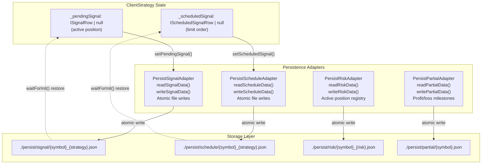
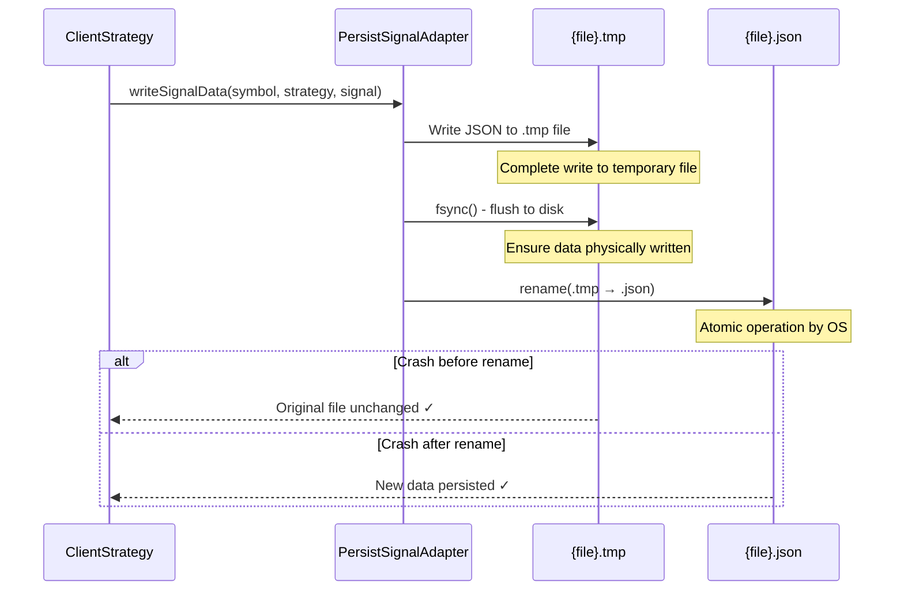
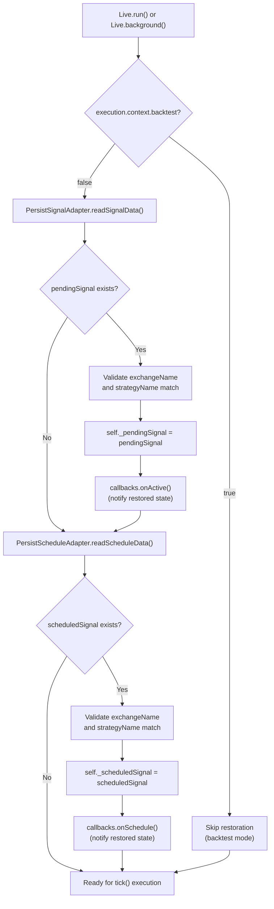
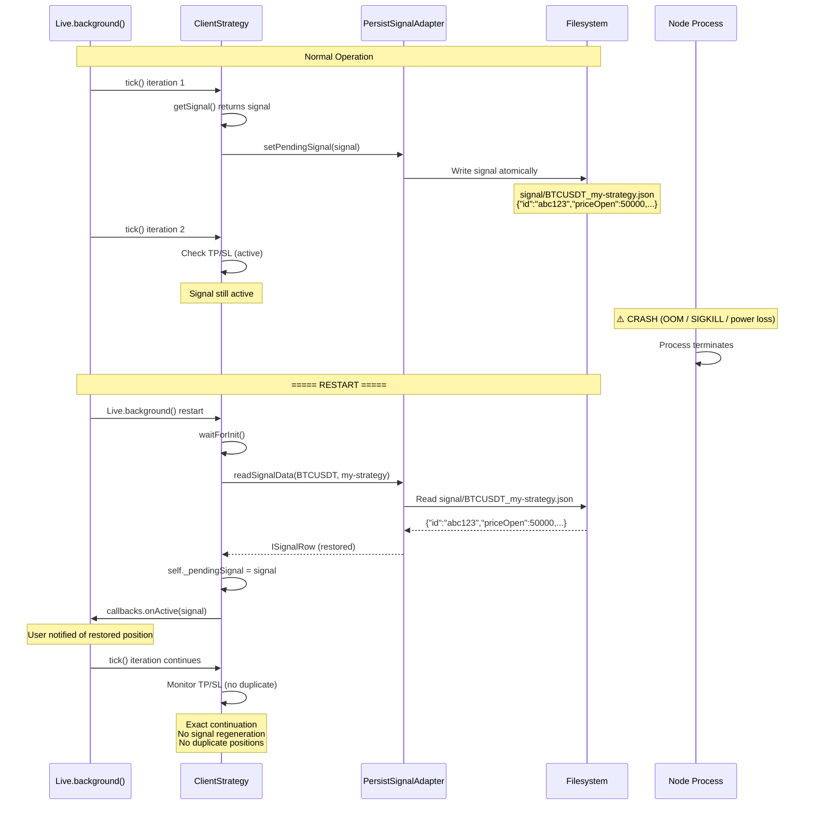
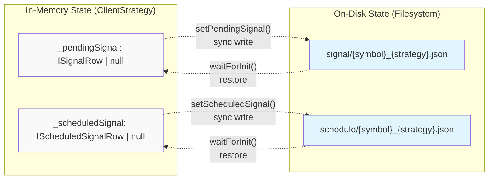

# Signal Persistence

<details>
<summary>Relevant source files</summary>

The following files were used as context for generating this wiki page:

- [README.md](README.md)
- [src/client/ClientStrategy.ts](src/client/ClientStrategy.ts)
- [src/interfaces/Strategy.interface.ts](src/interfaces/Strategy.interface.ts)
- [src/lib/services/markdown/BacktestMarkdownService.ts](src/lib/services/markdown/BacktestMarkdownService.ts)
- [src/lib/services/markdown/LiveMarkdownService.ts](src/lib/services/markdown/LiveMarkdownService.ts)
- [src/lib/services/markdown/ScheduleMarkdownService.ts](src/lib/services/markdown/ScheduleMarkdownService.ts)
- [types.d.ts](types.d.ts)

</details>


**Purpose:** This page explains the persistence layer that enables crash-safe state management in live trading mode. Signal persistence ensures that active positions, scheduled signals, and risk state survive process crashes and can be restored exactly on restart, preventing duplicate signals and maintaining portfolio integrity.

**Scope:** Covers `PersistSignalAdapter`, `PersistScheduleAdapter`, `PersistRiskAdapter`, and `PersistPartialAdapter` implementations, atomic write operations, the `waitForInit()` initialization pattern, and state restoration mechanisms. For signal lifecycle states, see [Signal States](#8.1). For live execution flow, see [Live Execution Flow](#10.1).

---

## Persistence Architecture

Signal persistence operates exclusively in **live mode** (not backtest mode) to maintain crash-safe state across process restarts. The system uses four specialized adapters to persist different aspects of trading state:



**Sources:** [src/client/ClientStrategy.ts:411-472](), [types.d.ts:1-1000]()

---

## Persistence Adapters

### PersistSignalAdapter

Manages persistence of **active pending signals** (positions that are currently open and being monitored for TP/SL/timeout).

**Key Methods:**
- `readSignalData(symbol: string, strategyName: string): Promise<ISignalRow | null>` - Restore pending signal from disk
- `writeSignalData(symbol: string, strategyName: string, data: ISignalRow | null): Promise<void>` - Persist pending signal (null clears)

**File Location Pattern:** `./persist/signal/{symbol}_{strategyName}.json`

**Usage in ClientStrategy:**
```typescript
// Restoration during waitForInit()
const pendingSignal = await PersistSignalAdapter.readSignalData(
  symbol,
  strategyName
);
if (pendingSignal) {
  self._pendingSignal = pendingSignal;
}

// Persistence during signal lifecycle
await self.setPendingSignal(signalRow); // Writes to disk
await self.setPendingSignal(null);      // Clears from disk
```

**Sources:** [src/client/ClientStrategy.ts:418-429](), [src/classes/Persist.ts]()

---

### PersistScheduleAdapter

Manages persistence of **scheduled signals** (limit orders waiting for price to reach `priceOpen` before activation).

**Key Methods:**
- `readScheduleData(symbol: string, strategyName: string): Promise<IScheduledSignalRow | null>` - Restore scheduled signal from disk
- `writeScheduleData(symbol: string, strategyName: string, data: IScheduledSignalRow | null): Promise<void>` - Persist scheduled signal (null clears)

**File Location Pattern:** `./persist/schedule/{symbol}_{strategyName}.json`

**Usage in ClientStrategy:**
```typescript
// Restoration during waitForInit()
const scheduledSignal = await PersistScheduleAdapter.readScheduleData(
  symbol,
  strategyName
);
if (scheduledSignal) {
  self._scheduledSignal = scheduledSignal;
}

// Persistence during signal lifecycle
await self.setScheduledSignal(scheduledSignalRow); // Writes to disk
await self.setScheduledSignal(null);               // Clears from disk
```

**Sources:** [src/client/ClientStrategy.ts:446-471](), [src/classes/Persist.ts]()

---

### PersistRiskAdapter

Manages persistence of **active position registry** for risk management and portfolio-level constraints.

**Key Methods:**
- `readRiskData(symbol: string, riskName: string): Promise<IRiskActivePosition[]>` - Restore active positions
- `writeRiskData(symbol: string, riskName: string, positions: IRiskActivePosition[]): Promise<void>` - Persist active positions

**File Location Pattern:** `./persist/risk/{symbol}_{riskName}.json`

**Data Structure:**
```typescript
interface IRiskActivePosition {
  signal: ISignalRow;
  strategyName: string;
  exchangeName: string;
  openTimestamp: number;
}
```

**Sources:** [types.d.ts:460-471](), [src/client/ClientRisk.ts]()

---

### PersistPartialAdapter

Manages persistence of **partial profit/loss milestone tracking** (which 10%, 20%, 30% levels have been reached).

**Key Methods:**
- `readPartialData(symbol: string): Promise<Record<signalId, IPartialData>>` - Restore milestone state
- `writePartialData(symbol: string, data: Record<signalId, IPartialData>): Promise<void>` - Persist milestone state

**File Location Pattern:** `./persist/partial/{symbol}.json`

**Data Structure:**
```typescript
interface IPartialData {
  profitLevels: PartialLevel[];  // [10, 20, 30, ...] already reached
  lossLevels: PartialLevel[];    // [10, 20, ...] already reached
}
```

**Sources:** [types.d.ts:585-604](), [src/client/ClientPartial.ts]()

---

## Atomic Write Guarantees

All persistence adapters implement **atomic writes** to prevent data corruption during crashes. The pattern ensures that either the full write succeeds or no changes are made:



**Implementation Pattern:**
1. Write data to temporary file (`{filename}.tmp`)
2. Call `fsync()` to flush buffers to disk
3. Atomically rename temporary file to final name
4. OS guarantees rename is atomic (all-or-nothing)

**Key Property:** No intermediate states are visible - either old data or new data exists, never corrupted data.

**Sources:** [src/classes/Persist.ts](), POSIX atomic rename semantics

---

## State Restoration Flow: waitForInit()

The `waitForInit()` method is called at the start of every live trading session to restore persisted state. It **only runs in live mode** (skipped in backtest).



**Sources:** [src/client/ClientStrategy.ts:411-472]()

### Implementation: WAIT_FOR_INIT_FN

[src/client/ClientStrategy.ts:411-472]()

```typescript
const WAIT_FOR_INIT_FN = async (self: ClientStrategy) => {
  self.params.logger.debug("ClientStrategy waitForInit");
  
  // Skip restoration in backtest mode
  if (self.params.execution.context.backtest) {
    return;
  }

  // Restore pending signal
  const pendingSignal = await PersistSignalAdapter.readSignalData(
    self.params.execution.context.symbol,
    self.params.strategyName,
  );
  
  if (pendingSignal) {
    // Validate signal belongs to this strategy/exchange
    if (pendingSignal.exchangeName !== self.params.method.context.exchangeName) {
      return;
    }
    if (pendingSignal.strategyName !== self.params.method.context.strategyName) {
      return;
    }
    
    self._pendingSignal = pendingSignal;

    // Trigger onActive callback for restored signal
    if (self.params.callbacks?.onActive) {
      const currentPrice = await self.params.exchange.getAveragePrice(
        self.params.execution.context.symbol
      );
      self.params.callbacks.onActive(
        self.params.execution.context.symbol,
        pendingSignal,
        currentPrice,
        self.params.execution.context.backtest
      );
    }
  }

  // Restore scheduled signal
  const scheduledSignal = await PersistScheduleAdapter.readScheduleData(
    self.params.execution.context.symbol,
    self.params.strategyName,
  );
  
  if (scheduledSignal) {
    // Validate signal belongs to this strategy/exchange
    if (scheduledSignal.exchangeName !== self.params.method.context.exchangeName) {
      return;
    }
    if (scheduledSignal.strategyName !== self.params.method.context.strategyName) {
      return;
    }
    
    self._scheduledSignal = scheduledSignal;

    // Trigger onSchedule callback for restored signal
    if (self.params.callbacks?.onSchedule) {
      const currentPrice = await self.params.exchange.getAveragePrice(
        self.params.execution.context.symbol
      );
      self.params.callbacks.onSchedule(
        self.params.execution.context.symbol,
        scheduledSignal,
        currentPrice,
        self.params.execution.context.backtest
      );
    }
  }
};
```

**Key Behaviors:**
1. **Mode Check:** Only runs in live mode (`backtest === false`)
2. **Validation:** Ensures restored signals match current strategy/exchange configuration
3. **State Assignment:** Directly sets `_pendingSignal` and `_scheduledSignal` private fields
4. **Callback Invocation:** Triggers `onActive`/`onSchedule` callbacks to notify user code of restored state

**Sources:** [src/client/ClientStrategy.ts:411-472]()

---

## Persistence Lifecycle

### Signal State Transitions with Persistence

The following table shows when persistence operations occur during the signal lifecycle:

| State Transition | Persistence Operation | File Modified |
|-----------------|----------------------|---------------|
| `getSignal()` returns scheduled signal | `setScheduledSignal(signal)` | `schedule/{symbol}_{strategy}.json` |
| Scheduled signal activates | `setScheduledSignal(null)` + `setPendingSignal(signal)` | Both files |
| Scheduled signal cancels (timeout/SL) | `setScheduledSignal(null)` | `schedule/{symbol}_{strategy}.json` |
| `getSignal()` returns immediate signal | `setPendingSignal(signal)` | `signal/{symbol}_{strategy}.json` |
| Active signal closes (TP/SL/timeout) | `setPendingSignal(null)` | `signal/{symbol}_{strategy}.json` |
| Risk position registered | `risk.addSignal()` | `risk/{symbol}_{risk}.json` |
| Risk position removed | `risk.removeSignal()` | `risk/{symbol}_{risk}.json` |
| Partial profit milestone reached | `partial.profit()` | `partial/{symbol}.json` |
| Partial loss milestone reached | `partial.loss()` | `partial/{symbol}.json` |
| Signal closes completely | `partial.clear()` | `partial/{symbol}.json` |

**Sources:** [src/client/ClientStrategy.ts:1-1000](), [src/client/ClientRisk.ts](), [src/client/ClientPartial.ts]()

---

## Crash Recovery Scenario

### Example: Mid-Trade Process Crash



**Key Properties:**
1. **No Duplicate Signals:** Restored `_pendingSignal` prevents `getSignal()` from being called
2. **Exact State:** Position price, TP, SL, timestamps all restored exactly
3. **Atomic Integrity:** Either full signal data or nothing (never corrupted)
4. **Callback Notification:** User code informed via `onActive` callback

**Sources:** [src/client/ClientStrategy.ts:411-472]()

---

## Live Mode vs Backtest Mode

Persistence behavior differs fundamentally between execution modes:

| Aspect | Live Mode | Backtest Mode |
|--------|-----------|---------------|
| **Persistence Active?** | ✅ Yes | ❌ No (skipped) |
| **`waitForInit()` Behavior** | Restores state from disk | Returns immediately (no-op) |
| **File Writes** | Atomic writes on every state change | No file operations |
| **Crash Recovery** | Full state restoration | Not applicable |
| **Performance Impact** | I/O operations add latency | Zero persistence overhead |
| **Use Case** | Production trading | Historical simulation |

**Implementation Check:**
```typescript
// From waitForInit()
if (self.params.execution.context.backtest) {
  return; // Skip all persistence operations
}
```

**Rationale:** Backtest mode processes historical data sequentially with no risk of crashes interrupting real positions. Persistence would add unnecessary I/O overhead without benefit.

**Sources:** [src/client/ClientStrategy.ts:411-415]()

---

## Custom Persistence Backends

The framework supports custom persistence implementations via the `PersistBase` interface. This enables integration with databases, distributed caches, or cloud storage:

### PersistBase Interface

```typescript
interface PersistBase<T> {
  /** Read value from storage, returns null if not found */
  readValue(key: string): Promise<T | null>;
  
  /** Write value to storage atomically */
  writeValue(key: string, value: T): Promise<void>;
  
  /** Check if key exists in storage */
  hasValue(key: string): Promise<boolean>;
  
  /** Remove key from storage */
  removeValue(key: string): Promise<void>;
}
```

### Custom Adapter Registration

```typescript
// Redis adapter example
class RedisPersistAdapter implements PersistBase<ISignalRow> {
  constructor(private redis: RedisClient) {}
  
  async readValue(key: string): Promise<ISignalRow | null> {
    const json = await this.redis.get(key);
    return json ? JSON.parse(json) : null;
  }
  
  async writeValue(key: string, value: ISignalRow): Promise<void> {
    // Redis SET is atomic
    await this.redis.set(key, JSON.stringify(value));
  }
  
  async hasValue(key: string): Promise<boolean> {
    return (await this.redis.exists(key)) === 1;
  }
  
  async removeValue(key: string): Promise<void> {
    await this.redis.del(key);
  }
}

// Register custom adapter (replaces default file-based)
PersistSignalAdapter.registerAdapter(new RedisPersistAdapter(redis));
```

**Supported Backends:**
- File system (default) - POSIX atomic rename
- Redis - `SET`/`GET` operations are atomic
- MongoDB - Document updates with write concerns
- PostgreSQL - Transactional writes with `SERIALIZABLE` isolation

**Sources:** [types.d.ts](), [src/classes/Persist.ts]()

---

## Testing Persistence

### onWrite Callback

Strategy callbacks include an `onWrite` event for testing persistence operations:

```typescript
addStrategy({
  strategyName: "test-strategy",
  interval: "5m",
  getSignal: async () => ({ /* ... */ }),
  callbacks: {
    onWrite: (symbol, data, backtest) => {
      // Called whenever setPendingSignal() or setScheduledSignal() writes
      console.log("Persistence write:", { symbol, signalId: data?.id, backtest });
      
      // In tests, verify atomic write occurred
      assert(data === null || typeof data.id === 'string');
    }
  }
});
```

**Triggered By:**
- `setPendingSignal(signal)` - Write active signal
- `setPendingSignal(null)` - Clear active signal
- `setScheduledSignal(signal)` - Write scheduled signal
- `setScheduledSignal(null)` - Clear scheduled signal

**Use Cases:**
- Unit tests validating persistence calls
- Debugging state serialization issues
- Monitoring persistence latency in production

**Sources:** [types.d.ts:120-121](), [src/interfaces/Strategy.interface.ts:120-121]()

---

## Memory vs Disk State

ClientStrategy maintains both in-memory and on-disk representations of signal state:

### State Synchronization



**Synchronization Guarantees:**
1. **Write-Through:** Every in-memory state change immediately persists to disk
2. **Consistency:** Memory and disk always represent same logical state
3. **Restoration:** `waitForInit()` populates memory from disk exactly

**Race Condition Prevention:** All persistence operations use synchronous file I/O (not async) to ensure signal processing cannot continue until write completes.

**Sources:** [src/client/ClientStrategy.ts]()

---

## Performance Considerations

### Persistence Overhead

| Operation | Latency (Typical) | Impact |
|-----------|------------------|--------|
| `setPendingSignal()` (write) | 1-5 ms | Per signal open/close |
| `setScheduledSignal()` (write) | 1-5 ms | Per scheduled signal |
| `waitForInit()` (read) | 5-20 ms | Once at startup |
| Risk adapter write | 1-5 ms | Per position add/remove |
| Partial adapter write | 1-5 ms | Per milestone reached |

**Optimization Strategies:**
1. **SSD Storage:** Use solid-state drives for `./persist/` directory
2. **Tmpfs/Ramfs:** Mount persist directory in memory (trade durability for speed)
3. **Custom Adapters:** Use Redis/Memcached for sub-millisecond writes
4. **Batch Writes:** Group multiple state changes (not currently supported)

**Live Mode Tick Rate:** Default `TICK_TTL = 61 seconds` means persistence happens at most once per minute, making overhead negligible relative to network latency for VWAP calculation.

**Sources:** [src/config/params.ts](), [src/classes/Persist.ts]()

---

## Troubleshooting

### Common Issues

**Issue:** Signal restored after manual cancellation
```typescript
// Cause: Process crash after manual intervention but before clear
// Solution: Manually delete persist file
await fs.unlink('./persist/signal/BTCUSDT_my-strategy.json');
```

**Issue:** `onActive` callback not firing on restart
```typescript
// Cause: Callback not registered before waitForInit()
// Solution: Ensure addStrategy() called before Live.background()
addStrategy({ /* with onActive callback */ });
await Live.background(symbol, { /* ... */ });
```

**Issue:** Wrong signal restored (different strategy)
```typescript
// Cause: Strategy name changed but persist files remain
// Solution: Clear old persist files or use version in strategy name
const strategyName = "my-strategy-v2"; // Forces new persist file
```

**Issue:** Corrupted JSON in persist file
```typescript
// Cause: Non-atomic writes (custom adapter bug)
// Solution: Verify custom adapter implements atomic writes correctly
// Default file adapter is atomic via POSIX rename
```

**Sources:** [src/client/ClientStrategy.ts:411-472](), [src/classes/Persist.ts]()

---

## Summary

Signal persistence provides crash-safe state management through:

1. **Atomic File Operations:** POSIX rename guarantees prevent corruption
2. **Selective Persistence:** Only live mode persists (backtest skips for performance)
3. **Four Specialized Adapters:** Signal, Schedule, Risk, Partial state
4. **Automatic Restoration:** `waitForInit()` seamlessly restores state on startup
5. **Validation:** Cross-checks ensure restored signals match current configuration
6. **Extensibility:** Custom `PersistBase` adapters enable database integration
7. **Zero User Burden:** Persistence is fully automatic and transparent

The persistence layer ensures that live trading can safely survive crashes, restarts, and deployments without losing track of open positions or creating duplicate signals.

**Related Pages:**
- [Signal States](#8.1) - State machine that persistence maintains
- [Live Execution Flow](#10.1) - How persistence integrates with live loop
- [Crash Recovery](#10.2) - Full crash recovery architecture

**Sources:** [src/client/ClientStrategy.ts](), [src/classes/Persist.ts](), [types.d.ts]()