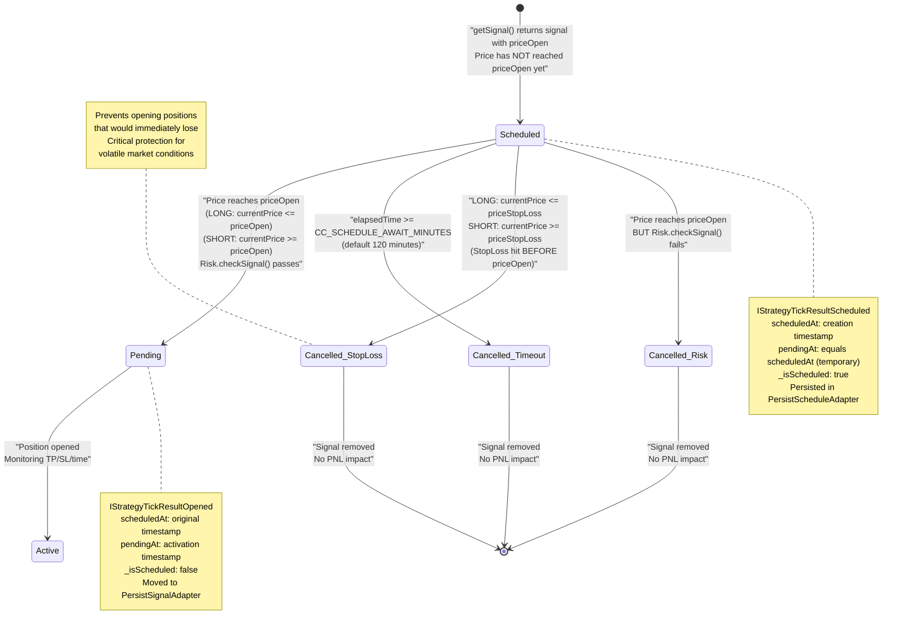
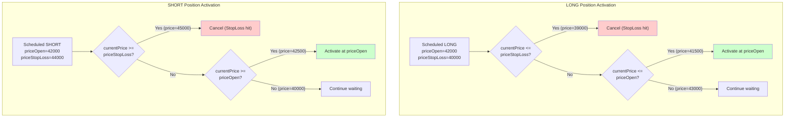
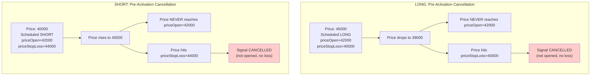
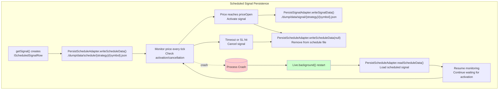
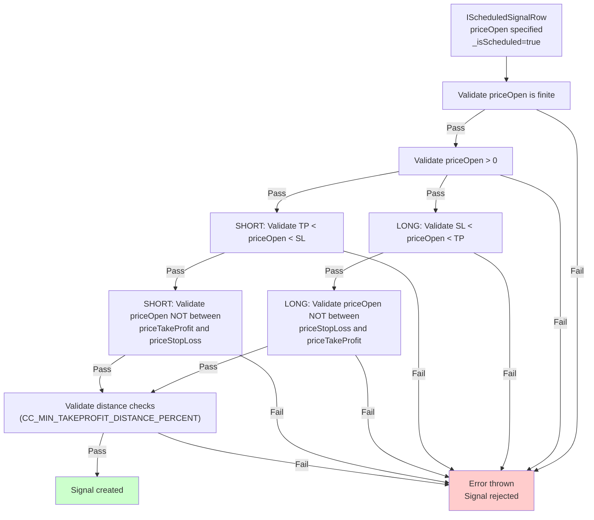

# Scheduled Signals

<details>
<summary>Relevant source files</summary>

The following files were used as context for generating this wiki page:

- [README.md](README.md)
- [src/client/ClientStrategy.ts](src/client/ClientStrategy.ts)
- [src/config/emitters.ts](src/config/emitters.ts)
- [src/function/event.ts](src/function/event.ts)
- [src/index.ts](src/index.ts)
- [src/interfaces/Strategy.interface.ts](src/interfaces/Strategy.interface.ts)
- [test/e2e/defend.test.mjs](test/e2e/defend.test.mjs)
- [test/index.mjs](test/index.mjs)
- [types.d.ts](types.d.ts)

</details>


Scheduled signals are limit orders that wait for price to reach a specific entry point (`priceOpen`) before activating. Unlike immediate signals that open at current market price, scheduled signals remain in a "scheduled" state until market conditions satisfy the entry criteria or the signal is cancelled due to timeout or adverse price movement.

For information about the complete signal lifecycle including other states, see [Signal States](#8.1). For signal generation and validation, see [Signal Generation and Validation](#8.2). For persistence of scheduled signals, see [Signal Persistence](#8.4).

---

## Purpose and Scope

Scheduled signals enable strategies to implement **limit order** behavior, where positions open only when price reaches a favorable entry point. This contrasts with market orders that execute immediately at current price.

**Key characteristics:**
- **Entry delay**: Signal created when `priceOpen` is specified in `ISignalDto`, but position opens only when price reaches `priceOpen`
- **Conditional activation**: Price must reach `priceOpen` before timeout (`CC_SCHEDULE_AWAIT_MINUTES`, default 120 minutes)
- **Pre-activation cancellation**: Signal cancels if `priceStopLoss` is hit before `priceOpen` is reached
- **Dual timestamps**: `scheduledAt` (creation time) and `pendingAt` (activation time) track full lifecycle

**Sources:** [types.d.ts:691-699](), [src/interfaces/Strategy.interface.ts:64-73](), [README.md:30-34]()

---

## Creating Scheduled Signals

A signal becomes scheduled when `getSignal()` returns an `ISignalDto` with `priceOpen` specified. The system determines scheduling based on price conditions at creation time.

### Signal Creation Logic

```typescript
// Immediate signal (opens at current price)
return {
  position: "long",
  // priceOpen omitted - opens immediately
  priceTakeProfit: 43000,
  priceStopLoss: 41000,
  minuteEstimatedTime: 60
};

// Scheduled signal (waits for priceOpen)
return {
  position: "long",
  priceOpen: 42000,  // Waits for price to reach 42000
  priceTakeProfit: 43000,
  priceStopLoss: 41000,
  minuteEstimatedTime: 60
};
```

### Immediate Activation Check

When `priceOpen` is provided, the system checks if it should activate immediately or wait:

| Position | Condition for Immediate Activation | Behavior |
|----------|-----------------------------------|----------|
| `long` | `currentPrice <= priceOpen` | Price already low enough, activate immediately |
| `short` | `currentPrice >= priceOpen` | Price already high enough, activate immediately |

If immediate activation conditions are met, the signal transitions directly to "opened" state, skipping the "scheduled" phase.

**Sources:** [src/client/ClientStrategy.ts:388-443](), [src/interfaces/Strategy.interface.ts:24-39]()

---

## Scheduled Signal Lifecycle



**Key state transitions:**

1. **Scheduled → Pending**: Price reaches `priceOpen` and risk checks pass
2. **Scheduled → Cancelled (Timeout)**: Waiting time exceeds `CC_SCHEDULE_AWAIT_MINUTES`
3. **Scheduled → Cancelled (StopLoss)**: `priceStopLoss` hit before `priceOpen` reached
4. **Scheduled → Cancelled (Risk)**: Price reaches `priceOpen` but risk validation rejects activation

**Sources:** [src/client/ClientStrategy.ts:554-608](), [src/client/ClientStrategy.ts:610-644](), [src/client/ClientStrategy.ts:646-679](), [src/client/ClientStrategy.ts:681-774]()

---

## Activation Logic

### Price-Based Activation Conditions

Scheduled signals activate when market price reaches the specified `priceOpen`. The activation logic differs by position type:



### Activation Priority

**Critical ordering:** StopLoss check has **priority** over activation check. This prevents opening positions that would immediately lose money.

```typescript
// LONG position checks (from CHECK_SCHEDULED_SIGNAL_PRICE_ACTIVATION_FN)
if (scheduled.position === "long") {
  // 1. Check StopLoss FIRST (cancellation takes priority)
  if (currentPrice <= scheduled.priceStopLoss) {
    shouldCancel = true;
  }
  // 2. Check activation only if StopLoss NOT hit
  else if (currentPrice <= scheduled.priceOpen) {
    shouldActivate = true;
  }
}

// SHORT position checks
if (scheduled.position === "short") {
  // 1. Check StopLoss FIRST
  if (currentPrice >= scheduled.priceStopLoss) {
    shouldCancel = true;
  }
  // 2. Check activation only if StopLoss NOT hit
  else if (currentPrice >= scheduled.priceOpen) {
    shouldActivate = true;
  }
}
```

### Activation Timestamp Handling

When activation occurs, `pendingAt` is updated to reflect the actual activation time:

| Mode | Activation Timestamp | Rationale |
|------|---------------------|-----------|
| **Backtest** | `candle.timestamp + 60000` | Next candle after activation candle (precise timing) |
| **Live** | `Date.now()` | Current time when activation detected (approximate timing) |

**Sources:** [src/client/ClientStrategy.ts:610-644](), [src/client/ClientStrategy.ts:681-774](), [test/e2e/defend.test.mjs:26-146]()

---

## Cancellation Logic

Scheduled signals can be cancelled without opening a position in two scenarios: timeout or pre-activation StopLoss hit.

### Timeout Cancellation

Scheduled signals have a maximum waiting period defined by `CC_SCHEDULE_AWAIT_MINUTES` (default: 120 minutes). If `priceOpen` is not reached within this period, the signal is cancelled.

```typescript
// Timeout calculation (from CHECK_SCHEDULED_SIGNAL_TIMEOUT_FN)
const currentTime = execution.context.when.getTime();
const signalTime = scheduled.scheduledAt;
const maxTimeToWait = CC_SCHEDULE_AWAIT_MINUTES * 60 * 1000;
const elapsedTime = currentTime - signalTime;

if (elapsedTime >= maxTimeToWait) {
  // Cancel signal, emit IStrategyTickResultCancelled
  await setScheduledSignal(null);
}
```

**Timeout characteristics:**
- **Grace period**: 120 minutes by default, configurable via `setConfig()`
- **Boundary behavior**: Cancellation occurs when `elapsedTime >= maxTimeToWait` (inclusive)
- **No PNL impact**: Cancelled signals do not affect profit/loss calculations
- **Risk release**: Cancellation frees up risk limits for new signals

### StopLoss Pre-Activation Cancellation

If price moves against the position and hits `priceStopLoss` **before** reaching `priceOpen`, the scheduled signal is cancelled. This prevents opening positions that are already in a losing state.



**Pre-activation cancellation is critical** because it prevents the following scenario:
1. LONG scheduled at priceOpen=42000, StopLoss=40000
2. Price drops directly from 45000 to 39000, **skipping priceOpen**
3. Without cancellation: Signal would activate at 42000, immediately close at 40000 (instant loss)
4. With cancellation: Signal cancelled at 40000, no position opened (no loss)

**Sources:** [src/client/ClientStrategy.ts:554-608](), [src/client/ClientStrategy.ts:646-679](), [test/e2e/defend.test.mjs:446-537](), [test/e2e/defend.test.mjs:1393-1507]()

---

## Timestamps and Duration Tracking

Scheduled signals maintain two distinct timestamps that track the full lifecycle from creation to activation:

| Timestamp | Set At | Purpose | Persists After Activation |
|-----------|--------|---------|---------------------------|
| `scheduledAt` | Signal creation in `GET_SIGNAL_FN` | Records when strategy first generated the signal | ✅ Yes (unchanged) |
| `pendingAt` | Initial: equals `scheduledAt`<br/>Final: activation time | Temporary placeholder until activation, then updated to actual activation time | ✅ Yes (updated) |

### Duration Calculations

The dual-timestamp system enables accurate duration tracking:

```typescript
// Timeout calculation: uses scheduledAt
const waitingTime = currentTime - scheduledAt;
if (waitingTime >= CC_SCHEDULE_AWAIT_MINUTES * 60000) {
  // Cancel after 120 minutes of waiting
}

// Signal lifetime calculation: uses pendingAt
const activeTime = closeTime - pendingAt;
if (activeTime >= minuteEstimatedTime * 60000) {
  // Close by time_expired
}
```

### Why Two Timestamps Matter

**Without separate timestamps:**
- Cannot distinguish between "time waiting for activation" and "time in active position"
- `minuteEstimatedTime` would include waiting period, causing premature time_expired closures
- Backtest statistics would be skewed by activation delays

**With separate timestamps:**
- `scheduledAt` tracks total signal lifetime (creation → closure)
- `pendingAt` tracks active position lifetime (activation → closure)
- `minuteEstimatedTime` only counts against `pendingAt`, not `scheduledAt`

### Timestamp Update on Activation

```typescript
// From ACTIVATE_SCHEDULED_SIGNAL_FN
const activationTime = activationTimestamp;

// Create activated signal with updated pendingAt
const activatedSignal: ISignalRow = {
  ...scheduled,
  pendingAt: activationTime,  // UPDATED from scheduledAt
  _isScheduled: false,
};

await setPendingSignal(activatedSignal);
```

**Sources:** [src/interfaces/Strategy.interface.ts:45-62](), [src/client/ClientStrategy.ts:732-740](), [test/e2e/defend.test.mjs:291-439]()

---

## Persistence and Crash Recovery

Scheduled signals are persisted to disk using `PersistScheduleAdapter`, enabling crash recovery for live trading. This is separate from `PersistSignalAdapter` (for active positions).

### Persistence Architecture



### File Structure

Scheduled signals are stored separately from active signals:

```
./dump/data/
├── schedule/
│   ├── my-strategy/
│   │   ├── BTCUSDT.json      # Scheduled signal for BTCUSDT
│   │   └── ETHUSDT.json      # Scheduled signal for ETHUSDT
│   └── another-strategy/
│       └── BTCUSDT.json
└── signal/
    ├── my-strategy/
    │   └── BTCUSDT.json      # Active position (after activation)
    └── another-strategy/
        └── BTCUSDT.json
```

### Crash Recovery Flow

1. **Live trading running**: Scheduled signal waiting for activation at `priceOpen=42000`
2. **Process crashes**: Signal state is on disk in `./dump/data/schedule/my-strategy/BTCUSDT.json`
3. **Process restarts**: `Live.background()` called again
4. **Restore scheduled signal**: `WAIT_FOR_INIT_FN` loads from `PersistScheduleAdapter`
5. **Resume monitoring**: Signal continues waiting for `priceOpen=42000`
6. **Activation**: When price reaches 42000, signal moves to `PersistSignalAdapter`

### Persistence Implementation Details

| Operation | Function | File | Description |
|-----------|----------|------|-------------|
| Write scheduled | `setScheduledSignal(signal)` | [src/client/ClientStrategy.ts:863-881]() | Atomically write scheduled signal to disk |
| Read scheduled | `readScheduleData()` | [src/classes/Persist.ts]() | Load scheduled signal on restart |
| Delete scheduled | `setScheduledSignal(null)` | [src/client/ClientStrategy.ts:863-881]() | Remove scheduled signal after activation/cancellation |
| Restore on init | `WAIT_FOR_INIT_FN` | [src/client/ClientStrategy.ts:525-551]() | Load scheduled signal from disk on `waitForInit()` |

**Sources:** [src/client/ClientStrategy.ts:491-552](), [src/client/ClientStrategy.ts:863-881](), [src/classes/Persist.ts](), [types.d.ts:166-179]()

---

## Validation Rules

Scheduled signals undergo **additional validation** beyond immediate signals because they must remain valid during the waiting period.

### Scheduled-Specific Validations



### Critical Validation: Position Validity at priceOpen

For LONG positions:
```typescript
// priceOpen must be BETWEEN SL and TP
if (signal.priceOpen <= signal.priceStopLoss) {
  throw new Error(
    `Long scheduled: priceOpen (${signal.priceOpen}) <= priceStopLoss (${signal.priceStopLoss}). ` +
    `Signal would be immediately cancelled on activation.`
  );
}

if (signal.priceOpen >= signal.priceTakeProfit) {
  throw new Error(
    `Long scheduled: priceOpen (${signal.priceOpen}) >= priceTakeProfit (${signal.priceTakeProfit}). ` +
    `Signal would close immediately on activation. This is logically impossible for LONG position.`
  );
}
```

For SHORT positions:
```typescript
// priceOpen must be BETWEEN TP and SL
if (signal.priceOpen >= signal.priceStopLoss) {
  throw new Error(
    `Short scheduled: priceOpen (${signal.priceOpen}) >= priceStopLoss (${signal.priceStopLoss}). ` +
    `Signal would be immediately cancelled on activation.`
  );
}

if (signal.priceOpen <= signal.priceTakeProfit) {
  throw new Error(
    `Short scheduled: priceOpen (${signal.priceOpen}) <= priceTakeProfit (${signal.priceTakeProfit}). ` +
    `Signal would close immediately on activation. This is logically impossible for SHORT position.`
  );
}
```

### Validation Error Messages

| Validation | Error Message | Prevention |
|------------|--------------|------------|
| `priceOpen` not finite | `priceOpen must be a finite number, got NaN` | Prevents math errors during price checks |
| `priceOpen <= 0` | `priceOpen must be positive, got -100` | Prevents invalid negative prices |
| LONG: `priceOpen <= priceStopLoss` | `Signal would be immediately cancelled on activation` | Prevents instant cancellation after activation |
| LONG: `priceOpen >= priceTakeProfit` | `Signal would close immediately on activation` | Prevents impossible LONG logic |
| SHORT: `priceOpen >= priceStopLoss` | `Signal would be immediately cancelled on activation` | Prevents instant cancellation after activation |
| SHORT: `priceOpen <= priceTakeProfit` | `Signal would close immediately on activation` | Prevents impossible SHORT logic |

**Sources:** [src/client/ClientStrategy.ts:144-160](), [src/client/ClientStrategy.ts:234-251](), [test/e2e/defend.test.mjs:543-642]()

---

## Edge Cases and Critical Behaviors

### Edge Case 1: Activation and Immediate Closure on Same Candle

**Scenario:** Scheduled signal activates AND reaches TP/SL within the same 1-minute candle.

```
Candle: open=43000, high=43000, low=40500, close=42500
LONG: priceOpen=41000, priceTakeProfit=42000, priceStopLoss=39000

Sequence:
1. Low=40500 touches priceOpen=41000 → Signal ACTIVATES
2. Close=42500 above priceTakeProfit=42000 → Signal CLOSES by TP
3. Both occur within same candle timestamp
```

**Behavior:**
- Signal emits `IStrategyTickResultOpened` (activation)
- Signal emits `IStrategyTickResultClosed` with `closeReason="take_profit"` (immediate closure)
- `scheduledAt` != `pendingAt` (different timestamps maintained)
- PNL calculated correctly with fees and slippage

**Sources:** [test/e2e/defend.test.mjs:291-439]()

### Edge Case 2: Price Crosses Both TP and SL on Same Candle (After Activation)

**Scenario:** Extreme volatility causes candle to cross both TP and SL after activation.

```
LONG: priceOpen=42000, priceTakeProfit=43000, priceStopLoss=41000
Volatile candle: open=42000, high=43500, low=40500, close=42000

Price path (inferred):
1. Opens at 42000 (position active)
2. Rises to 43500 (above TP=43000)
3. Falls to 40500 (below SL=41000)
```

**Behavior:**
- **TakeProfit has priority**: Signal closes by `take_profit`
- Rationale: When both TP and SL are hit, TP is assumed to have occurred first during the candle
- This is a conservative assumption favoring profitable outcomes
- In backtest mode, this behavior is deterministic

**Sources:** [test/e2e/defend.test.mjs:1520-1653]()

### Edge Case 3: Multiple Scheduled Signals on Same Symbol

**Scenario:** Strategy generates multiple scheduled signals before the first activates.

```
Time T0: Signal1 scheduled (priceOpen=41000)
Time T1: Signal2 scheduled (priceOpen=40500)
Time T2: Signal3 scheduled (priceOpen=40000)
```

**Behavior:**
- **Only one scheduled signal per symbol/strategy**: New scheduled signal **overwrites** previous scheduled signal
- Implementation: `PersistScheduleAdapter` stores single signal per `{strategyName, symbol}` key
- Risk limits prevent multiple simultaneous active positions
- Signals must queue: First signal activates → closes → Second signal can activate

**Critical protection:** Prevents leveraging portfolio beyond risk limits.

**Sources:** [test/e2e/defend.test.mjs:1281-1382](), [src/client/ClientStrategy.ts:863-881]()

### Edge Case 4: Impossible Limit Order Cancellation

**Scenario:** LONG limit order where priceOpen is reached **before** StopLoss.

```
LONG: priceOpen=41000, priceStopLoss=40000
Price drops from 43000:
- At 41000: priceOpen reached → Signal ACTIVATES
- At 40000: priceStopLoss reached → Signal CLOSES by SL

Pre-activation cancellation is IMPOSSIBLE because priceOpen comes first.
```

**Behavior:**
- Signal **activates** at priceOpen=41000 (not cancelled)
- Signal **closes** by `stop_loss` immediately after activation
- PNL is negative (loss recorded)
- **This is correct behavior** for limit orders: Entry price reached first, then position lost money

**Critical distinction:**
- **Pre-activation cancellation**: Price skips priceOpen entirely, hits SL first → cancelled, no loss
- **Post-activation closure**: Price reaches priceOpen first, then hits SL → activated then closed, loss recorded

**Sources:** [test/e2e/defend.test.mjs:26-146](), [test/e2e/defend.test.mjs:158-278]()

### Edge Case 5: Timeout Boundary Condition

**Scenario:** Scheduled signal reaches exactly `CC_SCHEDULE_AWAIT_MINUTES` (120 minutes).

```
scheduledAt: 2024-01-01 00:00:00
currentTime: 2024-01-01 02:00:00
elapsedTime: 120 minutes

Condition: elapsedTime >= maxTimeToWait
```

**Behavior:**
- **Inclusive boundary**: `>=` means timeout occurs at **exactly** 120 minutes
- Signal cancelled with `IStrategyTickResultCancelled` emitted
- Close timestamp equals current time (120 minutes after scheduled)
- Risk limits released (position count decremented)

**Sources:** [test/e2e/defend.test.mjs:446-537](), [src/client/ClientStrategy.ts:554-608]()

---

## Code Entity Reference

### Key Types

| Type | File | Purpose |
|------|------|---------|
| `IScheduledSignalRow` | [src/interfaces/Strategy.interface.ts:64-73]() | Scheduled signal row (extends `ISignalRow` with required `priceOpen`) |
| `IStrategyTickResultScheduled` | [types.d.ts:788-807]() | Tick result when signal is in scheduled state |
| `IStrategyTickResultCancelled` | [types.d.ts:867-895]() | Tick result when scheduled signal is cancelled |

### Key Functions

| Function | File | Purpose |
|----------|------|---------|
| `GET_SIGNAL_FN` | [src/client/ClientStrategy.ts:332-476]() | Determines if signal should be immediate or scheduled based on `priceOpen` |
| `CHECK_SCHEDULED_SIGNAL_TIMEOUT_FN` | [src/client/ClientStrategy.ts:554-608]() | Checks if scheduled signal has exceeded timeout limit |
| `CHECK_SCHEDULED_SIGNAL_PRICE_ACTIVATION_FN` | [src/client/ClientStrategy.ts:610-644]() | Determines if scheduled signal should activate or cancel based on price |
| `CANCEL_SCHEDULED_SIGNAL_BY_STOPLOSS_FN` | [src/client/ClientStrategy.ts:646-679]() | Cancels scheduled signal when StopLoss hit before activation |
| `ACTIVATE_SCHEDULED_SIGNAL_FN` | [src/client/ClientStrategy.ts:681-774]() | Activates scheduled signal when priceOpen is reached |
| `setScheduledSignal` | [src/client/ClientStrategy.ts:863-881]() | Persists scheduled signal to disk via `PersistScheduleAdapter` |
| `WAIT_FOR_INIT_FN` | [src/client/ClientStrategy.ts:525-551]() | Restores scheduled signal from disk on crash recovery |

### Key Classes

| Class | File | Purpose |
|-------|------|---------|
| `ClientStrategy` | [src/client/ClientStrategy.ts]() | Implements signal lifecycle including scheduled signal management |
| `PersistScheduleAdapter` | [src/classes/Persist.ts]() | Persists scheduled signals to `./dump/data/schedule/` for crash recovery |

### Configuration Parameters

| Parameter | Default | File | Purpose |
|-----------|---------|------|---------|
| `CC_SCHEDULE_AWAIT_MINUTES` | `120` | [src/config/params.ts]() | Maximum waiting time for scheduled signal before timeout cancellation |
| `CC_MIN_TAKEPROFIT_DISTANCE_PERCENT` | Configurable | [src/config/params.ts]() | Minimum distance between priceOpen and priceTakeProfit |
| `CC_MIN_STOPLOSS_DISTANCE_PERCENT` | Configurable | [src/config/params.ts]() | Minimum distance between priceOpen and priceStopLoss |

**Sources:** [src/client/ClientStrategy.ts](), [src/classes/Persist.ts](), [src/config/params.ts](), [types.d.ts]()