# Custom Persistence Backends

## Purpose and Scope

This page explains how to implement custom persistence backends for signal storage in Backtest Kit. The default framework uses file-based atomic writes, but you can extend it to use Redis, MongoDB, PostgreSQL, or any other storage system by implementing the `PersistBase` interface.

For information about the built-in persistence system and crash recovery mechanisms, see [Crash Recovery & Persistence](./46_advanced-features.md). For general signal lifecycle concepts, see [Signals & Signal Lifecycle](./08_core-concepts.md).

---

## Persistence Architecture Overview

The persistence layer in Backtest Kit follows a pluggable adapter pattern, allowing custom storage backends to be seamlessly integrated without modifying core framework code.

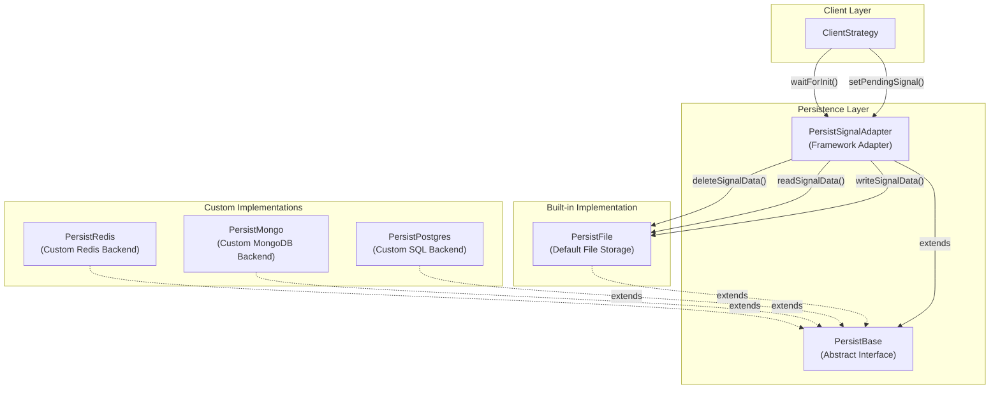

**Persistence Architecture**

The `ClientStrategy` class uses `PersistSignalAdapter` for all persistence operations. The adapter delegates to a `PersistBase` implementation, which can be the default file-based storage or a custom backend. The adapter provides:

- **Atomic Operations**: Ensures signals are never partially written or lost
- **Crash Recovery**: Restores state via `waitForInit()` on live trading startup
- **Lazy Initialization**: Defers I/O until first signal is opened
- **Error Handling**: Propagates storage errors to the event system

Sources: High-level diagrams from context, [docs/internals.md]()

---

## The PersistBase Interface

Custom persistence backends must implement the `PersistBase` interface, which defines three core methods for signal lifecycle management:

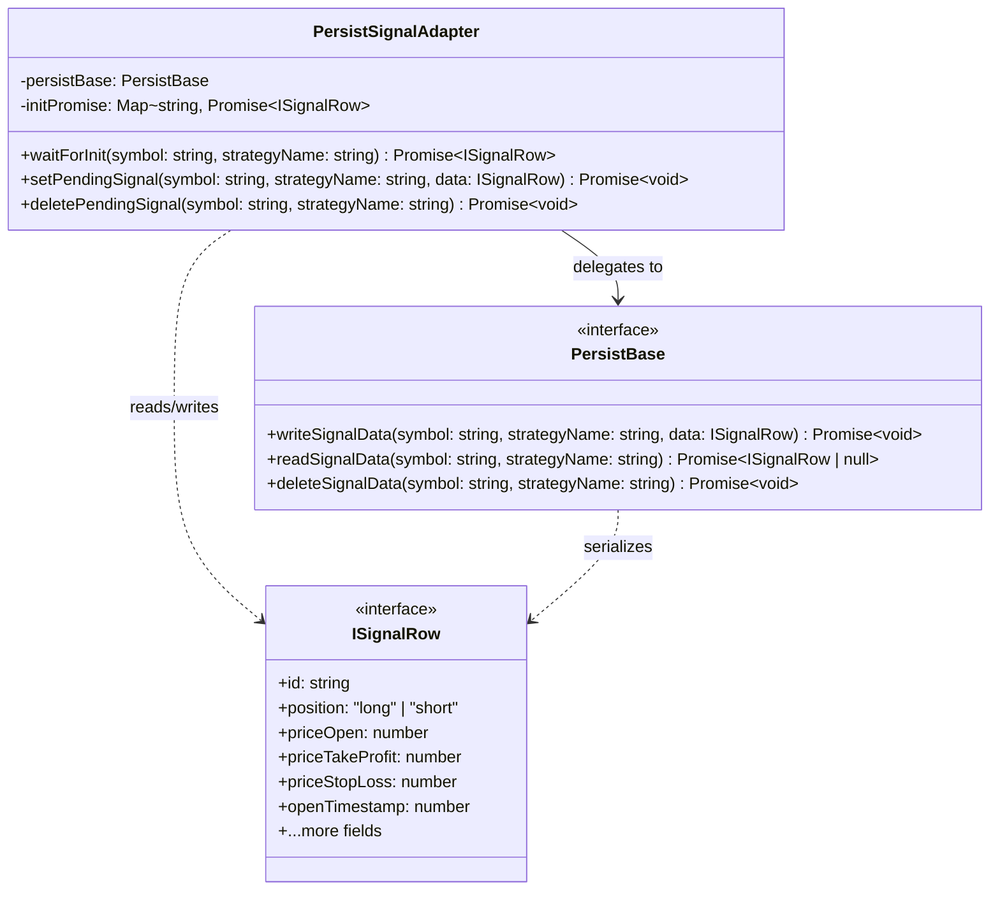

**PersistBase Interface Contract**

### Method Signatures

| Method | Purpose | Atomicity Requirement |
|--------|---------|----------------------|
| `writeSignalData()` | Persist an opened signal to storage | Must be atomic - no partial writes |
| `readSignalData()` | Load persisted signal on startup | Must return `null` if not found |
| `deleteSignalData()` | Remove closed signal from storage | Must be idempotent |

### Key Considerations

The interface uses a **composite key** of `(symbol, strategyName)` because:
- Only one active signal per symbol-strategy pair is allowed
- This prevents duplicate position entries
- Enables efficient lookup without scanning all records

The `ISignalRow` type contains all signal state:
- Entry/exit prices (`priceOpen`, `priceTakeProfit`, `priceStopLoss`)
- Timestamps (`openTimestamp`, `minuteEstimatedTime`)
- Position direction (`position: "long" | "short"`)
- Unique identifier (`id`)

Implementations must serialize/deserialize this object correctly, preserving numeric precision for prices.

Sources: [docs/internals.md](), High-level architecture diagrams

---

## Built-in File-Based Persistence

The default `PersistFile` implementation provides a reference for custom backends:

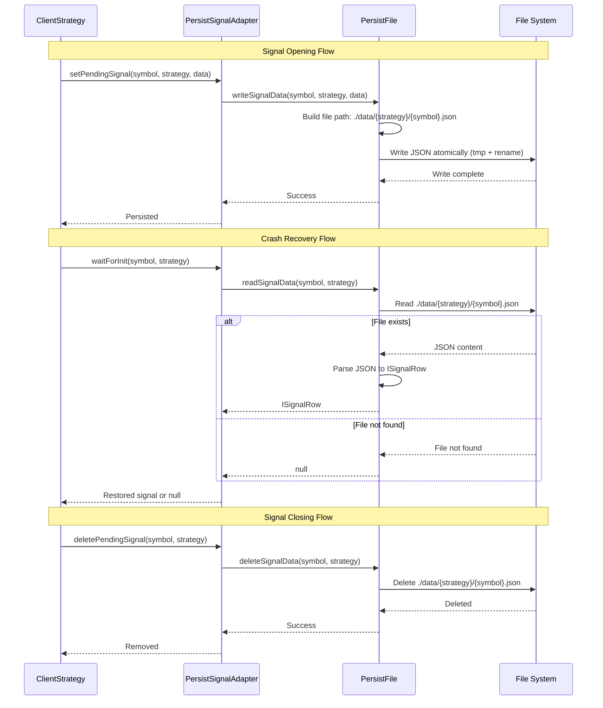

**File-Based Persistence Flow**

### Atomic Write Strategy

The file-based implementation uses a **write-to-temporary-then-rename** pattern:
1. Write new data to `{symbol}.json.tmp`
2. Call `fsync()` to ensure data reaches disk
3. Rename `{symbol}.json.tmp` to `{symbol}.json` (atomic operation on POSIX systems)
4. This prevents partial writes if the process crashes mid-write

### Directory Structure

```
./data/
├── strategy1/
│   ├── BTCUSDT.json
│   └── ETHUSDT.json
└── strategy2/
    └── BTCUSDT.json
```

Each strategy gets its own directory to organize signals. The composite key `(strategyName, symbol)` maps to the file path.

Sources: [docs/internals.md](), README.md references to crash-safe persistence

---

## Implementing a Custom Backend

### Redis Implementation Example

Redis is ideal for live trading due to its speed and built-in data expiration features:

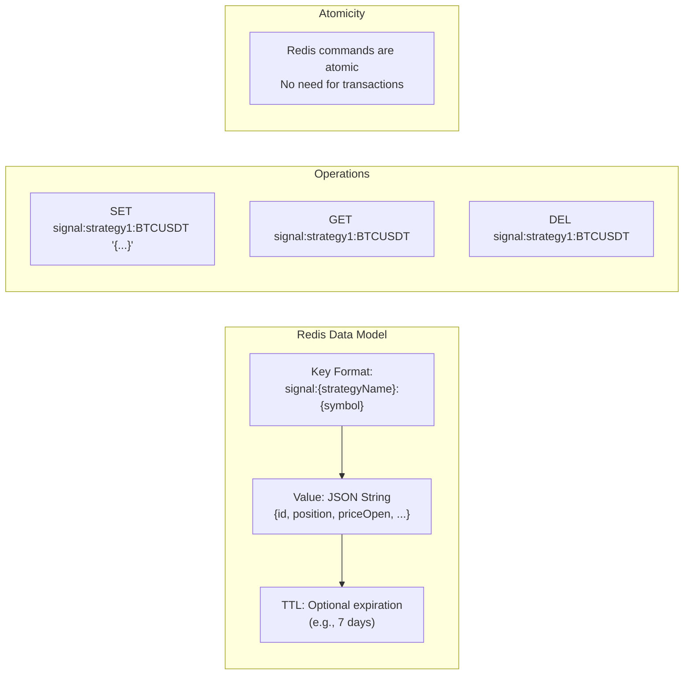

**Redis Persistence Schema**

#### Implementation Pattern

```typescript
// Hypothetical implementation - not actual framework code
class PersistRedis extends PersistBase {
  
  constructor(private redisClient: RedisClient, private ttlSeconds?: number) {
    super();
  }
  
  async writeSignalData(
    symbol: string,
    strategyName: string,
    data: ISignalRow
  ): Promise<void> {
    const key = `signal:${strategyName}:${symbol}`;
    const value = JSON.stringify(data);
    
    if (this.ttlSeconds) {
      // Set with expiration to auto-cleanup old signals
      await this.redisClient.setex(key, this.ttlSeconds, value);
    } else {
      await this.redisClient.set(key, value);
    }
  }
  
  async readSignalData(
    symbol: string,
    strategyName: string
  ): Promise<ISignalRow | null> {
    const key = `signal:${strategyName}:${symbol}`;
    const value = await this.redisClient.get(key);
    
    if (!value) {
      return null;
    }
    
    return JSON.parse(value) as ISignalRow;
  }
  
  async deleteSignalData(
    symbol: string,
    strategyName: string
  ): Promise<void> {
    const key = `signal:${strategyName}:${symbol}`;
    await this.redisClient.del(key);
  }
}
```

#### Key Design Decisions

| Aspect | Decision | Rationale |
|--------|----------|-----------|
| Key Format | `signal:{strategy}:{symbol}` | Clear namespace, easy pattern matching |
| Serialization | JSON string | Compatible with `ISignalRow` structure |
| TTL | Optional expiration | Auto-cleanup for abandoned signals |
| Atomicity | Native Redis commands | `SET`/`GET`/`DEL` are inherently atomic |
| Error Handling | Throw on connection failure | Framework propagates to `errorEmitter` |

#### Connection Management

```typescript
// Example connection setup
import Redis from 'ioredis';

const redisClient = new Redis({
  host: process.env.REDIS_HOST,
  port: parseInt(process.env.REDIS_PORT),
  password: process.env.REDIS_PASSWORD,
  retryStrategy: (times) => Math.min(times * 50, 2000),
  // Reconnect automatically
});

const persistRedis = new PersistRedis(redisClient, 7 * 24 * 3600); // 7-day TTL
```

Sources: Architecture diagrams, general Redis best practices

---

### MongoDB Implementation Example

MongoDB provides rich query capabilities and automatic schema evolution:

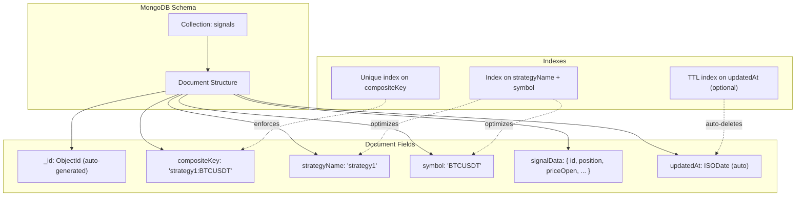

**MongoDB Document Schema**

#### Implementation Pattern

```typescript
// Hypothetical implementation
import { MongoClient, Collection } from 'mongodb';

class PersistMongo extends PersistBase {
  private collection: Collection;
  
  constructor(mongoClient: MongoClient, dbName: string) {
    super();
    this.collection = mongoClient.db(dbName).collection('signals');
    this.ensureIndexes();
  }
  
  private async ensureIndexes(): Promise<void> {
    // Unique index on composite key to prevent duplicates
    await this.collection.createIndex(
      { compositeKey: 1 },
      { unique: true }
    );
    
    // Optional TTL index for auto-cleanup (7 days)
    await this.collection.createIndex(
      { updatedAt: 1 },
      { expireAfterSeconds: 7 * 24 * 3600 }
    );
  }
  
  async writeSignalData(
    symbol: string,
    strategyName: string,
    data: ISignalRow
  ): Promise<void> {
    const compositeKey = `${strategyName}:${symbol}`;
    
    // Use upsert for atomic write-or-update
    await this.collection.updateOne(
      { compositeKey },
      {
        $set: {
          strategyName,
          symbol,
          signalData: data,
          updatedAt: new Date(),
        },
      },
      { upsert: true }
    );
  }
  
  async readSignalData(
    symbol: string,
    strategyName: string
  ): Promise<ISignalRow | null> {
    const compositeKey = `${strategyName}:${symbol}`;
    
    const doc = await this.collection.findOne({ compositeKey });
    
    if (!doc) {
      return null;
    }
    
    return doc.signalData as ISignalRow;
  }
  
  async deleteSignalData(
    symbol: string,
    strategyName: string
  ): Promise<void> {
    const compositeKey = `${strategyName}:${symbol}`;
    
    await this.collection.deleteOne({ compositeKey });
  }
}
```

#### Upsert Strategy

The MongoDB implementation uses **upsert** (update-or-insert) for atomic writes:
- If document exists with matching `compositeKey`, update it
- If document doesn't exist, insert new document
- This prevents race conditions between read-check-write operations

#### Indexing Strategy

| Index | Type | Purpose |
|-------|------|---------|
| `compositeKey` | Unique | Enforce one signal per strategy-symbol pair |
| `strategyName + symbol` | Compound | Optimize queries by both fields |
| `updatedAt` | TTL | Auto-delete signals after 7 days |

The TTL index uses MongoDB's native expiration feature to clean up abandoned signals automatically.

Sources: MongoDB best practices, [docs/internals.md]()

---

### PostgreSQL Implementation Example

PostgreSQL provides ACID guarantees and relational integrity:

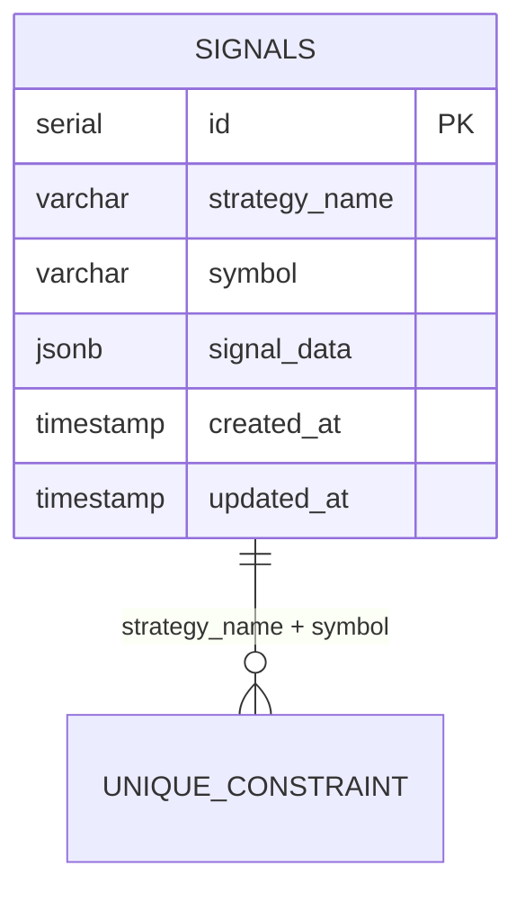

**PostgreSQL Table Schema**

#### Implementation Pattern

```typescript
// Hypothetical implementation
import { Pool } from 'pg';

class PersistPostgres extends PersistBase {
  private pool: Pool;
  
  constructor(pool: Pool) {
    super();
    this.pool = pool;
    this.ensureTable();
  }
  
  private async ensureTable(): Promise<void> {
    await this.pool.query(`
      CREATE TABLE IF NOT EXISTS signals (
        id SERIAL PRIMARY KEY,
        strategy_name VARCHAR(255) NOT NULL,
        symbol VARCHAR(50) NOT NULL,
        signal_data JSONB NOT NULL,
        created_at TIMESTAMP DEFAULT CURRENT_TIMESTAMP,
        updated_at TIMESTAMP DEFAULT CURRENT_TIMESTAMP,
        UNIQUE(strategy_name, symbol)
      );
      
      CREATE INDEX IF NOT EXISTS idx_signals_composite 
        ON signals(strategy_name, symbol);
    `);
  }
  
  async writeSignalData(
    symbol: string,
    strategyName: string,
    data: ISignalRow
  ): Promise<void> {
    // Use ON CONFLICT for upsert behavior
    await this.pool.query(
      `
      INSERT INTO signals (strategy_name, symbol, signal_data, updated_at)
      VALUES ($1, $2, $3, CURRENT_TIMESTAMP)
      ON CONFLICT (strategy_name, symbol)
      DO UPDATE SET 
        signal_data = EXCLUDED.signal_data,
        updated_at = CURRENT_TIMESTAMP
      `,
      [strategyName, symbol, JSON.stringify(data)]
    );
  }
  
  async readSignalData(
    symbol: string,
    strategyName: string
  ): Promise<ISignalRow | null> {
    const result = await this.pool.query(
      `
      SELECT signal_data 
      FROM signals 
      WHERE strategy_name = $1 AND symbol = $2
      `,
      [strategyName, symbol]
    );
    
    if (result.rows.length === 0) {
      return null;
    }
    
    return result.rows[0].signal_data as ISignalRow;
  }
  
  async deleteSignalData(
    symbol: string,
    strategyName: string
  ): Promise<void> {
    await this.pool.query(
      `
      DELETE FROM signals 
      WHERE strategy_name = $1 AND symbol = $2
      `,
      [strategyName, symbol]
    );
  }
}
```

#### Transaction Considerations

PostgreSQL's `ON CONFLICT` clause provides **atomic upsert** behavior without explicit transactions. For more complex scenarios (e.g., multi-signal operations), you can use explicit transactions:

```typescript
async writeMultipleSignals(signals: Array<{
  symbol: string;
  strategyName: string;
  data: ISignalRow;
}>): Promise<void> {
  const client = await this.pool.connect();
  
  try {
    await client.query('BEGIN');
    
    for (const { symbol, strategyName, data } of signals) {
      await client.query(
        `INSERT INTO signals ... ON CONFLICT ... DO UPDATE ...`,
        [strategyName, symbol, JSON.stringify(data)]
      );
    }
    
    await client.query('COMMIT');
  } catch (error) {
    await client.query('ROLLBACK');
    throw error;
  } finally {
    client.release();
  }
}
```

Sources: PostgreSQL documentation, SQL best practices

---

## Integration with the Framework

To use a custom persistence backend, you need to instantiate your implementation and pass it to the framework during initialization:

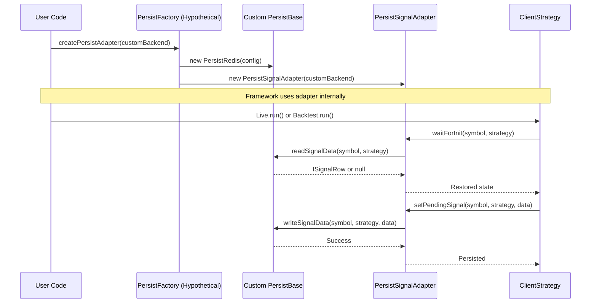

**Custom Backend Integration Flow**

### Configuration Pattern

The framework typically accepts custom persistence backends through configuration or dependency injection. Here's a conceptual integration approach:

```typescript
// Example configuration approach (not actual framework code)
import { setConfig, Live } from 'backtest-kit';
import { PersistRedis } from './persist-redis';
import Redis from 'ioredis';

// Initialize your custom backend
const redisClient = new Redis({
  host: process.env.REDIS_HOST,
  port: parseInt(process.env.REDIS_PORT),
});

const persistRedis = new PersistRedis(redisClient, 7 * 24 * 3600);

// Configure framework to use custom backend
setConfig({
  persistAdapter: persistRedis, // Hypothetical configuration option
});

// Now all live trading will use Redis for persistence
Live.background('BTCUSDT', {
  strategyName: 'my-strategy',
  exchangeName: 'binance',
});
```

### Adapter Instantiation

The framework's `PersistSignalAdapter` wraps your custom backend:

| Component | Responsibility |
|-----------|----------------|
| `PersistSignalAdapter` | Provides lazy initialization, caching, and error handling |
| Custom `PersistBase` | Implements actual storage operations (read/write/delete) |
| `ClientStrategy` | Consumes adapter for signal persistence |

The adapter handles:
- **Lazy Loading**: Only reads from storage when first signal opens
- **Caching**: Stores `initPromise` to prevent duplicate reads
- **Error Propagation**: Emits errors to `errorEmitter` if storage fails

### Environment-Specific Configuration

Different persistence backends for different environments:

```typescript
// Production: Redis for speed
if (process.env.NODE_ENV === 'production') {
  setConfig({
    persistAdapter: new PersistRedis(redisClient),
  });
}

// Staging: MongoDB for analysis
else if (process.env.NODE_ENV === 'staging') {
  setConfig({
    persistAdapter: new PersistMongo(mongoClient, 'backtest_staging'),
  });
}

// Development: File-based (default)
else {
  // No configuration needed - uses built-in PersistFile
}
```

Sources: [docs/internals.md](), README.md configuration examples

---

## Best Practices

### Atomicity Requirements

All persistence operations must be **atomic** to prevent data corruption during crashes:

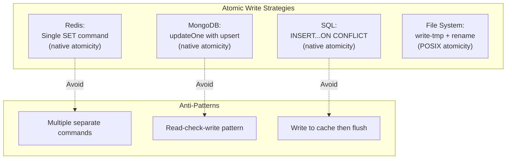

**Atomic Write Strategies by Backend**

#### Why Atomicity Matters

Consider this crash scenario:

1. Signal opens, framework writes `priceOpen = 50000`
2. Process crashes mid-write
3. On restart, framework reads **partial data** with corrupt price
4. Strategy makes incorrect TP/SL calculations
5. Real money is lost due to bad position sizing

Atomic writes prevent this by ensuring **all-or-nothing** semantics - either the entire signal is persisted correctly, or nothing is written.

#### Testing Atomicity

```typescript
// Hypothetical test approach
async function testAtomicity(persist: PersistBase) {
  const signal: ISignalRow = {
    id: 'test-123',
    position: 'long',
    priceOpen: 50000,
    priceTakeProfit: 51000,
    priceStopLoss: 49500,
    // ... more fields
  };
  
  // Start write operation
  const writePromise = persist.writeSignalData('BTCUSDT', 'test-strategy', signal);
  
  // Simulate crash by killing process mid-write
  // (In real tests, use process signals or container restarts)
  
  // After restart, read should return either:
  // 1. Complete signal (if write finished before crash)
  // 2. null (if write hadn't started)
  // Never partial/corrupted data
  const restored = await persist.readSignalData('BTCUSDT', 'test-strategy');
  
  assert(restored === null || deepEqual(restored, signal));
}
```

Sources: [docs/internals.md](), crash recovery patterns

---

### Error Handling Strategy

Persistence failures should be **propagated** to the framework's event system, not silently swallowed:

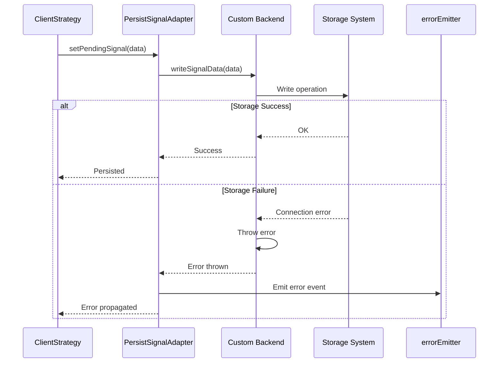

**Error Handling Flow**

#### Implementation Pattern

```typescript
class PersistRedis extends PersistBase {
  async writeSignalData(
    symbol: string,
    strategyName: string,
    data: ISignalRow
  ): Promise<void> {
    const key = `signal:${strategyName}:${symbol}`;
    
    try {
      await this.redisClient.set(key, JSON.stringify(data));
    } catch (error) {
      // Wrap with context for better debugging
      throw new Error(
        `Failed to persist signal for ${strategyName}:${symbol} - ${error.message}`
      );
    }
  }
}
```

#### Error Categories

| Error Type | Handling | Retry Strategy |
|------------|----------|----------------|
| Connection timeout | Throw immediately | Let framework retry with exponential backoff |
| Serialization error | Throw immediately | Don't retry - fix data schema |
| Disk full / quota exceeded | Throw immediately | Alert operator, don't retry |
| Temporary network issue | Throw immediately | Framework retries automatically |

The framework's `errorEmitter` allows monitoring these failures:

```typescript
import { listenError } from 'backtest-kit';

listenError((error) => {
  if (error.message.includes('Failed to persist')) {
    // Send alert to ops team
    sendAlert('Persistence failure detected', error);
  }
});
```

Sources: [docs/internals.md](), event system architecture

---

### Performance Considerations

Custom backends must handle **high-frequency writes** during backtests and **low-latency reads** during live trading:

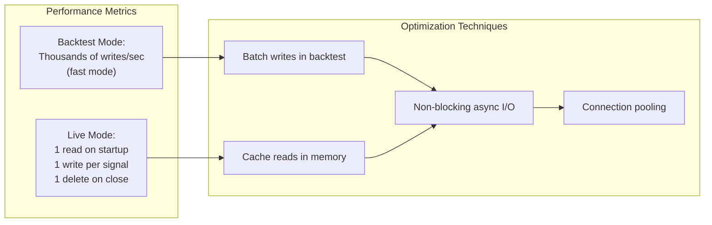

**Performance Optimization Strategies**

#### Backtest Mode Optimization

During backtests, signals open and close rapidly. Consider **batch writes**:

```typescript
class PersistRedisBatched extends PersistBase {
  private writeQueue: Array<{ symbol: string; strategy: string; data: ISignalRow }> = [];
  private flushTimer: NodeJS.Timeout | null = null;
  
  async writeSignalData(
    symbol: string,
    strategyName: string,
    data: ISignalRow
  ): Promise<void> {
    // Queue write instead of executing immediately
    this.writeQueue.push({ symbol, strategy: strategyName, data });
    
    // Flush every 100ms or 100 items
    if (this.writeQueue.length >= 100) {
      await this.flush();
    } else if (!this.flushTimer) {
      this.flushTimer = setTimeout(() => this.flush(), 100);
    }
  }
  
  private async flush(): Promise<void> {
    if (this.writeQueue.length === 0) return;
    
    const pipeline = this.redisClient.pipeline();
    
    for (const { symbol, strategy, data } of this.writeQueue) {
      const key = `signal:${strategy}:${symbol}`;
      pipeline.set(key, JSON.stringify(data));
    }
    
    await pipeline.exec();
    this.writeQueue = [];
    
    if (this.flushTimer) {
      clearTimeout(this.flushTimer);
      this.flushTimer = null;
    }
  }
}
```

**Warning**: Batching sacrifices atomicity. Only use for backtests, never for live trading.

#### Connection Pooling

Reuse database connections to avoid connection overhead:

```typescript
// PostgreSQL example with connection pooling
import { Pool } from 'pg';

const pool = new Pool({
  host: process.env.DB_HOST,
  port: parseInt(process.env.DB_PORT),
  database: process.env.DB_NAME,
  user: process.env.DB_USER,
  password: process.env.DB_PASSWORD,
  max: 20, // Maximum 20 connections in pool
  idleTimeoutMillis: 30000,
  connectionTimeoutMillis: 2000,
});

const persist = new PersistPostgres(pool);
```

#### Benchmarking

Measure your backend performance:

```typescript
async function benchmarkBackend(persist: PersistBase) {
  const iterations = 10000;
  
  // Write benchmark
  const writeStart = Date.now();
  for (let i = 0; i < iterations; i++) {
    await persist.writeSignalData(
      'BTCUSDT',
      `strategy${i}`,
      createMockSignal()
    );
  }
  const writeTime = Date.now() - writeStart;
  console.log(`Write: ${iterations / (writeTime / 1000)} ops/sec`);
  
  // Read benchmark
  const readStart = Date.now();
  for (let i = 0; i < iterations; i++) {
    await persist.readSignalData('BTCUSDT', `strategy${i}`);
  }
  const readTime = Date.now() - readStart;
  console.log(`Read: ${iterations / (readTime / 1000)} ops/sec`);
}
```

Target performance for live trading:
- **Reads**: < 10ms per operation
- **Writes**: < 50ms per operation
- **Deletes**: < 50ms per operation

Sources: Performance optimization patterns, [docs/internals.md]()

---

## Testing Your Implementation

Comprehensive testing ensures your custom backend handles crash recovery correctly:

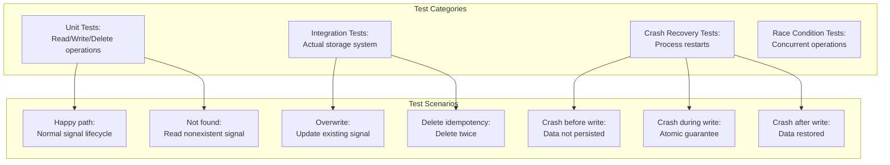

**Test Coverage Matrix**

### Unit Test Example

```typescript
import { describe, it, assert } from 'your-test-framework';
import { PersistRedis } from './persist-redis';
import Redis from 'ioredis-mock'; // Use mock for unit tests

describe('PersistRedis', () => {
  it('should write and read signal data', async () => {
    const redis = new Redis();
    const persist = new PersistRedis(redis);
    
    const signal: ISignalRow = {
      id: 'test-123',
      position: 'long',
      priceOpen: 50000,
      priceTakeProfit: 51000,
      priceStopLoss: 49500,
      openTimestamp: Date.now(),
      minuteEstimatedTime: 60,
    };
    
    // Write signal
    await persist.writeSignalData('BTCUSDT', 'strategy1', signal);
    
    // Read it back
    const restored = await persist.readSignalData('BTCUSDT', 'strategy1');
    
    assert.deepEqual(restored, signal);
  });
  
  it('should return null for nonexistent signal', async () => {
    const redis = new Redis();
    const persist = new PersistRedis(redis);
    
    const restored = await persist.readSignalData('ETHUSDT', 'strategy2');
    
    assert.equal(restored, null);
  });
  
  it('should overwrite existing signal', async () => {
    const redis = new Redis();
    const persist = new PersistRedis(redis);
    
    const signal1: ISignalRow = { /* ... */ priceOpen: 50000 };
    const signal2: ISignalRow = { /* ... */ priceOpen: 51000 };
    
    await persist.writeSignalData('BTCUSDT', 'strategy1', signal1);
    await persist.writeSignalData('BTCUSDT', 'strategy1', signal2);
    
    const restored = await persist.readSignalData('BTCUSDT', 'strategy1');
    
    assert.equal(restored.priceOpen, 51000);
  });
  
  it('should be idempotent for delete', async () => {
    const redis = new Redis();
    const persist = new PersistRedis(redis);
    
    const signal: ISignalRow = { /* ... */ };
    
    await persist.writeSignalData('BTCUSDT', 'strategy1', signal);
    await persist.deleteSignalData('BTCUSDT', 'strategy1');
    await persist.deleteSignalData('BTCUSDT', 'strategy1'); // Second delete
    
    // Should not throw
  });
});
```

### Integration Test Example

```typescript
describe('PersistRedis Integration', () => {
  let redis: Redis;
  let persist: PersistRedis;
  
  beforeEach(async () => {
    // Use real Redis instance (e.g., in Docker)
    redis = new Redis({
      host: 'localhost',
      port: 6379,
      db: 15, // Use separate DB for tests
    });
    
    persist = new PersistRedis(redis);
    
    // Clean up test data
    await redis.flushdb();
  });
  
  afterEach(async () => {
    await redis.quit();
  });
  
  it('should handle connection failures gracefully', async () => {
    // Disconnect Redis
    await redis.quit();
    
    const signal: ISignalRow = { /* ... */ };
    
    // Should throw meaningful error
    await assert.rejects(
      () => persist.writeSignalData('BTCUSDT', 'strategy1', signal),
      /Connection closed/
    );
  });
  
  it('should survive process restart', async () => {
    const signal: ISignalRow = { /* ... */ };
    
    // Write signal
    await persist.writeSignalData('BTCUSDT', 'strategy1', signal);
    
    // Simulate process restart by creating new connection
    const redis2 = new Redis({ host: 'localhost', port: 6379, db: 15 });
    const persist2 = new PersistRedis(redis2);
    
    // Read from new connection
    const restored = await persist2.readSignalData('BTCUSDT', 'strategy1');
    
    assert.deepEqual(restored, signal);
    
    await redis2.quit();
  });
});
```

### Crash Recovery Test Approach

Testing actual crash scenarios requires process management:

```typescript
import { spawn } from 'child_process';
import { writeFile } from 'fs/promises';

describe('Crash Recovery', () => {
  it('should restore state after crash', async () => {
    // Step 1: Write test script that opens signal and crashes
    const testScript = `
      import { Live } from 'backtest-kit';
      import { PersistRedis } from './persist-redis';
      
      // Configure custom backend
      setConfig({ persistAdapter: new PersistRedis(...) });
      
      // Start live trading
      Live.background('BTCUSDT', { strategyName: 'crash-test', ... });
      
      // Wait for signal to open
      listenSignalLive((event) => {
        if (event.action === 'opened') {
          console.log('SIGNAL_OPENED');
          process.exit(1); // Simulate crash
        }
      });
    `;
    
    await writeFile('/tmp/crash-test.mjs', testScript);
    
    // Step 2: Run script until it crashes
    const proc1 = spawn('node', ['/tmp/crash-test.mjs']);
    await waitForOutput(proc1, 'SIGNAL_OPENED');
    // Process exits with code 1 (crash)
    
    // Step 3: Run again - should restore signal
    const proc2 = spawn('node', ['/tmp/crash-test.mjs']);
    const output = await waitForOutput(proc2, 'SIGNAL_RESTORED');
    assert(output.includes('SIGNAL_RESTORED'));
    
    proc2.kill();
  });
});
```

This approach verifies that:
1. Signal is persisted before crash
2. Signal is loaded on restart via `waitForInit()`
3. Strategy continues monitoring from previous state

Sources: Testing best practices, [docs/internals.md]()

---

## Summary

Custom persistence backends extend Backtest Kit's crash-safe storage to any system:

| Backend | Use Case | Key Benefit |
|---------|----------|-------------|
| **Redis** | High-frequency live trading | Sub-millisecond latency, auto-expiration |
| **MongoDB** | Multi-strategy portfolios | Rich queries, schema evolution |
| **PostgreSQL** | Regulated environments | ACID compliance, relational integrity |
| **File System** | Development/testing | Zero dependencies, easy debugging |

### Implementation Checklist

- [ ] Implement `PersistBase` interface (3 methods)
- [ ] Ensure atomic write operations
- [ ] Handle errors with proper context
- [ ] Test crash recovery scenarios
- [ ] Benchmark performance for your workload
- [ ] Configure environment-specific backends
- [ ] Monitor via `errorEmitter` events

Custom backends integrate seamlessly through the `PersistSignalAdapter`, which handles lazy initialization, caching, and error propagation. The adapter ensures consistent behavior whether using file storage, Redis, or any other backend.

Sources: All previous sections