# Backtesting

## Purpose and Scope

This document describes the backtesting functionality in the backtest-kit framework, which simulates trading strategies against historical market data. Backtesting executes a strategy across a predefined timeframe, generating signals and calculating their profit/loss (PnL) without executing real trades.

This page covers the high-level backtest orchestration, execution flow, and memory-efficient streaming architecture. For detailed API reference, see [Backtest API](./11_Dependency_Injection_System.md). For signal state management, see [Signal Lifecycle](./46_Signal_Lifecycle.md). For timeframe generation specifics, see [Timeframe Generation](./54_Timeframe_Generation.md). For fast-forward simulation mechanics, see [Fast-Forward Simulation](./55_Fast-Forward_Simulation.md).


---

## Overview

Backtesting in this framework operates as a **memory-efficient async generator** that streams closed signals without accumulating results in memory. The system iterates through historical timestamps, evaluates strategy signals at each point, and simulates their outcomes using future candle data.

### Key Characteristics

| Characteristic | Description |
|---------------|-------------|
| **Execution Mode** | Synchronous iteration through historical timestamps |
| **Memory Model** | Streaming generator (yields results incrementally) |
| **Data Source** | Historical OHLCV candles via `ClientExchange` |
| **Signal Processing** | Opens, simulates, and closes signals via `ClientStrategy` |
| **Time Progression** | Controlled by `ClientFrame` timeframe array |
| **Early Termination** | Consumer can break iteration at any time |

### Entry Points

```typescript
// Public API
import { Backtest } from "backtest-kit";

// Run backtest with async iteration
for await (const result of Backtest.run("BTCUSDT", {
  strategyName: "my-strategy",
  exchangeName: "binance-historical",
  frameName: "1d-2023"
})) {
  console.log(result.pnl.pnlPercentage);
}

// Get accumulated report
const report = await Backtest.getReport("my-strategy");
```


---

## Architecture Components

The backtesting system follows the four-layer architecture with clear separation between orchestration, business logic, and cross-cutting concerns.

### Component Diagram


### Component Responsibilities

| Component | File Path | Responsibility |
|-----------|-----------|----------------|
| `BacktestUtils` | [src/classes/Backtest.ts]() | Public API facade with logging |
| `BacktestLogicPublicService` | [src/lib/services/logic/public/BacktestLogicPublicService.ts]() | Context propagation wrapper |
| `BacktestLogicPrivateService` | [src/lib/services/logic/private/BacktestLogicPrivateService.ts]() | Async generator orchestration |
| `BacktestGlobalService` | Service aggregator | Routes to BacktestLogicPublicService |
| `StrategyGlobalService` | Global service layer | Calls `tick()` and `backtest()` on ClientStrategy |
| `ExchangeGlobalService` | Global service layer | Calls `getNextCandles()` on ClientExchange |
| `FrameGlobalService` | Global service layer | Calls `getTimeframe()` on ClientFrame |
| `ClientStrategy` | Business logic | Signal generation, validation, simulation |
| `ClientExchange` | Business logic | Historical candle retrieval |
| `ClientFrame` | Business logic | Timeframe timestamp array generation |


---

## Execution Flow

Backtesting follows a deterministic execution pattern that processes each timestamp sequentially, opening and simulating signals as they occur.

### Sequence Diagram


### Execution Steps

1. **Context Initialization** - [src/lib/services/logic/public/BacktestLogicPublicService.ts:46-66]()
   - `BacktestLogicPublicService` wraps the generator with `MethodContextService`
   - Context contains `strategyName`, `exchangeName`, `frameName`
   - Context is implicitly propagated to all service calls

2. **Timeframe Retrieval** - [src/lib/services/logic/private/BacktestLogicPrivateService.ts:53]()
   - `FrameGlobalService.getTimeframe()` returns array of timestamps
   - Timestamps represent points in historical time to evaluate strategy

3. **Timestamp Iteration** - [src/lib/services/logic/private/BacktestLogicPrivateService.ts:57-118]()
   - Loop through each timestamp in sequential order
   - Index `i` tracks current position in timeframe array

4. **Signal Evaluation** - [src/lib/services/logic/private/BacktestLogicPrivateService.ts:60]()
   - Call `StrategyGlobalService.tick(symbol, when, backtest=true)`
   - Returns `IStrategyTickResult` with discriminated union type

5. **Signal Opening** - [src/lib/services/logic/private/BacktestLogicPrivateService.ts:63-79]()
   - When `result.action === "opened"`, signal requires simulation
   - Fetch future candles via `getNextCandles()` for simulation period
   - `signal.minuteEstimatedTime` determines how many future minutes to fetch

6. **Fast-Forward Simulation** - [src/lib/services/logic/private/BacktestLogicPrivateService.ts:92-97]()
   - Call `StrategyGlobalService.backtest()` with future candles
   - Simulates signal monitoring without iterating every timestamp
   - Always returns `IStrategyTickResultClosed` with PnL

7. **Timestamp Skipping** - [src/lib/services/logic/private/BacktestLogicPrivateService.ts:107-112]()
   - Skip timestamps until `backtestResult.closeTimestamp`
   - Prevents re-evaluating timestamps during active signal period
   - Advances index `i` to resume after signal closes

8. **Result Streaming** - [src/lib/services/logic/private/BacktestLogicPrivateService.ts:114]()
   - `yield backtestResult` streams closed result to consumer
   - Memory-efficient: no array accumulation
   - Consumer can break iteration early


---

## Memory-Efficient Streaming

The backtest system uses async generators to achieve memory efficiency when processing millions of timestamps.

### Streaming vs Accumulation


### Benefits of Streaming

| Benefit | Description |
|---------|-------------|
| **Constant Memory** | Results are not accumulated in memory |
| **Early Termination** | Consumer can break iteration at any point |
| **Progressive Processing** | Results available immediately as they're generated |
| **Large Timeframes** | Can process years of data without memory overflow |

### Early Termination Example

```typescript
// Consumer controls iteration lifetime
for await (const result of Backtest.run("BTCUSDT", context)) {
  console.log(result.pnl.pnlPercentage);
  
  // Early termination based on condition
  if (result.pnl.pnlPercentage < -10) {
    console.log("Stop loss threshold reached");
    break; // Generator is abandoned
  }
}
```


---

## Context Propagation

Backtesting uses `MethodContextService` to implicitly pass configuration context through the call stack without explicit parameters.

### Context Flow Diagram


### Context Structure

The context object passed to `Backtest.run()` contains three schema names:

```typescript
interface IMethodContext {
  strategyName: string;  // Which strategy to execute
  exchangeName: string;  // Which exchange to fetch data from
  frameName: string;     // Which timeframe to iterate through
}
```

### Context Propagation Mechanism

| Step | File | Description |
|------|------|-------------|
| 1. Context Specification | [src/classes/Backtest.ts:37-43]() | User provides context object |
| 2. Context Forwarding | [src/classes/Backtest.ts:49]() | `BacktestUtils.run()` forwards to `BacktestGlobalService` |
| 3. Context Injection | [src/lib/services/logic/public/BacktestLogicPublicService.ts:58-64]() | `BacktestLogicPublicService` wraps generator with `MethodContextService.runAsyncIterator()` |
| 4. Scope Boundary | [src/lib/services/context/MethodContextService.ts:41-45]() | `di-scoped` creates implicit context scope |
| 5. Implicit Retrieval | Service layer | Global/Connection services read context without explicit parameters |


---

## Report Generation

The framework passively accumulates closed signals for reporting via `BacktestMarkdownService`.

### Report Accumulation Flow


### Report Usage

```typescript
// Run backtest (results are accumulated automatically)
for await (const result of Backtest.run("BTCUSDT", {
  strategyName: "my-strategy",
  exchangeName: "binance-historical",
  frameName: "1d-2023"
})) {
  // Process results...
}

// Retrieve accumulated report
const markdown = await Backtest.getReport("my-strategy");
console.log(markdown);

// Save report to disk
await Backtest.dump("my-strategy", "./custom/path");
```

### Report Methods

| Method | File | Description |
|--------|------|-------------|
| `getReport(strategyName)` | [src/classes/Backtest.ts:116-121]() | Returns markdown string with all closed signals |
| `dump(strategyName, path?)` | [src/classes/Backtest.ts:138-147]() | Saves markdown report to filesystem |

For detailed report structure and metrics, see [Markdown Report Generation](./53_Backtest_Execution_Flow.md) and [Performance Metrics](./54_Timeframe_Generation.md).


---

## Background Execution

The `background()` method consumes backtest results without exposing them to the caller, useful for running backtests purely for side effects.

### Background Pattern

```typescript
// Run backtest in background (no yielded results)
const cancel = await Backtest.background("BTCUSDT", {
  strategyName: "my-strategy",
  exchangeName: "binance-historical",
  frameName: "1d-2023"
});

// Results are not returned, but:
// - BacktestMarkdownService still accumulates
// - Event listeners still fire
// - Logging still occurs

// Optional: cancel early
cancel();
```

### Background Implementation

The `background()` method internally consumes the async generator without yielding values:

```typescript
public background = async (symbol: string, context: {...}) => {
  const iterator = this.run(symbol, context);
  let isStopped = false;
  
  const task = async () => {
    while (true) {
      const { done } = await iterator.next();
      if (done || isStopped) break;
    }
  }
  
  task();
  return () => { isStopped = true; }
}
```


---

## Integration with Signal Lifecycle

Backtesting integrates with the signal lifecycle state machine. For complete signal state details, see [Signal Lifecycle](./46_Signal_Lifecycle.md).

### State Transitions in Backtest



### Signal Result Types

| Result Type | Yielded in Backtest? | Description |
|-------------|---------------------|-------------|
| `IStrategyTickResultIdle` | ❌ No | No signal exists |
| `IStrategyTickResultOpened` | ❌ No | Signal opened (internal state) |
| `IStrategyTickResultActive` | ❌ No | Signal monitoring (internal state) |
| `IStrategyTickResultClosed` | ✅ Yes | Signal closed with PnL |

Only closed signals are yielded in backtest mode because opening immediately triggers fast-forward simulation.


---

## Key Design Decisions

### Why Async Generators?

| Decision | Rationale |
|----------|-----------|
| Async generators over arrays | Constant memory usage, early termination support |
| Yield only closed signals | Opening triggers immediate simulation, no active state |
| Skip timestamps during signal | Avoid redundant tick evaluations |
| Stream results immediately | Progressive processing without blocking |

### Why Fast-Forward Simulation?

Instead of iterating every minute during a signal's lifetime, `backtest()` simulates the entire signal outcome in a single call using future candles. This provides:

- **Performance**: O(1) call vs O(N) timestamp iterations
- **Accuracy**: Uses actual historical OHLCV data for simulation
- **Simplicity**: Signal lifecycle managed in one method

For fast-forward simulation details, see [Fast-Forward Simulation](./55_Fast-Forward_Simulation.md).


---

## Usage Examples

### Basic Backtest

```typescript
import { Backtest } from "backtest-kit";

for await (const result of Backtest.run("BTCUSDT", {
  strategyName: "moving-average",
  exchangeName: "binance-historical",
  frameName: "daily-2023"
})) {
  console.log(`Closed at ${result.closeTimestamp}`);
  console.log(`PnL: ${result.pnl.pnlPercentage}%`);
  console.log(`Reason: ${result.closeReason}`);
}
```

### Conditional Termination

```typescript
let totalPnl = 0;

for await (const result of Backtest.run("ETHUSDT", context)) {
  totalPnl += result.pnl.pnlPercentage;
  
  // Stop if cumulative loss exceeds threshold
  if (totalPnl < -20) {
    console.log("Drawdown limit reached");
    break;
  }
}
```

### Report Generation

```typescript
// Run backtest (accumulates results)
for await (const result of Backtest.run("BTCUSDT", context)) {
  // Process results...
}

// Generate report
const report = await Backtest.getReport("moving-average");
console.log(report); // Markdown table with all signals

// Save to disk
await Backtest.dump("moving-average", "./reports");
// Writes to: ./reports/moving-average.md
```

